# A2A Protocol (Google)

::: tip Key Takeaway
- A2A (Agent-to-Agent) is Google's **open protocol** for enabling AI agents from different vendors, frameworks, and platforms to discover each other, communicate, and collaborate on tasks — without sharing internal memory, tools, or prompts
- A2A and MCP solve **different problems**: MCP connects agents to tools and data sources; A2A connects agents to other agents. They are complementary, not competing
- The protocol is built on existing web standards — HTTP, JSON-RPC 2.0, SSE — making it straightforward to implement in any language or framework
:::

## One-Liner Summary

> A2A is an open protocol that lets AI agents from different vendors discover each other via Agent Cards and collaborate through a standardized task lifecycle over plain HTTP and JSON-RPC.

---

## 1. The Problem: Agent Silos

The AI industry has an interoperability crisis. Every major platform builds agents that only talk to their own ecosystem:

- A **Salesforce** agent cannot delegate a subtask to a **Google** agent
- A **LangGraph** orchestrator cannot hand off work to a **CrewAI** crew
- An **enterprise workflow** agent cannot invoke a partner's specialized agent without custom integration code

Each vendor has its own:
- Agent description format
- Communication protocol
- Task lifecycle model
- Authentication scheme

This is the same problem the web had before HTTP standardized communication between servers, or the same problem APIs had before REST and OpenAPI established conventions. Without a common protocol, every agent-to-agent connection is a bespoke integration.

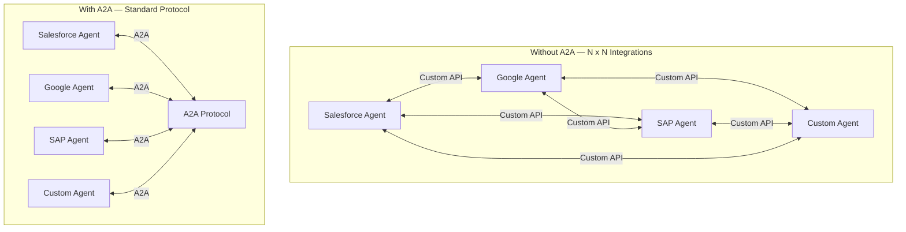

### The Cost of No Standard

| Without A2A | With A2A |
|-------------|----------|
| Custom adapter per vendor pair | Single protocol implementation |
| N x N integration matrix | N integrations total |
| Vendor lock-in for multi-agent systems | Mix-and-match agents from any vendor |
| Proprietary discovery mechanisms | Standard Agent Cards |
| No common error handling | Uniform task lifecycle and error states |

## 2. What is A2A

A2A (Agent-to-Agent) is an **open protocol** published by Google in April 2025 that standardizes how AI agents communicate with each other. It defines:

1. **How agents describe themselves** — Agent Cards (JSON metadata)
2. **How agents discover each other** — well-known URLs and registries
3. **How agents exchange work** — Tasks, Messages, and Artifacts
4. **How agents stream progress** — Server-Sent Events (SSE)
5. **How agents handle long-running work** — Push notifications
6. **How agents authenticate** — Standard HTTP auth mechanisms

The protocol is transport-agnostic in principle but specifies HTTP + JSON-RPC 2.0 as the standard transport. It is designed to work with agents of any sophistication level — from simple API wrappers to complex multi-step reasoning systems.

### Design Principles

Google designed A2A around five principles:

| Principle | What It Means |
|-----------|--------------|
| **Agentic capabilities** | Agents collaborate as peers, not just tools. They can negotiate, delegate, and report progress |
| **Built on existing standards** | HTTP, JSON-RPC 2.0, SSE, OAuth 2.0 — no new transport protocols to learn |
| **Secure by default** | Enterprise-grade auth and authorization from day one |
| **Support for long-running tasks** | Not everything completes in one request. Tasks can run for minutes, hours, or days |
| **Modality agnostic** | Supports text, images, audio, video, structured data, and files |

### Who Backs It

A2A is not a solo Google initiative. As of early 2026, the protocol has backing from 50+ companies including:

- **Cloud/Platform**: Google, Salesforce, SAP, ServiceNow, Workday, Intuit
- **Database/Infrastructure**: MongoDB, Neo4j, Elastic, DataStax, Cloudflare
- **AI/Dev Tools**: LangChain, CrewAI, Weights & Biases, Cohere, Writer
- **Enterprise**: Deloitte, Accenture, BCG, KPMG, Capgemini
- **Other**: PayPal, Box, UKG, C3.ai, Cotiviti

This broad coalition is important — protocols only succeed when they have critical mass adoption.

## 3. A2A vs MCP — Complementary, Not Competing

This is the most common source of confusion. A2A and Anthropic's [Model Context Protocol (MCP)](/ai-ml-engineering/anthropic-claude-api) solve **different layers** of the agent interoperability problem.

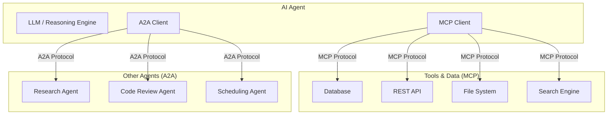

| Dimension | MCP (Model Context Protocol) | A2A (Agent-to-Agent) |
|-----------|------------------------------|----------------------|
| **Purpose** | Connect agents to tools and data | Connect agents to other agents |
| **Relationship** | Client-server (agent calls tool) | Peer-to-peer (agent delegates to agent) |
| **What it exposes** | Functions, data sources, prompts | Agent capabilities, task results |
| **Internal visibility** | Full — agent sees tool schemas and raw responses | Opaque — agent sees only inputs/outputs, not internal reasoning |
| **Analogy** | A person using a hammer (tool) | A person delegating to a colleague (agent) |
| **State model** | Stateless function calls | Stateful task lifecycle |
| **Streaming** | Tool results stream back | Task progress streams back |
| **Published by** | Anthropic | Google |

### Why You Need Both

Consider a travel planning system:

1. The **orchestrator agent** uses **A2A** to delegate to a flight-search agent, a hotel-search agent, and a calendar agent
2. Each specialized agent uses **MCP** to connect to its tools — the flight agent calls an airline API, the hotel agent queries a database, the calendar agent reads Google Calendar
3. The results flow back through **A2A** as task artifacts to the orchestrator

MCP is vertical (agent-to-tool). A2A is horizontal (agent-to-agent). A complete multi-agent system needs both.

::: info MCP and A2A working together
Google and Anthropic have explicitly acknowledged the complementary nature of these protocols. Google's A2A documentation references MCP as the solution for tool connectivity, while A2A handles the agent collaboration layer. Many implementations use MCP-equipped agents that communicate with each other via A2A.
:::

## 4. Core Architecture

A2A defines five primary concepts: **Agent Cards**, **Tasks**, **Messages**, **Parts**, and **Artifacts**.

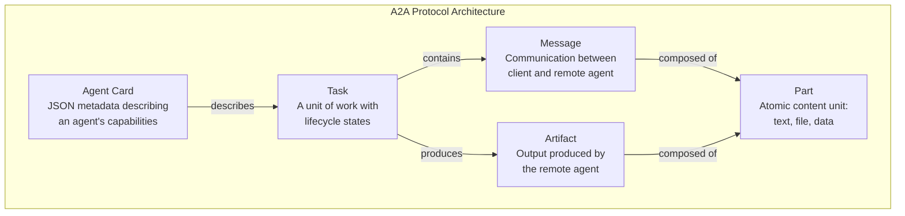

### 4.1 Agent Cards

An Agent Card is a JSON document that describes what an agent can do. Think of it as the OpenAPI spec for agents — it tells clients everything they need to know to interact with an agent before sending any task.

```json
{
  "name": "Research Agent",
  "description": "Deep research agent that synthesizes information from multiple sources",
  "url": "https://research-agent.example.com/a2a",
  "version": "1.0.0",
  "provider": {
    "organization": "Acme Corp",
    "url": "https://acme.example.com"
  },
  "capabilities": {
    "streaming": true,
    "pushNotifications": true,
    "stateTransitionHistory": true
  },
  "authentication": {
    "schemes": ["OAuth2"],
    "credentials": "Bearer token from https://auth.example.com/token"
  },
  "defaultInputModes": ["text/plain", "application/json"],
  "defaultOutputModes": ["text/plain", "text/markdown", "application/pdf"],
  "skills": [
    {
      "id": "web-research",
      "name": "Web Research",
      "description": "Research any topic by searching the web, reading articles, and synthesizing findings into a structured report",
      "tags": ["research", "web", "synthesis"],
      "examples": [
        "Research the current state of quantum computing",
        "Find and compare the top 5 project management tools"
      ]
    },
    {
      "id": "paper-analysis",
      "name": "Academic Paper Analysis",
      "description": "Read and analyze academic papers, extract key findings, and explain them in plain language",
      "tags": ["academic", "papers", "analysis"],
      "examples": [
        "Analyze this arxiv paper and summarize the key contributions"
      ]
    }
  ]
}
```

Key fields in an Agent Card:

| Field | Purpose |
|-------|---------|
| `name`, `description` | Human-readable identity |
| `url` | The A2A endpoint to send tasks to |
| `version` | Semantic version for capability tracking |
| `provider` | Organization that runs this agent |
| `capabilities` | What protocol features this agent supports (streaming, push, history) |
| `authentication` | How to authenticate with this agent |
| `defaultInputModes` | MIME types the agent accepts |
| `defaultOutputModes` | MIME types the agent can produce |
| `skills` | Discrete capabilities the agent offers, with examples |

### 4.2 Agent Discovery

Agents can be discovered in three ways:

**1. Well-Known URL** — Like `.well-known/openid-configuration` for OAuth, agents publish their card at a standard path:

```
GET https://agent.example.com/.well-known/agent.json
```

**2. Agent Registry** — A centralized or federated directory where agents register themselves. Clients query the registry to find agents with specific skills:

```json
{
  "method": "registry/search",
  "params": {
    "query": "research agent",
    "tags": ["web-research", "synthesis"],
    "outputModes": ["text/markdown"]
  }
}
```

**3. Direct Configuration** — The client knows the agent URL ahead of time (hardcoded, environment variable, or config file). This is the simplest approach for internal systems.

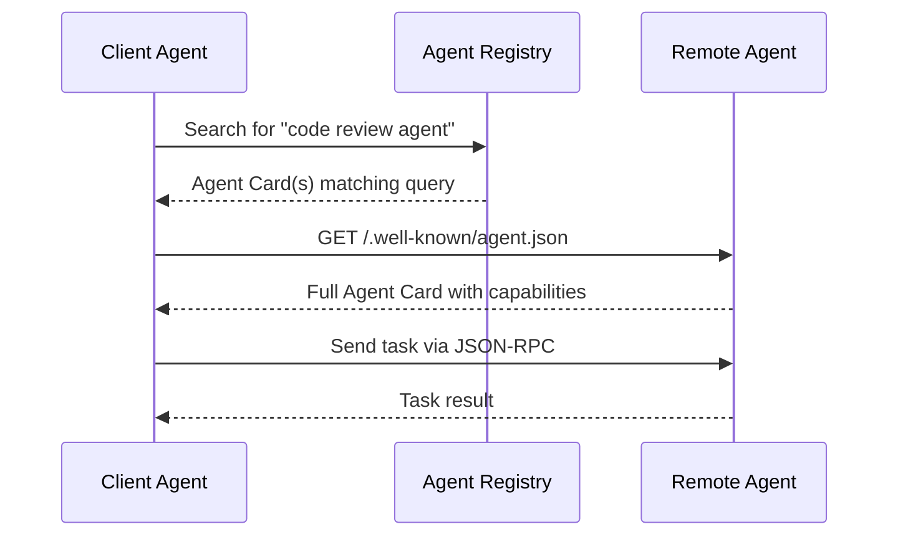

### 4.3 Tasks

A Task is the fundamental unit of work in A2A. When a client agent wants something done, it creates a task and sends it to a remote agent. The task progresses through a defined lifecycle.

```json
{
  "id": "task-abc-123",
  "sessionId": "session-xyz-789",
  "status": {
    "state": "working",
    "message": {
      "role": "agent",
      "parts": [
        {
          "type": "text",
          "text": "Searching for information on quantum computing breakthroughs..."
        }
      ]
    },
    "timestamp": "2026-04-04T10:30:00Z"
  },
  "artifacts": [],
  "history": []
}
```

**Task Fields:**

| Field | Description |
|-------|-------------|
| `id` | Unique task identifier (UUID) |
| `sessionId` | Groups related tasks into a conversation/session |
| `status` | Current state + optional status message |
| `artifacts` | Outputs produced by the agent |
| `history` | Previous messages and state transitions (if capability enabled) |

### 4.4 Messages

Messages are the communication units within a task. Each message has a `role` (either `user` for the client agent or `agent` for the remote agent) and contains one or more Parts.

```json
{
  "role": "user",
  "parts": [
    {
      "type": "text",
      "text": "Analyze the security implications of this code"
    },
    {
      "type": "file",
      "file": {
        "name": "auth.py",
        "mimeType": "text/x-python",
        "bytes": "aW1wb3J0IGp3dA..."
      }
    }
  ]
}
```

### 4.5 Parts

Parts are the atomic content units. A2A supports three part types:

| Part Type | Purpose | Example |
|-----------|---------|---------|
| **TextPart** | Plain text or markdown content | Chat messages, reports, explanations |
| **FilePart** | Binary or text files (inline bytes or URI) | Code files, images, PDFs, datasets |
| **DataPart** | Structured JSON data | API responses, configuration, structured results |

```json
{
  "type": "data",
  "data": {
    "analysis_results": {
      "vulnerabilities_found": 3,
      "severity": "high",
      "details": [
        {"cwe": "CWE-89", "location": "auth.py:42", "description": "SQL injection via unsanitized input"}
      ]
    }
  }
}
```

### 4.6 Artifacts

Artifacts are the outputs of a task — the "deliverables." They are separate from status messages because a single task can produce multiple artifacts of different types.

```json
{
  "name": "Security Audit Report",
  "description": "Full security analysis of the submitted codebase",
  "parts": [
    {
      "type": "text",
      "text": "# Security Audit Report\n\n## Summary\n\nThree high-severity vulnerabilities found..."
    },
    {
      "type": "file",
      "file": {
        "name": "audit-report.pdf",
        "mimeType": "application/pdf",
        "uri": "https://agent.example.com/artifacts/report-abc.pdf"
      }
    },
    {
      "type": "data",
      "data": {
        "total_vulnerabilities": 3,
        "by_severity": {"high": 1, "medium": 1, "low": 1}
      }
    }
  ],
  "index": 0
}
```

## 5. Task Lifecycle

Tasks follow a state machine with well-defined transitions:

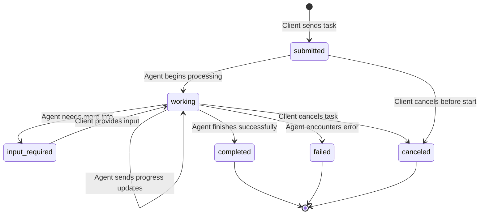

### State Definitions

| State | Meaning | Who Transitions |
|-------|---------|----------------|
| **submitted** | Task received, not yet started | Client creates it |
| **working** | Agent is actively processing | Agent sets this when starting work |
| **input-required** | Agent needs additional input to continue | Agent sets this, client must respond |
| **completed** | Task finished successfully, artifacts available | Agent sets this as terminal state |
| **failed** | Task could not be completed | Agent sets this as terminal state |
| **canceled** | Task was canceled by the client | Client requests cancellation |

### The input-required Dance

The `input-required` state is what makes A2A truly agentic rather than just a batch processing protocol. An agent can pause mid-task to ask for clarification, approval, or additional data.

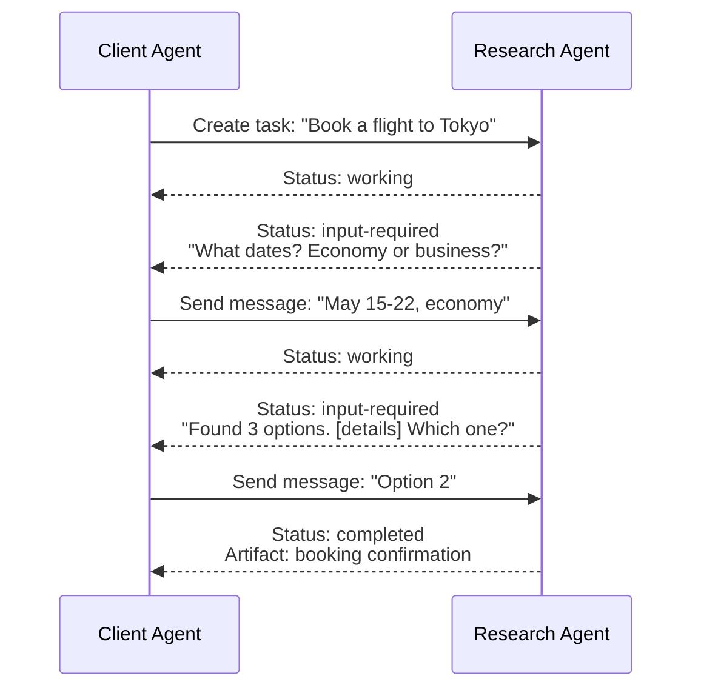

This multi-turn interaction pattern is critical for agents that handle ambiguous or complex tasks where the requirements cannot be fully specified upfront.

## 6. JSON-RPC Methods

A2A uses JSON-RPC 2.0 over HTTP. The protocol defines these methods:

### Core Methods

```json
// Create or update a task
{
  "jsonrpc": "2.0",
  "id": 1,
  "method": "tasks/send",
  "params": {
    "id": "task-001",
    "sessionId": "session-abc",
    "message": {
      "role": "user",
      "parts": [
        {"type": "text", "text": "Research quantum computing breakthroughs in 2025"}
      ]
    }
  }
}
```

```json
// Get task status
{
  "jsonrpc": "2.0",
  "id": 2,
  "method": "tasks/get",
  "params": {
    "id": "task-001",
    "historyLength": 10
  }
}
```

```json
// Cancel a task
{
  "jsonrpc": "2.0",
  "id": 3,
  "method": "tasks/cancel",
  "params": {
    "id": "task-001"
  }
}
```

### Full Method Reference

| Method | Purpose | Direction |
|--------|---------|-----------|
| `tasks/send` | Send a new task or add a message to existing task | Client to Server |
| `tasks/sendSubscribe` | Send task and subscribe to SSE updates | Client to Server |
| `tasks/get` | Get current task status and artifacts | Client to Server |
| `tasks/cancel` | Cancel a running task | Client to Server |
| `tasks/pushNotification/set` | Configure push notification webhook | Client to Server |
| `tasks/pushNotification/get` | Get current push notification config | Client to Server |
| `tasks/resubscribe` | Re-subscribe to SSE for an existing task | Client to Server |

## 7. Streaming with SSE

For long-running tasks, polling `tasks/get` is wasteful. A2A supports Server-Sent Events (SSE) for real-time progress streaming.

### How It Works

The client calls `tasks/sendSubscribe` instead of `tasks/send`. The server responds with an SSE stream that emits events as the task progresses:

```
POST /a2a HTTP/1.1
Content-Type: application/json

{
  "jsonrpc": "2.0",
  "id": 1,
  "method": "tasks/sendSubscribe",
  "params": {
    "id": "task-001",
    "message": {
      "role": "user",
      "parts": [{"type": "text", "text": "Write a detailed market analysis"}]
    }
  }
}
```

**Server SSE Response:**

```
HTTP/1.1 200 OK
Content-Type: text/event-stream

event: status
data: {"id":"task-001","status":{"state":"working","message":{"role":"agent","parts":[{"type":"text","text":"Starting market research..."}]}},"final":false}

event: status
data: {"id":"task-001","status":{"state":"working","message":{"role":"agent","parts":[{"type":"text","text":"Analyzing competitor data..."}]}},"final":false}

event: artifact
data: {"id":"task-001","artifact":{"name":"Market Analysis","parts":[{"type":"text","text":"# Market Analysis\n\n..."}],"index":0,"append":false},"final":false}

event: status
data: {"id":"task-001","status":{"state":"completed"},"final":true}
```

### SSE Event Types

| Event | Payload | Purpose |
|-------|---------|---------|
| `status` | Task status update | State transitions and progress messages |
| `artifact` | Artifact data | Streamed output (can be chunked via `append: true`) |

The `final: true` field on the last event tells the client to close the SSE connection.

### Artifact Streaming (Chunked)

Large artifacts can be streamed in chunks. The `append` field controls this:

```
event: artifact
data: {"id":"task-001","artifact":{"name":"Report","parts":[{"type":"text","text":"# Chapter 1\n\n..."}],"index":0,"append":false,"lastChunk":false},"final":false}

event: artifact
data: {"id":"task-001","artifact":{"name":"Report","parts":[{"type":"text","text":"# Chapter 2\n\n..."}],"index":0,"append":true,"lastChunk":false},"final":false}

event: artifact
data: {"id":"task-001","artifact":{"name":"Report","parts":[{"type":"text","text":"# Conclusion\n\n..."}],"index":0,"append":true,"lastChunk":true},"final":false}
```

## 8. Push Notifications

SSE works when the client maintains a persistent connection. But for tasks that take hours or days, holding a connection open is impractical. A2A supports push notifications via webhooks.

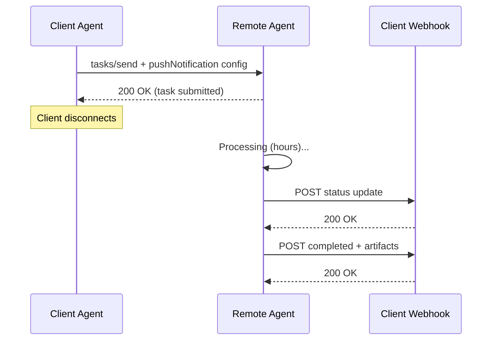

### Configuring Push Notifications

```json
{
  "jsonrpc": "2.0",
  "id": 1,
  "method": "tasks/pushNotification/set",
  "params": {
    "id": "task-001",
    "pushNotificationConfig": {
      "url": "https://client.example.com/a2a/webhook",
      "token": "webhook-secret-token-xyz",
      "authentication": {
        "schemes": ["Bearer"]
      }
    }
  }
}
```

The remote agent sends HTTP POST requests to the webhook URL with the same event payloads that would be sent via SSE. The `token` field allows the client to verify that notifications genuinely come from the remote agent.

## 9. Authentication and Security

A2A does not invent new auth mechanisms. It relies on established HTTP authentication and authorization standards:

### Supported Schemes

| Scheme | Use Case |
|--------|----------|
| **API Key** | Simple service-to-service auth. Key in header or query param |
| **OAuth 2.0** | Enterprise environments with identity providers (Okta, Auth0, Azure AD) |
| **Bearer Token** | JWT or opaque tokens for authenticated requests |
| **mTLS** | Mutual TLS for zero-trust environments |

### Agent Card Authentication Section

```json
{
  "authentication": {
    "schemes": ["OAuth2"],
    "credentials": "Obtain a token from https://auth.example.com/oauth/token with scope 'agent:task:write'"
  }
}
```

### Security Best Practices

::: warning A2A Security Checklist
1. **Always use HTTPS** — A2A traffic contains task data that may be sensitive. Never use plain HTTP in production.
2. **Validate Agent Cards** — When discovering agents, verify the card comes from a trusted source. Do not blindly trust cards from unknown registries.
3. **Scope permissions** — Use OAuth scopes to limit what tasks an agent can submit. A research agent should not be able to submit tasks to a billing agent.
4. **Validate push notification origins** — Always verify the token in webhook payloads. Never process unsigned or unverified push notifications.
5. **Rate limit** — Protect remote agents from being overwhelmed by a misbehaving client agent.
6. **Audit logging** — Log all task submissions, state transitions, and artifact transfers for compliance and debugging.
7. **Data classification** — Define what data can flow through A2A tasks. PII, financial data, and secrets may require additional encryption or routing through specific agents.
:::

### Enterprise Identity Integration

In enterprise deployments, A2A integrates with existing identity providers:

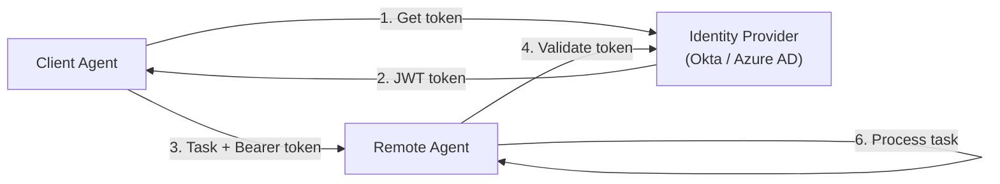

## 10. Implementation Example

Here is a complete implementation showing a client agent sending a task to a remote agent via A2A.

### Python A2A Client

```python
import httpx
import json
import uuid
from dataclasses import dataclass, field, asdict
from typing import Optional, AsyncIterator

@dataclass
class Part:
    type: str
    text: Optional[str] = None
    data: Optional[dict] = None
    file: Optional[dict] = None

@dataclass
class Message:
    role: str  # "user" or "agent"
    parts: list[Part] = field(default_factory=list)

@dataclass
class TaskSendParams:
    id: str
    message: Message
    session_id: Optional[str] = None

class A2AClient:
    """Client for communicating with A2A-compatible agents."""

    def __init__(self, agent_url: str, auth_token: Optional[str] = None):
        self.agent_url = agent_url
        self.headers = {"Content-Type": "application/json"}
        if auth_token:
            self.headers["Authorization"] = f"Bearer {auth_token}"

    def _build_request(self, method: str, params: dict) -> dict:
        return {
            "jsonrpc": "2.0",
            "id": str(uuid.uuid4()),
            "method": method,
            "params": params,
        }

    async def discover(self) -> dict:
        """Fetch the agent's Agent Card."""
        base_url = self.agent_url.rstrip("/a2a").rstrip("/")
        async with httpx.AsyncClient() as client:
            response = await client.get(
                f"{base_url}/.well-known/agent.json",
                headers=self.headers,
            )
            response.raise_for_status()
            return response.json()

    async def send_task(self, task_id: str, message: Message,
                        session_id: Optional[str] = None) -> dict:
        """Send a task and get the immediate response."""
        params = {
            "id": task_id,
            "message": {
                "role": message.role,
                "parts": [asdict(p) for p in message.parts],
            },
        }
        if session_id:
            params["sessionId"] = session_id

        payload = self._build_request("tasks/send", params)

        async with httpx.AsyncClient() as client:
            response = await client.post(
                self.agent_url,
                json=payload,
                headers=self.headers,
                timeout=60.0,
            )
            response.raise_for_status()
            return response.json()

    async def send_task_streaming(self, task_id: str, message: Message,
                                  session_id: Optional[str] = None) -> AsyncIterator[dict]:
        """Send a task and stream SSE updates."""
        params = {
            "id": task_id,
            "message": {
                "role": message.role,
                "parts": [asdict(p) for p in message.parts],
            },
        }
        if session_id:
            params["sessionId"] = session_id

        payload = self._build_request("tasks/sendSubscribe", params)

        async with httpx.AsyncClient() as client:
            async with client.stream(
                "POST",
                self.agent_url,
                json=payload,
                headers=self.headers,
                timeout=300.0,
            ) as response:
                async for line in response.aiter_lines():
                    if line.startswith("data: "):
                        data = json.loads(line[6:])
                        yield data
                        if data.get("final"):
                            break

    async def get_task(self, task_id: str) -> dict:
        """Get current task status."""
        payload = self._build_request("tasks/get", {"id": task_id})

        async with httpx.AsyncClient() as client:
            response = await client.post(
                self.agent_url,
                json=payload,
                headers=self.headers,
            )
            response.raise_for_status()
            return response.json()

    async def cancel_task(self, task_id: str) -> dict:
        """Cancel a running task."""
        payload = self._build_request("tasks/cancel", {"id": task_id})

        async with httpx.AsyncClient() as client:
            response = await client.post(
                self.agent_url,
                json=payload,
                headers=self.headers,
            )
            response.raise_for_status()
            return response.json()
```

### Usage Example

```python
import asyncio

async def main():
    # 1. Create client pointing at the remote agent
    client = A2AClient(
        agent_url="https://research-agent.example.com/a2a",
        auth_token="your-oauth-token",
    )

    # 2. Discover agent capabilities
    card = await client.discover()
    print(f"Agent: {card['name']}")
    print(f"Skills: {[s['name'] for s in card['skills']]}")

    # 3. Send a task with streaming
    task_id = str(uuid.uuid4())
    message = Message(
        role="user",
        parts=[Part(type="text", text="Research the impact of A2A protocol on enterprise AI adoption")],
    )

    async for event in client.send_task_streaming(task_id, message):
        status = event.get("status", {})
        state = status.get("state", "")
        print(f"[{state}] ", end="")

        # Print progress messages
        if "message" in status:
            for part in status["message"].get("parts", []):
                if part.get("text"):
                    print(part["text"])

        # Print artifacts when complete
        if "artifact" in event:
            artifact = event["artifact"]
            print(f"\n--- Artifact: {artifact.get('name', 'unnamed')} ---")
            for part in artifact.get("parts", []):
                if part.get("text"):
                    print(part["text"][:200] + "...")

asyncio.run(main())
```

### TypeScript A2A Server (Remote Agent)

```typescript
import express from "express";
import { v4 as uuidv4 } from "uuid";

const app = express();
app.use(express.json());

// In-memory task store (use a database in production)
const tasks = new Map<string, any>();

// Serve Agent Card
app.get("/.well-known/agent.json", (req, res) => {
  res.json({
    name: "Code Review Agent",
    description: "Reviews code for bugs, security issues, and best practices",
    url: "https://code-review.example.com/a2a",
    version: "1.0.0",
    capabilities: {
      streaming: true,
      pushNotifications: false,
      stateTransitionHistory: true,
    },
    defaultInputModes: ["text/plain", "text/x-python", "text/javascript"],
    defaultOutputModes: ["text/markdown", "application/json"],
    skills: [
      {
        id: "code-review",
        name: "Code Review",
        description: "Review code for bugs, security issues, and best practices",
        tags: ["code", "security", "review"],
      },
    ],
  });
});

// A2A JSON-RPC endpoint
app.post("/a2a", async (req, res) => {
  const { method, params, id: requestId } = req.body;

  switch (method) {
    case "tasks/send": {
      const task = {
        id: params.id || uuidv4(),
        sessionId: params.sessionId || uuidv4(),
        status: { state: "submitted", timestamp: new Date().toISOString() },
        artifacts: [],
        history: [params.message],
      };
      tasks.set(task.id, task);

      // Process asynchronously
      processTask(task, params.message);

      res.json({
        jsonrpc: "2.0",
        id: requestId,
        result: task,
      });
      break;
    }

    case "tasks/get": {
      const task = tasks.get(params.id);
      if (!task) {
        res.json({
          jsonrpc: "2.0",
          id: requestId,
          error: { code: -32001, message: "Task not found" },
        });
        return;
      }
      res.json({ jsonrpc: "2.0", id: requestId, result: task });
      break;
    }

    case "tasks/sendSubscribe": {
      // SSE streaming response
      res.setHeader("Content-Type", "text/event-stream");
      res.setHeader("Cache-Control", "no-cache");
      res.setHeader("Connection", "keep-alive");

      const task = {
        id: params.id || uuidv4(),
        sessionId: params.sessionId || uuidv4(),
        status: { state: "working", timestamp: new Date().toISOString() },
        artifacts: [],
        history: [params.message],
      };
      tasks.set(task.id, task);

      // Stream progress updates
      const sendEvent = (event: string, data: any) => {
        res.write(`event: ${event}\ndata: ${JSON.stringify(data)}\n\n`);
      };

      sendEvent("status", {
        id: task.id,
        status: {
          state: "working",
          message: {
            role: "agent",
            parts: [{ type: "text", text: "Analyzing code..." }],
          },
        },
        final: false,
      });

      // Simulate processing with progress
      const result = await performCodeReview(params.message);

      sendEvent("artifact", {
        id: task.id,
        artifact: {
          name: "Code Review Results",
          parts: [{ type: "text", text: result }],
          index: 0,
        },
        final: false,
      });

      sendEvent("status", {
        id: task.id,
        status: { state: "completed" },
        final: true,
      });

      res.end();
      break;
    }

    case "tasks/cancel": {
      const task = tasks.get(params.id);
      if (task) {
        task.status = { state: "canceled", timestamp: new Date().toISOString() };
        res.json({ jsonrpc: "2.0", id: requestId, result: task });
      }
      break;
    }

    default:
      res.json({
        jsonrpc: "2.0",
        id: requestId,
        error: { code: -32601, message: `Method not found: ${method}` },
      });
  }
});

async function processTask(task: any, message: any): Promise<void> {
  task.status = { state: "working", timestamp: new Date().toISOString() };
  const result = await performCodeReview(message);
  task.artifacts.push({
    name: "Code Review Results",
    parts: [{ type: "text", text: result }],
    index: 0,
  });
  task.status = { state: "completed", timestamp: new Date().toISOString() };
}

async function performCodeReview(message: any): Promise<string> {
  // In a real implementation, this would call an LLM
  return "## Code Review\n\n- No critical issues found\n- Consider adding input validation on line 42";
}

app.listen(3000, () => console.log("A2A agent running on port 3000"));
```

## 11. Multi-Agent Collaboration Patterns

A2A enables several collaboration patterns between agents:

### Pattern 1: Orchestrator (Hub-and-Spoke)

One agent coordinates work among specialists.

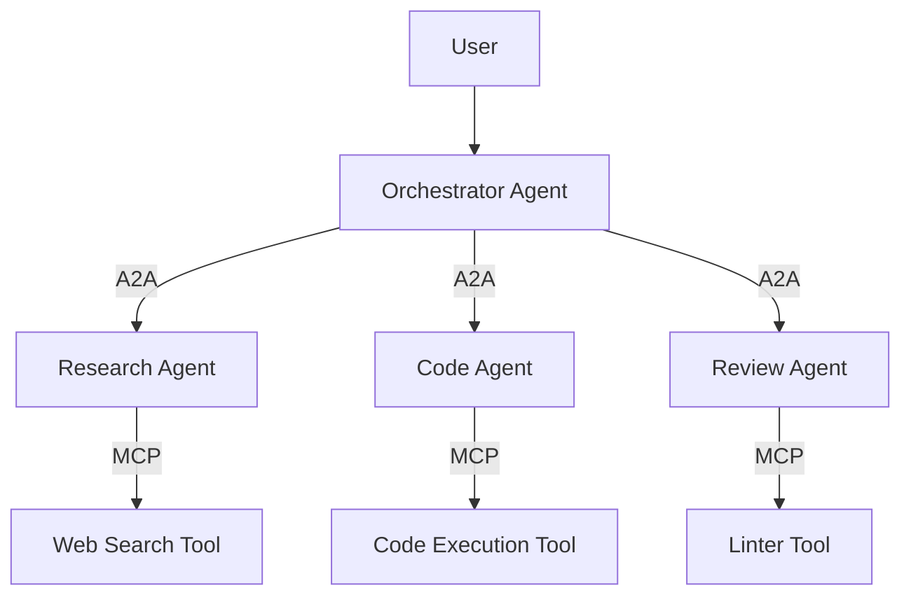

### Pattern 2: Pipeline (Sequential Handoff)

Agents process work in sequence, each adding to the task.

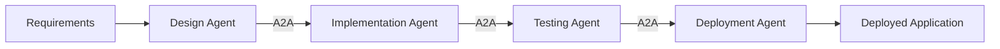

### Pattern 3: Consensus (Parallel + Merge)

Multiple agents work on the same task independently, and a merger agent synthesizes their outputs.

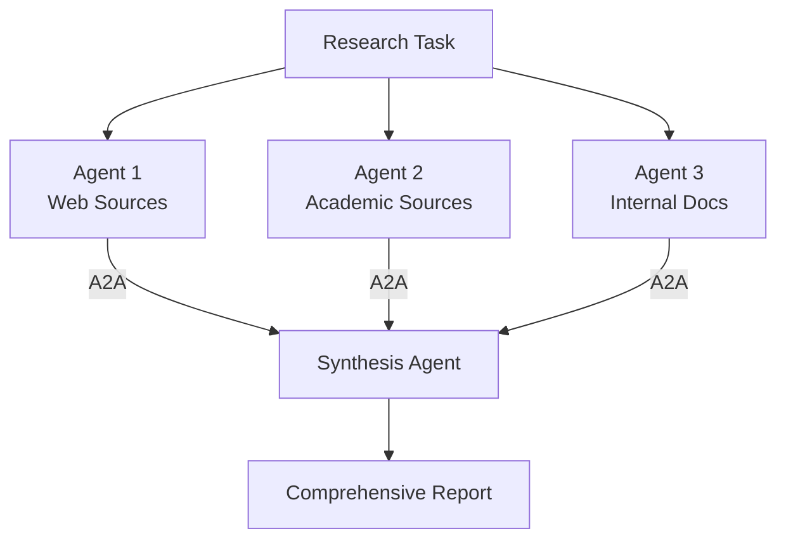

### Pattern 4: Negotiation

Agents negotiate to reach agreement — useful for planning, scheduling, or resource allocation.

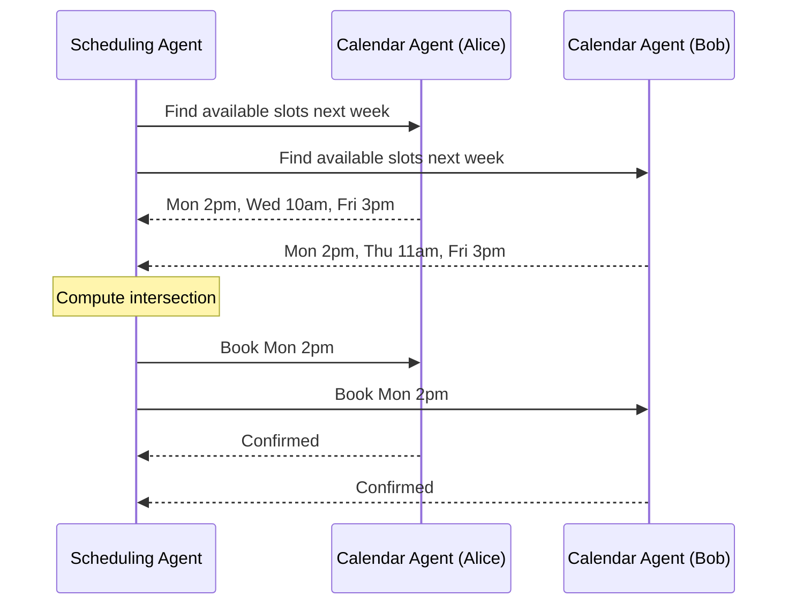

## 12. Error Handling

A2A defines error handling at two levels:

### JSON-RPC Errors (Protocol Level)

Standard JSON-RPC error codes plus A2A-specific codes:

| Code | Name | Meaning |
|------|------|---------|
| -32700 | Parse error | Invalid JSON |
| -32600 | Invalid request | Malformed JSON-RPC request |
| -32601 | Method not found | Unknown method name |
| -32602 | Invalid params | Missing or invalid parameters |
| -32001 | Task not found | Task ID does not exist |
| -32002 | Task not cancelable | Task is in a terminal state |
| -32003 | Push notification not supported | Agent does not support push notifications |
| -32004 | Unsupported operation | Agent does not support requested capability |

### Task Errors (Application Level)

When a task fails during execution, the task transitions to the `failed` state with an error message:

```json
{
  "id": "task-001",
  "status": {
    "state": "failed",
    "message": {
      "role": "agent",
      "parts": [
        {
          "type": "text",
          "text": "Unable to complete research: all search APIs returned 503 errors. Please try again later."
        }
      ]
    },
    "timestamp": "2026-04-04T11:00:00Z"
  }
}
```

::: info Idempotency
Sending a `tasks/send` request with an existing task ID is valid and treated as adding a new message to that task. This makes retries safe — if a network error occurs after the server processes the request but before the client receives the response, the client can safely resend.
:::

## 13. In Production

::: details Real-World A2A Deployments

**Google Agentspace** uses A2A internally to let enterprise agents built on Vertex AI communicate with agents from third-party vendors. A customer's internal HR agent (built on Vertex) can delegate benefits questions to a Workday agent via A2A.

**Salesforce Agentforce** announced A2A support for their autonomous agent platform, enabling Salesforce agents to collaborate with agents from other enterprise systems without custom Apex integration code.

**SAP Joule** integrated A2A to allow their enterprise AI assistant to delegate specialized tasks to external agents — a procurement agent can invoke a supplier's pricing agent via A2A rather than calling a REST API.

**LangChain/LangGraph** provides A2A adapter libraries that let any LangGraph agent expose itself as an A2A-compatible remote agent, and any LangGraph orchestrator discover and invoke A2A agents as if they were local nodes in the graph.

**MongoDB** announced A2A integration for their Atlas agent, allowing database agents to participate in multi-agent workflows — an analytics agent can ask the MongoDB agent to run queries and return structured data via A2A artifacts.
:::

## 14. Common Misconceptions

::: warning Common Misconceptions
1. **"A2A replaces MCP"** — No. A2A handles agent-to-agent communication. MCP handles agent-to-tool communication. They are complementary protocols that operate at different layers. A fully capable agent system uses both.

2. **"A2A requires Google Cloud"** — No. A2A is an open protocol built on HTTP and JSON-RPC. You can implement it on any cloud, any framework, or on-premise. Google published it, but does not control it.

3. **"A2A means agents share their internal state"** — No. A2A is deliberately opaque. A remote agent receives a task and returns results. The client has no visibility into the agent's internal reasoning, prompts, tools, or memory. This is a feature, not a bug — it enables trust boundaries between vendors.

4. **"All agents need to support every A2A feature"** — No. Capabilities are declared in the Agent Card. If an agent does not support streaming, it says so. Clients check capabilities before using them. The protocol is designed for progressive adoption.

5. **"A2A is only for LLM-based agents"** — No. A2A is agent-agnostic. The "agent" on the other end could be an LLM-based system, a rule-based system, a human behind a UI, or a traditional software service that exposes itself as an A2A agent. The protocol does not care about the implementation.

6. **"A2A solves the agent trust problem"** — A2A provides transport-level security (TLS, OAuth) but does not solve the deeper question of whether you should trust what an agent returns. Output validation, fact-checking, and result verification remain the responsibility of the consuming agent.
:::

## 15. When NOT to Use A2A

| Scenario | Better Approach | Why |
|----------|-----------------|-----|
| **Calling a simple API** | Direct HTTP/REST call | A2A adds overhead for synchronous, stateless operations |
| **Connecting an agent to a database** | MCP | MCP is designed for tool/data connections, not agent-to-agent |
| **Agents within the same framework** | Framework-native communication (LangGraph edges, CrewAI delegation) | No need for protocol overhead when agents share a runtime |
| **Real-time sub-millisecond communication** | gRPC or custom binary protocol | A2A is JSON over HTTP — fast enough for agent work, not for HFT |
| **Simple function calling** | MCP or direct tool invocation | A2A's task lifecycle is overkill for stateless function calls |
| **Two agents on the same machine** | In-process communication | Network protocols add latency when you do not need network |

## 16. Comparison with Other Agent Protocols

| Feature | A2A | MCP | OpenAI Assistants API | AutoGen Messages |
|---------|-----|-----|-----------------------|-----------------|
| **Scope** | Agent-to-agent | Agent-to-tool | Single-vendor agents | Framework-internal |
| **Discovery** | Agent Cards + registry | Tool manifests | API key + model selection | Code-level wiring |
| **Transport** | HTTP + JSON-RPC + SSE | stdio / HTTP + SSE | HTTP REST | In-process / HTTP |
| **Streaming** | SSE | SSE | SSE | Framework-specific |
| **Multi-vendor** | Yes (core design goal) | Yes | No (OpenAI only) | Partial |
| **Task lifecycle** | Full state machine | Stateless calls | Thread-based | Conversation-based |
| **Push notifications** | Yes (webhooks) | No | No | No |
| **Open standard** | Yes | Yes | Proprietary | Open source |
| **Backing** | 50+ companies | Growing ecosystem | OpenAI | Microsoft Research |

## 17. Quiz

::: details Quiz

**Q1: What is the fundamental difference between A2A and MCP?**
MCP connects agents to tools and data sources (vertical integration). A2A connects agents to other agents (horizontal integration). MCP exposes function schemas and raw results. A2A exposes agent capabilities and task results while keeping the agent's internals opaque. They are complementary protocols used together in production multi-agent systems.

**Q2: What are the six possible states in the A2A task lifecycle, and which are terminal?**
The six states are: `submitted`, `working`, `input-required`, `completed`, `failed`, and `canceled`. The terminal states are `completed`, `failed`, and `canceled` — once a task reaches any of these, it cannot transition to another state.

**Q3: How does an A2A client discover a remote agent's capabilities?**
Three mechanisms: (1) Well-known URL — fetch `/.well-known/agent.json` from the agent's domain. (2) Agent Registry — query a centralized or federated registry for agents matching specific skills or tags. (3) Direct configuration — the agent URL is known ahead of time via config. All three return an Agent Card containing the agent's name, capabilities, skills, supported input/output modes, and authentication requirements.

**Q4: Why does A2A support the `input-required` state? What problem does it solve?**
The `input-required` state enables multi-turn interaction during task execution. Without it, a task would need all information upfront or would fail when it encounters ambiguity. With `input-required`, the remote agent can pause processing, ask the client for clarification or additional data, and resume when the input is provided. This is essential for complex tasks where requirements cannot be fully specified in the initial message.

**Q5: When should you NOT use A2A and use direct MCP or REST instead?**
A2A should not be used for: (1) Simple API calls that are stateless and synchronous — direct REST is simpler. (2) Connecting an agent to a database or tool — MCP is designed for this. (3) Agents within the same framework that share a runtime — use framework-native communication. (4) Sub-millisecond latency requirements — JSON-over-HTTP adds overhead. (5) Simple function calling — A2A's task lifecycle is unnecessary overhead for stateless calls.
:::

## 18. Exercise

::: details Exercise — Build a Mini A2A Agent Network

**Objective:** Implement a three-agent system using A2A: an orchestrator, a research agent, and a summarization agent.

**Requirements:**
1. Create an Agent Card for each agent
2. The orchestrator receives a topic from the user
3. The orchestrator sends a research task to the research agent via A2A
4. When the research agent completes, the orchestrator sends the research results to the summarization agent
5. The summarization agent produces a structured summary as an artifact
6. Use streaming (SSE) for the research task (it takes longer)
7. Handle the `input-required` state — if the research agent asks for clarification, the orchestrator provides it

**Stretch goals:**
- Add push notification support for the research agent
- Implement a simple agent registry that the orchestrator queries to find agents
- Add OAuth 2.0 authentication between agents
- Handle task cancellation (orchestrator cancels research if it takes too long)

**Starter code:**

```python
# orchestrator.py
import asyncio
from a2a_client import A2AClient, Message, Part

async def orchestrate(topic: str):
    # Step 1: Discover agents
    research_client = A2AClient("https://localhost:3001/a2a")
    summary_client = A2AClient("https://localhost:3002/a2a")

    research_card = await research_client.discover()
    summary_card = await summary_client.discover()

    print(f"Research agent: {research_card['name']}")
    print(f"Summary agent: {summary_card['name']}")

    # Step 2: Send research task with streaming
    research_task_id = "research-" + topic.replace(" ", "-")
    research_message = Message(
        role="user",
        parts=[Part(type="text", text=f"Research the topic: {topic}")],
    )

    research_result = None
    async for event in research_client.send_task_streaming(
        research_task_id, research_message
    ):
        state = event.get("status", {}).get("state", "")
        if state == "input-required":
            # TODO: Handle clarification requests
            pass
        if "artifact" in event:
            research_result = event["artifact"]

    # Step 3: Send summarization task
    # TODO: Send research_result to summary agent

    # Step 4: Return final summary
    # TODO: Return the summary artifact

asyncio.run(orchestrate("quantum computing in 2026"))
```

**Evaluation criteria:**
- Agent Cards are complete and valid
- Task lifecycle states are handled correctly
- SSE streaming works for the research task
- The `input-required` state is handled (not ignored)
- Error handling for failed tasks
- Clean separation of concerns between the three agents
:::

## Further Reading

- [AI Agents Architecture](/ai-ml-engineering/ai-agents) — Agent patterns, ReAct loops, multi-agent systems
- [CrewAI & AutoGen](/ai-ml-engineering/crewai-autogen) — Multi-agent frameworks that can use A2A
- [LangGraph](/ai-ml-engineering/langgraph) — Graph-based agent orchestration
- [Anthropic Claude API](/ai-ml-engineering/anthropic-claude-api) — MCP and Claude integration
- [A2A Protocol Specification (GitHub)](https://github.com/google/A2A) — Official specification repository
- [AI Coding Assistants](/ai-ml-engineering/ai-coding-assistants) — Tools that may integrate A2A for agent collaboration

## One-Liner Summary

> A2A gives AI agents from different vendors a common language — Agent Cards for discovery, JSON-RPC for communication, and a task lifecycle for collaboration — so your Google agent and your Salesforce agent can finally work together without a custom integration.
