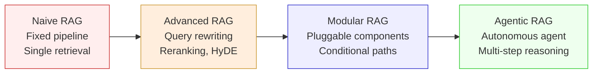
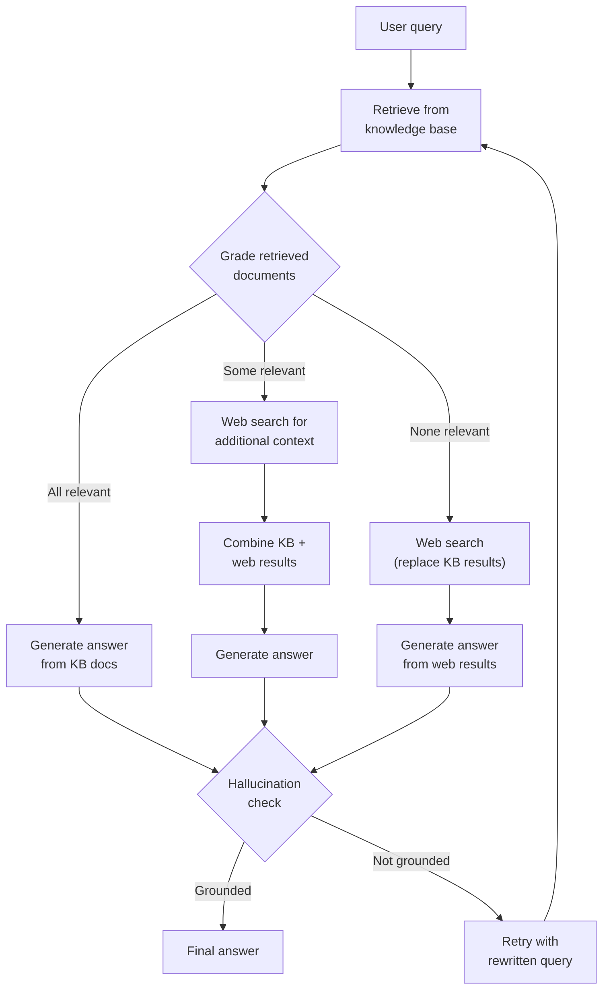
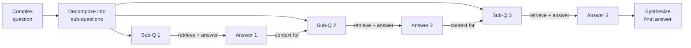
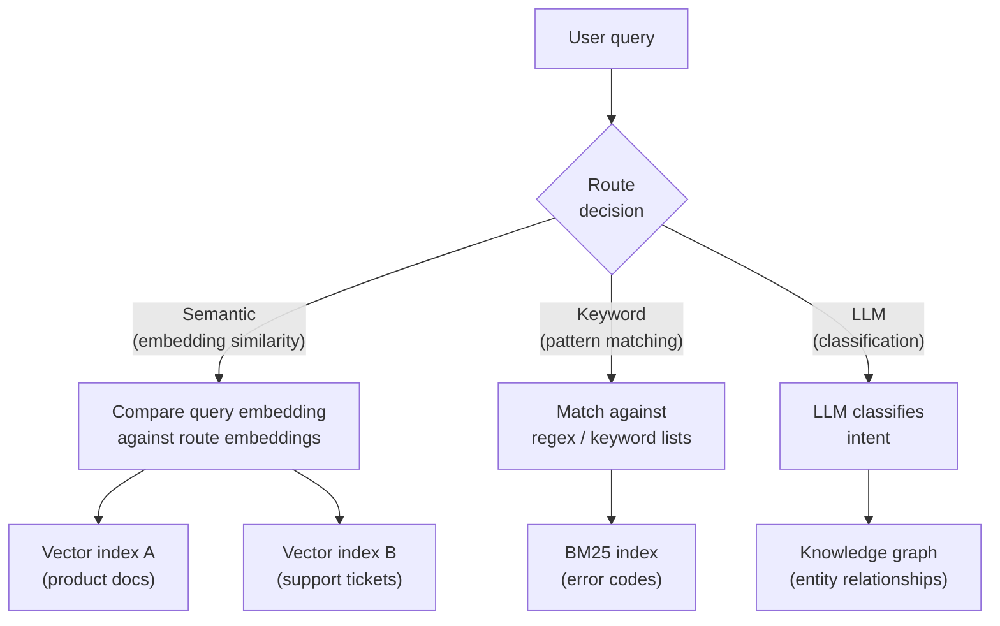
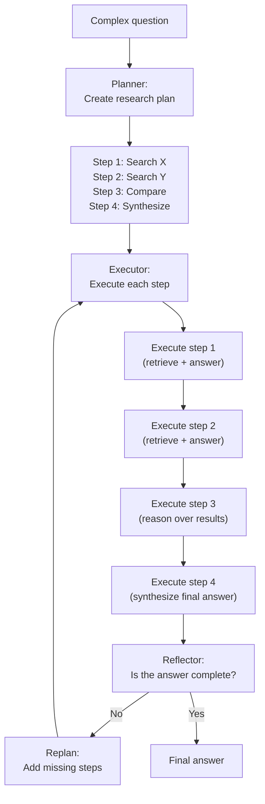
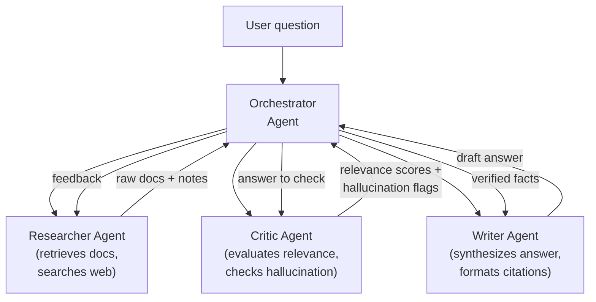
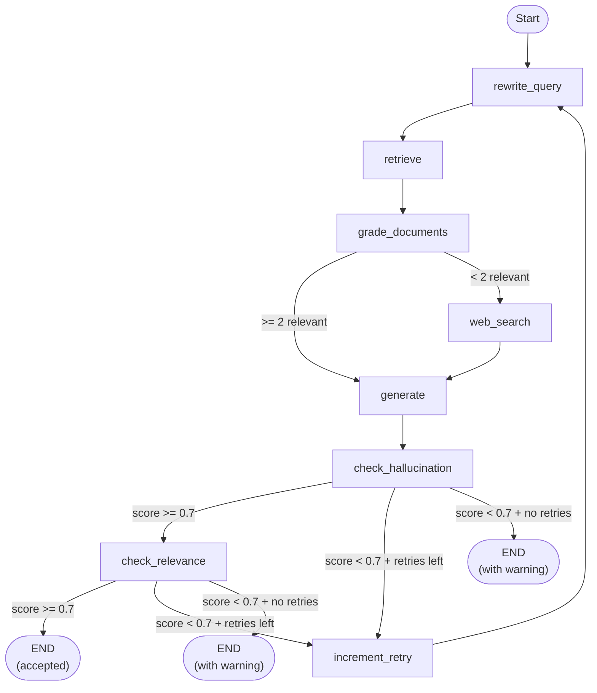

# Agentic RAG Patterns

Basic RAG follows a fixed pipeline: embed query, retrieve top-k, stuff context into prompt, generate answer. It works well for simple factual lookups over clean, well-chunked data. It falls apart the moment your questions require reasoning, multi-hop retrieval, or any kind of self-correction. Agentic RAG replaces the static pipeline with an autonomous agent that decides *what* to retrieve, *when* to retrieve, *whether* the retrieved context is good enough, and *how* to combine information from multiple retrieval steps into a coherent answer.

This page covers the advanced patterns that sit on top of the [RAG Architecture](/ai-ml-engineering/rag-architecture) fundamentals. If you are not yet comfortable with chunking strategies, embedding models, vector search, reranking, and evaluation metrics, read that page first. Everything here assumes you already have a working basic RAG pipeline and need to push beyond its limitations.

## Beyond Basic RAG

### Why Naive RAG Fails

Naive RAG (query -> embed -> retrieve -> generate) has five failure modes that become obvious in production:

1. **Irrelevant retrieval.** The user asks "What is our SLA for enterprise customers?" and the retriever returns chunks about SLA definitions from a Wikipedia-style glossary instead of the actual enterprise contract terms. Embedding similarity is a blunt instrument — semantically similar is not the same as *actually relevant*.

2. **No reasoning over results.** The retriever returns five chunks. Three are relevant, one is outdated, one contradicts the others. Naive RAG stuffs all five into the context window and asks the LLM to generate an answer. The model has no mechanism to evaluate, filter, or reconcile these chunks.

3. **Single-hop limitation.** The user asks "How does our retry policy interact with the circuit breaker in the payment service?" Answering this requires retrieving the retry policy docs, then the circuit breaker docs, then the payment service architecture — three separate retrieval steps. Naive RAG does one retrieval and hopes for the best.

4. **No query understanding.** The user types a vague or poorly-worded question. Naive RAG embeds it as-is and retrieves based on a suboptimal query vector. There is no step that reformulates, clarifies, or decomposes the question.

5. **No awareness of its own failures.** When the retriever returns nothing useful, naive RAG still generates an answer — often a hallucination. There is no feedback loop, no fallback strategy, no "I don't have enough information" decision.

### The RAG Evolution

The field has evolved through four distinct stages:



| Generation | Key Characteristics | Limitations |
|------------|-------------------|-------------|
| **Naive RAG** | Fixed retrieve-then-generate pipeline | No reasoning, single hop, no quality checks |
| **Advanced RAG** | HyDE, query rewriting, reranking, hybrid search | Still a fixed pipeline with predetermined steps |
| **Modular RAG** | Pluggable retrieval/generation modules, routing | Flows are predefined at design time, not adaptive |
| **Agentic RAG** | Agent decides retrieval strategy dynamically, self-corrects, multi-step reasoning | Higher latency, more LLM calls, harder to debug |

::: tip The key insight
Agentic RAG shifts retrieval from a *predetermined pipeline* to an *agent-driven decision process*. The agent treats retrieval as a tool it can invoke zero, one, or many times based on the question and the quality of results received so far.
:::

## Self-Correcting RAG

Self-correcting RAG introduces feedback loops where the LLM evaluates the quality of retrieval and generation, then takes corrective action when quality is insufficient.

### Query Rewriting

The user's raw query is often not the best search query. An LLM rewrites it before retrieval:

```python
async def rewrite_query(original_query: str) -> str:
    """Rewrite a user question into an optimal search query."""
    response = await llm_call(
        system="""You are a search query optimizer. Given a user question,
rewrite it as a search query that will retrieve the most relevant documents.
Rules:
- Remove filler words and conversational phrasing
- Add relevant technical terms the documents might use
- If the question is ambiguous, make it specific
- Return ONLY the rewritten query, nothing else.""",
        user=original_query,
    )
    return response.strip()

# Example:
# Input:  "hey how do i make the thing stop crashing when there's too many requests"
# Output: "rate limiting request throttling crash prevention high traffic"
```

**Multi-query rewriting** generates several query variants to cover different angles:

```python
async def generate_sub_queries(original_query: str, n: int = 3) -> list[str]:
    """Decompose a question into multiple search queries."""
    response = await llm_call(
        system=f"""Generate {n} different search queries to answer this question.
Each query should approach the topic from a different angle.
Return one query per line, no numbering.""",
        user=original_query,
    )
    return [q.strip() for q in response.strip().split("\n") if q.strip()]
```

### Retrieval Grading

After retrieval, an LLM grades each document for relevance. Irrelevant chunks are discarded before generation:

```python
async def grade_document(query: str, document: str) -> bool:
    """Grade whether a document is relevant to the query."""
    response = await llm_call(
        system="""You are a relevance grader. Given a user question and a
retrieved document, determine if the document contains information relevant
to answering the question.
Return ONLY 'yes' or 'no'.""",
        user=f"Question: {query}\n\nDocument: {document}",
    )
    return response.strip().lower() == "yes"

async def filter_relevant_docs(query: str, documents: list[str]) -> list[str]:
    """Filter documents, keeping only relevant ones."""
    grades = await asyncio.gather(*[
        grade_document(query, doc) for doc in documents
    ])
    return [doc for doc, is_relevant in zip(documents, grades) if is_relevant]
```

### Hallucination Detection

After generation, a separate LLM call checks whether the answer is grounded in the provided sources:

```python
async def check_hallucination(
    answer: str,
    source_documents: list[str],
) -> dict:
    """Check if the answer is grounded in the source documents."""
    sources_text = "\n---\n".join(source_documents)
    response = await llm_call(
        system="""You are a hallucination detector. Given an answer and source
documents, identify any claims in the answer that are NOT supported by the
sources.

Return a JSON object:
{
  "grounded": true/false,
  "unsupported_claims": ["claim 1", "claim 2"],
  "confidence": 0.0-1.0
}""",
        user=f"Answer: {answer}\n\nSources:\n{sources_text}",
    )
    return json.loads(response)
```

### CRAG: Corrective RAG

Corrective RAG (CRAG) is a complete self-correcting pattern. It retrieves, grades, and falls back to web search when the local knowledge base does not have good enough results:



```python
class CRAGPipeline:
    """Corrective RAG with grading and web search fallback."""

    def __init__(self, retriever, web_searcher, llm):
        self.retriever = retriever
        self.web_searcher = web_searcher
        self.llm = llm

    async def run(self, query: str, max_retries: int = 2) -> dict:
        for attempt in range(max_retries):
            # Step 1: Retrieve from knowledge base
            search_query = query if attempt == 0 else await rewrite_query(query)
            kb_docs = await self.retriever.search(search_query, top_k=5)

            # Step 2: Grade each document
            relevant_docs = await filter_relevant_docs(query, kb_docs)
            relevance_ratio = len(relevant_docs) / len(kb_docs) if kb_docs else 0

            # Step 3: Decide on action based on grading
            if relevance_ratio >= 0.6:
                # Mostly relevant — use KB docs directly
                context_docs = relevant_docs
            elif relevance_ratio > 0:
                # Partially relevant — supplement with web search
                web_docs = await self.web_searcher.search(query, num_results=3)
                context_docs = relevant_docs + web_docs
            else:
                # Nothing relevant — fall back to web search entirely
                context_docs = await self.web_searcher.search(query, num_results=5)

            # Step 4: Generate answer
            answer = await self.generate_answer(query, context_docs)

            # Step 5: Check for hallucination
            check = await check_hallucination(answer, context_docs)
            if check["grounded"]:
                return {
                    "answer": answer,
                    "sources": context_docs,
                    "attempts": attempt + 1,
                    "used_web_search": relevance_ratio < 0.6,
                }

        # Exhausted retries — return best effort with warning
        return {
            "answer": answer,
            "sources": context_docs,
            "warning": "Answer may not be fully grounded in sources",
            "attempts": max_retries,
        }
```

::: warning CRAG cost
Every CRAG invocation involves at minimum: 1 retrieval, N grading calls (one per document), 1 generation call, and 1 hallucination check call. For 5 retrieved documents, that is 8 LLM calls per query. With retries and web search, it can reach 15+ calls. Budget accordingly.
:::

## Multi-Step RAG

Multi-step RAG handles complex questions that cannot be answered from a single retrieval pass. The system retrieves, reasons about what it found, and retrieves again with refined queries.

### Iterative Retrieval

The simplest multi-step pattern. Retrieve, check if you have enough information, and retrieve more if needed:

```python
async def iterative_rag(
    query: str,
    max_iterations: int = 3,
) -> dict:
    """Retrieve iteratively until sufficient context is gathered."""
    all_contexts = []
    current_query = query

    for i in range(max_iterations):
        # Retrieve
        docs = await retriever.search(current_query, top_k=3)
        all_contexts.extend(docs)

        # Check sufficiency
        sufficiency = await llm_call(
            system="""Given a question and collected context, determine if there
is enough information to provide a complete answer.
Return JSON: {"sufficient": true/false, "missing": "description of what's missing"}""",
            user=f"Question: {query}\n\nCollected context:\n{format_contexts(all_contexts)}",
        )
        result = json.loads(sufficiency)

        if result["sufficient"]:
            break

        # Refine query based on what is missing
        current_query = await llm_call(
            system="Write a search query to find the missing information described below.",
            user=result["missing"],
        )

    # Generate final answer from all collected context
    answer = await generate_answer(query, all_contexts)
    return {"answer": answer, "iterations": i + 1, "contexts": all_contexts}
```

### Chain-of-Retrieval

Decompose a complex question into ordered sub-questions, where each answer feeds into the next retrieval:



```python
async def chain_of_retrieval(query: str) -> dict:
    """Decompose question into chain of sub-queries, each building on previous."""
    # Step 1: Decompose
    decomposition = await llm_call(
        system="""Decompose this complex question into 2-4 simpler sub-questions.
Each sub-question should build on the answer to the previous one.
Return as a JSON array of strings.""",
        user=query,
    )
    sub_questions = json.loads(decomposition)

    # Step 2: Sequential retrieval and answering
    accumulated_context = ""
    sub_answers = []

    for sub_q in sub_questions:
        # Include previous answers as context for retrieval
        enriched_query = f"{sub_q}\n\nPrevious findings: {accumulated_context}"
        docs = await retriever.search(enriched_query, top_k=3)

        sub_answer = await llm_call(
            system=f"""Answer this sub-question using the provided context.
Previous findings: {accumulated_context}""",
            user=f"Sub-question: {sub_q}\n\nRetrieved context:\n{format_contexts(docs)}",
        )
        sub_answers.append({"question": sub_q, "answer": sub_answer})
        accumulated_context += f"\n- {sub_q}: {sub_answer}"

    # Step 3: Synthesize
    final_answer = await llm_call(
        system="Synthesize a comprehensive answer from these sub-question answers.",
        user=f"Original question: {query}\n\nSub-answers:\n{json.dumps(sub_answers, indent=2)}",
    )

    return {"answer": final_answer, "chain": sub_answers}
```

### Tree of Retrieval

For questions where sub-queries are independent, run them in parallel and merge the results:

```python
async def tree_of_retrieval(query: str) -> dict:
    """Parallel sub-query retrieval with result merging."""
    # Decompose into independent sub-queries
    decomposition = await llm_call(
        system="""Decompose this question into 2-4 INDEPENDENT sub-questions
that can be answered in parallel. Each should cover a different aspect.
Return as a JSON array of strings.""",
        user=query,
    )
    sub_questions = json.loads(decomposition)

    # Parallel retrieval and answering
    async def answer_sub_query(sub_q: str) -> dict:
        docs = await retriever.search(sub_q, top_k=3)
        answer = await llm_call(
            system="Answer this question concisely using the provided context.",
            user=f"Question: {sub_q}\n\nContext:\n{format_contexts(docs)}",
        )
        return {"question": sub_q, "answer": answer, "sources": docs}

    sub_results = await asyncio.gather(*[
        answer_sub_query(sq) for sq in sub_questions
    ])

    # Merge and synthesize
    final_answer = await llm_call(
        system="""Synthesize a complete answer from these parallel sub-query results.
Resolve any conflicts between sub-answers. Cite which sub-answer each claim comes from.""",
        user=f"Original question: {query}\n\nSub-results:\n{json.dumps(sub_results, indent=2, default=str)}",
    )

    return {"answer": final_answer, "branches": sub_results}
```

::: tip Chain vs Tree retrieval
Use **chain-of-retrieval** when sub-questions depend on each other (e.g., "What is the retry policy?" must be answered before "How does the retry policy interact with the circuit breaker?"). Use **tree-of-retrieval** when sub-questions are independent (e.g., "What is the uptime SLA?" and "What is the support response time?" can be answered in parallel). Tree is faster but cannot handle dependencies between sub-queries.
:::

## Routing RAG

Not every query should go through the same retrieval pipeline. Routing RAG classifies the incoming query and sends it to the most appropriate retriever, index, or processing path.

### Query Classification

Route queries to specialized handlers based on intent:

```python
async def classify_query(query: str) -> str:
    """Classify query to determine the best retrieval strategy."""
    response = await llm_call(
        system="""Classify this query into exactly one category:
- FACTUAL: Simple fact lookup (dates, definitions, config values)
- ANALYTICAL: Requires reasoning across multiple documents
- PROCEDURAL: How-to question requiring step-by-step instructions
- COMPARATIVE: Comparing two or more things
- CONVERSATIONAL: Greeting, small talk, not needing retrieval
Return ONLY the category name.""",
        user=query,
    )
    return response.strip().upper()

async def routed_rag(query: str) -> dict:
    """Route query to the appropriate RAG pipeline."""
    category = await classify_query(query)

    if category == "CONVERSATIONAL":
        # No retrieval needed
        return {"answer": await direct_llm_response(query), "retrieval": False}

    elif category == "FACTUAL":
        # Simple retrieval, small top_k, no multi-step
        docs = await retriever.search(query, top_k=3)
        return {"answer": await generate_answer(query, docs), "strategy": "factual"}

    elif category == "ANALYTICAL":
        # Multi-step retrieval with chain-of-retrieval
        return await chain_of_retrieval(query)

    elif category == "PROCEDURAL":
        # Retrieve from how-to index, prefer structured docs
        docs = await retriever.search(
            query, top_k=5,
            filter={"content_type": {"$in": ["tutorial", "guide", "runbook"]}},
        )
        return {"answer": await generate_answer(query, docs), "strategy": "procedural"}

    elif category == "COMPARATIVE":
        # Tree retrieval — retrieve each entity separately
        return await tree_of_retrieval(query)
```

### Semantic Routing vs Keyword Routing



| Routing Method | Latency | Accuracy | Cost | Best For |
|---------------|---------|----------|------|----------|
| **Keyword** | <1ms | Low (brittle) | Free | Error codes, product IDs, known patterns |
| **Semantic** | 5-10ms | Medium | Embedding cost | Broad topic routing |
| **LLM-based** | 200-500ms | High | LLM call cost | Complex intent classification |
| **Hybrid** | 200-500ms | Highest | Combined | Production systems |

```python
class SemanticRouter:
    """Route queries to indexes based on embedding similarity."""

    def __init__(self, routes: dict[str, list[str]]):
        """
        routes: {"product_docs": ["How do I configure X?", "What features does Y have?"],
                 "support": ["My app is crashing", "I got an error..."]}
        """
        self.route_embeddings = {}
        for route_name, examples in routes.items():
            embeddings = embedding_model.encode(examples)
            self.route_embeddings[route_name] = embeddings.mean(axis=0)

    def route(self, query: str) -> str:
        query_embedding = embedding_model.encode(query)
        best_route = max(
            self.route_embeddings.items(),
            key=lambda item: cosine_similarity(query_embedding, item[1]),
        )
        return best_route[0]
```

### Multi-Index Strategies

Production systems rarely use a single index. Combine vector search, keyword search, and knowledge graphs:

```python
class MultiIndexRetriever:
    """Retrieve from multiple indexes and fuse results."""

    def __init__(self, vector_store, bm25_index, knowledge_graph):
        self.vector_store = vector_store
        self.bm25_index = bm25_index
        self.knowledge_graph = knowledge_graph

    async def retrieve(self, query: str, top_k: int = 10) -> list[dict]:
        # Parallel retrieval from all indexes
        vector_results, keyword_results, graph_results = await asyncio.gather(
            self.vector_store.search(query, top_k=top_k),
            self.bm25_index.search(query, top_k=top_k),
            self.knowledge_graph.query(query, max_hops=2),
        )

        # Reciprocal Rank Fusion
        fused = reciprocal_rank_fusion(
            rankings=[vector_results, keyword_results, graph_results],
            weights=[0.4, 0.3, 0.3],  # weight by index reliability
        )

        return fused[:top_k]
```

### Adaptive Retrieval

The smartest routing decision is knowing when NOT to retrieve at all:

```python
async def adaptive_retrieval(query: str, chat_history: list) -> dict:
    """Decide whether retrieval is needed before doing it."""
    decision = await llm_call(
        system="""Given the user query and chat history, decide if retrieval is needed.
Return JSON: {"needs_retrieval": true/false, "reason": "..."}

Skip retrieval for:
- Greetings and small talk
- Follow-up questions where the answer is already in chat history
- Questions the LLM can answer from general knowledge
- Clarification questions about a previous answer""",
        user=f"Chat history:\n{format_history(chat_history)}\n\nNew query: {query}",
    )
    result = json.loads(decision)

    if not result["needs_retrieval"]:
        answer = await llm_call(
            system="Answer based on the conversation context.",
            user=f"History:\n{format_history(chat_history)}\n\nQuery: {query}",
        )
        return {"answer": answer, "retrieval_skipped": True, "reason": result["reason"]}

    # Proceed with retrieval
    return await full_rag_pipeline(query)
```

## Agent-Based RAG

Agent-based RAG gives the LLM full autonomy over the retrieval process. The agent has access to retrieval as a tool and decides when and how to use it within a reasoning loop.

### ReAct Pattern for RAG

The ReAct (Reason + Act) loop with retrieval as a tool:

```python
TOOLS = [
    {
        "type": "function",
        "function": {
            "name": "search_knowledge_base",
            "description": "Search internal documentation. Use when you need factual information.",
            "parameters": {
                "type": "object",
                "properties": {
                    "query": {"type": "string", "description": "Search query"},
                    "index": {
                        "type": "string",
                        "enum": ["product_docs", "api_reference", "support_tickets", "all"],
                        "description": "Which index to search",
                    },
                },
                "required": ["query"],
            },
        },
    },
    {
        "type": "function",
        "function": {
            "name": "web_search",
            "description": "Search the web. Use when internal docs lack the answer.",
            "parameters": {
                "type": "object",
                "properties": {
                    "query": {"type": "string"},
                },
                "required": ["query"],
            },
        },
    },
]

async def react_rag_agent(query: str, max_steps: int = 5) -> str:
    """ReAct agent with retrieval tools."""
    messages = [
        {"role": "system", "content": """You are a research assistant with access to
a knowledge base and web search. Answer the user's question by:
1. Thinking about what information you need
2. Searching for it using the available tools
3. Evaluating if you have enough information
4. Searching again if needed
5. Providing a comprehensive answer with citations

Always cite your sources. If you cannot find the answer, say so."""},
        {"role": "user", "content": query},
    ]

    for step in range(max_steps):
        response = await llm_call_with_tools(
            messages=messages,
            tools=TOOLS,
        )

        # If the model wants to call a tool
        if response.tool_calls:
            messages.append(response)  # assistant message with tool_calls
            for tool_call in response.tool_calls:
                result = await execute_tool(tool_call)
                messages.append({
                    "role": "tool",
                    "tool_call_id": tool_call.id,
                    "content": result,
                })
        else:
            # Model is done — return the final answer
            return response.content

    return "I was unable to find a complete answer within the allowed steps."
```

### Plan-and-Execute

For complex research tasks, separate planning from execution:



```python
async def plan_and_execute_rag(query: str) -> dict:
    """Plan a research strategy, execute it, then reflect."""
    # Phase 1: Plan
    plan = await llm_call(
        system="""Create a research plan to answer this question.
Return a JSON array of steps, each with:
- "action": "search" | "reason" | "compare" | "synthesize"
- "description": what to do
- "query": search query (for search actions)""",
        user=query,
    )
    steps = json.loads(plan)

    # Phase 2: Execute
    results = []
    for step in steps:
        if step["action"] == "search":
            docs = await retriever.search(step["query"], top_k=3)
            summary = await llm_call(
                system="Summarize these documents in the context of the research goal.",
                user=f"Goal: {step['description']}\n\nDocuments:\n{format_contexts(docs)}",
            )
            results.append({"step": step, "output": summary, "sources": docs})

        elif step["action"] == "reason":
            reasoning = await llm_call(
                system="Reason about the collected information.",
                user=f"Task: {step['description']}\n\nCollected info:\n{format_results(results)}",
            )
            results.append({"step": step, "output": reasoning})

        elif step["action"] == "synthesize":
            synthesis = await llm_call(
                system="Synthesize a comprehensive answer from all collected information.",
                user=f"Question: {query}\n\nResearch results:\n{format_results(results)}",
            )
            results.append({"step": step, "output": synthesis})

    # Phase 3: Reflect
    reflection = await llm_call(
        system="""Evaluate this answer. Is it complete and accurate?
Return JSON: {"complete": true/false, "gaps": ["missing aspect 1", ...]}""",
        user=f"Question: {query}\n\nAnswer: {results[-1]['output']}",
    )
    reflection_result = json.loads(reflection)

    if not reflection_result["complete"]:
        # Execute additional steps for gaps (simplified — production would loop)
        for gap in reflection_result["gaps"]:
            docs = await retriever.search(gap, top_k=3)
            gap_answer = await llm_call(
                system="Answer this specific gap using the context.",
                user=f"Gap: {gap}\n\nContext:\n{format_contexts(docs)}",
            )
            results.append({"step": {"action": "gap_fill"}, "output": gap_answer})

        # Re-synthesize
        final = await llm_call(
            system="Create a final, comprehensive answer incorporating all findings.",
            user=f"Question: {query}\n\nAll findings:\n{format_results(results)}",
        )
        return {"answer": final, "plan": steps, "gap_filled": True}

    return {"answer": results[-1]["output"], "plan": steps, "gap_filled": False}
```

### Multi-Agent RAG

Specialized agents collaborate — a researcher retrieves, a critic evaluates, and a writer synthesizes:



```python
class MultiAgentRAG:
    """Three-agent RAG: researcher, critic, writer."""

    async def run(self, query: str) -> dict:
        # Researcher: gather information
        research = await self.researcher_agent(query)

        # Critic: evaluate what was found
        critique = await self.critic_agent(query, research["documents"])

        # If critic says we need more info, researcher goes again
        if not critique["sufficient"]:
            additional = await self.researcher_agent(
                critique["suggested_queries"][0]
            )
            research["documents"].extend(additional["documents"])

        # Filter to only relevant docs per critic
        relevant_docs = [
            doc for doc, score in zip(research["documents"], critique["scores"])
            if score >= 0.7
        ]

        # Writer: synthesize final answer
        answer = await self.writer_agent(query, relevant_docs)

        # Final critic check on the written answer
        hallucination_check = await self.critic_agent_hallucination(
            answer, relevant_docs
        )

        if hallucination_check["has_hallucination"]:
            # Writer revises with critic feedback
            answer = await self.writer_agent(
                query, relevant_docs,
                feedback=hallucination_check["feedback"],
            )

        return {"answer": answer, "sources": relevant_docs}
```

### Tool-Augmented RAG

Give the agent tools beyond just retrieval — calculator, code interpreter, API calls:

```python
AUGMENTED_TOOLS = [
    # Retrieval tools
    {"name": "search_docs", "description": "Search documentation"},
    {"name": "search_code", "description": "Search codebase with grep-like queries"},

    # Computation tools
    {"name": "calculator", "description": "Evaluate mathematical expressions"},
    {"name": "run_python", "description": "Execute Python code and return output"},

    # API tools
    {"name": "query_database", "description": "Run read-only SQL queries"},
    {"name": "check_api_status", "description": "Check if an API endpoint is healthy"},
    {"name": "get_metrics", "description": "Fetch metrics from monitoring system"},
]

# Example interaction:
# User: "What was our P99 latency last week and how does it compare to our SLA?"
# Agent thinks: I need two pieces of info — metrics and SLA docs
# Agent calls: get_metrics(metric="p99_latency", period="last_7_days")
# Agent calls: search_docs(query="P99 latency SLA target")
# Agent calls: calculator(expression="245 - 200")  # compare actual vs target
# Agent responds: "Last week's P99 latency was 245ms, which is 45ms above the
#                  200ms SLA target defined in the platform reliability docs."
```

## Implementation

### LangGraph: Self-Correcting RAG

A complete self-correcting RAG implementation using [LangGraph](/ai-ml-engineering/langgraph):

```python
from typing import Annotated, TypedDict
from langgraph.graph import StateGraph, END
from langchain_core.messages import HumanMessage
from langchain_openai import ChatOpenAI, OpenAIEmbeddings
from langchain_community.vectorstores import Chroma

# --- State definition ---

class RAGState(TypedDict):
    question: str
    rewritten_query: str
    documents: list[dict]
    relevant_documents: list[dict]
    generation: str
    hallucination_score: float
    answer_relevance: float
    retry_count: int
    web_search_used: bool

# --- Node functions ---

llm = ChatOpenAI(model="gpt-4o", temperature=0)
retriever = Chroma(embedding_function=OpenAIEmbeddings()).as_retriever(
    search_kwargs={"k": 5}
)

async def rewrite_query_node(state: RAGState) -> dict:
    """Rewrite the user question for better retrieval."""
    response = await llm.ainvoke(
        f"Rewrite this question as an optimal search query: {state['question']}"
    )
    return {"rewritten_query": response.content}

async def retrieve_node(state: RAGState) -> dict:
    """Retrieve documents from vector store."""
    query = state.get("rewritten_query", state["question"])
    docs = await retriever.ainvoke(query)
    return {"documents": [{"content": d.page_content, "metadata": d.metadata} for d in docs]}

async def grade_documents_node(state: RAGState) -> dict:
    """Grade each retrieved document for relevance."""
    relevant = []
    for doc in state["documents"]:
        response = await llm.ainvoke(
            f"Is this document relevant to '{state['question']}'? "
            f"Document: {doc['content'][:500]}\n"
            f"Answer 'yes' or 'no'."
        )
        if "yes" in response.content.lower():
            relevant.append(doc)
    return {"relevant_documents": relevant}

async def web_search_node(state: RAGState) -> dict:
    """Fall back to web search when KB docs are insufficient."""
    from langchain_community.tools import TavilySearchResults
    search = TavilySearchResults(max_results=3)
    results = await search.ainvoke(state["question"])
    web_docs = [{"content": r["content"], "metadata": {"source": r["url"]}} for r in results]
    return {
        "relevant_documents": state.get("relevant_documents", []) + web_docs,
        "web_search_used": True,
    }

async def generate_node(state: RAGState) -> dict:
    """Generate answer from relevant documents."""
    context = "\n\n".join(d["content"] for d in state["relevant_documents"])
    response = await llm.ainvoke(
        f"Answer this question based on the context below.\n"
        f"Question: {state['question']}\n\nContext:\n{context}"
    )
    return {"generation": response.content}

async def check_hallucination_node(state: RAGState) -> dict:
    """Check if generation is grounded in documents."""
    context = "\n\n".join(d["content"] for d in state["relevant_documents"])
    response = await llm.ainvoke(
        f"Score 0.0-1.0 how well this answer is grounded in the context.\n"
        f"Answer: {state['generation']}\n\nContext:\n{context}\n"
        f"Return ONLY the numeric score."
    )
    return {"hallucination_score": float(response.content.strip())}

async def check_relevance_node(state: RAGState) -> dict:
    """Check if generation actually answers the question."""
    response = await llm.ainvoke(
        f"Score 0.0-1.0 how well this answer addresses the question.\n"
        f"Question: {state['question']}\n"
        f"Answer: {state['generation']}\n"
        f"Return ONLY the numeric score."
    )
    return {"answer_relevance": float(response.content.strip())}

# --- Conditional edges ---

def decide_after_grading(state: RAGState) -> str:
    """After grading docs, decide: generate or web search."""
    if len(state.get("relevant_documents", [])) >= 2:
        return "generate"
    return "web_search"

def decide_after_hallucination_check(state: RAGState) -> str:
    """After hallucination check, decide: accept or retry."""
    if state.get("hallucination_score", 0) >= 0.7:
        return "check_relevance"
    if state.get("retry_count", 0) < 2:
        return "rewrite_and_retry"
    return "accept_with_warning"

def decide_after_relevance_check(state: RAGState) -> str:
    """After relevance check, decide: accept or retry."""
    if state.get("answer_relevance", 0) >= 0.7:
        return "accept"
    if state.get("retry_count", 0) < 2:
        return "rewrite_and_retry"
    return "accept_with_warning"

async def increment_retry(state: RAGState) -> dict:
    return {"retry_count": state.get("retry_count", 0) + 1}

# --- Build the graph ---

workflow = StateGraph(RAGState)

# Add nodes
workflow.add_node("rewrite_query", rewrite_query_node)
workflow.add_node("retrieve", retrieve_node)
workflow.add_node("grade_documents", grade_documents_node)
workflow.add_node("web_search", web_search_node)
workflow.add_node("generate", generate_node)
workflow.add_node("check_hallucination", check_hallucination_node)
workflow.add_node("check_relevance", check_relevance_node)
workflow.add_node("increment_retry", increment_retry)

# Define edges
workflow.set_entry_point("rewrite_query")
workflow.add_edge("rewrite_query", "retrieve")
workflow.add_edge("retrieve", "grade_documents")
workflow.add_conditional_edges("grade_documents", decide_after_grading, {
    "generate": "generate",
    "web_search": "web_search",
})
workflow.add_edge("web_search", "generate")
workflow.add_edge("generate", "check_hallucination")
workflow.add_conditional_edges("check_hallucination", decide_after_hallucination_check, {
    "check_relevance": "check_relevance",
    "rewrite_and_retry": "increment_retry",
    "accept_with_warning": END,
})
workflow.add_conditional_edges("check_relevance", decide_after_relevance_check, {
    "accept": END,
    "rewrite_and_retry": "increment_retry",
    "accept_with_warning": END,
})
workflow.add_edge("increment_retry", "rewrite_query")

# Compile
app = workflow.compile()

# Run
result = await app.ainvoke({
    "question": "How does our payment service handle idempotency?",
    "retry_count": 0,
    "web_search_used": False,
})
```

The graph visualizes as:



### LlamaIndex: Query Pipelines

[LlamaIndex](/ai-ml-engineering/llamaindex) provides composable query pipelines for agentic RAG:

```python
from llama_index.core import VectorStoreIndex, Settings
from llama_index.core.query_pipeline import QueryPipeline, InputComponent
from llama_index.core.tools import QueryEngineTool, ToolMetadata
from llama_index.agent.openai import OpenAIAgent
from llama_index.core.response_synthesizers import TreeSummarize

# --- Multi-index agent ---

# Index 1: Product documentation
product_index = VectorStoreIndex.from_documents(product_docs)
product_engine = product_index.as_query_engine(similarity_top_k=5)

# Index 2: API reference
api_index = VectorStoreIndex.from_documents(api_docs)
api_engine = api_index.as_query_engine(similarity_top_k=3)

# Index 3: Support tickets
support_index = VectorStoreIndex.from_documents(support_docs)
support_engine = support_index.as_query_engine(similarity_top_k=5)

# Wrap as tools for the agent
tools = [
    QueryEngineTool(
        query_engine=product_engine,
        metadata=ToolMetadata(
            name="product_docs",
            description="Search product documentation for features, configuration, and architecture.",
        ),
    ),
    QueryEngineTool(
        query_engine=api_engine,
        metadata=ToolMetadata(
            name="api_reference",
            description="Search API reference for endpoints, parameters, and response formats.",
        ),
    ),
    QueryEngineTool(
        query_engine=support_engine,
        metadata=ToolMetadata(
            name="support_tickets",
            description="Search resolved support tickets for known issues and workarounds.",
        ),
    ),
]

# Create an agent that can use all three indexes
agent = OpenAIAgent.from_tools(
    tools,
    system_prompt="""You are a technical support agent. Use the available tools
to find information. Search multiple indexes if needed. Always cite which
index provided the information.""",
    verbose=True,
)

# The agent autonomously decides which indexes to query
response = await agent.achat(
    "Why am I getting a 429 error on the /api/batch endpoint?"
)
# Agent might:
# 1. Search api_reference for /api/batch rate limits
# 2. Search support_tickets for similar 429 issues
# 3. Synthesize: "The /api/batch endpoint has a rate limit of 100 req/min..."
```

### Evaluation Frameworks

#### RAGAS

RAGAS (Retrieval Augmented Generation Assessment) provides automated evaluation metrics:

```python
from ragas import evaluate
from ragas.metrics import (
    faithfulness,
    answer_relevancy,
    context_precision,
    context_recall,
)
from datasets import Dataset

# Prepare evaluation data
eval_data = {
    "question": [
        "What is the retry policy?",
        "How do I configure rate limiting?",
    ],
    "answer": [
        "The retry policy uses exponential backoff with 3 retries.",
        "Rate limiting is configured via the API gateway dashboard.",
    ],
    "contexts": [
        ["Retry policy: exponential backoff, max 3 retries, base delay 1s."],
        ["Rate limiting can be set per-endpoint in the gateway config."],
    ],
    "ground_truth": [
        "Exponential backoff with 3 retries and 1 second base delay.",
        "Configure rate limits per-endpoint in the API gateway configuration.",
    ],
}

dataset = Dataset.from_dict(eval_data)
result = evaluate(
    dataset,
    metrics=[faithfulness, answer_relevancy, context_precision, context_recall],
)
# result: {"faithfulness": 0.92, "answer_relevancy": 0.88,
#          "context_precision": 0.95, "context_recall": 0.85}
```

#### DeepEval

DeepEval provides unit-test-style RAG evaluation:

```python
from deepeval import assert_test
from deepeval.test_case import LLMTestCase
from deepeval.metrics import (
    FaithfulnessMetric,
    AnswerRelevancyMetric,
    ContextualRelevancyMetric,
    HallucinationMetric,
)

test_case = LLMTestCase(
    input="What is the default timeout for API calls?",
    actual_output="The default timeout is 30 seconds.",
    retrieval_context=[
        "API Configuration: Default request timeout is set to 30 seconds. "
        "This can be overridden per-endpoint using the timeout_ms parameter."
    ],
    expected_output="30 seconds, configurable per-endpoint via timeout_ms.",
)

faithfulness = FaithfulnessMetric(threshold=0.7)
relevancy = AnswerRelevancyMetric(threshold=0.7)
hallucination = HallucinationMetric(threshold=0.5)

# Runs like a unit test — fails if metrics below threshold
assert_test(test_case, [faithfulness, relevancy, hallucination])
```

### Chunking Strategies for Agentic RAG

Agentic RAG benefits from more sophisticated chunking than basic RAG. See the [RAG Architecture page](/ai-ml-engineering/rag-architecture#chunking-strategies) for fundamentals. The key additions for agentic systems:

| Strategy | How It Works | When to Use |
|----------|-------------|-------------|
| **Proposition-based** | LLM extracts atomic facts as separate chunks | When you need fine-grained retrieval of individual claims |
| **Hierarchical** | Store chunks at multiple granularities (sentence, paragraph, section) | When queries range from specific lookups to broad overviews |
| **Document-aware** | Parse structure (tables, code blocks, headers) and chunk accordingly | For mixed-format documents (PDFs, technical docs) |
| **Contextual** | Prepend section/document context to each chunk before embedding | When chunks lose meaning without surrounding context |

```python
async def contextual_chunking(document: str, chunks: list[str]) -> list[str]:
    """Prepend document context to each chunk before embedding (Anthropic's method)."""
    contextualized = []
    for chunk in chunks:
        context = await llm_call(
            system="""Given a full document and a chunk from that document,
provide a brief 1-2 sentence context that situates the chunk within the document.
This context will be prepended to the chunk for better retrieval.""",
            user=f"Document:\n{document[:3000]}\n\nChunk:\n{chunk}",
        )
        contextualized.append(f"{context.strip()}\n\n{chunk}")
    return contextualized
```

## Production Patterns

### Caching and Latency Optimization

Agentic RAG is inherently slower than naive RAG due to multiple LLM calls. Caching is not optional:

```python
import hashlib
from functools import lru_cache

class RAGCache:
    """Multi-layer caching for agentic RAG."""

    def __init__(self, redis_client, ttl_seconds=3600):
        self.redis = redis_client
        self.ttl = ttl_seconds

    async def get_or_compute(self, key: str, compute_fn, ttl=None):
        """Check cache, compute and store if miss."""
        cached = await self.redis.get(key)
        if cached:
            return json.loads(cached)
        result = await compute_fn()
        await self.redis.setex(key, ttl or self.ttl, json.dumps(result))
        return result

    def query_key(self, query: str) -> str:
        """Deterministic cache key for a query."""
        normalized = query.strip().lower()
        return f"rag:query:{hashlib.sha256(normalized.encode()).hexdigest()}"

    def embedding_key(self, text: str) -> str:
        """Cache key for embedding computation."""
        return f"rag:embed:{hashlib.sha256(text.encode()).hexdigest()}"


# Semantic caching: find similar cached queries
class SemanticCache:
    """Return cached answers for semantically similar queries."""

    def __init__(self, vector_store, similarity_threshold=0.95):
        self.store = vector_store
        self.threshold = similarity_threshold

    async def check(self, query: str) -> dict | None:
        embedding = embed(query)
        results = await self.store.search(embedding, top_k=1)
        if results and results[0].score >= self.threshold:
            return json.loads(results[0].metadata["cached_response"])
        return None

    async def store_result(self, query: str, response: dict):
        embedding = embed(query)
        await self.store.upsert({
            "id": hashlib.sha256(query.encode()).hexdigest(),
            "embedding": embedding,
            "metadata": {"query": query, "cached_response": json.dumps(response)},
        })
```

**Latency breakdown** for a typical self-correcting RAG pipeline:

| Step | Latency | Can Cache? |
|------|---------|-----------|
| Query rewriting | 200-400ms | Yes (semantic cache) |
| Embedding | 20-50ms | Yes (exact match) |
| Vector search | 10-50ms | Yes (short TTL) |
| Document grading (5 docs) | 500-1000ms (parallel) | No |
| Generation | 500-2000ms | Yes (semantic cache) |
| Hallucination check | 200-400ms | No |
| **Total (no cache)** | **1.4-3.9s** | |
| **Total (warm cache)** | **10-100ms** | |

### Cost Management

Every LLM call in an agentic RAG pipeline costs money. Reduce calls without sacrificing quality:

```python
class CostAwareRAG:
    """RAG pipeline with cost optimization strategies."""

    async def run(self, query: str) -> dict:
        # Strategy 1: Use cheap model for classification/grading
        category = await llm_call(
            model="gpt-4o-mini",  # cheap model for simple tasks
            system="Classify this query: SIMPLE, MODERATE, COMPLEX",
            user=query,
        )

        if category == "SIMPLE":
            # Strategy 2: Skip self-correction for simple queries
            docs = await self.retrieve(query, top_k=3)
            answer = await llm_call(model="gpt-4o-mini", ...)
            return {"answer": answer, "cost": "low"}

        elif category == "MODERATE":
            # Strategy 3: Grade with cheap model, generate with expensive
            docs = await self.retrieve(query, top_k=5)
            relevant = await self.grade_with_cheap_model(docs)
            answer = await llm_call(model="gpt-4o", ...)
            return {"answer": answer, "cost": "medium"}

        else:
            # Full agentic pipeline for complex queries only
            return await self.full_agentic_pipeline(query)

    async def grade_with_cheap_model(self, docs: list) -> list:
        """Batch-grade documents with a cheap model."""
        # Grade all docs in a single call instead of one call per doc
        response = await llm_call(
            model="gpt-4o-mini",
            system="""Grade each document for relevance. Return a JSON array
of booleans, one per document.""",
            user=f"Query: {self.current_query}\n\nDocuments:\n"
                 + "\n---\n".join(f"[{i}]: {d[:300]}" for i, d in enumerate(docs)),
        )
        grades = json.loads(response)
        return [doc for doc, grade in zip(docs, grades) if grade]
```

**Cost comparison per query:**

| Pipeline | LLM Calls | Avg Cost (GPT-4o) | Avg Cost (Optimized) |
|----------|-----------|-------------------|---------------------|
| Naive RAG | 1 | $0.005 | $0.005 |
| Self-correcting RAG | 8-10 | $0.04-0.05 | $0.015 (mixed models) |
| Multi-step RAG | 6-12 | $0.03-0.06 | $0.02 (mixed models) |
| Full agentic RAG | 10-20 | $0.05-0.10 | $0.03 (tiered) |

### Monitoring and Observability

You cannot run agentic RAG in production without observability. Track these metrics:

```python
import time
from dataclasses import dataclass, field

@dataclass
class RAGTrace:
    """Trace a single RAG invocation for observability."""
    trace_id: str
    query: str
    start_time: float = field(default_factory=time.time)
    steps: list[dict] = field(default_factory=list)
    total_tokens: int = 0
    total_cost: float = 0.0
    retrieval_count: int = 0
    cache_hits: int = 0

    def add_step(self, name: str, duration_ms: float, tokens: int = 0, **kwargs):
        self.steps.append({
            "name": name,
            "duration_ms": duration_ms,
            "tokens": tokens,
            **kwargs,
        })
        self.total_tokens += tokens

    def to_dict(self) -> dict:
        return {
            "trace_id": self.trace_id,
            "query": self.query,
            "total_duration_ms": (time.time() - self.start_time) * 1000,
            "total_tokens": self.total_tokens,
            "total_cost": self.total_cost,
            "retrieval_count": self.retrieval_count,
            "cache_hits": self.cache_hits,
            "steps": self.steps,
        }

# Key metrics to track in your dashboard:
# - P50/P95/P99 end-to-end latency
# - Retrieval quality scores (faithfulness, relevance, context precision)
# - Retry rate (how often does self-correction trigger?)
# - Web search fallback rate
# - Cache hit rate
# - Cost per query (broken down by model)
# - Token usage per step
```

For production-grade observability, integrate with [LangSmith](/ai-ml-engineering/langsmith) or [OpenTelemetry](/infrastructure/observability/opentelemetry):

```python
# LangSmith integration — automatic tracing
import os
os.environ["LANGCHAIN_TRACING_V2"] = "true"
os.environ["LANGCHAIN_PROJECT"] = "agentic-rag-production"
# All LangChain/LangGraph calls are automatically traced
```

### A/B Testing RAG Pipelines

Test pipeline changes rigorously before rolling out:

```python
class RAGExperiment:
    """A/B test different RAG configurations."""

    def __init__(self, pipelines: dict[str, callable], traffic_split: dict[str, float]):
        """
        pipelines: {"control": naive_rag, "variant_a": crag_pipeline}
        traffic_split: {"control": 0.5, "variant_a": 0.5}
        """
        self.pipelines = pipelines
        self.traffic_split = traffic_split

    async def run(self, query: str, user_id: str) -> dict:
        # Deterministic assignment based on user_id
        variant = self._assign_variant(user_id)
        pipeline = self.pipelines[variant]

        start = time.time()
        result = await pipeline(query)
        duration = time.time() - start

        # Log experiment data
        await self.log_result({
            "user_id": user_id,
            "variant": variant,
            "query": query,
            "duration_ms": duration * 1000,
            "answer": result["answer"],
        })

        return {**result, "experiment_variant": variant}

    def _assign_variant(self, user_id: str) -> str:
        # Consistent hashing for stable assignment
        hash_val = int(hashlib.md5(user_id.encode()).hexdigest(), 16)
        normalized = (hash_val % 1000) / 1000

        cumulative = 0
        for variant, weight in self.traffic_split.items():
            cumulative += weight
            if normalized < cumulative:
                return variant
        return list(self.pipelines.keys())[-1]

# Metrics to compare across variants:
# - Answer quality (LLM-as-judge on a sample)
# - User satisfaction (thumbs up/down)
# - Latency (P50, P95)
# - Cost per query
# - Retry/fallback rate
```

## When NOT to Use Agentic RAG

Agentic RAG is powerful but not always the right choice:

- **Simple factual lookups.** If your use case is "find the answer in these docs" with well-structured, clean data, naive RAG with a good reranker will give you 95% of the quality at 10% of the cost and latency. Do not over-engineer.

- **Latency-critical applications.** If you need sub-500ms response times, the multi-step LLM calls in agentic RAG are a dealbreaker. Cache aggressively or use a simpler pipeline with offline agentic preprocessing.

- **Low query volume.** If you handle 100 queries/day, the engineering investment in agentic RAG (self-correction, routing, multi-agent) does not pay off. Start with advanced RAG (query rewriting + reranking) and add agentic components only when you hit quality ceilings.

- **Budget constraints.** Agentic RAG uses 5-20x more LLM tokens per query than naive RAG. At scale (millions of queries/month), this cost difference is substantial.

- **Deterministic compliance requirements.** In regulated industries where you must explain exactly why a specific answer was produced, the autonomous decision-making of an agent introduces non-determinism that is harder to audit than a fixed pipeline.

---

::: tip Key Takeaway
- Agentic RAG replaces the fixed retrieve-generate pipeline with an autonomous agent that decides *what*, *when*, and *how much* to retrieve — then self-corrects when retrieval or generation quality is insufficient.
- Start with CRAG (Corrective RAG) as the first upgrade from naive RAG. It adds document grading and web search fallback with manageable complexity.
- Use **chain-of-retrieval** for dependent multi-hop questions and **tree-of-retrieval** for independent sub-queries that can run in parallel.
- Always tier your pipeline by query complexity — use cheap models for classification and grading, expensive models only for final generation of complex queries.
:::

::: warning Common Misconceptions

**"Agentic RAG is always better than basic RAG."**
For simple factual lookups over clean data, naive RAG with a good reranker often matches agentic RAG quality at a fraction of the cost and latency. Agentic RAG shines on multi-hop, ambiguous, or complex reasoning queries — which may be a minority of your traffic.

**"More retrieval steps means better answers."**
Each retrieval step introduces noise. If the first retrieval returns perfect documents, additional retrieval steps can dilute the signal. The agent should know when to *stop* retrieving, not just when to retrieve more.

**"Self-correction eliminates hallucination."**
Self-correction *reduces* hallucination but does not eliminate it. The hallucination checker is itself an LLM that can make mistakes. In production, combine self-correction with citation requirements, source attribution, and human review for high-stakes answers.

**"You need multi-agent RAG from the start."**
Multi-agent RAG (researcher + critic + writer) adds significant complexity. Start with single-agent self-correcting RAG. Move to multi-agent only when you can demonstrate that the single agent is bottlenecked by conflicting responsibilities.

**"Query rewriting always helps retrieval."**
For precise, well-formed technical queries ("What is the default value of max_retries in the SDK?"), rewriting can actually hurt by removing specificity. Adaptive systems should preserve the original query alongside rewrites and retrieve with both.
:::

---

::: tip In Production

**Perplexity** is the canonical example of agentic RAG. It decomposes queries, searches multiple sources (web, academic papers, forums), grades and filters results, synthesizes answers with citations, and iterates when initial results are insufficient. Their system uses adaptive retrieval — simple questions get fast answers, complex questions trigger multi-step research.

**Cursor** (AI code editor) uses agentic RAG to search codebases. Given a coding question, it decides which files to retrieve, reasons about code structure, retrieves additional context (imports, type definitions, tests), and generates code grounded in the actual codebase. It is effectively a ReAct agent with codebase search as its primary tool.

**Notion AI** uses routing RAG to query across different content types (pages, databases, comments) with different retrieval strategies per content type. Their Q&A feature grades retrieved blocks for relevance before generating answers.

**Glean** (enterprise search) implements multi-index agentic RAG across dozens of SaaS integrations (Slack, Google Drive, Jira, Confluence). Their system routes queries to relevant indexes, retrieves across sources, applies permission filtering, and synthesizes unified answers from fragmented enterprise knowledge.

**Amazon Rufus** (shopping assistant) uses agentic RAG to combine product catalog search, review analysis, and comparison retrieval. A query like "best running shoes for flat feet" triggers parallel retrieval across product specs, customer reviews, and expert articles, then synthesizes a recommendation.
:::

---

::: details Quiz

**1. What are the four stages of RAG evolution?**

Naive RAG (fixed pipeline, single retrieval), Advanced RAG (query rewriting, reranking, HyDE), Modular RAG (pluggable components, conditional paths), and Agentic RAG (autonomous agent with multi-step reasoning and self-correction).

---

**2. In CRAG (Corrective RAG), what happens when the retrieval grading step determines that no retrieved documents are relevant?**

The system falls back to web search entirely, replacing the knowledge base results with web search results. If some documents are relevant but not enough, it supplements KB results with web search. Only when most documents are relevant does it proceed with KB-only generation.

---

**3. When should you use chain-of-retrieval vs tree-of-retrieval?**

Use chain-of-retrieval when sub-questions depend on each other — each answer feeds into the next query. Use tree-of-retrieval when sub-questions are independent and can be answered in parallel. Tree is faster (parallel execution) but cannot handle sequential dependencies between sub-queries.

---

**4. Why is adaptive retrieval important, and what does it skip?**

Adaptive retrieval decides whether retrieval is needed at all before performing it. It skips retrieval for greetings, follow-up questions answerable from chat history, general knowledge questions, and clarification requests. This saves latency and cost on queries that do not benefit from document retrieval.

---

**5. What is the main cost tradeoff of agentic RAG compared to naive RAG?**

Agentic RAG uses 5-20x more LLM tokens per query (document grading, hallucination checking, query rewriting, multi-step reasoning). The mitigation strategy is tiered processing: use cheap models (GPT-4o-mini) for classification and grading, batch grading calls, cache aggressively, and only route complex queries through the full agentic pipeline.
:::

---

::: details Exercise: Build a Self-Correcting RAG Pipeline

**Goal**: Implement a CRAG-style pipeline with document grading and web search fallback.

**Setup**:
- Choose a document set (company docs, technical blog posts, or a subset of Wikipedia)
- Set up a vector store (Chroma or Qdrant for local development)
- Have a web search API available (Tavily, SerpAPI, or Brave Search)

**Steps**:

1. **Build the basic pipeline**: Ingest 20-50 documents, chunk them, embed, and store in your vector store. Verify basic retrieval works.

2. **Add query rewriting**: Before retrieval, rewrite the user's query using an LLM. Compare retrieval results with and without rewriting on 10 test queries.

3. **Add document grading**: After retrieval, grade each document for relevance. Log how many documents are filtered out on average. If fewer than 2 documents pass grading, trigger web search fallback.

4. **Add hallucination detection**: After generation, check if the answer is grounded in the retrieved documents. If the grounding score is below 0.7, rewrite the query and retry (max 2 retries).

5. **Build an evaluation set**: Create 15 question-answer pairs covering:
   - 5 questions answerable from your documents
   - 5 questions partially answerable (requiring web search supplement)
   - 5 questions not answerable from your documents (should trigger full web fallback)

6. **Measure and compare**: Run your evaluation set through both naive RAG and your CRAG pipeline. Compare faithfulness, answer relevance, and context precision using RAGAS or manual scoring.

**Expected outcome**: CRAG should show higher faithfulness (fewer hallucinations) and better handling of out-of-scope questions, at the cost of 3-5x higher latency and token usage compared to naive RAG.
:::

---

**One-Liner Summary**: Agentic RAG replaces the fixed retrieve-and-generate pipeline with an autonomous agent that rewrites queries, grades retrieval quality, self-corrects hallucinations, decomposes multi-hop questions, routes to specialized indexes, and iterates until the answer is grounded and complete.
