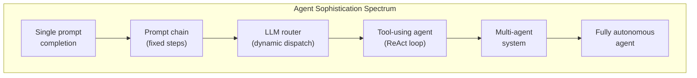
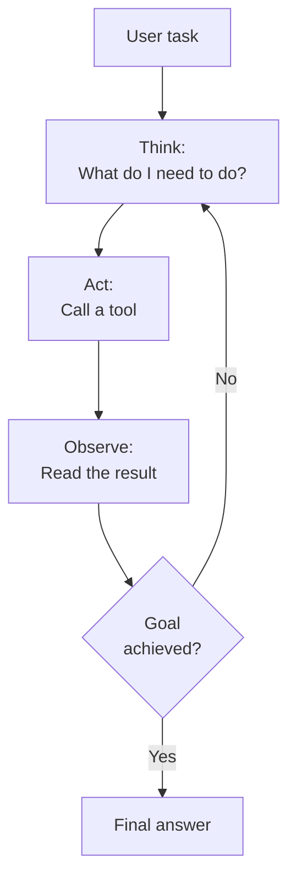
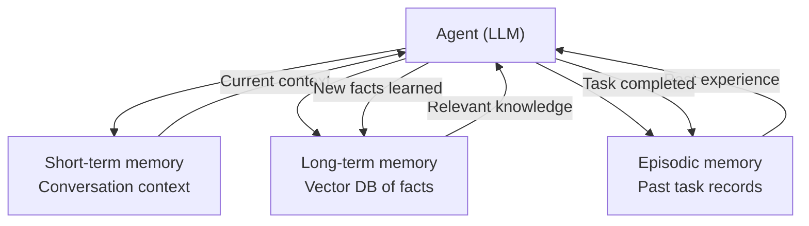
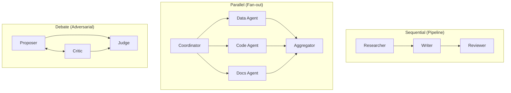

# AI Agents Architecture

An AI agent is a system that uses a large language model as a reasoning engine to decide what actions to take, execute those actions through tools, observe the results, and iterate until the task is complete. Unlike a simple chat completion — one prompt in, one response out — an agent operates in a loop: think, act, observe, repeat.

Agents are how you build systems that can research a topic across multiple sources, write and execute code, interact with APIs, manage multi-step workflows, and adapt their approach based on intermediate results. This page covers the architecture patterns, memory systems, and engineering practices that make agents reliable in production.

## What Makes Something an Agent

The word "agent" is overloaded. Here is a precise definition:

An AI agent has these properties:
1. **Goal-directed** — It receives a high-level objective, not step-by-step instructions
2. **Autonomous** — It decides which actions to take and in what order
3. **Tool-using** — It interacts with external systems (APIs, databases, code execution)
4. **Iterative** — It operates in a loop, refining its approach based on observations
5. **Self-evaluating** — It assesses whether it has achieved its goal

### The Agent Spectrum

Not everything called an "agent" has all five properties. Systems exist on a spectrum:



| Level | Description | Example |
|-------|------------|---------|
| **Prompt** | One call, one response | "Summarize this document" |
| **Chain** | Fixed sequence of LLM calls | Extract requirements -> generate code -> review |
| **Router** | LLM decides which path to take | Classify intent, route to specialist prompt |
| **Tool agent** | LLM loop with tool calls | Research assistant that searches, reads, and synthesizes |
| **Multi-agent** | Multiple agents collaborating | Code writer + reviewer + tester |
| **Autonomous** | Self-directed, long-running | "Monitor this system and fix issues as they arise" |

## The ReAct Pattern (Reasoning + Acting)

ReAct is the foundational pattern for tool-using agents. The model alternates between **reasoning** (thinking about what to do) and **acting** (calling a tool), then observes the result and reasons again.



### Implementation

```python
import json
from openai import OpenAI

client = OpenAI()

SYSTEM_PROMPT = """You are a research agent that answers questions by searching
for information and synthesizing findings.

Available tools:
- search_docs: Search the internal documentation
- read_url: Read the contents of a URL
- run_sql: Execute a read-only SQL query against the analytics database

Process:
1. Think about what information you need
2. Use the appropriate tool to get it
3. Analyze the result
4. If you have enough information, provide your final answer
5. If not, search for more information

Always cite your sources. If you cannot find the answer, say so explicitly.
"""

tools = [
    {
        "type": "function",
        "function": {
            "name": "search_docs",
            "description": "Search internal documentation by semantic query",
            "parameters": {
                "type": "object",
                "properties": {
                    "query": {"type": "string", "description": "Natural language search query"},
                    "limit": {"type": "integer", "default": 5},
                },
                "required": ["query"]
            }
        }
    },
    {
        "type": "function",
        "function": {
            "name": "run_sql",
            "description": "Execute a read-only SQL query against the analytics database. Tables: users, orders, events.",
            "parameters": {
                "type": "object",
                "properties": {
                    "query": {"type": "string", "description": "SQL query (SELECT only)"},
                },
                "required": ["query"]
            }
        }
    },
]

async def run_agent(user_message: str, max_iterations: int = 10) -> str:
    messages = [
        {"role": "system", "content": SYSTEM_PROMPT},
        {"role": "user", "content": user_message},
    ]

    for iteration in range(max_iterations):
        response = client.chat.completions.create(
            model="gpt-4o",
            messages=messages,
            tools=tools,
            tool_choice="auto",
        )

        message = response.choices[0].message
        messages.append(message)

        # If no tool calls, the agent is done
        if not message.tool_calls:
            return message.content

        # Execute each tool call
        for tool_call in message.tool_calls:
            function_name = tool_call.function.name
            arguments = json.loads(tool_call.function.arguments)

            # Execute the tool (with safety checks)
            result = await execute_tool(function_name, arguments)

            messages.append({
                "role": "tool",
                "tool_call_id": tool_call.id,
                "content": json.dumps(result),
            })

    return "Agent reached maximum iterations without completing the task."
```

### Tool Execution Safety

```python
TOOL_REGISTRY = {
    "search_docs": search_docs_handler,
    "run_sql": run_sql_handler,
    "read_url": read_url_handler,
}

async def execute_tool(name: str, arguments: dict) -> dict:
    """Execute a tool with validation and error handling."""
    if name not in TOOL_REGISTRY:
        return {"error": f"Unknown tool: {name}"}

    handler = TOOL_REGISTRY[name]

    try:
        # Timeout protection
        result = await asyncio.wait_for(
            handler(**arguments),
            timeout=30.0,
        )
        return {"status": "success", "result": result}
    except asyncio.TimeoutError:
        return {"error": "Tool execution timed out after 30 seconds"}
    except Exception as e:
        return {"error": f"Tool execution failed: {str(e)}"}
```

::: danger Agent safety is non-negotiable
Never let an agent execute arbitrary code, make destructive API calls, or access sensitive data without explicit guardrails. Every tool should have input validation, output sanitization, rate limiting, and a timeout. Assume the model will eventually try something unexpected.
:::

## Tool Use and Function Calling

The tools you give an agent define its capabilities. Well-designed tools are the difference between an agent that works and one that flails.

### Tool Design Principles

| Principle | Why | Example |
|-----------|-----|---------|
| **Atomic operations** | Each tool does one thing clearly | `search_docs` not `search_and_summarize_docs` |
| **Descriptive names** | The model uses the name to decide when to call it | `get_user_orders` not `query1` |
| **Rich descriptions** | The model uses descriptions as instructions | "Search docs. Returns top 5 results with title and snippet." |
| **Constrained inputs** | Use enums, ranges, and required fields | `environment: enum["staging", "production"]` |
| **Structured outputs** | Return JSON the model can reason about | `{"results": [...], "total": 42}` not raw HTML |
| **Error messages** | Return actionable error descriptions | `"No user found with ID 123"` not `"Error"` |

### Dynamic Tool Selection

For agents with many tools, dynamically select which tools are relevant to the current task:

```python
ALL_TOOLS = {
    "search_docs": { ... },
    "run_sql": { ... },
    "create_ticket": { ... },
    "send_email": { ... },
    "deploy_service": { ... },
    "read_url": { ... },
}

async def select_tools(user_message: str) -> list[dict]:
    """Use a cheap model to select relevant tools for this task."""
    tool_descriptions = "\n".join(
        f"- {name}: {tool['function']['description']}"
        for name, tool in ALL_TOOLS.items()
    )

    selected = await llm_call(
        model="gpt-4o-mini",
        system=f"""Given a user task, select which tools would be useful.
Available tools:
{tool_descriptions}

Return a JSON array of tool names. Select only tools relevant to the task.""",
        user=user_message,
    )

    tool_names = json.loads(selected)
    return [ALL_TOOLS[name] for name in tool_names if name in ALL_TOOLS]
```

## Memory Architectures

Agents need memory to maintain context across interactions, learn from past experiences, and manage long-running tasks. There are three types:

### Short-Term Memory (Conversation Context)

The conversation history passed to the LLM. Limited by context window size. Every agent has this by default.

```python
class ConversationMemory:
    def __init__(self, max_tokens: int = 100_000):
        self.messages: list[dict] = []
        self.max_tokens = max_tokens

    def add(self, message: dict):
        self.messages.append(message)
        self._trim()

    def _trim(self):
        """Remove oldest messages when exceeding token limit."""
        while self._estimate_tokens() > self.max_tokens and len(self.messages) > 2:
            # Keep system message and most recent messages
            self.messages.pop(1)  # Remove oldest non-system message

    def get_messages(self) -> list[dict]:
        return self.messages.copy()
```

### Long-Term Memory (Persistent Knowledge)

Facts, preferences, and learned information stored in a database and retrieved when relevant. This is essentially RAG applied to agent memory.

```python
class LongTermMemory:
    def __init__(self, vector_db, embedding_model):
        self.db = vector_db
        self.embed = embedding_model

    async def store(self, content: str, metadata: dict):
        """Store a memory with metadata."""
        embedding = await self.embed(content)
        await self.db.upsert({
            "id": str(uuid4()),
            "embedding": embedding,
            "metadata": {
                **metadata,
                "content": content,
                "created_at": datetime.utcnow().isoformat(),
            }
        })

    async def recall(self, query: str, top_k: int = 5) -> list[str]:
        """Retrieve relevant memories for the current context."""
        query_embedding = await self.embed(query)
        results = await self.db.query(
            vector=query_embedding,
            top_k=top_k,
        )
        return [r.metadata["content"] for r in results]

    async def forget(self, memory_id: str):
        """Remove a specific memory (GDPR compliance, corrections)."""
        await self.db.delete(memory_id)
```

### Episodic Memory (Task History)

Records of past task executions — what worked, what failed, and what was learned. This allows agents to improve over time.

```python
class EpisodicMemory:
    def __init__(self, db):
        self.db = db

    async def record_episode(self, episode: dict):
        """Record a completed task for future reference."""
        await self.db.insert({
            "task": episode["task"],
            "approach": episode["steps_taken"],
            "outcome": episode["outcome"],  # success/failure
            "lessons": episode["lessons_learned"],
            "tools_used": episode["tools_used"],
            "duration": episode["duration_seconds"],
            "timestamp": datetime.utcnow(),
        })

    async def get_similar_episodes(self, task: str) -> list[dict]:
        """Find past episodes similar to the current task."""
        return await self.db.search(
            query=task,
            collection="episodes",
            top_k=3,
        )
```

### Memory Architecture



## Planning and Task Decomposition

Complex tasks require planning. The agent must break a high-level goal into subtasks, determine dependencies, and execute them in order.

### Plan-and-Execute Pattern

```python
async def plan_and_execute(task: str) -> str:
    # Step 1: Generate a plan
    plan = await llm_call(
        model="gpt-4o",
        system="""Create a step-by-step plan to accomplish the given task.
Each step should be concrete and actionable.
Return as a JSON array of objects with 'step', 'description', and 'dependencies' (array of step numbers).

Example:
[
  {"step": 1, "description": "Search for current pricing data", "dependencies": []},
  {"step": 2, "description": "Query the database for historical prices", "dependencies": []},
  {"step": 3, "description": "Compare current vs historical and summarize", "dependencies": [1, 2]}
]""",
        user=task,
    )

    steps = json.loads(plan)
    results = {}

    # Step 2: Execute steps respecting dependencies
    for step in topological_sort(steps):
        # Gather results from dependencies
        dep_context = "\n".join(
            f"Step {d} result: {results[d]}"
            for d in step["dependencies"]
            if d in results
        )

        result = await run_agent(
            f"""Execute this step: {step['description']}

Previous results:
{dep_context}

Use the available tools to complete this step. Return only the result."""
        )

        results[step["step"]] = result

    # Step 3: Synthesize final answer
    all_results = "\n".join(f"Step {k}: {v}" for k, v in results.items())
    final = await llm_call(
        model="gpt-4o",
        system="Synthesize the results of all steps into a coherent final answer.",
        user=f"Original task: {task}\n\nStep results:\n{all_results}",
    )

    return final
```

### Adaptive Replanning

Plans fail. Tools return errors. Results are unexpected. A robust agent detects failure and replans:

```python
async def adaptive_execute(task: str, max_replans: int = 3) -> str:
    plan = await generate_plan(task)

    for replan_attempt in range(max_replans):
        try:
            result = await execute_plan(plan)
            # Validate the result
            validation = await validate_result(task, result)
            if validation["is_valid"]:
                return result
            else:
                # Result doesn't meet the goal — replan
                plan = await replan(task, plan, result, validation["issues"])
        except ToolExecutionError as e:
            # A tool failed — replan around the failure
            plan = await replan(task, plan, str(e), [f"Tool failed: {e}"])

    return "Unable to complete the task after multiple attempts."
```

## Multi-Agent Systems

When a task is too complex for a single agent, split it across specialized agents that collaborate.

### Patterns



### Implementation: Code Review Multi-Agent

```python
class CodeReviewSystem:
    def __init__(self):
        self.agents = {
            "security": Agent(
                system="You are a security expert. Review code for vulnerabilities: injection, auth bypass, data exposure, secrets.",
                tools=[search_cve_tool, scan_dependencies_tool],
            ),
            "performance": Agent(
                system="You are a performance engineer. Review code for: N+1 queries, memory leaks, unnecessary allocations, missing caching.",
                tools=[profile_tool, benchmark_tool],
            ),
            "correctness": Agent(
                system="You are a senior engineer. Review code for: logic errors, edge cases, error handling, race conditions.",
                tools=[test_runner_tool, lint_tool],
            ),
        }

    async def review(self, code: str) -> dict:
        # Run all reviews in parallel
        reviews = await asyncio.gather(
            self.agents["security"].run(f"Review this code:\n\n{code}"),
            self.agents["performance"].run(f"Review this code:\n\n{code}"),
            self.agents["correctness"].run(f"Review this code:\n\n{code}"),
        )

        # Synthesize with a coordinator agent
        synthesis = await llm_call(
            model="gpt-4o",
            system="Combine these code reviews into a single coherent review, deduplicating issues and prioritizing by severity.",
            user=json.dumps({
                "security_review": reviews[0],
                "performance_review": reviews[1],
                "correctness_review": reviews[2],
            }),
        )

        return json.loads(synthesis)
```

### Multi-Agent Communication Patterns

| Pattern | When to Use | Complexity |
|---------|------------|------------|
| **Pipeline** | Sequential processing (research -> write -> review) | Low |
| **Fan-out/fan-in** | Parallel independent subtasks | Medium |
| **Debate** | Decisions requiring multiple perspectives | Medium |
| **Hierarchical** | Complex tasks with a manager delegating to specialists | High |
| **Shared blackboard** | Agents contribute to a shared workspace | High |

## Evaluation and Testing

### Agent Evaluation Framework

```python
class AgentEvaluator:
    def __init__(self, agent):
        self.agent = agent

    async def evaluate(self, test_cases: list[dict]) -> dict:
        results = []
        for case in test_cases:
            start = time.time()
            response = await self.agent.run(case["input"])
            duration = time.time() - start

            # Check correctness
            correctness = await llm_judge(
                f"""Is this response correct and complete for the given task?
Task: {case['input']}
Expected: {case['expected_output']}
Actual: {response}
Score 1-5 where 5 is perfect."""
            )

            results.append({
                "task": case["input"],
                "response": response,
                "correctness_score": int(correctness),
                "tool_calls": self.agent.tool_call_count,
                "duration_seconds": duration,
                "within_budget": self.agent.total_cost < case.get("max_cost", 1.0),
            })

        return {
            "avg_correctness": np.mean([r["correctness_score"] for r in results]),
            "avg_tool_calls": np.mean([r["tool_calls"] for r in results]),
            "avg_duration": np.mean([r["duration_seconds"] for r in results]),
            "budget_compliance": np.mean([r["within_budget"] for r in results]),
            "details": results,
        }
```

### What to Test

| Dimension | What to Measure | Red Flag |
|-----------|----------------|----------|
| **Task completion** | Does the agent achieve the goal? | < 80% success rate on eval set |
| **Tool efficiency** | How many tool calls per task? | > 2x expected calls (looping) |
| **Cost** | Total LLM + tool cost per task | > 3x budget per task |
| **Latency** | End-to-end time | > 60s for simple tasks |
| **Safety** | Does it stay within guardrails? | Any guardrail violation |
| **Graceful failure** | Does it handle errors cleanly? | Crashes or infinite loops |

## Guardrails

### Input Guardrails

Filter and validate user inputs before they reach the agent:

```python
async def input_guardrails(user_message: str) -> tuple[bool, str]:
    """Returns (is_safe, reason)."""
    # Content policy check
    moderation = await openai_client.moderations.create(input=user_message)
    if moderation.results[0].flagged:
        return False, "Content policy violation"

    # Scope check: is this within the agent's domain?
    in_scope = await llm_call(
        model="gpt-4o-mini",
        system="""Determine if this request is within scope for a DevOps assistant.
In scope: deployment questions, monitoring, infrastructure, CI/CD, troubleshooting.
Out of scope: personal advice, creative writing, anything unrelated to engineering.
Return "in_scope" or "out_of_scope".""",
        user=user_message,
    )
    if in_scope.strip() == "out_of_scope":
        return False, "Request outside agent scope"

    return True, ""
```

### Output Guardrails

Validate agent outputs before returning to the user:

```python
async def output_guardrails(response: str, context: dict) -> str:
    """Validate and sanitize agent output."""
    # Check for hallucinated data
    if context.get("requires_citations"):
        has_citations = await verify_citations(response, context["sources"])
        if not has_citations:
            response += "\n\nNote: Some claims in this response could not be verified against available sources."

    # Check for leaked sensitive data
    sensitive_patterns = [
        r'\b\d{3}-\d{2}-\d{4}\b',     # SSN
        r'\b[A-Za-z0-9+/]{40}\b',       # API keys
        r'password\s*[=:]\s*\S+',        # Passwords
    ]
    for pattern in sensitive_patterns:
        if re.search(pattern, response):
            response = re.sub(pattern, "[REDACTED]", response)

    return response
```

### Rate Limiting and Budget Controls

```python
class AgentBudget:
    def __init__(self, max_llm_calls: int = 20, max_cost_usd: float = 1.0, max_duration_s: float = 120):
        self.max_llm_calls = max_llm_calls
        self.max_cost_usd = max_cost_usd
        self.max_duration_s = max_duration_s
        self.llm_calls = 0
        self.total_cost = 0.0
        self.start_time = time.time()

    def check(self) -> tuple[bool, str]:
        if self.llm_calls >= self.max_llm_calls:
            return False, f"Exceeded max LLM calls ({self.max_llm_calls})"
        if self.total_cost >= self.max_cost_usd:
            return False, f"Exceeded cost budget (${self.max_cost_usd})"
        if time.time() - self.start_time >= self.max_duration_s:
            return False, f"Exceeded time budget ({self.max_duration_s}s)"
        return True, ""

    def record_call(self, input_tokens: int, output_tokens: int, model: str):
        self.llm_calls += 1
        self.total_cost += estimate_cost(input_tokens, output_tokens, model)
```

::: warning Production agents need all three guardrails
Input guardrails prevent misuse. Output guardrails prevent leaks. Budget controls prevent runaway costs. Skipping any one of them will bite you in production. Design guardrails from day one, not as an afterthought.
:::

## Further Reading

- [LLM Integration Patterns](/ai-ml-engineering/llm-integration) — Function calling and tool use fundamentals
- [RAG Architecture Deep Dive](/ai-ml-engineering/rag-architecture) — Agentic RAG and retrieval-augmented agents
- [Embeddings & Semantic Search](/ai-ml-engineering/embeddings) — Memory retrieval using vector similarity
- [Prompt Engineering](/prompt-engineering/) — Crafting effective agent system prompts
- [Architecture Patterns: Event-Driven](/architecture-patterns/event-driven/) — Event-driven patterns for agent orchestration
