# AI Coding Assistants

::: tip Key Takeaway
- AI coding assistants are not autocomplete on steroids — the best ones are **agentic systems** that understand your codebase, plan multi-file changes, run commands, and iterate on errors
- The landscape has fragmented into two camps: **IDE-integrated** (Copilot, Cursor, Windsurf) and **CLI-native** (Claude Code, Aider) — each optimized for different workflows
- Effective use requires **context management**, not just prompting — feeding the right files, the right abstractions, and the right constraints to the model matters more than clever prompt phrasing
- Never ship AI-generated code without review — these tools have a **confidence problem**: they produce plausible-looking code that compiles and passes basic tests but may contain subtle logic errors, security vulnerabilities, or architectural violations
:::

## One-Liner Summary

> AI coding assistants range from inline autocomplete to fully agentic systems that can plan, edit, test, and iterate across your entire codebase — but they are co-pilots, not auto-pilots.

---

## 1. The Landscape in 2026

The AI coding assistant market has matured from "autocomplete that sometimes works" to "agentic systems that can implement features." Here is the current landscape:

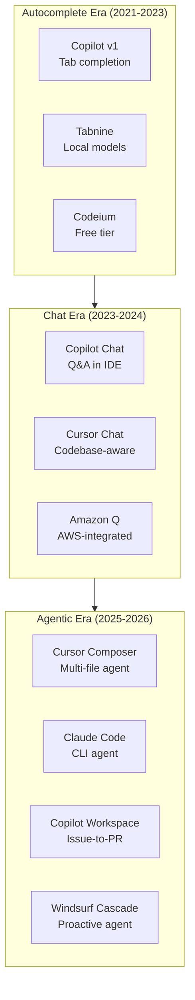

| Tool | Type | Primary Model | Key Differentiator |
|------|------|---------------|-------------------|
| **GitHub Copilot** | IDE extension | GPT-4o / Claude 3.5 | Deepest GitHub integration, largest user base |
| **Cursor** | AI-native IDE | Claude / GPT-4o / custom | Purpose-built IDE with codebase indexing |
| **Claude Code** | CLI agent | Claude Sonnet/Opus | Terminal-native, MCP integration, hooks |
| **Windsurf (Codeium)** | AI-native IDE | Cascade (proprietary) | Proactive suggestions, flow-state design |
| **Amazon Q Developer** | IDE extension + CLI | Amazon Bedrock models | AWS-native, security scanning, Java upgrades |
| **Aider** | CLI agent | Any model via API | Open source, git-native, pair programming |
| **Tabnine** | IDE extension | Tabnine models | On-premise deployment, IP-safe |
| **Sourcegraph Cody** | IDE extension + web | Multiple | Codebase-wide context from Sourcegraph index |

## 2. GitHub Copilot

### What It Is

GitHub Copilot is the most widely adopted AI coding assistant. Launched in 2021 as a VS Code extension, it has expanded into a multi-surface platform: inline completion, chat, CLI, and workspace.

### Architecture

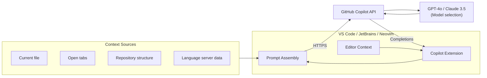

### Features

**Inline Completions** — The original feature. Copilot reads the current file, open tabs, and language server data to suggest code as you type. Accept with Tab, reject by continuing to type.

```python
# Type this comment and Copilot suggests the implementation:
# Function to calculate the Levenshtein distance between two strings
def levenshtein_distance(s1: str, s2: str) -> int:
    # Copilot generates the dynamic programming implementation
    if len(s1) < len(s2):
        return levenshtein_distance(s2, s1)
    if len(s2) == 0:
        return len(s1)
    previous_row = range(len(s2) + 1)
    for i, c1 in enumerate(s1):
        current_row = [i + 1]
        for j, c2 in enumerate(s2):
            insertions = previous_row[j + 1] + 1
            deletions = current_row[j] + 1
            substitutions = previous_row[j] + (c1 != c2)
            current_row.append(min(insertions, deletions, substitutions))
        previous_row = current_row
    return previous_row[-1]
```

**Copilot Chat** — Conversational AI inside the IDE. You can ask questions about code, request explanations, generate tests, fix bugs, and refactor. Copilot Chat has access to:

- The currently selected code
- The active file
- Workspace-level context (files, symbols)
- Terminal output
- Diagnostics (errors, warnings)

```
User: @workspace Why is this API endpoint returning 500 errors?

Copilot: Looking at your codebase, the `/api/users` endpoint in
`src/routes/users.ts` calls `getUserById()` which queries the
database. The issue is on line 42 — you're passing `req.params.id`
directly to the query without parsing it as an integer. When the
ID is a string like "abc", the database driver throws a type error
that isn't caught.

Fix: Add input validation and error handling...
```

**Copilot Workspace** — GitHub's most ambitious Copilot feature. Starting from a GitHub issue, Copilot Workspace:

1. Reads the issue description and linked context
2. Analyzes the repository to understand the codebase
3. Creates a **plan** listing which files to modify and what changes to make
4. Implements the plan as code changes
5. Presents the changes for review
6. Optionally creates a pull request

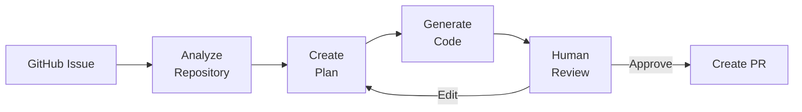

**Copilot CLI** — AI assistance in the terminal:

```bash
# Ask Copilot to explain a command
gh copilot explain "find . -name '*.log' -mtime +30 -delete"

# Ask Copilot to suggest a command
gh copilot suggest "find all Python files larger than 1MB modified in the last week"
```

### Pricing (as of 2026)

| Plan | Price | Features |
|------|-------|----------|
| **Individual** | $10/month | Completions, chat, CLI |
| **Business** | $19/user/month | + Organization policies, IP indemnity, audit logs |
| **Enterprise** | $39/user/month | + Fine-tuning, knowledge bases, advanced security |

## 3. Cursor

### What It Is

Cursor is a **purpose-built AI IDE** — a fork of VS Code redesigned from the ground up for AI-assisted development. Unlike Copilot (which is an extension bolted onto an existing editor), Cursor's AI features are integrated into the core editor experience.

### Key Features

**Codebase Indexing** — Cursor indexes your entire codebase into a vector store, enabling it to retrieve relevant code from anywhere in the project when answering questions or making edits. This is the single biggest advantage over extension-based tools.

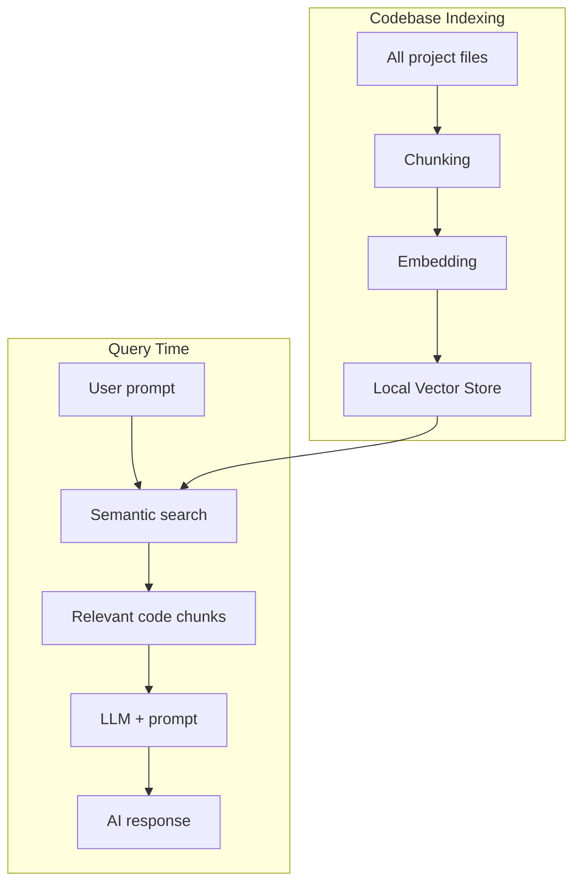

**Composer** — Cursor's multi-file editing agent. You describe what you want in natural language, and Composer:

1. Plans which files need to change
2. Makes coordinated edits across multiple files
3. Shows diffs for each file
4. Lets you accept, reject, or modify each change individually

```
Prompt: "Add rate limiting to all API endpoints. Use a sliding
window algorithm with Redis. Each endpoint should have
configurable limits. Add middleware, config, and tests."

Composer response:
  Modified: src/middleware/rateLimit.ts (new file)
  Modified: src/config/rateLimits.ts (new file)
  Modified: src/routes/api.ts (added middleware)
  Modified: src/routes/auth.ts (added middleware)
  Modified: tests/rateLimit.test.ts (new file)
  Modified: package.json (added ioredis dependency)
```

**Tab Completion (Copilot++)** — Cursor's autocomplete is model-aware and context-aware. It predicts not just the next line, but multi-line blocks, and can predict your next edit location (cursor prediction).

**Inline Editing (Cmd+K / Ctrl+K)** — Select code, press the shortcut, describe the change, and Cursor edits the selection in place. Works for:

- Refactoring (rename, extract, restructure)
- Bug fixing ("fix the off-by-one error in this loop")
- Adding features ("add error handling to this function")
- Translation ("convert this Python to TypeScript")

**Chat with @-mentions** — Cursor's chat supports rich context references:

| Reference | What It Includes |
|-----------|-----------------|
| `@file` | Specific file contents |
| `@folder` | All files in a directory |
| `@codebase` | Semantically relevant code from the entire project |
| `@web` | Web search results |
| `@docs` | Crawled documentation sites |
| `@git` | Git history and diffs |

```
User: @codebase @docs(prisma) How do I add a soft delete
feature to the User model? Show me the migration, model
changes, and middleware.

Cursor: Based on your schema in prisma/schema.prisma and
Prisma's current documentation, here's how to implement
soft delete...
```

**Rules for AI** — Cursor supports project-level rules (`.cursorrules` or `.cursor/rules/`) that instruct the AI about your coding conventions, architecture, and preferences:

```
# .cursorrules
You are working on a Next.js 15 application with App Router.
- Use server components by default
- Use Tailwind CSS for styling, no CSS modules
- All data fetching happens in server components
- Use Zod for validation
- Database queries use Prisma
- Error boundaries wrap every route segment
- Follow the repository structure in docs/ARCHITECTURE.md
```

### Pricing (as of 2026)

| Plan | Price | Features |
|------|-------|----------|
| **Hobby** | Free | 2000 completions, 50 slow requests/month |
| **Pro** | $20/month | Unlimited completions, 500 fast requests |
| **Business** | $40/user/month | + Admin controls, SAML SSO, usage analytics |

## 4. Claude Code

### What It Is

Claude Code is Anthropic's **CLI-native agentic coding tool**. Unlike IDE-based tools, Claude Code runs in your terminal and operates as a full coding agent — it reads files, writes code, runs commands, interprets errors, and iterates until the task is done.

### Architecture

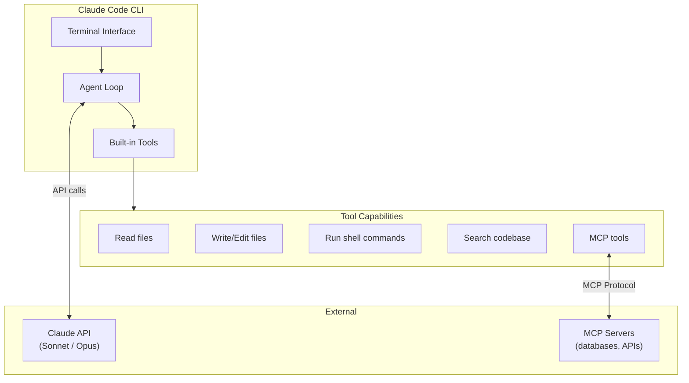

### Key Features

**Agentic Loop** — Claude Code does not just suggest code; it operates in a think-act-observe loop. Give it a task and it:

1. Reads relevant files to understand the codebase
2. Plans the changes
3. Writes or edits code
4. Runs tests or build commands
5. Reads errors and fixes them
6. Iterates until the task is complete

```bash
# Claude Code in action
$ claude

> Add a /health endpoint to the Express app that checks
  database connectivity and returns status with latency.

Claude: I'll add a health check endpoint. Let me first understand
the project structure...

[Reads src/app.ts, src/db.ts, src/routes/]
[Creates src/routes/health.ts]
[Edits src/app.ts to register the new route]
[Runs npm test]
[Tests fail — missing import]
[Fixes the import]
[Runs npm test again]
[All tests pass]

Done. Created src/routes/health.ts with database connectivity
check and registered it in src/app.ts. All existing tests pass.
```

**MCP Integration** — Claude Code supports the Model Context Protocol, allowing it to connect to external tools and data sources:

```json
// .claude/mcp.json
{
  "mcpServers": {
    "postgres": {
      "command": "npx",
      "args": ["-y", "@modelcontextprotocol/server-postgres"],
      "env": { "DATABASE_URL": "postgresql://localhost:5432/mydb" }
    },
    "github": {
      "command": "npx",
      "args": ["-y", "@modelcontextprotocol/server-github"],
      "env": { "GITHUB_TOKEN": "ghp_xxx" }
    }
  }
}
```

With MCP servers connected, Claude Code can query your database, read GitHub issues, search documentation, and more — all without leaving the terminal.

**Hooks** — Claude Code supports lifecycle hooks that run custom scripts before or after specific events:

```json
// .claude/settings.json
{
  "hooks": {
    "PreToolUse": [
      {
        "matcher": "Bash",
        "hooks": ["python .claude/hooks/validate_command.py"]
      }
    ],
    "PostToolUse": [
      {
        "matcher": "Write",
        "hooks": ["npx prettier --write $CLAUDE_FILE_PATH"]
      }
    ]
  }
}
```

**Headless Mode** — Run Claude Code non-interactively for CI/CD integration:

```bash
# Generate a PR description from a diff
claude -p "Write a PR description for these changes" --output pr-body.md

# Code review in CI
claude -p "Review this diff for security issues: $(git diff main...HEAD)" \
  --output review.md --allowedTools Read,Grep,Glob
```

**Extended Thinking** — Claude Code can use Claude's extended thinking capability for complex tasks, showing its reasoning chain before acting.

### Pricing

Claude Code uses the Claude API directly — you pay per token:

| Model | Input | Output |
|-------|-------|--------|
| Claude Sonnet 4 | $3/MTok | $15/MTok |
| Claude Opus 4 | $15/MTok | $75/MTok |

Alternatively, use the Max plan ($100/month or $200/month) for included usage.

## 5. Windsurf (Codeium)

### What It Is

Windsurf (formerly Codeium) is an **AI-native IDE** built on VS Code, with a focus on "flow state" — the idea that the AI should anticipate what you need next rather than waiting to be asked.

### Key Feature: Cascade

Cascade is Windsurf's agentic system. It observes your actions in the IDE — what files you open, what you type, what errors appear — and proactively suggests next steps.

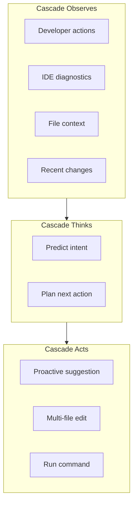

**Flows** — Windsurf introduces "Flows" — sequences of related AI actions that together accomplish a task. A flow might include: reading relevant files, making edits, running tests, fixing errors, and updating documentation. The AI chains these into a coherent workflow.

**Real-time suggestions** — Windsurf provides completions as you type, like Copilot, but with deeper awareness of the changes you have made in the current session. If you just added a new field to a database model, Windsurf proactively suggests updating the related API endpoint, validation schema, and tests.

**Terminal integration** — Windsurf can read terminal output, detect errors, and suggest fixes directly in the IDE without switching to a chat panel.

### Pricing (as of 2026)

| Plan | Price | Features |
|------|-------|----------|
| **Free** | $0 | Limited completions and chat |
| **Pro** | $15/month | Unlimited completions, Cascade, premium models |
| **Team** | $30/user/month | + Admin controls, usage analytics |

## 6. Amazon Q Developer

### What It Is

Amazon Q Developer (formerly CodeWhisperer) is AWS's AI coding assistant, deeply integrated with the AWS ecosystem.

### Key Features

**Code generation** — Inline completions and chat-based generation, optimized for AWS services:

```python
# Amazon Q knows AWS SDK patterns deeply
import boto3

# Q suggests the complete S3 upload with error handling
def upload_to_s3(file_path: str, bucket: str, key: str) -> str:
    s3 = boto3.client("s3")
    try:
        s3.upload_file(
            file_path, bucket, key,
            ExtraArgs={"ServerSideEncryption": "aws:kms"},
        )
        return f"s3://{bucket}/{key}"
    except boto3.exceptions.S3UploadFailedError as e:
        raise RuntimeError(f"Upload failed: {e}")
```

**Security scanning** — Built-in SAST that checks for vulnerabilities in your code and dependencies. Catches credential leaks, injection flaws, and insecure configurations.

**Java transformation** — Amazon Q can automatically upgrade Java applications from Java 8/11 to Java 17+, including dependency updates, API migrations, and build configuration changes. This is a unique feature targeting enterprise modernization.

**Agent capabilities** — Amazon Q Developer Agent can implement features from natural language descriptions within the IDE, operating similarly to Cursor's Composer but with deep AWS service awareness.

**`.NET transformation`** — Similar to Java transformation but for migrating .NET Framework applications to .NET 6+.

### Pricing (as of 2026)

| Plan | Price | Features |
|------|-------|----------|
| **Free** | $0 | Limited completions, security scanning |
| **Pro** | $19/user/month | Unlimited completions, agent features |

## 7. How to Use AI Assistants Effectively

### Context Management is Everything

The single most impactful skill for AI coding assistants is **context management** — giving the model the right information to make good decisions.

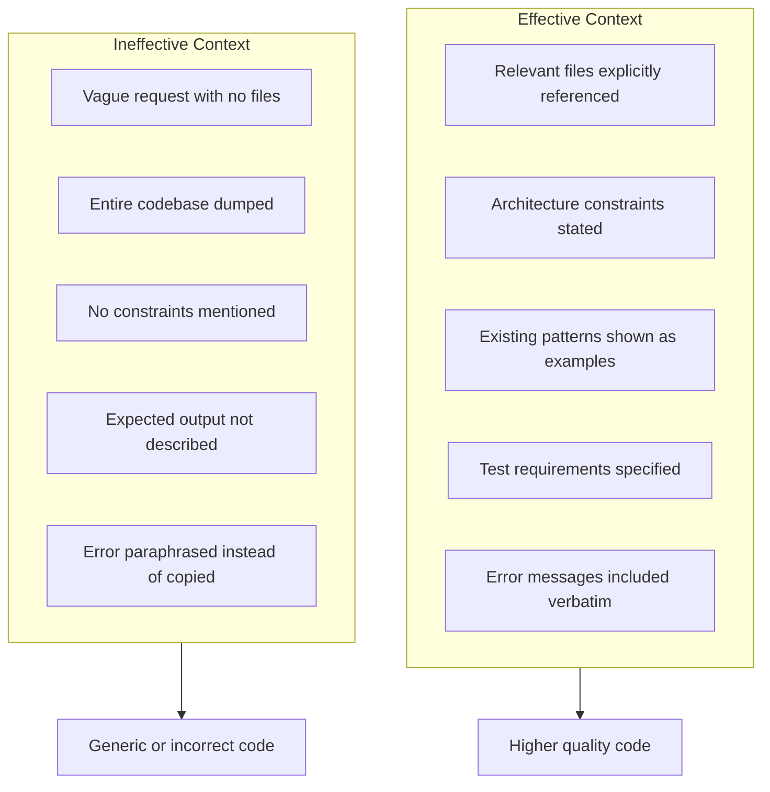

### Prompting Strategies

**1. Be Specific About Constraints**

::: danger Bad
"Add authentication to the app"
:::

::: tip Good
"Add JWT authentication middleware to the Express app in src/app.ts. Use the existing User model in src/models/user.ts. Tokens should expire in 24h. The /api/auth/login endpoint should accept email/password and return a JWT. All /api/ routes except /api/auth/ should require a valid token. Use the jose library for JWT operations. Add tests in tests/auth.test.ts using the existing test setup."
:::

**2. Show Existing Patterns**

```
Look at src/routes/users.ts for the routing pattern we use.
New routes should follow the same structure: Zod validation
schema, async handler function, error handling middleware.
Create src/routes/products.ts following this exact pattern.
```

**3. Iterate, Don't Restart**

When the AI gets something wrong, do not delete everything and re-prompt. Instead, give specific feedback:

```
The rate limiter implementation is good, but:
1. Use sliding window, not fixed window
2. The Redis key should include the user ID, not just IP
3. Add a X-RateLimit-Remaining header to responses
4. The 429 response body should match our error format in src/utils/errors.ts

Keep everything else the same and fix these four things.
```

**4. Use Incremental Complexity**

Do not ask for an entire feature in one prompt. Break it into steps:

```
Step 1: "Create the database migration for a products table
        with name, price, category, and timestamps"
Step 2: "Create the Prisma model and generate the client"
Step 3: "Create CRUD API endpoints following the pattern in users.ts"
Step 4: "Add validation using Zod, matching our validation pattern"
Step 5: "Add tests for all endpoints"
```

**5. Provide Negative Examples**

```
DO NOT use any/unknown types.
DO NOT use try-catch blocks that swallow errors silently.
DO NOT use console.log for production logging — use the
  logger from src/utils/logger.ts.
DO NOT create new utility functions — check src/utils/ first.
```

### Workflow Integration

**The Review-Before-Accept Workflow:**

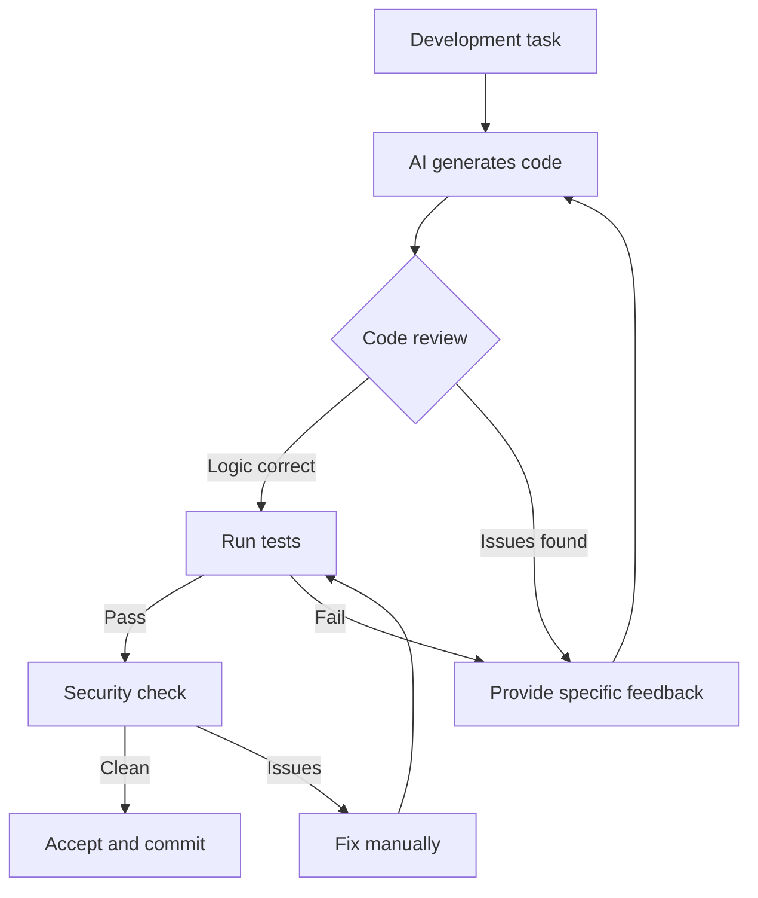

**Using AI Assistants in Pair Programming:**

| Scenario | Best Tool | Why |
|----------|-----------|-----|
| Exploring a new codebase | Cursor Chat + `@codebase` | Indexed search across all files |
| Implementing a planned feature | Claude Code | Agentic loop handles multi-step work |
| Quick inline edits | Copilot / Cursor Tab | Fastest for small changes |
| Debugging with logs | Windsurf Cascade | Reads terminal output proactively |
| Writing tests for existing code | Any chat-based tool | Provide the source file, get tests back |
| Code review | Claude Code headless | Run in CI for automated review |
| AWS infrastructure code | Amazon Q | Deep AWS SDK knowledge |
| Refactoring large modules | Cursor Composer | Multi-file coordinated edits |

## 8. Comparison Table

| Feature | GitHub Copilot | Cursor | Claude Code | Windsurf | Amazon Q |
|---------|---------------|--------|-------------|----------|----------|
| **Type** | Extension | IDE | CLI | IDE | Extension + CLI |
| **Base editor** | VS Code, JetBrains, Neovim | VS Code fork | Terminal | VS Code fork | VS Code, JetBrains |
| **Inline completion** | Yes | Yes | No | Yes | Yes |
| **Chat** | Yes | Yes | Yes (terminal) | Yes | Yes |
| **Multi-file agent** | Workspace | Composer | Core feature | Cascade | Agent |
| **Codebase indexing** | Partial | Full vector index | On-demand reads | Full index | Partial |
| **MCP support** | No | Via extensions | Native | No | No |
| **Runs shell commands** | No | Limited | Yes | Limited | Limited |
| **Custom rules** | Limited | `.cursorrules` | `CLAUDE.md` | Windsurf rules | Limited |
| **Git integration** | Deep (GitHub) | Good | Full (CLI) | Good | Basic |
| **Self-hosted** | Enterprise only | No | API-based | No | No |
| **Model choice** | GPT-4o, Claude | Claude, GPT-4o, Gemini | Claude only | Proprietary + others | Bedrock models |
| **Starting price** | $10/mo | Free (limited) | API usage | Free (limited) | Free (limited) |
| **Best for** | General dev in VS Code | Multi-file projects | Terminal workflows | Flow-state coding | AWS development |

## 9. When NOT to Trust AI-Generated Code

::: warning AI coding assistants produce code that looks correct but may not be
AI-generated code has a unique failure mode: it is almost always syntactically valid, follows common patterns, and often compiles successfully. This creates a false sense of confidence. The bugs are subtle — wrong business logic, missed edge cases, security vulnerabilities, and architectural mismatches.
:::

### Red Flags to Watch For

| Red Flag | Example | Risk |
|----------|---------|------|
| **Hallucinated APIs** | Using a method that does not exist on the library version you have | Runtime crash |
| **Outdated patterns** | Using deprecated APIs, old library syntax | Technical debt, security |
| **Wrong business logic** | Implementing "most recent" when spec says "highest priority" | Silent data corruption |
| **Missing edge cases** | No null check, no empty array handling, no timeout | Production failures |
| **Insecure defaults** | `cors({ origin: '*' })`, no input validation, SQL string concatenation | Security vulnerability |
| **Over-engineering** | Adding abstraction layers, patterns, and interfaces that are not needed | Complexity debt |
| **Copy-paste licensing** | Code trained on GPL/copyleft code appearing in your MIT project | Legal risk |
| **Hardcoded values** | Magic numbers, hardcoded URLs, embedded credentials | Maintenance nightmare |

### Categories of AI Code Errors

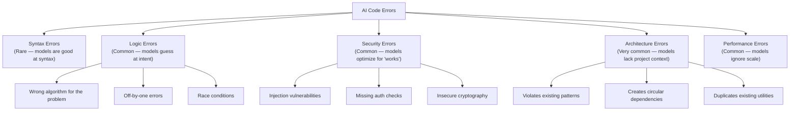

### The Verification Checklist

Before accepting any AI-generated code:

1. **Does it match the specification?** — Read the requirements again, then read the code. Does the code actually implement what was asked?
2. **Does it follow your project's patterns?** — Check against existing code. Does it use the same error handling, logging, naming conventions?
3. **Are edge cases handled?** — null, undefined, empty arrays, zero, negative numbers, very large inputs, concurrent access
4. **Is it secure?** — Input validation, output encoding, authentication checks, authorization checks, no SQL injection, no XSS
5. **Does it have tests?** — And do the tests actually test the important behavior, not just happy paths?
6. **Does it compile and pass all existing tests?** — AI edits can break other parts of the codebase
7. **Is the dependency real?** — If the AI imported a new library, verify it exists, is maintained, and is not compromised

## 10. Code Review of AI Output

Reviewing AI-generated code requires a different mindset than reviewing human code.

### Human Code vs AI Code Review

| Aspect | Reviewing Human Code | Reviewing AI Code |
|--------|---------------------|-------------------|
| **Typos/syntax** | Common | Rare |
| **Logic correctness** | Usually right, check edge cases | Often wrong in subtle ways — verify carefully |
| **Pattern adherence** | Human knows the codebase | AI may invent new patterns — check consistency |
| **Security** | Humans often know to be careful | AI optimizes for functionality, not security |
| **Over-engineering** | Sometimes | Very common — AI loves abstractions |
| **Hallucinated deps** | Never | Common — verify all imports |
| **Completeness** | Usually complete | May leave TODOs or stub implementations |

### AI Code Review Workflow

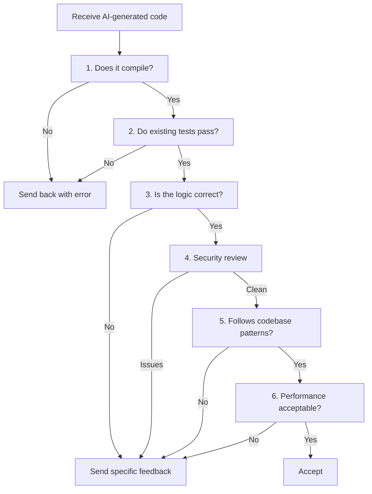

### Automated AI Code Review

Several tools can automate parts of AI code review:

```bash
# Run static analysis on AI-generated code
npx eslint src/new-feature/ --max-warnings 0

# Security scanning
npx njsscan src/new-feature/
snyk test

# Check for dependency issues
npm audit
npx depcheck

# Run type checking strictly
npx tsc --noEmit --strict

# Test coverage on new code
npx vitest --coverage --changed
```

## 11. Security Considerations

### Data Privacy

Every AI coding assistant sends your code to a remote model. Understand what is sent and where:

| Tool | Data Sent | Where Processed | Retention |
|------|-----------|-----------------|-----------|
| **Copilot** | Current file + context | GitHub/Azure servers | Prompts not stored (Business/Enterprise) |
| **Cursor** | Selected code + referenced files | Cursor servers / direct API | Privacy mode available |
| **Claude Code** | Files you reference + command output | Anthropic API | Per API data retention policy |
| **Windsurf** | Active file + workspace context | Codeium servers | Enterprise: no retention |
| **Amazon Q** | Current file + project context | AWS servers | Enterprise: no retention |
| **Tabnine** | Current file context | On-premise option available | Full control with self-hosted |

### What NOT to Send to AI Assistants

::: danger Never include these in AI assistant context
- **API keys, secrets, tokens** — The model will see them. Use environment variables and `.env` files excluded from context.
- **Customer PII** — Names, emails, addresses, payment info in test fixtures or seed data. Use synthetic data.
- **Proprietary algorithms** — Trade-secret code that gives your company a competitive advantage.
- **Security-critical code** — Authentication, encryption, and authorization logic should be written and reviewed by security engineers, not generated by AI.
- **Compliance-sensitive data** — HIPAA, PCI-DSS, SOX-regulated code and data requires human oversight.
:::

### Protecting Your Codebase

```bash
# .cursorignore / .copilotignore / .claudeignore
# Exclude sensitive files from AI context

.env
.env.*
**/secrets/
**/credentials/
**/*.pem
**/*.key
**/config/production.*
**/seed-data/
**/fixtures/real-data/
```

### Code Leakage Risks

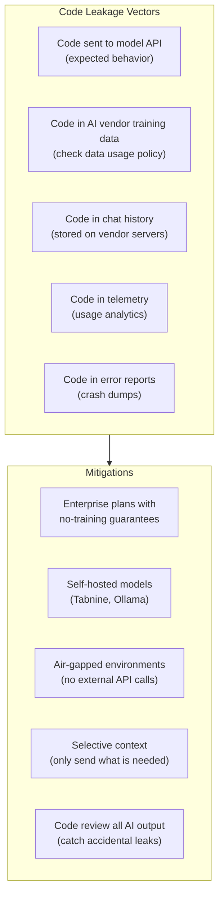

### Enterprise Security Checklist

::: info Enterprise AI Coding Assistant Deployment
1. **Data residency** — Where are the API servers? Do they comply with your data sovereignty requirements?
2. **Training data** — Does the vendor use your code to train models? Get this in writing.
3. **SOC 2 / ISO 27001** — Does the vendor have relevant security certifications?
4. **SSO/SAML** — Can you enforce your identity provider?
5. **Audit logs** — Can you see who used the AI assistant, when, and what code was generated?
6. **IP indemnification** — Does the vendor protect you if AI-generated code infringes on someone's copyright?
7. **Usage policies** — Can you enforce which repositories, branches, or file types the AI can access?
8. **Revocation** — Can you instantly disable access for a terminated employee?
9. **Network controls** — Can you restrict the AI assistant to your VPN or approved networks?
10. **DLP integration** — Does the tool integrate with your data loss prevention systems?
:::

## 12. Productivity Tips and Workflows

### Daily Workflows

**Morning Code Review:**
```bash
# Use Claude Code to review overnight PRs
claude -p "Review PR #142 on this repo. Focus on security,
  performance, and adherence to our patterns in src/." \
  --allowedTools Read,Grep,Glob,Bash
```

**Feature Implementation (Cursor Workflow):**
1. Open Composer, describe the feature with constraints
2. Review the plan before Composer starts editing
3. Accept file-by-file, reviewing each diff
4. Run tests (`Cmd+Shift+P` > "Run Tests")
5. If tests fail, paste the error into Composer: "Fix this test failure"

**Debugging (Any Tool):**
```
Here is the error from production:
[paste full stack trace]

Here is the relevant code:
@src/services/payment.ts
@src/models/transaction.ts

The error happens when processing refunds for orders
with multiple items. It works fine for single-item orders.
Find the bug.
```

### Keyboard Shortcuts Worth Learning

| Action | Copilot | Cursor | Claude Code |
|--------|---------|--------|-------------|
| Accept suggestion | Tab | Tab | Enter |
| Reject suggestion | Esc | Esc | N/A |
| Open chat | Ctrl+I | Ctrl+L | (Always active) |
| Inline edit | N/A | Ctrl+K | N/A |
| Multi-file agent | N/A | Ctrl+I (Composer) | (Always agentic) |
| Next suggestion | Alt+] | Alt+] | N/A |
| Explain code | Select + Chat | Select + Ctrl+L | "Explain this file" |

### Maximizing AI Effectiveness

| Practice | Impact | Why |
|----------|--------|-----|
| **Write good comments before code** | High | AI uses comments as intent signals for better completions |
| **Keep files under 500 lines** | High | Smaller files fit better in context windows |
| **Maintain consistent patterns** | High | AI learns your patterns from existing code and replicates them |
| **Use descriptive variable names** | Medium | AI generates better code when surrounding code is readable |
| **Write interface/type definitions first** | High | Types constrain the AI's output to match your architecture |
| **Commit frequently** | Medium | Clean git history helps AI understand what changed and why |
| **Maintain a CLAUDE.md or .cursorrules** | High | Explicit instructions dramatically improve output quality |
| **Use .gitignore as an AI ignore** | Medium | Keeps generated files, build output, and dependencies out of context |

## 13. Common Misconceptions

::: warning Common Misconceptions

1. **"AI coding assistants will replace developers"** — These tools amplify developer productivity but cannot replace the judgment, architectural thinking, and domain knowledge that humans bring. They are excellent at generating boilerplate and implementing known patterns but poor at novel design, ambiguous requirements, and cross-cutting concerns.

2. **"The best AI assistant is the one with the best model"** — Context management matters more than model quality. A mediocre model with full codebase context produces better results than the best model with a single file. This is why tools with codebase indexing (Cursor, Windsurf) often outperform tools with better models but less context.

3. **"AI-generated code does not need testing"** — It needs more testing, not less. AI code looks correct but often has subtle bugs in edge cases. Treat AI-generated code with more skepticism than human code, not less.

4. **"Using AI assistants is cheating"** — Using a compiler, a linter, an IDE, or Stack Overflow are not cheating. AI assistants are tools in the same category — they help you work faster, but you are still responsible for the output.

5. **"All AI assistants are basically the same"** — The difference between a tab-completion tool and an agentic system like Claude Code is enormous. Choosing the right tool for your workflow matters. Some developers use multiple tools for different tasks.

6. **"AI assistants understand your code"** — They pattern-match against training data and context. They do not "understand" your business logic, performance requirements, or security model. When they produce correct code, it is because the pattern is common, not because they understood your domain.

7. **"Free tiers are sufficient for professional work"** — Free tiers typically have aggressive rate limits and slower models. Professional developers consistently report that paid tiers (with faster models and higher limits) pay for themselves in the first week through productivity gains.
:::

## 14. When NOT to Use AI Coding Assistants

| Scenario | Why AI Assistants Are Wrong | Better Approach |
|----------|----------------------------|-----------------|
| **Security-critical cryptography** | AI suggests insecure defaults, wrong modes, weak parameters | Use vetted libraries, review by security engineer |
| **Regulatory compliance code** | AI does not understand HIPAA, PCI-DSS, SOX requirements | Human expert with compliance training |
| **Learning a new language** | AI writes the code for you — you learn nothing | Write it yourself, use AI only to explain errors |
| **Performance-critical hot paths** | AI generates correct but suboptimal code | Profile, benchmark, optimize manually |
| **Interviewing/assessments** | Using AI defeats the purpose | Write code yourself to demonstrate skill |
| **Highly novel algorithms** | AI has no training data for truly novel approaches | Research papers, whiteboards, manual implementation |
| **Air-gapped environments** | Most tools require internet connectivity | Tabnine self-hosted, local models via Ollama |
| **Classified/secret projects** | Code must not leave your network | Self-hosted solutions only |

## 15. In Production

::: details How Teams Use AI Assistants at Scale

**Shopify** — Engineering teams use Copilot and Claude Code across their Ruby on Rails codebase. They report that AI assistants are most effective for writing tests, implementing CRUD endpoints, and migrating code patterns. They found that developers who write detailed inline comments before using AI assistants get significantly better results.

**Stripe** — Uses a mix of internal tools and commercial assistants. They enforce strict code review policies for AI-generated code, with mandatory security review for any AI-generated code touching payment processing.

**Vercel** — Cursor is used extensively across the team. They credit their `.cursorrules` file with significant improvements in AI output quality — it contains their Next.js conventions, Tailwind patterns, and TypeScript strictness requirements.

**Atlassian** — Rolled out Amazon Q Developer to teams building on AWS infrastructure. The Java transformation feature saved weeks of manual work on their Java 11 to Java 17 migration across dozens of services.

**Individual developers** — Survey data from 2025-2026 shows that developers using AI assistants report 30-55% faster feature delivery, but also report spending more time on code review. Net productivity gain is estimated at 20-40% for experienced developers who learn to use the tools effectively.
:::

## 16. Quiz

::: details Quiz

**Q1: What is the fundamental difference between IDE-based AI assistants (Copilot, Cursor) and CLI-based assistants (Claude Code)?**
IDE-based assistants integrate into the editor UI with inline completions, chat panels, and diff views. They are optimized for visual code editing workflows. CLI-based assistants run in the terminal and operate as full coding agents — they read files, write code, run commands, interpret output, and iterate autonomously. CLI assistants are better for multi-step tasks that involve building, testing, and debugging because they can execute shell commands directly.

**Q2: Why is context management more important than prompt engineering when using AI coding assistants?**
AI models generate code based on the context they receive. A well-structured prompt with the wrong context (wrong files, missing constraints, no examples of existing patterns) will produce code that does not fit the project. Conversely, a simple prompt with the right context (relevant files referenced, architecture constraints stated, existing patterns shown) produces code that matches the codebase. The limiting factor is almost always context quality, not prompt cleverness.

**Q3: Name three categories of errors that are common in AI-generated code but rare in human code.**
(1) Hallucinated APIs — using methods or libraries that do not exist or do not have the signatures the AI assumes. (2) Architecture violations — creating new patterns, utilities, or abstractions that duplicate or contradict existing codebase conventions. (3) Over-engineering — adding unnecessary abstraction layers, design patterns, and interfaces that increase complexity without benefit. Humans who know the codebase avoid these; AI models work from statistical patterns, not project knowledge.

**Q4: What security risks do AI coding assistants introduce, and how should enterprises mitigate them?**
Risks: (1) Code sent to external APIs can be intercepted or retained. (2) Sensitive data (secrets, PII) in code context gets sent to the model. (3) AI-generated code may contain security vulnerabilities (injection, insecure defaults). (4) Code may end up in vendor training data. Mitigations: enterprise plans with no-training guarantees, `.ignore` files to exclude sensitive paths, mandatory security review for AI code, SOC 2-certified vendors, self-hosted models for classified work, DLP integration.

**Q5: When should you NOT use AI coding assistants?**
(1) Security-critical cryptography — AI suggests insecure defaults. (2) Learning new languages or concepts — AI writes the code for you, defeating the learning purpose. (3) Regulatory compliance code — AI does not understand HIPAA/PCI-DSS requirements. (4) Performance-critical hot paths — AI generates correct but suboptimal code. (5) Classified/air-gapped environments — most tools require internet. (6) Coding interviews — using AI defeats the assessment purpose.
:::

## 17. Exercise

::: details Exercise — Evaluate AI Assistants on Your Codebase

**Objective:** Run a structured evaluation of at least two AI coding assistants on a real task in your codebase.

**Setup:**
1. Pick a real feature or bug fix from your backlog
2. Choose two assistants to compare (e.g., Cursor Composer vs Claude Code)
3. Create a scoring rubric

**Evaluation Rubric:**

| Criterion | Score (1-5) | Tool A | Tool B |
|-----------|-------------|--------|--------|
| Correctness — Does the code work? | | | |
| Pattern adherence — Follows codebase conventions? | | | |
| Completeness — All edge cases handled? | | | |
| Security — No vulnerabilities introduced? | | | |
| Speed — Time from prompt to working code? | | | |
| Iteration — How many rounds to get it right? | | | |
| Context usage — Did it use relevant existing code? | | | |

**Steps:**
1. Write the exact same prompt/task description for both tools
2. Give each tool the same context (same files, same constraints)
3. Time how long each takes to produce working code
4. Count how many iterations each needs
5. Review both outputs against your rubric
6. Run existing tests against both outputs
7. Have a teammate review both outputs blind (without knowing which tool generated which)

**Deliverable:** A comparison document with scores, observations, and a recommendation for your team.

**Stretch goals:**
- Test with three or more assistants
- Test across different task types (new feature, bug fix, refactor, tests)
- Test with varying levels of context (minimal prompt vs detailed prompt with files)
- Measure token cost for API-based tools (Claude Code)
:::

## Further Reading

- [AI Agents Architecture](/ai-ml-engineering/ai-agents) — How agent loops work under the hood
- [A2A Protocol](/ai-ml-engineering/a2a-protocol) — Agent-to-agent communication standard
- [Anthropic Claude API](/ai-ml-engineering/anthropic-claude-api) — Claude API and MCP integration
- [Prompt Engineering Advanced](/ai-ml-engineering/prompt-engineering-advanced) — Advanced prompting techniques applicable to coding assistants
- [AI Guardrails](/ai-ml-engineering/ai-guardrails) — Safety and validation for AI-generated outputs
- [AI in Production](/ai-ml-engineering/ai-in-production) — Deploying and monitoring AI systems

## One-Liner Summary

> AI coding assistants have evolved from autocomplete into agentic systems that can plan, implement, and iterate across codebases — but they are amplifiers of developer skill, not replacements for it, and every line they generate needs the same scrutiny as code from a junior developer you do not fully trust yet.
