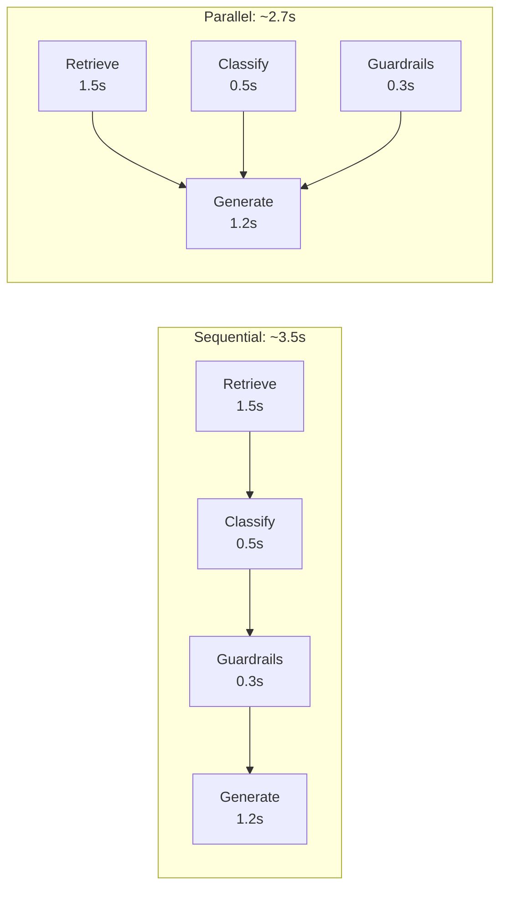
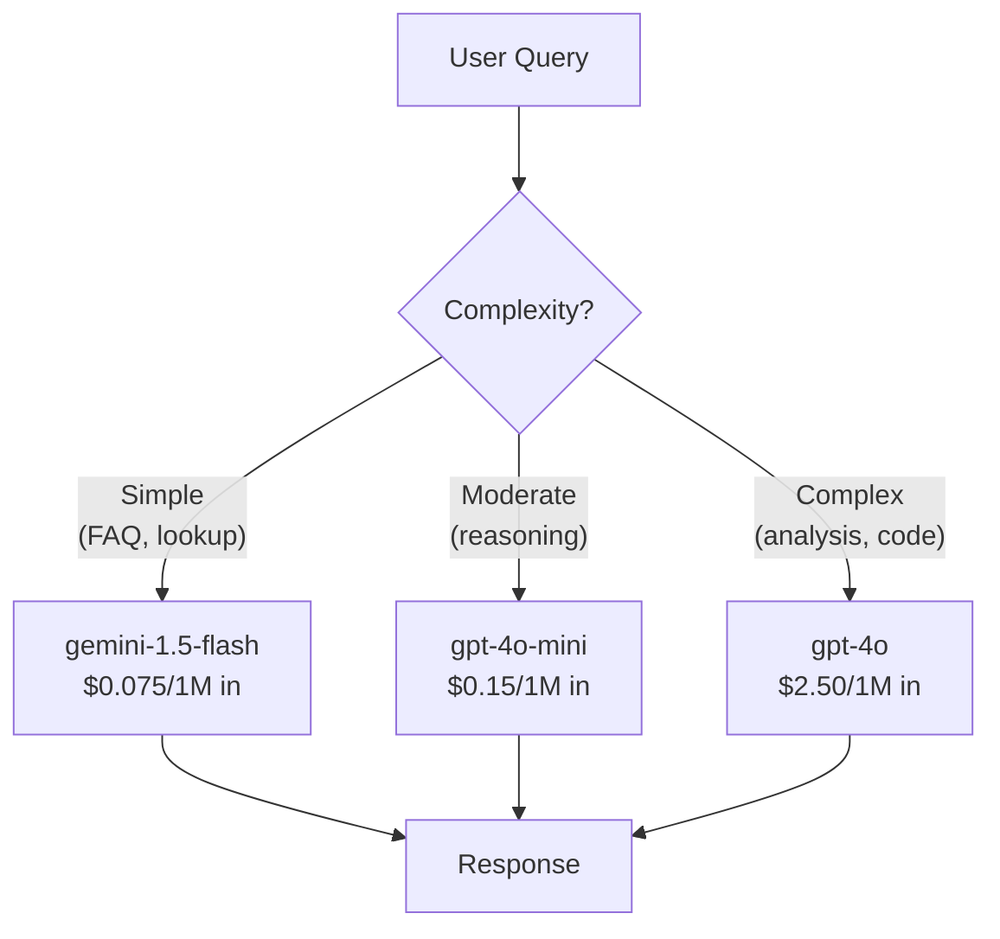
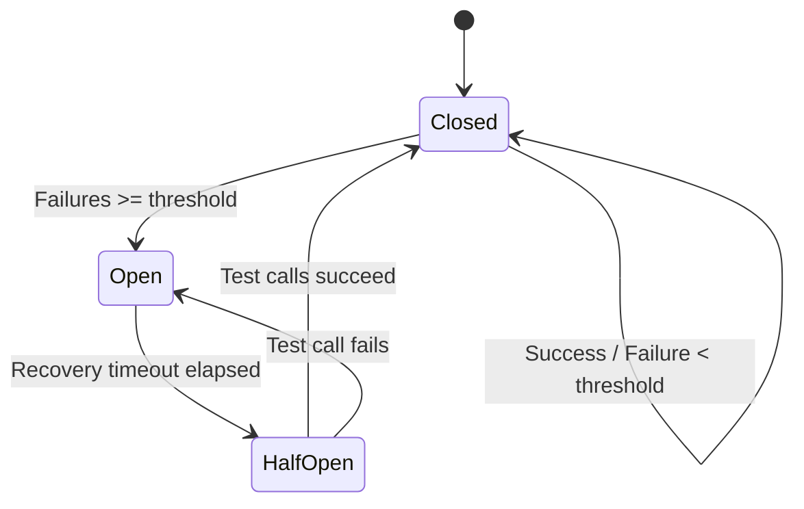
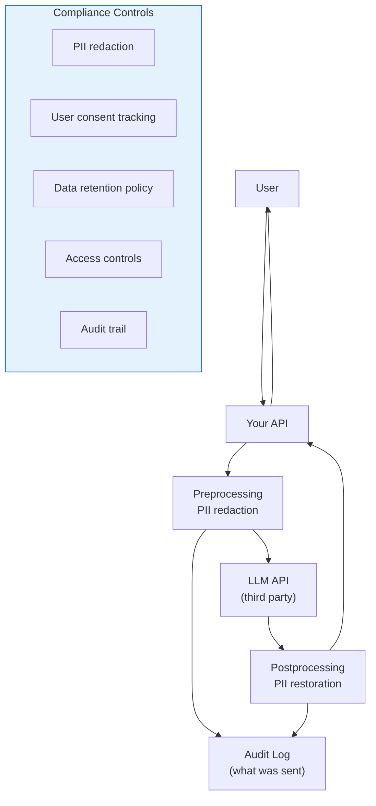

# AI in Production

The gap between an AI demo and a production AI system is the widest in all of software engineering. A demo calls GPT-4o, streams a response, and looks impressive. A production system handles thousands of concurrent users, manages $50,000/month API budgets, survives provider outages, measures quality continuously, complies with data regulations, and does all of this while maintaining sub-second latency.

This page covers the engineering practices that bridge that gap: latency optimization, cost management, reliability patterns, monitoring, and compliance — the unglamorous work that makes AI systems actually work at scale.

## Latency Optimization

Users expect AI responses in under 3 seconds. Without optimization, a single GPT-4o call takes 2-8 seconds. Add retrieval, reranking, and guardrails, and you are looking at 5-15 seconds. That is unacceptable for most applications.

### Streaming

The single most impactful latency optimization. Stream tokens as they are generated instead of waiting for the complete response. Time to first token (TTFT) is typically 200-500ms — the user sees output almost immediately, even if the full response takes seconds.

```python
from openai import OpenAI

client = OpenAI()

def stream_response(messages: list[dict]):
    """Stream LLM response to reduce perceived latency."""
    stream = client.chat.completions.create(
        model="gpt-4o",
        messages=messages,
        stream=True,
    )
    for chunk in stream:
        if chunk.choices[0].delta.content:
            yield chunk.choices[0].delta.content
```

For frontend streaming patterns, see [Vercel AI SDK](/ai-ml-engineering/vercel-ai-sdk).

### Caching

Cache identical or semantically similar requests to avoid redundant LLM calls:

```python
import hashlib
import json
from redis import Redis

redis = Redis()

class LLMCache:
    def __init__(self, ttl: int = 3600):
        self.ttl = ttl

    def get_cache_key(self, model: str, messages: list, params: dict) -> str:
        """Deterministic cache key from request parameters."""
        content = json.dumps({
            "model": model,
            "messages": messages,
            "temperature": params.get("temperature", 1),
            "max_tokens": params.get("max_tokens"),
        }, sort_keys=True)
        return f"llm:{hashlib.sha256(content.encode()).hexdigest()}"

    def get(self, key: str) -> str | None:
        return redis.get(key)

    def set(self, key: str, value: str):
        redis.setex(key, self.ttl, value)

cache = LLMCache(ttl=3600)

def cached_completion(model: str, messages: list, **params) -> str:
    key = cache.get_cache_key(model, messages, params)
    cached = cache.get(key)
    if cached:
        return cached.decode()

    response = client.chat.completions.create(
        model=model, messages=messages, **params
    )
    result = response.choices[0].message.content
    cache.set(key, result)
    return result
```

::: tip Only cache deterministic requests
Set `temperature=0` for requests you want to cache. Caching non-deterministic requests means returning stale random outputs. For semantic caching (similar but not identical queries), see [Prompt Caching & Context Management](/ai-ml-engineering/prompt-caching).
:::

### Model Selection for Latency

| Model | TTFT | Tokens/sec | Best For |
|-------|------|-----------|----------|
| GPT-4o | 300-600ms | 80-100 | Complex reasoning |
| GPT-4o-mini | 150-300ms | 120-150 | Most production tasks |
| Claude 3.5 Haiku | 150-300ms | 100-130 | Fast, high quality |
| Claude Sonnet | 300-500ms | 70-90 | Complex tasks |
| Gemini 1.5 Flash | 100-200ms | 150+ | Fastest option |

### Parallel Processing

Run independent operations concurrently:

```python
import asyncio
from openai import AsyncOpenAI

async_client = AsyncOpenAI()

async def parallel_rag_pipeline(query: str) -> dict:
    """Run retrieval, classification, and guardrails in parallel."""
    retrieval_task = asyncio.create_task(retrieve_documents(query))
    classification_task = asyncio.create_task(classify_intent(query))
    guardrails_task = asyncio.create_task(check_input_safety(query))

    # All three run concurrently
    context, intent, safety = await asyncio.gather(
        retrieval_task,
        classification_task,
        guardrails_task,
    )

    if not safety["is_safe"]:
        return {"error": "Input flagged by guardrails"}

    # Now generate with retrieved context
    response = await generate_response(query, context, intent)
    return response
```



## Cost Management

LLM API costs are the #1 surprise for teams moving to production. A system that costs $5/day in development can cost $5,000/day in production.

### Token Budget Architecture

```python
from dataclasses import dataclass
from enum import Enum

class ModelTier(Enum):
    PREMIUM = "gpt-4o"
    STANDARD = "gpt-4o-mini"
    ECONOMY = "gemini-1.5-flash"

@dataclass
class TokenBudget:
    max_input_tokens: int
    max_output_tokens: int
    model_tier: ModelTier
    monthly_budget_usd: float

# Per-feature budgets
BUDGETS = {
    "chat": TokenBudget(
        max_input_tokens=4000,
        max_output_tokens=1000,
        model_tier=ModelTier.STANDARD,
        monthly_budget_usd=5000,
    ),
    "code_review": TokenBudget(
        max_input_tokens=8000,
        max_output_tokens=2000,
        model_tier=ModelTier.PREMIUM,
        monthly_budget_usd=10000,
    ),
    "summarization": TokenBudget(
        max_input_tokens=16000,
        max_output_tokens=500,
        model_tier=ModelTier.ECONOMY,
        monthly_budget_usd=2000,
    ),
}

class CostTracker:
    def __init__(self):
        self.daily_cost = 0.0
        self.monthly_cost = 0.0

    def track(self, feature: str, input_tokens: int, output_tokens: int):
        budget = BUDGETS[feature]
        cost = self.calculate_cost(
            budget.model_tier.value, input_tokens, output_tokens
        )
        self.daily_cost += cost
        self.monthly_cost += cost

        # Alert if approaching budget
        if self.monthly_cost > budget.monthly_budget_usd * 0.8:
            alert(f"Feature '{feature}' at 80% of monthly budget")

    def calculate_cost(self, model: str, input_tokens: int, output_tokens: int) -> float:
        rates = {
            "gpt-4o": {"input": 2.50, "output": 10.00},      # per 1M tokens
            "gpt-4o-mini": {"input": 0.15, "output": 0.60},
            "gemini-1.5-flash": {"input": 0.075, "output": 0.30},
        }
        r = rates.get(model, rates["gpt-4o-mini"])
        return (input_tokens * r["input"] + output_tokens * r["output"]) / 1_000_000
```

### Model Routing

Route requests to the cheapest model that can handle the task:

```python
async def smart_route(query: str, context: str) -> str:
    """Route to the right model based on task complexity."""
    # Estimate complexity
    complexity = await estimate_complexity(query)

    if complexity == "simple":
        # FAQ-like questions -> cheapest model
        model = "gemini-1.5-flash"
    elif complexity == "moderate":
        # Standard queries -> balanced model
        model = "gpt-4o-mini"
    else:
        # Complex reasoning -> best model
        model = "gpt-4o"

    return await generate(model=model, query=query, context=context)
```



### Cost Reduction Strategies

| Strategy | Savings | Implementation Effort | Quality Impact |
|----------|---------|---------------------|----------------|
| **Exact caching** | 30-60% | Low | None |
| **Semantic caching** | 20-40% | Medium | Minimal |
| **Model routing** | 40-70% | Medium | Minimal if done well |
| **Prompt compression** | 10-30% | Low | Minimal |
| **Token limit enforcement** | 20-40% | Low | May truncate |
| **Batch processing** | 20-50% (via batch API) | Low | Increased latency |
| **[Prompt caching](/ai-ml-engineering/prompt-caching)** | 50-90% on cached prefixes | Low | None |

## Reliability Patterns

LLM APIs are external dependencies. They go down, they rate limit you, they change behavior. Build for failure.

### Retries with Exponential Backoff

```python
import time
import random
from openai import (
    OpenAI,
    APITimeoutError,
    RateLimitError,
    APIConnectionError,
    InternalServerError,
)

RETRYABLE_ERRORS = (
    APITimeoutError,
    RateLimitError,
    APIConnectionError,
    InternalServerError,
)

def completion_with_retry(
    client: OpenAI,
    max_retries: int = 3,
    base_delay: float = 1.0,
    **kwargs,
) -> str:
    """LLM call with retry and exponential backoff."""
    for attempt in range(max_retries + 1):
        try:
            response = client.chat.completions.create(**kwargs)
            return response.choices[0].message.content
        except RETRYABLE_ERRORS as e:
            if attempt == max_retries:
                raise
            delay = base_delay * (2 ** attempt) + random.uniform(0, 1)
            logger.warning(
                f"Attempt {attempt + 1} failed: {e}. Retrying in {delay:.1f}s"
            )
            time.sleep(delay)
```

### Provider Fallback

```python
from openai import OpenAI
from anthropic import Anthropic

class LLMGateway:
    """Multi-provider gateway with automatic fallback."""

    def __init__(self):
        self.providers = [
            ("openai", OpenAI(), "gpt-4o-mini"),
            ("anthropic", Anthropic(), "claude-3-5-haiku-20241022"),
        ]

    async def generate(self, messages: list[dict], **kwargs) -> str:
        errors = []
        for provider_name, client, model in self.providers:
            try:
                if provider_name == "openai":
                    response = client.chat.completions.create(
                        model=model, messages=messages, **kwargs
                    )
                    return response.choices[0].message.content
                elif provider_name == "anthropic":
                    response = client.messages.create(
                        model=model,
                        messages=[m for m in messages if m["role"] != "system"],
                        system=next(
                            (m["content"] for m in messages if m["role"] == "system"),
                            "",
                        ),
                        max_tokens=kwargs.get("max_tokens", 1024),
                    )
                    return response.content[0].text
            except Exception as e:
                errors.append(f"{provider_name}: {e}")
                logger.error(f"Provider {provider_name} failed: {e}")
                continue

        raise Exception(f"All providers failed: {'; '.join(errors)}")
```

### Circuit Breaker

```python
import time
from enum import Enum

class CircuitState(Enum):
    CLOSED = "closed"       # normal operation
    OPEN = "open"           # failing, reject requests
    HALF_OPEN = "half_open" # testing recovery

class CircuitBreaker:
    def __init__(
        self,
        failure_threshold: int = 5,
        recovery_timeout: int = 60,
        half_open_max: int = 3,
    ):
        self.failure_threshold = failure_threshold
        self.recovery_timeout = recovery_timeout
        self.half_open_max = half_open_max
        self.state = CircuitState.CLOSED
        self.failure_count = 0
        self.last_failure_time = 0
        self.half_open_calls = 0

    def call(self, func, *args, **kwargs):
        if self.state == CircuitState.OPEN:
            if time.time() - self.last_failure_time > self.recovery_timeout:
                self.state = CircuitState.HALF_OPEN
                self.half_open_calls = 0
            else:
                raise Exception("Circuit breaker is open")

        try:
            result = func(*args, **kwargs)
            if self.state == CircuitState.HALF_OPEN:
                self.half_open_calls += 1
                if self.half_open_calls >= self.half_open_max:
                    self.state = CircuitState.CLOSED
                    self.failure_count = 0
            return result
        except Exception as e:
            self.failure_count += 1
            self.last_failure_time = time.time()
            if self.failure_count >= self.failure_threshold:
                self.state = CircuitState.OPEN
                logger.critical(f"Circuit breaker opened: {e}")
            raise

# Usage
openai_breaker = CircuitBreaker(failure_threshold=5, recovery_timeout=60)

try:
    result = openai_breaker.call(
        client.chat.completions.create,
        model="gpt-4o",
        messages=messages,
    )
except Exception:
    # Fallback to another provider
    result = anthropic_client.messages.create(...)
```



## A/B Testing AI Features

A/B testing LLM features is harder than testing traditional features because output quality is subjective.

### Framework

```python
import hashlib
import random

class AIExperiment:
    """A/B testing framework for AI features."""

    def __init__(self, name: str, variants: dict[str, dict]):
        self.name = name
        self.variants = variants  # {"control": {...}, "treatment": {...}}

    def get_variant(self, user_id: str) -> tuple[str, dict]:
        """Deterministic variant assignment based on user ID."""
        hash_val = hashlib.md5(
            f"{self.name}:{user_id}".encode()
        ).hexdigest()
        bucket = int(hash_val[:8], 16) % 100

        if bucket < 50:
            return "control", self.variants["control"]
        else:
            return "treatment", self.variants["treatment"]

# Example: Testing a new prompt
experiment = AIExperiment(
    name="support-prompt-v2",
    variants={
        "control": {
            "model": "gpt-4o-mini",
            "system_prompt": "You are a helpful support agent.",
        },
        "treatment": {
            "model": "gpt-4o-mini",
            "system_prompt": "You are an expert support engineer. "
                           "Always cite the relevant documentation section.",
        },
    },
)

# Track metrics per variant
variant_name, config = experiment.get_variant(user_id)
response = generate(config["model"], config["system_prompt"], user_message)
track_metric("response_quality", variant_name, user_rating)
track_metric("resolution_rate", variant_name, was_resolved)
track_metric("cost_per_query", variant_name, token_cost)
```

### Metrics to A/B Test

| Metric | How to Measure | Good Signal? |
|--------|---------------|-------------|
| **User satisfaction** | Thumbs up/down, CSAT | Strong |
| **Task completion** | Did the user achieve their goal? | Strong |
| **Follow-up rate** | How many follow-ups needed? | Medium |
| **Escalation rate** | Did the user need human help? | Strong |
| **Response latency** | Time to complete response | Medium |
| **Cost per query** | Token usage * pricing | Operational |

## Monitoring and Alerting

### Key Metrics Dashboard

```python
from dataclasses import dataclass, field
from datetime import datetime

@dataclass
class AIMetrics:
    """Metrics to track for every AI feature in production."""
    # Latency
    ttft_p50_ms: float = 0        # Time to first token
    ttft_p99_ms: float = 0
    total_latency_p50_ms: float = 0
    total_latency_p99_ms: float = 0

    # Cost
    daily_cost_usd: float = 0
    cost_per_request_usd: float = 0
    avg_input_tokens: int = 0
    avg_output_tokens: int = 0

    # Quality
    user_satisfaction_rate: float = 0  # % positive feedback
    hallucination_rate: float = 0     # % flagged by eval
    format_error_rate: float = 0      # % invalid structured output

    # Reliability
    error_rate: float = 0             # % failed requests
    timeout_rate: float = 0           # % requests that timed out
    cache_hit_rate: float = 0         # % served from cache
    fallback_rate: float = 0          # % handled by fallback provider

    # Volume
    requests_per_minute: float = 0
    unique_users_daily: int = 0
```

### Alert Rules

| Alert | Condition | Severity | Action |
|-------|-----------|----------|--------|
| **High error rate** | > 5% errors in 5 min | Critical | Page on-call, check provider status |
| **Latency spike** | P95 > 10s for 5 min | Warning | Check model, check network |
| **Cost anomaly** | Daily cost > 2x rolling average | Warning | Investigate traffic, check for loops |
| **Quality drop** | Satisfaction < 70% for 1 day | Warning | Review recent changes, check prompts |
| **Cache miss spike** | Cache hit rate < 10% for 30 min | Info | Check cache health, new query patterns |
| **Rate limiting** | > 100 429s in 5 min | Critical | Scale up, implement queuing |
| **Provider down** | Circuit breaker opens | Critical | Verify fallback is working |

::: warning Alert on trends, not just thresholds
A single slow request is not a problem. A P95 that has been climbing 10% per day for a week is. Set up trend-based alerts alongside threshold alerts to catch gradual degradation before it becomes critical.
:::

## Compliance and Data Privacy

### Data Flow Architecture



### GDPR/CCPA Compliance Checklist

1. **Data minimization.** Send only the minimum necessary data to the LLM API. Strip PII, metadata, and irrelevant context.
2. **Consent.** Users must consent to their data being processed by an AI. Be explicit about which third-party APIs receive their data.
3. **Right to deletion.** Implement a system to delete user data from all caches, logs, and vector stores on request.
4. **Data Processing Agreements.** Sign DPAs with your LLM providers (OpenAI, Anthropic, Google all offer them).
5. **Audit trail.** Log what data was sent to which provider, when, and why. Include the ability to replay and audit any interaction.
6. **Opt-out.** Provide a non-AI fallback for users who refuse AI processing.
7. **Data residency.** Ensure data stays in the required geographic region. Use providers with regional endpoints.

```python
class ComplianceMiddleware:
    """Ensure LLM requests comply with data privacy requirements."""

    def __init__(self, pii_detector, audit_logger):
        self.pii_detector = pii_detector
        self.audit_logger = audit_logger

    def process_request(self, user_id: str, messages: list[dict]) -> list[dict]:
        # Check consent
        if not self.has_ai_consent(user_id):
            raise PermissionError("User has not consented to AI processing")

        # Redact PII
        redacted_messages, pii_map = self.pii_detector.redact(messages)

        # Log for audit
        self.audit_logger.log({
            "user_id": user_id,
            "timestamp": datetime.utcnow().isoformat(),
            "pii_detected": len(pii_map) > 0,
            "pii_types": list(pii_map.keys()),
            "model": "gpt-4o",
            "action": "llm_request",
        })

        return redacted_messages, pii_map

    def process_response(
        self, response: str, pii_map: dict
    ) -> str:
        """Restore PII in the response if needed."""
        for placeholder, original in pii_map.items():
            response = response.replace(placeholder, original)
        return response
```

### Provider Data Policies

| Provider | Data used for training? | Enterprise DPA? | SOC 2? | Data residency? |
|----------|----------------------|-----------------|--------|-----------------|
| **OpenAI API** | No (API data not used) | Yes | Type 2 | US, EU endpoints |
| **Anthropic API** | No | Yes | Type 2 | US |
| **Google Vertex AI** | No (Vertex) | Yes | Type 2 | Multi-region |
| **Azure OpenAI** | No | Yes | Type 2 | 30+ regions |
| **AWS Bedrock** | No | Yes | Type 2 | Multi-region |

::: tip Use Azure OpenAI or AWS Bedrock for regulated industries
If you are in healthcare, finance, or government, use Azure OpenAI or AWS Bedrock instead of direct OpenAI/Anthropic APIs. They provide better compliance controls, data residency, and audit capabilities under your existing cloud agreements.
:::

## Further Reading

- [AI Safety & Guardrails](/ai-ml-engineering/ai-guardrails) — Input/output guardrails for safe AI
- [LangSmith & LLM Observability](/ai-ml-engineering/langsmith) — Tracing and evaluation platforms
- [Prompt Caching & Context Management](/ai-ml-engineering/prompt-caching) — Caching strategies in depth
- [RAG Architecture Deep Dive](/ai-ml-engineering/rag-architecture) — Production RAG patterns
- [LangGraph](/ai-ml-engineering/langgraph) — Production agent orchestration
- [Fine-Tuning](/ai-ml-engineering/fine-tuning) — Cost reduction via specialized models
- [Multimodal AI](/ai-ml-engineering/multimodal-ai) — Production considerations for vision/audio
