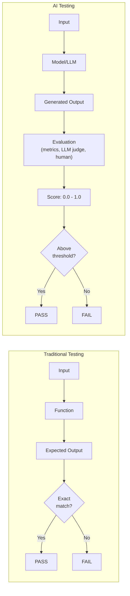
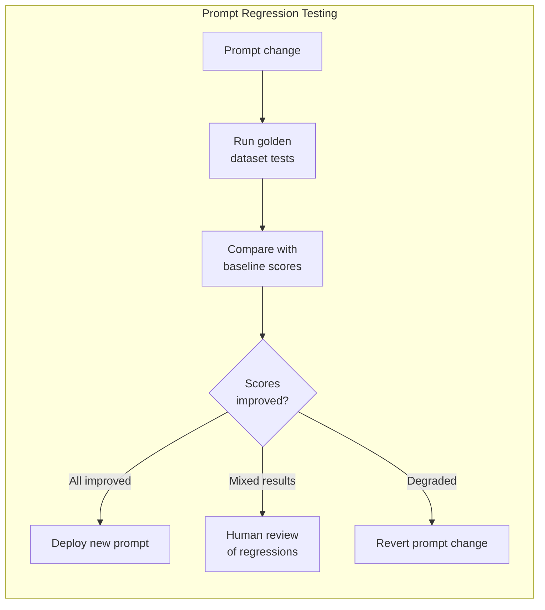
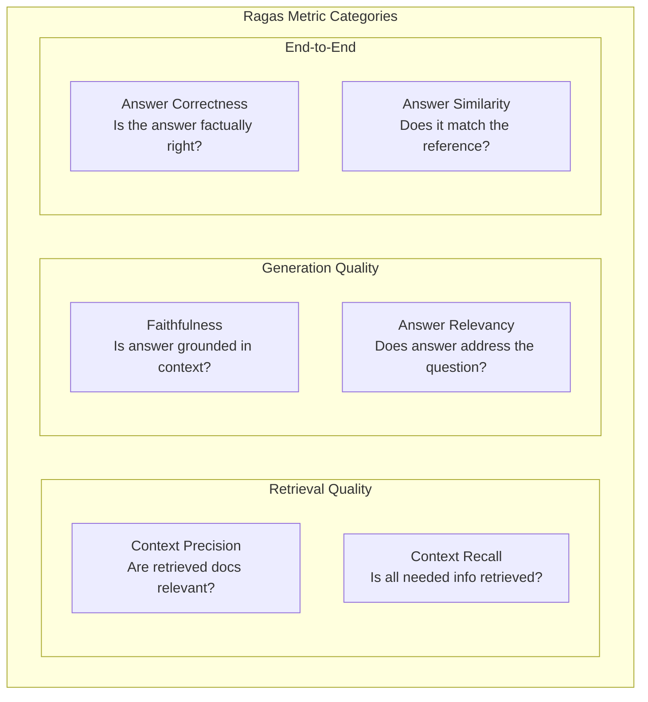
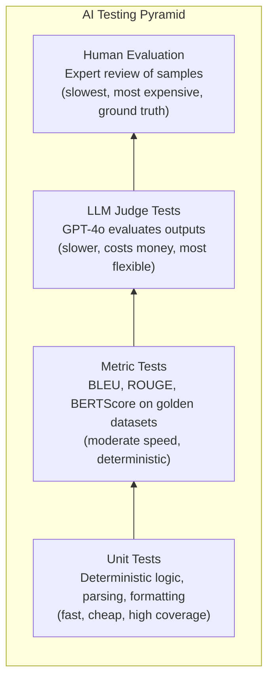

# Testing AI Applications

Testing AI applications is fundamentally different from testing traditional software. A function that adds two numbers either returns the correct result or does not. An LLM that summarizes an article can produce dozens of valid summaries — the output is non-deterministic, subjective, and context-dependent. This does not mean you skip testing. It means you need different tools, different metrics, and a different mindset. This page covers evaluation metrics, golden dataset testing, regression testing for prompts, and production frameworks like DeepEval and Ragas.

## Why AI Testing Is Different

Traditional software testing relies on three assumptions that break with AI:

| Assumption | Traditional Software | AI/LLM Applications |
|-----------|---------------------|---------------------|
| **Determinism** | Same input always produces same output | Same input may produce different outputs |
| **Binary correctness** | Output is right or wrong | Output exists on a quality spectrum |
| **Stable behavior** | Code changes are explicit | Model updates, prompt tweaks, and context changes all affect output |
| **Unit isolation** | Functions have clear boundaries | LLM behavior depends on full prompt context |
| **Test coverage** | Measurable via code paths | Infinite input space, coverage is approximated |



::: tip The Evaluation Mindset
Stop thinking "does it match the expected output?" Start thinking "does it meet the quality criteria?" Your test assertions become threshold checks on quality metrics, not equality checks on strings.
:::

## Evaluation Metrics

### Text Overlap Metrics

These metrics compare generated text against reference text using word or n-gram overlap. They are fast, deterministic, and interpretable — but they miss semantic equivalence.

#### BLEU (Bilingual Evaluation Understudy)

Originally designed for machine translation. Measures n-gram precision between generated and reference text.

```python
from nltk.translate.bleu_score import sentence_bleu, SmoothingFunction

reference = "The cat sat on the mat".split()
candidate = "The cat is sitting on the mat".split()

# BLEU with smoothing (handles zero n-gram matches gracefully)
smoother = SmoothingFunction().method1
score = sentence_bleu([reference], candidate, smoothing_function=smoother)
print(f"BLEU score: {score:.4f}")  # 0.0 to 1.0

# Corpus-level BLEU
from nltk.translate.bleu_score import corpus_bleu
references = [[ref.split()] for ref in reference_texts]
candidates = [cand.split() for cand in generated_texts]
corpus_score = corpus_bleu(references, candidates)
```

| BLEU Range | Interpretation |
|------------|---------------|
| 0.6 - 1.0 | Very high overlap (near-identical) |
| 0.4 - 0.6 | Good quality |
| 0.2 - 0.4 | Understandable, some issues |
| 0.0 - 0.2 | Low quality or very different phrasing |

::: warning BLEU Limitations
BLEU measures word overlap, not meaning. "The dog is happy" and "The canine is joyful" score poorly despite being semantically identical. Use BLEU for translation tasks where phrasing similarity matters, not for open-ended generation.
:::

#### ROUGE (Recall-Oriented Understudy for Gisting Evaluation)

Designed for summarization evaluation. Focuses on recall — how much of the reference appears in the generated text.

```python
from rouge_score import rouge_scorer

scorer = rouge_scorer.RougeScorer(['rouge1', 'rouge2', 'rougeL'], use_stemmer=True)

reference = "The quick brown fox jumps over the lazy dog near the river."
generated = "A fast brown fox leaps over a sleepy dog by the river."

scores = scorer.score(reference, generated)
for metric, score in scores.items():
    print(f"{metric}: Precision={score.precision:.3f}, Recall={score.recall:.3f}, F1={score.fmeasure:.3f}")

# rouge1:  Unigram overlap
# rouge2:  Bigram overlap
# rougeL:  Longest common subsequence
```

| Variant | What It Measures | Best For |
|---------|-----------------|----------|
| **ROUGE-1** | Unigram (single word) overlap | General content coverage |
| **ROUGE-2** | Bigram overlap | Phrase-level similarity |
| **ROUGE-L** | Longest common subsequence | Structural similarity |
| **ROUGE-Lsum** | ROUGE-L applied to each sentence, then averaged | Multi-sentence summaries |

#### BERTScore

Uses BERT embeddings to compute semantic similarity, not just word overlap. Captures paraphrases and synonyms.

```python
from bert_score import score as bert_score

references = ["The cat sat on the mat"]
candidates = ["A feline was resting on the rug"]

P, R, F1 = bert_score(candidates, references, lang="en", verbose=True)
print(f"BERTScore F1: {F1.mean():.4f}")
# BERTScore F1: 0.8923 — captures semantic similarity despite different words
```

### Semantic Metrics

| Metric | How It Works | Strengths | Weaknesses |
|--------|-------------|-----------|------------|
| **Cosine Similarity** | Embed both texts, compute cosine distance | Fast, captures semantics | Misses fine-grained differences |
| **BERTScore** | Token-level BERT embedding matching | Best semantic overlap metric | Slower, requires GPU for large batches |
| **METEOR** | Alignment-based with synonyms and stemming | Better than BLEU for single sentences | Complex, slower than ROUGE |
| **Semantic Similarity** | Sentence embeddings + cosine | Good for meaning equivalence | Does not capture structural quality |

```python
# Cosine similarity with sentence embeddings
from sentence_transformers import SentenceTransformer
from sklearn.metrics.pairwise import cosine_similarity

model = SentenceTransformer("all-MiniLM-L6-v2")

reference = "Kubernetes orchestrates containerized applications across clusters."
generated = "K8s manages containers distributed across multiple nodes."

embeddings = model.encode([reference, generated])
similarity = cosine_similarity([embeddings[0]], [embeddings[1]])[0][0]
print(f"Semantic similarity: {similarity:.4f}")  # ~0.85
```

### LLM-as-Judge

Use a powerful LLM to evaluate the output of another LLM. This is the most flexible approach and correlates best with human judgment.

```python
from openai import OpenAI

client = OpenAI()

def llm_judge(question: str, generated_answer: str, reference_answer: str) -> dict:
    """Use GPT-4o as a judge to evaluate answer quality."""
    response = client.chat.completions.create(
        model="gpt-4o",
        messages=[{
            "role": "system",
            "content": """You are an expert evaluator. Score the generated answer
            on a scale of 1-5 for each criterion. Return JSON only."""
        }, {
            "role": "user",
            "content": f"""
            Question: {question}

            Reference Answer: {reference_answer}

            Generated Answer: {generated_answer}

            Score each criterion (1-5):
            - correctness: Is the information accurate?
            - completeness: Does it cover all key points?
            - relevance: Is it focused on the question?
            - clarity: Is it well-written and clear?

            Return: {{"correctness": N, "completeness": N, "relevance": N, "clarity": N, "reasoning": "..."}}
            """
        }],
        response_format={"type": "json_object"},
        temperature=0,
    )
    return json.loads(response.choices[0].message.content)
```

::: tip LLM Judge Best Practices
1. **Use a stronger model** as the judge — if you are evaluating GPT-4o mini outputs, use GPT-4o or Claude as the judge.
2. **Be specific** in evaluation criteria — "good" is subjective; "contains all three requested data points" is testable.
3. **Use structured output** — get scores and reasoning in JSON for automated processing.
4. **Calibrate with human scores** — verify your LLM judge agrees with human evaluators on a sample set.
5. **Watch for bias** — models tend to prefer their own style. Cross-provider judging reduces this.
:::

## Golden Dataset Testing

A golden dataset is a curated set of input-output pairs that represent the expected behavior of your system. It is the foundation of AI testing.

### Building a Golden Dataset

```python
# Golden dataset structure
golden_dataset = [
    {
        "id": "summary-001",
        "input": "The Federal Reserve raised interest rates by 25 basis points...",
        "expected_output": "The Fed increased rates by 0.25%, signaling continued...",
        "metadata": {
            "category": "summarization",
            "difficulty": "easy",
            "source": "financial_news",
        },
        "evaluation_criteria": {
            "must_contain": ["interest rates", "25 basis points", "Federal Reserve"],
            "must_not_contain": ["I think", "in my opinion"],
            "max_length": 100,
            "min_rouge_l": 0.4,
            "min_bertscore": 0.8,
        }
    },
    {
        "id": "extraction-001",
        "input": "John Smith, CEO of Acme Corp, announced revenue of $5.2B...",
        "expected_output": {
            "person": "John Smith",
            "title": "CEO",
            "company": "Acme Corp",
            "revenue": "$5.2B"
        },
        "metadata": {"category": "extraction", "difficulty": "medium"},
        "evaluation_criteria": {
            "exact_match_fields": ["person", "company", "revenue"],
        }
    },
]
```

### Running Golden Dataset Tests

```python
import json
from dataclasses import dataclass
from typing import Any

@dataclass
class TestResult:
    test_id: str
    passed: bool
    scores: dict[str, float]
    generated_output: str
    expected_output: Any
    errors: list[str]

def run_golden_tests(golden_dataset: list, generate_fn, evaluate_fn) -> list[TestResult]:
    """Run all golden dataset tests and collect results."""
    results = []

    for test_case in golden_dataset:
        # Generate output
        generated = generate_fn(test_case["input"])

        # Evaluate against criteria
        scores, errors = evaluate_fn(
            generated=generated,
            expected=test_case["expected_output"],
            criteria=test_case["evaluation_criteria"],
        )

        # Determine pass/fail
        passed = len(errors) == 0 and all(
            score >= threshold
            for score, threshold in zip(scores.values(), get_thresholds(test_case))
        )

        results.append(TestResult(
            test_id=test_case["id"],
            passed=passed,
            scores=scores,
            generated_output=generated,
            expected_output=test_case["expected_output"],
            errors=errors,
        ))

    return results

# Summarize results
results = run_golden_tests(golden_dataset, my_llm_function, my_evaluator)
passed = sum(1 for r in results if r.passed)
print(f"Passed: {passed}/{len(results)} ({passed/len(results)*100:.1f}%)")

for r in results:
    if not r.passed:
        print(f"  FAILED: {r.test_id} — {r.errors}")
```

### Golden Dataset Guidelines

| Guideline | Description |
|-----------|-------------|
| **Size** | 50-200 examples per task type is a solid starting point |
| **Diversity** | Cover edge cases, different input lengths, different domains |
| **Version control** | Store golden datasets in git alongside your code |
| **Regular updates** | Add new examples when you find bugs or edge cases |
| **Difficulty distribution** | Include easy, medium, and hard examples |
| **Negative examples** | Include inputs the system should refuse or handle gracefully |

## Regression Testing for Prompts

Prompt changes can have unexpected downstream effects. Regression testing ensures that prompt modifications improve target metrics without degrading others.



```python
import json
from datetime import datetime

class PromptRegressionTester:
    """Track prompt performance over time and detect regressions."""

    def __init__(self, baseline_path: str = "baselines.json"):
        self.baseline_path = baseline_path
        self.baselines = self._load_baselines()

    def _load_baselines(self) -> dict:
        try:
            with open(self.baseline_path) as f:
                return json.load(f)
        except FileNotFoundError:
            return {}

    def run_and_compare(
        self,
        prompt_version: str,
        golden_dataset: list,
        generate_fn,
        evaluate_fn,
        regression_threshold: float = 0.05,
    ) -> dict:
        """Run tests and compare against baseline."""
        # Run current tests
        current_results = run_golden_tests(golden_dataset, generate_fn, evaluate_fn)
        current_scores = self._aggregate_scores(current_results)

        # Compare against baseline
        baseline = self.baselines.get("latest", {})
        regressions = []
        improvements = []

        for metric, current_value in current_scores.items():
            baseline_value = baseline.get(metric, 0)
            delta = current_value - baseline_value

            if delta < -regression_threshold:
                regressions.append({
                    "metric": metric,
                    "baseline": baseline_value,
                    "current": current_value,
                    "delta": delta,
                })
            elif delta > regression_threshold:
                improvements.append({
                    "metric": metric,
                    "baseline": baseline_value,
                    "current": current_value,
                    "delta": delta,
                })

        return {
            "prompt_version": prompt_version,
            "timestamp": datetime.now().isoformat(),
            "scores": current_scores,
            "regressions": regressions,
            "improvements": improvements,
            "pass_rate": sum(1 for r in current_results if r.passed) / len(current_results),
            "verdict": "PASS" if not regressions else "REGRESSION_DETECTED",
        }

    def _aggregate_scores(self, results: list[TestResult]) -> dict:
        """Average scores across all test cases."""
        all_metrics = {}
        for result in results:
            for metric, value in result.scores.items():
                all_metrics.setdefault(metric, []).append(value)
        return {k: sum(v) / len(v) for k, v in all_metrics.items()}
```

### CI/CD Integration

```yaml
# .github/workflows/prompt-regression.yml
name: Prompt Regression Tests
on:
  pull_request:
    paths:
      - 'prompts/**'
      - 'src/llm/**'

jobs:
  test:
    runs-on: ubuntu-latest
    steps:
      - uses: actions/checkout@v4
      - uses: actions/setup-python@v5
        with:
          python-version: '3.12'
      - run: pip install -r requirements-test.txt
      - run: python -m pytest tests/ai/ -v --tb=short
        env:
          OPENAI_API_KEY: ${{ secrets.OPENAI_API_KEY }}
      - name: Upload evaluation report
        uses: actions/upload-artifact@v4
        with:
          name: eval-report
          path: reports/evaluation-*.json
```

## DeepEval Framework

DeepEval is a pytest-native framework for evaluating LLM outputs. It provides built-in metrics and integrates with your existing test infrastructure.

```python
# pip install deepeval
from deepeval import assert_test
from deepeval.test_case import LLMTestCase
from deepeval.metrics import (
    AnswerRelevancyMetric,
    FaithfulnessMetric,
    ContextualRelevancyMetric,
    HallucinationMetric,
    GEval,
)

# Basic relevancy test
def test_answer_relevancy():
    test_case = LLMTestCase(
        input="What are the SOLID principles?",
        actual_output=generate_answer("What are the SOLID principles?"),
        expected_output="SOLID stands for Single Responsibility, Open-Closed, Liskov Substitution, Interface Segregation, and Dependency Inversion.",
    )

    metric = AnswerRelevancyMetric(
        threshold=0.7,
        model="gpt-4o",  # Model used for evaluation
    )

    assert_test(test_case, [metric])

# RAG evaluation — test retrieval + generation quality
def test_rag_pipeline():
    question = "How does Kubernetes handle pod scheduling?"
    context = retrieve_context(question)     # Your retrieval step
    answer = generate_with_context(question, context)  # Your generation step

    test_case = LLMTestCase(
        input=question,
        actual_output=answer,
        retrieval_context=[doc.page_content for doc in context],
    )

    # Evaluate multiple dimensions
    metrics = [
        FaithfulnessMetric(threshold=0.8),        # Is the answer grounded in context?
        ContextualRelevancyMetric(threshold=0.7),  # Is the retrieved context relevant?
        HallucinationMetric(threshold=0.5),        # Does it hallucinate beyond context?
    ]

    assert_test(test_case, metrics)

# Custom evaluation criteria with G-Eval
def test_code_review_quality():
    test_case = LLMTestCase(
        input="Review this Python function for issues",
        actual_output=generate_code_review(code_snippet),
    )

    custom_metric = GEval(
        name="Code Review Quality",
        criteria="""Score the code review on:
        1. Does it identify real issues (not false positives)?
        2. Does it explain WHY each issue matters?
        3. Does it suggest specific fixes?
        4. Is the tone constructive and professional?""",
        evaluation_params=[
            "input",
            "actual_output",
        ],
        threshold=0.7,
    )

    assert_test(test_case, [custom_metric])
```

### Running DeepEval Tests

```bash
# Run with pytest
deepeval test run tests/test_llm.py

# Run with verbose output and metric breakdown
deepeval test run tests/test_llm.py -v

# Generate evaluation report
deepeval test run tests/test_llm.py --report
```

## Ragas Framework

Ragas specializes in evaluating RAG (Retrieval-Augmented Generation) pipelines. It provides metrics specifically designed for retrieval quality and grounded generation.

```python
from ragas import evaluate
from ragas.metrics import (
    faithfulness,
    answer_relevancy,
    context_precision,
    context_recall,
    answer_correctness,
)
from datasets import Dataset

# Prepare evaluation dataset
eval_data = {
    "question": [
        "What is the CAP theorem?",
        "How does consistent hashing work?",
    ],
    "answer": [
        generated_answers[0],  # Your RAG pipeline output
        generated_answers[1],
    ],
    "contexts": [
        [retrieved_docs[0]],   # Retrieved context for each question
        [retrieved_docs[1]],
    ],
    "ground_truth": [
        "The CAP theorem states that a distributed system can provide at most two of three guarantees: Consistency, Availability, and Partition tolerance.",
        "Consistent hashing maps both keys and nodes to a hash ring, minimizing remapping when nodes are added or removed.",
    ],
}

eval_dataset = Dataset.from_dict(eval_data)

# Run evaluation
results = evaluate(
    eval_dataset,
    metrics=[
        faithfulness,         # Is the answer grounded in the retrieved context?
        answer_relevancy,     # Is the answer relevant to the question?
        context_precision,    # Are the retrieved documents relevant?
        context_recall,       # Does the context contain all needed information?
        answer_correctness,   # Is the answer factually correct?
    ],
)

print(results)
# {'faithfulness': 0.92, 'answer_relevancy': 0.88, 'context_precision': 0.85,
#  'context_recall': 0.79, 'answer_correctness': 0.83}
```

### Ragas Metrics Explained



| Metric | Evaluates | Score Range | Threshold Suggestion |
|--------|-----------|-------------|---------------------|
| **Faithfulness** | Grounding in retrieved context | 0.0 - 1.0 | >= 0.85 |
| **Answer Relevancy** | Relevance to the question | 0.0 - 1.0 | >= 0.75 |
| **Context Precision** | Quality of retrieved documents | 0.0 - 1.0 | >= 0.70 |
| **Context Recall** | Completeness of retrieval | 0.0 - 1.0 | >= 0.70 |
| **Answer Correctness** | Factual accuracy | 0.0 - 1.0 | >= 0.75 |

## Testing Strategy Summary



| Layer | When to Run | Cost | Coverage |
|-------|-------------|------|----------|
| **Unit tests** | Every commit | Free | Input parsing, output formatting, tool dispatch logic |
| **Metric tests** | Every PR | Low | Golden dataset with ROUGE/BERTScore thresholds |
| **LLM judge tests** | Daily / pre-release | Medium | Quality evaluation on representative samples |
| **Human evaluation** | Monthly / major releases | High | Calibration, edge cases, subjective quality |

::: danger Do Not Skip the Basics
Before worrying about BERTScore and LLM judges, test the deterministic parts of your system first: prompt template rendering, input validation, output parsing, tool dispatch, error handling, and rate limiting. These are the parts that break most often in production, and they are testable with normal unit tests.
:::

## See Also

- [LLM Integration Patterns](/ai-ml-engineering/llm-integration) — The systems you are testing
- [RAG Architecture](/ai-ml-engineering/rag-architecture) — RAG pipelines that need evaluation
- [AI Agents Architecture](/ai-ml-engineering/ai-agents) — Agent systems with complex evaluation needs
- [Multi-Agent Frameworks](/ai-ml-engineering/crewai-autogen) — Testing multi-agent outputs
- [Embeddings Deep Dive](/ai-ml-engineering/embeddings) — Understanding the vectors behind BERTScore
