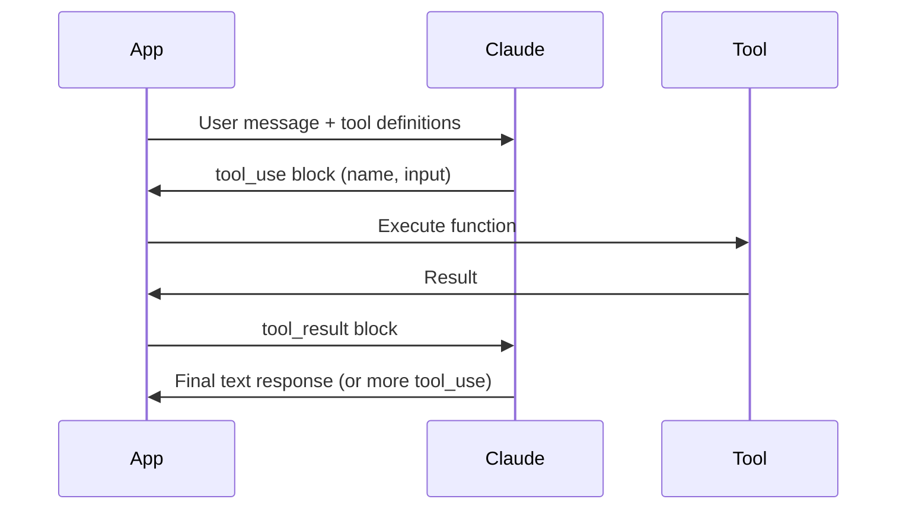
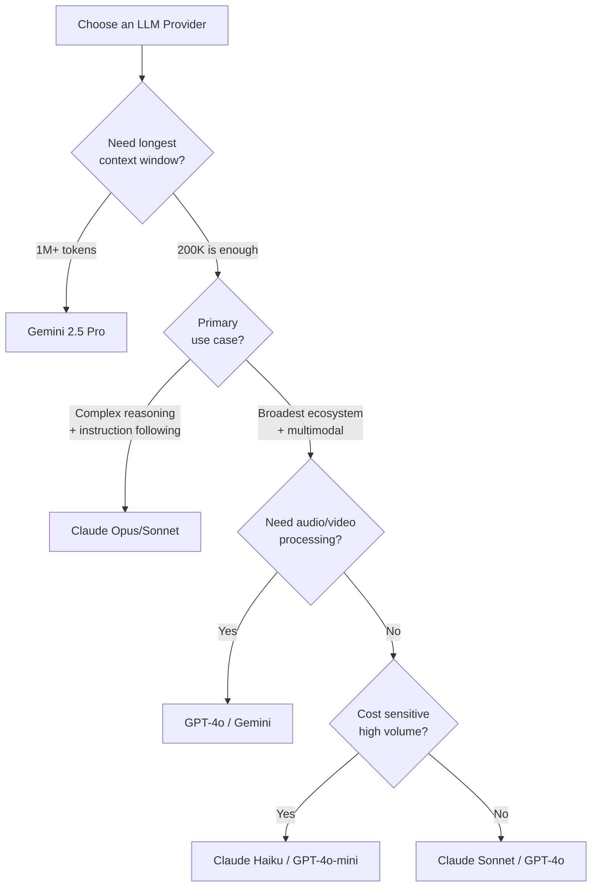

# Anthropic Claude API Patterns

Claude is Anthropic's family of large language models, designed with a focus on safety, long-context understanding, and instruction following. While the underlying model architecture is similar to other transformer-based LLMs, the API surface, prompting strategies, and unique features — extended thinking, prompt caching, computer use — make Claude a distinct tool that rewards understanding its specific patterns.

This page covers everything you need to build production systems with Claude: the model family, the Messages API, tool use, vision, extended thinking, prompt caching, streaming, batching, and when to pick Claude over GPT or Gemini.

## The Claude Model Family

Anthropic organizes Claude into three tiers, each optimized for a different point on the capability-cost-speed spectrum.

| Model | Strengths | Context Window | Best For |
|-------|-----------|----------------|----------|
| **Claude Opus 4** | Highest intelligence, complex reasoning, nuanced writing | 200K tokens | Research, complex analysis, long-form writing, agentic coding |
| **Claude Sonnet 4** | Best balance of speed and capability | 200K tokens | Most production workloads, coding, RAG, function calling |
| **Claude Haiku 3.5** | Fastest, cheapest, still highly capable | 200K tokens | Classification, extraction, high-throughput tasks, real-time chat |

::: tip Model Selection Rule of Thumb
Start with Sonnet for development and benchmarking. Move to Haiku for high-volume, latency-sensitive paths where Sonnet quality is not needed. Reserve Opus for tasks where you measurably see better results — complex multi-step reasoning, nuanced writing, or agentic workloads where each step matters.
:::

### Model Naming Convention

Anthropic uses a date-based versioning scheme:

```
claude-sonnet-4-20250514
claude-opus-4-20250918
claude-haiku-3-5-20241022
```

You can use shorthand aliases like `claude-sonnet-4-0` for the latest point release, but pin the full version in production for reproducibility.

## Messages API: The Foundation

All Claude interactions go through the Messages API. Unlike OpenAI's legacy completions endpoint, there is no separate "completions" API — messages are the only interface.

### Basic Request

```python
import anthropic

client = anthropic.Anthropic()  # Uses ANTHROPIC_API_KEY env var

message = client.messages.create(
    model="claude-sonnet-4-20250514",
    max_tokens=1024,
    messages=[
        {"role": "user", "content": "Explain the CAP theorem in three sentences."}
    ]
)

print(message.content[0].text)
```

```typescript
import Anthropic from "@anthropic-ai/sdk";

const client = new Anthropic(); // Uses ANTHROPIC_API_KEY env var

const message = await client.messages.create({
  model: "claude-sonnet-4-20250514",
  max_tokens: 1024,
  messages: [
    { role: "user", content: "Explain the CAP theorem in three sentences." },
  ],
});

console.log(message.content[0].text);
```

### System Prompts

Claude treats system prompts as first-class configuration — they are a separate parameter, not a message role.

```python
message = client.messages.create(
    model="claude-sonnet-4-20250514",
    max_tokens=1024,
    system="You are a senior PostgreSQL DBA. Answer only with valid SQL and brief explanations. Never suggest ORM-based solutions.",
    messages=[
        {"role": "user", "content": "How do I find the top 10 slowest queries?"}
    ]
)
```

::: warning System Prompt Placement
Unlike OpenAI where the system prompt is a message with `role: "system"`, Claude requires a dedicated `system` parameter. Putting system instructions in a user message will work, but you lose the ability to cache it independently and the model treats it with less authority.
:::

### Multi-Turn Conversations

Claude maintains no server-side state. You must send the full conversation history with every request.

```python
conversation = [
    {"role": "user", "content": "What is a B-tree?"},
    {"role": "assistant", "content": "A B-tree is a self-balancing tree data structure..."},
    {"role": "user", "content": "How does PostgreSQL use them for indexing?"},
]

message = client.messages.create(
    model="claude-sonnet-4-20250514",
    max_tokens=2048,
    system="You are a database internals expert.",
    messages=conversation,
)

# Append the response to continue the conversation
conversation.append({"role": "assistant", "content": message.content[0].text})
```

### Key Parameters

| Parameter | Type | Description |
|-----------|------|-------------|
| `model` | string | Model identifier (required) |
| `max_tokens` | int | Maximum output tokens (required) |
| `system` | string | System prompt — instructions, persona, constraints |
| `temperature` | float | Randomness (0.0-1.0). Default 1.0. Use 0-0.3 for deterministic tasks |
| `top_p` | float | Nucleus sampling. Alternative to temperature |
| `top_k` | int | Limits sampling to top K tokens |
| `stop_sequences` | list | Sequences that stop generation |
| `metadata` | object | User ID for abuse tracking |

## Tool Use (Function Calling)

Claude supports tool use natively — you define tools with JSON Schema, and Claude decides when and how to call them. This is the foundation for building [AI agents](/ai-ml-engineering/ai-agents).

### Defining Tools

```python
tools = [
    {
        "name": "get_weather",
        "description": "Get the current weather for a specific location. Use this when the user asks about weather conditions.",
        "input_schema": {
            "type": "object",
            "properties": {
                "location": {
                    "type": "string",
                    "description": "City and state/country, e.g. 'San Francisco, CA'"
                },
                "unit": {
                    "type": "string",
                    "enum": ["celsius", "fahrenheit"],
                    "description": "Temperature unit"
                }
            },
            "required": ["location"]
        }
    }
]

message = client.messages.create(
    model="claude-sonnet-4-20250514",
    max_tokens=1024,
    tools=tools,
    messages=[{"role": "user", "content": "What's the weather in Tokyo?"}]
)
```

### Processing Tool Calls

Claude's response may contain `tool_use` content blocks instead of (or alongside) text. You must execute the tool and send the result back.

```python
import json

def handle_tool_use(message, tools_map):
    """Process Claude's tool use requests in a loop."""
    messages = []

    while message.stop_reason == "tool_use":
        # Extract tool use blocks
        tool_results = []
        for block in message.content:
            if block.type == "tool_use":
                tool_name = block.name
                tool_input = block.input

                # Execute the actual tool
                result = tools_map[tool_name](**tool_input)

                tool_results.append({
                    "type": "tool_result",
                    "tool_use_id": block.id,
                    "content": json.dumps(result)
                })

        # Send results back to Claude
        messages.append({"role": "assistant", "content": message.content})
        messages.append({"role": "user", "content": tool_results})

        message = client.messages.create(
            model="claude-sonnet-4-20250514",
            max_tokens=1024,
            tools=tools,
            messages=messages,
        )

    return message
```



::: tip Tool Description Quality Matters
Claude decides whether to call a tool based primarily on the `description` field. Write descriptions that explain *when* to use the tool, not just *what* it does. Bad: "Gets weather." Good: "Get the current weather conditions for a specific location. Use this when the user asks about weather, temperature, or precipitation in a particular city."
:::

## Vision (Image Understanding)

Claude can process images sent as base64-encoded data or URLs within messages.

```python
import base64
import httpx

# From URL
image_data = base64.standard_b64encode(
    httpx.get("https://example.com/diagram.png").content
).decode("utf-8")

message = client.messages.create(
    model="claude-sonnet-4-20250514",
    max_tokens=1024,
    messages=[
        {
            "role": "user",
            "content": [
                {
                    "type": "image",
                    "source": {
                        "type": "base64",
                        "media_type": "image/png",
                        "data": image_data,
                    }
                },
                {
                    "type": "text",
                    "text": "Describe the architecture shown in this diagram. Identify any potential bottlenecks."
                }
            ]
        }
    ]
)
```

### Vision Best Practices

| Practice | Details |
|----------|---------|
| **Supported formats** | JPEG, PNG, GIF, WebP |
| **Max image size** | ~5MB per image after base64 encoding |
| **Multiple images** | Send multiple image blocks in one message |
| **Image placement** | Put images before text that references them |
| **Token cost** | Images consume tokens based on dimensions (~1600 tokens for a typical diagram) |

## Extended Thinking (Chain of Thought)

Extended thinking allows Claude to reason through complex problems step by step before producing a final answer. The model generates a "thinking" block that you can inspect but that is clearly separated from the final response.

```python
message = client.messages.create(
    model="claude-sonnet-4-20250514",
    max_tokens=16000,
    thinking={
        "type": "enabled",
        "budget_tokens": 10000  # Max tokens for the thinking process
    },
    messages=[
        {
            "role": "user",
            "content": "Analyze whether this distributed system design handles network partitions correctly: [design details...]"
        }
    ]
)

# Access thinking and response separately
for block in message.content:
    if block.type == "thinking":
        print(f"Reasoning: {block.thinking}")
    elif block.type == "text":
        print(f"Answer: {block.text}")
```

::: warning Extended Thinking Constraints
When extended thinking is enabled: (1) `temperature` must be set to 1 (the default), (2) you cannot use `system` prompt with certain model versions — check the docs, and (3) the `budget_tokens` count against your `max_tokens`. Set `max_tokens` high enough to accommodate both thinking and the response.
:::

### When to Use Extended Thinking

- **Math and logic problems** — provably improves accuracy
- **Complex code generation** — reduces bugs in multi-file implementations
- **Architecture analysis** — helps catch edge cases
- **Multi-step reasoning** — any task requiring 3+ logical steps

## Prompt Caching

Prompt caching allows you to mark portions of your prompt (system prompts, large context documents, tool definitions) as cacheable. On subsequent requests with the same cached prefix, Anthropic serves the cached KV-state, reducing both latency and cost.

```python
message = client.messages.create(
    model="claude-sonnet-4-20250514",
    max_tokens=1024,
    system=[
        {
            "type": "text",
            "text": "You are a legal contract analyst. Here is the full contract text: [50,000 tokens of contract text...]",
            "cache_control": {"type": "ephemeral"}
        }
    ],
    messages=[
        {"role": "user", "content": "What are the termination clauses?"}
    ]
)
```

### Caching Economics

| Metric | Without Caching | With Caching (Cache Hit) |
|--------|----------------|--------------------------|
| **Input cost** | Full input token price | ~90% discount on cached portion |
| **Latency** | Full processing time | Significantly reduced for cached prefix |
| **Cache write** | N/A | 25% surcharge on first request |
| **Cache TTL** | N/A | 5 minutes (refreshed on use) |

::: tip When Caching Pays Off
Caching is most valuable when: (1) you have a large system prompt or context document (10K+ tokens), (2) you make multiple requests with the same prefix, and (3) requests arrive within the 5-minute TTL. The canonical use case is [RAG](/ai-ml-engineering/rag-architecture) where the retrieved context is the same for follow-up questions.
:::

## Streaming

For real-time applications, stream Claude's response token by token.

```python
with client.messages.stream(
    model="claude-sonnet-4-20250514",
    max_tokens=1024,
    messages=[{"role": "user", "content": "Explain event sourcing."}]
) as stream:
    for text in stream.text_stream:
        print(text, end="", flush=True)

# Access the final message object after streaming
final_message = stream.get_final_message()
print(f"\nTokens used: {final_message.usage.input_tokens} in, {final_message.usage.output_tokens} out")
```

```typescript
const stream = client.messages.stream({
  model: "claude-sonnet-4-20250514",
  max_tokens: 1024,
  messages: [{ role: "user", content: "Explain event sourcing." }],
});

for await (const event of stream) {
  if (
    event.type === "content_block_delta" &&
    event.delta.type === "text_delta"
  ) {
    process.stdout.write(event.delta.text);
  }
}

const finalMessage = await stream.finalMessage();
```

### Server-Sent Events (SSE) Stream Format

When using the raw HTTP API, responses arrive as SSE events:

```
event: message_start
data: {"type":"message_start","message":{"id":"msg_...","model":"claude-sonnet-4-20250514",...}}

event: content_block_delta
data: {"type":"content_block_delta","index":0,"delta":{"type":"text_delta","text":"Event"}}

event: content_block_delta
data: {"type":"content_block_delta","index":0,"delta":{"type":"text_delta","text":" sourcing"}}

event: message_stop
data: {"type":"message_stop"}
```

## Batch API

For non-time-sensitive workloads, the Message Batches API lets you submit up to 10,000 requests at once and receive results asynchronously — at 50% of the standard API price.

```python
batch = client.messages.batches.create(
    requests=[
        {
            "custom_id": f"eval-{i}",
            "params": {
                "model": "claude-sonnet-4-20250514",
                "max_tokens": 1024,
                "messages": [{"role": "user", "content": prompt}]
            }
        }
        for i, prompt in enumerate(evaluation_prompts)
    ]
)

# Poll for completion
import time
while True:
    status = client.messages.batches.retrieve(batch.id)
    if status.processing_status == "ended":
        break
    time.sleep(30)

# Retrieve results
for result in client.messages.batches.results(batch.id):
    print(result.custom_id, result.result.message.content[0].text)
```

### Batch API Use Cases

- **Evaluation pipelines** — run thousands of test cases against new prompts
- **Content generation** — generate product descriptions, summaries, translations
- **Data extraction** — process large document sets for structured data
- **Classification** — categorize thousands of support tickets or documents

## Claude vs GPT vs Gemini

Choosing between providers is a nuanced engineering decision, not a religious one. Here is where each excels.

| Dimension | Claude (Anthropic) | GPT (OpenAI) | Gemini (Google) |
|-----------|-------------------|--------------|-----------------|
| **Instruction following** | Excellent — follows complex constraints precisely | Very good | Good |
| **Long context** | 200K tokens, strong recall throughout | 128K (GPT-4o) | 1M-2M tokens (largest windows) |
| **Coding** | Excellent (Opus/Sonnet) | Excellent (GPT-4o) | Very good |
| **Reasoning** | Extended thinking is powerful | o1/o3 reasoning models | Good with Gemini 2.5 Pro |
| **Tool use** | Clean API, reliable JSON | Mature, well-documented | Good |
| **Multimodal** | Vision (images), PDF | Vision, audio, DALL-E, video | Natively multimodal (broadest modality support) |
| **Safety** | Most cautious, strong refusals | Moderate | Moderate |
| **Cost** | Competitive, batch API is 50% off | Competitive, batch API available | Competitive, generous free tier |
| **Ecosystem** | Growing, MCP protocol | Largest ecosystem, Assistants API | Deep GCP integration |

### Decision Framework



::: tip Multi-Provider Strategy
Production systems should abstract the LLM provider behind an interface. Use libraries like LiteLLM or build your own adapter layer so you can switch between Claude, GPT, and Gemini per-task. Route classification to Haiku (cheap, fast), complex analysis to Opus or o3 (smart, slow), and keep Sonnet/GPT-4o as the general workhorse. See [LLM Integration Patterns](/ai-ml-engineering/llm-integration) for implementation details.
:::

## Error Handling

```python
from anthropic import (
    APIError,
    RateLimitError,
    APITimeoutError,
    BadRequestError,
)
import time

def call_claude_with_retry(client, max_retries=3, **kwargs):
    """Call Claude with exponential backoff retry."""
    for attempt in range(max_retries):
        try:
            return client.messages.create(**kwargs)
        except RateLimitError:
            wait = 2 ** attempt * 5  # 5s, 10s, 20s
            print(f"Rate limited. Waiting {wait}s...")
            time.sleep(wait)
        except APITimeoutError:
            wait = 2 ** attempt * 2
            print(f"Timeout. Retrying in {wait}s...")
            time.sleep(wait)
        except BadRequestError as e:
            # Don't retry client errors — fix the request
            raise
        except APIError as e:
            if e.status_code >= 500:
                wait = 2 ** attempt * 3
                time.sleep(wait)
            else:
                raise
    raise Exception("Max retries exceeded")
```

### Common Error Codes

| Status | Error | Action |
|--------|-------|--------|
| 400 | Invalid request | Fix the request (malformed JSON, invalid params) |
| 401 | Authentication error | Check API key |
| 403 | Permission denied | Check account permissions |
| 429 | Rate limit exceeded | Exponential backoff, check usage limits |
| 500 | Internal server error | Retry with backoff |
| 529 | Overloaded | Retry with longer backoff |

## Production Best Practices

### 1. Always Set max_tokens

Claude will generate up to `max_tokens` output tokens. If you do not set this, you risk unexpectedly long (and expensive) responses.

### 2. Use Structured System Prompts

```python
SYSTEM_PROMPT = """You are a code review assistant for a Python backend team.

## Rules
- Only comment on issues that could cause bugs, security vulnerabilities, or performance problems
- Ignore style issues — the linter handles those
- Format your response as a JSON array of findings

## Output Schema
[{"file": "...", "line": number, "severity": "critical|warning|info", "issue": "...", "suggestion": "..."}]
"""
```

### 3. Implement Token Counting

```python
# Use Anthropic's token counting to stay within limits
token_count = client.count_tokens(
    model="claude-sonnet-4-20250514",
    messages=messages,
    system=system_prompt,
)
print(f"Input tokens: {token_count.input_tokens}")
```

### 4. Use Prompt Caching for Repeated Context

If you send the same large context (documentation, code files, contracts) across multiple requests, use prompt caching to cut costs by up to 90% on cached portions.

### 5. Monitor Usage

Track input tokens, output tokens, cache hits, and latency per request. Set up alerts for cost anomalies. The `usage` field in every response gives you the numbers.

```python
response = client.messages.create(...)
print(f"Input: {response.usage.input_tokens}")
print(f"Output: {response.usage.output_tokens}")
print(f"Cache read: {response.usage.cache_read_input_tokens}")
print(f"Cache creation: {response.usage.cache_creation_input_tokens}")
```

## Further Reading

- [LLM Integration Patterns](/ai-ml-engineering/llm-integration) — General patterns for working with any LLM provider
- [AI Agents Architecture](/ai-ml-engineering/ai-agents) — Building tool-using agents with Claude
- [RAG Architecture](/ai-ml-engineering/rag-architecture) — Retrieval-augmented generation with prompt caching
- [LLM API Cheat Sheet](/cheat-sheets/llm-apis) — Quick reference for all major LLM APIs
- [Anthropic Documentation](https://docs.anthropic.com) — Official API reference
- [Anthropic Cookbook](https://github.com/anthropics/anthropic-cookbook) — Official examples and patterns
