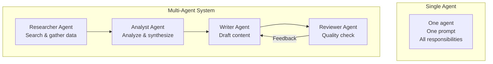
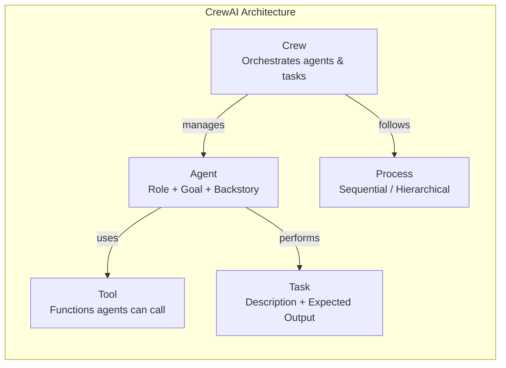
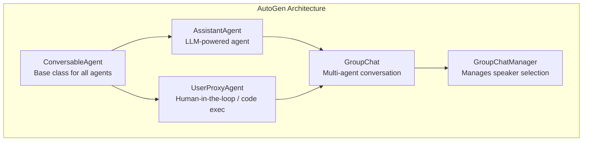
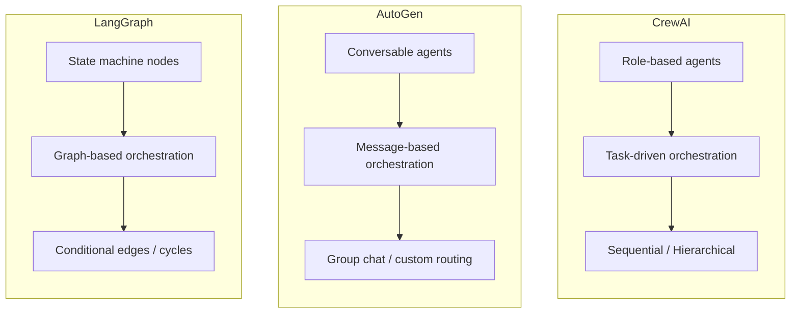
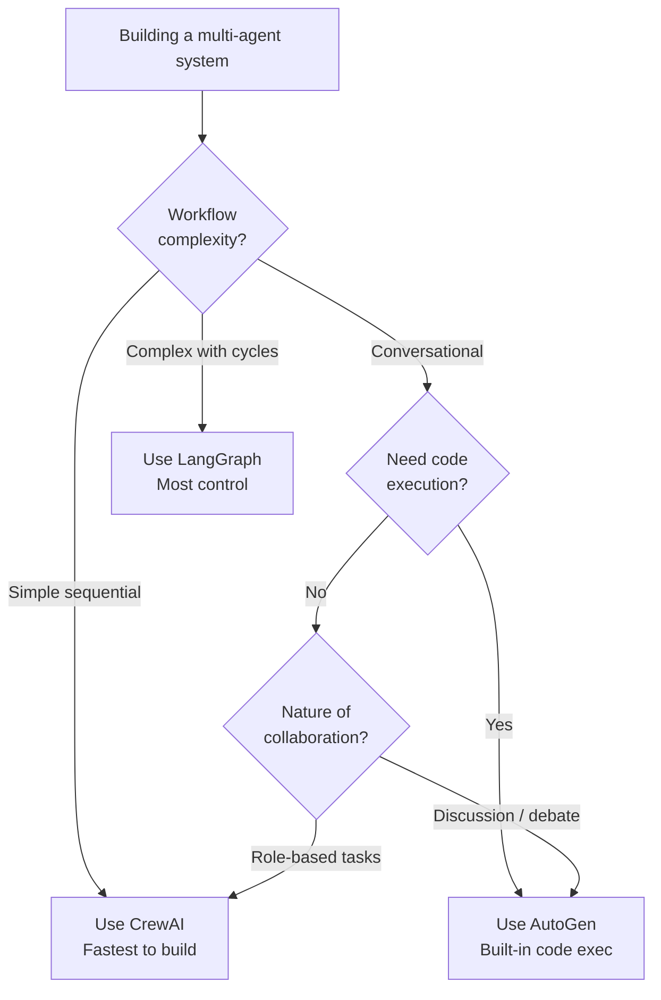

# Multi-Agent Frameworks

A single AI agent can do a lot. Multiple agents working together — each with a distinct role, specialized tools, and the ability to delegate — can do significantly more. Multi-agent systems decompose complex tasks into sub-tasks, assign each to a specialist agent, and orchestrate the collaboration. This page covers the two most popular multi-agent frameworks (CrewAI and AutoGen), their architectures, and a comparison with LangGraph for choosing the right tool.

## Why Multi-Agent?

The single-agent pattern breaks down when:

1. **Tasks require diverse expertise** — A code review needs a security reviewer, a performance reviewer, and a style reviewer. One mega-prompt does not replicate specialization.
2. **Quality improves with debate** — Having a "critic" agent challenge a "writer" agent produces better results than a single pass.
3. **Workflows are complex** — Research, analyze, write, review, revise — each step benefits from a focused agent.
4. **Parallelism is possible** — Independent sub-tasks can run concurrently with specialized agents.



## CrewAI

CrewAI is a high-level framework for orchestrating role-playing AI agents. Its core philosophy is that agents work best when given clear **roles**, **goals**, and **backstories** — similar to how you would brief a human team.

### Core Concepts



| Concept | Description | Analogy |
|---------|-------------|---------|
| **Agent** | An autonomous unit with a role, goal, backstory, and tools | A team member with a job title and expertise |
| **Task** | A specific piece of work with a description and expected output | A ticket or assignment |
| **Tool** | A function the agent can call (search, API, file I/O) | Software the team member uses |
| **Crew** | The team — a collection of agents and tasks with a process | The project team |
| **Process** | How tasks are executed (sequential, hierarchical) | The workflow methodology |

### Defining Agents

```python
from crewai import Agent, Task, Crew, Process
from crewai.tools import tool

# Define a custom tool
@tool("Search Documentation")
def search_docs(query: str) -> str:
    """Search the internal documentation for relevant information."""
    # Your search implementation here
    results = vector_store.similarity_search(query, k=5)
    return "\n".join([doc.page_content for doc in results])

@tool("Run SQL Query")
def run_sql(query: str) -> str:
    """Execute a read-only SQL query against the analytics database."""
    # Your database query implementation
    return execute_readonly_query(query)

# Define agents with distinct roles
researcher = Agent(
    role="Senior Research Analyst",
    goal="Find comprehensive, accurate data on the given topic",
    backstory="""You are an experienced research analyst who excels at
    finding relevant information from multiple sources. You are thorough,
    verify facts from multiple angles, and always cite your sources.""",
    tools=[search_docs],
    llm="gpt-4o",
    verbose=True,
    memory=True,           # Enable memory across tasks
    max_iter=5,            # Maximum reasoning iterations
    allow_delegation=True, # Can delegate to other agents
)

analyst = Agent(
    role="Data Analyst",
    goal="Analyze data and extract actionable insights",
    backstory="""You are a data analyst who transforms raw data into
    clear insights. You use SQL queries to investigate patterns and
    always back your conclusions with numbers.""",
    tools=[run_sql],
    llm="gpt-4o",
    verbose=True,
)

writer = Agent(
    role="Technical Writer",
    goal="Create clear, well-structured reports from research and analysis",
    backstory="""You are a technical writer who excels at making complex
    information accessible. You write concise, actionable reports with
    clear recommendations.""",
    llm="gpt-4o",
    verbose=True,
)
```

### Defining Tasks

```python
research_task = Task(
    description="""Research the current state of {topic}.
    Focus on:
    1. Key trends and developments
    2. Market leaders and their approaches
    3. Common challenges and solutions
    4. Emerging best practices

    Topic: {topic}""",
    expected_output="A comprehensive research brief with cited sources",
    agent=researcher,
)

analysis_task = Task(
    description="""Using the research findings, analyze:
    1. Which trends have the highest impact potential
    2. Risk factors and mitigation strategies
    3. Quantitative comparisons where data is available

    Base your analysis on the research brief provided.""",
    expected_output="An analytical report with data-backed insights and risk assessment",
    agent=analyst,
    context=[research_task],  # This task receives output from research_task
)

report_task = Task(
    description="""Create a final executive report combining the research
    and analysis. Structure it as:
    1. Executive Summary (3-4 sentences)
    2. Key Findings (bulleted)
    3. Analysis & Recommendations
    4. Risk Assessment
    5. Next Steps""",
    expected_output="A polished executive report in markdown format",
    agent=writer,
    context=[research_task, analysis_task],
    output_file="report.md",  # Save output to file
)
```

### Running a Crew

```python
# Sequential process — tasks run one after another
crew = Crew(
    agents=[researcher, analyst, writer],
    tasks=[research_task, analysis_task, report_task],
    process=Process.sequential,
    verbose=True,
    memory=True,              # Shared memory across agents
    planning=True,            # Enable crew-level planning step
)

result = crew.kickoff(inputs={"topic": "AI-powered code review tools"})
print(result.raw)             # Final output text
print(result.token_usage)     # Total tokens consumed
```

### Hierarchical Process

In hierarchical mode, a **manager agent** dynamically assigns tasks to workers, similar to a human project manager.

```python
from crewai import Crew, Process

crew = Crew(
    agents=[researcher, analyst, writer],
    tasks=[research_task, analysis_task, report_task],
    process=Process.hierarchical,
    manager_llm="gpt-4o",     # Manager agent uses this model
    verbose=True,
)

# The manager decides task order, delegation, and when to request revisions
result = crew.kickoff(inputs={"topic": "Vector database performance benchmarks"})
```

::: tip Sequential vs Hierarchical
Use **sequential** when you know the exact order of tasks and each agent's responsibility. Use **hierarchical** when tasks are interdependent, may need revision, or when you want the system to figure out the optimal workflow. Hierarchical uses more tokens (the manager reasons about delegation) but handles complex, ambiguous workflows better.
:::

### CrewAI Flows

For complex workflows with conditional logic and state management, CrewAI provides Flows.

```python
from crewai.flow.flow import Flow, listen, start

class ContentPipeline(Flow):
    @start()
    def research_phase(self):
        """Entry point — gather research."""
        result = research_crew.kickoff(inputs={"topic": self.state["topic"]})
        self.state["research"] = result.raw
        return result.raw

    @listen(research_phase)
    def quality_check(self, research_output):
        """Check research quality and decide next step."""
        # Use an LLM to evaluate quality
        score = evaluate_quality(research_output)
        self.state["quality_score"] = score
        return score

    @listen(quality_check)
    def route_based_on_quality(self, score):
        """Conditional routing based on quality."""
        if score >= 0.8:
            return self.write_report()
        else:
            return self.research_phase()  # Loop back

    def write_report(self):
        """Final report generation."""
        result = writing_crew.kickoff(inputs={"research": self.state["research"]})
        return result.raw

# Run the flow
flow = ContentPipeline()
result = flow.kickoff(inputs={"topic": "microservices observability"})
```

## AutoGen

AutoGen (by Microsoft) takes a different approach: it models multi-agent systems as **conversations**. Agents are conversable entities that send messages to each other. The conversation *is* the orchestration mechanism.

### Core Concepts



| Concept | Description | Key Feature |
|---------|-------------|-------------|
| **ConversableAgent** | Base agent class | Can send/receive messages |
| **AssistantAgent** | LLM-powered agent | Generates responses via an LLM |
| **UserProxyAgent** | Human proxy or code executor | Can run code, request human input |
| **GroupChat** | Multi-agent conversation | Manages turn-taking and termination |
| **GroupChatManager** | Orchestrates group chat | Selects next speaker |

### Two-Agent Conversation

```python
import autogen

# Configure the LLM
config_list = [
    {
        "model": "gpt-4o",
        "api_key": os.environ["OPENAI_API_KEY"],
    }
]

llm_config = {"config_list": config_list, "temperature": 0.7}

# Create an assistant agent
assistant = autogen.AssistantAgent(
    name="CodeAssistant",
    system_message="""You are a senior Python developer. When given a task:
    1. Think through the design carefully
    2. Write clean, well-documented code
    3. Include error handling and type hints
    4. Suggest tests for the implementation""",
    llm_config=llm_config,
)

# Create a user proxy that can execute code
user_proxy = autogen.UserProxyAgent(
    name="UserProxy",
    human_input_mode="NEVER",      # "ALWAYS", "TERMINATE", "NEVER"
    max_consecutive_auto_reply=5,
    code_execution_config={
        "work_dir": "workspace",
        "use_docker": True,        # Safer code execution
    },
    is_termination_msg=lambda x: "TERMINATE" in x.get("content", ""),
)

# Start the conversation
user_proxy.initiate_chat(
    assistant,
    message="Write a Python class for a thread-safe LRU cache with TTL support.",
)
```

### Group Chat (Multi-Agent)

```python
# Define specialist agents
architect = autogen.AssistantAgent(
    name="Architect",
    system_message="""You are a software architect. You design system
    architecture, define interfaces, and make technology choices.
    Focus on scalability, maintainability, and clear separation of concerns.""",
    llm_config=llm_config,
)

developer = autogen.AssistantAgent(
    name="Developer",
    system_message="""You are a senior developer. You implement the
    architecture designed by the Architect. Write production-quality
    code with proper error handling, logging, and tests.""",
    llm_config=llm_config,
)

reviewer = autogen.AssistantAgent(
    name="Reviewer",
    system_message="""You are a code reviewer. You review code for:
    - Correctness and edge cases
    - Performance issues
    - Security vulnerabilities
    - Code style and readability
    Be specific about issues and suggest fixes.""",
    llm_config=llm_config,
)

tester = autogen.AssistantAgent(
    name="Tester",
    system_message="""You are a QA engineer. You write comprehensive
    test suites covering unit tests, integration tests, and edge cases.
    Use pytest and follow testing best practices.""",
    llm_config=llm_config,
)

# Create group chat
group_chat = autogen.GroupChat(
    agents=[user_proxy, architect, developer, reviewer, tester],
    messages=[],
    max_round=15,
    speaker_selection_method="auto",  # LLM picks next speaker
)

manager = autogen.GroupChatManager(
    groupchat=group_chat,
    llm_config=llm_config,
)

# Start the collaboration
user_proxy.initiate_chat(
    manager,
    message="""Build a rate limiter service with:
    1. Sliding window algorithm
    2. Redis backend
    3. REST API with FastAPI
    4. Comprehensive test suite""",
)
```

### Speaker Selection Strategies

| Strategy | How It Works | Best For |
|----------|-------------|----------|
| `"auto"` | LLM decides who speaks next | Flexible, open-ended conversations |
| `"round_robin"` | Agents take turns in order | Structured workflows with fixed order |
| `"random"` | Random agent selection | Brainstorming, diverse perspectives |
| `"manual"` | Human selects next speaker | Supervised workflows |
| Custom function | Your logic picks the speaker | Domain-specific routing |

```python
# Custom speaker selection
def custom_speaker_selection(last_speaker, group_chat):
    """Route based on conversation state."""
    messages = group_chat.messages
    last_content = messages[-1]["content"] if messages else ""

    if "architecture" in last_content.lower() and last_speaker == architect:
        return developer  # Architect designed it, developer implements
    elif "```python" in last_content and last_speaker == developer:
        return reviewer   # Developer wrote code, reviewer checks it
    elif "LGTM" in last_content and last_speaker == reviewer:
        return tester     # Reviewer approved, tester writes tests
    else:
        return None       # Let the LLM decide

group_chat = autogen.GroupChat(
    agents=[user_proxy, architect, developer, reviewer, tester],
    messages=[],
    max_round=20,
    speaker_selection_method=custom_speaker_selection,
)
```

### Human-in-the-Loop

```python
# Agent that asks for human approval before critical actions
human_proxy = autogen.UserProxyAgent(
    name="HumanOperator",
    human_input_mode="TERMINATE",  # Ask human before terminating
    max_consecutive_auto_reply=3,
    code_execution_config=False,   # No code execution
    is_termination_msg=lambda x: "APPROVE" in x.get("content", "").upper(),
)
```

::: warning AutoGen Code Execution
By default, AutoGen's `UserProxyAgent` can execute code generated by other agents. In production, **always** use Docker containers for code execution (`use_docker=True`) or disable it entirely (`code_execution_config=False`). Unrestricted code execution from LLM-generated code is a serious security risk.
:::

## CrewAI vs AutoGen vs LangGraph

This is the most common decision teams face. Each framework has different strengths.

### Architecture Comparison



### Feature Comparison

| Feature | CrewAI | AutoGen | LangGraph |
|---------|--------|---------|-----------|
| **Mental model** | Team of specialists | Conversation between agents | State machine / graph |
| **Orchestration** | Task-based (sequential/hierarchical) | Message-based (group chat) | Graph edges and conditions |
| **Learning curve** | Low | Medium | High |
| **Flexibility** | Medium — opinionated structure | High — flexible conversations | Highest — arbitrary graphs |
| **Built-in tools** | Yes (web search, file I/O, etc.) | Code execution, function calling | Via LangChain tools |
| **Human-in-the-loop** | Limited | First-class support | First-class support |
| **State management** | Crew memory, task context | Chat history | Explicit state object |
| **Code execution** | Via tools | Built-in (Docker/local) | Via tools |
| **Streaming** | Limited | Yes | Yes |
| **Production readiness** | Good | Good | Best |
| **Observability** | Built-in logging | Built-in logging | LangSmith integration |
| **Best for** | Content workflows, research | Coding assistants, collaborative problem-solving | Complex stateful workflows, production agents |

### When to Use What



| Scenario | Recommended | Why |
|----------|-------------|-----|
| Research + write + review pipeline | **CrewAI** | Natural fit for role-based sequential tasks |
| Coding assistant with code execution | **AutoGen** | Built-in sandboxed code execution |
| Customer support with escalation | **LangGraph** | Complex state transitions, conditional routing |
| Brainstorming / debate sessions | **AutoGen** | Conversational pattern fits naturally |
| CI/CD pipeline automation | **LangGraph** | Deterministic state machine with error handling |
| Content generation with revision loops | **CrewAI** (Hierarchical) | Manager agent handles revision cycles |
| Complex RAG with fallback strategies | **LangGraph** | Conditional edges for retry/fallback logic |

::: tip Combining Frameworks
These frameworks are not mutually exclusive. A common production pattern uses LangGraph as the outer orchestration layer (for its state management and conditional routing) while individual nodes call CrewAI crews or AutoGen group chats for specific collaborative sub-tasks.
:::

## Production Considerations

### Cost Management

Multi-agent systems multiply LLM costs because every agent interaction is an API call. A 4-agent group chat with 10 rounds generates at least 40 LLM calls.

```python
# CrewAI cost tracking
result = crew.kickoff(inputs={"topic": "microservices"})
print(f"Total tokens: {result.token_usage}")
# {'total_tokens': 45230, 'prompt_tokens': 38100, 'completion_tokens': 7130}

# Strategies to reduce cost:
# 1. Use cheaper models for simple agents (GPT-4o mini for reviewers)
# 2. Set max_iter limits on agents
# 3. Use sequential over hierarchical when possible
# 4. Cache repeated tool calls
```

### Error Handling

```python
# CrewAI with error handling
from crewai import Crew

crew = Crew(
    agents=[researcher, writer],
    tasks=[research_task, write_task],
    process=Process.sequential,
    max_rpm=10,                # Rate limit API calls
    share_crew=False,
    verbose=True,
)

try:
    result = crew.kickoff(inputs={"topic": "AI testing"})
except Exception as e:
    # Log the error, save partial results, alert
    logger.error(f"Crew execution failed: {e}")
    # Access partial results if available
    for task in crew.tasks:
        if task.output:
            save_partial_result(task.name, task.output.raw)
```

### Guardrails

```python
# Add guardrails to prevent agents from going off-track
reviewer_with_guardrails = Agent(
    role="Safety Reviewer",
    goal="Ensure all outputs meet quality and safety standards",
    backstory="You check for accuracy, bias, and safety issues.",
    llm="gpt-4o",
    max_iter=3,                    # Prevent infinite loops
    max_execution_time=120,        # Timeout in seconds
    allow_delegation=False,        # Cannot pass work to others
)
```

## See Also

- [AI Agents Architecture](/ai-ml-engineering/ai-agents) — Foundational agent patterns (ReAct, tool use, memory)
- [LangGraph Deep Dive](/ai-ml-engineering/langgraph) — State machine orchestration for agents
- [LangChain Deep Dive](/ai-ml-engineering/langchain) — The underlying LLM framework
- [Testing AI Applications](/ai-ml-engineering/ai-testing) — Evaluating multi-agent system outputs
- [LLM Integration Patterns](/ai-ml-engineering/llm-integration) — Provider-agnostic LLM architecture
