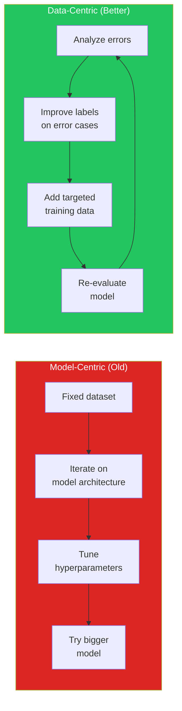
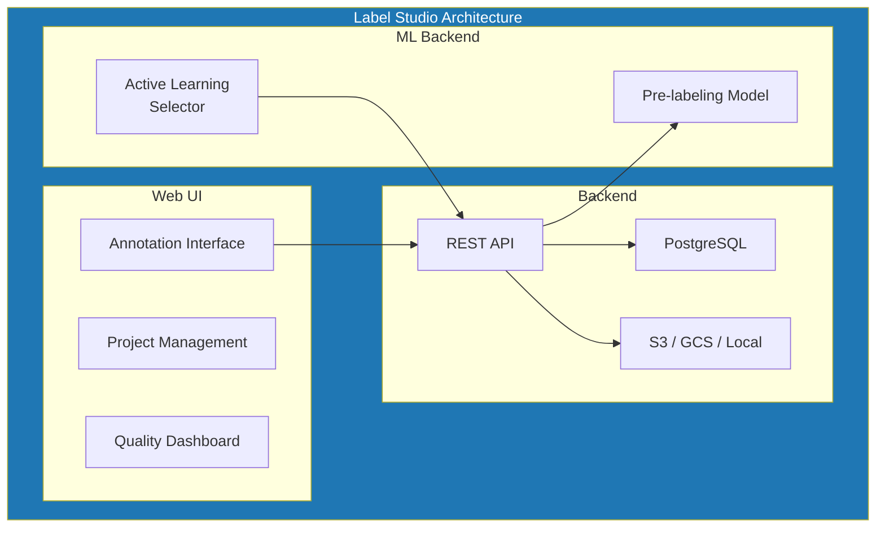
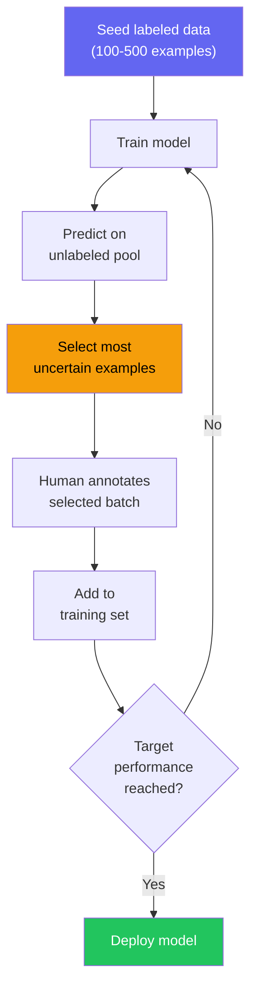
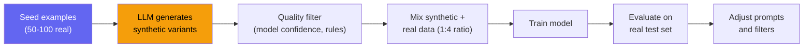

# Data Annotation & Labeling

Machine learning models are only as good as their training data. A model trained on noisy, inconsistent, or biased labels will produce noisy, inconsistent, or biased predictions — no matter how sophisticated the architecture. Data annotation is the process of creating labeled datasets for training, evaluating, and fine-tuning ML models. It is the most impactful and most underinvested part of the ML lifecycle.

This page covers the full annotation lifecycle: choosing annotation tools (Label Studio, Prodigy), designing annotation guidelines, measuring annotator agreement, using active learning to annotate smarter, and leveraging LLMs to generate synthetic training data. The goal is not just labeling data — it is building a **data quality system** that continuously improves.

---

## Why Data Annotation Matters

The ML community has shifted from model-centric to data-centric AI. Andrew Ng's data-centric AI movement formalized what practitioners already knew: improving your data is usually more effective than improving your model.



### The Economics of Annotation

| Approach | Cost per Label | Labels/Hour | Quality | Best For |
|----------|---------------|-------------|---------|----------|
| **In-house experts** | $2-10 | 30-100 | Highest | Complex domain tasks |
| **Crowdsourcing (MTurk)** | $0.05-0.50 | 200-1000 | Variable | Simple classification |
| **Annotation firms** | $0.50-5.00 | 50-200 | High | Scale with quality control |
| **LLM-assisted** | $0.001-0.05 | 1000-10000 | Good (with review) | Pre-labeling, augmentation |
| **Active learning** | N/A (meta) | 2-5x efficiency | Same | Any annotation task |

::: tip The 80/20 of Data Annotation
You do not need millions of labeled examples to build a useful model. Start with 500-2000 high-quality labels, train a model, analyze errors, and label more data specifically for the failure modes. This targeted approach often outperforms 10x more randomly labeled data.
:::

---

## Annotation Tool Landscape

### Label Studio

Label Studio is the most popular open-source annotation platform. It supports text, images, audio, video, time series, and multi-modal data. It has a flexible template system, built-in ML backend integration for pre-labeling, and team management features.



#### Label Studio Setup

```bash
# Install Label Studio
pip install label-studio

# Start the server
label-studio start --port 8080 --host 0.0.0.0

# Or with Docker (production)
docker run -d \
  --name label-studio \
  -p 8080:8080 \
  -v label-studio-data:/label-studio/data \
  -e DJANGO_DB=default \
  -e POSTGRE_NAME=labelstudio \
  -e POSTGRE_USER=labelstudio \
  -e POSTGRE_PASSWORD=secret \
  -e POSTGRE_HOST=postgres \
  -e POSTGRE_PORT=5432 \
  heartexlabs/label-studio:latest
```

#### Label Studio Template for NER

```xml
<!-- Named Entity Recognition template -->
<View>
  <Labels name="label" toName="text">
    <Label value="PERSON" background="red"/>
    <Label value="ORGANIZATION" background="blue"/>
    <Label value="LOCATION" background="green"/>
    <Label value="DATE" background="orange"/>
    <Label value="PRODUCT" background="purple"/>
  </Labels>

  <Text name="text" value="$text"/>
</View>
```

#### Label Studio Template for Text Classification

```xml
<!-- Multi-label text classification -->
<View>
  <Header value="Classify the customer feedback:"/>
  <Text name="text" value="$text"/>

  <Choices name="sentiment" toName="text" choice="single" showInline="true">
    <Choice value="Positive"/>
    <Choice value="Neutral"/>
    <Choice value="Negative"/>
  </Choices>

  <Choices name="category" toName="text" choice="multiple">
    <Choice value="Product Quality"/>
    <Choice value="Customer Service"/>
    <Choice value="Shipping"/>
    <Choice value="Pricing"/>
    <Choice value="UI/UX"/>
    <Choice value="Documentation"/>
  </Choices>

  <TextArea name="reasoning" toName="text"
            placeholder="Why did you choose this label?"
            maxSubmissions="1"/>
</View>
```

#### Label Studio ML Backend for Pre-Labeling

```python
# ml_backend.py — Pre-label with a model to speed up annotation
from label_studio_ml.model import LabelStudioMLBase
from transformers import pipeline


class SentimentPreLabeler(LabelStudioMLBase):
    """Pre-label text with a sentiment classifier."""

    def __init__(self, **kwargs):
        super().__init__(**kwargs)
        self.classifier = pipeline(
            "sentiment-analysis",
            model="cardiffnlp/twitter-roberta-base-sentiment-latest",
            device=0,  # GPU
        )
        self.label_map = {
            "positive": "Positive",
            "neutral": "Neutral",
            "negative": "Negative",
        }

    def predict(self, tasks, **kwargs):
        """Generate pre-labels for tasks."""
        predictions = []

        for task in tasks:
            text = task["data"]["text"]
            result = self.classifier(text[:512])[0]  # Truncate for model

            predictions.append({
                "result": [{
                    "from_name": "sentiment",
                    "to_name": "text",
                    "type": "choices",
                    "value": {
                        "choices": [self.label_map.get(
                            result["label"], "Neutral"
                        )]
                    },
                }],
                "score": result["score"],
                "model_version": "roberta-sentiment-v1",
            })

        return predictions

    def fit(self, event, data, **kwargs):
        """Retrain on new annotations (optional)."""
        # Triggered when annotations are submitted
        pass
```

### Prodigy

Prodigy is Explosion's (makers of spaCy) commercial annotation tool. It is designed for efficient annotation by a single expert, with active learning built into the core workflow. Unlike Label Studio's web-based team approach, Prodigy focuses on speed — an expert annotator can label thousands of examples per hour.

#### Prodigy Workflows

```bash
# Text classification with active learning
prodigy textcat.teach my_dataset \
    en_core_web_trf \
    ./data/unlabeled.jsonl \
    --label POSITIVE,NEGATIVE,NEUTRAL

# Named Entity Recognition
prodigy ner.teach my_ner_dataset \
    en_core_web_trf \
    ./data/texts.jsonl \
    --label PERSON,ORG,PRODUCT

# Span categorization (overlapping entities)
prodigy spans.manual my_spans_dataset blank:en \
    ./data/texts.jsonl \
    --label SKILL,TOOL,LANGUAGE,FRAMEWORK

# Review and adjudicate conflicts
prodigy review my_dataset_gold my_dataset \
    --label POSITIVE,NEGATIVE,NEUTRAL

# Export annotations
prodigy db-out my_dataset > ./data/annotated.jsonl

# Train a spaCy model on annotations
prodigy train ./output \
    --textcat my_dataset \
    --eval-split 0.2 \
    --gpu-id 0
```

#### Prodigy Custom Recipe

```python
# recipes/classify_with_llm.py — Custom Prodigy recipe with LLM pre-labeling
import prodigy
from prodigy.components.loaders import JSONL
from openai import OpenAI

client = OpenAI()


@prodigy.recipe(
    "textcat.llm-assist",
    dataset=("Dataset to save to", "positional", None, str),
    source=("Data to annotate", "positional", None, str),
    label=("Comma-separated labels", "option", "l", str),
)
def textcat_llm_assist(dataset, source, label="POSITIVE,NEGATIVE,NEUTRAL"):
    """Text classification with LLM pre-labeling for faster annotation."""
    labels = label.split(",")
    stream = JSONL(source)

    def add_suggestions(stream):
        for eg in stream:
            text = eg["text"]

            # Get LLM suggestion
            response = client.chat.completions.create(
                model="gpt-4o-mini",
                messages=[{
                    "role": "user",
                    "content": f"""Classify this text as one of: {', '.join(labels)}

Text: {text}

Return ONLY the label, nothing else."""
                }],
                temperature=0,
                max_tokens=10,
            )

            suggestion = response.choices[0].message.content.strip()

            if suggestion in labels:
                eg["label"] = suggestion
                eg["meta"] = {"llm_suggestion": suggestion}

            yield eg

    return {
        "dataset": dataset,
        "stream": add_suggestions(stream),
        "view_id": "classification",
        "config": {
            "labels": labels,
            "choice_style": "single",
        },
    }
```

### Label Studio vs Prodigy

| Feature | Label Studio | Prodigy |
|---------|-------------|---------|
| **License** | Open source (Apache 2) | Commercial ($490/user) |
| **Deployment** | Web server (team) | Local CLI (individual) |
| **Best for** | Teams, multiple annotators | Expert annotation, speed |
| **Active learning** | Via ML backend | Built-in core feature |
| **Data types** | All (text, image, audio, video) | Primarily text + NER |
| **Pre-labeling** | ML backend API | Suggest recipes |
| **Quality metrics** | Agreement dashboard | Review + adjudicate |
| **spaCy integration** | Export → train | Direct training pipeline |
| **Scalability** | Multi-user, enterprise | Single annotator focus |

::: tip Choose Based on Team Size
- **Solo expert + NLP tasks**: Prodigy. The active learning and speed optimizations compound over thousands of annotations.
- **Team of annotators + any data type**: Label Studio. The collaboration, quality metrics, and multi-modal support are essential for team workflows.
:::

---

## Inter-Annotator Agreement (IAA)

Measuring agreement between annotators is how you know your labels are trustworthy. If two annotators disagree 40% of the time, your labels are noise, not signal.

### Key Metrics

| Metric | Formula | Range | Interpretation |
|--------|---------|-------|---------------|
| **Percent Agreement** | $\frac{\text{agree}}{\text{total}}$ | 0-100% | Simple but inflated by class imbalance |
| **Cohen's Kappa ($\kappa$)** | $\frac{p_o - p_e}{1 - p_e}$ | -1 to 1 | Corrects for chance agreement |
| **Fleiss' Kappa** | Multi-rater extension of Cohen's | -1 to 1 | 3+ annotators |
| **Krippendorff's Alpha ($\alpha$)** | Handles missing data, any scale | -1 to 1 | Gold standard for research |

### Interpretation Scale

| Score | Interpretation | Action |
|-------|---------------|--------|
| < 0.20 | Slight agreement | Guidelines are broken — rewrite them |
| 0.21 - 0.40 | Fair agreement | Ambiguous categories — refine definitions |
| 0.41 - 0.60 | Moderate agreement | Acceptable for initial annotation |
| 0.61 - 0.80 | Substantial agreement | Good quality — production-ready |
| 0.81 - 1.00 | Almost perfect | Excellent — typical for simple tasks |

### Computing IAA

```python
# iaa.py — Inter-annotator agreement metrics
import numpy as np
from sklearn.metrics import cohen_kappa_score
from collections import Counter
from itertools import combinations


def compute_agreement_metrics(
    annotations: dict[str, list[str]],
) -> dict:
    """
    Compute IAA metrics for multiple annotators.

    Args:
        annotations: {annotator_id: [label_for_item_0, label_for_item_1, ...]}

    Returns:
        Dict with percent agreement, Cohen's kappa, Fleiss' kappa
    """
    annotators = list(annotations.keys())
    n_items = len(next(iter(annotations.values())))

    # Pairwise Cohen's Kappa
    kappa_scores = []
    for a1, a2 in combinations(annotators, 2):
        kappa = cohen_kappa_score(annotations[a1], annotations[a2])
        kappa_scores.append({
            "annotator_1": a1,
            "annotator_2": a2,
            "kappa": round(kappa, 4),
        })

    avg_kappa = np.mean([s["kappa"] for s in kappa_scores])

    # Percent agreement (all annotators agree)
    full_agreement = sum(
        1 for i in range(n_items)
        if len(set(annotations[a][i] for a in annotators)) == 1
    )
    pct_agreement = full_agreement / n_items

    # Fleiss' Kappa (multi-rater)
    fleiss_kappa = compute_fleiss_kappa(annotations)

    # Disagreement analysis
    disagreements = find_disagreements(annotations)

    return {
        "percent_agreement": round(pct_agreement, 4),
        "avg_cohens_kappa": round(avg_kappa, 4),
        "fleiss_kappa": round(fleiss_kappa, 4),
        "pairwise_kappa": kappa_scores,
        "top_disagreements": disagreements[:20],
        "n_annotators": len(annotators),
        "n_items": n_items,
    }


def compute_fleiss_kappa(annotations: dict[str, list]) -> float:
    """Compute Fleiss' Kappa for multiple raters."""
    annotators = list(annotations.keys())
    n_items = len(next(iter(annotations.values())))
    n_raters = len(annotators)

    # Get all unique labels
    all_labels = sorted(set(
        label for labels in annotations.values() for label in labels
    ))
    n_categories = len(all_labels)
    label_to_idx = {label: i for i, label in enumerate(all_labels)}

    # Build count matrix: n_items x n_categories
    counts = np.zeros((n_items, n_categories))
    for item_idx in range(n_items):
        for annotator in annotators:
            label = annotations[annotator][item_idx]
            counts[item_idx][label_to_idx[label]] += 1

    # Compute Fleiss' Kappa
    # P_i = proportion of agreement for item i
    P_i = (np.sum(counts ** 2, axis=1) - n_raters) / (
        n_raters * (n_raters - 1)
    )
    P_bar = np.mean(P_i)

    # P_e = expected agreement by chance
    p_j = np.sum(counts, axis=0) / (n_items * n_raters)
    P_e = np.sum(p_j ** 2)

    if P_e == 1:
        return 1.0

    kappa = (P_bar - P_e) / (1 - P_e)
    return float(kappa)


def find_disagreements(
    annotations: dict[str, list],
) -> list[dict]:
    """Find items where annotators disagree most."""
    annotators = list(annotations.keys())
    n_items = len(next(iter(annotations.values())))

    disagreements = []
    for i in range(n_items):
        labels = [annotations[a][i] for a in annotators]
        unique = set(labels)
        if len(unique) > 1:
            label_counts = Counter(labels)
            disagreements.append({
                "item_index": i,
                "labels": dict(label_counts),
                "n_unique": len(unique),
                "entropy": -sum(
                    (c / len(labels)) * np.log2(c / len(labels))
                    for c in label_counts.values()
                ),
            })

    # Sort by entropy (highest disagreement first)
    return sorted(disagreements, key=lambda x: x["entropy"], reverse=True)


# Usage
annotations = {
    "annotator_1": ["pos", "neg", "pos", "neu", "pos", "neg", "neg", "pos"],
    "annotator_2": ["pos", "neg", "neu", "neu", "pos", "neg", "pos", "pos"],
    "annotator_3": ["pos", "neg", "pos", "neg", "pos", "neg", "neg", "pos"],
}

metrics = compute_agreement_metrics(annotations)
# {
#   "percent_agreement": 0.625,
#   "avg_cohens_kappa": 0.52,
#   "fleiss_kappa": 0.49,
#   ...
# }
```

::: warning Low Agreement = Bad Guidelines, Not Bad Annotators
When IAA is below 0.60, the first response should be to improve annotation guidelines, not replace annotators. Provide more examples of edge cases, clarify category boundaries, and hold calibration sessions where annotators discuss disagreements.
:::

---

## Active Learning

Active learning selects the most informative unlabeled examples for annotation. Instead of labeling randomly, you label the examples where the model is most uncertain — maximizing the information gained per label.

### Active Learning Loop



### Selection Strategies

| Strategy | How It Works | Strengths | Weaknesses |
|----------|-------------|-----------|------------|
| **Uncertainty sampling** | Select examples with highest model uncertainty | Simple, effective | Biased toward decision boundary |
| **Margin sampling** | Smallest difference between top-2 predictions | Better than pure uncertainty | Still boundary-focused |
| **Entropy sampling** | Highest prediction entropy | Good for multi-class | Can select outliers |
| **Query-by-Committee** | Multiple models disagree | Robust, diverse | Expensive (train multiple models) |
| **Diversity sampling** | Cluster unlabeled data, sample from each | Explores input space | May miss boundary cases |
| **Hybrid** | Uncertainty + diversity | Best of both | More complex to implement |

### Implementation

```python
# active_learning.py — Active learning loop with uncertainty sampling
import numpy as np
from sklearn.linear_model import LogisticRegression
from sklearn.feature_extraction.text import TfidfVectorizer
from sklearn.metrics import f1_score
from dataclasses import dataclass


@dataclass
class ActiveLearningConfig:
    seed_size: int = 200
    batch_size: int = 50
    max_iterations: int = 20
    target_f1: float = 0.85
    strategy: str = "uncertainty"  # uncertainty, margin, entropy, hybrid


class ActiveLearner:
    def __init__(self, config: ActiveLearningConfig):
        self.config = config
        self.vectorizer = TfidfVectorizer(max_features=10000)
        self.model = LogisticRegression(
            max_iter=1000, class_weight="balanced"
        )
        self.labeled_indices = []
        self.labels = {}

    def initialize(self, texts: list[str], seed_labels: dict[int, str]):
        """Start with seed labeled data."""
        self.texts = texts
        self.X = self.vectorizer.fit_transform(texts)
        self.labeled_indices = list(seed_labels.keys())
        self.labels = dict(seed_labels)
        self._train()

    def select_batch(self) -> list[int]:
        """Select the most informative examples to label next."""
        unlabeled = [
            i for i in range(len(self.texts))
            if i not in self.labeled_indices
        ]

        if not unlabeled:
            return []

        X_unlabeled = self.X[unlabeled]

        if self.config.strategy == "uncertainty":
            scores = self._uncertainty_scores(X_unlabeled)
        elif self.config.strategy == "margin":
            scores = self._margin_scores(X_unlabeled)
        elif self.config.strategy == "entropy":
            scores = self._entropy_scores(X_unlabeled)
        elif self.config.strategy == "hybrid":
            uncertainty = self._uncertainty_scores(X_unlabeled)
            diversity = self._diversity_scores(X_unlabeled)
            scores = 0.7 * uncertainty + 0.3 * diversity
        else:
            raise ValueError(f"Unknown strategy: {self.config.strategy}")

        # Select top-k most informative
        top_k = np.argsort(scores)[-self.config.batch_size:]
        return [unlabeled[i] for i in top_k]

    def add_labels(self, new_labels: dict[int, str]):
        """Add newly annotated examples."""
        self.labels.update(new_labels)
        self.labeled_indices.extend(new_labels.keys())
        self._train()

    def evaluate(self, test_indices: list[int], test_labels: list[str]) -> float:
        """Evaluate model on held-out test set."""
        X_test = self.X[test_indices]
        predictions = self.model.predict(X_test)
        return f1_score(test_labels, predictions, average="macro")

    def _train(self):
        """Retrain model on all labeled data."""
        X_labeled = self.X[self.labeled_indices]
        y_labeled = [self.labels[i] for i in self.labeled_indices]
        self.model.fit(X_labeled, y_labeled)

    def _uncertainty_scores(self, X) -> np.ndarray:
        """1 - max(P(y|x)) — most uncertain examples score highest."""
        probs = self.model.predict_proba(X)
        return 1 - np.max(probs, axis=1)

    def _margin_scores(self, X) -> np.ndarray:
        """Smallest margin between top-2 predictions."""
        probs = self.model.predict_proba(X)
        sorted_probs = np.sort(probs, axis=1)
        margins = sorted_probs[:, -1] - sorted_probs[:, -2]
        return 1 - margins  # Invert: small margin = high score

    def _entropy_scores(self, X) -> np.ndarray:
        """Shannon entropy of prediction distribution."""
        probs = self.model.predict_proba(X)
        # Avoid log(0)
        probs = np.clip(probs, 1e-10, 1.0)
        return -np.sum(probs * np.log2(probs), axis=1)

    def _diversity_scores(self, X) -> np.ndarray:
        """Distance from nearest labeled example (encourages exploration)."""
        from sklearn.metrics.pairwise import cosine_distances
        X_labeled = self.X[self.labeled_indices]
        distances = cosine_distances(X, X_labeled)
        return np.min(distances, axis=1)


# Active learning loop
def run_active_learning(
    texts: list[str],
    seed_labels: dict[int, str],
    test_indices: list[int],
    test_labels: list[str],
    annotation_fn,  # Function that returns labels for given indices
    config: ActiveLearningConfig = ActiveLearningConfig(),
):
    learner = ActiveLearner(config)
    learner.initialize(texts, seed_labels)

    history = []

    for iteration in range(config.max_iterations):
        f1 = learner.evaluate(test_indices, test_labels)
        n_labeled = len(learner.labeled_indices)
        print(
            f"Iteration {iteration}: "
            f"F1={f1:.3f}, labeled={n_labeled}"
        )
        history.append({"iteration": iteration, "f1": f1, "n_labeled": n_labeled})

        if f1 >= config.target_f1:
            print(f"Target F1 reached with {n_labeled} labels!")
            break

        # Select and annotate next batch
        batch = learner.select_batch()
        if not batch:
            break

        new_labels = annotation_fn(batch)  # Human annotation
        learner.add_labels(new_labels)

    return learner, history
```

---

## Synthetic Data Generation with LLMs

LLMs can generate training data for tasks where manual annotation is too slow or expensive. This is particularly effective for text classification, NER, and instruction-following datasets.

### Synthetic Data Pipeline



### Synthetic Data Generator

```python
# synthetic_data.py — Generate training data with LLMs
import json
import asyncio
import hashlib
from openai import AsyncOpenAI
from pydantic import BaseModel, Field

client = AsyncOpenAI()


class SyntheticExample(BaseModel):
    text: str = Field(description="The generated text")
    label: str = Field(description="The classification label")
    reasoning: str = Field(description="Why this text has this label")


class SyntheticBatch(BaseModel):
    examples: list[SyntheticExample]


async def generate_synthetic_data(
    task_description: str,
    labels: list[str],
    seed_examples: list[dict],
    n_per_label: int = 100,
    model: str = "gpt-4o",
) -> list[dict]:
    """Generate synthetic training data using an LLM."""

    seed_text = "\n".join(
        f"- [{ex['label']}] {ex['text']}" for ex in seed_examples
    )

    all_examples = []

    for label in labels:
        label_seeds = [ex for ex in seed_examples if ex["label"] == label]
        label_seed_text = "\n".join(f"- {ex['text']}" for ex in label_seeds)

        batches_needed = (n_per_label + 9) // 10  # Generate 10 per call

        tasks = [
            generate_batch(
                task_description, label, label_seed_text, seed_text, model, batch_idx
            )
            for batch_idx in range(batches_needed)
        ]

        batch_results = await asyncio.gather(*tasks)

        for batch in batch_results:
            all_examples.extend(batch)

    # Deduplicate
    seen = set()
    unique = []
    for ex in all_examples:
        text_hash = hashlib.md5(ex["text"].lower().encode()).hexdigest()
        if text_hash not in seen:
            seen.add(text_hash)
            unique.append(ex)

    return unique


async def generate_batch(
    task_description: str,
    label: str,
    label_seeds: str,
    all_seeds: str,
    model: str,
    batch_idx: int,
) -> list[dict]:
    """Generate a batch of synthetic examples for one label."""

    prompt = f"""You are generating training data for a text classification model.

Task: {task_description}

Here are some real examples across all labels:
{all_seeds}

Generate 10 NEW, DIVERSE examples for the label "{label}".

Requirements:
- Each example must be clearly classifiable as "{label}"
- Vary the writing style, length, and complexity
- Include edge cases and ambiguous examples
- Do NOT copy the seed examples — create new ones
- Each should be realistic and natural-sounding
- Batch {batch_idx}: try especially different styles than usual

Real examples of "{label}" for reference:
{label_seeds}

Return a JSON object with an "examples" array, each containing
"text", "label", and "reasoning" fields."""

    response = await client.beta.chat.completions.parse(
        model=model,
        messages=[{"role": "user", "content": prompt}],
        response_format=SyntheticBatch,
        temperature=0.9,
    )

    batch = response.choices[0].message.parsed

    return [
        {
            "text": ex.text,
            "label": ex.label,
            "reasoning": ex.reasoning,
            "source": "synthetic",
            "generator_model": model,
        }
        for ex in batch.examples
        if ex.label == label  # Filter mislabeled generations
    ]


async def validate_synthetic_data(
    synthetic_data: list[dict],
    validator_model: str = "gpt-4o-mini",
    confidence_threshold: float = 0.8,
) -> list[dict]:
    """Validate synthetic data with a separate model."""
    validated = []

    for example in synthetic_data:
        response = await client.chat.completions.create(
            model=validator_model,
            messages=[{
                "role": "user",
                "content": f"""Is this text correctly labeled?

Text: {example["text"]}
Label: {example["label"]}

Rate confidence from 0.0 to 1.0 that the label is correct.
Return ONLY a number."""
            }],
            temperature=0,
            max_tokens=5,
        )

        try:
            confidence = float(
                response.choices[0].message.content.strip()
            )
            if confidence >= confidence_threshold:
                example["validation_confidence"] = confidence
                validated.append(example)
        except ValueError:
            pass  # Skip examples that fail validation

    return validated
```

::: danger Never Train Solely on Synthetic Data
Synthetic data is a supplement, not a replacement for real data. Models trained exclusively on synthetic data learn the LLM's biases and distribution, not the real-world distribution. Use a mix ratio of approximately 20-30% synthetic, 70-80% real for best results. Always evaluate on a real, human-labeled test set.
:::

---

## Annotation Guidelines Template

Good annotation guidelines are the most impactful (and cheapest) way to improve data quality.

### Template Structure

```markdown
# Annotation Guidelines: [Task Name]

## Task Overview
[1-2 sentences describing what annotators will do]

## Label Definitions
For each label:
- **Definition**: Clear, unambiguous description
- **Inclusion criteria**: What MUST be true for this label
- **Exclusion criteria**: What rules this label OUT
- **Prototypical example**: The clearest possible example
- **Edge case examples**: 3-5 examples with explanations

## Decision Flowchart
[Mermaid diagram showing the decision process]

## Common Mistakes
| Mistake | Why It Happens | Correct Approach |
|---------|---------------|-----------------|
| [example] | [reason] | [fix] |

## When In Doubt
1. Re-read the label definitions
2. Check the edge case examples
3. If still unclear, label as [default] and flag for review
```

---

## Key Takeaways

1. **Data quality > data quantity.** 1,000 high-quality labels with strong IAA outperform 10,000 noisy labels. Invest in guidelines and calibration before scaling annotation.

2. **Active learning reduces labeling effort by 2-5x.** Label the most uncertain examples first, not random ones. This is the single highest-ROI annotation strategy.

3. **Measure inter-annotator agreement early.** If Cohen's Kappa is below 0.60, fix your guidelines before labeling more data. Low agreement means your labels are noise.

4. **LLM-generated synthetic data is a supplement, not a replacement.** Mix 20-30% synthetic with 70-80% real data. Always validate synthetic data with a separate model or human review.

5. **Label Studio for teams, Prodigy for experts.** Choose based on your team size and annotation speed requirements, not features.

### Related Pages

- [AI/ML Engineering Index](/ai-ml-engineering/) — Overview of the AI/ML engineering section
- [ML Pipelines](/ai-ml-engineering/ml-pipelines) — End-to-end ML pipeline orchestration
- [Fine-Tuning](/ai-ml-engineering/fine-tuning) — Using labeled data to fine-tune models
- [AI Testing](/ai-ml-engineering/ai-testing) — Evaluating model quality
- [RAG Architecture](/ai-ml-engineering/rag-architecture) — When retrieval replaces annotation
