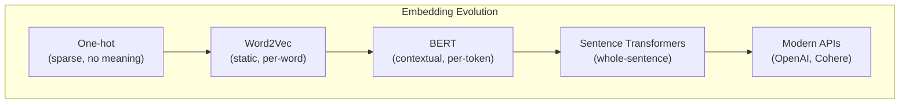
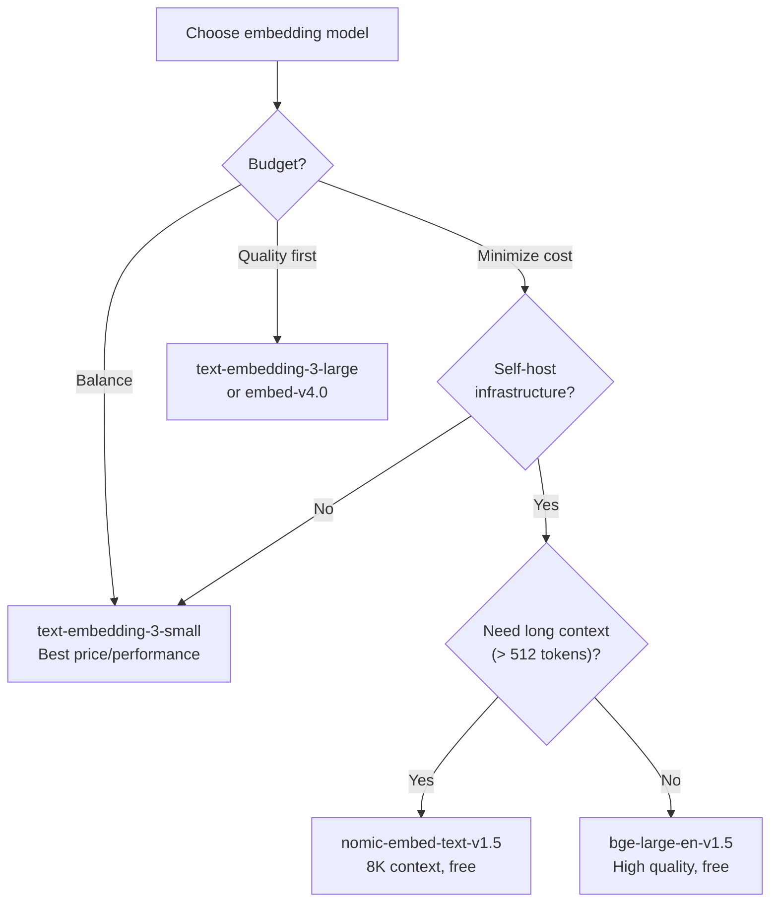
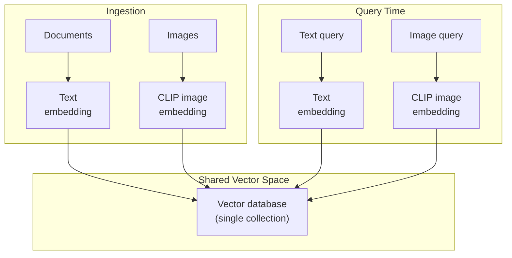

# Embeddings & Semantic Search

An embedding is a dense numerical representation of data in a continuous vector space. The magic is that *meaning is encoded in geometry*: similar concepts land near each other, and the distances between points capture semantic relationships. This single idea powers semantic search, recommendation engines, RAG pipelines, anomaly detection, clustering, and classification.

This page covers how embeddings work from first principles, which models to use, how to implement semantic search, and when and how to fine-tune embeddings for your domain.

## What Are Embeddings

### The Evolution: Sparse to Dense

**One-hot encoding** (pre-2013) represented words as sparse vectors with a single 1 and thousands of zeros. "king" and "queen" were equally distant from each other as "king" and "banana." No semantic information.

**Word2Vec** (2013) introduced the idea that words appearing in similar contexts should have similar vectors. The famous result: `king - man + woman ≈ queen`. Each word gets a dense vector of 100-300 dimensions learned by predicting context words.

**GloVe** (2014) achieved similar results by factorizing word co-occurrence matrices. Faster to train, comparable quality.

**Transformer embeddings** (2018+) revolutionized the field. Instead of one fixed vector per word, transformers produce *contextual* embeddings — the vector for "bank" changes depending on whether the sentence is about finance or rivers. BERT, and later specialized sentence transformers, generate embeddings for entire sentences or paragraphs.



### How Sentence Embeddings Work

A sentence embedding model takes arbitrary-length text and produces a fixed-size vector. Internally, it tokenizes the text, passes tokens through a transformer encoder, and pools the output (typically mean pooling over token embeddings) into a single vector.

```python
from sentence_transformers import SentenceTransformer

model = SentenceTransformer("all-MiniLM-L6-v2")

sentences = [
    "The database connection pool is exhausted",
    "Too many active connections to PostgreSQL",
    "The weather forecast calls for rain tomorrow",
]

embeddings = model.encode(sentences)
# embeddings.shape = (3, 384) — three vectors, 384 dimensions each

# Sentences 0 and 1 will be close (similar meaning)
# Sentence 2 will be far from both (different topic)
```

## Text Embedding Models

### Model Comparison

| Model | Provider | Dimensions | Max Tokens | MTEB Score | Cost | Hosting |
|-------|----------|-----------|------------|-----------|------|---------|
| `text-embedding-3-large` | OpenAI | 3072 | 8191 | Very high | $0.13/M tokens | API |
| `text-embedding-3-small` | OpenAI | 1536 | 8191 | High | $0.02/M tokens | API |
| `embed-v4.0` | Cohere | 1024 | 128k | Very high | $0.10/M tokens | API |
| `voyage-3-large` | Voyage AI | 1024 | 32k | Very high | $0.18/M tokens | API |
| `all-MiniLM-L6-v2` | SBERT | 384 | 256 | Medium | Free | Self-hosted |
| `BAAI/bge-large-en-v1.5` | BAAI | 1024 | 512 | High | Free | Self-hosted |
| `nomic-embed-text-v1.5` | Nomic | 768 | 8192 | High | Free | Self-hosted |

### Choosing the Right Model



::: tip Dimensionality vs. quality
More dimensions does not always mean better. `text-embedding-3-small` (1536d) often outperforms older models with higher dimensions because the architecture and training data matter more than vector size. OpenAI's models also support dimensionality reduction via the `dimensions` parameter — you can request 256d vectors for 6x storage savings with modest quality loss.
:::

### Using OpenAI Embeddings

```python
from openai import OpenAI

client = OpenAI()

def embed_texts(texts: list[str], model: str = "text-embedding-3-small") -> list[list[float]]:
    """Embed a batch of texts. Handles batching automatically."""
    response = client.embeddings.create(
        model=model,
        input=texts,
        dimensions=1536,  # Optional: reduce dimensionality
    )
    return [e.embedding for e in response.data]

# Batch embedding for efficiency
documents = ["doc1 text...", "doc2 text...", "doc3 text..."]
embeddings = embed_texts(documents)
```

### Using Sentence Transformers (Self-Hosted)

```python
from sentence_transformers import SentenceTransformer
import torch

# Load model (downloaded once, cached locally)
model = SentenceTransformer(
    "BAAI/bge-large-en-v1.5",
    device="cuda" if torch.cuda.is_available() else "cpu",
)

# Encode with normalization (required for cosine similarity)
embeddings = model.encode(
    sentences,
    normalize_embeddings=True,
    batch_size=64,
    show_progress_bar=True,
)
```

## Image Embeddings: CLIP

CLIP (Contrastive Language-Image Pretraining) embeds both images and text into the same vector space. This enables cross-modal search: find images using text queries, or find similar images.

```python
from transformers import CLIPProcessor, CLIPModel
from PIL import Image

model = CLIPModel.from_pretrained("openai/clip-vit-base-patch32")
processor = CLIPProcessor.from_pretrained("openai/clip-vit-base-patch32")

# Embed an image
image = Image.open("architecture-diagram.png")
image_inputs = processor(images=image, return_tensors="pt")
image_embedding = model.get_image_features(**image_inputs)

# Embed text
text_inputs = processor(text=["microservice architecture diagram"], return_tensors="pt")
text_embedding = model.get_text_features(**text_inputs)

# Compare: cosine similarity between image and text embeddings
similarity = torch.cosine_similarity(image_embedding, text_embedding)
print(f"Similarity: {similarity.item():.4f}")
```

### Multimodal Search Architecture



## Dimensionality, Normalization, and Distance Metrics

### Dimensionality

Higher dimensions capture more nuance but cost more to store and search. The practical range is 256-3072 dimensions.

| Dimensions | Storage per 1M vectors (float32) | Search Speed | Quality |
|-----------|-------------------------------|-------------|---------|
| 256 | ~1 GB | Fastest | Good enough for many tasks |
| 384 | ~1.4 GB | Fast | Good baseline |
| 768 | ~2.9 GB | Medium | Strong general purpose |
| 1536 | ~5.7 GB | Slower | High quality |
| 3072 | ~11.5 GB | Slowest | Highest quality |

### Normalization

Normalize your vectors to unit length (L2 norm = 1) before storing. This ensures that cosine similarity equals dot product, which is faster to compute:

```python
import numpy as np

def normalize(vectors: np.ndarray) -> np.ndarray:
    """L2 normalize vectors to unit length."""
    norms = np.linalg.norm(vectors, axis=1, keepdims=True)
    return vectors / norms

# After normalization:
# cosine_similarity(a, b) == dot_product(a, b)
```

::: tip Always normalize
Most embedding models return normalized vectors, but not all. Always normalize before storing. This lets you use dot product (fastest) instead of cosine similarity (requires normalization at query time).
:::

### Distance Metrics

| Metric | Formula | Range | When to Use |
|--------|---------|-------|------------|
| **Cosine similarity** | (A . B) / (‖A‖ ‖B‖) | [-1, 1] | Default for text; direction matters, magnitude does not |
| **Euclidean (L2)** | √(Σ(a_i - b_i)^2) | [0, ∞) | When magnitude carries meaning |
| **Dot product** | Σ(a_i * b_i) | (-∞, ∞) | Pre-normalized vectors; fastest computation |
| **Manhattan (L1)** | Σ|a_i - b_i| | [0, ∞) | Sparse vectors, high dimensions |

```python
import numpy as np

def cosine_similarity(a: np.ndarray, b: np.ndarray) -> float:
    return np.dot(a, b) / (np.linalg.norm(a) * np.linalg.norm(b))

def euclidean_distance(a: np.ndarray, b: np.ndarray) -> float:
    return np.linalg.norm(a - b)

def dot_product(a: np.ndarray, b: np.ndarray) -> float:
    return np.dot(a, b)

# For normalized vectors, all three are equivalent (up to monotonic transformation)
a_norm = a / np.linalg.norm(a)
b_norm = b / np.linalg.norm(b)
# cosine_similarity(a_norm, b_norm) == dot_product(a_norm, b_norm)
# euclidean_distance(a_norm, b_norm) = sqrt(2 - 2 * cosine_similarity)
```

## Semantic Search Implementation

### End-to-End Example with pgvector

```sql
-- Setup
CREATE EXTENSION vector;

CREATE TABLE articles (
    id SERIAL PRIMARY KEY,
    title TEXT NOT NULL,
    content TEXT NOT NULL,
    embedding vector(1536),
    published_at TIMESTAMPTZ,
    category TEXT
);

CREATE INDEX ON articles USING hnsw (embedding vector_cosine_ops);
```

```python
import asyncpg
from openai import OpenAI

client = OpenAI()

async def semantic_search(
    query: str,
    pool: asyncpg.Pool,
    top_k: int = 10,
    category: str | None = None,
) -> list[dict]:
    # Step 1: Embed the query
    response = client.embeddings.create(
        model="text-embedding-3-small",
        input=[query],
    )
    query_embedding = response.data[0].embedding

    # Step 2: Search with optional metadata filter
    sql = """
        SELECT id, title, content, category, published_at,
               1 - (embedding <=> $1::vector) AS similarity
        FROM articles
        WHERE ($2::text IS NULL OR category = $2)
        ORDER BY embedding <=> $1::vector
        LIMIT $3
    """

    rows = await pool.fetch(sql, str(query_embedding), category, top_k)

    return [
        {
            "id": row["id"],
            "title": row["title"],
            "content": row["content"][:200],
            "category": row["category"],
            "similarity": float(row["similarity"]),
        }
        for row in rows
    ]
```

### TypeScript Implementation

```typescript
import OpenAI from 'openai';
import { Pool } from 'pg';
import pgvector from 'pgvector/pg';

const openai = new OpenAI();
const pool = new Pool({ connectionString: process.env.DATABASE_URL });

interface SearchResult {
  id: number;
  title: string;
  similarity: number;
}

async function semanticSearch(
  query: string,
  topK: number = 10,
): Promise<SearchResult[]> {
  // Embed the query
  const embeddingResponse = await openai.embeddings.create({
    model: 'text-embedding-3-small',
    input: [query],
  });
  const queryEmbedding = embeddingResponse.data[0].embedding;

  // Search
  const result = await pool.query(
    `SELECT id, title,
            1 - (embedding <=> $1::vector) AS similarity
     FROM articles
     ORDER BY embedding <=> $1::vector
     LIMIT $2`,
    [pgvector.toSql(queryEmbedding), topK],
  );

  return result.rows;
}
```

### Improving Search Quality

| Technique | How It Helps | Complexity |
|-----------|-------------|------------|
| **Query expansion** | Rephrase the query to include synonyms and related terms | Low |
| **Hybrid search** | Combine vector similarity with BM25 keyword search | Medium |
| **Reranking** | Use a cross-encoder to reorder initial results | Medium |
| **Metadata filtering** | Pre-filter by category, date, permissions | Low |
| **HyDE** | Embed a hypothetical answer instead of the question | Medium |
| **Fine-tuning** | Train the embedding model on your domain data | High |

See [RAG Architecture](/ai-ml-engineering/rag-architecture) for detailed implementations of these techniques.

## Fine-Tuning Embeddings

When off-the-shelf embeddings do not perform well enough — typically because your domain has specialized vocabulary (medical, legal, codebase-specific) — you can fine-tune an embedding model on your data.

### When to Fine-Tune

| Signal | Action |
|--------|--------|
| Retrieval recall < 80% on your eval set | Fine-tune |
| Domain has specialized terminology not in general models | Fine-tune |
| You have < 1000 labeled pairs | Do not fine-tune; use prompt-based reranking |
| Off-the-shelf recall > 90% | Do not fine-tune; optimize retrieval pipeline instead |

### Contrastive Fine-Tuning

The most effective approach: train the model to bring similar pairs closer and push dissimilar pairs apart.

```python
from sentence_transformers import SentenceTransformer, InputExample, losses
from torch.utils.data import DataLoader

# Load base model
model = SentenceTransformer("BAAI/bge-base-en-v1.5")

# Prepare training data: (query, positive_passage, negative_passage)
train_examples = [
    InputExample(
        texts=[
            "How do I configure connection pooling?",         # query
            "Connection pool settings are in config.yaml...", # positive
            "The company was founded in 2019...",             # negative (hard)
        ]
    ),
    InputExample(
        texts=[
            "What are the retry policy defaults?",
            "The default retry count is 3 with exponential backoff...",
            "Our pricing plans include starter and enterprise...",
        ]
    ),
    # ... hundreds to thousands of examples
]

train_dataloader = DataLoader(train_examples, shuffle=True, batch_size=16)

# Triplet loss: minimize distance(query, positive), maximize distance(query, negative)
train_loss = losses.TripletLoss(model=model)

model.fit(
    train_objectives=[(train_dataloader, train_loss)],
    epochs=3,
    warmup_steps=100,
    output_path="models/finetuned-bge",
    show_progress_bar=True,
)
```

### Generating Training Data

You often do not have labeled pairs. Generate them synthetically:

```python
async def generate_training_pairs(documents: list[str]) -> list[dict]:
    """Use an LLM to generate query-document pairs for fine-tuning."""
    pairs = []

    for doc in documents:
        # Generate questions that this document answers
        questions = await llm_call(
            system="""Given a document, generate 3 diverse questions that
this document would answer. Return one question per line.
Questions should vary in specificity and phrasing.""",
            user=doc,
            model="gpt-4o-mini",
        )

        for question in questions.strip().split("\n"):
            pairs.append({
                "query": question.strip(),
                "positive": doc,
            })

    return pairs
```

### Evaluating Fine-Tuned Embeddings

```python
from sentence_transformers import evaluation

# Information Retrieval evaluator
ir_evaluator = evaluation.InformationRetrievalEvaluator(
    queries=eval_queries,        # dict: query_id -> query_text
    corpus=eval_corpus,          # dict: doc_id -> doc_text
    relevant_docs=eval_relevant, # dict: query_id -> set of relevant doc_ids
    name="domain-ir-eval",
    mrr_at_k=[10],
    ndcg_at_k=[10],
    accuracy_at_k=[1, 5, 10],
    map_at_k=[10],
)

results = ir_evaluator(model)
print(f"MRR@10: {results['domain-ir-eval_mrr@10']:.4f}")
print(f"NDCG@10: {results['domain-ir-eval_ndcg@10']:.4f}")
print(f"Recall@10: {results['domain-ir-eval_accuracy@10']:.4f}")
```

## Embedding Best Practices

| Practice | Why |
|----------|-----|
| **Use the same model for indexing and querying** | Different models produce incompatible vector spaces |
| **Normalize vectors before storing** | Enables faster dot product instead of cosine |
| **Batch embed for efficiency** | API calls have per-request overhead; batch reduces cost |
| **Version your embedding model** | Changing models requires re-embedding all data |
| **Prepend task-specific prefixes** | Some models (BGE, Nomic) expect "query:" or "search_document:" prefixes |
| **Set max token limits** | Long texts get truncated silently; chunk first |
| **Cache embeddings** | Re-embedding the same text is pure waste |

::: warning Model change = full reindex
If you switch embedding models, you must re-embed your entire dataset. Vectors from different models live in incompatible spaces. Plan for this by keeping your raw text alongside embeddings and building reindex automation.
:::

## Further Reading

- [Vector Databases](/ai-ml-engineering/vector-databases) — Where to store embeddings and how to query them efficiently
- [RAG Architecture Deep Dive](/ai-ml-engineering/rag-architecture) — Using embeddings in retrieval-augmented generation
- [LLM Integration Patterns](/ai-ml-engineering/llm-integration) — Calling embedding APIs alongside LLM APIs
- [Data Engineering](/data-engineering/) — Building ingestion pipelines for embedding computation at scale
