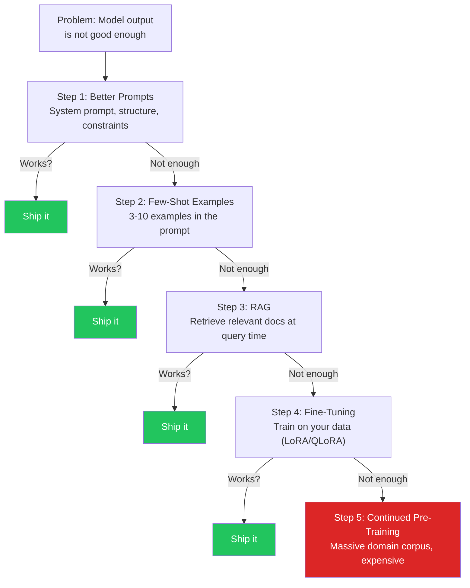
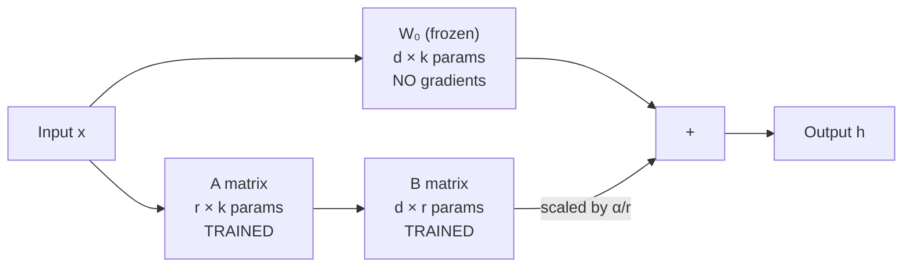
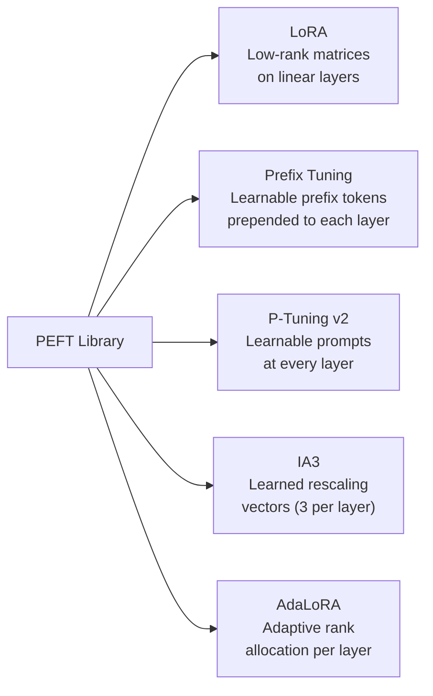
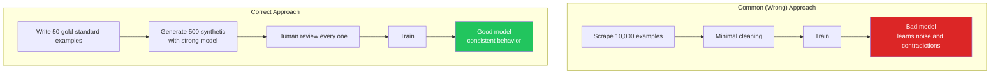
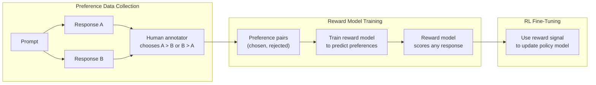

# Fine-Tuning LLMs

Fine-tuning takes a pre-trained language model and trains it further on your data so its default behavior matches what you need — the tone, the format, the domain vocabulary, the reasoning style. It changes the model's weights, not just its context window. Done well, a fine-tuned 8B model can outperform a general-purpose 70B model on your specific task at a fraction of the inference cost.

But fine-tuning is also the single most overapplied technique in production AI. Teams spend weeks curating data and thousands of dollars on GPU time when better prompts, a few-shot examples, or a RAG pipeline would have solved the problem in an afternoon. This page is a complete guide: when fine-tuning is actually the right call, the methods that make it practical (LoRA, QLoRA, PEFT adapters), how to prepare data that does not waste your training budget, how to align models with human preferences (RLHF, DPO, ORPO), how to evaluate what you built, and how to deploy it.

For foundational context on when to fine-tune vs. prompt engineer vs. use RAG, see [Model Fine-Tuning](/ai-ml-engineering/fine-tuning). This page goes deeper on every axis.

---

## When to Fine-Tune

### The Decision Ladder

Most teams jump to fine-tuning too early. The correct approach is to exhaust cheaper, faster techniques first and only escalate when you hit a ceiling that the current technique cannot break through.



### Cost-Benefit Analysis

| Approach | Time to Ship | Upfront Cost | Per-Request Cost | Flexibility | Quality Ceiling |
|----------|-------------|-------------|-----------------|-------------|----------------|
| **Prompt engineering** | Hours | $0 | Token cost only | Change anytime | Medium |
| **Few-shot examples** | Hours | $0 | Higher token cost (long prompts) | Change anytime | Medium-High |
| **RAG** | Days | Embedding pipeline build | Retrieval + token cost | Update docs anytime | High (for knowledge) |
| **Fine-tuning** | Days-weeks | $5-$5,000 (GPU/API) | Lower per request (shorter prompts) | Retrain to change | Very High (for behavior) |
| **Continued pre-training** | Weeks-months | $10,000-$1M+ | Same as fine-tuned | Retrain to change | Highest |

### Signs You Need Fine-Tuning

Fine-tuning is the right tool when:

1. **Format consistency is critical.** You need the model to always output a specific JSON schema, always follow a particular XML structure, or always produce responses in a rigid template — and prompting gets it right only 85% of the time.

2. **Domain vocabulary is specialized.** Medical, legal, financial, or scientific domains where the model needs to use precise terminology by default, not just when prompted.

3. **You are paying for a long system prompt.** If your few-shot examples consume 2,000+ tokens per request, fine-tuning can bake those patterns into weights, making every request cheaper and faster.

4. **The behavior is nuanced and hard to describe.** You can show it but not explain it. A customer support agent that matches your company's exact communication style across edge cases — easier to demonstrate with 500 examples than to write a prompt that covers every scenario.

5. **You need a small model to perform like a large one.** Fine-tuning an 8B model to match GPT-4o on your specific task so you can deploy it on cheaper hardware with lower latency.

6. **Latency is non-negotiable.** Shorter prompts after fine-tuning means fewer tokens to process, which directly reduces time-to-first-token.

### When NOT to Fine-Tune

::: danger When fine-tuning is the wrong answer
- **You need up-to-date information.** Fine-tuning bakes knowledge into weights at training time. It cannot learn new facts after training. Use RAG.
- **You have fewer than 50 high-quality examples.** You will overfit. Use few-shot prompting.
- **You need to update knowledge frequently.** Retraining costs time and money every cycle. Use RAG.
- **Prompting already works.** If a well-crafted system prompt with GPT-4o or Claude meets your quality bar, do not fine-tune. You are adding complexity for zero gain.
- **You want the model to "know" your docs.** That is retrieval, not fine-tuning. Fine-tuning changes behavior, RAG changes knowledge.
- **Your data is noisy or inconsistent.** Garbage in, garbage out. The model will learn your mistakes, not overcome them.
:::

---

## Fine-Tuning Methods

### Full Fine-Tuning

Updates every parameter in the model. All billions of weights receive gradient updates during training.

**When to use:** Almost never. Full fine-tuning requires enormous GPU memory (4-6x the model size for gradients, optimizer states, and activations), massive high-quality datasets, and dedicated infrastructure. It is reserved for organizations building foundation models or doing continued pre-training on domain-specific corpora.

**Memory requirement for a 7B model:**
- Model weights (FP16): ~14 GB
- Gradients: ~14 GB
- Optimizer states (AdamW): ~56 GB (2 moments per parameter in FP32)
- Activations: ~16 GB (batch-dependent)
- **Total: ~100-112 GB** — requires multiple A100 80GB GPUs

```python
# Full fine-tuning — straightforward but resource-hungry
from transformers import AutoModelForCausalLM, TrainingArguments, Trainer

model = AutoModelForCausalLM.from_pretrained(
    "meta-llama/Llama-3.1-8B-Instruct",
    torch_dtype=torch.bfloat16,
    device_map="auto",
)

# Every parameter is trainable
total_params = sum(p.numel() for p in model.parameters())
trainable_params = sum(p.numel() for p in model.parameters() if p.requires_grad)
print(f"Trainable: {trainable_params:,} / {total_params:,} = 100%")
# Trainable: 8,030,000,000 / 8,030,000,000 = 100%
```

### LoRA (Low-Rank Adaptation)

LoRA is the technique that made fine-tuning practical for everyone. Published by Hu et al. (2021), it exploits a key insight: the weight updates during fine-tuning have low intrinsic rank. Instead of updating the full weight matrix, you decompose the update into two small matrices.

#### How LoRA Works Mathematically

For a pre-trained weight matrix $W_0 \in \mathbb{R}^{d \times k}$, the standard fine-tuning update is:

$$W = W_0 + \Delta W$$

LoRA constrains $\Delta W$ to be low-rank by decomposing it:

$$\Delta W = B \cdot A$$

where $B \in \mathbb{R}^{d \times r}$ and $A \in \mathbb{R}^{r \times k}$, with rank $r \ll \min(d, k)$.

During the forward pass:

$$h = W_0 x + \frac{\alpha}{r} B A x$$

- $W_0$ is frozen (no gradient computation, no optimizer state)
- Only $A$ and $B$ are trained
- $\alpha$ is a scaling factor (controls the magnitude of the LoRA update)
- $\frac{\alpha}{r}$ normalizes the contribution so changing $r$ does not change the scale



#### Rank Selection Guide

The rank $r$ controls the capacity of the update. Higher rank = more expressiveness but more parameters and memory.

| Rank (r) | Trainable Params (8B model) | GPU Memory | Best For |
|----------|---------------------------|------------|----------|
| 4 | ~1.6M (0.02%) | ~5 GB with QLoRA | Simple style/format changes |
| 8 | ~3.3M (0.04%) | ~5.5 GB with QLoRA | Most single-task fine-tuning |
| 16 | ~6.5M (0.08%) | ~6 GB with QLoRA | Standard recommendation |
| 32 | ~13M (0.16%) | ~7 GB with QLoRA | Complex behavior changes |
| 64 | ~26M (0.33%) | ~9 GB with QLoRA | Multi-task or complex domains |
| 128 | ~52M (0.65%) | ~12 GB with QLoRA | Approaching full fine-tuning territory |

::: tip Practical rank selection
Start with $r = 16$ and $\alpha = 32$ (alpha = 2x rank). Only increase rank if your validation loss plateaus and you have evidence the model is underfitting. Most tasks in production use $r$ between 8 and 32.
:::

#### Which Modules to Target

LoRA adapters can be applied to any linear layer. The choice of target modules affects both quality and cost:

```python
# Conservative — attention only (fastest training)
target_modules = ["q_proj", "v_proj"]

# Recommended — all attention projections
target_modules = ["q_proj", "k_proj", "v_proj", "o_proj"]

# Aggressive — attention + MLP layers (highest quality, most params)
target_modules = [
    "q_proj", "k_proj", "v_proj", "o_proj",
    "gate_proj", "up_proj", "down_proj",
]
```

### QLoRA (Quantized LoRA)

QLoRA (Dettmers et al., 2023) combines three innovations to enable fine-tuning on consumer hardware:

1. **4-bit NormalFloat (NF4) quantization** of the base model — an information-theoretically optimal 4-bit format for normally distributed weights
2. **Double quantization** — quantizes the quantization constants to save an additional ~0.4 bits per parameter
3. **Paged optimizers** — uses NVIDIA unified memory to handle memory spikes by automatically evicting optimizer states to CPU RAM when GPU memory runs out

The base model is loaded in 4-bit precision. LoRA adapters are trained in BFloat16 or Float16 precision. Gradients flow through the quantized base model via dequantization during the forward pass.

```python
from transformers import AutoModelForCausalLM, BitsAndBytesConfig
from peft import LoraConfig, get_peft_model, prepare_model_for_kbit_training

# Step 1: 4-bit quantization configuration
bnb_config = BitsAndBytesConfig(
    load_in_4bit=True,                  # Load base model in 4-bit
    bnb_4bit_quant_type="nf4",          # NormalFloat4 (better than FP4)
    bnb_4bit_compute_dtype="bfloat16",  # Compute in BF16 during forward pass
    bnb_4bit_use_double_quant=True,     # Quantize the quantization constants
)

# Step 2: Load model in 4-bit
model = AutoModelForCausalLM.from_pretrained(
    "meta-llama/Llama-3.1-8B-Instruct",
    quantization_config=bnb_config,
    device_map="auto",
)

# Step 3: Prepare for k-bit training (freeze, cast norms to float32)
model = prepare_model_for_kbit_training(model)

# Step 4: Add LoRA adapters (trained in BF16)
lora_config = LoraConfig(
    r=16,
    lora_alpha=32,
    target_modules=[
        "q_proj", "k_proj", "v_proj", "o_proj",
        "gate_proj", "up_proj", "down_proj",
    ],
    lora_dropout=0.05,
    bias="none",
    task_type="CAUSAL_LM",
)

model = get_peft_model(model, lora_config)
model.print_trainable_parameters()
# trainable params: 6,553,600 || all params: 4,015,130,624 || trainable%: 0.16%
```

**Memory comparison for Llama 3.1 8B:**

| Method | Model Memory | Training Overhead | Total GPU Memory |
|--------|-------------|-------------------|-----------------|
| Full fine-tuning (BF16) | 16 GB | ~80 GB | ~100 GB |
| LoRA (BF16 base) | 16 GB | ~2 GB | ~18 GB |
| QLoRA (4-bit base) | 4 GB | ~2 GB | ~6 GB |

### PEFT (Parameter-Efficient Fine-Tuning) Library

PEFT is the Hugging Face library that provides a unified interface for all adapter-based fine-tuning methods. LoRA and QLoRA are the most popular, but PEFT supports several others.

### Adapter Methods Comparison



| Method | How It Works | Trainable Params | Quality | Speed | Best For |
|--------|-------------|-----------------|---------|-------|----------|
| **LoRA** | Adds low-rank matrices to linear layers | 0.1-1% | Excellent | Fast | General-purpose, most tasks |
| **Prefix Tuning** | Prepends learnable vectors to keys/values in attention | 0.1% | Good | Fast | Generation tasks (summarization, translation) |
| **P-Tuning v2** | Adds learnable prompt tokens at every layer | 0.1-3% | Good | Moderate | NLU tasks, classification |
| **IA3** (Infused Adapter by Inhibiting and Amplifying Inner Activations) | Learns three rescaling vectors per layer (keys, values, FFN) | 0.01% | Good | Fastest | Few-shot learning, smallest adapter |
| **AdaLoRA** | LoRA with adaptive rank — allocates more rank to important layers | 0.1-1% | Excellent | Moderate | When you want optimized rank distribution |

```python
# IA3 configuration — extremely parameter-efficient
from peft import IA3Config

ia3_config = IA3Config(
    target_modules=["q_proj", "v_proj", "k_proj", "o_proj", "down_proj"],
    feedforward_modules=["down_proj"],
    task_type="CAUSAL_LM",
)

# Prefix Tuning configuration
from peft import PrefixTuningConfig

prefix_config = PrefixTuningConfig(
    num_virtual_tokens=20,       # Number of learnable prefix tokens
    task_type="CAUSAL_LM",
    prefix_projection=True,      # Use a MLP to project prefix embeddings
    encoder_hidden_size=1024,
)

# AdaLoRA — adaptive rank allocation
from peft import AdaLoraConfig

adalora_config = AdaLoraConfig(
    init_r=12,            # Initial rank for all layers
    target_r=4,           # Target average rank after pruning
    beta1=0.85,
    beta2=0.85,
    tinit=200,            # Steps before starting rank pruning
    tfinal=1000,          # Steps to complete rank pruning
    deltaT=10,            # Pruning interval
    lora_alpha=32,
    lora_dropout=0.05,
    task_type="CAUSAL_LM",
    target_modules=["q_proj", "v_proj"],
)
```

::: warning When to use which adapter
**Default to LoRA/QLoRA.** It has the best quality-to-cost ratio, the most community support, the most tooling, and works well across all task types. Use other methods only when you have a specific reason: IA3 when you need the absolute smallest adapter, Prefix Tuning when you are doing sequence-to-sequence generation, AdaLoRA when you want automated rank optimization.
:::

---

## Data Preparation

Data quality determines whether your fine-tuned model is useful or a waste of GPU time. A small, carefully curated dataset of 200 examples will outperform a noisy dataset of 10,000 scraped examples every time.

### Dataset Formats

There are three primary formats, depending on the training approach.

#### Instruction Format

For supervised fine-tuning (SFT) on instruction-following tasks:

```json
{
  "instruction": "Convert this SQL query to use a CTE instead of a subquery",
  "input": "SELECT * FROM orders WHERE customer_id IN (SELECT id FROM customers WHERE country = 'US')",
  "output": "WITH us_customers AS (\n  SELECT id FROM customers WHERE country = 'US'\n)\nSELECT o.*\nFROM orders o\nJOIN us_customers uc ON o.customer_id = uc.id;"
}
```

#### Chat / Conversation Format

The most common format for modern LLMs. Used by OpenAI, Hugging Face TRL, and most training frameworks:

```json
{
  "messages": [
    {
      "role": "system",
      "content": "You are a senior PostgreSQL DBA. Always explain your reasoning before writing SQL."
    },
    {
      "role": "user",
      "content": "Our users table has 50M rows. How do I find users who signed up in the last 7 days efficiently?"
    },
    {
      "role": "assistant",
      "content": "For a table with 50M rows, a sequential scan would be extremely slow. Here's the approach:\n\n1. **Ensure there's an index on the signup column:**\n```sql\nCREATE INDEX CONCURRENTLY idx_users_created_at ON users (created_at);\n```\n\n2. **Use the index with a range scan:**\n```sql\nSELECT id, email, created_at\nFROM users\nWHERE created_at >= NOW() - INTERVAL '7 days'\nORDER BY created_at DESC;\n```\n\nThe `>=` operator with a timestamp column allows PostgreSQL to use the B-tree index for a range scan instead of reading all 50M rows. `CONCURRENTLY` prevents locking the table during index creation."
    }
  ]
}
```

#### Completion Format

For simpler tasks — the model learns to complete the text:

```json
{
  "prompt": "Translate English to SQL:\nFind all orders over $100 from the last month\n\nSQL:",
  "completion": "SELECT * FROM orders WHERE amount > 100 AND order_date >= DATE_SUB(CURDATE(), INTERVAL 1 MONTH);"
}
```

### Data Quality Over Data Quantity



**Rules for data quality:**

1. **Every example should be an example you would be proud to show a customer.** If the assistant response in your training data is mediocre, the model will be mediocre.
2. **Consistency beats diversity.** If some examples use "let me explain" and others jump straight to the answer, the model will do both randomly. Pick one style and enforce it.
3. **Remove duplicates.** Near-duplicate examples waste training budget and can bias the model toward those patterns.
4. **Balance your categories.** If 80% of your data is about topic A and 20% is topic B, the model will be much better at topic A.
5. **Include edge cases.** What should the model say when the question is ambiguous? When it does not know? When the user asks something outside scope? Train for these explicitly.

### Synthetic Data Generation

Use a stronger model to generate training data for a smaller model. This is the most practical approach for most teams.

```python
from openai import OpenAI
import json

client = OpenAI()

GENERATION_PROMPT = """You are generating training data for a PostgreSQL expert assistant.

Generate a realistic user question about PostgreSQL and a high-quality expert response.
The response should:
1. Explain the reasoning before showing SQL
2. Include performance considerations
3. Use proper PostgreSQL syntax (not MySQL/MSSQL)
4. Be concise but complete

Topic: {topic}
Difficulty: {difficulty}

Respond in this exact JSON format:
{{"user": "the user question", "assistant": "the expert response"}}"""

TOPICS = [
    "indexing strategies", "query optimization", "partitioning",
    "connection pooling", "replication", "backup and recovery",
    "JSON/JSONB operations", "CTEs and window functions",
    "lock contention", "vacuum and autovacuum tuning",
]

def generate_training_examples(n_per_topic: int = 20) -> list[dict]:
    examples = []

    for topic in TOPICS:
        for difficulty in ["beginner", "intermediate", "advanced"]:
            for _ in range(n_per_topic // 3):
                response = client.chat.completions.create(
                    model="gpt-4o",
                    messages=[{
                        "role": "user",
                        "content": GENERATION_PROMPT.format(
                            topic=topic, difficulty=difficulty
                        ),
                    }],
                    temperature=0.9,
                    response_format={"type": "json_object"},
                )

                data = json.loads(response.choices[0].message.content)

                examples.append({
                    "messages": [
                        {"role": "system", "content": "You are a senior PostgreSQL DBA."},
                        {"role": "user", "content": data["user"]},
                        {"role": "assistant", "content": data["assistant"]},
                    ]
                })

    return examples

# Generate and save
examples = generate_training_examples(n_per_topic=20)
print(f"Generated {len(examples)} examples")

# Human review step — CRITICAL
# Export for review, then import the approved subset
with open("synthetic_data_for_review.jsonl", "w") as f:
    for ex in examples:
        f.write(json.dumps(ex) + "\n")
```

::: warning Always review synthetic data
Synthetic data generation with GPT-4o or Claude is powerful, but never skip human review. Strong models produce plausible-sounding but incorrect outputs — especially for domain-specific tasks. Have a domain expert review every example before training.
:::

### Data Cleaning and Deduplication

```python
import hashlib
from difflib import SequenceMatcher

def deduplicate_examples(examples: list[dict], threshold: float = 0.85) -> list[dict]:
    """Remove exact and near-duplicate examples."""
    seen_hashes = set()
    unique = []

    for ex in examples:
        # Extract the user message for comparison
        user_msg = next(
            m["content"] for m in ex["messages"] if m["role"] == "user"
        )

        # Exact dedup via hash
        msg_hash = hashlib.md5(user_msg.encode()).hexdigest()
        if msg_hash in seen_hashes:
            continue
        seen_hashes.add(msg_hash)

        # Near-duplicate detection via sequence similarity
        is_duplicate = False
        for existing in unique:
            existing_msg = next(
                m["content"] for m in existing["messages"] if m["role"] == "user"
            )
            similarity = SequenceMatcher(None, user_msg, existing_msg).ratio()
            if similarity > threshold:
                is_duplicate = True
                break

        if not is_duplicate:
            unique.append(ex)

    print(f"Removed {len(examples) - len(unique)} duplicates")
    return unique


def validate_examples(examples: list[dict]) -> list[dict]:
    """Validate format and filter out bad examples."""
    valid = []
    errors = []

    for i, ex in enumerate(examples):
        # Check structure
        if "messages" not in ex:
            errors.append(f"Example {i}: missing 'messages' key")
            continue

        messages = ex["messages"]
        roles = [m.get("role") for m in messages]

        # Must have at least user + assistant
        if "user" not in roles or "assistant" not in roles:
            errors.append(f"Example {i}: missing user or assistant role")
            continue

        # Check for empty content
        if any(not m.get("content", "").strip() for m in messages):
            errors.append(f"Example {i}: empty content in a message")
            continue

        # Check assistant response length (too short = low quality)
        assistant_msgs = [m for m in messages if m["role"] == "assistant"]
        if any(len(m["content"]) < 20 for m in assistant_msgs):
            errors.append(f"Example {i}: assistant response too short")
            continue

        valid.append(ex)

    if errors:
        print(f"Found {len(errors)} invalid examples:")
        for err in errors[:10]:
            print(f"  {err}")

    return valid
```

### Train/Validation Split Strategies

```python
import random
from collections import defaultdict

def stratified_split(
    examples: list[dict],
    val_ratio: float = 0.1,
    stratify_key: str = None,
) -> tuple[list[dict], list[dict]]:
    """Split data with optional stratification by a metadata key."""

    if stratify_key:
        # Group examples by the stratification key
        groups = defaultdict(list)
        for ex in examples:
            key = ex.get("metadata", {}).get(stratify_key, "default")
            groups[key].append(ex)

        train, val = [], []
        for key, group in groups.items():
            random.shuffle(group)
            split_idx = max(1, int(len(group) * val_ratio))
            val.extend(group[:split_idx])
            train.extend(group[split_idx:])
    else:
        # Simple random split
        shuffled = examples.copy()
        random.shuffle(shuffled)
        split_idx = int(len(shuffled) * val_ratio)
        val = shuffled[:split_idx]
        train = shuffled[split_idx:]

    print(f"Train: {len(train)}, Validation: {len(val)}")
    return train, val

# Usage — stratify by topic to ensure each topic is in both splits
train, val = stratified_split(examples, val_ratio=0.15, stratify_key="topic")
```

---

## Training with Hugging Face

### Full Training Script

This is a complete, production-ready training script using Transformers, PEFT, and TRL for QLoRA supervised fine-tuning:

```python
# train.py — Full QLoRA fine-tuning script
import os
import torch
from datasets import load_dataset
from transformers import (
    AutoModelForCausalLM,
    AutoTokenizer,
    BitsAndBytesConfig,
    TrainingArguments,
)
from peft import (
    LoraConfig,
    get_peft_model,
    prepare_model_for_kbit_training,
)
from trl import SFTTrainer, SFTConfig
import wandb

# ========== Configuration ==========
MODEL_NAME = "meta-llama/Llama-3.1-8B-Instruct"
OUTPUT_DIR = "./output/sql-expert-v1"
TRAIN_FILE = "./data/train.jsonl"
VAL_FILE = "./data/val.jsonl"
MAX_SEQ_LENGTH = 2048
WANDB_PROJECT = "sql-expert-finetune"

# ========== Initialize W&B ==========
wandb.init(project=WANDB_PROJECT, name="qlora-r16-lr2e4")

# ========== Load Tokenizer ==========
tokenizer = AutoTokenizer.from_pretrained(MODEL_NAME)
tokenizer.pad_token = tokenizer.eos_token
tokenizer.padding_side = "right"  # Required for SFTTrainer

# ========== Load Model with 4-bit Quantization ==========
bnb_config = BitsAndBytesConfig(
    load_in_4bit=True,
    bnb_4bit_quant_type="nf4",
    bnb_4bit_compute_dtype=torch.bfloat16,
    bnb_4bit_use_double_quant=True,
)

model = AutoModelForCausalLM.from_pretrained(
    MODEL_NAME,
    quantization_config=bnb_config,
    device_map="auto",
    attn_implementation="flash_attention_2",  # Faster training if supported
)

model = prepare_model_for_kbit_training(model)

# ========== Configure LoRA ==========
lora_config = LoraConfig(
    r=16,
    lora_alpha=32,
    target_modules=[
        "q_proj", "k_proj", "v_proj", "o_proj",
        "gate_proj", "up_proj", "down_proj",
    ],
    lora_dropout=0.05,
    bias="none",
    task_type="CAUSAL_LM",
)

model = get_peft_model(model, lora_config)
model.print_trainable_parameters()

# ========== Load Dataset ==========
dataset = load_dataset("json", data_files={
    "train": TRAIN_FILE,
    "validation": VAL_FILE,
})

# ========== Training Arguments ==========
training_args = SFTConfig(
    output_dir=OUTPUT_DIR,

    # Epochs and batching
    num_train_epochs=3,
    per_device_train_batch_size=4,
    per_device_eval_batch_size=4,
    gradient_accumulation_steps=4,  # Effective batch size = 4 * 4 = 16

    # Learning rate schedule
    learning_rate=2e-4,
    lr_scheduler_type="cosine",
    warmup_ratio=0.1,
    weight_decay=0.01,

    # Precision
    bf16=True,    # Use BF16 on Ampere+ GPUs
    # fp16=True,  # Use FP16 on older GPUs

    # Logging
    logging_steps=10,
    logging_first_step=True,
    report_to="wandb",

    # Evaluation
    eval_strategy="steps",
    eval_steps=50,

    # Saving
    save_strategy="steps",
    save_steps=100,
    save_total_limit=3,
    load_best_model_at_end=True,
    metric_for_best_model="eval_loss",

    # SFT-specific
    max_seq_length=MAX_SEQ_LENGTH,
    packing=True,  # Pack multiple short examples into one sequence

    # Memory optimization
    gradient_checkpointing=True,
    optim="paged_adamw_8bit",  # 8-bit AdamW for memory savings
)

# ========== Train ==========
trainer = SFTTrainer(
    model=model,
    args=training_args,
    train_dataset=dataset["train"],
    eval_dataset=dataset["validation"],
    processing_class=tokenizer,
)

trainer.train()

# ========== Save ==========
trainer.save_model(os.path.join(OUTPUT_DIR, "final"))
tokenizer.save_pretrained(os.path.join(OUTPUT_DIR, "final"))

wandb.finish()
print(f"Model saved to {OUTPUT_DIR}/final")
```

### SFTTrainer Deep Dive

`SFTTrainer` from the TRL library extends the standard Hugging Face `Trainer` with features specifically designed for supervised fine-tuning of LLMs:

- **Chat template handling.** Automatically applies the model's chat template to convert the `messages` format into the correct token sequence.
- **Packing.** Concatenates multiple short examples into a single sequence of `max_seq_length` to avoid wasting compute on padding tokens.
- **Response-only loss.** Optionally computes loss only on the assistant tokens, not on the user/system tokens (the model does not need to learn to generate the user's questions).
- **Collator.** Handles the conversation format natively without custom preprocessing.

```python
# Using response-only training (loss on assistant tokens only)
from trl import DataCollatorForCompletionOnlyLM

# Define the response template (varies by model)
response_template = "<|start_header_id|>assistant<|end_header_id|>"

collator = DataCollatorForCompletionOnlyLM(
    response_template=response_template,
    tokenizer=tokenizer,
)

trainer = SFTTrainer(
    model=model,
    args=training_args,
    train_dataset=dataset["train"],
    eval_dataset=dataset["validation"],
    processing_class=tokenizer,
    data_collator=collator,
)
```

### Hyperparameter Guide

| Parameter | Recommended Range | Default Start | Notes |
|-----------|------------------|---------------|-------|
| **Learning rate** | 1e-5 to 3e-4 | 2e-4 | Lower for larger models; higher for QLoRA |
| **Batch size** | 4-32 (effective) | 16 | Use gradient accumulation to simulate larger batches |
| **Epochs** | 1-5 | 3 | More data = fewer epochs needed; watch for overfitting |
| **LoRA rank (r)** | 4-64 | 16 | Higher rank for complex tasks |
| **LoRA alpha** | 2x rank | 32 | Scaling factor; 2x rank is a reliable default |
| **LoRA dropout** | 0.0-0.1 | 0.05 | Regularization; use 0 for very small datasets |
| **Weight decay** | 0.0-0.1 | 0.01 | Regularization; 0.01 is safe for most runs |
| **Warmup ratio** | 0.03-0.1 | 0.1 | Fraction of total steps with linearly increasing LR |
| **LR scheduler** | cosine, linear | cosine | Cosine usually outperforms linear |
| **Max seq length** | 512-4096 | 2048 | Must cover your longest example |

### Gradient Accumulation and Mixed Precision

**Gradient accumulation** simulates larger batch sizes without requiring more GPU memory:

```
Effective batch size = per_device_batch_size * gradient_accumulation_steps * num_GPUs

Example:
  per_device_train_batch_size = 4
  gradient_accumulation_steps = 4
  num_GPUs = 1
  Effective batch size = 4 * 4 * 1 = 16
```

**Mixed precision** (BF16 or FP16) halves memory usage for activations and speeds up computation on modern GPUs:

- **BF16** (Brain Float 16): Same dynamic range as FP32, less precision. Preferred on Ampere+ GPUs (A100, RTX 3090+, H100).
- **FP16** (Half precision): Smaller dynamic range, needs loss scaling to avoid underflow. Use on older GPUs (V100, T4).

**Gradient checkpointing** trades compute for memory by recomputing activations during the backward pass instead of storing them:

```python
# Memory optimization stack (combine all three)
training_args = TrainingArguments(
    gradient_accumulation_steps=4,   # Simulate batch size 16
    bf16=True,                       # Half-precision compute
    gradient_checkpointing=True,     # Recompute activations (saves ~40% memory)
    optim="paged_adamw_8bit",        # 8-bit optimizer states
)
```

### Monitoring with Weights & Biases

```python
import wandb

# Initialize at the start of training
wandb.init(
    project="llm-fine-tuning",
    name="qlora-llama3-8b-sql-expert",
    config={
        "model": "meta-llama/Llama-3.1-8B-Instruct",
        "method": "QLoRA",
        "lora_r": 16,
        "lora_alpha": 32,
        "learning_rate": 2e-4,
        "epochs": 3,
        "effective_batch_size": 16,
        "dataset_size": len(dataset["train"]),
    },
)

# Key metrics to watch in the W&B dashboard:
# 1. train/loss — should decrease smoothly
# 2. eval/loss — should decrease, then plateau (overfitting if it rises)
# 3. train/learning_rate — verify warmup + cosine schedule
# 4. train/grad_norm — spikes indicate instability (lower LR)
```

What to look for in the training curves:

| Signal | Meaning | Action |
|--------|---------|--------|
| Train loss decreasing, eval loss decreasing | Healthy training | Continue |
| Train loss decreasing, eval loss increasing | Overfitting | Stop early, reduce epochs, add data |
| Train loss flat / noisy | Learning rate too low or data issues | Increase LR, check data quality |
| Loss spikes or NaN | Numerical instability | Lower LR, check for bad examples |
| Grad norm consistently high | Gradients exploding | Add gradient clipping (`max_grad_norm=1.0`) |

---

## RLHF and Alignment

Supervised fine-tuning teaches the model what to say. Alignment teaches it what not to say, how to be helpful without being harmful, and how to follow human preferences when there is no single "correct" answer.

### Reward Modeling

The first step in RLHF is training a reward model that scores any given response based on human preferences. Humans compare pairs of responses and choose which is better; the reward model learns to predict those preferences.



```python
# Preference data format for reward modeling
preference_example = {
    "prompt": "Explain quantum computing to a 10-year-old",
    "chosen": "Imagine you have a magic coin that can be heads AND tails at the same time...",
    "rejected": "Quantum computing leverages superposition of qubits in Hilbert space to...",
}
```

### PPO (Proximal Policy Optimization)

PPO is the RL algorithm used in the original RLHF pipeline (InstructGPT, ChatGPT). The policy model (your LLM) generates responses, the reward model scores them, and PPO updates the policy to generate higher-scoring responses.

**Why PPO is hard in practice:**

1. **Four models in memory:** policy model, reference model, reward model, value model
2. **Training instability:** RL is notoriously unstable; hyperparameters require careful tuning
3. **Reward hacking:** the model finds ways to get high reward scores without being genuinely helpful
4. **Expensive:** 4x the memory of SFT, plus the reward model training step

```python
# PPO fine-tuning with TRL (simplified)
from trl import PPOTrainer, PPOConfig, AutoModelForCausalLMWithValueHead

# Load policy model with value head
model = AutoModelForCausalLMWithValueHead.from_pretrained(
    "your-sft-model",
    device_map="auto",
)

# PPO configuration
ppo_config = PPOConfig(
    learning_rate=1e-5,
    batch_size=16,
    mini_batch_size=4,
    gradient_accumulation_steps=4,
    ppo_epochs=4,          # PPO update epochs per batch
    kl_penalty="kl",       # KL divergence penalty type
    init_kl_coef=0.2,      # Initial KL penalty coefficient
    target_kl=6.0,         # Target KL divergence
    cliprange=0.2,         # PPO clipping range
)

ppo_trainer = PPOTrainer(
    model=model,
    config=ppo_config,
    tokenizer=tokenizer,
    dataset=prompt_dataset,
)

# Training loop
for batch in ppo_trainer.dataloader:
    # Generate responses
    query_tensors = batch["input_ids"]
    response_tensors = ppo_trainer.generate(query_tensors, max_new_tokens=256)

    # Score with reward model
    rewards = reward_model.score(query_tensors, response_tensors)

    # PPO update
    stats = ppo_trainer.step(query_tensors, response_tensors, rewards)
```

### DPO (Direct Preference Optimization)

DPO (Rafailov et al., 2023) eliminates the reward model entirely. Instead of training a reward model and then doing RL, DPO directly optimizes the policy model using preference pairs. It reformulates the RLHF objective into a simple classification loss.

**Why DPO is preferred:**
- No reward model needed (half the models in memory)
- No RL instability (standard cross-entropy loss)
- Simpler to implement and tune
- Comparable or better results than PPO on most benchmarks

```python
# DPO training with TRL
from trl import DPOTrainer, DPOConfig
from datasets import load_dataset

# Load preference dataset
# Format: {"prompt": "...", "chosen": "...", "rejected": "..."}
dataset = load_dataset("json", data_files="preferences.jsonl")

dpo_config = DPOConfig(
    output_dir="./output/dpo-model",
    num_train_epochs=1,
    per_device_train_batch_size=4,
    gradient_accumulation_steps=4,
    learning_rate=5e-7,        # Lower LR than SFT — you are refining, not training
    beta=0.1,                  # KL penalty strength (higher = stay closer to reference)
    loss_type="sigmoid",       # Standard DPO loss
    bf16=True,
    logging_steps=10,
    eval_strategy="steps",
    eval_steps=50,
    warmup_ratio=0.1,
    gradient_checkpointing=True,
    report_to="wandb",
)

# DPO needs a reference model (the SFT model before alignment)
dpo_trainer = DPOTrainer(
    model=model,               # The model to align
    ref_model=ref_model,       # The SFT model (frozen reference)
    args=dpo_config,
    train_dataset=dataset["train"],
    eval_dataset=dataset["validation"],
    processing_class=tokenizer,
)

dpo_trainer.train()
```

### ORPO (Odds Ratio Preference Optimization)

ORPO (Hong et al., 2024) goes further than DPO by combining SFT and alignment into a single training step. It does not need a reference model — it uses the odds ratio of generating the chosen vs. rejected response as the preference signal.

**Why ORPO is gaining traction:**
- Single training stage (no separate SFT then DPO)
- No reference model needed (less memory)
- Simpler pipeline end-to-end

```python
from trl import ORPOTrainer, ORPOConfig

orpo_config = ORPOConfig(
    output_dir="./output/orpo-model",
    num_train_epochs=3,
    per_device_train_batch_size=4,
    gradient_accumulation_steps=4,
    learning_rate=5e-6,
    beta=0.1,                  # Weight of the odds ratio loss
    bf16=True,
    logging_steps=10,
    eval_strategy="steps",
    eval_steps=50,
    gradient_checkpointing=True,
)

orpo_trainer = ORPOTrainer(
    model=model,
    args=orpo_config,
    train_dataset=dataset["train"],
    eval_dataset=dataset["validation"],
    processing_class=tokenizer,
)

orpo_trainer.train()
```

### Alignment Methods Comparison

| Method | Models in Memory | Stability | Complexity | Quality | Best For |
|--------|-----------------|-----------|-----------|---------|----------|
| **PPO** | 4 (policy + ref + reward + value) | Low | High | Excellent | Maximum control, research |
| **DPO** | 2 (policy + reference) | High | Low | Excellent | Production alignment, most teams |
| **ORPO** | 1 (policy only) | High | Lowest | Very good | Memory-constrained, single-stage |
| **KTO** | 2 (policy + reference) | High | Low | Good | When you only have thumbs up/down |

### Constitutional AI Approach

Constitutional AI (Anthropic, 2022) automates the alignment process by giving the model a set of principles ("constitution") and having it self-critique and revise its own outputs.

The pipeline:
1. **Generate.** The model produces a response to a potentially harmful prompt.
2. **Critique.** The model critiques its own response against each principle in the constitution.
3. **Revise.** The model revises its response based on the critique.
4. **Train.** Use the (original, revised) pairs as preference data for RLHF/DPO.

```python
# Constitutional AI self-critique example
CONSTITUTION = [
    "Choose the response that is most helpful while being honest and harmless.",
    "Choose the response that does not encourage illegal or dangerous activities.",
    "Choose the response that acknowledges uncertainty when appropriate.",
    "Choose the response that is respectful and does not use offensive language.",
]

def constitutional_revise(model, prompt: str, response: str, principles: list[str]) -> str:
    """Have the model self-critique and revise based on constitutional principles."""
    critique_prompt = f"""Here is a prompt and response:

Prompt: {prompt}
Response: {response}

Please critique this response against the following principles:
{chr(10).join(f'- {p}' for p in principles)}

Identify any violations and explain how the response could be improved."""

    critique = model.generate(critique_prompt)

    revision_prompt = f"""Original response: {response}

Critique: {critique}

Please write an improved response that addresses the critique while remaining helpful."""

    revised = model.generate(revision_prompt)
    return revised
```

---

## Evaluation

### Standard Benchmarks

| Benchmark | What It Measures | Format | Examples |
|-----------|-----------------|--------|----------|
| **MMLU** | General knowledge across 57 subjects | Multiple choice | 14,042 |
| **HumanEval** | Code generation correctness | Code completion | 164 |
| **MT-Bench** | Multi-turn conversation quality | Open-ended, GPT-4 judged | 80 (multi-turn) |
| **AlpacaEval** | Instruction following quality | Open-ended, GPT-4 judged | 805 |
| **GSM8K** | Math reasoning | Grade school math problems | 1,319 |
| **TruthfulQA** | Factual accuracy / hallucination | Multiple choice + generation | 817 |
| **IFEval** | Instruction following precision | Verifiable instructions | 541 |

```python
# Running MMLU with lm-evaluation-harness
# pip install lm-eval
"""
lm_eval --model hf \
  --model_args pretrained=./output/sql-expert-merged \
  --tasks mmlu \
  --batch_size 8 \
  --output_path ./eval_results/mmlu
"""

# Running HumanEval
"""
lm_eval --model hf \
  --model_args pretrained=./output/sql-expert-merged \
  --tasks humaneval \
  --batch_size 1 \
  --output_path ./eval_results/humaneval
"""
```

### Custom Evaluation Datasets

Standard benchmarks tell you if your model still has general capabilities. But you need custom evaluation sets to measure whether the fine-tuned model actually does what you trained it to do.

```python
import json
from openai import OpenAI

client = OpenAI()

def evaluate_with_llm_judge(
    model_outputs: list[dict],
    judge_model: str = "gpt-4o",
    criteria: str = "accuracy, helpfulness, formatting",
) -> list[dict]:
    """Use a strong model as a judge to evaluate fine-tuned model outputs."""
    results = []

    for item in model_outputs:
        judge_prompt = f"""You are evaluating an AI assistant's response.

User question: {item["input"]}
Expected answer: {item["expected"]}
Model's answer: {item["predicted"]}

Rate the model's answer on these criteria: {criteria}

For each criterion, provide a score from 1-5 and a brief justification.
Then provide an overall score from 1-5.

Respond in JSON: {{"criteria_scores": {{"criterion": {{"score": N, "reason": "..."}}}}, "overall_score": N, "overall_reason": "..."}}"""

        response = client.chat.completions.create(
            model=judge_model,
            messages=[{"role": "user", "content": judge_prompt}],
            response_format={"type": "json_object"},
            temperature=0,
        )

        judgment = json.loads(response.choices[0].message.content)
        results.append({
            **item,
            "judgment": judgment,
        })

    # Aggregate
    overall_scores = [r["judgment"]["overall_score"] for r in results]
    avg_score = sum(overall_scores) / len(overall_scores)
    print(f"Average score: {avg_score:.2f}/5.0")
    print(f"Score distribution: {dict(sorted(
        {s: overall_scores.count(s) for s in set(overall_scores)}.items()
    ))}")

    return results
```

### Human Evaluation Framework

LLM judges are useful for iteration speed, but human evaluation is the gold standard for measuring real-world quality.

**A/B evaluation protocol:**

1. **Prepare a blind test set.** 100+ prompts representative of production traffic.
2. **Generate responses from both models.** Base model and fine-tuned model.
3. **Randomize and anonymize.** Evaluators should not know which model produced which response.
4. **Define rubric.** Score each response on a clear rubric (e.g., 1-5 for accuracy, helpfulness, safety).
5. **Multiple evaluators.** At least 2 evaluators per example to measure inter-annotator agreement.
6. **Compute win rates.** What percentage of the time does the fine-tuned model win, lose, or tie?

```python
# Create evaluation sheets for human annotators
import csv
import random

def create_evaluation_sheet(
    base_responses: list[dict],
    ft_responses: list[dict],
    output_file: str = "evaluation_sheet.csv",
):
    """Create a randomized, anonymized evaluation sheet."""
    rows = []

    for base, ft in zip(base_responses, ft_responses):
        assert base["input"] == ft["input"], "Inputs must match"

        # Randomly assign Model A and Model B
        if random.random() > 0.5:
            model_a, model_b = base["output"], ft["output"]
            mapping = "A=base, B=finetuned"
        else:
            model_a, model_b = ft["output"], base["output"]
            mapping = "A=finetuned, B=base"

        rows.append({
            "id": base["id"],
            "input": base["input"],
            "response_a": model_a,
            "response_b": model_b,
            "accuracy_a": "",      # Evaluator fills in 1-5
            "accuracy_b": "",
            "helpfulness_a": "",
            "helpfulness_b": "",
            "preference": "",      # A, B, or Tie
            "_mapping": mapping,   # Hidden from evaluator, used for analysis
        })

    random.shuffle(rows)

    with open(output_file, "w", newline="") as f:
        writer = csv.DictWriter(f, fieldnames=rows[0].keys())
        writer.writeheader()
        writer.writerows(rows)

    print(f"Created evaluation sheet with {len(rows)} comparisons")
```

### Preventing Catastrophic Forgetting

When you fine-tune a model on a narrow dataset, it can lose its general capabilities. LoRA mitigates this by keeping base weights frozen, but it is not a guarantee.

**Mitigation strategies:**

| Strategy | How | Effort | Effectiveness |
|----------|-----|--------|--------------|
| **Use LoRA/QLoRA** | Frozen base weights, only adapters trained | Free | High |
| **Mix in general data** | Add 10-20% general instruction data to training mix | Low | High |
| **Low learning rate** | Use 1e-5 to 2e-4 for gentle updates | Free | Medium |
| **Few epochs** | Train 1-3 epochs, not 10 | Free | Medium |
| **Evaluate broadly** | Test on MMLU + your task-specific eval | Medium | Detection, not prevention |
| **Elastic Weight Consolidation** | Regularize important weights | High | High but complex |

### Overfitting Detection

```python
# After training, compare the model on general benchmarks
def check_forgetting(base_model_path: str, ft_model_path: str, eval_prompts: list[str]):
    """Compare base and fine-tuned model on general-purpose prompts."""
    from transformers import pipeline

    base_pipe = pipeline("text-generation", model=base_model_path, device_map="auto")
    ft_pipe = pipeline("text-generation", model=ft_model_path, device_map="auto")

    print("=" * 60)
    for prompt in eval_prompts:
        base_out = base_pipe(prompt, max_new_tokens=200)[0]["generated_text"]
        ft_out = ft_pipe(prompt, max_new_tokens=200)[0]["generated_text"]

        print(f"Prompt: {prompt}")
        print(f"Base: {base_out[len(prompt):][:100]}...")
        print(f"Fine-tuned: {ft_out[len(prompt):][:100]}...")
        print("-" * 60)

# General-purpose test prompts (should work well on any model)
FORGETTING_PROBES = [
    "Explain the concept of recursion to a beginner programmer.",
    "What are the pros and cons of microservices architecture?",
    "Write a Python function to reverse a linked list.",
    "Summarize the key ideas of the Agile methodology.",
    "What is the difference between TCP and UDP?",
]
```

::: danger The overfitting curve
Watch for this pattern in your W&B dashboard: training loss keeps decreasing while validation loss starts increasing. This is classic overfitting — the model is memorizing your training data instead of learning generalizable patterns. Stop training when the validation loss stops improving for multiple evaluation steps.
:::

---

## Deployment

### Merging LoRA Adapters into Base Model

For production deployment, merge the LoRA adapter weights into the base model. This eliminates the runtime overhead of adapter application and produces a single model file.

```python
from peft import PeftModel, AutoPeftModelForCausalLM
from transformers import AutoModelForCausalLM, AutoTokenizer

# Method 1: Load and merge
base_model = AutoModelForCausalLM.from_pretrained(
    "meta-llama/Llama-3.1-8B-Instruct",
    torch_dtype=torch.bfloat16,
    device_map="auto",
)

model = PeftModel.from_pretrained(base_model, "./output/sql-expert-v1/final")
model = model.merge_and_unload()

# Save the merged model
model.save_pretrained("./output/sql-expert-merged")
tokenizer = AutoTokenizer.from_pretrained("meta-llama/Llama-3.1-8B-Instruct")
tokenizer.save_pretrained("./output/sql-expert-merged")

# Method 2: One-step with AutoPeftModel (simpler)
model = AutoPeftModelForCausalLM.from_pretrained(
    "./output/sql-expert-v1/final",
    torch_dtype=torch.bfloat16,
    device_map="auto",
)
merged_model = model.merge_and_unload()
merged_model.save_pretrained("./output/sql-expert-merged")
```

### Quantizing the Fine-Tuned Model

After merging, quantize the model for efficient inference. This is separate from the QLoRA training-time quantization — this is inference-time quantization for deployment.

| Format | Precision | Speed | Quality | Framework | Best For |
|--------|-----------|-------|---------|-----------|----------|
| **GPTQ** | 4-bit | Fast (GPU) | Excellent | AutoGPTQ, vLLM | GPU serving with vLLM |
| **AWQ** | 4-bit | Fastest (GPU) | Excellent | AutoAWQ, vLLM | High-throughput GPU serving |
| **GGUF** | 2-8 bit | Fast (CPU/GPU) | Good-Excellent | llama.cpp, Ollama | Local/CPU deployment |
| **BF16** | 16-bit | Moderate | Best (no loss) | Any | When you have enough GPU RAM |

```python
# GPTQ quantization — for GPU serving
from transformers import AutoModelForCausalLM, AutoTokenizer, GPTQConfig

model_id = "./output/sql-expert-merged"
quantized_output = "./output/sql-expert-gptq"

tokenizer = AutoTokenizer.from_pretrained(model_id)
quantization_config = GPTQConfig(
    bits=4,
    dataset="c4",           # Calibration dataset
    tokenizer=tokenizer,
    group_size=128,
)

model = AutoModelForCausalLM.from_pretrained(
    model_id,
    quantization_config=quantization_config,
    device_map="auto",
)

model.save_pretrained(quantized_output)
tokenizer.save_pretrained(quantized_output)
```

```bash
# GGUF conversion — for Ollama / llama.cpp deployment
# Clone llama.cpp if not already
git clone https://github.com/ggerganov/llama.cpp
cd llama.cpp

# Convert to GGUF
python convert_hf_to_gguf.py ./output/sql-expert-merged \
    --outfile ./output/sql-expert.gguf \
    --outtype q4_k_m   # 4-bit quantization, medium quality
```

### Serving with vLLM

vLLM is the gold standard for high-throughput LLM serving. It supports PagedAttention, continuous batching, and quantized models out of the box.

```python
# Start a vLLM server with your fine-tuned model
"""
python -m vllm.entrypoints.openai.api_server \
    --model ./output/sql-expert-merged \
    --quantization gptq \
    --max-model-len 4096 \
    --gpu-memory-utilization 0.9 \
    --port 8000
"""

# Client code — uses the OpenAI-compatible API
from openai import OpenAI

client = OpenAI(base_url="http://localhost:8000/v1", api_key="not-needed")

response = client.chat.completions.create(
    model="./output/sql-expert-merged",
    messages=[
        {"role": "system", "content": "You are a senior PostgreSQL DBA."},
        {"role": "user", "content": "How do I optimize a slow JOIN on two large tables?"},
    ],
    temperature=0.7,
    max_tokens=1024,
)

print(response.choices[0].message.content)
```

### Serving with Ollama

For local deployment and testing, Ollama provides the simplest path from a GGUF file to a running server.

```bash
# Create a Modelfile
cat > Modelfile << 'MODELEOF'
FROM ./output/sql-expert.gguf

SYSTEM "You are a senior PostgreSQL DBA. Always explain your reasoning before writing SQL."

PARAMETER temperature 0.7
PARAMETER num_ctx 4096
PARAMETER stop "<|eot_id|>"
MODELEOF

# Create and run
ollama create sql-expert -f Modelfile
ollama run sql-expert "How do I add a partial index in PostgreSQL?"
```

### A/B Testing Fine-Tuned vs Base Models

```python
import random
import time
from openai import OpenAI

# Assume two vLLM instances running
base_client = OpenAI(base_url="http://localhost:8000/v1", api_key="unused")
ft_client = OpenAI(base_url="http://localhost:8001/v1", api_key="unused")

def ab_test_request(prompt: str, traffic_split: float = 0.5) -> dict:
    """Route traffic between base and fine-tuned models."""
    use_finetuned = random.random() < traffic_split

    client = ft_client if use_finetuned else base_client
    model_name = "fine-tuned" if use_finetuned else "base"

    start = time.time()
    response = client.chat.completions.create(
        model="auto",
        messages=[{"role": "user", "content": prompt}],
        temperature=0.7,
    )
    latency = time.time() - start

    return {
        "model": model_name,
        "response": response.choices[0].message.content,
        "latency": latency,
        "tokens": response.usage.total_tokens,
    }
```

---

## Cloud Fine-Tuning

When you do not want to manage GPU infrastructure yourself, cloud fine-tuning APIs handle compute, scaling, and checkpointing.

### OpenAI Fine-Tuning API

```python
from openai import OpenAI

client = OpenAI()

# Upload data
training_file = client.files.create(
    file=open("train.jsonl", "rb"),
    purpose="fine-tune",
)

# Start fine-tuning job
job = client.fine_tuning.jobs.create(
    training_file=training_file.id,
    model="gpt-4o-mini-2024-07-18",
    hyperparameters={
        "n_epochs": 3,
        "batch_size": "auto",
        "learning_rate_multiplier": "auto",
    },
    suffix="sql-expert-v1",
)

# Monitor
events = client.fine_tuning.jobs.list_events(job.id, limit=10)
for event in events.data:
    print(f"{event.created_at}: {event.message}")

# Use the fine-tuned model
response = client.chat.completions.create(
    model=job.fine_tuned_model,  # "ft:gpt-4o-mini:org:sql-expert-v1:abc123"
    messages=[{"role": "user", "content": "Optimize this slow query..."}],
)
```

### Anthropic Fine-Tuning

Anthropic offers fine-tuning for Claude models through their API (currently in limited availability as of early 2026). The process uses a similar preference-based approach, with emphasis on helpfulness, harmlessness, and honesty.

```python
# Anthropic fine-tuning (conceptual — API may evolve)
# Contact Anthropic sales for access to fine-tuning programs
# https://www.anthropic.com/contact-sales

# Data format follows the Messages API structure:
{
    "messages": [
        {"role": "user", "content": "How do I partition a PostgreSQL table?"},
        {"role": "assistant", "content": "Here's how to implement table partitioning..."},
    ]
}
```

### Google Vertex AI

```python
# Vertex AI fine-tuning for Gemini models
from google.cloud import aiplatform

aiplatform.init(project="your-project", location="us-central1")

# Create a supervised fine-tuning job
sft_tuning_job = aiplatform.SupervisedTuningJob(
    source_model="gemini-1.5-flash-002",
    train_dataset="gs://your-bucket/train.jsonl",
    validation_dataset="gs://your-bucket/val.jsonl",
    tuned_model_display_name="sql-expert-gemini",
    epochs=3,
    learning_rate_multiplier=1.0,
)

sft_tuning_job.run()

# Use the tuned model
tuned_model = aiplatform.GenerativeModel(
    model_name=sft_tuning_job.tuned_model_endpoint_name,
)
response = tuned_model.generate_content("Optimize this query...")
```

### Together AI and Fireworks

```python
# Together AI fine-tuning
import together

client = together.Together()

# Start fine-tuning
response = client.fine_tuning.create(
    training_file="file-abc123",
    model="meta-llama/Llama-3.1-8B-Instruct",
    n_epochs=3,
    learning_rate=2e-5,
    suffix="sql-expert",
)

# Fireworks AI fine-tuning
import fireworks.client

fireworks.client.api_key = "your-api-key"

# Create fine-tuning job
job = fireworks.client.fine_tuning.create(
    model="accounts/fireworks/models/llama-v3p1-8b-instruct",
    dataset="accounts/your-org/datasets/sql-expert-train",
    epochs=3,
)
```

### Cost Comparison Table

Prices as of early 2026. These change frequently — verify current pricing before committing.

| Provider | Model | Training Cost | Inference Cost (Input) | Inference Cost (Output) | Min Examples |
|----------|-------|--------------|----------------------|------------------------|-------------|
| **OpenAI** | gpt-4o-mini | $3.00/1M tokens | $0.30/1M | $1.20/1M | 10 |
| **OpenAI** | gpt-4o | $25.00/1M tokens | $3.75/1M | $15.00/1M | 10 |
| **Google** | Gemini 1.5 Flash | Free (limited) | Standard pricing | Standard pricing | 16 |
| **Google** | Gemini 1.5 Pro | $4.00/1M tokens | Standard pricing | Standard pricing | 16 |
| **Together AI** | Llama 3.1 8B | ~$2.00/1M tokens | $0.20/1M | $0.20/1M | 1 |
| **Together AI** | Llama 3.1 70B | ~$8.00/1M tokens | $0.90/1M | $0.90/1M | 1 |
| **Fireworks** | Llama 3.1 8B | ~$1.50/1M tokens | $0.20/1M | $0.20/1M | 1 |
| **Self-hosted** | Any (A100 40GB) | ~$1.50/hr | Your infra cost | Your infra cost | 1 |
| **Self-hosted** | Any (H100 80GB) | ~$2.50/hr | Your infra cost | Your infra cost | 1 |

::: tip When to use cloud vs. self-hosted
**Cloud fine-tuning** when: you want zero infrastructure management, you are fine-tuning proprietary models (GPT-4o, Gemini), your dataset is small (under 10K examples), or you need one-off fine-tuning.

**Self-hosted fine-tuning** when: you need full control over hyperparameters, you are using open-weight models (Llama, Mistral), you have ongoing fine-tuning needs, you have sensitive data that cannot leave your infrastructure, or you need advanced techniques (DPO, ORPO, custom loss functions).
:::

---

::: tip Key Takeaway
- **Exhaust cheaper approaches first.** The decision ladder is: better prompts, then few-shot, then RAG, then fine-tuning. Most problems do not need fine-tuning.
- **QLoRA is the default starting point.** It lets you fine-tune an 8B model on a single consumer GPU with 6 GB of memory, achieving 90-99% of full fine-tuning quality at a fraction of the cost.
- **Data quality is everything.** 200 gold-standard examples beat 10,000 noisy ones. Budget for human review of every training example, including synthetic data.
- **DPO has replaced PPO for alignment in practice.** It is simpler, more stable, requires fewer models in memory, and achieves comparable results.
- **Always evaluate against the base model.** If your fine-tuned model does not measurably outperform the base model on your specific task, the fine-tuning was wasted effort.
:::

::: warning Common Misconceptions

**"Fine-tuning teaches the model new knowledge."**
No. Fine-tuning changes behavior — tone, format, reasoning patterns, domain vocabulary. If you need the model to know about your company's products or recent events, use RAG. Knowledge injected via fine-tuning is brittle, goes stale, and cannot be updated without retraining.

**"More data is always better."**
Quantity without quality is counterproductive. Inconsistent, noisy, or contradictory examples teach the model to be inconsistent, noisy, and contradictory. A smaller, meticulously curated dataset will produce a better model every time.

**"Fine-tuning is too expensive for startups."**
QLoRA fine-tuning of an 8B model costs $2-$20 per training run on cloud GPUs, and runs in 1-2 hours. OpenAI fine-tuning of gpt-4o-mini costs ~$5 for 1,000 examples. The GPU cost is negligible — the real cost is data curation.

**"You need RLHF for a good chat model."**
DPO achieves comparable alignment quality with a fraction of the complexity. ORPO combines SFT and alignment in one step. PPO-based RLHF is rarely necessary outside of frontier lab research.

**"Full fine-tuning always beats LoRA."**
For most practical tasks, LoRA achieves 95-99% of full fine-tuning quality. The marginal improvement from full fine-tuning almost never justifies the 10-20x increase in compute cost and infrastructure complexity.

**"My fine-tuned model is better because the training loss is lower."**
Low training loss with rising validation loss is overfitting, not improvement. Always evaluate on held-out data, and always compare against the base model on both your task and general benchmarks.
:::

---

::: tip In Production

**Bloomberg** trained BloombergGPT, a 50B parameter model, with continued pre-training on financial data (363B tokens from Bloomberg's proprietary data + 345B tokens of general data). It outperforms general-purpose models on financial NLP tasks while retaining general capabilities.

**Replit** fine-tuned Code Llama to create replit-code-v1.5, which powers their AI coding assistant. They used LoRA fine-tuning on their proprietary dataset of high-quality code completions, achieving competitive performance with models 10x their size.

**Hugging Face** uses DPO alignment extensively. The Zephyr model family (Zephyr-7B-beta) demonstrated that DPO on a 7B model could match GPT-3.5-turbo on MT-Bench, validating DPO as a practical alternative to PPO.

**Nous Research** produces the Hermes series of fine-tuned models, which consistently rank at the top of open LLM leaderboards. Their approach emphasizes data quality over quantity, with carefully curated instruction-following datasets.

**Medical domain:** Med-PaLM 2 (Google) achieved expert-level performance on medical licensing exams through fine-tuning on medical Q&A data, demonstrating that domain-specific fine-tuning can close the gap between general and specialist models.
:::

---

::: details Quiz

**1. When should you fine-tune instead of using RAG?**

When you need to change the model's *behavior* (output format, reasoning style, domain vocabulary, tone), not its *knowledge*. RAG injects knowledge at query time; fine-tuning changes how the model responds. If you need the model to always output valid JSON in a specific schema, fine-tune. If you need it to answer questions about your company's products, use RAG.

---

**2. What is the key insight behind LoRA, and why does it work?**

The weight updates during fine-tuning have low intrinsic rank. This means the change matrix $\Delta W$ can be decomposed into two much smaller matrices $B \cdot A$ where $r \ll d$. LoRA works because the information needed to adapt a pre-trained model to a new task is far less than the total parameter count — you only need to adjust a small subspace of the full weight space.

---

**3. How does QLoRA reduce memory below standard LoRA?**

QLoRA loads the base model in 4-bit NormalFloat precision (instead of 16-bit), uses double quantization to compress the quantization constants, and employs paged optimizers for memory spike handling. The base model consumes ~4x less memory, while the LoRA adapters still train in full (BF16) precision. For an 8B model: LoRA needs ~18 GB, QLoRA needs ~6 GB.

---

**4. Why has DPO largely replaced PPO for alignment in practice?**

DPO eliminates the reward model entirely and reformulates the RLHF objective into a simple classification loss. This means: (1) only 2 models in memory instead of 4, (2) standard cross-entropy training instead of unstable RL, (3) no reward hacking, (4) simpler hyperparameter tuning. DPO achieves comparable quality to PPO with far less complexity and compute.

---

**5. What is catastrophic forgetting, and what is the most effective mitigation?**

Catastrophic forgetting is when a model fine-tuned on a narrow dataset loses its general capabilities — it can do your specialized task but can no longer hold a coherent conversation or answer basic questions. The most effective mitigation is using LoRA (base weights stay frozen) combined with mixing 10-20% general instruction data into the training set. Always evaluate on general benchmarks after fine-tuning to detect forgetting early.
:::

---

::: details Exercise: Fine-Tune a Model with QLoRA

**Goal:** Fine-tune Llama 3.1 8B to be a Python code review assistant that identifies bugs, suggests improvements, and explains its reasoning.

**Step 1: Create training data (30 minutes)**

Write 20 gold-standard examples by hand:
```json
{
  "messages": [
    {"role": "system", "content": "You are a senior Python code reviewer. For each code snippet, identify bugs, suggest improvements, and explain your reasoning clearly."},
    {"role": "user", "content": "Review this code:\n```python\ndef get_user(id):\n    user = db.query(f'SELECT * FROM users WHERE id = {id}')\n    return user[0]\n```"},
    {"role": "assistant", "content": "**Bug: SQL Injection Vulnerability (Critical)**\nThe f-string directly interpolates `id` into the SQL query. An attacker can pass `id = \"1; DROP TABLE users\"` and destroy your database.\n\n**Bug: Unhandled Empty Result**\n`user[0]` will raise an IndexError if no user is found.\n\n**Improvement: Use parameterized queries and handle missing results:**\n```python\ndef get_user(user_id: int) -> dict | None:\n    result = db.query('SELECT * FROM users WHERE id = %s', (user_id,))\n    return result[0] if result else None\n```\n\n**Additional notes:**\n- Renamed `id` to `user_id` to avoid shadowing the built-in `id()` function\n- Added type hints for clarity\n- Returns `None` instead of crashing on missing users"}
  ]
}
```

**Step 2: Generate synthetic data (1 hour)**

Use GPT-4o to generate 200 more examples across categories: security bugs, performance issues, style violations, logic errors, missing error handling.

**Step 3: Human review (2 hours)**

Review every synthetic example. Fix incorrect suggestions, improve explanations, ensure consistent formatting.

**Step 4: Train (1-2 hours)**

Use the training script from this page with:
- `r=16`, `lora_alpha=32`
- `learning_rate=2e-4`
- `num_train_epochs=3`
- 90/10 train/validation split

**Step 5: Evaluate (30 minutes)**

1. Run your custom evaluation set (20 held-out code review examples)
2. Run MMLU to check for catastrophic forgetting
3. Compare against the base Llama 3.1 8B on the same code review prompts
4. Calculate win rate: does the fine-tuned model produce better reviews?

**Step 6: Deploy (30 minutes)**

1. Merge the LoRA adapter into the base model
2. Convert to GGUF for Ollama or quantize with AWQ for vLLM
3. Serve and test with real code snippets

**Success criteria:** The fine-tuned model should consistently produce structured code reviews (bugs, improvements, explanations) in the correct format, outperforming the base model's code review quality on at least 70% of test examples.
:::

---

## Further Reading

- [Model Fine-Tuning](/ai-ml-engineering/fine-tuning) — Decision framework, cost analysis, and foundational concepts
- [RAG Architecture Deep Dive](/ai-ml-engineering/rag-architecture) — The alternative to fine-tuning for knowledge
- [LLM Integration Patterns](/ai-ml-engineering/llm-integration) — Prompt engineering as the first approach
- [AI in Production](/ai-ml-engineering/ai-in-production) — Serving fine-tuned models at scale
- [Hugging Face Ecosystem](/ai-ml-engineering/huggingface) — Hub, Transformers, and PEFT library
- [Model Optimization](/deep-learning/model-optimization) — Quantization, pruning, and deployment optimization
- [LoRA Paper (Hu et al., 2021)](https://arxiv.org/abs/2106.09685) — The original LoRA paper
- [QLoRA Paper (Dettmers et al., 2023)](https://arxiv.org/abs/2305.14314) — Quantized fine-tuning
- [DPO Paper (Rafailov et al., 2023)](https://arxiv.org/abs/2305.18290) — Direct Preference Optimization
- [ORPO Paper (Hong et al., 2024)](https://arxiv.org/abs/2403.07691) — Odds Ratio Preference Optimization
- [TRL Documentation](https://huggingface.co/docs/trl) — Transformer Reinforcement Learning library
- [PEFT Documentation](https://huggingface.co/docs/peft) — Parameter-Efficient Fine-Tuning library

---

**One-Liner Summary**: Fine-tuning changes a model's behavior (not its knowledge) by training on your data — use QLoRA with high-quality data as the default approach, DPO for alignment, and always verify the fine-tuned model actually outperforms the base model before shipping.
