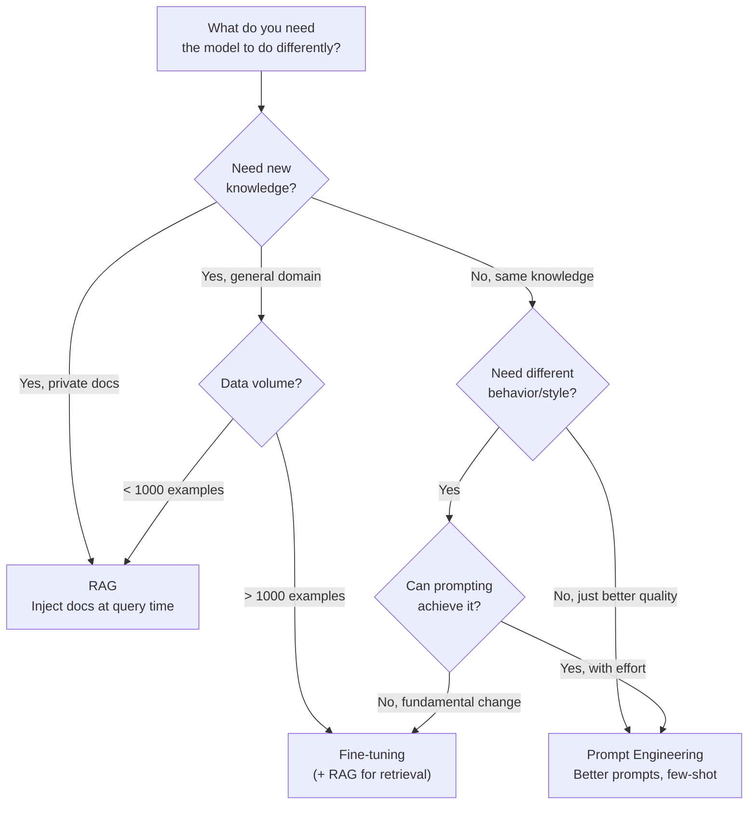
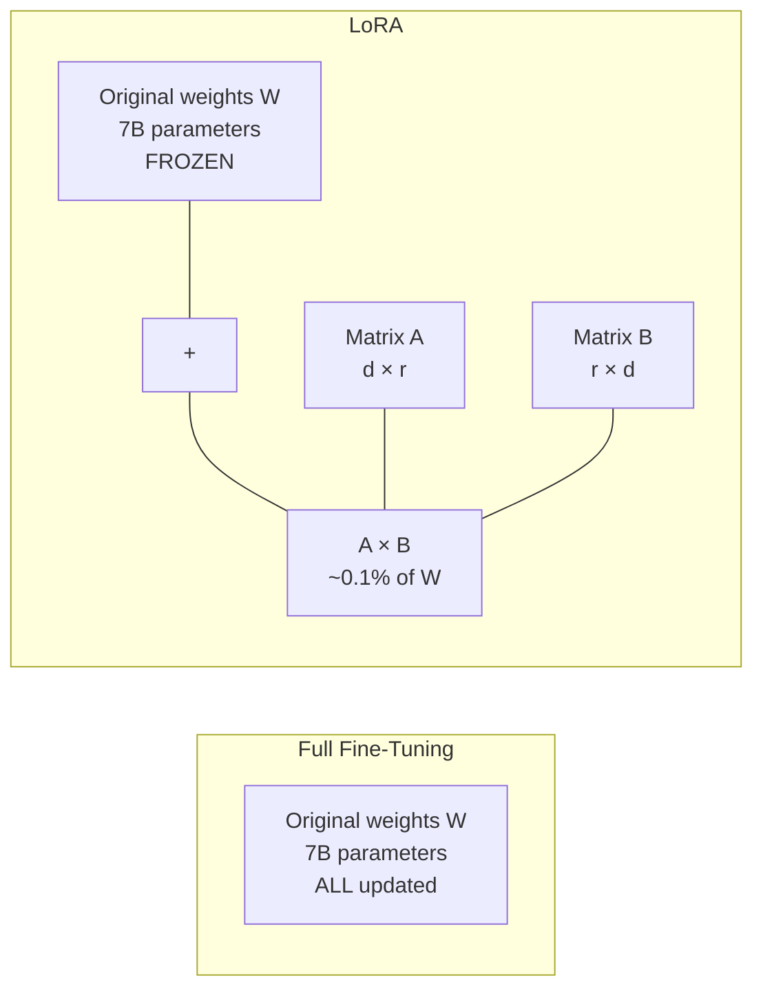
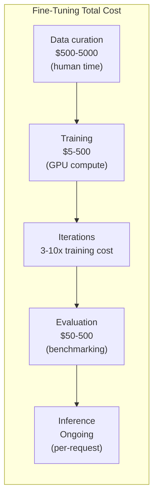

# Model Fine-Tuning

Fine-tuning is the process of taking a pre-trained language model and training it further on your own data to specialize its behavior. It changes how the model responds — its style, format, reasoning patterns, and domain-specific knowledge — in ways that prompting alone cannot achieve.

But fine-tuning is also the most overused technique in applied AI. Most teams reach for fine-tuning when [RAG](/ai-ml-engineering/rag-architecture) or better prompt engineering would solve their problem faster, cheaper, and with more flexibility. This page covers when fine-tuning is actually the right choice, the techniques that make it practical (LoRA, QLoRA), and the full workflow from data preparation through evaluation.

## When to Fine-Tune vs Prompt Engineer vs RAG

This is the most important decision. Get this wrong and you waste weeks and thousands of dollars.



| Approach | Changes | Best For | Iteration Speed | Cost |
|----------|---------|----------|----------------|------|
| **Prompt Engineering** | How you ask | Format, tone, simple constraints | Minutes | Free |
| **Few-Shot Examples** | What you show | Style matching, complex formats | Minutes | Token cost per request |
| **RAG** | What the model knows | Private/current knowledge, factual Q&A | Hours | Embedding + retrieval cost |
| **Fine-Tuning** | How the model behaves | Consistent style, domain reasoning, format compliance | Days | Training + inference cost |

### Fine-Tuning Is the Right Choice When

1. **Consistent output format.** You need the model to always respond in a specific structure that prompting cannot reliably enforce (e.g., always outputting valid SQL for your schema).
2. **Domain-specific reasoning.** The model needs to reason in domain-specific ways — medical diagnosis patterns, legal analysis frameworks, financial modeling conventions.
3. **Style and voice.** You need the model to consistently write in a specific voice that few-shot examples cannot fully capture.
4. **Reducing prompt size.** Your few-shot prompt is so long it is expensive and slow. Fine-tuning bakes those examples into the model weights.
5. **Edge deployment.** You need a small model that performs like a large one for a specific task, for latency or cost reasons.

### Fine-Tuning Is Wrong When

1. **You need current information.** Fine-tuning bakes knowledge into weights at training time. It goes stale. Use RAG.
2. **You have fewer than 100 examples.** You will overfit. Use few-shot prompting.
3. **You need to update knowledge frequently.** Retraining is slow and expensive. Use RAG.
4. **Prompting works well enough.** If GPT-4o with a good system prompt meets your quality bar, do not fine-tune.

::: warning The fine-tuning trap
Teams commonly fine-tune because "RAG is not good enough." In 90% of cases, the problem is bad chunking, poor retrieval, or weak prompts — not a need for fine-tuning. Fix your [RAG pipeline](/ai-ml-engineering/rag-architecture) before considering fine-tuning.
:::

## Fine-Tuning Techniques

### Full Fine-Tuning

Updates all parameters in the model. Produces the best results but requires the most compute, memory, and data.

- **Parameters updated:** All (billions)
- **GPU memory:** 4x model size (model + gradients + optimizer states)
- **For a 7B model:** ~112 GB GPU memory (impractical for most teams)
- **When to use:** When you have massive datasets and dedicated GPU clusters

### LoRA (Low-Rank Adaptation)

The breakthrough that made fine-tuning practical. Instead of updating all weights, LoRA adds small trainable matrices to each layer while keeping the original weights frozen.



- **Parameters updated:** 0.1-1% of total (millions instead of billions)
- **GPU memory:** ~1.2x model size
- **For a 7B model:** ~16 GB GPU memory (fits on a single consumer GPU)
- **Quality:** 90-99% of full fine-tuning quality for most tasks

Key hyperparameters:
- **r (rank):** Dimension of the low-rank matrices. Higher = more capacity but more memory. Typical: 8-64.
- **alpha:** Scaling factor. Usually set to 2x rank.
- **target_modules:** Which layers to apply LoRA to. Usually attention layers (`q_proj`, `v_proj`).

### QLoRA (Quantized LoRA)

Combines LoRA with 4-bit quantization of the base model. The original weights are loaded in 4-bit precision, while LoRA adapters train in full precision.

- **GPU memory:** ~0.5x model size
- **For a 7B model:** ~6 GB GPU memory (fits on consumer GPUs like RTX 3060)
- **Quality:** Slightly below LoRA but remarkably close
- **The practical choice:** Most teams should start here

```python
# QLoRA with Hugging Face PEFT
from transformers import AutoModelForCausalLM, BitsAndBytesConfig
from peft import LoraConfig, get_peft_model

# 4-bit quantization config
quantization_config = BitsAndBytesConfig(
    load_in_4bit=True,
    bnb_4bit_compute_dtype="float16",
    bnb_4bit_quant_type="nf4",
    bnb_4bit_use_double_quant=True,
)

# Load model in 4-bit
model = AutoModelForCausalLM.from_pretrained(
    "meta-llama/Llama-3.1-8B-Instruct",
    quantization_config=quantization_config,
    device_map="auto",
)

# Add LoRA adapters
lora_config = LoraConfig(
    r=16,
    lora_alpha=32,
    target_modules=["q_proj", "v_proj", "k_proj", "o_proj"],
    lora_dropout=0.05,
    task_type="CAUSAL_LM",
)

model = get_peft_model(model, lora_config)
model.print_trainable_parameters()
# trainable params: 6,553,600 || all params: 8,030,261,248 || trainable%: 0.08%
```

### Technique Comparison

| Technique | Memory (7B model) | Training Speed | Quality | Cost (cloud GPU) |
|-----------|-------------------|---------------|---------|-------------------|
| **Full fine-tuning** | ~112 GB | Slow | Best | $50-500/run |
| **LoRA** | ~16 GB | Fast | Excellent | $5-50/run |
| **QLoRA** | ~6 GB | Moderate | Very good | $2-20/run |

## Data Preparation

Data quality is the single most important factor in fine-tuning success. A small, high-quality dataset beats a large, noisy one every time.

### Data Format

Most fine-tuning expects conversation-format data:

```json
{
  "messages": [
    {"role": "system", "content": "You are a SQL expert for PostgreSQL databases."},
    {"role": "user", "content": "Write a query to find the top 10 customers by revenue"},
    {"role": "assistant", "content": "SELECT c.name, SUM(o.amount) AS total_revenue\nFROM customers c\nJOIN orders o ON c.id = o.customer_id\nGROUP BY c.name\nORDER BY total_revenue DESC\nLIMIT 10;"}
  ]
}
```

### Data Requirements

| Dataset Size | Expected Outcome | Recommendation |
|-------------|-----------------|----------------|
| 10-50 examples | Minimal effect | Use few-shot prompting instead |
| 50-200 examples | Basic style/format transfer | Enough for simple tasks |
| 200-1000 examples | Good specialization | Sweet spot for most use cases |
| 1000-10000 examples | Strong specialization | Domain-specific tasks |
| 10000+ examples | Near-expert performance | Complex reasoning tasks |

### Data Quality Checklist

1. **Diverse inputs.** Cover the full range of queries your model will receive, not just easy cases.
2. **Gold-standard outputs.** Every response should be exactly what you want the model to produce. Have domain experts review them.
3. **Consistent format.** Use the same structure, tone, and level of detail across all examples.
4. **No contradictions.** Contradictory examples confuse the model. Audit for consistency.
5. **Edge cases included.** Include examples of how the model should handle ambiguous, off-topic, or adversarial inputs.
6. **Train/validation split.** Hold out 10-20% of data for evaluation. Never evaluate on training data.

```python
import json
import random

def prepare_dataset(examples: list[dict], val_split: float = 0.1):
    """Prepare and validate a fine-tuning dataset."""
    # Validate format
    for i, ex in enumerate(examples):
        assert "messages" in ex, f"Example {i} missing 'messages'"
        for msg in ex["messages"]:
            assert "role" in msg and "content" in msg, f"Example {i} malformed"
            assert msg["role"] in ("system", "user", "assistant")

    # Shuffle and split
    random.shuffle(examples)
    split_idx = int(len(examples) * (1 - val_split))
    train = examples[:split_idx]
    val = examples[split_idx:]

    # Save
    with open("train.jsonl", "w") as f:
        for ex in train:
            f.write(json.dumps(ex) + "\n")

    with open("val.jsonl", "w") as f:
        for ex in val:
            f.write(json.dumps(ex) + "\n")

    print(f"Train: {len(train)}, Validation: {len(val)}")
    return train, val
```

## OpenAI Fine-Tuning API

The simplest way to fine-tune if you are using OpenAI models.

```python
from openai import OpenAI

client = OpenAI()

# 1. Upload training data
training_file = client.files.create(
    file=open("train.jsonl", "rb"),
    purpose="fine-tune",
)

validation_file = client.files.create(
    file=open("val.jsonl", "rb"),
    purpose="fine-tune",
)

# 2. Create fine-tuning job
job = client.fine_tuning.jobs.create(
    training_file=training_file.id,
    validation_file=validation_file.id,
    model="gpt-4o-mini-2024-07-18",
    hyperparameters={
        "n_epochs": 3,
        "batch_size": "auto",
        "learning_rate_multiplier": "auto",
    },
    suffix="sql-expert-v1",
)

# 3. Monitor progress
while True:
    job = client.fine_tuning.jobs.retrieve(job.id)
    print(f"Status: {job.status}")
    if job.status in ("succeeded", "failed"):
        break
    time.sleep(60)

# 4. Use the fine-tuned model
if job.status == "succeeded":
    response = client.chat.completions.create(
        model=job.fine_tuned_model,  # e.g., "ft:gpt-4o-mini:org:sql-expert-v1:abc123"
        messages=[
            {"role": "user", "content": "Find users who signed up in the last 7 days"}
        ],
    )
```

### OpenAI Fine-Tuning Pricing

| Model | Training Cost | Inference Cost |
|-------|--------------|----------------|
| gpt-4o-mini | $3.00 / 1M tokens | $0.30 / 1M input, $1.20 / 1M output |
| gpt-4o | $25.00 / 1M tokens | $3.75 / 1M input, $15.00 / 1M output |
| gpt-3.5-turbo | $8.00 / 1M tokens | $3.00 / 1M input, $6.00 / 1M output |

::: tip Start with gpt-4o-mini
Fine-tuned gpt-4o-mini often matches or exceeds base gpt-4o performance for specialized tasks, at a fraction of the cost. Always benchmark against the base model before paying for gpt-4o fine-tuning.
:::

## Hugging Face Transformers + PEFT

For open-source models and full control over the training process.

```python
from transformers import (
    AutoModelForCausalLM,
    AutoTokenizer,
    TrainingArguments,
    BitsAndBytesConfig,
)
from peft import LoraConfig, get_peft_model, prepare_model_for_kbit_training
from trl import SFTTrainer
from datasets import load_dataset

# 1. Load model with QLoRA
model_name = "meta-llama/Llama-3.1-8B-Instruct"

quantization_config = BitsAndBytesConfig(
    load_in_4bit=True,
    bnb_4bit_compute_dtype="float16",
    bnb_4bit_quant_type="nf4",
    bnb_4bit_use_double_quant=True,
)

model = AutoModelForCausalLM.from_pretrained(
    model_name,
    quantization_config=quantization_config,
    device_map="auto",
)
model = prepare_model_for_kbit_training(model)

tokenizer = AutoTokenizer.from_pretrained(model_name)
tokenizer.pad_token = tokenizer.eos_token

# 2. Configure LoRA
lora_config = LoraConfig(
    r=16,
    lora_alpha=32,
    target_modules=[
        "q_proj", "k_proj", "v_proj", "o_proj",
        "gate_proj", "up_proj", "down_proj",
    ],
    lora_dropout=0.05,
    bias="none",
    task_type="CAUSAL_LM",
)

model = get_peft_model(model, lora_config)

# 3. Load dataset
dataset = load_dataset("json", data_files={
    "train": "train.jsonl",
    "validation": "val.jsonl",
})

# 4. Training arguments
training_args = TrainingArguments(
    output_dir="./sql-expert-lora",
    num_train_epochs=3,
    per_device_train_batch_size=4,
    gradient_accumulation_steps=4,
    learning_rate=2e-4,
    warmup_ratio=0.1,
    logging_steps=10,
    eval_strategy="steps",
    eval_steps=50,
    save_strategy="steps",
    save_steps=100,
    fp16=True,
    report_to="wandb",
)

# 5. Train with SFTTrainer (from trl library)
trainer = SFTTrainer(
    model=model,
    args=training_args,
    train_dataset=dataset["train"],
    eval_dataset=dataset["validation"],
    tokenizer=tokenizer,
    max_seq_length=2048,
)

trainer.train()

# 6. Save the adapter (not the full model)
model.save_pretrained("./sql-expert-lora/final")
```

### Inference with LoRA Adapters

```python
from peft import PeftModel
from transformers import AutoModelForCausalLM, AutoTokenizer

# Load base model
base_model = AutoModelForCausalLM.from_pretrained(
    "meta-llama/Llama-3.1-8B-Instruct",
    device_map="auto",
)

# Load LoRA adapter on top
model = PeftModel.from_pretrained(base_model, "./sql-expert-lora/final")

# Or merge adapter into base model for faster inference
model = model.merge_and_unload()
model.save_pretrained("./sql-expert-merged")
```

## Evaluation

Fine-tuning without evaluation is guessing. You need to measure whether the fine-tuned model actually outperforms the base model on your task.

### Evaluation Framework

```python
def evaluate_model(model, tokenizer, eval_data, judge_model=None):
    """Evaluate a fine-tuned model against test data."""
    results = []

    for example in eval_data:
        user_msg = example["messages"][-2]["content"]  # user message
        expected = example["messages"][-1]["content"]   # expected response

        # Generate response
        inputs = tokenizer(user_msg, return_tensors="pt").to(model.device)
        outputs = model.generate(**inputs, max_new_tokens=512, temperature=0)
        predicted = tokenizer.decode(outputs[0], skip_special_tokens=True)

        # Exact match (for structured output)
        exact_match = predicted.strip() == expected.strip()

        # LLM-as-judge (for open-ended output)
        if judge_model:
            judge_score = judge_model.invoke(
                f"Rate this response from 1-5.\n"
                f"Expected: {expected}\n"
                f"Got: {predicted}\n"
                f"Score:"
            )
        else:
            judge_score = None

        results.append({
            "input": user_msg,
            "expected": expected,
            "predicted": predicted,
            "exact_match": exact_match,
            "judge_score": judge_score,
        })

    # Aggregate metrics
    accuracy = sum(r["exact_match"] for r in results) / len(results)
    print(f"Exact match accuracy: {accuracy:.2%}")
    return results
```

### Preventing Catastrophic Forgetting

When you fine-tune a model on a narrow dataset, it can lose its general capabilities. This is called catastrophic forgetting.

Mitigation strategies:

1. **Mix in general data.** Include 10-20% of general instruction-following examples alongside your specialized data.
2. **Use LoRA.** Since LoRA keeps the original weights frozen, forgetting is much less severe than full fine-tuning.
3. **Low learning rate.** Use a small learning rate (1e-5 to 2e-4) to make gentle updates rather than aggressive ones.
4. **Few epochs.** Train for 1-3 epochs. More epochs increase specialization but also forgetting.
5. **Evaluate broadly.** Test on both your specialized task and general benchmarks (MMLU, HumanEval) to detect forgetting early.

::: danger Always measure forgetting
After fine-tuning, test your model on general-purpose benchmarks. If it can no longer hold a coherent conversation or follow basic instructions, you have overtrained. Reduce epochs, lower the learning rate, or add more diverse training data.
:::

## Cost Analysis

### Fine-Tuning Cost Breakdown

For a dataset of 1,000 examples averaging 500 tokens each (total ~500K tokens), trained for 3 epochs:

| Approach | Training Cost | Hourly GPU Cost | Time | Total |
|----------|-------------|----------------|------|-------|
| **OpenAI gpt-4o-mini** | ~$4.50 | N/A (managed) | ~30 min | ~$4.50 |
| **OpenAI gpt-4o** | ~$37.50 | N/A (managed) | ~1 hr | ~$37.50 |
| **QLoRA 8B (A100 40GB)** | N/A | ~$1.50/hr | ~1 hr | ~$1.50 |
| **QLoRA 8B (RTX 4090)** | N/A | ~$0.50/hr | ~1.5 hr | ~$0.75 |
| **Full FT 8B (8xA100)** | N/A | ~$12/hr | ~2 hr | ~$24 |

### Total Cost of Ownership

Fine-tuning cost is not just training — it includes:

1. **Data curation** — Human expert time to create and review training examples
2. **Training compute** — GPU hours for training
3. **Iteration** — You will train multiple versions (hyperparameter tuning, data fixes)
4. **Evaluation** — Running benchmarks on each version
5. **Inference** — Serving the model (self-hosted) or per-token cost (API)
6. **Maintenance** — Retraining when knowledge or requirements change



::: tip The real cost is data
GPU time is cheap. The expensive part is creating high-quality training data. Budget for domain expert time to write, review, and iterate on training examples. A $5 training run on garbage data produces a garbage model.
:::

## Further Reading

- [RAG Architecture Deep Dive](/ai-ml-engineering/rag-architecture) — The alternative to fine-tuning for knowledge
- [LLM Integration Patterns](/ai-ml-engineering/llm-integration) — Prompt engineering as the first approach
- [Embeddings & Semantic Search](/ai-ml-engineering/embeddings) — Understanding the representation layer
- [AI in Production](/ai-ml-engineering/ai-in-production) — Serving fine-tuned models in production
- [ML Pipelines & MLOps](/ai-ml-engineering/ml-pipelines) — Infrastructure for training workflows
- [Hugging Face PEFT Documentation](https://huggingface.co/docs/peft) — LoRA/QLoRA library
- [OpenAI Fine-Tuning Guide](https://platform.openai.com/docs/guides/fine-tuning) — Official guide
- [QLoRA Paper](https://arxiv.org/abs/2305.14314) — The original QLoRA paper
