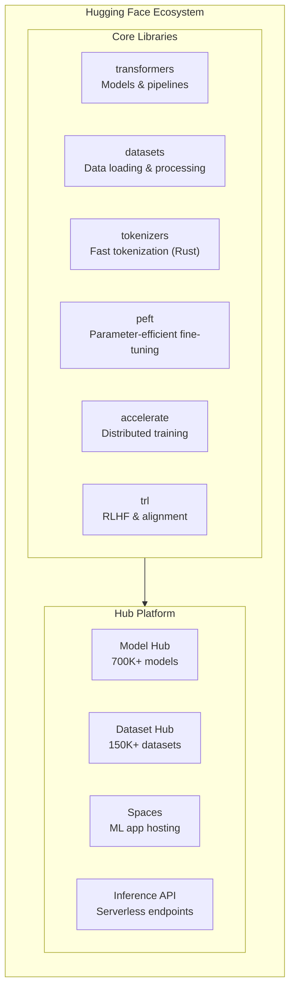
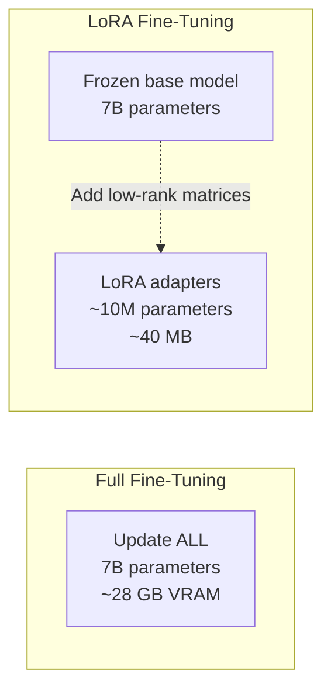
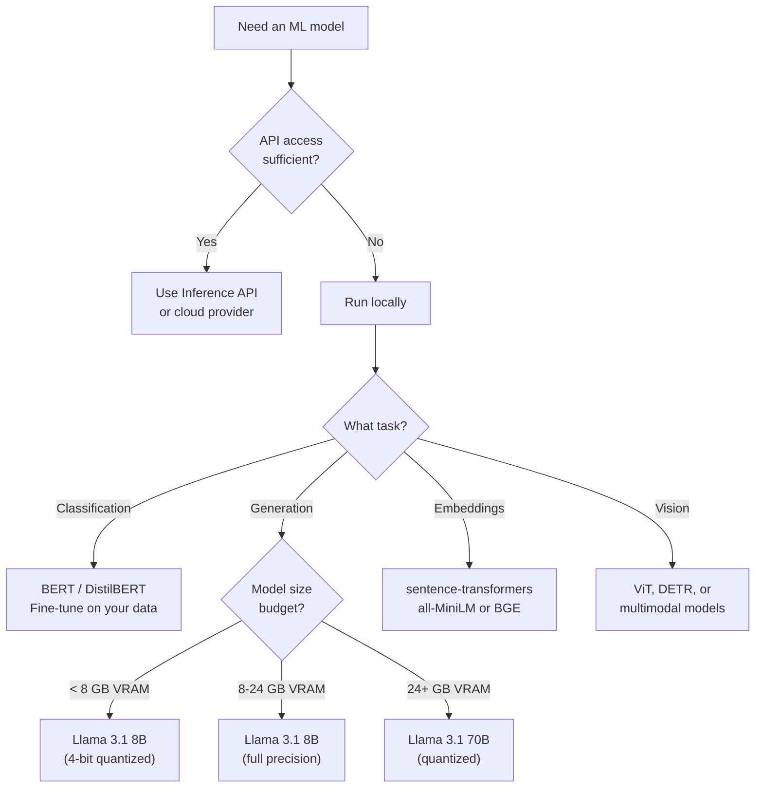

# Hugging Face Ecosystem

Hugging Face has become the GitHub of machine learning. What started as a chatbot company is now the central hub for open-source models, datasets, and ML tooling. If you are building anything with ML — from deploying a pre-trained classifier to fine-tuning an LLM on your domain data — you will interact with the Hugging Face ecosystem. This page covers the full stack: the Transformers library, pipelines, tokenizers, the Model Hub, Datasets, parameter-efficient fine-tuning (PEFT), the Inference API, and Spaces.

## Ecosystem Overview



| Component | Purpose | When to Use |
|-----------|---------|-------------|
| **transformers** | Load, run, and fine-tune models | Any model interaction |
| **datasets** | Load and process data | Training, evaluation, data exploration |
| **tokenizers** | Convert text to tokens (Rust-fast) | Pre-processing for any NLP model |
| **peft** | Fine-tune with minimal parameters | When you cannot afford full fine-tuning |
| **accelerate** | Multi-GPU/TPU training abstraction | Training models across hardware |
| **trl** | RLHF, DPO, PPO training | Alignment and reward model training |
| **evaluate** | Compute ML metrics | Model evaluation and comparison |

## Transformers Library

The `transformers` library is the core. It provides a unified API for thousands of pre-trained models across NLP, computer vision, audio, and multimodal tasks.

### Pipelines: The Fast Path

Pipelines are the highest-level abstraction. They handle tokenization, model inference, and post-processing in a single call.

```python
from transformers import pipeline

# Text classification
classifier = pipeline("sentiment-analysis")
result = classifier("Hugging Face is incredibly useful for ML engineering.")
# [{'label': 'POSITIVE', 'score': 0.9998}]

# Named entity recognition
ner = pipeline("ner", model="dslim/bert-base-NER", grouped_entities=True)
entities = ner("Hugging Face was founded in New York by Clément Delangue.")
# [{'entity_group': 'ORG', 'word': 'Hugging Face', 'score': 0.99},
#  {'entity_group': 'LOC', 'word': 'New York', 'score': 0.99},
#  {'entity_group': 'PER', 'word': 'Clément Delangue', 'score': 0.98}]

# Text generation
generator = pipeline("text-generation", model="meta-llama/Llama-3.1-8B-Instruct")
output = generator("Explain microservices in one sentence:", max_new_tokens=50)

# Summarization
summarizer = pipeline("summarization", model="facebook/bart-large-cnn")
summary = summarizer(long_article, max_length=130, min_length=30)

# Zero-shot classification (no training needed)
zero_shot = pipeline("zero-shot-classification")
result = zero_shot(
    "The new GPU architecture reduces inference latency by 40%.",
    candidate_labels=["technology", "finance", "sports", "politics"]
)
# {'labels': ['technology', ...], 'scores': [0.97, ...]}
```

### Available Pipeline Tasks

| Task | Pipeline Name | Example Models |
|------|--------------|----------------|
| Text classification | `text-classification` | `distilbert-base-uncased-finetuned-sst-2-english` |
| Token classification (NER) | `ner` | `dslim/bert-base-NER` |
| Question answering | `question-answering` | `deepset/roberta-base-squad2` |
| Summarization | `summarization` | `facebook/bart-large-cnn` |
| Translation | `translation` | `Helsinki-NLP/opus-mt-en-fr` |
| Text generation | `text-generation` | `meta-llama/Llama-3.1-8B-Instruct` |
| Fill mask | `fill-mask` | `bert-base-uncased` |
| Image classification | `image-classification` | `google/vit-base-patch16-224` |
| Object detection | `object-detection` | `facebook/detr-resnet-50` |
| Speech recognition | `automatic-speech-recognition` | `openai/whisper-large-v3` |
| Image generation | `text-to-image` | `stabilityai/stable-diffusion-xl-base-1.0` |

### Working with Models Directly

When you need more control than pipelines offer, work with models and tokenizers directly.

```python
from transformers import AutoTokenizer, AutoModelForSequenceClassification
import torch

# Load model and tokenizer
model_name = "distilbert-base-uncased-finetuned-sst-2-english"
tokenizer = AutoTokenizer.from_pretrained(model_name)
model = AutoModelForSequenceClassification.from_pretrained(model_name)

# Tokenize input
text = "This API design is elegant and well-documented."
inputs = tokenizer(text, return_tensors="pt", padding=True, truncation=True)

# Run inference
with torch.no_grad():
    outputs = model(**inputs)
    predictions = torch.nn.functional.softmax(outputs.logits, dim=-1)
    label_id = predictions.argmax().item()
    confidence = predictions.max().item()

print(f"Label: {model.config.id2label[label_id]}, Confidence: {confidence:.4f}")
```

```python
# Text generation with full control
from transformers import AutoTokenizer, AutoModelForCausalLM

tokenizer = AutoTokenizer.from_pretrained("meta-llama/Llama-3.1-8B-Instruct")
model = AutoModelForCausalLM.from_pretrained(
    "meta-llama/Llama-3.1-8B-Instruct",
    torch_dtype=torch.float16,
    device_map="auto",         # Automatic GPU placement
    load_in_4bit=True,         # Quantized loading (needs bitsandbytes)
)

messages = [
    {"role": "system", "content": "You are a helpful coding assistant."},
    {"role": "user", "content": "Write a Python async context manager for database connections."}
]

# Apply chat template
input_ids = tokenizer.apply_chat_template(messages, return_tensors="pt").to(model.device)

# Generate
output_ids = model.generate(
    input_ids,
    max_new_tokens=512,
    temperature=0.7,
    top_p=0.9,
    do_sample=True,
    repetition_penalty=1.1,
)

response = tokenizer.decode(output_ids[0][input_ids.shape[-1]:], skip_special_tokens=True)
print(response)
```

## Tokenizers

Tokenizers convert raw text into token IDs that models understand. Hugging Face's `tokenizers` library is written in Rust for speed.

```python
from transformers import AutoTokenizer

tokenizer = AutoTokenizer.from_pretrained("gpt2")

text = "Hugging Face transformers are powerful."

# Encode
tokens = tokenizer.tokenize(text)
# ['H', 'ugging', ' Face', ' transform', 'ers', ' are', ' powerful', '.']

token_ids = tokenizer.encode(text)
# [39, 31795, 8368, 29641, 364, 389, 3665, 13]

# Decode
decoded = tokenizer.decode(token_ids)
# 'Hugging Face transformers are powerful.'

# Batch encoding with padding and truncation
batch = tokenizer(
    ["First sentence.", "Second sentence that is longer."],
    padding=True,          # Pad shorter sequences
    truncation=True,       # Truncate longer sequences
    max_length=128,
    return_tensors="pt",   # Return PyTorch tensors
)
# batch.input_ids, batch.attention_mask
```

::: tip Token Count Estimation
A rough rule of thumb: 1 token is approximately 4 characters or 0.75 words in English. Use `len(tokenizer.encode(text))` for precise counts. Different models use different tokenizers — GPT-4 and Llama tokenize the same text differently.
:::

### Tokenizer Types

| Tokenizer | Algorithm | Used By | Characteristics |
|-----------|-----------|---------|-----------------|
| BPE | Byte-Pair Encoding | GPT-2, GPT-4, Llama | Character-level fallback, good with code |
| WordPiece | Greedy longest-match | BERT, DistilBERT | Uses `##` for subwords |
| Unigram | Probabilistic | T5, ALBERT, XLNet | Keeps multiple tokenizations, picks best |
| SentencePiece | BPE or Unigram | Llama, mT5 | Language-agnostic, works on raw text |

## Model Hub

The Model Hub hosts over 700,000 models. Understanding how to find, evaluate, and use models effectively is essential.

### Finding Models

```python
from huggingface_hub import HfApi

api = HfApi()

# Search for models
models = api.list_models(
    filter="text-classification",
    sort="downloads",
    direction=-1,
    limit=5,
)

for model in models:
    print(f"{model.id}: {model.downloads:,} downloads")

# Get model details
model_info = api.model_info("meta-llama/Llama-3.1-8B-Instruct")
print(f"Tags: {model_info.tags}")
print(f"Library: {model_info.library_name}")
print(f"License: {model_info.card_data.license}")
```

### Model Cards

Every good model on the Hub includes a model card — a README.md with structured metadata. Key sections to check:

1. **Intended use** — What the model was designed for
2. **Training data** — What data it was trained on (licensing implications)
3. **Evaluation results** — Benchmark performance
4. **Limitations** — Known failure modes
5. **License** — Can you use it commercially?

::: warning License Check
Not all models on the Hub are commercially usable. Common licenses:
- **Apache 2.0** / **MIT** — Fully permissive, commercial use allowed
- **Llama 3 Community License** — Commercial use with restrictions above 700M MAU
- **cc-by-nc-4.0** — Non-commercial only
- **Custom / Research** — Read the specific terms carefully
Always verify the license before deploying a model in production.
:::

## Datasets Library

The `datasets` library provides efficient, memory-mapped data loading for ML workflows.

```python
from datasets import load_dataset, Dataset

# Load from the Hub
dataset = load_dataset("imdb")
print(dataset)
# DatasetDict({
#     train: Dataset({ features: ['text', 'label'], num_rows: 25000 }),
#     test: Dataset({ features: ['text', 'label'], num_rows: 25000 })
# })

# Access data
print(dataset["train"][0])
# {'text': 'I rented this movie...', 'label': 1}

# Filter
positive = dataset["train"].filter(lambda x: x["label"] == 1)

# Map (apply transformation)
def tokenize_function(examples):
    return tokenizer(examples["text"], padding="max_length", truncation=True)

tokenized = dataset["train"].map(tokenize_function, batched=True)

# Create from local data
my_dataset = Dataset.from_dict({
    "text": ["Hello world", "Transformers are great"],
    "label": [0, 1],
})

# Create from pandas
import pandas as pd
df = pd.DataFrame({"text": ["a", "b"], "label": [0, 1]})
dataset = Dataset.from_pandas(df)

# Load from local files
dataset = load_dataset("csv", data_files="data/train.csv")
dataset = load_dataset("json", data_files="data/train.jsonl")
```

### Streaming Large Datasets

For datasets too large to fit in memory, use streaming mode.

```python
# Stream — data is fetched on-the-fly, never fully downloaded
dataset = load_dataset("HuggingFaceFW/fineweb", split="train", streaming=True)

for i, example in enumerate(dataset):
    if i >= 1000:
        break
    process(example["text"])
```

## PEFT: Parameter-Efficient Fine-Tuning

Full fine-tuning updates every parameter in a model — for a 7B parameter model, that requires ~28 GB of GPU memory just for the weights. PEFT methods like LoRA update only a small fraction of parameters while achieving comparable quality.



### LoRA Fine-Tuning

```python
from transformers import AutoModelForCausalLM, AutoTokenizer, TrainingArguments
from peft import LoraConfig, get_peft_model, TaskType
from trl import SFTTrainer
from datasets import load_dataset

# Load base model
model_name = "meta-llama/Llama-3.1-8B-Instruct"
model = AutoModelForCausalLM.from_pretrained(
    model_name,
    torch_dtype=torch.float16,
    device_map="auto",
    load_in_4bit=True,  # QLoRA — quantize base model to 4-bit
)
tokenizer = AutoTokenizer.from_pretrained(model_name)
tokenizer.pad_token = tokenizer.eos_token

# Configure LoRA
lora_config = LoraConfig(
    task_type=TaskType.CAUSAL_LM,
    r=16,                   # Rank — higher = more capacity, more memory
    lora_alpha=32,          # Scaling factor (alpha/r = scaling)
    lora_dropout=0.05,
    target_modules=[        # Which layers to adapt
        "q_proj", "k_proj", "v_proj", "o_proj",
        "gate_proj", "up_proj", "down_proj",
    ],
    bias="none",
)

# Apply LoRA
model = get_peft_model(model, lora_config)
model.print_trainable_parameters()
# trainable params: 13,631,488 || all params: 8,043,847,680 || trainable%: 0.1695

# Prepare dataset
dataset = load_dataset("json", data_files="training_data.jsonl")

# Train with SFTTrainer (from trl)
training_args = TrainingArguments(
    output_dir="./lora-output",
    num_train_epochs=3,
    per_device_train_batch_size=4,
    gradient_accumulation_steps=4,
    learning_rate=2e-4,
    warmup_steps=100,
    logging_steps=10,
    save_steps=200,
    fp16=True,
)

trainer = SFTTrainer(
    model=model,
    train_dataset=dataset["train"],
    args=training_args,
    tokenizer=tokenizer,
    max_seq_length=2048,
)

trainer.train()

# Save LoRA adapter (small — just the adapter weights)
model.save_pretrained("./lora-adapter")
# This saves ~40 MB, not the full 16 GB model
```

### Loading a LoRA Adapter

```python
from peft import PeftModel

# Load base model
base_model = AutoModelForCausalLM.from_pretrained(
    "meta-llama/Llama-3.1-8B-Instruct",
    torch_dtype=torch.float16,
    device_map="auto",
)

# Apply saved adapter
model = PeftModel.from_pretrained(base_model, "./lora-adapter")

# Or merge adapter into base model for faster inference
merged_model = model.merge_and_unload()
merged_model.save_pretrained("./merged-model")
```

::: tip LoRA Rank Selection
- **r=8**: Good starting point for most tasks. Low memory, fast training.
- **r=16**: Better for complex tasks or larger datasets. Sweet spot for production.
- **r=32+**: Approaching full fine-tuning quality. Use when r=16 underperforms.
- **r=64+**: Diminishing returns. Consider full fine-tuning instead.
:::

## Inference API and Endpoints

### Serverless Inference API

Free tier for quick testing — rate-limited and shared infrastructure.

```python
from huggingface_hub import InferenceClient

client = InferenceClient(token="hf_...")

# Text generation
response = client.text_generation(
    "Explain Kubernetes in one sentence:",
    model="meta-llama/Llama-3.1-8B-Instruct",
    max_new_tokens=100,
)

# Embeddings
embeddings = client.feature_extraction(
    "The quick brown fox",
    model="sentence-transformers/all-MiniLM-L6-v2",
)

# Image generation
image = client.text_to_image(
    "A futuristic data center with glowing servers",
    model="stabilityai/stable-diffusion-xl-base-1.0",
)
image.save("datacenter.png")

# Chat completions (OpenAI-compatible)
response = client.chat.completions.create(
    model="meta-llama/Llama-3.1-8B-Instruct",
    messages=[
        {"role": "user", "content": "What is RLHF?"}
    ],
    max_tokens=500,
)
```

### Dedicated Inference Endpoints

For production workloads, deploy a model to a dedicated GPU endpoint.

```python
from huggingface_hub import create_inference_endpoint

endpoint = create_inference_endpoint(
    name="my-llm-endpoint",
    repository="meta-llama/Llama-3.1-8B-Instruct",
    framework="pytorch",
    task="text-generation",
    accelerator="gpu",
    instance_type="nvidia-a10g",
    instance_size="x1",
    region="us-east-1",
    type="protected",  # "public", "protected", or "private"
)

endpoint.wait()  # Wait for deployment
print(f"Endpoint URL: {endpoint.url}")

# Use it
response = endpoint.client.text_generation("Hello!", max_new_tokens=50)
```

## Spaces

Spaces are Hugging Face's app hosting platform. Deploy Gradio, Streamlit, or Docker-based ML demos.

```python
# A simple Gradio Space (app.py)
import gradio as gr
from transformers import pipeline

classifier = pipeline("sentiment-analysis")

def analyze(text):
    result = classifier(text)[0]
    return f"{result['label']} (confidence: {result['score']:.2%})"

demo = gr.Interface(
    fn=analyze,
    inputs=gr.Textbox(placeholder="Enter text to analyze..."),
    outputs="text",
    title="Sentiment Analyzer",
    description="Classify text sentiment using DistilBERT",
)

demo.launch()
```

## Common Workflows

### Model Selection Decision Tree



### Upload Your Own Model

```python
from huggingface_hub import HfApi

api = HfApi()

# Create a repository
api.create_repo("my-username/my-fine-tuned-model", private=True)

# Upload model files
api.upload_folder(
    folder_path="./my-model-output",
    repo_id="my-username/my-fine-tuned-model",
    commit_message="Upload fine-tuned model v1",
)
```

## See Also

- [LLM Integration Patterns](/ai-ml-engineering/llm-integration) — Provider-agnostic architecture for LLM applications
- [Embeddings Deep Dive](/ai-ml-engineering/embeddings) — Embedding strategies and vector search
- [Vector Databases](/ai-ml-engineering/vector-databases) — Where to store your embeddings
- [ML Pipelines](/ai-ml-engineering/ml-pipelines) — End-to-end ML workflow orchestration
- [OpenAI API Patterns](/ai-ml-engineering/openai-api) — Compare with closed-source API patterns
