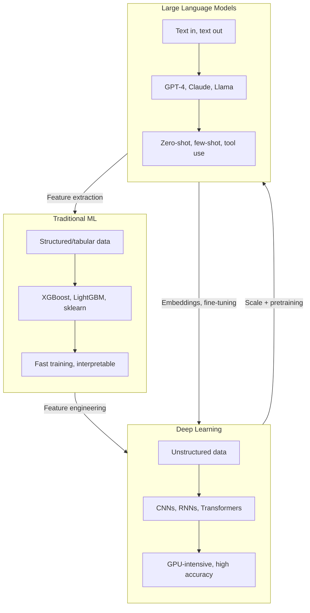
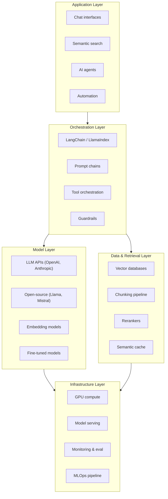
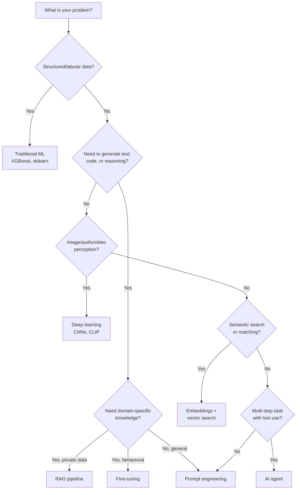

# AI/ML Engineering

Artificial intelligence is no longer a research curiosity. It is infrastructure. Every backend service you build will eventually talk to a model, every search bar your users touch will be powered by embeddings, and every workflow you automate will have an agent somewhere in the loop. The question is not *whether* you will work with AI/ML — it is whether you will do it well or poorly.

This section exists to make sure you do it well.

## Why Every Engineer Needs AI/ML Literacy

You do not need a PhD in machine learning to build production AI systems. But you do need to understand the fundamental abstractions, failure modes, and architectural patterns that separate a demo from a system that runs at scale without bankrupting your company on API costs.

Here is what changes when you understand AI/ML engineering:

- **You stop treating models as magic boxes.** You learn that an LLM is a stateless function that maps token sequences to probability distributions. This understanding lets you debug hallucinations, control output format, and predict cost.
- **You make better architecture decisions.** Should you fine-tune a model or use RAG? Should you embed at ingestion time or query time? Should you use a vector database or just pgvector? These decisions have 10x cost implications.
- **You build systems that actually work.** The gap between a ChatGPT wrapper and a production AI system is enormous. It includes retrieval pipelines, guardrails, evaluation frameworks, caching layers, and fallback strategies.

## The AI/ML Landscape

The field is wide, but the mental model is simple. There are three major paradigms, and they are not mutually exclusive:

### Traditional Machine Learning

Statistical models trained on structured data. Linear regression, decision trees, random forests, gradient boosting (XGBoost, LightGBM). These are the workhorses of tabular data — fraud detection, churn prediction, recommendation ranking, demand forecasting.

::: tip When to use traditional ML
If your data fits in a table and your problem is classification, regression, or ranking, start here. Traditional ML models are fast, interpretable, cheap to run, and often outperform deep learning on structured data.
:::

### Deep Learning

Neural networks with many layers. Convolutional networks (CNNs) for images, recurrent networks (RNNs/LSTMs) for sequences, transformers for everything. Deep learning excels when you have unstructured data — images, audio, text, video — and enough labeled examples to train on.

### Large Language Models (LLMs)

The transformer architecture scaled to hundreds of billions of parameters and trained on internet-scale text. GPT-4, Claude, Gemini, Llama, Mistral. LLMs are general-purpose reasoning engines that you interact with through natural language prompts rather than training from scratch.

### How They Relate

| Dimension | Traditional ML | Deep Learning | LLMs |
|-----------|---------------|---------------|------|
| **Data type** | Tabular, structured | Images, audio, text | Primarily text, multimodal |
| **Training data** | Thousands of rows | Millions of examples | Trillions of tokens (pretrained) |
| **Training cost** | Minutes on CPU | Hours/days on GPU | Millions of dollars (you use APIs) |
| **Inference cost** | Sub-millisecond | Milliseconds | Seconds, $0.01-$0.10 per call |
| **Interpretability** | High (feature importance) | Low (black box) | Medium (chain-of-thought) |
| **Customization** | Feature engineering | Fine-tuning | Prompting, RAG, fine-tuning |
| **When to use** | Tabular prediction | Perception tasks | Reasoning, generation, understanding |

## What You Will Learn

This section is organized around the skills you need to build production AI systems, starting from the most immediately practical and building toward advanced architectures.

### LLM Integration Patterns

The foundation. How to call LLM APIs correctly — chat completions, function calling, structured output, streaming, prompt engineering, and cost optimization. If you are building anything that talks to GPT-4 or Claude, start here.

[Read LLM Integration Patterns](/ai-ml-engineering/llm-integration)

### Embeddings & Semantic Search

The representation layer. How text (and images) get converted into vectors, how similarity search works, which embedding models to use, and how to build semantic search from scratch.

[Read Embeddings & Semantic Search](/ai-ml-engineering/embeddings)

### Vector Databases

The storage layer for AI. How vector databases work internally (HNSW, IVF, PQ), when to use them versus simpler alternatives, and a comparison of Pinecone, Weaviate, Qdrant, Milvus, and pgvector.

[Read Vector Databases](/ai-ml-engineering/vector-databases)

### RAG Architecture Deep Dive

The retrieval layer. Retrieval-Augmented Generation is how you give LLMs access to your private data without fine-tuning. Chunking strategies, retrieval pipelines, reranking, evaluation, and advanced patterns like HyDE and agentic RAG.

[Read RAG Architecture Deep Dive](/ai-ml-engineering/rag-architecture)

### AI Agents Architecture

The autonomy layer. How to build AI agents that reason, plan, use tools, and collaborate in multi-agent systems. ReAct patterns, memory architectures, planning strategies, and guardrails.

[Read AI Agents Architecture](/ai-ml-engineering/ai-agents)

### ML Pipelines & MLOps

The operational layer. The full ML lifecycle from data to deployment — feature stores, experiment tracking, model registries, CI/CD for ML, and model serving infrastructure.

[Read ML Pipelines & MLOps](/ai-ml-engineering/ml-pipelines)

## The AI/ML Engineering Stack

## Decision Framework: Which AI Approach?

When faced with a new AI/ML problem, use this decision tree:

## Common Anti-Patterns

Before diving into the individual topics, internalize these mistakes that teams make repeatedly:

| Anti-Pattern | Why It Fails | Better Approach |
|---|---|---|
| Fine-tuning when RAG would work | Expensive, slow iteration, model goes stale | Start with RAG; fine-tune only for behavioral changes |
| No evaluation framework | Cannot measure if changes improve quality | Build evals before building features |
| Ignoring cost until production | $0.03 per call * 1M calls = $30,000/month | Model selection, caching, prompt optimization from day one |
| Stuffing entire documents into context | Hits token limits, dilutes relevant information | Chunk, embed, retrieve only what is needed |
| No fallback strategy | Single model failure = total system failure | Multi-model routing, graceful degradation |
| Treating prompts as code | No version control, no testing, no review | Prompt management system with versioning and A/B testing |

::: warning The demo-to-production gap
Building a working demo with LLMs takes hours. Building a production system takes months. The difference is evaluation, error handling, cost management, latency optimization, and guardrails. Every page in this section addresses that gap.
:::

## Prerequisites

This section assumes you are comfortable with:

- **Python or TypeScript** — Most examples use both
- **REST APIs** — You will be calling model APIs extensively
- **Basic statistics** — Mean, variance, cosine similarity, probability distributions
- **SQL** — For data pipeline examples
- **Docker** — For deployment examples

No prior machine learning experience is required. We build up from first principles where needed.

## Related Sections

- [Prompt Engineering](/prompt-engineering/) — 500+ battle-tested prompts for engineering workflows
- [System Design](/system-design/) — Distributed systems patterns that underpin AI infrastructure
- [Data Engineering](/data-engineering/) — ETL/ELT patterns for building ML data pipelines
- [Infrastructure](/infrastructure/) — Kubernetes, Docker, and cloud patterns for model serving
- [Performance](/performance/) — Optimization patterns relevant to inference latency

## What's Next

Start with [LLM Integration Patterns](/ai-ml-engineering/llm-integration) if you are building applications that use language models. If you are more interested in the data side, begin with [Embeddings & Semantic Search](/ai-ml-engineering/embeddings). If you already have LLM experience and want to build retrieval systems, jump to [RAG Architecture Deep Dive](/ai-ml-engineering/rag-architecture).
