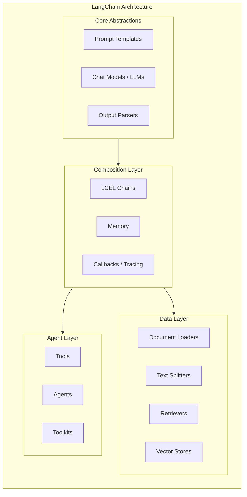
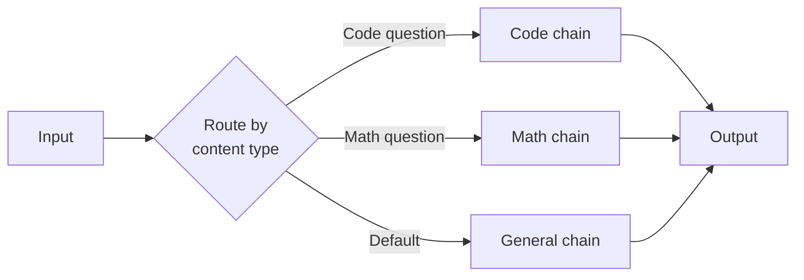
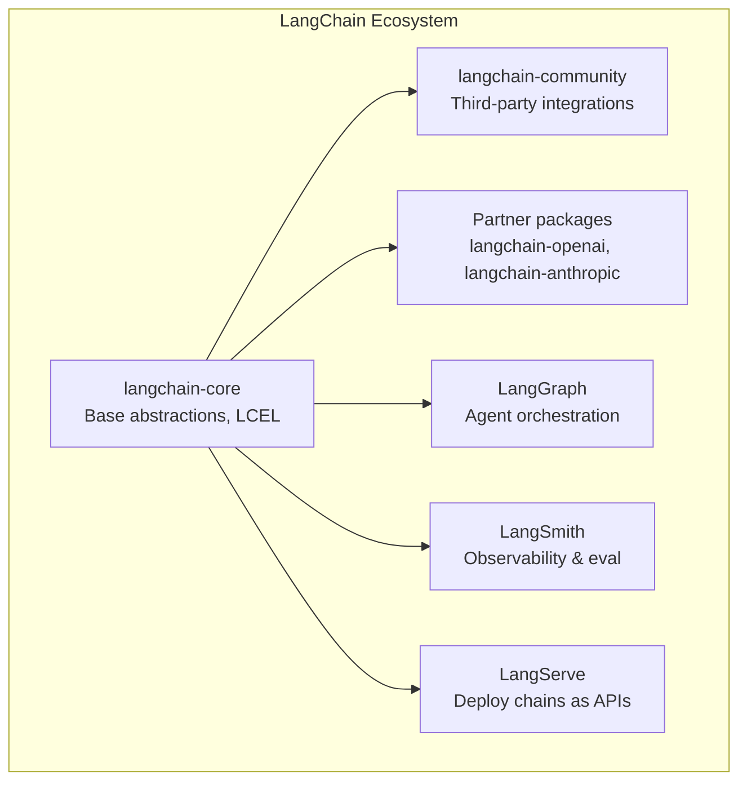

# LangChain Deep Dive

LangChain is an open-source framework for building applications powered by large language models. It provides a set of composable abstractions — prompts, chains, memory, tools, agents, retrievers — that let you wire up complex LLM workflows without reinventing the plumbing every time. Whether you are building a RAG pipeline, a conversational agent, or a multi-step reasoning system, LangChain gives you the Lego bricks to assemble it quickly.

This page covers LangChain's core architecture, the LangChain Expression Language (LCEL) that replaced the original chain API, document processing primitives, retrieval patterns, and the critical question: when should you use LangChain versus building from scratch?

## Why LangChain Exists

Every LLM application needs the same infrastructure:

1. **Prompt management** — Templating, variable injection, few-shot example selection
2. **Model abstraction** — Swapping between OpenAI, Anthropic, local models without rewriting code
3. **Output parsing** — Extracting structured data from free-text model responses
4. **Chaining** — Connecting multiple LLM calls in sequence or parallel
5. **Memory** — Maintaining conversation history across turns
6. **Retrieval** — Loading documents, chunking, embedding, and searching
7. **Tool use** — Letting models call functions, APIs, and databases

LangChain provides all of these as composable modules. Before LangChain, every team built these primitives from scratch. LangChain standardized them.



## Core Abstractions

### Prompt Templates

Prompt templates separate the static structure of a prompt from the dynamic variables. This is critical for versioning, testing, and reuse.

::: code-group

```python
from langchain_core.prompts import ChatPromptTemplate

# Simple template
prompt = ChatPromptTemplate.from_messages([
    ("system", "You are a {role}. Respond in {language}."),
    ("human", "{question}")
])

# Invoke with variables
formatted = prompt.invoke({
    "role": "senior Python developer",
    "language": "English",
    "question": "How do I handle connection pooling in asyncio?"
})
```

```typescript
import { ChatPromptTemplate } from "@langchain/core/prompts";

const prompt = ChatPromptTemplate.fromMessages([
  ["system", "You are a {role}. Respond in {language}."],
  ["human", "{question}"],
]);

const formatted = await prompt.invoke({
  role: "senior Python developer",
  language: "English",
  question: "How do I handle connection pooling in asyncio?",
});
```

:::

### Few-Shot Prompting

```python
from langchain_core.prompts import FewShotChatMessagePromptTemplate

examples = [
    {"input": "What is 2+2?", "output": "4"},
    {"input": "What is 3*7?", "output": "21"},
]

few_shot_prompt = FewShotChatMessagePromptTemplate(
    example_prompt=ChatPromptTemplate.from_messages([
        ("human", "{input}"),
        ("ai", "{output}"),
    ]),
    examples=examples,
)

final_prompt = ChatPromptTemplate.from_messages([
    ("system", "You are a math tutor."),
    few_shot_prompt,
    ("human", "{question}"),
])
```

### Chat Models

LangChain provides a unified interface across providers. Swap models by changing one import.

```python
from langchain_openai import ChatOpenAI
from langchain_anthropic import ChatAnthropic
from langchain_google_genai import ChatGoogleGenerativeAI

# All share the same interface
openai_model = ChatOpenAI(model="gpt-4o", temperature=0)
claude_model = ChatAnthropic(model="claude-sonnet-4-20250514", temperature=0)
gemini_model = ChatGoogleGenerativeAI(model="gemini-1.5-pro")

# Same call signature
response = openai_model.invoke("Explain ACID properties")
response = claude_model.invoke("Explain ACID properties")
```

### Output Parsers

Output parsers transform free-text LLM output into structured data. This is essential for any system that needs to act on model output programmatically.

```python
from langchain_core.output_parsers import JsonOutputParser
from pydantic import BaseModel, Field

class CodeReview(BaseModel):
    severity: str = Field(description="critical, warning, or info")
    line_number: int = Field(description="line number of the issue")
    message: str = Field(description="description of the issue")
    suggestion: str = Field(description="suggested fix")

parser = JsonOutputParser(pydantic_object=CodeReview)

prompt = ChatPromptTemplate.from_messages([
    ("system", "Review the following code. {format_instructions}"),
    ("human", "{code}")
])

chain = prompt | model | parser
result = chain.invoke({
    "code": "def foo(x): return x/0",
    "format_instructions": parser.get_format_instructions()
})
# result is a dict matching CodeReview schema
```

::: tip Prefer structured output over parsing
Modern LLMs (GPT-4o, Claude 3.5+) support native structured output via tool calling or JSON mode. Use `model.with_structured_output(CodeReview)` instead of output parsers when possible — it is more reliable and does not require format instructions in the prompt.
:::

## LCEL — LangChain Expression Language

LCEL is the modern way to compose LangChain components. It replaced the old `LLMChain`, `SequentialChain`, and `SimpleSequentialChain` classes with a pipe-based syntax inspired by Unix pipes.

### The Pipe Syntax

Every LCEL component implements the `Runnable` interface with three key methods:

- `invoke(input)` — Run synchronously
- `ainvoke(input)` — Run asynchronously
- `stream(input)` — Stream output tokens
- `batch(inputs)` — Process multiple inputs in parallel

Components are composed with the `|` operator:

::: code-group

```python
from langchain_core.prompts import ChatPromptTemplate
from langchain_openai import ChatOpenAI
from langchain_core.output_parsers import StrOutputParser

prompt = ChatPromptTemplate.from_template(
    "Explain {concept} in one paragraph for a {audience}."
)
model = ChatOpenAI(model="gpt-4o")
parser = StrOutputParser()

# LCEL chain: prompt -> model -> parser
chain = prompt | model | parser

# Invoke
result = chain.invoke({
    "concept": "database sharding",
    "audience": "junior developer"
})

# Stream tokens as they arrive
for chunk in chain.stream({
    "concept": "database sharding",
    "audience": "junior developer"
}):
    print(chunk, end="", flush=True)
```

```typescript
import { ChatPromptTemplate } from "@langchain/core/prompts";
import { ChatOpenAI } from "@langchain/openai";
import { StringOutputParser } from "@langchain/core/output_parsers";

const prompt = ChatPromptTemplate.fromTemplate(
  "Explain {concept} in one paragraph for a {audience}."
);
const model = new ChatOpenAI({ model: "gpt-4o" });
const parser = new StringOutputParser();

const chain = prompt.pipe(model).pipe(parser);

const result = await chain.invoke({
  concept: "database sharding",
  audience: "junior developer",
});
```

:::

### Parallel Execution with RunnableParallel

```python
from langchain_core.runnables import RunnableParallel, RunnablePassthrough

# Run multiple chains in parallel
analysis = RunnableParallel(
    summary=prompt_summary | model | StrOutputParser(),
    sentiment=prompt_sentiment | model | StrOutputParser(),
    keywords=prompt_keywords | model | JsonOutputParser(),
)

result = analysis.invoke({"text": "The product launch exceeded expectations..."})
# result = {"summary": "...", "sentiment": "...", "keywords": [...]}
```

### Conditional Routing with RunnableBranch

```python
from langchain_core.runnables import RunnableBranch

# Route based on input
router = RunnableBranch(
    (lambda x: "code" in x["question"].lower(), code_chain),
    (lambda x: "math" in x["question"].lower(), math_chain),
    general_chain,  # default
)

result = router.invoke({"question": "Write a Python function to sort a list"})
```



## Document Loaders & Text Splitters

LangChain has 160+ document loaders for ingesting data from virtually any source.

### Document Loaders

```python
from langchain_community.document_loaders import (
    PyPDFLoader,
    TextLoader,
    WebBaseLoader,
    GitLoader,
    NotionDirectoryLoader,
    CSVLoader,
)

# Load a PDF
loader = PyPDFLoader("architecture.pdf")
docs = loader.load()

# Load from the web
loader = WebBaseLoader("https://docs.example.com/api")
docs = loader.load()

# Load a Git repository
loader = GitLoader(
    clone_url="https://github.com/org/repo",
    branch="main",
    file_filter=lambda f: f.endswith(".py"),
)
docs = loader.load()
```

### Text Splitters

Raw documents are too large to embed or fit in context windows. Splitters break them into chunks while preserving semantic coherence.

```python
from langchain_text_splitters import (
    RecursiveCharacterTextSplitter,
    MarkdownHeaderTextSplitter,
    TokenTextSplitter,
)

# Recursive splitter — the default for most use cases
splitter = RecursiveCharacterTextSplitter(
    chunk_size=1000,
    chunk_overlap=200,
    separators=["\n\n", "\n", ". ", " ", ""],
)
chunks = splitter.split_documents(docs)

# Markdown-aware splitter — preserves heading hierarchy
md_splitter = MarkdownHeaderTextSplitter(
    headers_to_split_on=[
        ("#", "h1"),
        ("##", "h2"),
        ("###", "h3"),
    ]
)
md_chunks = md_splitter.split_text(markdown_text)
```

| Splitter | Best For | Strategy |
|----------|----------|----------|
| `RecursiveCharacterTextSplitter` | General-purpose text | Splits on paragraphs, then sentences, then words |
| `MarkdownHeaderTextSplitter` | Markdown/docs | Splits on headers, preserves hierarchy |
| `TokenTextSplitter` | Token-budget-aware | Splits by token count, not characters |
| `HTMLHeaderTextSplitter` | HTML pages | Splits by HTML heading tags |
| `CodeTextSplitter` | Source code | Language-aware (Python, JS, etc.) |

For deep coverage of chunking strategies, see [RAG Architecture](/ai-ml-engineering/rag-architecture).

## Retrieval Chains

The core value proposition of LangChain for most teams: wiring up a RAG pipeline in a few lines.

```python
from langchain_openai import OpenAIEmbeddings, ChatOpenAI
from langchain_community.vectorstores import Chroma
from langchain_core.prompts import ChatPromptTemplate
from langchain_core.output_parsers import StrOutputParser
from langchain_core.runnables import RunnablePassthrough

# 1. Create vector store from documents
embeddings = OpenAIEmbeddings(model="text-embedding-3-small")
vectorstore = Chroma.from_documents(chunks, embeddings)
retriever = vectorstore.as_retriever(search_kwargs={"k": 5})

# 2. Build RAG chain with LCEL
template = """Answer the question based only on the following context:

{context}

Question: {question}

If the context does not contain the answer, say "I don't have enough
information to answer that question."
"""
prompt = ChatPromptTemplate.from_template(template)
model = ChatOpenAI(model="gpt-4o", temperature=0)

rag_chain = (
    {"context": retriever, "question": RunnablePassthrough()}
    | prompt
    | model
    | StrOutputParser()
)

# 3. Query
answer = rag_chain.invoke("How do I configure connection pooling?")
```

### Conversational Retrieval

Adding memory to a retrieval chain so it can handle follow-up questions:

```python
from langchain_core.prompts import MessagesPlaceholder
from langchain_core.messages import HumanMessage, AIMessage

prompt = ChatPromptTemplate.from_messages([
    ("system", "Answer questions using the context below.\n\n{context}"),
    MessagesPlaceholder(variable_name="chat_history"),
    ("human", "{question}"),
])

# Condense follow-up questions into standalone queries
condense_prompt = ChatPromptTemplate.from_template(
    """Given this conversation history and a follow-up question,
    rephrase the follow-up as a standalone question.

    Chat history: {chat_history}
    Follow-up: {question}
    Standalone question:"""
)

condense_chain = condense_prompt | model | StrOutputParser()
```

For more on retrieval architectures, see [RAG Architecture](/ai-ml-engineering/rag-architecture) and [Vector Databases](/ai-ml-engineering/vector-databases).

## Memory

LangChain provides several memory implementations for maintaining state across conversation turns:

| Memory Type | How It Works | Best For |
|-------------|-------------|----------|
| `ConversationBufferMemory` | Stores all messages verbatim | Short conversations |
| `ConversationBufferWindowMemory` | Keeps last K messages | Medium conversations |
| `ConversationSummaryMemory` | Summarizes old messages via LLM | Long conversations |
| `ConversationSummaryBufferMemory` | Hybrid: recent verbatim + old summarized | Production use |
| `VectorStoreRetrieverMemory` | Embeds messages, retrieves relevant ones | Very long-running agents |

::: warning Memory is moving to LangGraph
LangChain's built-in memory classes are being deprecated in favor of [LangGraph](/ai-ml-engineering/langgraph) persistence. For new projects, use LangGraph's checkpointing system instead of LangChain memory classes.
:::

## Tool Calling and Agents

LangChain agents use LLMs to decide which tools to call and in what order. The modern approach uses the model's native tool-calling capability.

### Defining Tools

```python
from langchain_core.tools import tool

@tool
def search_database(query: str, limit: int = 10) -> str:
    """Search the product database for items matching the query.

    Args:
        query: Natural language search query
        limit: Maximum number of results to return
    """
    # Your database search logic here
    results = db.search(query, limit=limit)
    return json.dumps(results)

@tool
def get_weather(city: str) -> str:
    """Get the current weather for a city.

    Args:
        city: The city name (e.g., "San Francisco")
    """
    return weather_api.get(city)
```

### Binding Tools to Models

```python
from langchain_openai import ChatOpenAI

model = ChatOpenAI(model="gpt-4o")
model_with_tools = model.bind_tools([search_database, get_weather])

# The model can now decide to call tools
response = model_with_tools.invoke("What's the weather in Tokyo?")
# response.tool_calls = [{"name": "get_weather", "args": {"city": "Tokyo"}}]
```

### Building an Agent with LangGraph

The recommended way to build agents is now through [LangGraph](/ai-ml-engineering/langgraph), but here is the LangChain approach using `create_react_agent`:

```python
from langgraph.prebuilt import create_react_agent

agent = create_react_agent(
    model=ChatOpenAI(model="gpt-4o"),
    tools=[search_database, get_weather],
)

result = agent.invoke({
    "messages": [("human", "Find laptops under $1000 and check if it's good weather for a delivery in Seattle")]
})
```

For comprehensive agent architecture patterns, see [AI Agents Architecture](/ai-ml-engineering/ai-agents).

## LangChain Ecosystem



| Package | Purpose | When to Use |
|---------|---------|-------------|
| `langchain-core` | Base abstractions, LCEL | Always (minimal dependency) |
| `langchain-community` | Third-party integrations | When you need specific loaders/stores |
| `langchain-openai` | OpenAI integration | OpenAI models |
| `langchain-anthropic` | Anthropic integration | Claude models |
| `langgraph` | Graph-based agent orchestration | Complex agent workflows |
| `langsmith` | Tracing, evaluation, monitoring | Production debugging |
| `langserve` | Deploy chains as REST APIs | Serving LangChain in production |

## LangChain vs Building from Scratch

This is the most important question. LangChain is not always the right choice.

### When to Use LangChain

- **Prototyping and exploration.** LangChain's abstractions let you try ideas fast. Build a RAG pipeline in 20 lines, swap embedding models in one line, test different chunking strategies.
- **Standard patterns.** If you are building a straightforward RAG pipeline, conversational agent, or document Q&A system, LangChain's pre-built components save real time.
- **Multi-provider support.** If you need to switch between OpenAI, Anthropic, Google, and local models, LangChain's unified interface is valuable.
- **Integration breadth.** 160+ document loaders, 50+ vector stores, 30+ chat model integrations. The ecosystem is the product.

### When to Build from Scratch

- **Simple use cases.** If you are making a single API call to GPT-4o with structured output, you do not need LangChain. The OpenAI SDK is simpler and has fewer dependencies.
- **Performance-critical paths.** LangChain adds abstraction overhead. In latency-sensitive applications, direct API calls give you more control.
- **Deep customization.** If your pipeline does not fit LangChain's abstractions, you will fight the framework rather than benefit from it.
- **Production systems with specific requirements.** Teams that need fine-grained control over retries, caching, error handling, and observability often outgrow LangChain.

::: danger The abstraction trap
LangChain's biggest risk is hiding complexity that you need to understand. If you use LangChain without understanding how embeddings, vector search, and prompt construction work under the hood, you will not be able to debug production issues. Learn the fundamentals first — see [Embeddings](/ai-ml-engineering/embeddings), [RAG Architecture](/ai-ml-engineering/rag-architecture), and [LLM Integration](/ai-ml-engineering/llm-integration) — then decide if LangChain's abstractions save you time.
:::

### Decision Matrix

| Factor | LangChain | From Scratch |
|--------|-----------|-------------|
| **Time to prototype** | Hours | Days |
| **Production control** | Medium | Full |
| **Debugging transparency** | Low-Medium | High |
| **Dependency footprint** | Heavy | Minimal |
| **Model switching** | One line change | Rewrite adapters |
| **Community/examples** | Extensive | Build your own |
| **Long-term maintenance** | Tied to LangChain updates | Your own pace |

## Common Pitfalls

1. **Using deprecated patterns.** LangChain evolves fast. `LLMChain`, `ConversationalRetrievalChain`, and most `Chain` subclasses are deprecated. Use LCEL pipes instead.
2. **Over-abstracting.** Do not wrap LangChain in another abstraction layer. You end up debugging two frameworks.
3. **Ignoring token costs.** Memory classes like `ConversationBufferMemory` send the entire conversation history on every call. This gets expensive fast. Use windowed or summary memory.
4. **Skipping evaluation.** LangChain makes it easy to build pipelines but does not force you to evaluate them. Use [LangSmith](/ai-ml-engineering/langsmith) or build your own eval framework.
5. **Not reading the source.** When a LangChain abstraction does something unexpected, read the source code. The library is well-documented internally.

## Further Reading

- [RAG Architecture Deep Dive](/ai-ml-engineering/rag-architecture) — Chunking, retrieval, reranking, and evaluation
- [LangGraph](/ai-ml-engineering/langgraph) — Graph-based agent orchestration built on LangChain
- [LangSmith & LLM Observability](/ai-ml-engineering/langsmith) — Tracing and evaluation for LangChain applications
- [LlamaIndex](/ai-ml-engineering/llamaindex) — Alternative data framework, comparison with LangChain
- [AI Agents Architecture](/ai-ml-engineering/ai-agents) — Agent patterns that LangChain implements
- [Embeddings & Semantic Search](/ai-ml-engineering/embeddings) — The retrieval layer underneath LangChain
- [LangChain Documentation](https://python.langchain.com/docs/) — Official docs
- [LangChain GitHub](https://github.com/langchain-ai/langchain) — Source code and examples
