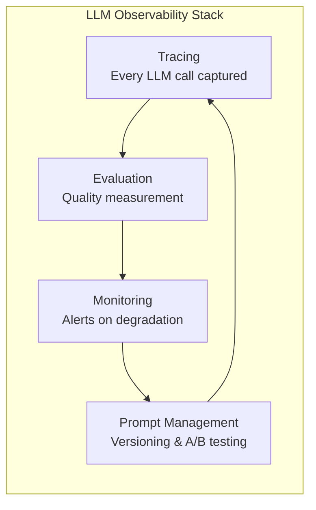
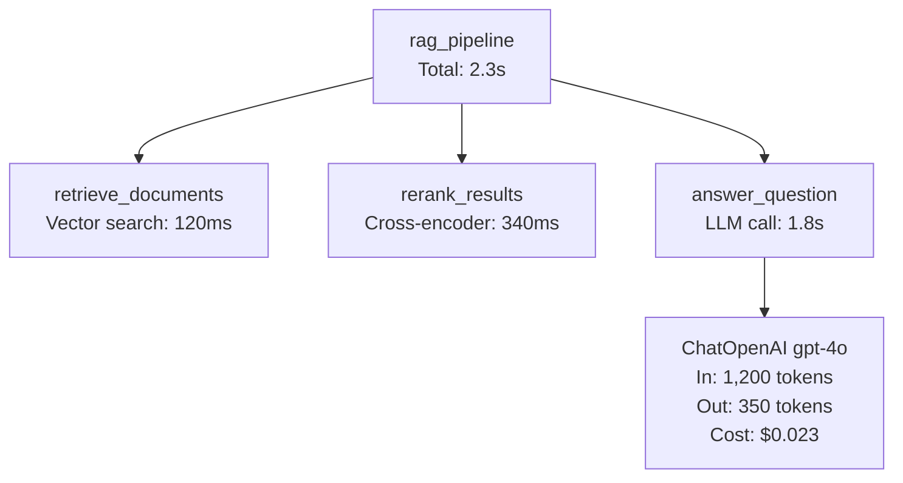
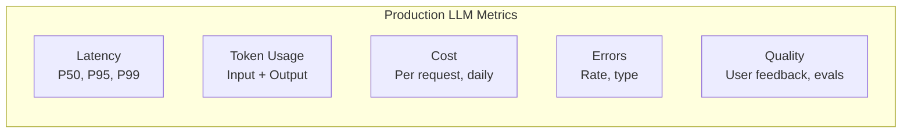
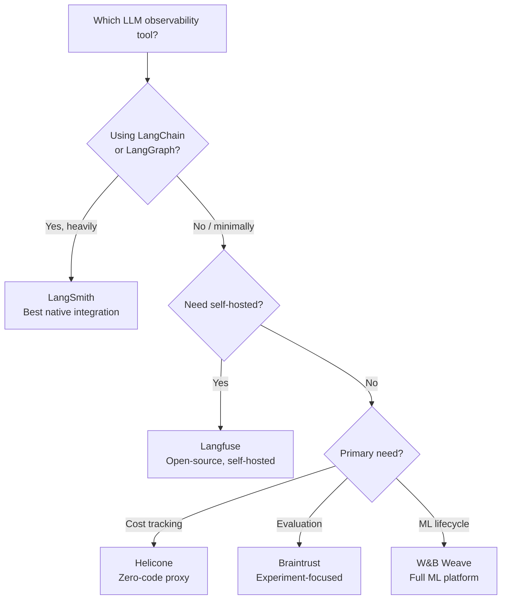

# LangSmith & LLM Observability

Traditional software is deterministic: given the same input, you get the same output. LLM applications are stochastic: the same prompt can produce different outputs every time, and "correctness" is often subjective. This fundamentally changes how you debug, test, and monitor these systems.

LLM observability is the practice of capturing every input, output, intermediate step, latency measurement, token count, and cost associated with your LLM calls — then using that data to debug failures, evaluate quality, and optimize performance. LangSmith is the observability platform built by the LangChain team, but the principles apply regardless of which tool you use.

## Why LLM Observability Is Different

In traditional software observability, you trace HTTP requests, measure response times, and count errors. LLM observability adds entirely new dimensions:

| Dimension | Traditional Software | LLM Applications |
|-----------|---------------------|-------------------|
| **Correctness** | Assert expected output | Subjective quality judgment |
| **Debugging** | Stack traces, logs | Full prompt + completion traces |
| **Performance** | Response time (ms) | Time to first token, total tokens, cost |
| **Regression** | Unit tests catch regressions | Output quality can silently degrade |
| **Cost** | Fixed per-request | Variable (proportional to token usage) |
| **Failures** | Exceptions, HTTP errors | Hallucinations, refusals, format errors |
| **Root cause** | Code bug | Prompt issue, context issue, model issue |



## What Is LangSmith

LangSmith is a platform for debugging, testing, evaluating, and monitoring LLM applications. It integrates natively with [LangChain](/ai-ml-engineering/langchain) and [LangGraph](/ai-ml-engineering/langgraph) but also works with any LLM application via its SDK.

### Core Capabilities

1. **Tracing** — Capture every LLM call with full input/output, latency, and token usage
2. **Evaluation** — Run your application against test datasets and score outputs
3. **Datasets** — Curate input/output pairs for testing and fine-tuning
4. **Prompt Hub** — Version, share, and A/B test prompts
5. **Monitoring** — Production dashboards, cost tracking, and alerting
6. **Annotation Queues** — Human review workflows for labeling outputs

## Tracing LLM Calls

### Automatic Tracing with LangChain

If you are using LangChain, tracing is a single environment variable:

```bash
export LANGCHAIN_TRACING_V2=true
export LANGCHAIN_API_KEY=lsv2_pt_xxxxx
export LANGCHAIN_PROJECT="my-rag-app"
```

Every LangChain/LangGraph call is automatically captured with:

- Full prompt (system message, user message, few-shot examples)
- Model response (text, tool calls, structured output)
- Latency (time to first token, total time)
- Token counts (input tokens, output tokens)
- Cost (calculated from token counts and model pricing)
- Metadata (model name, temperature, other parameters)

### Manual Tracing with the SDK

For non-LangChain applications:

```python
from langsmith import traceable, Client
from openai import OpenAI

client = OpenAI()
ls_client = Client()

@traceable(name="answer_question")
def answer_question(question: str, context: str) -> str:
    response = client.chat.completions.create(
        model="gpt-4o",
        messages=[
            {"role": "system", "content": f"Answer based on: {context}"},
            {"role": "user", "content": question},
        ],
        temperature=0,
    )
    return response.choices[0].message.content

@traceable(name="rag_pipeline")
def rag_pipeline(question: str) -> str:
    # Each @traceable function becomes a span in the trace
    context = retrieve_documents(question)
    answer = answer_question(question, context)
    return answer
```

```typescript
import { traceable } from "langsmith/traceable";
import OpenAI from "openai";

const openai = new OpenAI();

const answerQuestion = traceable(
  async (question: string, context: string) => {
    const response = await openai.chat.completions.create({
      model: "gpt-4o",
      messages: [
        { role: "system", content: `Answer based on: ${context}` },
        { role: "user", content: question },
      ],
    });
    return response.choices[0].message.content;
  },
  { name: "answer_question" }
);

const ragPipeline = traceable(
  async (question: string) => {
    const context = await retrieveDocuments(question);
    const answer = await answerQuestion(question, context);
    return answer;
  },
  { name: "rag_pipeline" }
);
```

### Trace Anatomy

A trace is a tree of spans. Each span represents one operation:



::: tip Trace everything, not just LLM calls
Trace retrieval, reranking, preprocessing, and postprocessing too. When quality degrades, the problem is often in the retrieval step, not the generation step. You cannot debug what you cannot see.
:::

## Evaluation

Evaluation is the most important capability. Without systematic evaluation, you are guessing whether your changes improve quality.

### Creating Datasets

```python
from langsmith import Client

client = Client()

# Create a dataset
dataset = client.create_dataset("rag-eval-v1", description="RAG quality evaluation")

# Add examples (input/output pairs)
client.create_examples(
    inputs=[
        {"question": "What is the refund policy?"},
        {"question": "How do I reset my password?"},
        {"question": "What payment methods are accepted?"},
    ],
    outputs=[
        {"answer": "Full refund within 30 days of purchase."},
        {"answer": "Go to Settings > Security > Reset Password."},
        {"answer": "We accept Visa, Mastercard, and PayPal."},
    ],
    dataset_id=dataset.id,
)
```

### Running Evaluations

```python
from langsmith.evaluation import evaluate

def my_app(inputs: dict) -> dict:
    """The application being evaluated."""
    question = inputs["question"]
    answer = rag_pipeline(question)
    return {"answer": answer}

# Define evaluators
def correctness(run, example) -> dict:
    """Check if the answer matches the expected output."""
    predicted = run.outputs["answer"]
    expected = example.outputs["answer"]

    # Use an LLM to judge correctness
    response = judge_model.invoke(
        f"Is this answer correct?\n"
        f"Expected: {expected}\n"
        f"Got: {predicted}\n"
        f"Score 1 if correct, 0 if incorrect."
    )
    score = int(response.content.strip())
    return {"key": "correctness", "score": score}

def answer_relevance(run, example) -> dict:
    """Check if the answer is relevant to the question."""
    question = example.inputs["question"]
    answer = run.outputs["answer"]

    response = judge_model.invoke(
        f"Rate the relevance of this answer to the question.\n"
        f"Question: {question}\n"
        f"Answer: {answer}\n"
        f"Score from 0.0 to 1.0:"
    )
    score = float(response.content.strip())
    return {"key": "relevance", "score": score}

# Run evaluation
results = evaluate(
    my_app,
    data="rag-eval-v1",
    evaluators=[correctness, answer_relevance],
    experiment_prefix="gpt-4o-v2-prompt",
)
```

### Built-in Evaluators

LangSmith provides pre-built evaluators for common tasks:

| Evaluator | What It Measures | Use Case |
|-----------|-----------------|----------|
| **Correctness** | Does the output match the reference? | Factual Q&A |
| **Helpfulness** | Is the output helpful to the user? | General chat |
| **Harmfulness** | Does the output contain harmful content? | Safety checks |
| **Hallucination** | Does the output contain unsupported claims? | RAG pipelines |
| **Exact match** | Does the output exactly match the reference? | Structured output |
| **String distance** | Edit distance from reference | Approximate matching |
| **Embedding distance** | Semantic similarity to reference | Meaning preservation |

### Regression Testing

Run evaluations on every code change to catch quality regressions:

```python
# CI/CD integration
# Run after every prompt or pipeline change
results = evaluate(
    my_app,
    data="rag-eval-v1",
    evaluators=[correctness, answer_relevance],
    experiment_prefix=f"ci-{git_commit_sha}",
)

# Fail the build if quality drops
avg_correctness = results.aggregate_metrics["correctness"]["mean"]
if avg_correctness < 0.85:
    raise Exception(
        f"Quality regression: correctness={avg_correctness:.2f}, threshold=0.85"
    )
```

::: warning Evaluate before you optimize
Build your evaluation dataset and benchmarks before changing prompts, models, or retrieval strategies. Without a baseline, you cannot tell whether your changes helped or hurt. See [AI in Production](/ai-ml-engineering/ai-in-production) for broader production patterns.
:::

## Prompt Versioning and A/B Testing

### LangSmith Prompt Hub

```python
from langsmith import Client

client = Client()

# Push a prompt to the hub
from langchain_core.prompts import ChatPromptTemplate

prompt = ChatPromptTemplate.from_messages([
    ("system", "You are a helpful customer support agent for {company}. "
               "Answer using only the provided context.\n\nContext: {context}"),
    ("human", "{question}"),
])

client.push_prompt("customer-support-v2", object=prompt, tags=["production"])

# Pull a specific version in your app
prompt = client.pull_prompt("customer-support-v2")

# Pull a specific commit
prompt = client.pull_prompt("customer-support-v2:abc123")
```

### A/B Testing Prompts

```python
import random

def get_prompt_variant() -> tuple[str, ChatPromptTemplate]:
    """Return a random prompt variant for A/B testing."""
    if random.random() < 0.5:
        return "v1-concise", client.pull_prompt("support-v1")
    else:
        return "v2-detailed", client.pull_prompt("support-v2")

@traceable(name="support_answer")
def answer_with_ab_test(question: str, context: str) -> str:
    variant, prompt = get_prompt_variant()
    # The variant name is captured in the trace metadata
    chain = prompt | model | StrOutputParser()
    return chain.invoke({
        "question": question,
        "context": context,
        "company": "Acme Inc",
    }, config={"metadata": {"prompt_variant": variant}})
```

## Monitoring in Production

### Key Metrics to Track



| Metric | What to Track | Alert Threshold |
|--------|--------------|-----------------|
| **Latency (P95)** | Time from request to complete response | > 10s for chat, > 30s for agents |
| **Token usage** | Average input + output tokens per request | > 2x baseline |
| **Cost per request** | Dollar cost per API call | > 2x baseline |
| **Error rate** | API errors, timeouts, format failures | > 5% |
| **Hallucination rate** | Unsupported claims (sampled evaluation) | > 10% |
| **User feedback** | Thumbs up/down, explicit ratings | Satisfaction < 80% |

### Feedback Collection

```python
from langsmith import Client

client = Client()

# After a user gives feedback
client.create_feedback(
    run_id=run_id,  # from the trace
    key="user_rating",
    score=1,  # thumbs up
    comment="Accurate and helpful response",
)

# Query feedback for analysis
feedbacks = client.list_feedback(run_ids=[run_id])
```

## Alternatives to LangSmith

LangSmith is not the only option. Here is how the major alternatives compare:

| Feature | LangSmith | Langfuse | Helicone | Braintrust | W&B Weave |
|---------|-----------|----------|----------|------------|-----------|
| **Tracing** | Full trace tree | Full trace tree | Request-level | Full trace tree | Full trace tree |
| **Evaluation** | Built-in evaluators | Custom evaluators | Limited | Strong evaluators | Experiment tracking |
| **Datasets** | Built-in | Built-in | No | Built-in | Built-in |
| **Prompt management** | Prompt Hub | Prompt management | No | Prompt playground | No |
| **Self-hosted** | Enterprise only | Yes (OSS) | Yes (OSS) | No | No |
| **Pricing** | Free tier + paid | Free tier + paid | Free tier + paid | Free tier + paid | Free tier + paid |
| **LangChain integration** | Native | SDK decorator | Proxy | SDK decorator | SDK decorator |
| **Non-LangChain** | SDK support | SDK support | Proxy (any provider) | SDK support | SDK support |
| **Best for** | LangChain/LangGraph users | Self-hosted, OSS | Simple cost tracking | Evaluation-focused | ML teams using W&B |

### Langfuse

Open-source, self-hostable. Strong choice for teams that need data sovereignty or want to avoid vendor lock-in.

```python
from langfuse.decorators import observe, langfuse_context

@observe()
def rag_pipeline(question: str) -> str:
    context = retrieve(question)
    answer = generate(question, context)
    langfuse_context.update_current_observation(
        metadata={"model": "gpt-4o", "context_length": len(context)}
    )
    return answer
```

### Helicone

Works as a proxy — change your API base URL and every request is automatically logged. Zero code changes.

```python
from openai import OpenAI

# Just change the base URL
client = OpenAI(
    base_url="https://oai.helicone.ai/v1",
    default_headers={
        "Helicone-Auth": f"Bearer {helicone_api_key}",
    },
)

# All calls are now traced through Helicone
response = client.chat.completions.create(
    model="gpt-4o",
    messages=[{"role": "user", "content": "Hello"}],
)
```

### Braintrust

Strongest evaluation features. Purpose-built for running experiments and comparing prompt/model variants.

```python
from braintrust import Eval

Eval(
    "rag-quality",
    data=lambda: [
        {"input": {"q": "What is the refund policy?"}, "expected": "30-day refund"},
        {"input": {"q": "How to reset password?"}, "expected": "Settings > Security"},
    ],
    task=lambda input: rag_pipeline(input["q"]),
    scores=[Factuality, AnswerRelevancy],
)
```

### Choosing an Observability Tool



::: tip Start with any tool, just start
The worst observability is no observability. Pick any tool from this list and instrument your LLM calls today. You can migrate later. The data you capture now is invaluable for debugging the production issue you will have next week.
:::

## Building Your Own Observability

If you prefer not to use a third-party tool, here is the minimum viable observability setup:

```python
import time
import json
import logging
from dataclasses import dataclass, asdict

logger = logging.getLogger("llm_observability")

@dataclass
class LLMTrace:
    request_id: str
    model: str
    input_messages: list
    output: str
    input_tokens: int
    output_tokens: int
    latency_ms: float
    cost_usd: float
    error: str | None = None
    metadata: dict | None = None

def trace_llm_call(func):
    def wrapper(*args, **kwargs):
        start = time.perf_counter()
        request_id = str(uuid.uuid4())
        try:
            response = func(*args, **kwargs)
            latency = (time.perf_counter() - start) * 1000
            trace = LLMTrace(
                request_id=request_id,
                model=kwargs.get("model", "unknown"),
                input_messages=kwargs.get("messages", []),
                output=response.choices[0].message.content,
                input_tokens=response.usage.prompt_tokens,
                output_tokens=response.usage.completion_tokens,
                latency_ms=latency,
                cost_usd=calculate_cost(response.usage, kwargs["model"]),
            )
            logger.info(json.dumps(asdict(trace)))
            return response
        except Exception as e:
            latency = (time.perf_counter() - start) * 1000
            logger.error(json.dumps({
                "request_id": request_id,
                "error": str(e),
                "latency_ms": latency,
            }))
            raise
    return wrapper
```

## Further Reading

- [LangChain Deep Dive](/ai-ml-engineering/langchain) — The framework LangSmith was built to observe
- [LangGraph](/ai-ml-engineering/langgraph) — Agent orchestration with built-in LangSmith tracing
- [AI in Production](/ai-ml-engineering/ai-in-production) — Broader production patterns for AI systems
- [AI Safety & Guardrails](/ai-ml-engineering/ai-guardrails) — Monitoring for safety-critical outputs
- [Prompt Caching & Context Management](/ai-ml-engineering/prompt-caching) — Cost optimization that observability reveals
- [LangSmith Documentation](https://docs.smith.langchain.com/) — Official docs
- [Langfuse Documentation](https://langfuse.com/docs) — Open-source alternative
