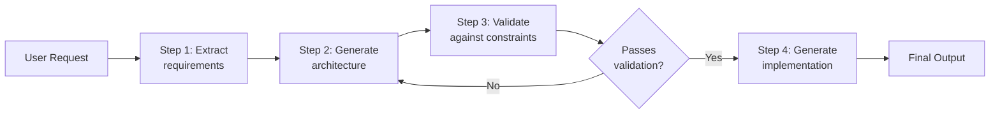
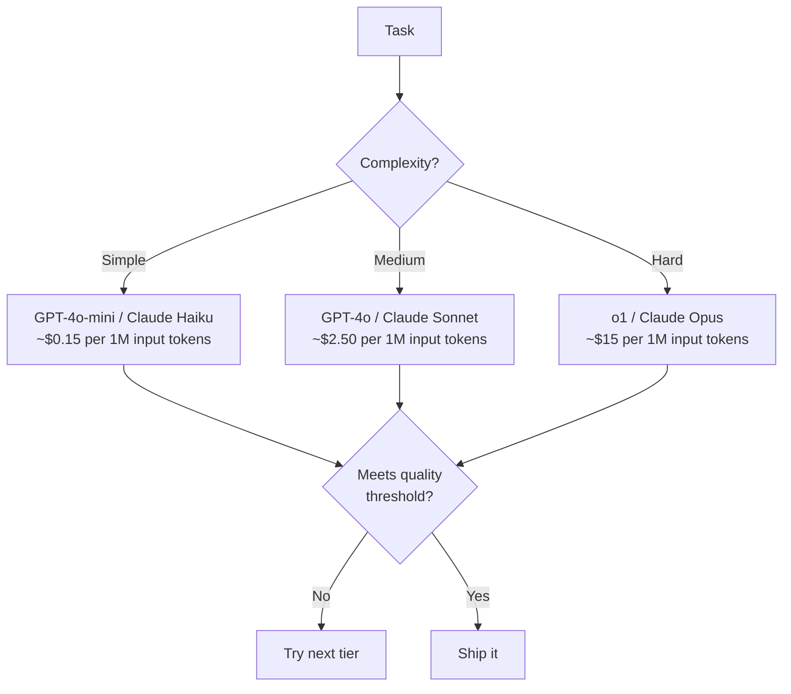

# LLM Integration Patterns

Every LLM integration starts the same way: you send text in, you get text out. But the difference between a weekend hack and a production system lies in how you structure that interaction — how you engineer prompts, enforce output schemas, handle streaming, chain multiple calls, and keep costs from spiraling.

This page covers the patterns that make LLM integrations reliable, predictable, and affordable at scale.

## Chat Completions: The Foundation

The chat completions API is the universal interface for modern LLMs. Regardless of provider — OpenAI, Anthropic, Google, or open-source — the pattern is the same: you send a list of messages with roles, and receive a completion.

```python
from openai import OpenAI

client = OpenAI()

response = client.chat.completions.create(
    model="gpt-4o",
    messages=[
        {
            "role": "system",
            "content": "You are a senior backend engineer reviewing code for security vulnerabilities."
        },
        {
            "role": "user",
            "content": "Review this SQL query builder:\n\n```python\ndef get_user(name):\n    return db.execute(f'SELECT * FROM users WHERE name = \"{name}\"')\n```"
        }
    ],
    temperature=0.2,
    max_tokens=1024,
)

print(response.choices[0].message.content)
```

### Key Parameters

| Parameter | What It Controls | Production Guidance |
|-----------|-----------------|---------------------|
| `model` | Which model to use | Start with the cheapest model that meets quality; upgrade selectively |
| `temperature` | Randomness (0-2) | Use 0-0.3 for deterministic tasks, 0.7-1.0 for creative tasks |
| `max_tokens` | Output length cap | Always set this; prevents runaway costs on verbose responses |
| `top_p` | Nucleus sampling | Alternative to temperature; do not set both |
| `stop` | Stop sequences | Use to prevent the model from rambling past the answer |
| `seed` | Reproducibility | Set for deterministic outputs in testing |

::: warning Temperature and top_p
Do not set both `temperature` and `top_p` in the same request. They are alternative sampling strategies. Pick one. For most production use cases, `temperature` between 0 and 0.3 is what you want.
:::

## Prompt Engineering Fundamentals

Prompt engineering is not guesswork. It is a structured discipline with repeatable techniques. The best prompts share five properties: they define a **role**, provide **context**, specify the **task**, constrain the **format**, and set **guardrails**.

### The RCFTG Framework

```
Role:       Who should the model act as?
Context:    What background information does it need?
Format:     How should the output be structured?
Task:       What specifically should it do?
Guardrails: What should it avoid or always include?
```

### Example: Structured Prompt

```python
SYSTEM_PROMPT = """You are a senior database engineer with 15 years of PostgreSQL experience.

Context:
- The application uses PostgreSQL 16 with pgvector extension
- The table has 50 million rows
- Read-to-write ratio is 100:1
- P99 latency target is 50ms

Task:
Analyze the provided query and suggest optimizations.

Format:
Return your analysis as a JSON object with this structure:
{
  "issues": [{"description": "...", "severity": "high|medium|low"}],
  "optimized_query": "...",
  "expected_improvement": "...",
  "index_suggestions": ["..."]
}

Guardrails:
- Do not suggest changes that sacrifice data consistency
- All index suggestions must consider write amplification
- If the query is already optimal, say so explicitly
"""
```

### Few-Shot Prompting

Providing examples in the prompt is one of the most reliable techniques for controlling output quality and format:

```python
messages = [
    {"role": "system", "content": "Convert natural language to SQL. Use PostgreSQL syntax."},
    {"role": "user", "content": "Find all users who signed up last month"},
    {"role": "assistant", "content": "SELECT * FROM users WHERE created_at >= date_trunc('month', CURRENT_DATE - INTERVAL '1 month') AND created_at < date_trunc('month', CURRENT_DATE);"},
    {"role": "user", "content": "Count orders by status for the last 7 days"},
    {"role": "assistant", "content": "SELECT status, COUNT(*) as order_count FROM orders WHERE created_at >= CURRENT_DATE - INTERVAL '7 days' GROUP BY status ORDER BY order_count DESC;"},
    {"role": "user", "content": actual_user_query},  # The real query
]
```

### Chain-of-Thought Prompting

For complex reasoning, instruct the model to think step by step. This dramatically improves accuracy on multi-step problems:

```python
SYSTEM_PROMPT = """You are a distributed systems architect.

When analyzing a design, follow this process:
1. Identify the core requirements (functional and non-functional)
2. List the components and their responsibilities
3. Analyze each potential failure mode
4. Evaluate consistency vs availability tradeoffs
5. Provide your final recommendation with justification

Think through each step explicitly before giving your answer.
"""
```

## Function Calling and Tool Use

Function calling lets the model invoke structured functions rather than generating free-form text. This is how you connect LLMs to external systems — databases, APIs, calculators, code executors.

```python
import json
from openai import OpenAI

client = OpenAI()

tools = [
    {
        "type": "function",
        "function": {
            "name": "get_deployment_status",
            "description": "Get the current deployment status for a service in a given environment",
            "parameters": {
                "type": "object",
                "properties": {
                    "service_name": {
                        "type": "string",
                        "description": "The name of the service, e.g., 'auth-api', 'payment-service'"
                    },
                    "environment": {
                        "type": "string",
                        "enum": ["staging", "production", "development"],
                        "description": "The deployment environment"
                    }
                },
                "required": ["service_name", "environment"]
            }
        }
    },
    {
        "type": "function",
        "function": {
            "name": "rollback_deployment",
            "description": "Rollback a service to a previous version. Only use when explicitly requested.",
            "parameters": {
                "type": "object",
                "properties": {
                    "service_name": {"type": "string"},
                    "environment": {"type": "string", "enum": ["staging", "production"]},
                    "target_version": {"type": "string", "description": "Semantic version to rollback to"}
                },
                "required": ["service_name", "environment", "target_version"]
            }
        }
    }
]

response = client.chat.completions.create(
    model="gpt-4o",
    messages=[{"role": "user", "content": "What's the status of auth-api in production?"}],
    tools=tools,
    tool_choice="auto",
)

# Handle the function call
tool_call = response.choices[0].message.tool_calls[0]
function_name = tool_call.function.name
arguments = json.loads(tool_call.function.arguments)

# Execute the actual function
result = get_deployment_status(**arguments)

# Send the result back to the model
follow_up = client.chat.completions.create(
    model="gpt-4o",
    messages=[
        {"role": "user", "content": "What's the status of auth-api in production?"},
        response.choices[0].message,
        {
            "role": "tool",
            "tool_call_id": tool_call.id,
            "content": json.dumps(result),
        }
    ],
    tools=tools,
)
```

### Function Calling Best Practices

| Practice | Why |
|----------|-----|
| Write detailed `description` fields | The model uses descriptions to decide when to call functions |
| Use `enum` for constrained parameters | Prevents invalid values without post-validation |
| Mark destructive functions clearly | Add "Only use when explicitly requested" to descriptions |
| Validate arguments server-side | Never trust model-generated arguments blindly |
| Set `tool_choice` intentionally | Use `"required"` when a tool call is mandatory, `"auto"` when optional |

::: danger Never trust model-generated arguments
The model can hallucinate function arguments. Always validate inputs server-side before executing. Treat tool call arguments like untrusted user input — sanitize, validate, and constrain.
:::

## Structured Output (JSON Mode)

When you need the model to return structured data, do not rely on prompt instructions alone. Use structured output enforcement.

### OpenAI JSON Mode

```python
from openai import OpenAI
from pydantic import BaseModel

client = OpenAI()

class CodeReview(BaseModel):
    file_path: str
    issues: list[dict]
    overall_score: int
    summary: str

response = client.beta.chat.completions.parse(
    model="gpt-4o",
    messages=[
        {"role": "system", "content": "Analyze the provided code and return a structured review."},
        {"role": "user", "content": code_to_review},
    ],
    response_format=CodeReview,
)

review = response.choices[0].message.parsed
print(f"Score: {review.overall_score}/10")
```

### Anthropic Structured Output

```python
import anthropic
import json

client = anthropic.Anthropic()

response = client.messages.create(
    model="claude-sonnet-4-20250514",
    max_tokens=1024,
    system="""Return your analysis as valid JSON matching this schema:
{
  "vulnerabilities": [{"type": "string", "severity": "critical|high|medium|low", "line": "number", "fix": "string"}],
  "safe": "boolean"
}
Return ONLY the JSON object. No markdown, no explanation.""",
    messages=[{"role": "user", "content": f"Analyze this code for security issues:\n\n{code}"}],
)

result = json.loads(response.content[0].text)
```

### TypeScript with Zod Schema

```typescript
import OpenAI from 'openai';
import { z } from 'zod';
import { zodResponseFormat } from 'openai/helpers/zod';

const ReviewSchema = z.object({
  issues: z.array(z.object({
    description: z.string(),
    severity: z.enum(['critical', 'high', 'medium', 'low']),
    line_number: z.number().optional(),
    suggestion: z.string(),
  })),
  overall_quality: z.enum(['excellent', 'good', 'needs_work', 'poor']),
  summary: z.string(),
});

const client = new OpenAI();

const response = await client.beta.chat.completions.parse({
  model: 'gpt-4o',
  messages: [
    { role: 'system', content: 'Review the provided code.' },
    { role: 'user', content: codeToReview },
  ],
  response_format: zodResponseFormat(ReviewSchema, 'code_review'),
});

const review = response.choices[0].message.parsed;
// review is fully typed as z.infer<typeof ReviewSchema>
```

## Prompt Chaining and Composition

Complex tasks should not be crammed into a single prompt. Break them into a chain of focused prompts where each step has a clear input, output, and success criterion.



### Implementation Pattern

```python
async def generate_api_design(user_request: str) -> dict:
    # Step 1: Extract requirements
    requirements = await llm_call(
        system="Extract functional and non-functional requirements from this request.",
        user=user_request,
        response_format=RequirementsSchema,
        model="gpt-4o-mini",  # Cheap model for extraction
    )

    # Step 2: Generate API design
    api_design = await llm_call(
        system="Design a RESTful API based on these requirements.",
        user=json.dumps(requirements),
        response_format=ApiDesignSchema,
        model="gpt-4o",  # Stronger model for design
    )

    # Step 3: Validate
    validation = await llm_call(
        system="Validate this API design against REST best practices and the original requirements. Return issues found.",
        user=json.dumps({"requirements": requirements, "design": api_design}),
        response_format=ValidationSchema,
        model="gpt-4o",
    )

    # Step 4: If issues found, refine
    if validation["issues"]:
        api_design = await llm_call(
            system="Fix these issues in the API design while maintaining all original requirements.",
            user=json.dumps({"design": api_design, "issues": validation["issues"]}),
            response_format=ApiDesignSchema,
            model="gpt-4o",
        )

    return api_design
```

### When to Chain vs. Single Prompt

| Use Single Prompt | Use Chain |
|---|---|
| Simple extraction or classification | Multi-step reasoning |
| The output is short and well-defined | The task has validation steps |
| Latency is critical (real-time) | Quality is critical (batch) |
| You can fit everything in context | Each step needs different expertise |

## Streaming Responses

For user-facing applications, streaming is not optional. Users perceive streaming responses as faster even when total latency is identical. Time-to-first-token matters more than total generation time.

```typescript
import OpenAI from 'openai';

const client = new OpenAI();

async function streamResponse(userMessage: string): Promise<void> {
  const stream = await client.chat.completions.create({
    model: 'gpt-4o',
    messages: [{ role: 'user', content: userMessage }],
    stream: true,
  });

  for await (const chunk of stream) {
    const content = chunk.choices[0]?.delta?.content;
    if (content) {
      process.stdout.write(content); // Or send via SSE/WebSocket
    }
  }
}
```

### Server-Sent Events (SSE) for Web Apps

```typescript
// Express.js SSE endpoint
app.post('/api/chat', async (req, res) => {
  res.setHeader('Content-Type', 'text/event-stream');
  res.setHeader('Cache-Control', 'no-cache');
  res.setHeader('Connection', 'keep-alive');

  const stream = await client.chat.completions.create({
    model: 'gpt-4o',
    messages: req.body.messages,
    stream: true,
  });

  for await (const chunk of stream) {
    const content = chunk.choices[0]?.delta?.content;
    if (content) {
      res.write(`data: ${JSON.stringify({ content })}\n\n`);
    }
  }

  res.write('data: [DONE]\n\n');
  res.end();
});
```

### Streaming with Function Calls

When streaming with tools, you need to accumulate tool call arguments across chunks:

```python
collected_tool_calls = {}

async for chunk in stream:
    delta = chunk.choices[0].delta

    if delta.tool_calls:
        for tc in delta.tool_calls:
            idx = tc.index
            if idx not in collected_tool_calls:
                collected_tool_calls[idx] = {
                    "id": tc.id,
                    "function": {"name": tc.function.name, "arguments": ""}
                }
            if tc.function.arguments:
                collected_tool_calls[idx]["function"]["arguments"] += tc.function.arguments
```

## Cost Optimization and Model Selection

LLM costs scale linearly with usage. Without deliberate optimization, a system that costs $50/month in development can cost $50,000/month in production.

### The Model Selection Matrix



### Cost Optimization Techniques

| Technique | Savings | Implementation Effort |
|-----------|---------|----------------------|
| **Prompt caching** | 50-90% on repeated prefixes | Low — supported natively by Anthropic, OpenAI |
| **Model routing** | 40-70% | Medium — classify task difficulty, route to cheapest capable model |
| **Semantic caching** | 30-80% for repeated queries | Medium — embed queries, check similarity before calling API |
| **Prompt compression** | 20-40% | Low — remove redundant instructions, use concise language |
| **Batch API** | 50% | Low — use batch endpoints for non-real-time tasks |
| **Output length limits** | 10-30% | Low — set `max_tokens` appropriately |

### Semantic Caching Implementation

```python
import hashlib
import numpy as np
from redis import Redis

class SemanticCache:
    def __init__(self, embedding_model, redis_client: Redis, threshold: float = 0.95):
        self.embed = embedding_model
        self.redis = redis_client
        self.threshold = threshold

    async def get_or_generate(self, prompt: str, generate_fn):
        # Generate embedding for the prompt
        query_embedding = await self.embed(prompt)

        # Check cache for similar prompts
        cached = self._find_similar(query_embedding)
        if cached:
            return cached["response"]

        # Cache miss — generate and store
        response = await generate_fn(prompt)
        self._store(prompt, query_embedding, response)
        return response

    def _find_similar(self, embedding):
        # Use Redis vector similarity search
        results = self.redis.ft("prompt_cache").search(
            f"@embedding:[VECTOR_RANGE $radius $vec]",
            query_params={"radius": 1 - self.threshold, "vec": embedding.tobytes()}
        )
        return results.docs[0] if results.docs else None
```

### Model Routing Pattern

```python
from enum import Enum

class TaskComplexity(Enum):
    SIMPLE = "simple"      # Classification, extraction, formatting
    MEDIUM = "medium"      # Summarization, code generation, analysis
    COMPLEX = "complex"    # Multi-step reasoning, novel problem solving

MODEL_MAP = {
    TaskComplexity.SIMPLE: "gpt-4o-mini",
    TaskComplexity.MEDIUM: "gpt-4o",
    TaskComplexity.COMPLEX: "o1",
}

async def classify_and_route(prompt: str) -> str:
    # Use the cheapest model to classify task complexity
    complexity = await llm_call(
        model="gpt-4o-mini",
        system="Classify the complexity of this task as 'simple', 'medium', or 'complex'.",
        user=prompt,
    )

    target_model = MODEL_MAP[TaskComplexity(complexity)]
    return await llm_call(model=target_model, user=prompt)
```

## Error Handling and Resilience

Production LLM integrations must handle failures gracefully. Models go down, rate limits hit, and outputs are sometimes invalid.

```python
import asyncio
from tenacity import retry, stop_after_attempt, wait_exponential, retry_if_exception_type
from openai import RateLimitError, APITimeoutError, APIConnectionError

@retry(
    retry=retry_if_exception_type((RateLimitError, APITimeoutError, APIConnectionError)),
    wait=wait_exponential(multiplier=1, min=1, max=60),
    stop=stop_after_attempt(3),
)
async def resilient_llm_call(messages: list, model: str = "gpt-4o") -> str:
    try:
        response = await client.chat.completions.create(
            model=model,
            messages=messages,
            timeout=30,
        )
        return response.choices[0].message.content
    except RateLimitError:
        # Log and retry with exponential backoff (handled by tenacity)
        raise
    except APITimeoutError:
        # Try a faster model as fallback
        if model != "gpt-4o-mini":
            return await resilient_llm_call(messages, model="gpt-4o-mini")
        raise
```

### Multi-Provider Fallback

```python
PROVIDERS = [
    {"name": "openai", "model": "gpt-4o", "client": openai_client},
    {"name": "anthropic", "model": "claude-sonnet-4-20250514", "client": anthropic_client},
    {"name": "openai_fallback", "model": "gpt-4o-mini", "client": openai_client},
]

async def call_with_fallback(messages: list) -> str:
    for provider in PROVIDERS:
        try:
            return await call_provider(provider, messages)
        except Exception as e:
            logger.warning(f"Provider {provider['name']} failed: {e}")
            continue

    raise Exception("All LLM providers failed")
```

::: tip Observability is non-negotiable
Log every LLM call with: model, token count (input + output), latency, cost, and whether the response was valid. Without this data, you cannot optimize cost, debug quality issues, or detect regressions.
:::

## Further Reading

- [RAG Architecture Deep Dive](/ai-ml-engineering/rag-architecture) — Build retrieval pipelines that give LLMs access to your data
- [AI Agents Architecture](/ai-ml-engineering/ai-agents) — Build autonomous agents with tool use and planning
- [Embeddings & Semantic Search](/ai-ml-engineering/embeddings) — Understand the vector representations that power semantic search
- [Prompt Engineering](/prompt-engineering/) — 500+ battle-tested prompts across engineering workflows
