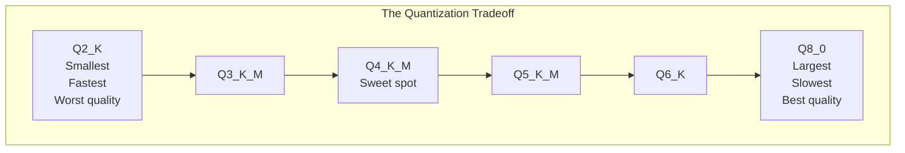
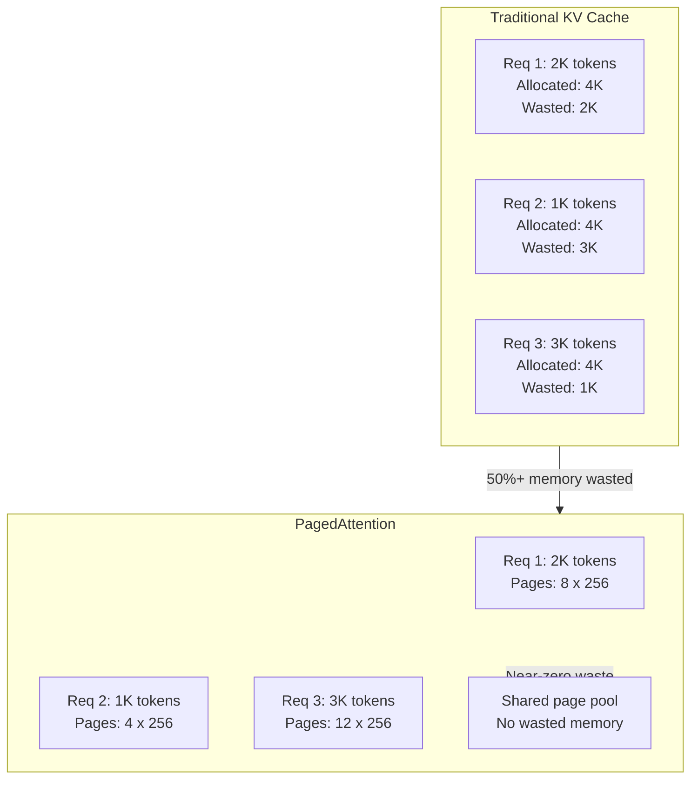
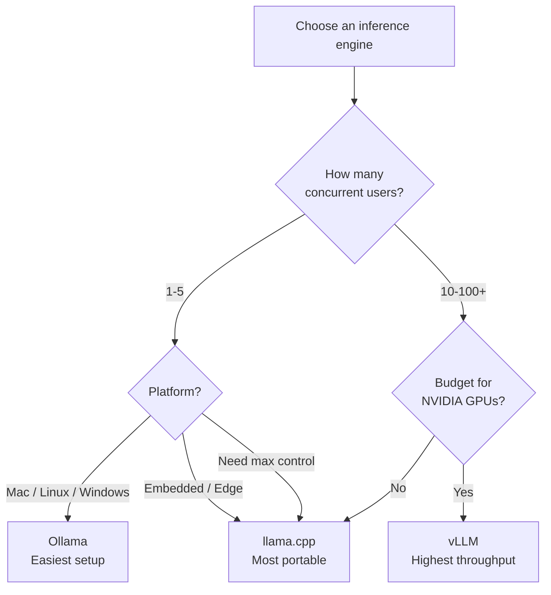
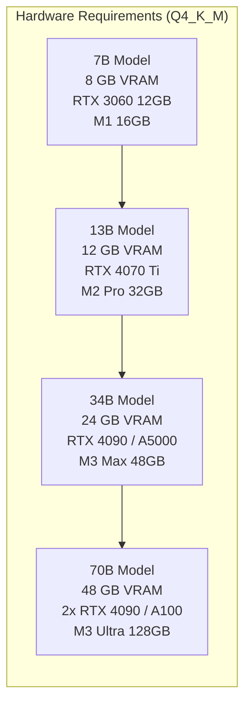
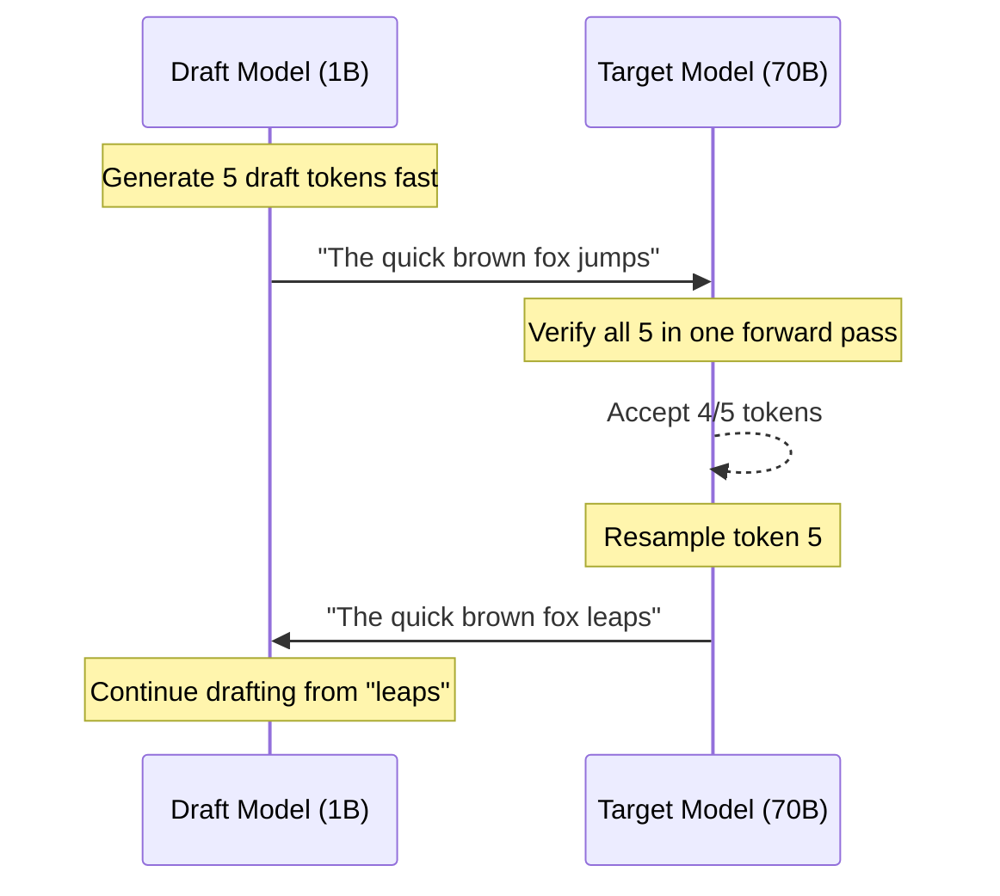

# Local LLMs Guide

Running large language models on your own hardware changes the economics and privacy calculus of AI entirely. No API keys, no usage bills, no data leaving your network, no vendor deciding what you can and cannot generate. The tooling has matured to the point where a developer with a decent laptop can run models that rival GPT-3.5 in quality — and with the right GPU, models that compete with GPT-4 on many tasks.

This page covers the full stack of local LLM inference: the engines that run models (Ollama, llama.cpp, vLLM), the quantization formats that make them fit in memory (GGUF), the hardware that powers them, the models worth running, and the integration patterns that let you swap a local model into any application that currently calls the OpenAI API.

## Why Run LLMs Locally?

Six reasons justify running LLMs on your own hardware instead of calling a cloud API:

### 1. Privacy — Data Never Leaves Your Machine

When you send a prompt to OpenAI, Anthropic, or Google, your data traverses the internet and lands on their servers. Even with data processing agreements, you are trusting a third party with potentially sensitive information: customer data, proprietary code, internal documents, medical records, legal briefs.

Local inference eliminates this entirely. The model runs in your process, on your hardware. Nothing is transmitted.

::: warning This matters more than you think
HIPAA, GDPR, SOC 2, and many enterprise security policies have strict rules about where data can be processed. A local model is often the only way to use LLMs on sensitive data without a lengthy compliance review.
:::

### 2. Cost — No API Bills

API pricing adds up fast:

| Usage Pattern | Monthly API Cost (GPT-4o) | Local Cost (One-Time) |
|---------------|---------------------------|----------------------|
| 100 requests/day, 2K tokens avg | ~$180/month | $0 after hardware |
| 1,000 requests/day, 2K tokens avg | ~$1,800/month | $0 after hardware |
| 10,000 requests/day, 2K tokens avg | ~$18,000/month | $0 after hardware |
| Batch processing 1M documents | $50,000+ | $0 after hardware |

A $2,000 GPU pays for itself in weeks for high-volume use cases.

### 3. Latency — No Network Round Trip

Cloud API calls have inherent latency: DNS resolution, TLS handshake, network transit, server queuing, and the response streaming back. Typical first-token latency for a cloud API is 500ms-2s.

A local model on a decent GPU delivers first-token latency of 20-100ms. For interactive applications, code completion, or real-time agents, this difference is transformative.

### 4. Offline Access

Local models work on an airplane, in a secure facility with no internet, or during a cloud provider outage. If your application depends on AI, local inference removes a critical point of failure.

### 5. Customization

With local models you control every parameter: temperature, repetition penalty, stop tokens, system prompt length, context window size, sampling strategy. You can modify the model itself — merge LoRA adapters, experiment with quantization levels, and switch models in seconds.

### 6. Censorship-Free

Cloud API providers apply content filters and safety layers. For legitimate use cases — security research, creative writing, medical question-answering, legal analysis — these filters can block valid outputs. A local model has no filters unless you add them.

::: tip The real calculus
Most teams end up with a hybrid: cloud APIs for the hardest tasks (reasoning, complex code generation) and local models for high-volume, latency-sensitive, or privacy-critical workloads. Running everything locally is rarely optimal. Running nothing locally leaves money and capability on the table.
:::

---

## Ollama

Ollama is the simplest way to run LLMs locally. It packages model weights, configuration, and a runtime into a single tool with a Docker-like experience: `ollama run llama3` and you are in a chat session.

### Installation

::: code-group
```bash [macOS]
# Homebrew
brew install ollama

# Or direct download
curl -fsSL https://ollama.com/install.sh | sh
```

```bash [Linux]
# One-line install
curl -fsSL https://ollama.com/install.sh | sh

# Or manual install
wget https://github.com/ollama/ollama/releases/latest/download/ollama-linux-amd64
chmod +x ollama-linux-amd64
sudo mv ollama-linux-amd64 /usr/local/bin/ollama
```

```powershell [Windows]
# Download the installer from https://ollama.com/download/windows
# Or use winget:
winget install Ollama.Ollama

# After installation, Ollama runs as a background service automatically
```
:::

After installation, start the Ollama server:

```bash
# Start the server (runs in background on macOS/Windows automatically)
ollama serve

# Verify it's running
ollama --version
```

### Running Models

```bash
# Pull and run a model (downloads on first use)
ollama run llama3.1

# Pull a specific size variant
ollama run llama3.1:8b
ollama run llama3.1:70b

# Pull without running (pre-download)
ollama pull mistral
ollama pull codellama:13b

# List downloaded models
ollama list

# Show model details (parameters, template, license)
ollama show llama3.1

# Remove a model
ollama rm codellama:13b

# Copy a model (create an alias)
ollama cp llama3.1 my-llama

# Run with specific parameters inline
ollama run llama3.1 --temperature 0.2 --num-predict 500
```

::: info Model naming convention
Models follow the format `name:tag` where tag includes size and quantization. Examples: `llama3.1:8b-instruct-q4_K_M`, `mistral:7b-instruct-v0.3-q5_K_S`. If you omit the tag, Ollama pulls the default (usually the smallest instruct variant with Q4_K_M quantization).
:::

### API Usage

Ollama exposes a REST API on `http://localhost:11434` that supports two interfaces:

#### Native Ollama API

```bash
# Generate (single completion)
curl http://localhost:11434/api/generate -d '{
  "model": "llama3.1",
  "prompt": "Explain TCP/IP in one paragraph",
  "stream": false
}'

# Chat (multi-turn conversation)
curl http://localhost:11434/api/chat -d '{
  "model": "llama3.1",
  "messages": [
    {"role": "system", "content": "You are a helpful coding assistant."},
    {"role": "user", "content": "Write a Python function to merge two sorted lists."}
  ],
  "stream": false
}'

# Embeddings
curl http://localhost:11434/api/embeddings -d '{
  "model": "nomic-embed-text",
  "prompt": "The quick brown fox"
}'
```

#### OpenAI-Compatible Endpoint

This is the killer feature. Any application that calls the OpenAI API can point at Ollama instead:

```python
from openai import OpenAI

# Point at Ollama instead of OpenAI
client = OpenAI(
    base_url="http://localhost:11434/v1",
    api_key="ollama",  # required but unused
)

response = client.chat.completions.create(
    model="llama3.1",
    messages=[
        {"role": "system", "content": "You are a senior Python developer."},
        {"role": "user", "content": "Review this code for bugs: ..."},
    ],
    temperature=0.3,
)
print(response.choices[0].message.content)
```

```typescript
// Node.js / TypeScript — same OpenAI SDK
import OpenAI from "openai";

const client = new OpenAI({
  baseURL: "http://localhost:11434/v1",
  apiKey: "ollama",
});

const completion = await client.chat.completions.create({
  model: "llama3.1",
  messages: [{ role: "user", content: "Explain monads simply" }],
});
```

### Modelfile Customization

A Modelfile is Ollama's equivalent of a Dockerfile — it defines a custom model configuration:

```dockerfile
# Modelfile for a code review assistant
FROM llama3.1:8b

# System prompt baked into the model
SYSTEM """You are a senior staff engineer performing code reviews.
Be direct. Point out bugs, security issues, and performance problems.
Suggest specific fixes with code examples. Never be vague."""

# Inference parameters
PARAMETER temperature 0.2
PARAMETER top_p 0.9
PARAMETER top_k 40
PARAMETER num_predict 2048
PARAMETER repeat_penalty 1.1
PARAMETER stop "<|eot_id|>"
PARAMETER num_ctx 8192

# Custom chat template (uses Go template syntax with double-brace delimiters)
# Variables: .System, .Prompt, .Response
# See: https://github.com/ollama/ollama/blob/main/docs/modelfile.md#template
```

```bash
# Build the custom model
ollama create code-reviewer -f Modelfile

# Use it
ollama run code-reviewer "Review this function: def add(a, b): return a + b"
```

### GPU Acceleration

Ollama automatically detects and uses available GPU acceleration:

| Platform | GPU Support | Detection |
|----------|-------------|-----------|
| **NVIDIA (CUDA)** | GTX 1060+ / RTX series / datacenter | Automatic with CUDA drivers |
| **Apple Silicon (Metal)** | M1/M2/M3/M4 | Automatic, uses unified memory |
| **AMD (ROCm)** | RX 6000+ / MI series | Requires ROCm installation |

```bash
# Check what Ollama is using
ollama ps

# Force CPU-only (useful for testing)
OLLAMA_NO_GPU=1 ollama serve

# Set GPU memory limit
OLLAMA_GPU_MEMORY=6g ollama serve

# Use specific GPUs (multi-GPU)
CUDA_VISIBLE_DEVICES=0,1 ollama serve
```

::: tip Apple Silicon sweet spot
M1/M2/M3/M4 chips share RAM between CPU and GPU (unified memory). A MacBook Pro with 36GB unified memory can run 30B+ parameter models at reasonable speed without a discrete GPU. This makes Apple Silicon the best laptop platform for local LLMs.
:::

---

## llama.cpp

llama.cpp is the C++ inference engine that powers most of the local LLM ecosystem, including Ollama. Written by Georgi Gerganov, it implements transformer inference from scratch in portable C/C++ with no framework dependencies. If Ollama is Docker, llama.cpp is the container runtime.

### Why llama.cpp Matters

- **Foundation of the ecosystem.** Ollama, LM Studio, Jan, GPT4All, and dozens of other tools use llama.cpp under the hood.
- **Maximum control.** Every inference parameter, memory layout, and threading option is exposed.
- **Maximum performance.** Hand-optimized SIMD kernels for x86 (AVX2/AVX-512), ARM (NEON), and GPU (CUDA/Metal/ROCm/Vulkan).
- **GGUF format.** The standard file format for quantized models, created by the llama.cpp project.

### Building from Source

```bash
# Clone the repository
git clone https://github.com/ggerganov/llama.cpp
cd llama.cpp

# Build with CUDA support (NVIDIA GPUs)
cmake -B build -DGGML_CUDA=ON
cmake --build build --config Release -j$(nproc)

# Build with Metal support (Apple Silicon)
cmake -B build -DGGML_METAL=ON
cmake --build build --config Release -j$(sysctl -n hw.ncpu)

# Build with ROCm support (AMD GPUs)
cmake -B build -DGGML_HIPBLAS=ON
cmake --build build --config Release -j$(nproc)

# Build CPU-only (works everywhere)
cmake -B build
cmake --build build --config Release -j$(nproc)

# Build with Vulkan (cross-platform GPU, including Intel)
cmake -B build -DGGML_VULKAN=ON
cmake --build build --config Release -j$(nproc)
```

### GGUF Format Explained

GGUF (GPT-Generated Unified Format) is the file format for quantized models. It replaced the older GGML format and is now the standard for local LLM distribution.

A GGUF file contains:
- **Model metadata** (architecture, vocabulary, tokenizer config)
- **Quantized weight tensors** (compressed from float16/float32)
- **Tokenizer data** (vocabulary, merge rules, special tokens)

Everything in a single file — no separate config files, no tokenizer directories.

#### Quantization Levels

Quantization reduces the precision of model weights from 16-bit floating point to lower bit widths, trading quality for speed and memory savings:

| Quant | Bits | Quality | Speed | Memory (7B) | Memory (13B) | Memory (70B) | Use Case |
|-------|------|---------|-------|-------------|--------------|--------------|----------|
| **F16** | 16 | Baseline | Slowest | 14 GB | 26 GB | 140 GB | Reference, fine-tuning |
| **Q8_0** | 8 | ~99% of F16 | Fast | 7.5 GB | 14 GB | 70 GB | When quality is critical |
| **Q6_K** | 6.6 | ~98% of F16 | Faster | 5.9 GB | 11 GB | 57 GB | High-quality, good speed |
| **Q5_K_M** | 5.5 | ~97% of F16 | Faster | 5.1 GB | 9.5 GB | 49 GB | Balanced quality/speed |
| **Q5_K_S** | 5.5 | ~96% of F16 | Faster | 4.8 GB | 9.0 GB | 46 GB | Slightly smaller Q5 |
| **Q4_K_M** | 4.8 | ~94% of F16 | Fast | 4.4 GB | 8.0 GB | 42 GB | **Default choice** |
| **Q4_K_S** | 4.5 | ~93% of F16 | Fast | 4.1 GB | 7.5 GB | 39 GB | Smaller Q4 |
| **Q3_K_M** | 3.9 | ~88% of F16 | Fastest | 3.5 GB | 6.5 GB | 33 GB | Memory-constrained |
| **Q2_K** | 2.6 | ~75% of F16 | Fastest | 2.8 GB | 5.2 GB | 27 GB | Extreme compression |
| **IQ4_XS** | 4.3 | ~93% of F16 | Fast | 3.9 GB | 7.2 GB | 37 GB | Importance-matrix Q4 |
| **IQ3_XXS** | 3.1 | ~85% of F16 | Fastest | 3.0 GB | 5.6 GB | 29 GB | Extreme with IQ |

::: info The _K_ and _IQ_ naming
- **K-quants** (Q4_K_M, Q5_K_S, etc.): Use different quantization levels for different layers based on their importance. The `K` means "k-quant" and `M`/`S` means medium/small — referring to which layers get higher precision.
- **IQ-quants** (IQ4_XS, IQ3_XXS, etc.): Use importance-matrix quantization, which measures each weight's contribution to output quality and allocates more bits to important weights. Generally better quality-per-bit than K-quants at the same size.
:::

#### Quantization Tradeoffs



**Benchmark: Llama 3.1 8B on various quantizations (RTX 4090)**

| Quant | File Size | tok/s | Perplexity (lower = better) | MMLU Score |
|-------|-----------|-------|-----------------------------|------------|
| F16 | 16.1 GB | 42 | 6.14 (baseline) | 65.2% |
| Q8_0 | 8.5 GB | 78 | 6.16 | 65.0% |
| Q5_K_M | 5.7 GB | 105 | 6.24 | 64.3% |
| Q4_K_M | 4.9 GB | 118 | 6.38 | 63.5% |
| Q3_K_M | 3.9 GB | 132 | 6.89 | 60.8% |
| Q2_K | 3.1 GB | 145 | 8.54 | 53.2% |

The sweet spot is **Q4_K_M**: you sacrifice about 3% quality for 60% less memory and nearly 3x the speed compared to F16.

### Running Models

```bash
# Basic inference
./build/bin/llama-cli -m models/llama-3.1-8b-instruct-Q4_K_M.gguf \
  -p "Explain the CAP theorem in distributed systems" \
  -n 512 \
  --temp 0.7

# Interactive chat mode
./build/bin/llama-cli -m models/llama-3.1-8b-instruct-Q4_K_M.gguf \
  --interactive \
  --color \
  -n 2048 \
  --ctx-size 8192

# With GPU offloading (put 35 layers on GPU)
./build/bin/llama-cli -m models/llama-3.1-8b-instruct-Q4_K_M.gguf \
  -ngl 35 \
  -p "Write a Python async web scraper"

# Full GPU offload (all layers)
./build/bin/llama-cli -m models/llama-3.1-8b-instruct-Q4_K_M.gguf \
  -ngl 999 \
  -p "Explain monads"
```

### Server Mode (OpenAI-Compatible API)

llama.cpp includes a built-in server that exposes an OpenAI-compatible API:

```bash
# Start the server
./build/bin/llama-server \
  -m models/llama-3.1-8b-instruct-Q4_K_M.gguf \
  --host 0.0.0.0 \
  --port 8080 \
  -ngl 999 \
  --ctx-size 8192 \
  --n-predict 2048 \
  --parallel 4      # Handle 4 concurrent requests

# Test it
curl http://localhost:8080/v1/chat/completions -d '{
  "model": "llama-3.1-8b",
  "messages": [{"role": "user", "content": "Hello!"}]
}'
```

```python
# Use with any OpenAI-compatible client
from openai import OpenAI

client = OpenAI(base_url="http://localhost:8080/v1", api_key="none")

response = client.chat.completions.create(
    model="llama-3.1-8b",
    messages=[{"role": "user", "content": "Explain Docker networking"}],
    temperature=0.5,
    max_tokens=1024,
)
```

---

## vLLM

vLLM is a high-throughput serving engine designed for production deployments. While Ollama and llama.cpp are optimized for single-user interactive use, vLLM is optimized for serving many concurrent users with maximum GPU utilization.

### What Makes vLLM Different

The key innovation is **PagedAttention**, which borrows ideas from virtual memory management in operating systems to handle the KV cache.

#### The KV Cache Problem

During autoregressive generation, the model maintains a key-value cache for the attention mechanism. Each token in the context requires storing key and value vectors for every attention head in every layer. For a 7B model with a 4K context, this is about 2 GB of memory. For a 70B model with 32K context, it can exceed 40 GB.

Traditional serving allocates a contiguous block of memory for the maximum possible sequence length, even if the actual sequence is much shorter. This wastes enormous amounts of GPU memory.

#### PagedAttention Explained



PagedAttention divides the KV cache into fixed-size pages (blocks) that can be allocated non-contiguously. This means:

- **No memory waste.** Only allocate pages as needed, not for the maximum sequence length.
- **Higher throughput.** Fit 2-4x more concurrent requests in the same GPU memory.
- **Shared prefixes.** Requests with shared prompt prefixes (e.g., same system prompt) share KV cache pages via copy-on-write.

### Installation and Usage

```bash
# Install vLLM
pip install vllm

# Start the server
python -m vllm.entrypoints.openai.api_server \
  --model meta-llama/Llama-3.1-8B-Instruct \
  --port 8000 \
  --max-model-len 8192 \
  --gpu-memory-utilization 0.9

# Use with OpenAI SDK (same as Ollama and llama.cpp)
curl http://localhost:8000/v1/chat/completions -d '{
  "model": "meta-llama/Llama-3.1-8B-Instruct",
  "messages": [{"role": "user", "content": "Hello!"}]
}'
```

### Tensor Parallelism for Multi-GPU

vLLM natively supports splitting a model across multiple GPUs:

```bash
# Split across 2 GPUs
python -m vllm.entrypoints.openai.api_server \
  --model meta-llama/Llama-3.1-70B-Instruct \
  --tensor-parallel-size 2 \
  --port 8000

# Split across 4 GPUs
python -m vllm.entrypoints.openai.api_server \
  --model meta-llama/Llama-3.1-70B-Instruct \
  --tensor-parallel-size 4 \
  --port 8000
```

### When to Use vLLM vs Ollama vs llama.cpp

| Criterion | Ollama | llama.cpp | vLLM |
|-----------|--------|-----------|------|
| **Primary use** | Personal/dev | Maximum portability | Production serving |
| **Setup effort** | 1 minute | 10 minutes | 30 minutes |
| **Concurrent users** | 1-5 | 1-10 | 100s-1000s |
| **GPU required** | No (but helps) | No (but helps) | Yes (NVIDIA) |
| **Quantization** | GGUF via llama.cpp | GGUF (native) | GPTQ, AWQ, FP16 |
| **CPU inference** | Good | Best | Not designed for it |
| **Apple Silicon** | Excellent | Excellent | Not supported |
| **Throughput** | Low-medium | Medium | Highest |
| **Model format** | GGUF | GGUF | HF Transformers |
| **Best for** | Dev, prototyping | Edge, embedded, CPU | Multi-user APIs |



---

## Model Selection Guide

### Open Models Landscape (2025-2026)

| Model Family | Sizes | Strengths | License | Best For |
|-------------|-------|-----------|---------|----------|
| **Llama 3.1** (Meta) | 8B, 70B, 405B | General purpose, strong reasoning | Llama 3.1 Community | Default choice for most tasks |
| **Mistral / Mixtral** (Mistral AI) | 7B, 8x7B, 8x22B | Fast, good code, MoE efficiency | Apache 2.0 | Code, function calling |
| **Phi-3 / Phi-4** (Microsoft) | 3.8B, 14B | Exceptional for size, strong reasoning | MIT | Mobile, edge, resource-limited |
| **Gemma 2** (Google) | 2B, 9B, 27B | Strong for size, safety-trained | Gemma Terms | Moderate tasks, research |
| **Qwen 2.5** (Alibaba) | 0.5B-72B | Strong multilingual, math, code | Apache 2.0 | Multilingual, math-heavy |
| **DeepSeek V3** (DeepSeek) | 671B (MoE) | Top-tier reasoning, open weights | DeepSeek License | Research, complex reasoning |
| **Command R+** (Cohere) | 104B | RAG-optimized, tool use | CC-BY-NC | Enterprise RAG applications |
| **CodeLlama** (Meta) | 7B, 13B, 34B | Code generation, completion | Llama 2 Community | Code-specific workloads |

### Decision Matrix: Task to Model

| Task | Recommended Model | Size | Quantization | Why |
|------|-------------------|------|-------------|-----|
| **Chat / assistant** | Llama 3.1 | 8B | Q4_K_M | Best general-purpose at this size |
| **Code generation** | Qwen 2.5 Coder | 7B-32B | Q5_K_M | Top code benchmarks |
| **Code completion (IDE)** | Phi-3 Mini | 3.8B | Q4_K_M | Fast enough for real-time |
| **Summarization** | Llama 3.1 | 8B | Q4_K_M | Good at following instructions |
| **Translation** | Qwen 2.5 | 14B-72B | Q4_K_M | Strongest multilingual |
| **RAG Q&A** | Llama 3.1 / Command R | 8B-70B | Q4_K_M | Grounded answer generation |
| **Math / reasoning** | Qwen 2.5 Math | 7B-72B | Q5_K_M | Purpose-built for math |
| **Creative writing** | Llama 3.1 | 70B | Q4_K_M | Needs larger model for nuance |
| **Function calling** | Mistral / Llama 3.1 | 7B-8B | Q4_K_M | Good structured output |
| **Embeddings** | nomic-embed-text | 137M | F16 | Fast, high-quality embeddings |
| **Vision** | LLaVA / Llama 3.2 Vision | 11B | Q4_K_M | Multimodal understanding |
| **Edge / mobile** | Phi-3 Mini | 3.8B | Q4_K_M | Best quality at tiny size |

### Model Size vs Hardware Requirements

| Model Size | Parameters | Q4_K_M Size | Min RAM/VRAM | Recommended | Typical Speed (GPU) |
|------------|-----------|-------------|-------------|-------------|---------------------|
| **Tiny** | 1-3B | 1-2 GB | 4 GB | 8 GB | 80-150 tok/s |
| **Small** | 7-8B | 4-5 GB | 8 GB | 16 GB | 40-100 tok/s |
| **Medium** | 13-14B | 8-9 GB | 12 GB | 24 GB | 30-60 tok/s |
| **Large** | 30-34B | 18-20 GB | 24 GB | 48 GB | 15-40 tok/s |
| **XL** | 70B | 40-42 GB | 48 GB | 80 GB | 10-25 tok/s |
| **XXL** | 405B | 230+ GB | 320 GB | 640 GB | 5-15 tok/s |

---

## Hardware Guide

### Minimum Specs by Model Size



### GPU Memory Calculator

The formula for estimating memory requirements:

```
Memory (GB) = (Parameters in billions) x (Bits per parameter / 8) x 1.2

The 1.2 multiplier accounts for KV cache and runtime overhead.
```

**Examples:**

| Model | Quant | Calculation | Required VRAM |
|-------|-------|-------------|---------------|
| Llama 3.1 8B | Q4_K_M | 8 x (4.8/8) x 1.2 | ~5.8 GB |
| Llama 3.1 8B | Q8_0 | 8 x (8/8) x 1.2 | ~9.6 GB |
| Llama 3.1 70B | Q4_K_M | 70 x (4.8/8) x 1.2 | ~50.4 GB |
| Mixtral 8x7B | Q4_K_M | 47 x (4.8/8) x 1.2 | ~33.8 GB |

::: warning Context length increases memory usage
The formula above covers model weights plus minimal KV cache. Longer context windows require significantly more memory. A 70B model at Q4_K_M with a 32K context window needs ~10-15 GB more than the weight-only estimate. This is where [TurboQuant-style KV cache compression](/deep-learning/model-optimization#turboquant-kv-cache-compression-google-iclr-2026) becomes valuable.
:::

### Apple Silicon (M1/M2/M3/M4)

Apple Silicon is uniquely suited for local LLMs because of **unified memory architecture**: the CPU, GPU, and Neural Engine share the same pool of memory. There is no separate GPU VRAM — the "GPU memory" is your total system RAM.

| Chip | Max Memory | Largest Model (Q4_K_M) | Approx. Speed |
|------|-----------|------------------------|---------------|
| M1 (8GB) | 8 GB | 7B (tight) | 8-12 tok/s |
| M1 (16GB) | 16 GB | 13B | 10-15 tok/s |
| M1 Pro (32GB) | 32 GB | 30B | 12-18 tok/s |
| M1 Max (64GB) | 64 GB | 70B | 8-14 tok/s |
| M2 Pro (32GB) | 32 GB | 30B | 15-22 tok/s |
| M2 Max (96GB) | 96 GB | 70B comfortably | 12-18 tok/s |
| M3 Pro (36GB) | 36 GB | 34B | 18-25 tok/s |
| M3 Max (128GB) | 128 GB | 70B+ (Q5/Q6) | 15-22 tok/s |
| M4 Pro (48GB) | 48 GB | 34B (Q6/Q8) | 20-30 tok/s |
| M4 Max (128GB) | 128 GB | 70B (Q8_0) | 18-28 tok/s |

::: tip The M-series sweet spot
For most developers, an M3/M4 Pro with 36-48GB is the sweet spot: it runs 8B models at interactive speeds and 34B models comfortably. The Max/Ultra chips are for power users who need 70B+ models locally.
:::

### NVIDIA GPUs

#### Consumer GPUs

| GPU | VRAM | Largest Model (Q4_K_M) | Approx. Speed | Price (MSRP) |
|-----|------|------------------------|---------------|-------------|
| RTX 3060 | 12 GB | 7B-8B | 30-45 tok/s | $329 |
| RTX 3090 | 24 GB | 13B | 40-60 tok/s | $1,499 |
| RTX 4060 Ti 16GB | 16 GB | 8B (comfortable) | 45-65 tok/s | $499 |
| RTX 4070 Ti Super | 16 GB | 8B (comfortable) | 55-80 tok/s | $799 |
| RTX 4080 Super | 16 GB | 8B (comfortable) | 60-85 tok/s | $999 |
| RTX 4090 | 24 GB | 13B-14B | 80-120 tok/s | $1,599 |
| RTX 5090 | 32 GB | 30B (tight) | 100-150 tok/s | $1,999 |

#### Datacenter GPUs

| GPU | VRAM | Largest Model (Q4_K_M) | Use Case |
|-----|------|------------------------|----------|
| A100 40GB | 40 GB | 34B | Production serving |
| A100 80GB | 80 GB | 70B | Large model serving |
| H100 80GB | 80 GB | 70B | Maximum throughput |
| L40S | 48 GB | 70B (tight) | Inference-optimized |
| A10G | 24 GB | 13B | Cost-effective cloud |

### CPU-Only Inference

CPU inference is viable for small models and batch processing where latency is not critical.

**When CPU-only works:**
- Models under 7B parameters
- Batch processing (not interactive)
- Latency tolerance of 1-5 seconds per response
- No GPU available (CI/CD pipelines, servers without GPUs)

**CPU performance factors:**
- **RAM bandwidth** is the primary bottleneck (not compute)
- **AVX2/AVX-512** support makes a huge difference
- **Core count** helps with prompt processing but not generation
- **DDR5** vs DDR4 gives a noticeable speedup

| CPU | Model (Q4_K_M) | Speed | Notes |
|-----|-----------------|-------|-------|
| Apple M3 Pro (CPU only) | 7B | 15-20 tok/s | Good unified memory bandwidth |
| Intel i9-13900K | 7B | 10-15 tok/s | AVX-512 helps |
| AMD Ryzen 9 7950X | 7B | 12-18 tok/s | Good memory bandwidth |
| Server (2x Xeon, DDR5) | 70B | 3-5 tok/s | Needs 96GB+ RAM |

### Cloud GPU Options

For occasional use or experimentation, renting GPUs is more cost-effective than buying:

| Provider | GPU | Price/hr | Best For |
|----------|-----|----------|----------|
| **RunPod** | A100 80GB | $1.64/hr | Production workloads |
| **RunPod** | RTX 4090 | $0.44/hr | Development, testing |
| **Vast.ai** | RTX 4090 | $0.20-0.40/hr | Cheapest spot instances |
| **Vast.ai** | A100 80GB | $0.80-1.20/hr | Budget production |
| **Lambda** | H100 80GB | $2.49/hr | Maximum performance |
| **AWS** | g5.xlarge (A10G) | $1.01/hr | Enterprise, compliance |
| **GCP** | a2-highgpu-1g (A100) | $3.67/hr | Enterprise, GCP ecosystem |

::: tip Cloud GPU strategy
Use **Vast.ai** for development and experimentation (cheapest). Use **RunPod** for consistent workloads (good reliability/price balance). Use **Lambda/AWS/GCP** for production with SLA requirements.
:::

---

## Integration Patterns

### OpenAI SDK Compatibility (Drop-In Replacement)

The most powerful integration pattern: every major local inference engine (Ollama, llama.cpp server, vLLM) exposes an OpenAI-compatible API. This means any code written for the OpenAI SDK works with zero changes — just update the base URL.

```python
from openai import OpenAI
import os

# Toggle between local and cloud with an environment variable
if os.getenv("USE_LOCAL_LLM"):
    client = OpenAI(
        base_url="http://localhost:11434/v1",  # Ollama
        api_key="ollama",
    )
    model = "llama3.1"
else:
    client = OpenAI()  # Uses OPENAI_API_KEY
    model = "gpt-4o"

# Same code works for both
response = client.chat.completions.create(
    model=model,
    messages=[
        {"role": "system", "content": "You are a helpful assistant."},
        {"role": "user", "content": "Explain the builder pattern in Java."},
    ],
    temperature=0.7,
    max_tokens=1024,
)

print(response.choices[0].message.content)
```

### LangChain with Local Models

```python
from langchain_community.llms import Ollama
from langchain_community.chat_models import ChatOllama
from langchain_core.prompts import ChatPromptTemplate
from langchain_core.output_parsers import StrOutputParser

# Direct Ollama integration
llm = ChatOllama(
    model="llama3.1",
    temperature=0.3,
    num_predict=1024,
)

# Or use the OpenAI-compatible interface (works with any local server)
from langchain_openai import ChatOpenAI

llm = ChatOpenAI(
    base_url="http://localhost:11434/v1",
    api_key="ollama",
    model="llama3.1",
    temperature=0.3,
)

# Build a chain
prompt = ChatPromptTemplate.from_messages([
    ("system", "You are a technical writer. Be concise and precise."),
    ("user", "{input}"),
])

chain = prompt | llm | StrOutputParser()

result = chain.invoke({"input": "Explain Kubernetes pods"})
print(result)
```

### LlamaIndex with Local Models

```python
from llama_index.core import VectorStoreIndex, SimpleDirectoryReader, Settings
from llama_index.llms.ollama import Ollama
from llama_index.embeddings.ollama import OllamaEmbedding

# Configure LlamaIndex to use local models for everything
Settings.llm = Ollama(model="llama3.1", request_timeout=120.0)
Settings.embed_model = OllamaEmbedding(model_name="nomic-embed-text")

# Build a RAG index with local models
documents = SimpleDirectoryReader("./data").load_data()
index = VectorStoreIndex.from_documents(documents)

# Query — all inference happens locally
query_engine = index.as_query_engine()
response = query_engine.query("What are the key findings in the Q4 report?")
print(response)
```

### Building Apps with Ollama + Python

```python
import requests
import json

class LocalLLM:
    """Lightweight wrapper around Ollama's API."""

    def __init__(self, model: str = "llama3.1", base_url: str = "http://localhost:11434"):
        self.model = model
        self.base_url = base_url

    def generate(self, prompt: str, system: str = "", **kwargs) -> str:
        """Single-turn generation."""
        response = requests.post(
            f"{self.base_url}/api/generate",
            json={
                "model": self.model,
                "prompt": prompt,
                "system": system,
                "stream": False,
                **kwargs,
            },
        )
        response.raise_for_status()
        return response.json()["response"]

    def chat(self, messages: list[dict], **kwargs) -> str:
        """Multi-turn chat."""
        response = requests.post(
            f"{self.base_url}/api/chat",
            json={
                "model": self.model,
                "messages": messages,
                "stream": False,
                **kwargs,
            },
        )
        response.raise_for_status()
        return response.json()["message"]["content"]

    def stream_generate(self, prompt: str, system: str = ""):
        """Streaming generation — yields tokens as they arrive."""
        response = requests.post(
            f"{self.base_url}/api/generate",
            json={"model": self.model, "prompt": prompt, "system": system, "stream": True},
            stream=True,
        )
        for line in response.iter_lines():
            if line:
                data = json.loads(line)
                if not data.get("done"):
                    yield data["response"]

    def embed(self, text: str, model: str = "nomic-embed-text") -> list[float]:
        """Generate embeddings."""
        response = requests.post(
            f"{self.base_url}/api/embeddings",
            json={"model": model, "prompt": text},
        )
        response.raise_for_status()
        return response.json()["embedding"]


# Usage
llm = LocalLLM("llama3.1")

# Simple generation
answer = llm.generate(
    "What is the time complexity of quicksort?",
    system="Answer in one sentence.",
)
print(answer)

# Streaming
for token in llm.stream_generate("Write a haiku about Kubernetes"):
    print(token, end="", flush=True)
```

### Building Apps with Ollama + Node.js

```typescript
// Using the official ollama-js package
import { Ollama } from "ollama";

const ollama = new Ollama({ host: "http://localhost:11434" });

// Chat
const response = await ollama.chat({
  model: "llama3.1",
  messages: [{ role: "user", content: "Explain event loops in Node.js" }],
});
console.log(response.message.content);

// Streaming
const stream = await ollama.chat({
  model: "llama3.1",
  messages: [{ role: "user", content: "Write a REST API in Express" }],
  stream: true,
});

for await (const chunk of stream) {
  process.stdout.write(chunk.message.content);
}

// Embeddings
const embedding = await ollama.embeddings({
  model: "nomic-embed-text",
  prompt: "The quick brown fox",
});
console.log(embedding.embedding.length); // 768
```

### Function Calling with Local Models

Some local models support function calling (tool use) through the OpenAI-compatible API:

```python
from openai import OpenAI
import json

client = OpenAI(base_url="http://localhost:11434/v1", api_key="ollama")

tools = [
    {
        "type": "function",
        "function": {
            "name": "get_weather",
            "description": "Get the current weather for a location",
            "parameters": {
                "type": "object",
                "properties": {
                    "location": {"type": "string", "description": "City name"},
                    "unit": {"type": "string", "enum": ["celsius", "fahrenheit"]},
                },
                "required": ["location"],
            },
        },
    }
]

response = client.chat.completions.create(
    model="llama3.1",  # Llama 3.1 supports tool use natively
    messages=[{"role": "user", "content": "What is the weather in Tokyo?"}],
    tools=tools,
    tool_choice="auto",
)

# Parse the tool call
if response.choices[0].message.tool_calls:
    tool_call = response.choices[0].message.tool_calls[0]
    args = json.loads(tool_call.function.arguments)
    print(f"Function: {tool_call.function.name}")
    print(f"Arguments: {args}")
    # {"location": "Tokyo", "unit": "celsius"}
```

::: warning Function calling quality varies
Not all local models handle function calling well. Llama 3.1, Mistral, and Qwen 2.5 have the best support. Smaller models (under 7B) often produce malformed JSON or call the wrong function. Test thoroughly before relying on function calling with local models.
:::

---

## Advanced

### Speculative Decoding

Speculative decoding uses a small, fast "draft" model to predict multiple tokens ahead, then verifies them with the larger "target" model in a single forward pass. When the draft model's predictions are correct (which happens often for common phrases), you get the quality of the large model at near the speed of the small one.



```bash
# llama.cpp speculative decoding
./build/bin/llama-speculative \
  -m models/llama-3.1-70b-Q4_K_M.gguf \
  -md models/llama-3.1-8b-Q4_K_M.gguf \
  --draft 8 \
  -ngl 999 \
  -p "Explain the theory of relativity"

# Typical speedup: 1.5-3x for the large model
```

### KV Cache Optimization

The KV cache is often the memory bottleneck for long-context inference. Several techniques reduce its footprint:

**Sliding window attention** (used by Mistral): Only attend to the last N tokens instead of the full context. Reduces KV cache from O(n) to O(window_size).

**GQA (Grouped Query Attention)**: Share key-value heads across multiple query heads. Llama 3.1 uses GQA, reducing KV cache by 4-8x compared to standard multi-head attention.

**KV cache quantization**: Quantize the KV cache itself to INT8 or INT4 during inference. This is the approach used by [TurboQuant](/deep-learning/model-optimization#turboquant-kv-cache-compression-google-iclr-2026), achieving up to 8x compression on KV cache with near-zero quality loss — particularly valuable for long-context (32K+) workloads.

```bash
# llama.cpp with KV cache quantization
./build/bin/llama-cli \
  -m models/llama-3.1-8b-Q4_K_M.gguf \
  --cache-type-k q8_0 \
  --cache-type-v q8_0 \
  --ctx-size 32768 \
  -ngl 999
```

### Batched Inference

For throughput-critical workloads (processing thousands of documents), batch multiple prompts into a single forward pass:

```python
# vLLM batched inference (offline)
from vllm import LLM, SamplingParams

llm = LLM(model="meta-llama/Llama-3.1-8B-Instruct")
sampling_params = SamplingParams(temperature=0.3, max_tokens=256)

# Process 1000 prompts in optimized batches
prompts = [f"Summarize: {doc}" for doc in documents[:1000]]
outputs = llm.generate(prompts, sampling_params)

for output in outputs:
    print(output.outputs[0].text)
```

```bash
# llama.cpp server with batched requests
./build/bin/llama-server \
  -m models/llama-3.1-8b-Q4_K_M.gguf \
  --parallel 8 \
  --cont-batching \
  --batch-size 512 \
  -ngl 999
```

### Multi-Model Serving

Serve multiple models from a single instance for different tasks:

```python
# Ollama automatically manages multiple models
# Just reference different models in your requests

from openai import OpenAI

client = OpenAI(base_url="http://localhost:11434/v1", api_key="ollama")

# Route to different models based on task
def route_request(task: str, prompt: str) -> str:
    model_map = {
        "code": "qwen2.5-coder:7b",
        "chat": "llama3.1:8b",
        "math": "qwen2.5:14b",
        "embed": "nomic-embed-text",
    }

    model = model_map.get(task, "llama3.1:8b")

    response = client.chat.completions.create(
        model=model,
        messages=[{"role": "user", "content": prompt}],
        temperature=0.3,
    )
    return response.choices[0].message.content

# Each model loads/unloads as needed (Ollama manages GPU memory)
code_review = route_request("code", "Review this Python: def add(a,b): return a+b")
summary = route_request("chat", "Summarize: The CAP theorem states...")
```

::: warning Ollama memory management
Ollama keeps models loaded in memory for 5 minutes by default (configurable via `OLLAMA_KEEP_ALIVE`). If you switch between many models, each one consumes memory while loaded. On a 24GB GPU, you can keep one 13B model loaded or two 7B models simultaneously. Monitor with `ollama ps`.
:::

---

## When NOT to Run LLMs Locally

Local inference is not always the right choice:

- **You need frontier model quality.** GPT-4o, Claude Opus, and Gemini Ultra remain significantly ahead of any model you can run locally for complex reasoning, nuanced writing, and multi-step planning. If quality is your primary constraint, use the cloud.

- **Your team has no GPU infrastructure.** Buying and maintaining GPUs (drivers, cooling, monitoring) is operational overhead. If you are a small team without DevOps capacity, the API is simpler.

- **Sporadic, low-volume usage.** If you make 50 API calls per day, the API costs pennies. The cost of purchasing, powering, and maintaining local hardware does not justify it.

- **You need the latest models immediately.** Cloud APIs get new model versions weeks or months before weights are released publicly. If being on the bleeding edge matters, you need the API.

- **Multi-modal is critical.** Vision, audio, and video capabilities in local models lag significantly behind cloud offerings. GPT-4o's vision and audio capabilities have no local equivalent at comparable quality.

- **You need guaranteed uptime.** Cloud APIs have SLAs, redundancy, and 24/7 operations teams. A local GPU can fail, overheat, or run out of memory with no automatic failover.

---

::: tip Key Takeaway
- **Ollama** is the starting point for 90% of developers — one command to install, one command to run any model, with an OpenAI-compatible API that makes it a drop-in replacement for cloud models.
- **Q4_K_M** is the default quantization choice: it retains ~94% of F16 quality at ~30% of the memory, making 7-8B models runnable on any modern GPU or Apple Silicon Mac.
- The hybrid approach wins: use local models for high-volume, latency-sensitive, and privacy-critical workloads; use cloud APIs for complex reasoning and frontier quality.
:::

::: warning Common Misconceptions

**"Local LLMs are as good as GPT-4o / Claude Opus."**
Not for general tasks. The best open 8B model is roughly on par with GPT-3.5 Turbo. The 70B models approach GPT-4-level on many benchmarks but still fall short on complex reasoning, multi-step planning, and nuanced instruction following. Use local models where they are sufficient, not where you need the best.

**"More parameters always means better quality."**
A well-tuned 8B model often outperforms a poorly tuned 13B model on specific tasks. Phi-3 at 3.8B parameters beats many 7B models on reasoning benchmarks. Architecture, training data quality, and fine-tuning matter more than raw parameter count.

**"Quantization ruins model quality."**
Q4_K_M retains 93-95% of F16 quality. Most users cannot distinguish Q5_K_M output from F16 output in blind tests. Quality degrades noticeably only below Q3_K_M. The perplexity difference between Q4_K_M and F16 is smaller than the difference between model families.

**"You need an expensive GPU to run local LLMs."**
An M1 MacBook Air with 16GB of RAM runs 7B models at usable speeds (10-15 tok/s). A $329 RTX 3060 12GB runs 8B models at 30-45 tok/s. CPU-only inference on a modern processor handles 7B models at 5-10 tok/s. The bar is lower than people assume.

**"llama.cpp is only for nerds who want to compile from source."**
Ollama, LM Studio, Jan, and GPT4All all use llama.cpp internally. You are probably already using it without knowing. Compiling from source gives you access to the latest features and maximum performance, but it is not required.

**"vLLM is always better than Ollama for production."**
vLLM is better for high-concurrency serving on NVIDIA GPUs. But if you are serving a single user, running on Apple Silicon, or using GGUF quantized models, Ollama or llama.cpp is the better choice. vLLM does not support CPU inference or Apple Silicon at all.
:::

---

::: tip In Production

**Brave Search** uses local LLMs to power their AI-assisted search features, processing millions of queries without sending user data to third-party APIs.

**Replit** runs local code completion models (based on CodeLlama/StarCoder) to provide real-time coding assistance in their IDE without per-token API costs.

**Apple** uses on-device models in Apple Intelligence for summarization, rewriting, and Smart Reply. Their models run directly on the Neural Engine of M-series and A-series chips, with no data leaving the device.

**Shopify** runs local Llama models for internal developer tooling, including code review assistance and documentation Q&A, keeping proprietary code off third-party servers.

**Many hedge funds and financial institutions** run local models for analyzing proprietary trading data, financial documents, and market research — regulatory requirements prohibit sending this data to cloud AI providers.
:::

---

::: details Quiz

**1. What quantization level should you use as your default starting point for local LLMs?**

**Q4_K_M.** It provides the best balance of quality (~94% of F16), speed (2.5-3x faster than F16), and memory efficiency (~30% of F16 size). Only go higher (Q5, Q6, Q8) if you have the memory and need better quality, or lower (Q3, Q2) if you are memory-constrained.

---

**2. What is the primary advantage of vLLM over Ollama for serving LLMs?**

**PagedAttention**, which enables efficient memory management for the KV cache. This allows vLLM to serve 2-4x more concurrent users with the same GPU memory by eliminating wasted KV cache allocation. Ollama is built for single-user interactive use; vLLM is built for high-throughput multi-user serving.

---

**3. Why is Apple Silicon uniquely well-suited for local LLMs?**

**Unified memory architecture.** The CPU, GPU, and Neural Engine share the same pool of RAM. There is no separate VRAM — all system memory is available to the GPU for model inference. A MacBook with 48GB of unified memory can load models that would require a $1,600 discrete GPU on a PC.

---

**4. What is the GGUF format, and why does it exist?**

GGUF (GPT-Generated Unified Format) is a single-file format for distributing quantized LLM weights. It contains the model architecture, quantized tensors, and tokenizer in one file — no separate config files or tokenizer directories. It was created by the llama.cpp project as a successor to GGML and is now the standard format for local LLM distribution. Ollama, LM Studio, and all llama.cpp-based tools use GGUF.

---

**5. How does speculative decoding speed up inference without reducing quality?**

A small, fast "draft" model generates multiple candidate tokens. The larger "target" model then verifies all candidates in a single forward pass (which is much cheaper than generating each token individually). Accepted tokens are free — you get the target model's quality at near the draft model's speed. Rejected tokens are resampled from the target model. Typical speedup is 1.5-3x.

---

**6. What makes the OpenAI-compatible API the most important integration pattern for local LLMs?**

It means any application, library, or framework built for the OpenAI API works with local models by changing only the base URL. LangChain, LlamaIndex, the OpenAI Python/Node SDK, and thousands of tools and scripts work immediately — no code changes, no new dependencies, no new abstractions.

---

**7. When should you NOT use a local LLM?**

When you need frontier-model quality (complex reasoning, nuanced multi-step planning), when usage is sporadic and low-volume (API costs are trivial), when you have no GPU infrastructure and no DevOps capacity to maintain one, or when you need guaranteed uptime with SLA-backed reliability. The hybrid approach — local for high-volume/privacy, cloud for frontier quality — is almost always the right answer.
:::

---

::: details Exercise: Set Up a Local RAG Pipeline

**Goal:** Build a complete RAG (Retrieval-Augmented Generation) system that runs entirely on your machine — no API keys, no cloud services, no data leaving your network.

**Prerequisites:**
- Ollama installed
- Python 3.10+
- 16GB+ RAM (or 8GB with a smaller model)

**Step 1: Pull the required models**
```bash
# LLM for generation
ollama pull llama3.1:8b

# Embedding model for vector search
ollama pull nomic-embed-text
```

**Step 2: Install Python dependencies**
```bash
pip install llama-index llama-index-llms-ollama llama-index-embeddings-ollama chromadb
```

**Step 3: Prepare your documents**

Create a `data/` directory and place 3-5 text or markdown files in it (documentation, notes, articles — anything you want to query).

**Step 4: Build the RAG pipeline**

```python
# local_rag.py
from llama_index.core import VectorStoreIndex, SimpleDirectoryReader, Settings
from llama_index.llms.ollama import Ollama
from llama_index.embeddings.ollama import OllamaEmbedding
from llama_index.core.node_parser import SentenceSplitter

# Configure all inference to run locally
Settings.llm = Ollama(model="llama3.1:8b", request_timeout=120.0)
Settings.embed_model = OllamaEmbedding(model_name="nomic-embed-text")
Settings.node_parser = SentenceSplitter(chunk_size=512, chunk_overlap=64)

# Load and index documents
print("Loading documents...")
documents = SimpleDirectoryReader("./data").load_data()
print(f"Loaded {len(documents)} documents")

print("Building index (this embeds all chunks locally)...")
index = VectorStoreIndex.from_documents(documents)
print("Index built!")

# Interactive query loop
query_engine = index.as_query_engine(similarity_top_k=3)

while True:
    question = input("\nAsk a question (or 'quit'): ")
    if question.lower() == "quit":
        break

    print("\nThinking...")
    response = query_engine.query(question)
    print(f"\nAnswer: {response}")
    print(f"\nSources:")
    for node in response.source_nodes:
        print(f"  - {node.node.metadata.get('file_name', 'unknown')} "
              f"(score: {node.score:.3f})")
```

**Step 5: Run it**
```bash
python local_rag.py
```

**Step 6: Verify it works**
- Ask a question that requires information from your documents
- Verify the answer includes information from the correct source files
- Ask a question not covered by your documents and verify the model says it does not know (or gives a generic answer without fabricating document content)

**Bonus challenges:**
1. Add persistent storage with ChromaDB so you do not re-embed on every restart
2. Add a simple FastAPI server to expose the RAG pipeline as an API
3. Try different chunk sizes (256, 512, 1024) and compare answer quality
4. Swap `llama3.1:8b` for `mistral:7b` and compare performance
:::

---

## Further Reading

- [LLM Integration Patterns](/ai-ml-engineering/llm-integration) — Cloud API integration patterns that local models can replace
- [RAG Architecture Deep Dive](/ai-ml-engineering/rag-architecture) — Building retrieval-augmented generation systems (works with local models)
- [Model Fine-Tuning](/ai-ml-engineering/fine-tuning) — LoRA and QLoRA for specializing local models on your data
- [Model Optimization](/deep-learning/model-optimization) — Quantization techniques including TurboQuant for KV cache compression
- [Embeddings & Semantic Search](/ai-ml-engineering/embeddings) — Embedding models that run locally (nomic-embed-text, BGE)
- [LangChain](/ai-ml-engineering/langchain) — Building chains and agents with local model backends
- [LlamaIndex](/ai-ml-engineering/llamaindex) — Document indexing and RAG with local inference

---

**One-Liner Summary**: Local LLMs give you privacy, zero API costs, and sub-100ms latency using Ollama (simplest), llama.cpp (most portable), or vLLM (highest throughput), with Q4_K_M GGUF quantization as the default format that fits 7-8B models in 5 GB of memory while retaining 94% of full-precision quality.
