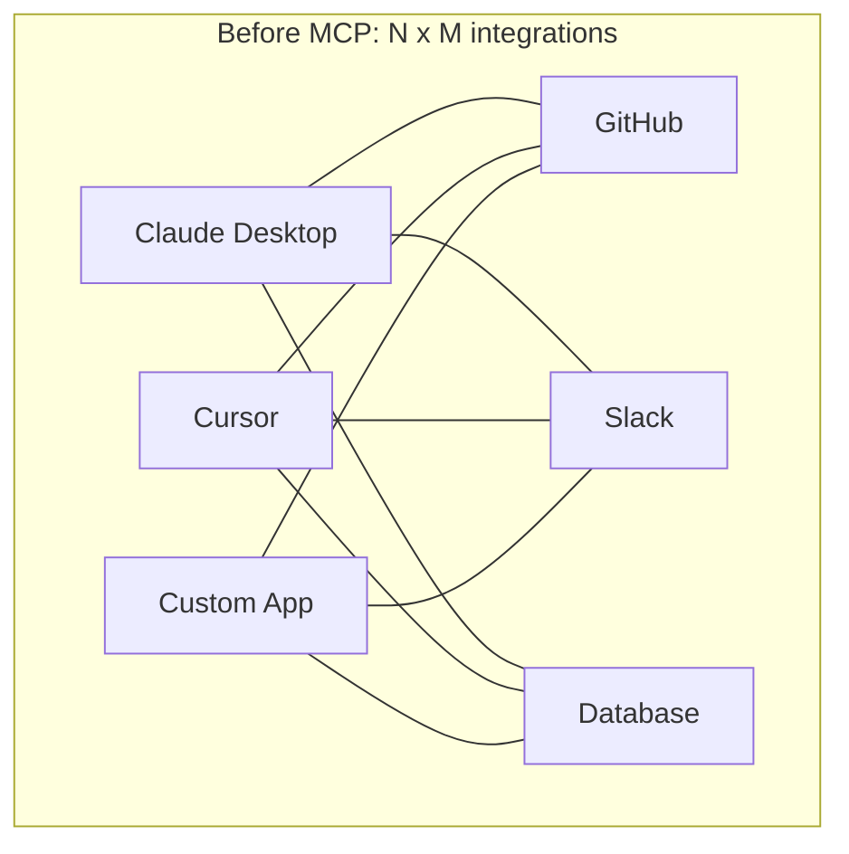
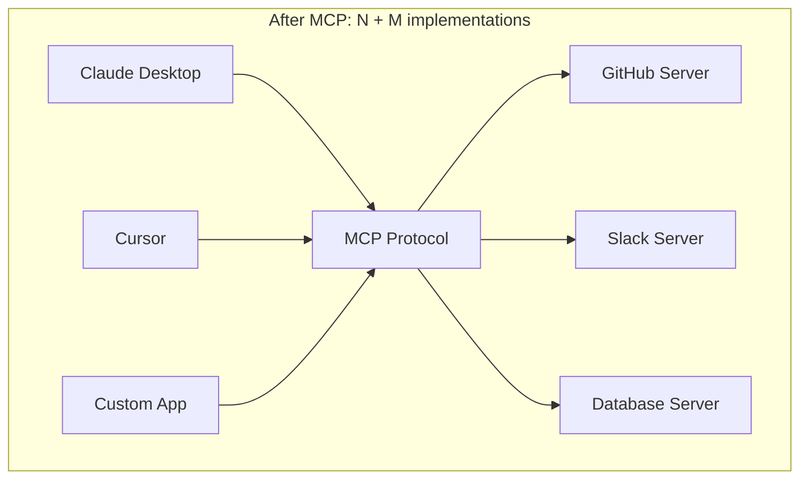
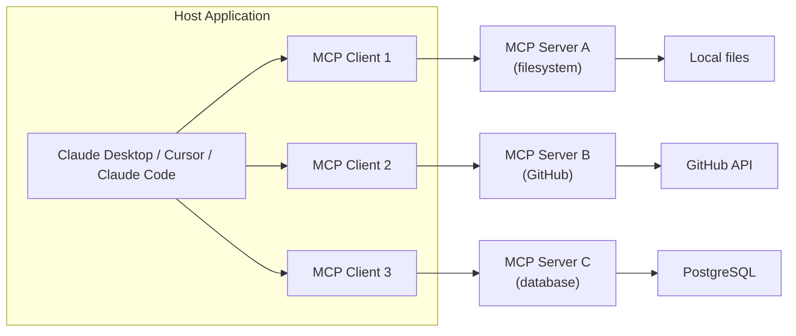
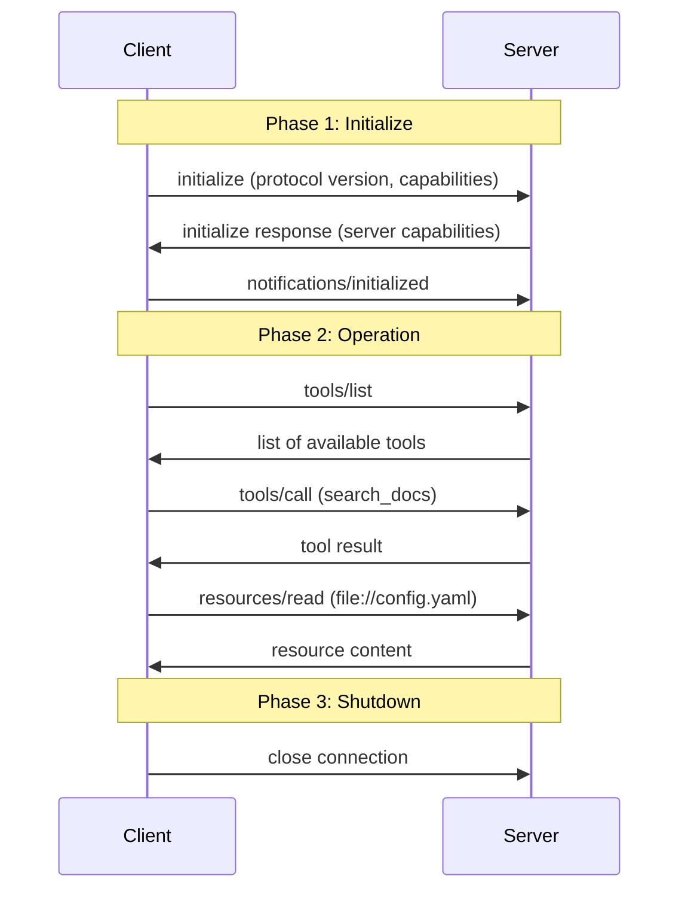
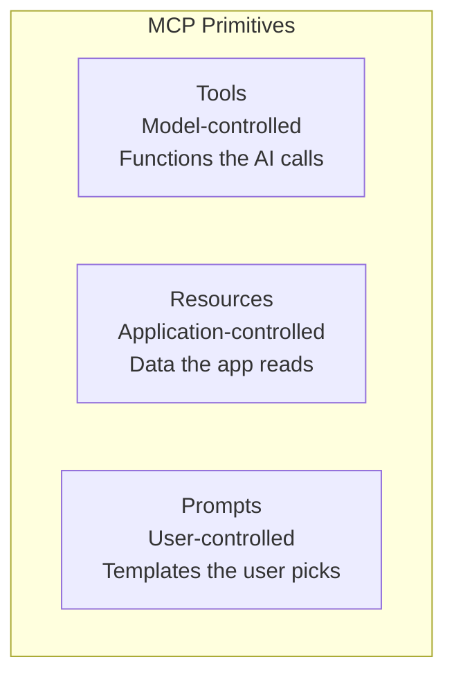
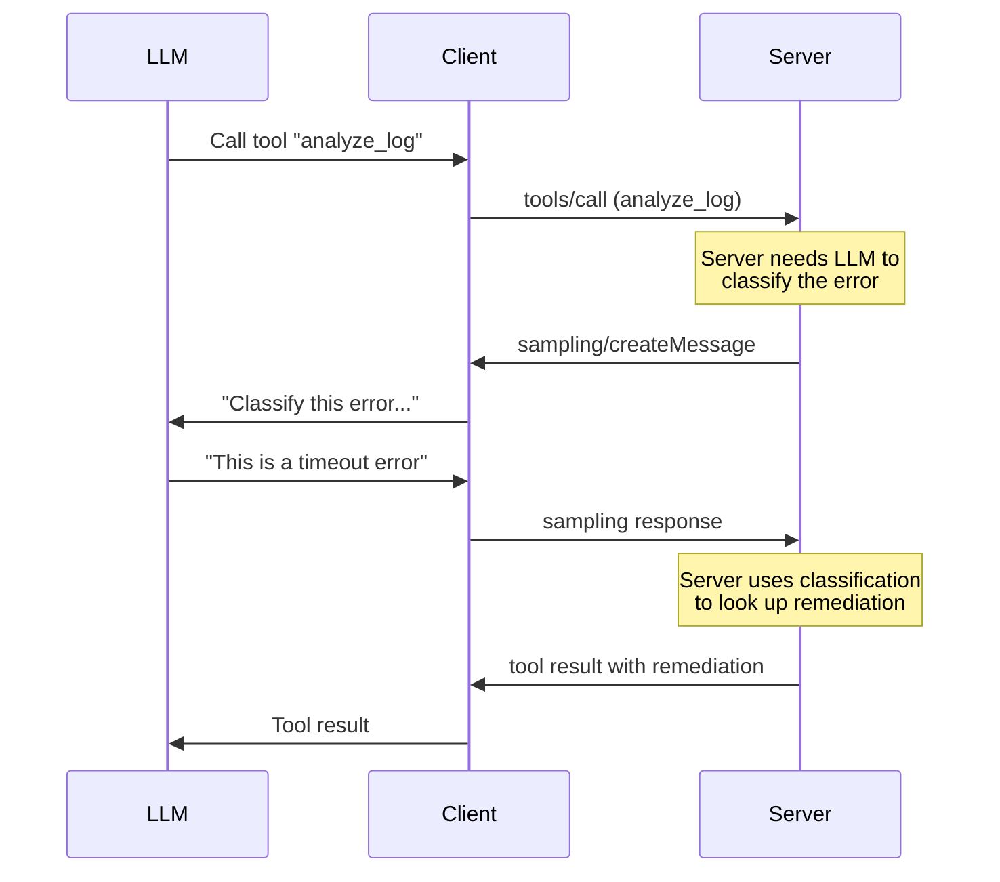

# MCP Protocol Deep Dive

The Model Context Protocol (MCP) is an open standard, created by Anthropic, that defines how AI applications connect to external tools, data sources, and workflows. It solves a problem every team building AI systems has encountered: every application was reinventing its own way to give LLMs access to the outside world. MCP standardizes that interface so that a tool built once works everywhere — in Claude Desktop, Cursor, Claude Code, VS Code, Windsurf, or any other MCP-compatible host.

Think of MCP as the USB-C of AI integrations. Before USB-C, every device had its own proprietary connector. Before MCP, every AI application had its own tool integration mechanism. MCP provides a universal protocol so tools, data sources, and prompt templates can be shared across any AI client.

This page covers the protocol itself — how it works, how to build servers and clients, advanced patterns, and production deployment. If you want to use the Archon MCP server to query this knowledge vault, see the [Archon MCP Server](/mcp) page instead.

## What is MCP?

### The Problem

Every AI application that needs to interact with external systems faces the same integration challenge. Consider what happens without a standard protocol:

- **Claude Desktop** builds its own way to read files, call APIs, and query databases
- **Cursor** builds a completely different integration system for the same tools
- **Your custom AI app** builds yet another approach to tool integration
- **Each tool provider** must implement N different integrations for N different clients

This is an N-by-M problem. N AI clients times M tool providers equals N*M custom integrations. It does not scale.





### The Solution

MCP defines a standard JSON-RPC 2.0 protocol with three core primitives — **tools**, **resources**, and **prompts** — that any server can expose and any client can consume. Build an MCP server once, and it works with every MCP-compatible AI application. Build an MCP client once, and it can talk to every MCP server.

### Architecture: Host, Client, Server

MCP uses a three-layer architecture:



| Layer | Role | Examples |
|-------|------|----------|
| **Host** | The AI application the user interacts with | Claude Desktop, Cursor, Claude Code, VS Code + Copilot |
| **Client** | Maintains a 1:1 connection with a single server | Created by the host for each server connection |
| **Server** | Exposes tools, resources, and prompts over the protocol | Filesystem server, GitHub server, database server |

Key constraints:
- Each client connects to exactly one server
- A host can manage multiple clients (and therefore multiple servers)
- Servers do not talk to each other directly — the host orchestrates
- The host controls which tools the LLM can see and invoke

### MCP vs. Function Calling / Tool Use APIs

If you have used OpenAI function calling or Anthropic tool use, you might wonder why MCP exists separately. The difference is scope:

| Dimension | Function Calling (OpenAI/Anthropic) | MCP |
|-----------|--------------------------------------|-----|
| **What it standardizes** | How a model requests tool calls within a single API request | How tools are discovered, described, and invoked across applications |
| **Scope** | Single model API conversation | Cross-application protocol |
| **Tool definition** | Passed in the API request body each time | Discovered dynamically from the server at runtime |
| **Transport** | HTTP API calls to model provider | stdio, HTTP/SSE, streamable HTTP between client and server |
| **Who implements tools** | Your application code (you handle the function call) | MCP server (a separate process or service) |
| **Reusability** | Per-application | Universal — one server works with any client |

Function calling tells the model *how* to request a tool call. MCP tells the client *where* to find tools and *how* to execute them. They are complementary: the host uses function calling to let the LLM decide which MCP tool to invoke, then the client executes that tool by calling the MCP server.

## Protocol Architecture

### Transport Layers

MCP supports three transport mechanisms. The choice depends on your deployment model.

#### stdio (Standard I/O)

The simplest transport. The client launches the server as a child process and communicates over stdin/stdout. Each JSON-RPC message is a single line.

```
Client                          Server (child process)
  |                                |
  |-- stdin: JSON-RPC request ---> |
  |                                |
  | <-- stdout: JSON-RPC response--|
  |                                |
```

**When to use:** Local servers running on the user's machine. This is the default for Claude Desktop and Claude Code.

**Advantages:** No network configuration, no port management, no authentication needed (the process runs as the user). Simple to debug.

**Limitations:** Server must be installed locally. Cannot share a server across multiple machines.

#### HTTP with SSE (Server-Sent Events)

For remote servers. The client sends requests as HTTP POST and receives responses and notifications through a Server-Sent Events stream.

```
Client                          Server (remote)
  |                                |
  |-- GET /sse (open SSE stream)-->|
  | <-------- SSE: endpoint URI ---|
  |                                |
  |-- POST /message (request) ---->|
  | <-------- SSE: response -------|
  | <-------- SSE: notification ---|
  |                                |
```

**When to use:** Remote servers accessible over the network. Suitable for shared infrastructure.

#### Streamable HTTP

The newest transport, designed to replace HTTP+SSE. Uses standard HTTP requests where the server can optionally upgrade to SSE for streaming responses. More flexible and firewall-friendly.

```
Client                              Server
  |                                    |
  |-- POST /mcp (JSON-RPC) ---------->|
  | <-- 200 OK (JSON-RPC response) ---|  (simple request/response)
  |                                    |
  |-- POST /mcp (JSON-RPC) ---------->|
  | <-- 200 OK (text/event-stream) ---|  (streamed response via SSE)
  |     <--- SSE: partial result ------|
  |     <--- SSE: final result --------|
  |                                    |
```

**When to use:** New deployments that need remote access. This is the recommended transport for production remote servers.

### JSON-RPC 2.0 Message Format

All MCP communication uses JSON-RPC 2.0. There are three message types:

**Request** (client to server, or server to client):

```json
{
  "jsonrpc": "2.0",
  "id": 1,
  "method": "tools/call",
  "params": {
    "name": "search_docs",
    "arguments": {
      "query": "circuit breaker pattern"
    }
  }
}
```

**Response** (reply to a request):

```json
{
  "jsonrpc": "2.0",
  "id": 1,
  "result": {
    "content": [
      {
        "type": "text",
        "text": "The circuit breaker pattern prevents cascading failures..."
      }
    ]
  }
}
```

**Notification** (one-way, no response expected):

```json
{
  "jsonrpc": "2.0",
  "method": "notifications/tools/list_changed"
}
```

### Connection Lifecycle

Every MCP session follows a three-phase lifecycle:



**Phase 1 — Initialize:** The client sends its supported protocol version and capabilities. The server responds with its capabilities (which primitives it supports, what features are available). The client confirms with an `initialized` notification. No other messages are allowed before initialization completes.

**Phase 2 — Operation:** Normal message exchange. The client discovers and invokes tools, reads resources, and retrieves prompts. The server can send notifications (e.g., tool list changed, resource updated).

**Phase 3 — Shutdown:** Either side can close the connection. The client typically does this when the user session ends.

### Capability Negotiation

During initialization, both sides declare what they support. This allows progressive feature adoption — a simple server can expose just tools, while a sophisticated server can expose tools, resources, prompts, and sampling.

```json
// Client capabilities (sent in initialize request)
{
  "capabilities": {
    "roots": { "listChanged": true },
    "sampling": {}
  }
}

// Server capabilities (sent in initialize response)
{
  "capabilities": {
    "tools": { "listChanged": true },
    "resources": { "subscribe": true, "listChanged": true },
    "prompts": { "listChanged": true },
    "logging": {}
  }
}
```

| Capability | Meaning |
|------------|---------|
| `tools` | Server exposes callable tools |
| `tools.listChanged` | Server will notify when the tool list changes |
| `resources` | Server exposes readable resources |
| `resources.subscribe` | Client can subscribe to resource updates |
| `prompts` | Server exposes prompt templates |
| `logging` | Server can send log messages to the client |
| `sampling` (client) | Client supports sampling requests from the server |

## Three Primitives

MCP defines exactly three primitives. Each serves a different purpose and is controlled by a different actor.



### Tools (Model-Controlled)

Tools are functions that the LLM decides to call based on the conversation context. When a user asks "search for circuit breaker patterns," the model chooses to invoke the `search_docs` tool. The model controls *when* and *how* tools are used.

Tools are the most common primitive. They are analogous to function calling in the OpenAI/Anthropic APIs, but standardized across applications.

**Characteristics:**
- Described by a name, description, and input schema (JSON Schema)
- The model sees tool descriptions and decides when to call them
- Can have side effects (create, update, delete)
- Results are returned as content (text, images, or embedded resources)

**Example tool definition (server-side):**

```json
{
  "name": "search_docs",
  "description": "Search the documentation by semantic query. Returns the top matching pages with titles, paths, and relevance scores.",
  "inputSchema": {
    "type": "object",
    "properties": {
      "query": {
        "type": "string",
        "description": "Natural language search query"
      },
      "limit": {
        "type": "number",
        "description": "Maximum number of results (default: 5)",
        "default": 5
      }
    },
    "required": ["query"]
  }
}
```

### Resources (Application-Controlled)

Resources are data that the application (or the user through the application) decides to attach to the context. The model does not autonomously decide to read resources — the application presents available resources and the user or application logic selects them.

Think of resources as files in an IDE's file tree. The user clicks on a file to open it, not the AI.

**Characteristics:**
- Identified by URIs (`file:///path/to/file`, `postgres://db/table`, `custom://resource`)
- Can be static (fixed list) or templated (URI patterns)
- Read-only — resources provide data, they do not mutate state
- Can be subscribed to for updates
- Content is text or binary (base64-encoded)

**Example resource:**

```json
{
  "uri": "file:///project/src/config.yaml",
  "name": "Application Configuration",
  "description": "The main configuration file for the application",
  "mimeType": "text/yaml"
}
```

**Resource templates** allow dynamic URIs:

```json
{
  "uriTemplate": "postgres://mydb/users/{user_id}",
  "name": "User Record",
  "description": "Get a user record by ID",
  "mimeType": "application/json"
}
```

### Prompts (User-Controlled)

Prompts are pre-built templates that users explicitly select. They typically appear as slash commands in the UI. When a user types `/explain-concept` in Claude Desktop, they are selecting a prompt from an MCP server.

**Characteristics:**
- Described by a name, description, and optional arguments
- Expand into a sequence of messages (system, user, assistant)
- Can embed resources and tool results
- The user explicitly chooses when to use them

**Example prompt definition:**

```json
{
  "name": "explain-concept",
  "description": "Explain an engineering concept at the specified level",
  "arguments": [
    {
      "name": "concept",
      "description": "The concept to explain",
      "required": true
    },
    {
      "name": "level",
      "description": "Explanation level: beginner, intermediate, or advanced",
      "required": false
    }
  ]
}
```

**When the prompt is invoked, the server returns messages:**

```json
{
  "messages": [
    {
      "role": "system",
      "content": {
        "type": "text",
        "text": "You are an expert engineering educator. Explain concepts clearly with practical examples."
      }
    },
    {
      "role": "user",
      "content": {
        "type": "text",
        "text": "Explain the concept of 'circuit breaker pattern' at an intermediate level. Include code examples and real-world analogies."
      }
    }
  ]
}
```

### Decision Matrix: When to Use Each Primitive

| Scenario | Primitive | Why |
|----------|-----------|-----|
| Search a database | **Tool** | The model decides when to search based on the question |
| Read a configuration file | **Resource** | The user/app selects which file to include in context |
| Execute an API call | **Tool** | The model decides the parameters and when to call |
| Provide a code review template | **Prompt** | The user explicitly chooses to start a review workflow |
| Stream real-time metrics | **Resource** | Data that the app subscribes to and feeds into context |
| Create a GitHub issue | **Tool** | Side-effect operation the model executes |
| Browse documentation sections | **Resource** | Navigable data the user selects |
| Start a debugging workflow | **Prompt** | Structured multi-step flow the user initiates |

::: tip Rule of thumb
If the **model** should decide when to use it, make it a **tool**. If the **application** decides what data to include, make it a **resource**. If the **user** explicitly triggers it, make it a **prompt**.
:::

## Building an MCP Server

### TypeScript SDK

The official TypeScript SDK is `@modelcontextprotocol/sdk`. It provides a high-level `McpServer` class that handles the protocol details.

**Install:**

```bash
npm install @modelcontextprotocol/sdk zod
```

#### Minimal Server with Tools

```typescript
import { McpServer } from "@modelcontextprotocol/sdk/server/mcp.js";
import { StdioServerTransport } from "@modelcontextprotocol/sdk/server/stdio.js";
import { z } from "zod";

const server = new McpServer({
  name: "my-server",
  version: "1.0.0",
});

// Define a tool
server.tool(
  "greet",
  "Generate a greeting for the given name",
  {
    name: z.string().describe("The name to greet"),
    language: z.enum(["en", "es", "fr"]).default("en").describe("Language"),
  },
  async ({ name, language }) => {
    const greetings = {
      en: `Hello, ${name}!`,
      es: `Hola, ${name}!`,
      fr: `Bonjour, ${name}!`,
    };

    return {
      content: [{ type: "text", text: greetings[language] }],
    };
  }
);

// Connect via stdio
const transport = new StdioServerTransport();
await server.connect(transport);
```

#### File System Server (Full Example)

A practical server that exposes file system operations:

```typescript
import { McpServer } from "@modelcontextprotocol/sdk/server/mcp.js";
import { StdioServerTransport } from "@modelcontextprotocol/sdk/server/stdio.js";
import { z } from "zod";
import fs from "fs/promises";
import path from "path";

const ALLOWED_ROOT = process.env.MCP_ROOT || process.cwd();

const server = new McpServer({
  name: "filesystem-server",
  version: "1.0.0",
});

// Helper: ensure path is within allowed root
function safePath(requestedPath: string): string {
  const resolved = path.resolve(ALLOWED_ROOT, requestedPath);
  if (!resolved.startsWith(ALLOWED_ROOT)) {
    throw new Error("Path traversal detected — access denied");
  }
  return resolved;
}

// Tool: list directory contents
server.tool(
  "list_directory",
  "List files and directories at the given path",
  {
    path: z.string().default(".").describe("Relative path from root"),
  },
  async ({ path: dirPath }) => {
    const resolved = safePath(dirPath);
    const entries = await fs.readdir(resolved, { withFileTypes: true });
    const listing = entries.map((e) => ({
      name: e.name,
      type: e.isDirectory() ? "directory" : "file",
    }));

    return {
      content: [{ type: "text", text: JSON.stringify(listing, null, 2) }],
    };
  }
);

// Tool: read file contents
server.tool(
  "read_file",
  "Read the contents of a file",
  {
    path: z.string().describe("Relative path to the file"),
  },
  async ({ path: filePath }) => {
    const resolved = safePath(filePath);
    const content = await fs.readFile(resolved, "utf-8");

    return {
      content: [{ type: "text", text: content }],
    };
  }
);

// Tool: write file contents
server.tool(
  "write_file",
  "Write content to a file (creates or overwrites)",
  {
    path: z.string().describe("Relative path to the file"),
    content: z.string().describe("Content to write"),
  },
  async ({ path: filePath, content }) => {
    const resolved = safePath(filePath);
    await fs.mkdir(path.dirname(resolved), { recursive: true });
    await fs.writeFile(resolved, content, "utf-8");

    return {
      content: [{ type: "text", text: `Written ${content.length} bytes to ${filePath}` }],
    };
  }
);

// Tool: search files by content
server.tool(
  "search_files",
  "Search for files containing a text pattern",
  {
    pattern: z.string().describe("Text pattern to search for"),
    glob: z.string().default("**/*").describe("Glob pattern to filter files"),
  },
  async ({ pattern, glob: globPattern }) => {
    const { glob } = await import("glob");
    const files = await glob(globPattern, { cwd: ALLOWED_ROOT, nodir: true });
    const matches: { file: string; line: number; text: string }[] = [];

    for (const file of files.slice(0, 100)) {
      try {
        const content = await fs.readFile(safePath(file), "utf-8");
        const lines = content.split("\n");
        lines.forEach((line, i) => {
          if (line.includes(pattern)) {
            matches.push({ file, line: i + 1, text: line.trim() });
          }
        });
      } catch {
        // Skip unreadable files
      }
    }

    return {
      content: [{ type: "text", text: JSON.stringify(matches, null, 2) }],
    };
  }
);

// Resource: read any file by URI
server.resource(
  "file",
  "file:///{path}",
  async (uri) => {
    const filePath = decodeURIComponent(uri.pathname);
    const resolved = safePath(filePath);
    const content = await fs.readFile(resolved, "utf-8");

    return {
      contents: [
        {
          uri: uri.href,
          mimeType: "text/plain",
          text: content,
        },
      ],
    };
  }
);

const transport = new StdioServerTransport();
await server.connect(transport);
```

#### Database Server (Full Example)

A server that wraps a PostgreSQL database:

```typescript
import { McpServer } from "@modelcontextprotocol/sdk/server/mcp.js";
import { StdioServerTransport } from "@modelcontextprotocol/sdk/server/stdio.js";
import { z } from "zod";
import pg from "pg";

const pool = new pg.Pool({
  connectionString: process.env.DATABASE_URL,
});

const server = new McpServer({
  name: "postgres-server",
  version: "1.0.0",
});

// Tool: execute read-only SQL queries
server.tool(
  "query",
  "Execute a read-only SQL query against the database. Only SELECT statements are allowed.",
  {
    sql: z.string().describe("SQL query (SELECT only)"),
    params: z.array(z.string()).optional().describe("Query parameters for $1, $2, etc."),
  },
  async ({ sql, params }) => {
    // Safety: only allow SELECT statements
    const normalized = sql.trim().toUpperCase();
    if (!normalized.startsWith("SELECT")) {
      return {
        content: [{ type: "text", text: "Error: Only SELECT queries are allowed" }],
        isError: true,
      };
    }

    try {
      const result = await pool.query(sql, params || []);
      return {
        content: [
          {
            type: "text",
            text: JSON.stringify(
              { rows: result.rows, rowCount: result.rowCount },
              null,
              2
            ),
          },
        ],
      };
    } catch (error) {
      return {
        content: [{ type: "text", text: `Query error: ${(error as Error).message}` }],
        isError: true,
      };
    }
  }
);

// Tool: list tables and their schemas
server.tool(
  "list_tables",
  "List all tables in the database with their columns",
  {},
  async () => {
    const result = await pool.query(`
      SELECT
        t.table_name,
        json_agg(json_build_object(
          'column', c.column_name,
          'type', c.data_type,
          'nullable', c.is_nullable
        ) ORDER BY c.ordinal_position) AS columns
      FROM information_schema.tables t
      JOIN information_schema.columns c
        ON t.table_name = c.table_name AND t.table_schema = c.table_schema
      WHERE t.table_schema = 'public'
      GROUP BY t.table_name
      ORDER BY t.table_name
    `);

    return {
      content: [{ type: "text", text: JSON.stringify(result.rows, null, 2) }],
    };
  }
);

// Resource: table data by URI
server.resource(
  "table",
  "postgres://public/{table}",
  async (uri) => {
    const tableName = uri.pathname.split("/").pop();
    // Sanitize table name to prevent injection
    if (!/^[a-zA-Z_][a-zA-Z0-9_]*$/.test(tableName || "")) {
      throw new Error("Invalid table name");
    }
    const result = await pool.query(
      `SELECT * FROM "${tableName}" LIMIT 100`
    );
    return {
      contents: [
        {
          uri: uri.href,
          mimeType: "application/json",
          text: JSON.stringify(result.rows, null, 2),
        },
      ],
    };
  }
);

// Prompt: data analysis workflow
server.prompt(
  "analyze-table",
  "Analyze a database table — schema, row counts, patterns",
  {
    table: z.string().describe("Table name to analyze"),
  },
  async ({ table }) => ({
    messages: [
      {
        role: "user" as const,
        content: {
          type: "text" as const,
          text: `Analyze the "${table}" table in our PostgreSQL database. Use the list_tables tool to get the schema, then run queries to understand:
1. Total row count
2. Distribution of key columns
3. Any NULL patterns
4. Date ranges (if applicable)
5. Potential data quality issues

Provide a summary with actionable findings.`,
        },
      },
    ],
  })
);

const transport = new StdioServerTransport();
await server.connect(transport);
```

### Python SDK

The official Python SDK is `mcp`. It uses Python async/await and provides decorators for defining tools, resources, and prompts.

**Install:**

```bash
pip install mcp
```

#### Minimal Server

```python
from mcp.server.fastmcp import FastMCP

mcp = FastMCP("my-server")

@mcp.tool()
def greet(name: str, language: str = "en") -> str:
    """Generate a greeting for the given name.

    Args:
        name: The name to greet
        language: Language code (en, es, fr)
    """
    greetings = {
        "en": f"Hello, {name}!",
        "es": f"Hola, {name}!",
        "fr": f"Bonjour, {name}!",
    }
    return greetings.get(language, greetings["en"])

if __name__ == "__main__":
    mcp.run()
```

The Python SDK uses type hints and docstrings to automatically generate the JSON Schema for tool inputs. No separate schema definition needed.

#### API Wrapper Server (Full Example)

A server that wraps an external REST API:

```python
import httpx
from mcp.server.fastmcp import FastMCP

mcp = FastMCP("github-server")

GITHUB_TOKEN = os.environ.get("GITHUB_TOKEN", "")
HEADERS = {
    "Authorization": f"Bearer {GITHUB_TOKEN}",
    "Accept": "application/vnd.github.v3+json",
}
BASE = "https://api.github.com"


@mcp.tool()
async def search_repos(query: str, language: str = "", limit: int = 10) -> str:
    """Search GitHub repositories by query.

    Args:
        query: Search query (e.g., 'machine learning')
        language: Filter by programming language (e.g., 'python')
        limit: Maximum results to return (1-30)
    """
    q = query
    if language:
        q += f" language:{language}"

    async with httpx.AsyncClient() as client:
        resp = await client.get(
            f"{BASE}/search/repositories",
            headers=HEADERS,
            params={"q": q, "per_page": min(limit, 30), "sort": "stars"},
        )
        resp.raise_for_status()
        data = resp.json()

    results = []
    for repo in data.get("items", []):
        results.append({
            "name": repo["full_name"],
            "description": repo.get("description", ""),
            "stars": repo["stargazers_count"],
            "language": repo.get("language", ""),
            "url": repo["html_url"],
        })

    return json.dumps(results, indent=2)


@mcp.tool()
async def get_repo_issues(
    owner: str, repo: str, state: str = "open", limit: int = 10
) -> str:
    """Get issues from a GitHub repository.

    Args:
        owner: Repository owner (e.g., 'anthropics')
        repo: Repository name (e.g., 'anthropic-cookbook')
        state: Issue state — open, closed, or all
        limit: Maximum issues to return
    """
    async with httpx.AsyncClient() as client:
        resp = await client.get(
            f"{BASE}/repos/{owner}/{repo}/issues",
            headers=HEADERS,
            params={"state": state, "per_page": min(limit, 30)},
        )
        resp.raise_for_status()
        issues = resp.json()

    results = []
    for issue in issues:
        results.append({
            "number": issue["number"],
            "title": issue["title"],
            "state": issue["state"],
            "author": issue["user"]["login"],
            "labels": [l["name"] for l in issue.get("labels", [])],
            "created_at": issue["created_at"],
            "url": issue["html_url"],
        })

    return json.dumps(results, indent=2)


@mcp.tool()
async def create_issue(
    owner: str, repo: str, title: str, body: str = "", labels: list[str] | None = None
) -> str:
    """Create a new issue in a GitHub repository.

    Args:
        owner: Repository owner
        repo: Repository name
        title: Issue title
        body: Issue body (markdown)
        labels: List of label names to apply
    """
    payload = {"title": title, "body": body}
    if labels:
        payload["labels"] = labels

    async with httpx.AsyncClient() as client:
        resp = await client.post(
            f"{BASE}/repos/{owner}/{repo}/issues",
            headers=HEADERS,
            json=payload,
        )
        resp.raise_for_status()
        issue = resp.json()

    return json.dumps({
        "number": issue["number"],
        "url": issue["html_url"],
        "message": f"Created issue #{issue['number']}: {title}",
    })


@mcp.resource("github://repos/{owner}/{repo}")
async def get_repo_info(owner: str, repo: str) -> str:
    """Get repository details."""
    async with httpx.AsyncClient() as client:
        resp = await client.get(
            f"{BASE}/repos/{owner}/{repo}",
            headers=HEADERS,
        )
        resp.raise_for_status()
        data = resp.json()

    return json.dumps({
        "name": data["full_name"],
        "description": data.get("description", ""),
        "stars": data["stargazers_count"],
        "forks": data["forks_count"],
        "language": data.get("language"),
        "default_branch": data["default_branch"],
        "open_issues": data["open_issues_count"],
        "created_at": data["created_at"],
        "updated_at": data["updated_at"],
    }, indent=2)


@mcp.prompt()
def code_review_prompt(repo: str, pr_number: str) -> str:
    """Start a code review workflow for a pull request.

    Args:
        repo: Repository in owner/repo format
        pr_number: Pull request number
    """
    return f"""Review pull request #{pr_number} in {repo}.

Use the GitHub tools to:
1. Get the PR details and diff
2. Check the linked issues
3. Review the changed files

Provide feedback on:
- Code quality and style
- Potential bugs or edge cases
- Test coverage
- Documentation updates needed
- Security considerations"""


if __name__ == "__main__":
    mcp.run()
```

### Tool Definition with Schemas

The quality of your tool definitions directly affects how well the LLM uses them. Good schemas act as documentation for the model.

**TypeScript (Zod):**

```typescript
server.tool(
  "create_user",
  "Create a new user account in the system",
  {
    email: z.string().email().describe("User's email address"),
    name: z.string().min(1).max(100).describe("User's full name"),
    role: z.enum(["admin", "editor", "viewer"])
      .default("viewer")
      .describe("User's role — determines permissions"),
    department: z.string().optional().describe("Department name (optional)"),
    sendWelcomeEmail: z.boolean().default(true)
      .describe("Whether to send a welcome email on account creation"),
  },
  async (params) => {
    // Implementation
  }
);
```

**Python (Pydantic/type hints):**

```python
from pydantic import Field

@mcp.tool()
async def create_user(
    email: str = Field(description="User's email address"),
    name: str = Field(description="User's full name", min_length=1, max_length=100),
    role: Literal["admin", "editor", "viewer"] = Field(
        default="viewer",
        description="User's role — determines permissions",
    ),
    department: str | None = Field(
        default=None, description="Department name (optional)"
    ),
    send_welcome_email: bool = Field(
        default=True,
        description="Whether to send a welcome email on account creation",
    ),
) -> str:
    """Create a new user account in the system."""
    # Implementation
```

::: warning Write descriptions as if explaining to a new team member
The model reads your tool descriptions and parameter descriptions to decide when and how to call the tool. Vague descriptions like "process data" lead to incorrect tool calls. Be specific: what the tool does, what each parameter controls, what the output contains.
:::

### Error Handling and Validation

MCP servers should return structured errors, not crash. The protocol distinguishes between tool errors (returned in the result with `isError: true`) and protocol errors (JSON-RPC error responses).

**Tool-level errors (the tool ran but encountered a problem):**

```typescript
server.tool("query_db", "Run a SQL query", { sql: z.string() }, async ({ sql }) => {
  try {
    const result = await db.query(sql);
    return {
      content: [{ type: "text", text: JSON.stringify(result.rows) }],
    };
  } catch (error) {
    // Return error as content — the model can see and react to this
    return {
      content: [
        {
          type: "text",
          text: `Query failed: ${(error as Error).message}\n\nSuggestion: Check the table name and column names using the list_tables tool.`,
        },
      ],
      isError: true,
    };
  }
});
```

**Protocol-level errors (invalid request):**

```typescript
// The SDK handles most protocol errors automatically.
// For custom validation, throw McpError:
import { McpError, ErrorCode } from "@modelcontextprotocol/sdk/types.js";

server.tool("admin_action", "Perform admin action", { action: z.string() }, async ({ action }) => {
  if (!isAuthenticated()) {
    throw new McpError(ErrorCode.InvalidRequest, "Authentication required");
  }
  // ...
});
```

## Building an MCP Client

### Client SDK Usage (TypeScript)

```typescript
import { Client } from "@modelcontextprotocol/sdk/client/index.js";
import { StdioClientTransport } from "@modelcontextprotocol/sdk/client/stdio.js";

// Create a client
const client = new Client({
  name: "my-ai-app",
  version: "1.0.0",
});

// Connect to a server via stdio
const transport = new StdioClientTransport({
  command: "node",
  args: ["./path/to/server.js"],
});

await client.connect(transport);
```

### Connecting via SSE

```typescript
import { SSEClientTransport } from "@modelcontextprotocol/sdk/client/sse.js";

const transport = new SSEClientTransport(
  new URL("http://localhost:3001/sse")
);

await client.connect(transport);
```

### Tool Discovery and Invocation

```typescript
// Discover available tools
const { tools } = await client.listTools();

console.log("Available tools:");
for (const tool of tools) {
  console.log(`  ${tool.name}: ${tool.description}`);
  console.log(`  Schema: ${JSON.stringify(tool.inputSchema)}`);
}

// Call a tool
const result = await client.callTool({
  name: "search_docs",
  arguments: {
    query: "circuit breaker pattern",
    limit: 5,
  },
});

// result.content is an array of content blocks
for (const block of result.content) {
  if (block.type === "text") {
    console.log(block.text);
  } else if (block.type === "image") {
    console.log(`Image: ${block.mimeType}, ${block.data.length} bytes`);
  }
}
```

### Handling Resources and Prompts

```typescript
// List available resources
const { resources } = await client.listResources();

// Read a specific resource
const { contents } = await client.readResource({
  uri: "file:///project/config.yaml",
});
for (const content of contents) {
  console.log(`${content.uri}: ${content.text}`);
}

// List available prompts
const { prompts } = await client.listPrompts();

// Get a prompt with arguments
const { messages } = await client.getPrompt({
  name: "explain-concept",
  arguments: {
    concept: "MCP Protocol",
    level: "intermediate",
  },
});
// messages is an array of { role, content } objects
// Feed these into your LLM call
```

### Full Client Integration Example

Here is how you integrate MCP tools into an LLM conversation loop:

```typescript
import Anthropic from "@anthropic-ai/sdk";
import { Client } from "@modelcontextprotocol/sdk/client/index.js";
import { StdioClientTransport } from "@modelcontextprotocol/sdk/client/stdio.js";

const anthropic = new Anthropic();
const mcpClient = new Client({ name: "my-app", version: "1.0.0" });

// Connect to the MCP server
const transport = new StdioClientTransport({
  command: "node",
  args: ["./my-mcp-server.js"],
});
await mcpClient.connect(transport);

// Discover tools and convert to Anthropic tool format
const { tools: mcpTools } = await mcpClient.listTools();
const anthropicTools = mcpTools.map((tool) => ({
  name: tool.name,
  description: tool.description || "",
  input_schema: tool.inputSchema,
}));

// Conversation loop
const messages: Anthropic.MessageParam[] = [
  { role: "user", content: "Search for articles about MCP protocol" },
];

let response = await anthropic.messages.create({
  model: "claude-sonnet-4-20250514",
  max_tokens: 4096,
  tools: anthropicTools,
  messages,
});

// Handle tool use in a loop
while (response.stop_reason === "tool_use") {
  const toolUseBlock = response.content.find(
    (b): b is Anthropic.ToolUseBlock => b.type === "tool_use"
  );

  if (!toolUseBlock) break;

  // Execute the tool via MCP
  const toolResult = await mcpClient.callTool({
    name: toolUseBlock.name,
    arguments: toolUseBlock.input as Record<string, unknown>,
  });

  // Feed result back to the model
  messages.push({ role: "assistant", content: response.content });
  messages.push({
    role: "user",
    content: [
      {
        type: "tool_result",
        tool_use_id: toolUseBlock.id,
        content: toolResult.content.map((c) => {
          if (c.type === "text") return { type: "text" as const, text: c.text };
          return { type: "text" as const, text: JSON.stringify(c) };
        }),
      },
    ],
  });

  response = await anthropic.messages.create({
    model: "claude-sonnet-4-20250514",
    max_tokens: 4096,
    tools: anthropicTools,
    messages,
  });
}

// Print final response
const textBlock = response.content.find(
  (b): b is Anthropic.TextBlock => b.type === "text"
);
console.log(textBlock?.text);

// Clean up
await mcpClient.close();
```

## Advanced Patterns

### Multi-Server Orchestration

A host application typically connects to multiple MCP servers simultaneously. Each server handles a different domain.

```typescript
import { Client } from "@modelcontextprotocol/sdk/client/index.js";
import { StdioClientTransport } from "@modelcontextprotocol/sdk/client/stdio.js";

interface ServerConfig {
  name: string;
  command: string;
  args: string[];
  env?: Record<string, string>;
}

class McpOrchestrator {
  private clients: Map<string, Client> = new Map();

  async connectServer(config: ServerConfig): Promise<void> {
    const client = new Client({ name: `client-${config.name}`, version: "1.0.0" });
    const transport = new StdioClientTransport({
      command: config.command,
      args: config.args,
      env: { ...process.env, ...(config.env || {}) },
    });

    await client.connect(transport);
    this.clients.set(config.name, client);
  }

  // Aggregate tools from all connected servers
  async getAllTools(): Promise<{ server: string; tool: any }[]> {
    const allTools: { server: string; tool: any }[] = [];

    for (const [serverName, client] of this.clients) {
      const { tools } = await client.listTools();
      for (const tool of tools) {
        allTools.push({
          server: serverName,
          tool: {
            ...tool,
            // Prefix tool name to avoid conflicts
            name: `${serverName}__${tool.name}`,
          },
        });
      }
    }

    return allTools;
  }

  // Route a tool call to the correct server
  async callTool(prefixedName: string, args: Record<string, unknown>) {
    const [serverName, ...toolParts] = prefixedName.split("__");
    const toolName = toolParts.join("__");
    const client = this.clients.get(serverName);

    if (!client) {
      throw new Error(`Unknown server: ${serverName}`);
    }

    return client.callTool({ name: toolName, arguments: args });
  }

  async disconnectAll(): Promise<void> {
    for (const client of this.clients.values()) {
      await client.close();
    }
    this.clients.clear();
  }
}

// Usage
const orchestrator = new McpOrchestrator();

await Promise.all([
  orchestrator.connectServer({
    name: "filesystem",
    command: "node",
    args: ["./servers/filesystem.js"],
  }),
  orchestrator.connectServer({
    name: "github",
    command: "node",
    args: ["./servers/github.js"],
    env: { GITHUB_TOKEN: process.env.GITHUB_TOKEN || "" },
  }),
  orchestrator.connectServer({
    name: "database",
    command: "node",
    args: ["./servers/postgres.js"],
    env: { DATABASE_URL: process.env.DATABASE_URL || "" },
  }),
]);

const allTools = await orchestrator.getAllTools();
// Now pass allTools to your LLM and route calls through orchestrator.callTool()
```

### Authentication and Authorization

MCP itself does not define an authentication mechanism — this is handled at the transport layer. Common patterns:

**Environment variables (stdio servers):**

```json
{
  "mcpServers": {
    "github": {
      "command": "node",
      "args": ["./github-server.js"],
      "env": {
        "GITHUB_TOKEN": "ghp_xxxxxxxxxxxx"
      }
    }
  }
}
```

**OAuth/token-based (HTTP servers):**

```typescript
import { StreamableHTTPServerTransport } from "@modelcontextprotocol/sdk/server/streamableHttp.js";
import express from "express";

const app = express();

// Authentication middleware
function authenticate(req: express.Request, res: express.Response, next: express.NextFunction) {
  const token = req.headers.authorization?.replace("Bearer ", "");
  if (!token || !isValidToken(token)) {
    res.status(401).json({ error: "Unauthorized" });
    return;
  }
  req.userId = getUserFromToken(token);
  next();
}

app.use("/mcp", authenticate);

// Create MCP transport per session
app.post("/mcp", async (req, res) => {
  const transport = new StreamableHTTPServerTransport({ sessionIdGenerator: undefined });
  // ... handle MCP messages
});
```

**Per-tool authorization:**

```typescript
server.tool(
  "delete_user",
  "Delete a user account (admin only)",
  { userId: z.string() },
  async ({ userId }, { meta }) => {
    // Check permissions from the request context
    const callerRole = await getCallerRole(meta);
    if (callerRole !== "admin") {
      return {
        content: [{ type: "text", text: "Permission denied: admin role required" }],
        isError: true,
      };
    }
    // Proceed with deletion
  }
);
```

### Rate Limiting and Quotas

For shared MCP servers, implement rate limiting to prevent abuse:

```typescript
import { RateLimiter } from "limiter";

// Per-tool rate limiters
const rateLimiters = new Map<string, RateLimiter>();

function getRateLimiter(toolName: string): RateLimiter {
  if (!rateLimiters.has(toolName)) {
    rateLimiters.set(
      toolName,
      new RateLimiter({ tokensPerInterval: 30, interval: "minute" })
    );
  }
  return rateLimiters.get(toolName)!;
}

// Wrap tool handlers with rate limiting
function rateLimitedTool(
  server: McpServer,
  name: string,
  description: string,
  schema: any,
  handler: Function
) {
  server.tool(name, description, schema, async (params) => {
    const limiter = getRateLimiter(name);
    const hasToken = await limiter.tryRemoveTokens(1);

    if (!hasToken) {
      return {
        content: [
          {
            type: "text",
            text: `Rate limit exceeded for tool "${name}". Try again in a moment.`,
          },
        ],
        isError: true,
      };
    }

    return handler(params);
  });
}
```

### Sampling (Server-Initiated LLM Calls)

Sampling is a powerful feature that lets the server ask the LLM a question. This enables patterns where the server needs the model's judgment as part of its processing — for example, a server that automatically classifies or summarizes data before returning it.



**Server-side sampling request:**

```typescript
// The server can request the client to sample (ask the LLM)
server.tool(
  "analyze_log",
  "Analyze a log file and provide remediation steps",
  { logPath: z.string() },
  async ({ logPath }, { sendRequest }) => {
    const logContent = await fs.readFile(logPath, "utf-8");

    // Ask the LLM to classify the error
    const classification = await sendRequest(
      { method: "sampling/createMessage" },
      {
        messages: [
          {
            role: "user",
            content: {
              type: "text",
              text: `Classify this error log into one of: timeout, auth_failure, resource_exhaustion, data_corruption, unknown.\n\nLog:\n${logContent}`,
            },
          },
        ],
        maxTokens: 100,
      }
    );

    // Use the classification to look up remediation
    const category = classification.content.text?.trim();
    const remediation = await lookupRemediation(category);

    return {
      content: [
        {
          type: "text",
          text: `Error category: ${category}\n\nRemediation:\n${remediation}`,
        },
      ],
    };
  }
);
```

::: warning Sampling requires explicit client support
The client must declare `sampling` in its capabilities during initialization. Not all hosts support this. Claude Desktop supports sampling; simpler clients may not. Always design your server to degrade gracefully when sampling is unavailable.
:::

### Server-Sent Notifications

Servers can notify clients when their state changes, allowing dynamic tool/resource updates:

```typescript
// Notify clients when the tool list changes
async function registerNewTool(toolDef: ToolDefinition) {
  toolRegistry.add(toolDef);
  // Notify all connected clients
  await server.notification({
    method: "notifications/tools/list_changed",
  });
}

// Notify when a resource updates
async function onConfigChange(configPath: string) {
  await server.notification({
    method: "notifications/resources/updated",
    params: { uri: `file://${configPath}` },
  });
}
```

### Progress Reporting

For long-running tools, report progress back to the client:

```typescript
server.tool(
  "bulk_import",
  "Import a large dataset into the system",
  {
    filePath: z.string(),
  },
  async ({ filePath }, { reportProgress }) => {
    const lines = await countLines(filePath);
    let processed = 0;

    for await (const batch of readInBatches(filePath, 1000)) {
      await processBatch(batch);
      processed += batch.length;

      // Report progress to the client
      await reportProgress({
        progress: processed,
        total: lines,
      });
    }

    return {
      content: [
        { type: "text", text: `Imported ${processed} records from ${filePath}` },
      ],
    };
  }
);
```

## Production Deployment

### Packaging and Distribution

**npm package (TypeScript server):**

```json
{
  "name": "my-mcp-server",
  "version": "1.0.0",
  "bin": {
    "my-mcp-server": "./dist/index.js"
  },
  "files": ["dist"],
  "scripts": {
    "build": "tsc",
    "prepublishOnly": "npm run build"
  },
  "dependencies": {
    "@modelcontextprotocol/sdk": "^1.0.0",
    "zod": "^3.23.0"
  }
}
```

Make sure `dist/index.js` starts with `#!/usr/bin/env node` for CLI execution:

```typescript
#!/usr/bin/env node
import { McpServer } from "@modelcontextprotocol/sdk/server/mcp.js";
// ...
```

Users install and register:

```bash
# Install globally
npm install -g my-mcp-server

# Register with Claude Code
claude mcp add my-server -- my-mcp-server

# Or register with Claude Desktop (claude_desktop_config.json)
# {
#   "mcpServers": {
#     "my-server": {
#       "command": "npx",
#       "args": ["my-mcp-server"]
#     }
#   }
# }
```

**PyPI package (Python server):**

```toml
# pyproject.toml
[project]
name = "my-mcp-server"
version = "1.0.0"
dependencies = ["mcp>=1.0.0"]

[project.scripts]
my-mcp-server = "my_mcp_server:main"
```

```bash
pip install my-mcp-server
claude mcp add my-server -- my-mcp-server
```

### Remote MCP Servers (HTTP Transport)

For servers that should be accessible over the network — shared team tools, SaaS integrations, or servers that need access to cloud resources:

```typescript
import { McpServer } from "@modelcontextprotocol/sdk/server/mcp.js";
import { StreamableHTTPServerTransport } from "@modelcontextprotocol/sdk/server/streamableHttp.js";
import express from "express";

const app = express();
app.use(express.json());

const server = new McpServer({
  name: "remote-server",
  version: "1.0.0",
});

// Register tools, resources, prompts...
server.tool("ping", "Health check", {}, async () => ({
  content: [{ type: "text", text: "pong" }],
}));

// Handle MCP over HTTP
app.post("/mcp", async (req, res) => {
  try {
    const transport = new StreamableHTTPServerTransport({
      sessionIdGenerator: undefined,
    });

    res.on("close", () => {
      transport.close();
    });

    await server.connect(transport);
    await transport.handleRequest(req, res, req.body);
  } catch (error) {
    res.status(500).json({ error: "Internal server error" });
  }
});

// SSE endpoint for streaming (if needed)
app.get("/mcp", async (req, res) => {
  // Handle SSE connection for streaming responses
  res.setHeader("Content-Type", "text/event-stream");
  res.setHeader("Cache-Control", "no-cache");
  res.setHeader("Connection", "keep-alive");
  // ...
});

app.listen(3001, () => {
  console.log("MCP server running on http://localhost:3001/mcp");
});
```

Register a remote server:

```bash
# Claude Code
claude mcp add remote-server --transport http http://localhost:3001/mcp

# For production, use HTTPS:
claude mcp add prod-server --transport http https://mcp.example.com/mcp
```

### Security Considerations

::: danger Security is not optional for MCP servers
MCP servers execute code and access data on behalf of the user. A poorly secured server is a direct attack vector. Treat every MCP server as you would treat an API endpoint.
:::

**Path traversal prevention:**

```typescript
function safePath(base: string, requested: string): string {
  const resolved = path.resolve(base, requested);
  if (!resolved.startsWith(path.resolve(base))) {
    throw new Error("Path traversal attempt blocked");
  }
  return resolved;
}
```

**SQL injection prevention:**

```typescript
// WRONG: string interpolation
const result = await db.query(`SELECT * FROM ${tableName} WHERE id = ${id}`);

// RIGHT: parameterized queries + allowlist for identifiers
const ALLOWED_TABLES = ["users", "orders", "products"];
if (!ALLOWED_TABLES.includes(tableName)) {
  throw new Error("Invalid table name");
}
const result = await db.query(`SELECT * FROM "${tableName}" WHERE id = $1`, [id]);
```

**Principle of least privilege:**

```typescript
// Expose only read operations by default
// Require explicit opt-in for write operations
const server = new McpServer({
  name: "safe-db-server",
  version: "1.0.0",
});

// Always available: read-only
server.tool("query", "Run a SELECT query", { sql: z.string() }, async ({ sql }) => {
  if (!sql.trim().toUpperCase().startsWith("SELECT")) {
    return { content: [{ type: "text", text: "Only SELECT queries allowed" }], isError: true };
  }
  // ...
});

// Only available if ENABLE_WRITES=true
if (process.env.ENABLE_WRITES === "true") {
  server.tool("execute", "Run a write query", { sql: z.string() }, async ({ sql }) => {
    // ...
  });
}
```

**Sandboxing recommendations:**

| Concern | Mitigation |
|---------|------------|
| File system access | Restrict to a specific directory. Validate all paths. |
| Network access | Allowlist outbound domains. Block internal IPs. |
| Resource consumption | Set timeouts, memory limits, max result sizes. |
| Secrets | Use environment variables, never log them, never return them. |
| Code execution | Run in a container or sandbox (gVisor, Firecracker). |

### Testing MCP Servers

Test your MCP server the same way you test any API: unit tests for individual tools, integration tests for the full protocol flow.

**Unit testing tools:**

```typescript
import { describe, it, expect } from "vitest";

// Test the tool handler directly
describe("search_docs tool", () => {
  it("returns results for valid queries", async () => {
    const result = await searchDocsHandler({ query: "circuit breaker", limit: 5 });
    expect(result.content).toHaveLength(1);
    expect(result.content[0].type).toBe("text");

    const parsed = JSON.parse(result.content[0].text);
    expect(parsed.length).toBeLessThanOrEqual(5);
    expect(parsed[0]).toHaveProperty("title");
    expect(parsed[0]).toHaveProperty("path");
  });

  it("returns empty array for no matches", async () => {
    const result = await searchDocsHandler({ query: "xyzzy_nonexistent", limit: 5 });
    const parsed = JSON.parse(result.content[0].text);
    expect(parsed).toEqual([]);
  });

  it("handles errors gracefully", async () => {
    const result = await searchDocsHandler({ query: "", limit: 5 });
    expect(result.isError).toBe(true);
  });
});
```

**Integration testing with the MCP client:**

```typescript
import { Client } from "@modelcontextprotocol/sdk/client/index.js";
import { StdioClientTransport } from "@modelcontextprotocol/sdk/client/stdio.js";

describe("MCP Server Integration", () => {
  let client: Client;

  beforeAll(async () => {
    client = new Client({ name: "test-client", version: "1.0.0" });
    const transport = new StdioClientTransport({
      command: "node",
      args: ["./dist/index.js"],
    });
    await client.connect(transport);
  });

  afterAll(async () => {
    await client.close();
  });

  it("lists all expected tools", async () => {
    const { tools } = await client.listTools();
    const toolNames = tools.map((t) => t.name);
    expect(toolNames).toContain("search_docs");
    expect(toolNames).toContain("get_page");
  });

  it("calls search_docs successfully", async () => {
    const result = await client.callTool({
      name: "search_docs",
      arguments: { query: "test query" },
    });
    expect(result.content).toBeDefined();
    expect(result.isError).not.toBe(true);
  });
});
```

### Debugging with MCP Inspector

The MCP Inspector is a development tool that lets you interactively test MCP servers:

```bash
# Install and run
npx @modelcontextprotocol/inspector

# Or point it at your server directly
npx @modelcontextprotocol/inspector node ./my-server.js
```

The Inspector provides:
- **Tool testing:** Call any tool with custom arguments and see the response
- **Resource browsing:** List and read resources
- **Prompt testing:** Get prompts with arguments and inspect the generated messages
- **Message log:** See all JSON-RPC messages exchanged between client and server
- **Error inspection:** Detailed error messages and stack traces

::: tip Use the Inspector during development, not just for debugging
Run the Inspector alongside your development workflow. Every time you add or modify a tool, test it through the Inspector before trying it in Claude Desktop or Cursor. It gives you much faster feedback loops than testing through an LLM.
:::

## Ecosystem

### Popular MCP Servers

The MCP ecosystem has grown rapidly. Here are the most widely used servers:

| Server | What It Does | Transport |
|--------|-------------|-----------|
| **Filesystem** | Read, write, search local files | stdio |
| **GitHub** | Issues, PRs, repos, code search | stdio |
| **Slack** | Read/send messages, search channels | stdio |
| **PostgreSQL** | Query databases, inspect schemas | stdio |
| **SQLite** | Local database operations | stdio |
| **Puppeteer** | Browser automation, screenshots | stdio |
| **Brave Search** | Web search | stdio |
| **Google Drive** | Read/search documents | stdio |
| **Memory** | Persistent knowledge graph | stdio |
| **Fetch** | HTTP requests to any URL | stdio |
| **Sentry** | Error tracking and issue lookup | stdio |
| **Linear** | Project management, issues, cycles | stdio |
| **Notion** | Notes, databases, pages | stdio |
| **Archon** | Query 1,000+ engineering knowledge pages | stdio, HTTP |

### IDE Integration

MCP support varies by IDE and AI assistant:

| Host | MCP Support | Server Config Location |
|------|-------------|----------------------|
| **Claude Desktop** | Full (tools, resources, prompts) | `claude_desktop_config.json` |
| **Claude Code** | Full | `claude mcp add` or `.mcp.json` |
| **Cursor** | Tools only | `.cursor/mcp.json` |
| **Windsurf** | Tools only | Settings UI |
| **VS Code (Copilot)** | Tools (experimental) | `settings.json` |
| **Cline** | Full | Settings UI |
| **Continue** | Full | `config.json` |

### Registry and Discovery

MCP servers can be discovered through:

- **npm/PyPI**: Search for packages tagged with `mcp-server`
- **GitHub Topics**: Browse `mcp-server` topic on GitHub
- **MCP Server Registry**: Community-maintained lists of verified servers
- **Smithery**: A registry and hosting platform for MCP servers

---

## In Production

::: info Real-world MCP deployment patterns

**Anthropic's own use.** Claude Code ships with built-in MCP support and can connect to any number of MCP servers. Anthropic uses MCP internally to give Claude access to internal documentation, code repositories, and development tools.

**Cursor's adoption.** Cursor added MCP support to let users extend the IDE's AI capabilities with custom tools. Teams use MCP servers to give Cursor access to internal APIs, deployment pipelines, and proprietary databases that the model would otherwise have no way to reach.

**Enterprise tool platforms.** Companies building internal AI platforms use MCP as the integration layer. Instead of hardcoding each tool into their AI assistant, they deploy MCP servers for each internal system (JIRA, Confluence, internal APIs) and the AI platform discovers and uses them dynamically.
:::

---

## Misconceptions

::: danger 6 MCP Misconceptions That Lead to Bad Implementations

**1. "MCP replaces function calling."**
MCP does not replace function calling. It complements it. The host application still uses function calling (or tool use) to let the LLM decide which tool to invoke. MCP standardizes how those tools are discovered, described, and executed. Function calling is the model-side interface; MCP is the tool-side interface.

**2. "MCP servers need to be complex."**
A valid MCP server can be 20 lines of code. One tool, one file, no framework. Start simple. The smallest useful server exposes a single tool that does one thing well. You can always add complexity later.

**3. "All three primitives (tools, resources, prompts) are required."**
A server can expose any combination. Most servers only expose tools. Resources and prompts are optional and useful for specific use cases. Do not add resources and prompts just because the spec supports them.

**4. "MCP handles authentication for you."**
MCP defines no authentication mechanism. You must implement authentication at the transport layer (environment variables for stdio, OAuth/tokens for HTTP). If your server accesses sensitive data, authentication is your responsibility.

**5. "Remote MCP servers are always better than local ones."**
Local stdio servers are simpler, faster, and more secure (they run as the user, no network attack surface). Use remote servers only when you need shared access across machines, need to run on different infrastructure than the client, or cannot install software locally.

**6. "MCP is only for Anthropic/Claude."**
MCP is an open standard. Any AI application can implement an MCP client. Any developer can build an MCP server. The protocol is not tied to Claude, GPT, or any specific model. Cursor, Windsurf, Cline, Continue, and VS Code all support MCP.
:::

---

## When NOT to Use MCP

MCP is not the answer to every integration challenge:

| Situation | Why MCP Is Wrong | Better Alternative |
|-----------|-----------------|-------------------|
| Simple one-off script that calls an API | Overhead of the protocol is not worth it | Direct function call in your code |
| Real-time streaming data (video, audio) | MCP is request-response, not designed for continuous streams | WebSocket, gRPC streaming |
| Your tool only works with one specific AI app | No cross-application benefit | Native plugin/extension system |
| Sub-millisecond latency requirements | JSON-RPC + process communication adds overhead | In-process function calls |
| You need bidirectional real-time communication | MCP is primarily client-initiated | WebSocket, SSE directly |
| Simple prompt template management | Prompts primitive is overkill for static templates | Config files, prompt libraries |

---

## Quiz

::: details Test Your MCP Knowledge (7 Questions)

**Q1: What are the three primitives in MCP, and who controls each?**
Tools (model-controlled), Resources (application-controlled), and Prompts (user-controlled). The model decides when to call tools, the application decides which resources to include, and the user explicitly selects prompts.

**Q2: What transport should you use for a local MCP server running on the user's machine?**
stdio (standard I/O). The client launches the server as a child process and communicates over stdin/stdout. No network configuration or authentication needed.

**Q3: Why does MCP use JSON-RPC 2.0 instead of REST?**
JSON-RPC 2.0 provides a standardized request/response format with built-in error codes, notification support (one-way messages), and transport independence. Unlike REST, it does not assume HTTP — it works over stdio, SSE, or any byte stream. It also supports bidirectional communication (both client-to-server and server-to-client messages).

**Q4: What happens during the initialization phase of an MCP connection?**
The client sends an `initialize` request with its protocol version and capabilities. The server responds with its own capabilities (which primitives it supports, what features are available). The client confirms with an `initialized` notification. No other messages are allowed before initialization completes.

**Q5: When should you use a resource instead of a tool?**
Use a resource when the data is selected by the application or user, not by the model. Resources are read-only data identified by URIs that the application presents and the user chooses to include in context. Tools are for operations the model autonomously decides to execute, especially those with side effects.

**Q6: What is sampling in MCP?**
Sampling lets the server ask the LLM a question during tool execution. The server sends a `sampling/createMessage` request to the client, which forwards it to the model and returns the response. This enables patterns where the server needs the model's judgment (classification, summarization) as part of its processing.

**Q7: How do you prevent path traversal attacks in a filesystem MCP server?**
Resolve the requested path against the allowed root directory using `path.resolve()`, then verify the resolved path starts with the allowed root. Reject any path that escapes the root. Example: `path.resolve(root, requested).startsWith(path.resolve(root))`.
:::

---

## Exercise: Build an MCP Server

::: details Full Exercise: Build a Bookmark Manager MCP Server

**Scenario:** Build an MCP server that manages bookmarks — URLs with titles, tags, and notes. The server stores bookmarks in a local JSON file.

**Requirements:**
1. **Tool: `add_bookmark`** — Save a new bookmark with URL, title, optional tags, and optional note
2. **Tool: `search_bookmarks`** — Search bookmarks by query (matches title, URL, tags, note)
3. **Tool: `delete_bookmark`** — Remove a bookmark by URL
4. **Tool: `list_tags`** — List all unique tags with counts
5. **Resource: `bookmarks://all`** — Return all bookmarks as JSON
6. **Prompt: `organize-bookmarks`** — A workflow that helps the user categorize untagged bookmarks

**Starter code:**

```typescript
import { McpServer } from "@modelcontextprotocol/sdk/server/mcp.js";
import { StdioServerTransport } from "@modelcontextprotocol/sdk/server/stdio.js";
import { z } from "zod";
import fs from "fs/promises";
import path from "path";

const DATA_FILE = path.join(process.cwd(), "bookmarks.json");

interface Bookmark {
  url: string;
  title: string;
  tags: string[];
  note: string;
  createdAt: string;
}

async function loadBookmarks(): Promise<Bookmark[]> {
  try {
    const data = await fs.readFile(DATA_FILE, "utf-8");
    return JSON.parse(data);
  } catch {
    return [];
  }
}

async function saveBookmarks(bookmarks: Bookmark[]): Promise<void> {
  await fs.writeFile(DATA_FILE, JSON.stringify(bookmarks, null, 2));
}

const server = new McpServer({
  name: "bookmark-server",
  version: "1.0.0",
});

// TODO: Implement the 4 tools, 1 resource, and 1 prompt described above.
// Hints:
// - Use z.string().url() for URL validation
// - Use z.array(z.string()) for tags
// - For search, match against title, url, tags (joined), and note
// - For the resource, use server.resource() with a static URI
// - For the prompt, return a message that instructs the LLM to use
//   list_tags and search_bookmarks to find and organize untagged bookmarks

const transport = new StdioServerTransport();
await server.connect(transport);
```

**Solution:**

```typescript
// Tool: add_bookmark
server.tool(
  "add_bookmark",
  "Save a new bookmark with URL, title, optional tags, and optional note",
  {
    url: z.string().url().describe("Bookmark URL"),
    title: z.string().describe("Bookmark title"),
    tags: z.array(z.string()).default([]).describe("Tags for categorization"),
    note: z.string().default("").describe("Optional note about this bookmark"),
  },
  async ({ url, title, tags, note }) => {
    const bookmarks = await loadBookmarks();

    if (bookmarks.some((b) => b.url === url)) {
      return {
        content: [{ type: "text", text: `Bookmark already exists: ${url}` }],
        isError: true,
      };
    }

    bookmarks.push({
      url,
      title,
      tags,
      note,
      createdAt: new Date().toISOString(),
    });
    await saveBookmarks(bookmarks);

    return {
      content: [
        {
          type: "text",
          text: `Saved bookmark: "${title}" (${url}) with tags [${tags.join(", ")}]`,
        },
      ],
    };
  }
);

// Tool: search_bookmarks
server.tool(
  "search_bookmarks",
  "Search bookmarks by query — matches against title, URL, tags, and notes",
  {
    query: z.string().describe("Search query"),
  },
  async ({ query }) => {
    const bookmarks = await loadBookmarks();
    const lower = query.toLowerCase();

    const matches = bookmarks.filter(
      (b) =>
        b.title.toLowerCase().includes(lower) ||
        b.url.toLowerCase().includes(lower) ||
        b.tags.some((t) => t.toLowerCase().includes(lower)) ||
        b.note.toLowerCase().includes(lower)
    );

    return {
      content: [{ type: "text", text: JSON.stringify(matches, null, 2) }],
    };
  }
);

// Tool: delete_bookmark
server.tool(
  "delete_bookmark",
  "Remove a bookmark by its URL",
  {
    url: z.string().url().describe("URL of the bookmark to delete"),
  },
  async ({ url }) => {
    const bookmarks = await loadBookmarks();
    const index = bookmarks.findIndex((b) => b.url === url);

    if (index === -1) {
      return {
        content: [{ type: "text", text: `No bookmark found for: ${url}` }],
        isError: true,
      };
    }

    const removed = bookmarks.splice(index, 1)[0];
    await saveBookmarks(bookmarks);

    return {
      content: [
        { type: "text", text: `Deleted bookmark: "${removed.title}" (${url})` },
      ],
    };
  }
);

// Tool: list_tags
server.tool(
  "list_tags",
  "List all unique bookmark tags with their counts",
  {},
  async () => {
    const bookmarks = await loadBookmarks();
    const tagCounts: Record<string, number> = {};

    for (const b of bookmarks) {
      for (const tag of b.tags) {
        tagCounts[tag] = (tagCounts[tag] || 0) + 1;
      }
    }

    const sorted = Object.entries(tagCounts)
      .sort((a, b) => b[1] - a[1])
      .map(([tag, count]) => ({ tag, count }));

    const untaggedCount = bookmarks.filter((b) => b.tags.length === 0).length;

    return {
      content: [
        {
          type: "text",
          text: JSON.stringify({ tags: sorted, untaggedCount }, null, 2),
        },
      ],
    };
  }
);

// Resource: all bookmarks
server.resource("all-bookmarks", "bookmarks://all", async () => {
  const bookmarks = await loadBookmarks();
  return {
    contents: [
      {
        uri: "bookmarks://all",
        mimeType: "application/json",
        text: JSON.stringify(bookmarks, null, 2),
      },
    ],
  };
});

// Prompt: organize bookmarks
server.prompt(
  "organize-bookmarks",
  "Workflow to categorize untagged bookmarks",
  {},
  async () => ({
    messages: [
      {
        role: "user" as const,
        content: {
          type: "text" as const,
          text: `Help me organize my bookmarks. Here is what to do:

1. Use the list_tags tool to see existing tags and how many bookmarks are untagged.
2. Use the search_bookmarks tool with an empty query to find untagged bookmarks.
3. For each untagged bookmark, suggest appropriate tags based on the URL and title.
4. Ask me to confirm before applying tags.

Start by checking the current tag distribution.`,
        },
      },
    ],
  })
);
```

**Test it:**

```bash
# Build and run
npx tsc
node dist/index.js

# Or test with MCP Inspector
npx @modelcontextprotocol/inspector node dist/index.js

# Register with Claude Code
claude mcp add bookmarks -- node ./dist/index.js
```
:::

---

::: tip Key Takeaway
MCP solves the N-by-M integration problem by providing a universal protocol between AI applications and tools. Build servers that expose tools (model-controlled actions), resources (application-controlled data), and prompts (user-controlled templates). Start with a single tool over stdio, test with the Inspector, and only add complexity when you need it.
:::

---

**One-Liner Summary**: MCP is Anthropic's open JSON-RPC 2.0 protocol that standardizes how AI applications discover and invoke tools, read data, and use prompt templates -- build a server once and it works with Claude Desktop, Cursor, Claude Code, and any MCP-compatible host.

---

## Further Reading

- [Archon MCP Server](/mcp) -- Use the Archon MCP server to query this knowledge vault
- [AI Agents Architecture](/ai-ml-engineering/ai-agents) -- Agent patterns that use MCP tools
- [LLM Integration Patterns](/ai-ml-engineering/llm-integration) -- Function calling fundamentals that MCP builds on
- [MCP Specification](https://spec.modelcontextprotocol.io/) -- The official protocol specification
- [MCP TypeScript SDK](https://github.com/modelcontextprotocol/typescript-sdk) -- Official TypeScript SDK
- [MCP Python SDK](https://github.com/modelcontextprotocol/python-sdk) -- Official Python SDK
- [MCP Inspector](https://github.com/modelcontextprotocol/inspector) -- Development and debugging tool
