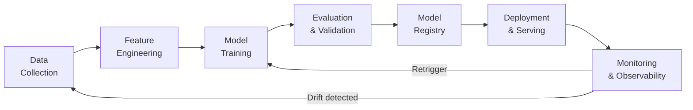
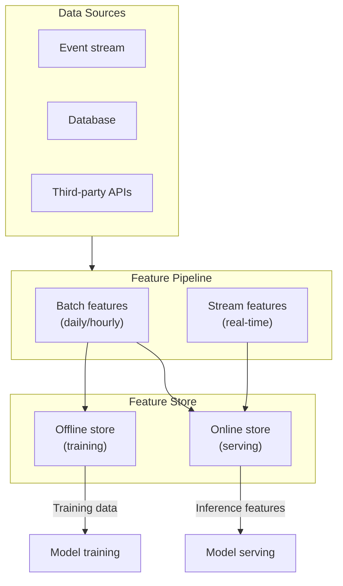
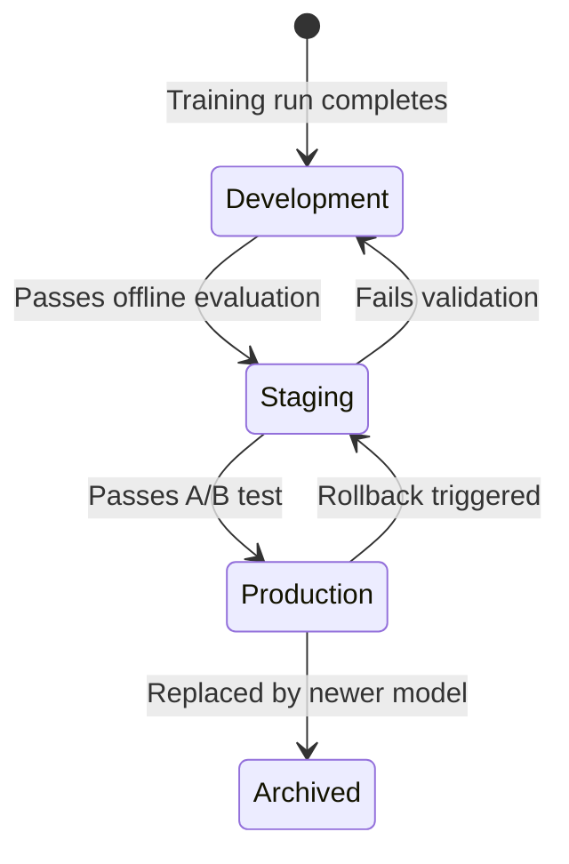
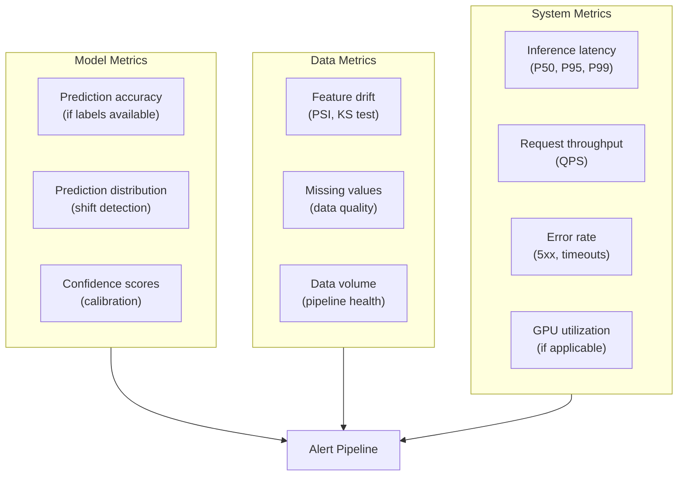
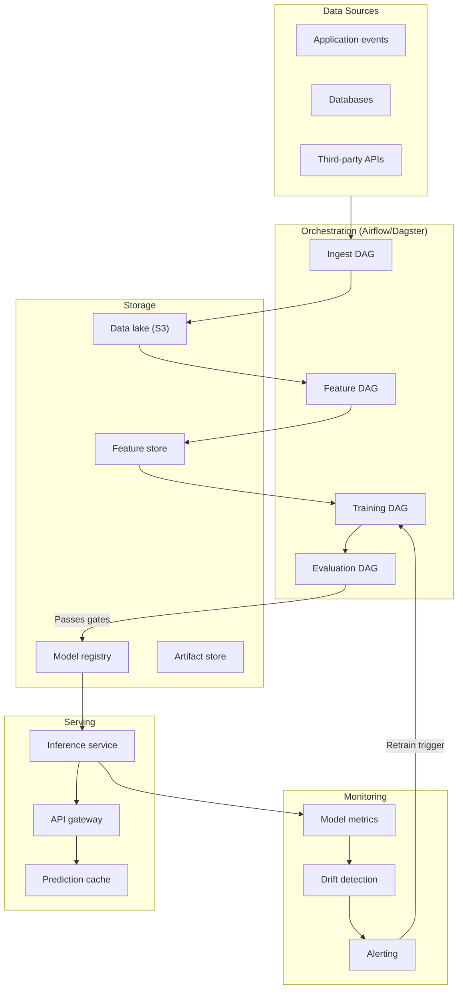

# ML Pipelines & MLOps

Machine learning in production is an engineering discipline, not a science experiment. The model is 5% of the system. The other 95% is data pipelines, feature computation, experiment tracking, model versioning, deployment orchestration, monitoring, and retraining automation. MLOps is the practice of applying software engineering rigor to this entire lifecycle.

This page covers the end-to-end ML pipeline, from raw data to model serving, with the tools, patterns, and operational practices that separate notebook prototypes from systems that run reliably in production.

## The ML Lifecycle



Each stage has distinct engineering challenges:

| Stage | Key Challenge | Common Failure Mode |
|-------|--------------|---------------------|
| **Data collection** | Data quality, schema consistency | Schema drift breaks downstream pipelines |
| **Feature engineering** | Training/serving skew | Features computed differently at train vs. serve time |
| **Training** | Reproducibility | "It worked on my machine" — non-deterministic training |
| **Evaluation** | Offline/online metric gap | Model improves offline metrics but hurts production KPIs |
| **Registry** | Versioning and lineage | Cannot reproduce or rollback to a previous model |
| **Deployment** | Zero-downtime model swaps | Model update causes latency spike or error rate increase |
| **Monitoring** | Silent degradation | Model accuracy drops 20% over 3 months, nobody notices |

## Data Pipeline Foundations

### Training/Serving Skew

The most dangerous bug in ML systems is training/serving skew: the features seen during training differ from those computed at serving time. This happens when:

- Training features are computed in batch (Spark/SQL) but serving features are computed in application code
- Feature transformations (normalization, encoding) are applied differently
- Training data includes future information (data leakage)

The solution is to compute features once and use them in both contexts.



## Feature Stores

A feature store is a centralized repository for feature definitions, computation, and serving. It eliminates training/serving skew by ensuring the same feature logic is used everywhere.

### Feast (Open Source)

```python
# feature_definitions.py
from feast import Entity, Feature, FeatureView, FileSource, Field
from feast.types import Float32, Int64, String
from datetime import timedelta

# Define the data source
user_activity_source = FileSource(
    path="s3://ml-data/user_activity.parquet",
    timestamp_field="event_timestamp",
)

# Define the entity (the thing features describe)
user = Entity(
    name="user_id",
    join_keys=["user_id"],
    description="Unique user identifier",
)

# Define the feature view
user_activity_features = FeatureView(
    name="user_activity",
    entities=[user],
    ttl=timedelta(days=1),
    schema=[
        Field(name="total_orders_30d", dtype=Int64),
        Field(name="avg_order_value_30d", dtype=Float32),
        Field(name="days_since_last_order", dtype=Int64),
        Field(name="preferred_category", dtype=String),
    ],
    source=user_activity_source,
)
```

```python
# Training: get historical features (point-in-time correct)
from feast import FeatureStore

store = FeatureStore(repo_path=".")

training_df = store.get_historical_features(
    entity_df=entity_dataframe,  # DataFrame with user_id and event_timestamp
    features=[
        "user_activity:total_orders_30d",
        "user_activity:avg_order_value_30d",
        "user_activity:days_since_last_order",
    ],
).to_df()

# Serving: get online features (latest values)
feature_vector = store.get_online_features(
    features=[
        "user_activity:total_orders_30d",
        "user_activity:avg_order_value_30d",
        "user_activity:days_since_last_order",
    ],
    entity_rows=[{"user_id": "user_12345"}],
).to_dict()
```

### Feature Store Comparison

| Feature | Feast | Tecton | SageMaker Feature Store | Vertex AI Feature Store |
|---------|-------|--------|-------------------------|------------------------|
| **Deployment** | Self-hosted | Managed | AWS managed | GCP managed |
| **Offline store** | File, BigQuery, Redshift | Databricks, Snowflake | S3 + Athena | BigQuery |
| **Online store** | Redis, DynamoDB | DynamoDB, Redis | DynamoDB | Bigtable |
| **Stream features** | Contrib (alpha) | Native | Lambda-based | Dataflow |
| **Cost** | Free (infra cost) | Enterprise pricing | Pay-per-use | Pay-per-use |
| **Best for** | Open-source flexibility | Enterprise, real-time | AWS-native teams | GCP-native teams |

::: tip Start simple, add complexity later
You do not need a feature store on day one. Start with a shared Python module that computes features identically for training and serving. Migrate to Feast when you have 10+ feature pipelines or multiple teams.
:::

## Experiment Tracking

Every training run should be tracked: hyperparameters, metrics, code version, data version, and artifacts. Without this, you cannot reproduce results, compare experiments, or audit model decisions.

### MLflow

```python
import mlflow
import mlflow.sklearn
from sklearn.ensemble import GradientBoostingClassifier
from sklearn.metrics import accuracy_score, f1_score, roc_auc_score

mlflow.set_tracking_uri("http://mlflow.internal:5000")
mlflow.set_experiment("churn-prediction-v2")

with mlflow.start_run(run_name="gbm-tuned-2026-03-20"):
    # Log parameters
    params = {
        "n_estimators": 500,
        "max_depth": 6,
        "learning_rate": 0.05,
        "subsample": 0.8,
        "min_samples_leaf": 20,
    }
    mlflow.log_params(params)

    # Log data metadata
    mlflow.log_param("training_data_version", "v2.3.1")
    mlflow.log_param("training_rows", len(X_train))
    mlflow.log_param("feature_count", X_train.shape[1])

    # Train
    model = GradientBoostingClassifier(**params)
    model.fit(X_train, y_train)

    # Evaluate
    y_pred = model.predict(X_test)
    y_proba = model.predict_proba(X_test)[:, 1]

    metrics = {
        "accuracy": accuracy_score(y_test, y_pred),
        "f1": f1_score(y_test, y_pred),
        "auc_roc": roc_auc_score(y_test, y_proba),
    }
    mlflow.log_metrics(metrics)

    # Log the model artifact
    mlflow.sklearn.log_model(
        model,
        "model",
        registered_model_name="churn-predictor",
    )

    # Log feature importance plot
    mlflow.log_artifact("feature_importance.png")

    print(f"Run ID: {mlflow.active_run().info.run_id}")
    print(f"Metrics: {metrics}")
```

### Weights & Biases (W&B)

```python
import wandb

wandb.init(
    project="churn-prediction",
    name="gbm-tuned-2026-03-20",
    config={
        "model": "GradientBoostingClassifier",
        "n_estimators": 500,
        "max_depth": 6,
        "learning_rate": 0.05,
        "dataset_version": "v2.3.1",
    },
)

# Training loop with logging
for epoch in range(num_epochs):
    train_loss = train_one_epoch(model, train_loader)
    val_loss, val_metrics = evaluate(model, val_loader)

    wandb.log({
        "epoch": epoch,
        "train_loss": train_loss,
        "val_loss": val_loss,
        "val_accuracy": val_metrics["accuracy"],
        "val_f1": val_metrics["f1"],
    })

# Log final model
wandb.save("model_checkpoint.pt")
wandb.finish()
```

### Experiment Tracking Comparison

| Feature | MLflow | W&B | Neptune | ClearML |
|---------|--------|-----|---------|---------|
| **Deployment** | Self-hosted / Databricks | Managed / self-hosted | Managed / self-hosted | Self-hosted |
| **UI quality** | Good | Excellent | Good | Good |
| **Collaboration** | Basic | Strong (reports, teams) | Good | Good |
| **Artifact storage** | S3, GCS, local | W&B servers / S3 | S3, GCS | S3, GCS |
| **Model registry** | Built-in | Built-in | Basic | Built-in |
| **Cost** | Free (OSS) | Free tier, paid teams | Paid | Free (OSS) |
| **Best for** | MLflow ecosystem / Databricks | Teams, deep learning | Lightweight tracking | End-to-end pipeline |

## Model Registry and Versioning

The model registry is the single source of truth for which model is in production, which is being tested, and which has been retired.



### MLflow Model Registry

```python
from mlflow.tracking import MlflowClient

client = MlflowClient()

# Register a new model version
model_version = client.create_model_version(
    name="churn-predictor",
    source=f"runs:/{run_id}/model",
    run_id=run_id,
    description="GBM with tuned hyperparameters, 2026-03-20 training data",
)

# Transition to staging
client.transition_model_version_stage(
    name="churn-predictor",
    version=model_version.version,
    stage="Staging",
)

# After validation, promote to production
client.transition_model_version_stage(
    name="churn-predictor",
    version=model_version.version,
    stage="Production",
)

# Load the production model for serving
import mlflow.pyfunc

model = mlflow.pyfunc.load_model("models:/churn-predictor/Production")
predictions = model.predict(feature_dataframe)
```

::: warning Model versioning is not optional
Every model in production must have a version number, a pointer to the training run that created it, and the ability to rollback. Without this, debugging a production issue becomes archaeological excavation.
:::

## CI/CD for Machine Learning

ML CI/CD extends traditional CI/CD with data validation, model training, evaluation gates, and model deployment steps.

### GitHub Actions ML Pipeline

```yaml
# .github/workflows/ml-pipeline.yml
name: ML Pipeline

on:
  push:
    paths:
      - 'ml/**'
      - 'features/**'
      - 'data/schemas/**'

jobs:
  data-validation:
    runs-on: ubuntu-latest
    steps:
      - uses: actions/checkout@v4
      - name: Validate data schema
        run: python ml/validate_schema.py --source s3://ml-data/latest/
      - name: Check data quality
        run: python ml/data_quality_checks.py

  train:
    needs: data-validation
    runs-on: [self-hosted, gpu]
    steps:
      - uses: actions/checkout@v4
      - name: Install dependencies
        run: pip install -r ml/requirements.txt
      - name: Train model
        run: python ml/train.py --config ml/configs/production.yaml
        env:
          MLFLOW_TRACKING_URI: $&#123;&#123; secrets.MLFLOW_URI &#125;&#125;
      - name: Upload model artifact
        uses: actions/upload-artifact@v4
        with:
          name: model
          path: ml/artifacts/

  evaluate:
    needs: train
    runs-on: ubuntu-latest
    steps:
      - uses: actions/checkout@v4
      - name: Download model artifact
        uses: actions/download-artifact@v4
        with:
          name: model
          path: ml/artifacts/
      - name: Run evaluation suite
        run: python ml/evaluate.py --model ml/artifacts/model
      - name: Check quality gates
        run: |
          python ml/quality_gates.py \
            --min-accuracy 0.85 \
            --min-f1 0.80 \
            --max-latency-p99-ms 50

  deploy:
    needs: evaluate
    if: github.ref == 'refs/heads/main'
    runs-on: ubuntu-latest
    steps:
      - name: Register model
        run: python ml/register_model.py --stage staging
      - name: Deploy canary (10% traffic)
        run: python ml/deploy.py --strategy canary --traffic-pct 10
      - name: Monitor canary (30 min)
        run: python ml/monitor_canary.py --duration 30m --threshold 0.01
      - name: Promote to production
        run: python ml/deploy.py --strategy canary --traffic-pct 100
```

### Quality Gates

Define explicit thresholds that a model must pass before deployment:

```python
# ml/quality_gates.py
import sys
import json

def check_quality_gates(metrics: dict, gates: dict) -> bool:
    failures = []

    for metric, threshold in gates.items():
        if metric.startswith("min_"):
            actual_metric = metric[4:]
            if metrics.get(actual_metric, 0) < threshold:
                failures.append(
                    f"{actual_metric}: {metrics[actual_metric]:.4f} < {threshold} (minimum)"
                )
        elif metric.startswith("max_"):
            actual_metric = metric[4:]
            if metrics.get(actual_metric, float('inf')) > threshold:
                failures.append(
                    f"{actual_metric}: {metrics[actual_metric]:.4f} > {threshold} (maximum)"
                )

    if failures:
        print("QUALITY GATE FAILURES:")
        for f in failures:
            print(f"  - {f}")
        return False

    print("All quality gates passed.")
    return True

gates = {
    "min_accuracy": 0.85,
    "min_f1_score": 0.80,
    "min_auc_roc": 0.90,
    "max_inference_latency_p99_ms": 50,
    "max_model_size_mb": 500,
}

metrics = json.load(open("ml/artifacts/metrics.json"))
if not check_quality_gates(metrics, gates):
    sys.exit(1)
```

## Model Serving

### Serving Architecture Patterns

| Pattern | Description | Latency | Best For |
|---------|-------------|---------|---------|
| **Embedded** | Model loaded into the application process | <1ms | Small models, simple inference |
| **Model-as-Service** | Dedicated inference service behind an API | 5-50ms | Medium models, shared across services |
| **Serverless** | Model deployed to Lambda/Cloud Functions | 50-500ms (cold start) | Bursty, low-traffic workloads |
| **Batch** | Precompute predictions on a schedule | N/A (precomputed) | Recommendations, scoring large datasets |

### BentoML

```python
# service.py
import bentoml
import numpy as np
from bentoml.io import JSON, NumpyNdarray

# Load model from registry
churn_model = bentoml.sklearn.get("churn-predictor:latest")
runner = churn_model.to_runner()

svc = bentoml.Service("churn-prediction", runners=[runner])

@svc.api(input=JSON(), output=JSON())
async def predict(input_data: dict) -> dict:
    features = np.array([input_data["features"]])
    prediction = await runner.predict.async_run(features)
    probability = await runner.predict_proba.async_run(features)

    return {
        "user_id": input_data["user_id"],
        "churn_prediction": bool(prediction[0]),
        "churn_probability": float(probability[0][1]),
        "model_version": "v2.3.1",
    }
```

```yaml
# bentofile.yaml
service: "service:svc"
include:
  - "*.py"
python:
  requirements_txt: "requirements.txt"
docker:
  base_image: "python:3.11-slim"
```

### Triton Inference Server

For GPU-accelerated serving of deep learning models at scale:

```python
# model_repository/churn_model/config.pbtxt
name: "churn_model"
platform: "onnxruntime_onnx"
max_batch_size: 256
input [
  {
    name: "features"
    data_type: TYPE_FP32
    dims: [ 24 ]  # 24 features
  }
]
output [
  {
    name: "probability"
    data_type: TYPE_FP32
    dims: [ 2 ]
  }
]
instance_group [
  {
    count: 2
    kind: KIND_GPU
  }
]
dynamic_batching {
  preferred_batch_size: [ 64, 128 ]
  max_queue_delay_microseconds: 5000
}
```

### Model Serving Comparison

| Framework | Language | GPU Support | Dynamic Batching | Model Formats |
|-----------|---------|------------|------------------|---------------|
| **BentoML** | Python | Yes | Yes | Any Python model |
| **Triton** | C++/Python | Excellent | Yes | ONNX, TensorRT, PyTorch, TF |
| **TorchServe** | Java/Python | Yes | Yes | PyTorch only |
| **TF Serving** | C++ | Yes | Yes | TensorFlow/SavedModel only |
| **vLLM** | Python | Excellent | Yes (continuous) | LLMs (Llama, Mistral, etc.) |
| **FastAPI** | Python | Manual | No (manual) | Any Python model |

## Monitoring and Observability

### What to Monitor



### Data Drift Detection

```python
from scipy import stats
import numpy as np

def detect_drift(
    reference: np.ndarray,
    current: np.ndarray,
    method: str = "ks",
    threshold: float = 0.05,
) -> dict:
    """Detect distribution drift between reference and current data."""

    if method == "ks":
        # Kolmogorov-Smirnov test
        statistic, p_value = stats.ks_2samp(reference, current)
        is_drift = p_value < threshold
    elif method == "psi":
        # Population Stability Index
        statistic = calculate_psi(reference, current)
        is_drift = statistic > 0.2  # >0.2 = significant shift
        p_value = None
    else:
        raise ValueError(f"Unknown method: {method}")

    return {
        "method": method,
        "statistic": float(statistic),
        "p_value": float(p_value) if p_value is not None else None,
        "is_drift": is_drift,
        "threshold": threshold,
    }

def calculate_psi(reference: np.ndarray, current: np.ndarray, bins: int = 10) -> float:
    """Population Stability Index."""
    ref_hist, bin_edges = np.histogram(reference, bins=bins)
    cur_hist, _ = np.histogram(current, bins=bin_edges)

    ref_pct = ref_hist / len(reference) + 1e-6
    cur_pct = cur_hist / len(current) + 1e-6

    psi = np.sum((cur_pct - ref_pct) * np.log(cur_pct / ref_pct))
    return float(psi)
```

::: danger Silent model degradation
Models degrade silently. Accuracy drops gradually as the world changes (concept drift) or data pipelines break (data drift). Without automated monitoring, you will not notice until users complain — or worse, until a business metric tanks and nobody connects it to the model.
:::

### Monitoring Checklist

| What | How | Alert Threshold |
|------|-----|-----------------|
| Prediction distribution | Compare daily prediction histogram to baseline | PSI > 0.2 |
| Feature distributions | KS test per feature, daily | p-value < 0.01 for > 3 features |
| Inference latency | P99 latency by endpoint | > 2x baseline |
| Error rate | 5xx / total requests | > 1% |
| Model staleness | Days since last retrain | > 30 days (configurable) |
| Data freshness | Time since last feature update | > 2x expected update interval |

## End-to-End Pipeline Architecture



## Further Reading

- [Data Engineering](/data-engineering/) — ETL/ELT patterns, pipeline orchestration, and data quality
- [LLM Integration Patterns](/ai-ml-engineering/llm-integration) — Integrating LLMs into applications
- [Infrastructure: CI/CD](/infrastructure/ci-cd/) — General CI/CD patterns applicable to ML pipelines
- [DevOps: Monitoring](/devops/monitoring/) — Prometheus and Grafana patterns for ML monitoring
- [DevOps: Deployment Strategies](/devops/deployment-strategies/) — Canary and blue-green patterns for model rollout
