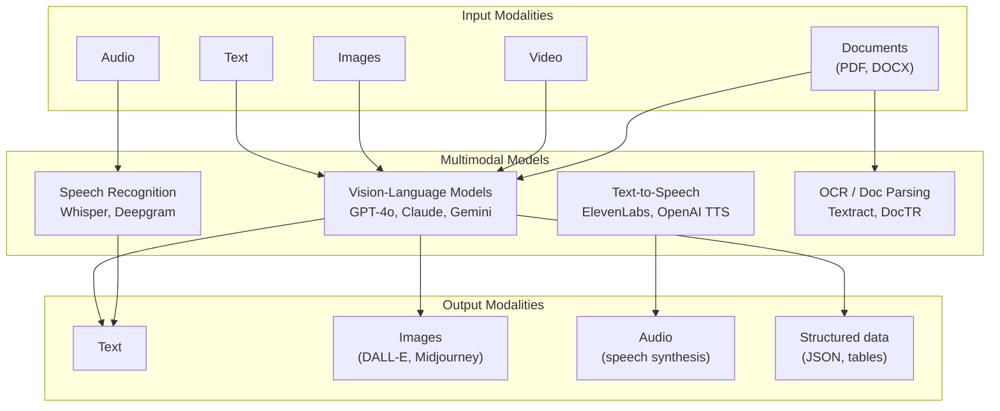
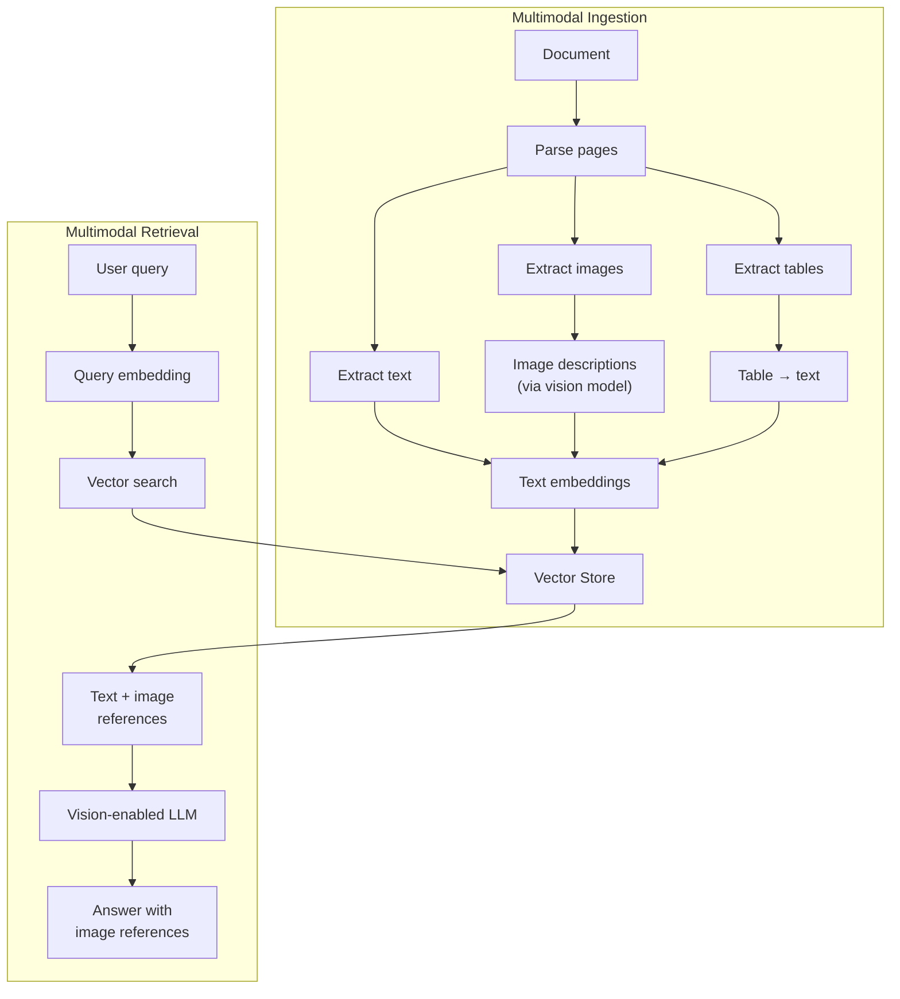

# Multimodal AI

Multimodal AI is the ability for models to understand and generate content across multiple modalities — text, images, audio, and video. This is not a niche feature; it is the direction all frontier models are moving. GPT-4o, Claude, and Gemini all process images natively. Whisper transcribes audio with near-human accuracy. Multimodal [RAG pipelines](/ai-ml-engineering/rag-architecture) combine text and images to answer questions about documents that contain charts, diagrams, and screenshots.

This page covers the practical engineering of multimodal systems: how to use vision models, parse documents, transcribe audio, and build retrieval systems that work across modalities.

## The Multimodal Landscape



## Vision Models

Vision-language models (VLMs) accept images alongside text and can describe, analyze, compare, and reason about visual content.

### Sending Images to Models

```python
from openai import OpenAI
import base64
import httpx

client = OpenAI()

# Method 1: Image URL
response = client.chat.completions.create(
    model="gpt-4o",
    messages=[{
        "role": "user",
        "content": [
            {"type": "text", "text": "Describe this architecture diagram."},
            {
                "type": "image_url",
                "image_url": {"url": "https://example.com/diagram.png"},
            },
        ],
    }],
)

# Method 2: Base64 encoded image (for local files)
def encode_image(image_path: str) -> str:
    with open(image_path, "rb") as f:
        return base64.standard_b64encode(f.read()).decode("utf-8")

base64_image = encode_image("screenshot.png")

response = client.chat.completions.create(
    model="gpt-4o",
    messages=[{
        "role": "user",
        "content": [
            {"type": "text", "text": "What errors are shown in this screenshot?"},
            {
                "type": "image_url",
                "image_url": {
                    "url": f"data:image/png;base64,{base64_image}",
                    "detail": "high",  # "low", "high", or "auto"
                },
            },
        ],
    }],
)
```

```typescript
import Anthropic from "@anthropic-ai/sdk";
import * as fs from "fs";

const anthropic = new Anthropic();

// Anthropic Claude vision
const response = await anthropic.messages.create({
  model: "claude-sonnet-4-20250514",
  max_tokens: 1024,
  messages: [
    {
      role: "user",
      content: [
        {
          type: "image",
          source: {
            type: "base64",
            media_type: "image/png",
            data: fs.readFileSync("screenshot.png").toString("base64"),
          },
        },
        {
          type: "text",
          text: "Describe the architecture shown in this diagram.",
        },
      ],
    },
  ],
});
```

### Vision Model Comparison

| Model | Resolution | Multi-image | Strengths | Token Cost |
|-------|-----------|-------------|-----------|------------|
| **GPT-4o** | Up to 2048px | Yes (up to 10) | Charts, text extraction, UI analysis | 85 tokens per tile |
| **Claude Sonnet/Opus** | Up to 1568px | Yes (up to 20) | Detailed analysis, document understanding | ~1600 tokens per image |
| **Gemini 1.5 Pro** | Up to 3072px | Yes (up to 16) | Best for video frames, long context | ~258 tokens per image |
| **Gemini 1.5 Flash** | Up to 3072px | Yes (up to 16) | Fast, cheap vision | ~258 tokens per image |

### Practical Vision Use Cases

```python
# UI testing — screenshot analysis
response = analyze_image(
    screenshot,
    "List all UI elements visible, their positions, and any visual bugs "
    "(misalignment, overlapping text, broken layouts)."
)

# Data extraction from charts
response = analyze_image(
    chart_image,
    "Extract the data from this bar chart as a JSON array of "
    "{label: string, value: number} objects."
)

# Code review from screenshots
response = analyze_image(
    code_screenshot,
    "Review this code for bugs, security issues, and style problems."
)

# Accessibility audit
response = analyze_image(
    webpage_screenshot,
    "Evaluate this webpage for accessibility issues: contrast ratios, "
    "missing alt text indicators, interactive element sizes, and color-only "
    "information."
)
```

::: tip Image resolution affects cost and quality
Use `detail: "low"` (fixed 85 tokens) for simple classification tasks. Use `detail: "high"` for text extraction, chart reading, or detailed analysis. High detail tiles the image into 512x512 patches — large images can use thousands of tokens.
:::

## Document Parsing

Documents (PDFs, presentations, invoices) are the most common real-world input for enterprise AI systems. They combine text, tables, images, and complex layouts.

### Approach Comparison

| Approach | How It Works | Best For |
|----------|-------------|----------|
| **Text extraction** (PyPDF, pdfplumber) | Extract raw text | Text-heavy documents |
| **OCR** (Tesseract, DocTR) | Image-based text recognition | Scanned documents |
| **Vision model** (GPT-4o, Claude) | Send page as image | Complex layouts, charts |
| **Specialized parser** (AWS Textract, Azure Form Recognizer) | ML-based structure extraction | Forms, invoices, tables |
| **Hybrid** | Text extraction + vision for images/charts | Most production use cases |

### Hybrid Document Pipeline

```python
import fitz  # PyMuPDF
from openai import OpenAI

client = OpenAI()

def parse_document(pdf_path: str) -> list[dict]:
    """Parse a PDF using text extraction + vision for complex pages."""
    doc = fitz.open(pdf_path)
    pages = []

    for page_num, page in enumerate(doc):
        # Extract text
        text = page.get_text("text")

        # Check if page has images or complex layout
        images = page.get_images()
        tables = page.find_tables()

        if images or tables or len(text.strip()) < 50:
            # Complex page — use vision model
            pix = page.get_pixmap(dpi=150)
            img_bytes = pix.tobytes("png")
            base64_img = base64.standard_b64encode(img_bytes).decode()

            response = client.chat.completions.create(
                model="gpt-4o",
                messages=[{
                    "role": "user",
                    "content": [
                        {"type": "text", "text": (
                            "Extract ALL text, tables, and data from this "
                            "document page. Preserve structure. Output as markdown."
                        )},
                        {
                            "type": "image_url",
                            "image_url": {
                                "url": f"data:image/png;base64,{base64_img}",
                                "detail": "high",
                            },
                        },
                    ],
                }],
            )
            parsed_content = response.choices[0].message.content
        else:
            # Text-heavy page — use extracted text
            parsed_content = text

        pages.append({
            "page": page_num + 1,
            "content": parsed_content,
            "method": "vision" if images or tables else "text",
            "metadata": {
                "has_images": bool(images),
                "has_tables": bool(tables),
            },
        })

    return pages
```

## Audio: Speech-to-Text

### OpenAI Whisper

Whisper is an open-source automatic speech recognition (ASR) model. Use it via the OpenAI API or run it locally.

```python
from openai import OpenAI

client = OpenAI()

# Transcription
with open("meeting.mp3", "rb") as audio_file:
    transcript = client.audio.transcriptions.create(
        model="whisper-1",
        file=audio_file,
        language="en",                # optional, auto-detects
        response_format="verbose_json", # includes timestamps
        timestamp_granularities=["segment", "word"],
    )

print(transcript.text)
for segment in transcript.segments:
    print(f"[{segment.start:.1f}s - {segment.end:.1f}s] {segment.text}")
```

```typescript
import OpenAI from "openai";
import * as fs from "fs";

const openai = new OpenAI();

const transcription = await openai.audio.transcriptions.create({
  model: "whisper-1",
  file: fs.createReadStream("meeting.mp3"),
  response_format: "verbose_json",
});
```

### Running Whisper Locally

For data privacy or cost reasons, run Whisper locally:

```python
import whisper

model = whisper.load_model("large-v3")  # tiny, base, small, medium, large-v3

result = model.transcribe(
    "meeting.mp3",
    language="en",
    task="transcribe",     # or "translate" (to English)
    word_timestamps=True,
)

for segment in result["segments"]:
    print(f"[{segment['start']:.1f}s] {segment['text']}")
```

### Whisper Model Sizes

| Model | Parameters | VRAM | Speed (vs real-time) | WER (English) |
|-------|-----------|------|---------------------|---------------|
| tiny | 39M | ~1 GB | ~32x | ~7.7% |
| base | 74M | ~1 GB | ~16x | ~6.7% |
| small | 244M | ~2 GB | ~6x | ~5.5% |
| medium | 769M | ~5 GB | ~2x | ~4.8% |
| large-v3 | 1550M | ~10 GB | ~1x | ~3.0% |

### Audio Pipeline for Meeting Summarization

```python
async def summarize_meeting(audio_path: str) -> dict:
    """Full pipeline: transcribe -> diarize -> summarize."""
    # Step 1: Transcribe
    transcript = await transcribe(audio_path)

    # Step 2: Speaker diarization (who said what)
    diarized = await diarize_speakers(audio_path, transcript)

    # Step 3: Summarize with LLM
    summary = await client.chat.completions.create(
        model="gpt-4o",
        messages=[
            {"role": "system", "content": (
                "Summarize this meeting transcript. Include: "
                "1) Key decisions made "
                "2) Action items with assignees "
                "3) Open questions"
            )},
            {"role": "user", "content": diarized},
        ],
    )

    return {
        "transcript": diarized,
        "summary": summary.choices[0].message.content,
    }
```

## Text-to-Speech

Generate natural-sounding speech from text:

```python
from openai import OpenAI
from pathlib import Path

client = OpenAI()

# Generate speech
response = client.audio.speech.create(
    model="tts-1-hd",    # tts-1 (fast) or tts-1-hd (quality)
    voice="nova",         # alloy, echo, fable, onyx, nova, shimmer
    input="Welcome to the engineering knowledge base. "
          "Today we are covering multimodal AI patterns.",
    speed=1.0,            # 0.25 to 4.0
)

# Save to file
speech_file = Path("output.mp3")
response.stream_to_file(speech_file)

# Or stream in real-time
response = client.audio.speech.create(
    model="tts-1",
    voice="nova",
    input=text,
)
for chunk in response.iter_bytes(chunk_size=4096):
    audio_player.write(chunk)
```

### TTS Provider Comparison

| Provider | Quality | Latency | Cost | Custom Voices |
|----------|---------|---------|------|---------------|
| **OpenAI TTS** | Good | ~500ms TTFB | $15/1M chars | No |
| **ElevenLabs** | Excellent | ~300ms TTFB | $0.18-0.30/1K chars | Yes (voice cloning) |
| **Google Cloud TTS** | Good | ~200ms TTFB | $4-16/1M chars | Custom (WaveNet) |
| **Azure Speech** | Good | ~200ms TTFB | $1-16/1M chars | Custom Neural Voice |
| **Coqui TTS** | Good | Local only | Free (open-source) | Yes (local training) |

## Video Understanding

Video understanding is primarily done by extracting frames and analyzing them with vision models.

### Frame Extraction Pipeline

```python
import cv2
import base64

def extract_key_frames(
    video_path: str,
    interval_seconds: float = 2.0,
    max_frames: int = 50,
) -> list[str]:
    """Extract key frames from a video at regular intervals."""
    video = cv2.VideoCapture(video_path)
    fps = video.get(cv2.CAP_PROP_FPS)
    total_frames = int(video.get(cv2.CAP_PROP_FRAME_COUNT))
    frame_interval = int(fps * interval_seconds)

    frames_base64 = []
    frame_count = 0

    while video.isOpened() and len(frames_base64) < max_frames:
        ret, frame = video.read()
        if not ret:
            break

        if frame_count % frame_interval == 0:
            _, buffer = cv2.imencode(".jpg", frame, [cv2.IMWRITE_JPEG_QUALITY, 85])
            b64 = base64.standard_b64encode(buffer).decode("utf-8")
            frames_base64.append(b64)

        frame_count += 1

    video.release()
    return frames_base64

def analyze_video(video_path: str, question: str) -> str:
    """Analyze a video by extracting frames and using a vision model."""
    frames = extract_key_frames(video_path, interval_seconds=3.0)

    content = [{"type": "text", "text": question}]
    for i, frame in enumerate(frames):
        content.append({
            "type": "image_url",
            "image_url": {
                "url": f"data:image/jpeg;base64,{frame}",
                "detail": "low",  # use low detail to save tokens
            },
        })

    response = client.chat.completions.create(
        model="gpt-4o",
        messages=[{"role": "user", "content": content}],
        max_tokens=1000,
    )
    return response.choices[0].message.content
```

### Gemini Native Video

Google Gemini supports direct video input without frame extraction:

```python
import google.generativeai as genai

genai.configure(api_key="your-api-key")

# Upload video
video_file = genai.upload_file("demo.mp4")

# Wait for processing
while video_file.state.name == "PROCESSING":
    time.sleep(5)
    video_file = genai.get_file(video_file.name)

# Analyze
model = genai.GenerativeModel("gemini-1.5-pro")
response = model.generate_content([
    video_file,
    "Summarize the key points in this video. List any code shown on screen."
])
```

::: tip Gemini for video, GPT-4o for images
Gemini 1.5 Pro handles video natively with its 1M+ token context window — no frame extraction needed. For single image analysis and chart/table extraction, GPT-4o and Claude tend to perform better. Choose based on modality.
:::

## Multimodal RAG

Standard RAG works with text. Multimodal RAG extends it to handle documents with images, charts, diagrams, and tables.

### Architecture



### Implementation

```python
def ingest_multimodal_document(pdf_path: str, vectorstore):
    """Ingest a document with text, images, and tables into a vector store."""
    doc = fitz.open(pdf_path)

    for page_num, page in enumerate(doc):
        # Extract text
        text = page.get_text("text")
        if text.strip():
            vectorstore.add_texts(
                texts=[text],
                metadatas=[{
                    "source": pdf_path,
                    "page": page_num + 1,
                    "type": "text",
                }],
            )

        # Extract and describe images
        for img_idx, img in enumerate(page.get_images()):
            xref = img[0]
            pix = fitz.Pixmap(doc, xref)
            img_bytes = pix.tobytes("png")
            b64 = base64.standard_b64encode(img_bytes).decode()

            # Generate text description of the image
            description = describe_image(b64)

            vectorstore.add_texts(
                texts=[description],
                metadatas=[{
                    "source": pdf_path,
                    "page": page_num + 1,
                    "type": "image",
                    "image_index": img_idx,
                    "image_base64": b64,  # store for retrieval
                }],
            )

def describe_image(base64_image: str) -> str:
    """Generate a detailed text description of an image for embedding."""
    response = client.chat.completions.create(
        model="gpt-4o",
        messages=[{
            "role": "user",
            "content": [
                {"type": "text", "text": (
                    "Describe this image in detail. Include: "
                    "all visible text, data values, relationships, "
                    "and what the image represents. Be thorough."
                )},
                {
                    "type": "image_url",
                    "image_url": {
                        "url": f"data:image/png;base64,{base64_image}",
                        "detail": "high",
                    },
                },
            ],
        }],
    )
    return response.choices[0].message.content


def multimodal_query(question: str, vectorstore) -> str:
    """Query with text, retrieve text + images, answer with vision model."""
    results = vectorstore.similarity_search(question, k=5)

    # Build multimodal context
    content = [{"type": "text", "text": (
        f"Answer this question based on the context:\n\n"
        f"Question: {question}\n\nContext:\n"
    )}]

    for result in results:
        content.append({"type": "text", "text": result.page_content})

        # Include original images if available
        if result.metadata.get("type") == "image":
            b64 = result.metadata.get("image_base64")
            if b64:
                content.append({
                    "type": "image_url",
                    "image_url": {"url": f"data:image/png;base64,{b64}"},
                })

    response = client.chat.completions.create(
        model="gpt-4o",
        messages=[{"role": "user", "content": content}],
    )
    return response.choices[0].message.content
```

::: warning Multimodal RAG is expensive
Each image costs 85-1500+ tokens depending on resolution. A PDF with 50 pages of charts can cost $1+ per query in image tokens alone. Use image descriptions for initial retrieval, and only pass the actual images to the final generation step when they are retrieved.
:::

## Cost Considerations by Modality

| Modality | Input Cost | Processing | Latency | Accuracy |
|----------|-----------|------------|---------|----------|
| **Text** | $0.15-2.50/1M tokens | Standard | Low | High |
| **Images** | 85-1600 tokens/image | Vision model | Medium | High |
| **Audio** | $0.006/min (Whisper API) | Transcription | ~0.5x real-time | High (>95%) |
| **Video** | Varies (frame extraction) | Per-frame vision | High | Medium-High |
| **Documents** | Per-page parsing | Text + vision | Medium | High with hybrid |

## Further Reading

- [RAG Architecture Deep Dive](/ai-ml-engineering/rag-architecture) — Foundation for multimodal RAG
- [Embeddings & Semantic Search](/ai-ml-engineering/embeddings) — Text and image embeddings
- [LLM Integration Patterns](/ai-ml-engineering/llm-integration) — API patterns for multimodal calls
- [AI in Production](/ai-ml-engineering/ai-in-production) — Cost and latency optimization
- [Prompt Caching & Context Management](/ai-ml-engineering/prompt-caching) — Managing multimodal context costs
- [OpenAI Vision Guide](https://platform.openai.com/docs/guides/vision) — Official GPT-4o vision docs
- [Whisper GitHub](https://github.com/openai/whisper) — Open-source speech recognition
