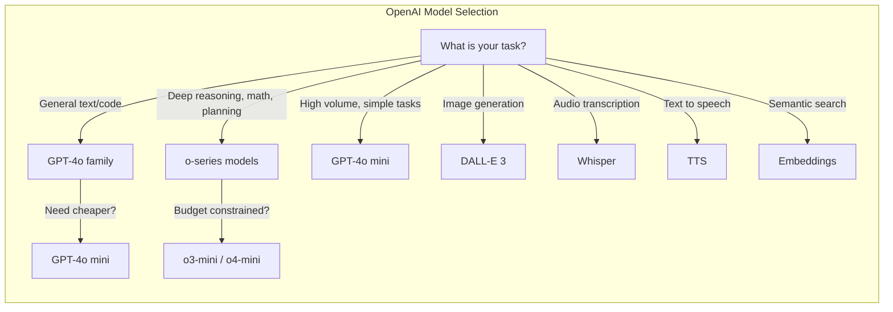
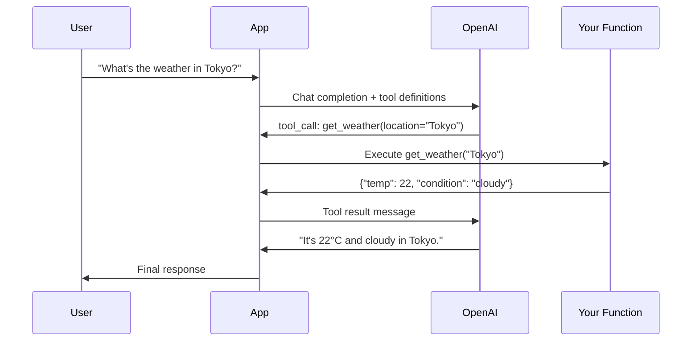
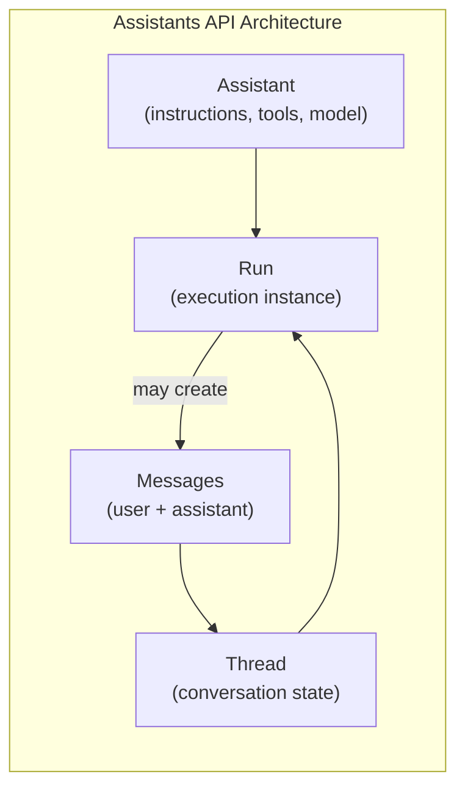
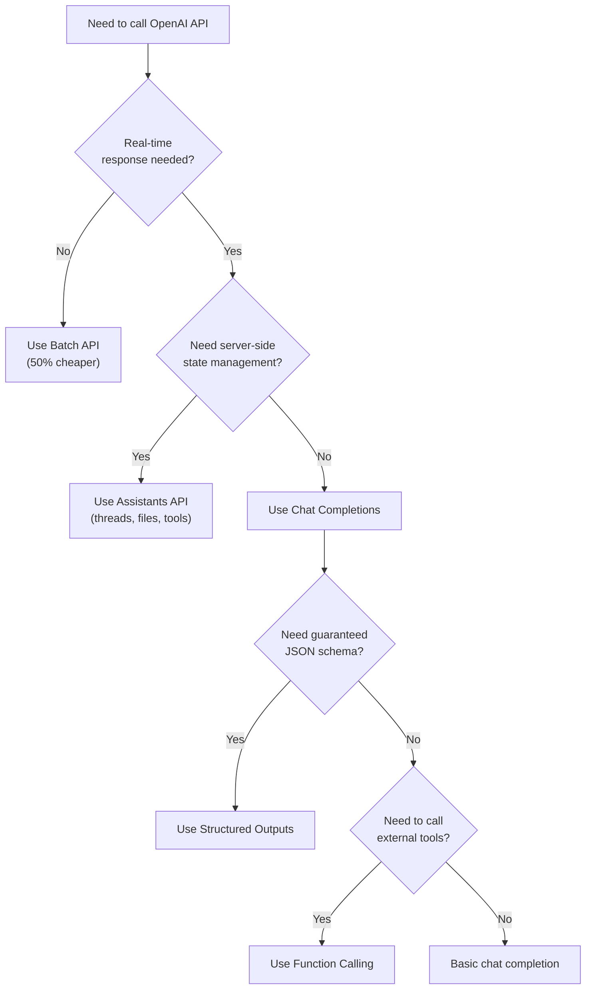

# OpenAI API Patterns

OpenAI's API is the most widely adopted LLM API in production systems. Whether you are building a chatbot, a code assistant, an image generator, or a multi-modal agent, the patterns you use with this API determine your system's reliability, cost efficiency, and user experience. This page covers every major endpoint — from chat completions and function calling to the Assistants API, DALL-E, Whisper, TTS, embeddings, and batch processing — with production-ready code and architectural guidance.

## The Model Landscape

OpenAI maintains multiple model families, each optimized for different workloads. Choosing the right model is your highest-leverage decision.

| Model | Type | Context Window | Strengths | Best For |
|-------|------|---------------|-----------|----------|
| **GPT-4o** | Multimodal | 128K tokens | Vision, speed, cost-efficiency | General production workloads |
| **GPT-4o mini** | Multimodal | 128K tokens | Cheapest, fastest | High-volume classification, extraction |
| **o1** | Reasoning | 200K tokens | Deep reasoning, math, code | Complex problem-solving, planning |
| **o3** | Reasoning | 200K tokens | Strongest reasoning | Research, scientific analysis |
| **o3-mini** | Reasoning | 200K tokens | Fast reasoning, cost-effective | Moderate reasoning at scale |
| **o4-mini** | Reasoning | 200K tokens | Best value reasoning | Balanced reasoning + cost |



::: tip GPT-4o vs o-series: When to Reason
Use GPT-4o for tasks where the model needs to follow instructions, generate content, or classify data. Use o1/o3 when the model needs to *think through* a problem — multi-step math, code architecture, scientific reasoning, or planning. The o-series models spend "thinking tokens" internally before responding, which costs more but produces dramatically better results on hard problems.
:::

## Chat Completions API

The Chat Completions endpoint is the workhorse of the OpenAI API. Every text interaction flows through it.

### Basic Usage

```python
from openai import OpenAI

client = OpenAI()  # Uses OPENAI_API_KEY env var

response = client.chat.completions.create(
    model="gpt-4o",
    messages=[
        {"role": "system", "content": "You are a senior backend engineer."},
        {"role": "user", "content": "Explain connection pooling in PostgreSQL."}
    ],
    temperature=0.7,
    max_tokens=1024,
)

print(response.choices[0].message.content)
print(f"Tokens used: {response.usage.total_tokens}")
```

```typescript
import OpenAI from "openai";

const client = new OpenAI(); // Uses OPENAI_API_KEY env var

const response = await client.chat.completions.create({
  model: "gpt-4o",
  messages: [
    { role: "system", content: "You are a senior backend engineer." },
    { role: "user", content: "Explain connection pooling in PostgreSQL." },
  ],
  temperature: 0.7,
  max_tokens: 1024,
});

console.log(response.choices[0].message.content);
```

### Streaming

For user-facing applications, streaming eliminates the perceived latency of waiting for the full response.

```python
stream = client.chat.completions.create(
    model="gpt-4o",
    messages=[{"role": "user", "content": "Write a Python decorator tutorial."}],
    stream=True,
)

for chunk in stream:
    delta = chunk.choices[0].delta
    if delta.content:
        print(delta.content, end="", flush=True)
```

```typescript
const stream = await client.chat.completions.create({
  model: "gpt-4o",
  messages: [{ role: "user", content: "Write a Python decorator tutorial." }],
  stream: true,
});

for await (const chunk of stream) {
  const content = chunk.choices[0]?.delta?.content;
  if (content) process.stdout.write(content);
}
```

### Reasoning Models (o1 / o3)

The o-series models use internal chain-of-thought reasoning. They do not support `temperature`, `top_p`, or system messages in the same way — the model manages its own reasoning process.

```python
response = client.chat.completions.create(
    model="o3",
    messages=[
        {"role": "user", "content": """
        Design a distributed rate limiter that:
        1. Supports sliding window counters
        2. Works across multiple data centers
        3. Handles clock skew between nodes
        4. Maintains sub-millisecond lookup times

        Provide the algorithm, data structures, and consistency tradeoffs.
        """}
    ],
    # No temperature — o-series manages reasoning internally
    # reasoning_effort controls how much the model "thinks"
    reasoning_effort="high",  # "low", "medium", "high"
)

# The response includes reasoning token usage
print(f"Reasoning tokens: {response.usage.completion_tokens_details.reasoning_tokens}")
print(f"Output tokens: {response.usage.completion_tokens}")
```

::: warning Reasoning Model Costs
Reasoning tokens are billed but not visible in the output. An o3 call that returns 500 output tokens may consume 5,000+ reasoning tokens internally. Monitor `completion_tokens_details.reasoning_tokens` carefully to avoid bill shock.
:::

## Function Calling

Function calling lets the model invoke your code. Instead of generating text, the model returns a structured JSON object specifying which function to call and with what arguments.



### Defining Tools

```python
tools = [
    {
        "type": "function",
        "function": {
            "name": "get_weather",
            "description": "Get current weather for a location",
            "parameters": {
                "type": "object",
                "properties": {
                    "location": {
                        "type": "string",
                        "description": "City name, e.g., 'Tokyo' or 'San Francisco, CA'"
                    },
                    "unit": {
                        "type": "string",
                        "enum": ["celsius", "fahrenheit"],
                        "description": "Temperature unit"
                    }
                },
                "required": ["location"]
            }
        }
    }
]

response = client.chat.completions.create(
    model="gpt-4o",
    messages=[{"role": "user", "content": "What's the weather in Tokyo?"}],
    tools=tools,
    tool_choice="auto",  # "auto", "required", "none", or specific function
)

# Check if the model wants to call a tool
message = response.choices[0].message
if message.tool_calls:
    for tool_call in message.tool_calls:
        name = tool_call.function.name
        args = json.loads(tool_call.function.arguments)
        print(f"Call {name} with {args}")
```

### Processing Tool Results

```python
import json

def process_tool_calls(client, messages, tools):
    """Complete ReAct loop: call model, execute tools, return final answer."""
    while True:
        response = client.chat.completions.create(
            model="gpt-4o",
            messages=messages,
            tools=tools,
        )
        message = response.choices[0].message
        messages.append(message)

        if not message.tool_calls:
            return message.content  # Final text response

        # Execute each tool call
        for tool_call in message.tool_calls:
            fn_name = tool_call.function.name
            fn_args = json.loads(tool_call.function.arguments)
            result = execute_function(fn_name, fn_args)  # Your dispatch logic

            messages.append({
                "role": "tool",
                "tool_call_id": tool_call.id,
                "content": json.dumps(result),
            })
```

## Structured Outputs

Structured Outputs guarantee the model's response conforms to a JSON Schema. Unlike basic JSON mode, the model is *constrained* at the token level — it literally cannot produce invalid JSON.

```python
from pydantic import BaseModel
from openai import OpenAI

class CodeReview(BaseModel):
    summary: str
    issues: list[dict]  # Each has "severity", "line", "description"
    score: int           # 1-10
    approved: bool

client = OpenAI()

response = client.beta.chat.completions.parse(
    model="gpt-4o",
    messages=[
        {"role": "system", "content": "Review the following code and provide structured feedback."},
        {"role": "user", "content": "def fib(n): return fib(n-1) + fib(n-2) if n > 1 else n"}
    ],
    response_format=CodeReview,
)

review = response.choices[0].message.parsed
print(f"Score: {review.score}/10, Approved: {review.approved}")
for issue in review.issues:
    print(f"  [{issue['severity']}] Line {issue['line']}: {issue['description']}")
```

::: tip Structured Outputs vs JSON Mode
**JSON mode** (`response_format={"type": "json_object"}`) asks the model to produce valid JSON, but the schema is enforced only by the prompt. **Structured Outputs** (`response_format=YourSchema`) constrain generation at the decoding level — the output is guaranteed to match your schema. Always prefer Structured Outputs when available.
:::

## Assistants API

The Assistants API manages conversation state, file storage, and tool execution server-side. Instead of you managing message history, threads, and tool dispatch, OpenAI handles it.



### Creating an Assistant

```python
assistant = client.beta.assistants.create(
    name="Data Analyst",
    instructions="""You are a data analyst. When given data questions:
    1. Write Python code to analyze the data
    2. Execute it using the code interpreter
    3. Present findings with visualizations when helpful""",
    model="gpt-4o",
    tools=[
        {"type": "code_interpreter"},
        {"type": "file_search"},
    ],
)
```

### Threads and Runs

```python
# Create a thread (conversation)
thread = client.beta.threads.create()

# Add a message
client.beta.threads.messages.create(
    thread_id=thread.id,
    role="user",
    content="Analyze the sales trends in the attached CSV.",
    attachments=[{
        "file_id": uploaded_file.id,
        "tools": [{"type": "code_interpreter"}]
    }]
)

# Create and poll a run
run = client.beta.threads.runs.create_and_poll(
    thread_id=thread.id,
    assistant_id=assistant.id,
)

if run.status == "completed":
    messages = client.beta.threads.messages.list(thread_id=thread.id)
    for msg in messages:
        if msg.role == "assistant":
            print(msg.content[0].text.value)
```

### File Search (RAG)

The Assistants API includes built-in RAG via vector stores.

```python
# Create a vector store
vector_store = client.beta.vector_stores.create(name="Product Docs")

# Upload files to the vector store
file_batch = client.beta.vector_stores.file_batches.upload_and_poll(
    vector_store_id=vector_store.id,
    files=[open("docs/api-reference.pdf", "rb"),
           open("docs/user-guide.pdf", "rb")],
)

# Attach to assistant
client.beta.assistants.update(
    assistant_id=assistant.id,
    tool_resources={"file_search": {"vector_store_ids": [vector_store.id]}},
)
```

### Code Interpreter

The code interpreter runs Python in a sandboxed environment. It can process files, generate charts, and perform calculations.

```python
# The assistant automatically uses code interpreter when appropriate
client.beta.threads.messages.create(
    thread_id=thread.id,
    role="user",
    content="""Using the uploaded dataset:
    1. Calculate monthly revenue growth rate
    2. Identify the top 3 products by margin
    3. Create a bar chart comparing Q1 vs Q2 performance"""
)

run = client.beta.threads.runs.create_and_poll(
    thread_id=thread.id,
    assistant_id=assistant.id,
)

# The response may include generated images
messages = client.beta.threads.messages.list(thread_id=thread.id)
for msg in messages:
    for content in msg.content:
        if content.type == "image_file":
            # Download the generated chart
            image_data = client.files.content(content.image_file.file_id)
            image_data.write_to_file(f"chart_{content.image_file.file_id}.png")
```

## Multimodal: Vision

GPT-4o natively processes images alongside text. Pass images as base64 or URLs.

```python
import base64

def analyze_image(image_path: str, question: str) -> str:
    with open(image_path, "rb") as f:
        b64_image = base64.standard_b64encode(f.read()).decode("utf-8")

    response = client.chat.completions.create(
        model="gpt-4o",
        messages=[{
            "role": "user",
            "content": [
                {"type": "text", "text": question},
                {
                    "type": "image_url",
                    "image_url": {
                        "url": f"data:image/png;base64,{b64_image}",
                        "detail": "high"  # "low", "high", or "auto"
                    }
                }
            ]
        }],
        max_tokens=1024,
    )
    return response.choices[0].message.content

# Usage
result = analyze_image("architecture-diagram.png", "Identify potential single points of failure.")
```

::: warning Image Token Costs
High-detail images can consume 1,000+ tokens per image. A 2048x2048 image at `detail: "high"` uses approximately 1,105 tokens. Use `detail: "low"` (85 tokens) for tasks that do not require fine-grained visual analysis.
:::

## DALL-E Image Generation

```python
response = client.images.generate(
    model="dall-e-3",
    prompt="A minimalist isometric illustration of a microservices architecture, technical style, white background",
    size="1024x1024",
    quality="hd",       # "standard" or "hd"
    style="natural",    # "vivid" or "natural"
    n=1,
)

image_url = response.data[0].url
revised_prompt = response.data[0].revised_prompt  # DALL-E 3 rewrites prompts
```

## Audio: Whisper and TTS

### Transcription (Whisper)

```python
# Transcribe audio to text
with open("meeting-recording.mp3", "rb") as audio_file:
    transcription = client.audio.transcriptions.create(
        model="whisper-1",
        file=audio_file,
        response_format="verbose_json",  # Includes word-level timestamps
        timestamp_granularities=["word", "segment"],
    )

for segment in transcription.segments:
    print(f"[{segment['start']:.1f}s] {segment['text']}")
```

### Text-to-Speech (TTS)

```python
response = client.audio.speech.create(
    model="tts-1-hd",         # "tts-1" (fast) or "tts-1-hd" (quality)
    voice="nova",              # alloy, echo, fable, onyx, nova, shimmer
    input="Welcome to the system architecture review.",
    speed=1.0,                 # 0.25 to 4.0
)

response.write_to_file("welcome.mp3")
```

## Embeddings API

Embeddings convert text into dense vectors for semantic search, clustering, and classification.

```python
def get_embeddings(texts: list[str], model: str = "text-embedding-3-large") -> list[list[float]]:
    """Generate embeddings for a batch of texts."""
    response = client.embeddings.create(
        model=model,
        input=texts,
        dimensions=1536,  # text-embedding-3 supports dimension reduction
    )
    return [item.embedding for item in response.data]

# Embedding models comparison
# text-embedding-3-small: 1536 dims, cheapest, good for most use cases
# text-embedding-3-large: 3072 dims (reducible), best quality
```

| Model | Dimensions | Max Tokens | MTEB Score | Price (per 1M tokens) |
|-------|-----------|------------|------------|----------------------|
| text-embedding-3-small | 1536 | 8191 | 62.3 | $0.02 |
| text-embedding-3-large | 3072 | 8191 | 64.6 | $0.13 |
| text-embedding-ada-002 | 1536 | 8191 | 61.0 | $0.10 |

::: tip Dimension Reduction
`text-embedding-3-large` supports the `dimensions` parameter to reduce output dimensionality (e.g., 256, 512, 1024). Lower dimensions reduce storage and improve search speed with minimal quality loss. Test with your specific data to find the sweet spot.
:::

## Batch API

The Batch API processes large volumes of requests at 50% reduced cost with a 24-hour turnaround.

```python
import json

# 1. Prepare a JSONL file of requests
requests = []
for i, prompt in enumerate(prompts):
    requests.append({
        "custom_id": f"request-{i}",
        "method": "POST",
        "url": "/v1/chat/completions",
        "body": {
            "model": "gpt-4o-mini",
            "messages": [{"role": "user", "content": prompt}],
            "max_tokens": 512,
        }
    })

# Write JSONL
with open("batch_input.jsonl", "w") as f:
    for req in requests:
        f.write(json.dumps(req) + "\n")

# 2. Upload the file
batch_file = client.files.create(
    file=open("batch_input.jsonl", "rb"),
    purpose="batch",
)

# 3. Create the batch
batch = client.batches.create(
    input_file_id=batch_file.id,
    endpoint="/v1/chat/completions",
    completion_window="24h",
)

# 4. Poll for completion
import time
while True:
    status = client.batches.retrieve(batch.id)
    if status.status == "completed":
        break
    time.sleep(60)

# 5. Download results
result_file = client.files.content(status.output_file_id)
results = [json.loads(line) for line in result_file.text.strip().split("\n")]
```

::: tip When to Use Batch API
Use the Batch API for offline workloads that do not need real-time responses: embedding large document collections, classifying historical data, generating synthetic training data, or running evaluation suites. The 50% cost reduction adds up fast at scale.
:::

## Production Patterns

### Retry and Error Handling

```python
from openai import OpenAI, RateLimitError, APITimeoutError
import tenacity

client = OpenAI(
    timeout=30.0,          # Request timeout
    max_retries=3,         # Built-in retry (rate limits only)
)

# For more control, use tenacity
@tenacity.retry(
    retry=tenacity.retry_if_exception_type((RateLimitError, APITimeoutError)),
    wait=tenacity.wait_exponential(multiplier=1, min=2, max=60),
    stop=tenacity.stop_after_attempt(5),
    before_sleep=lambda retry_state: print(f"Retry {retry_state.attempt_number}..."),
)
def robust_completion(messages: list, model: str = "gpt-4o") -> str:
    response = client.chat.completions.create(
        model=model,
        messages=messages,
    )
    return response.choices[0].message.content
```

### Cost Tracking

```python
# Pricing per 1M tokens (as of early 2026 — verify current pricing)
MODEL_PRICING = {
    "gpt-4o":       {"input": 2.50, "output": 10.00},
    "gpt-4o-mini":  {"input": 0.15, "output": 0.60},
    "o3":           {"input": 10.00, "output": 40.00},
    "o3-mini":      {"input": 1.10, "output": 4.40},
}

def estimate_cost(response, model: str) -> float:
    """Estimate the cost of an API response."""
    pricing = MODEL_PRICING.get(model, {"input": 0, "output": 0})
    input_cost = (response.usage.prompt_tokens / 1_000_000) * pricing["input"]
    output_cost = (response.usage.completion_tokens / 1_000_000) * pricing["output"]
    return input_cost + output_cost
```

### Prompt Caching

OpenAI automatically caches prompt prefixes for repeated calls with the same prefix. This reduces latency and cost for workflows with shared system prompts.

```python
# These calls share a prefix — the second one will be cheaper and faster
SYSTEM_PROMPT = "You are an expert code reviewer specializing in Python..." # Long prompt

# Call 1 — full price
response1 = client.chat.completions.create(
    model="gpt-4o",
    messages=[
        {"role": "system", "content": SYSTEM_PROMPT},
        {"role": "user", "content": code_snippet_1},
    ],
)

# Call 2 — cached prefix, reduced input token cost
response2 = client.chat.completions.create(
    model="gpt-4o",
    messages=[
        {"role": "system", "content": SYSTEM_PROMPT},  # Same prefix
        {"role": "user", "content": code_snippet_2},    # Different user input
    ],
)
# Check cache usage
print(response2.usage.prompt_tokens_details.cached_tokens)
```

## Architecture Decision Guide



## See Also

- [Anthropic Claude API Patterns](/ai-ml-engineering/anthropic-claude-api) — Compare OpenAI patterns with Claude's Messages API
- [LLM Integration Patterns](/ai-ml-engineering/llm-integration) — Provider-agnostic LLM architecture
- [AI Agents Architecture](/ai-ml-engineering/ai-agents) — Building agents with tool use
- [RAG Architecture](/ai-ml-engineering/rag-architecture) — When to build your own RAG vs use Assistants file search
- [LLM API Cheat Sheet](/cheat-sheets/llm-apis) — Quick reference across all providers
