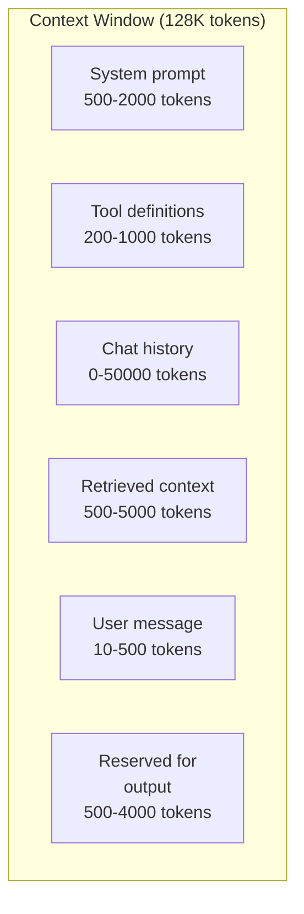
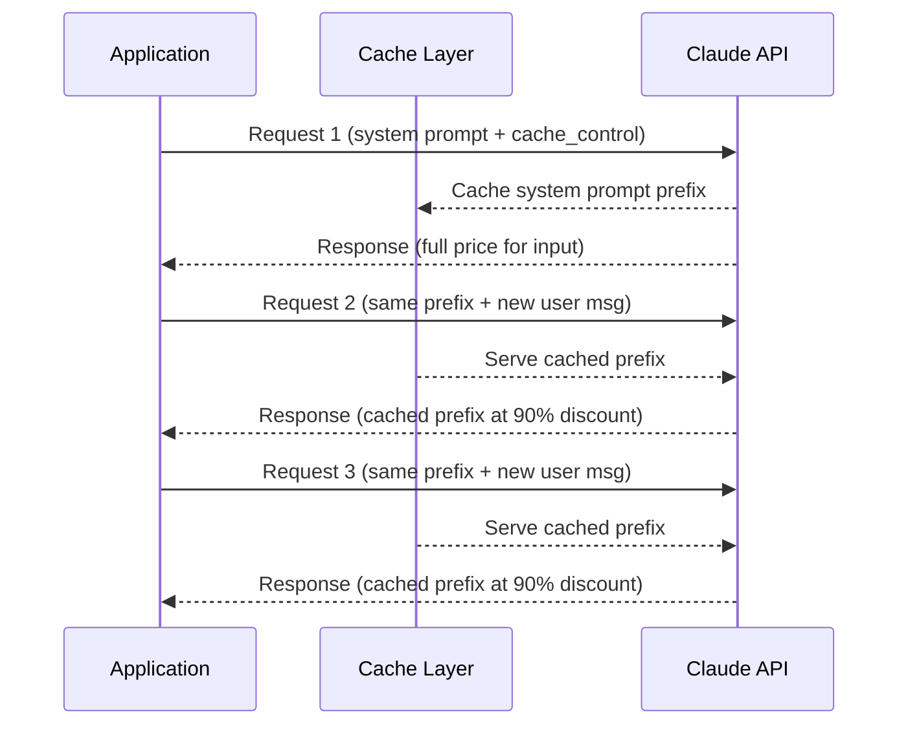
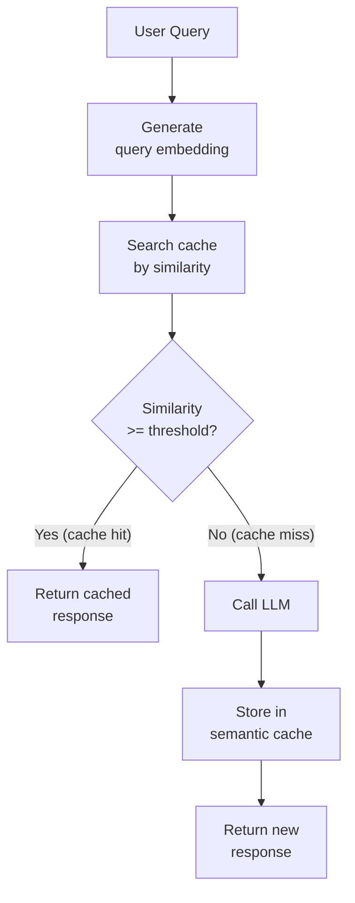
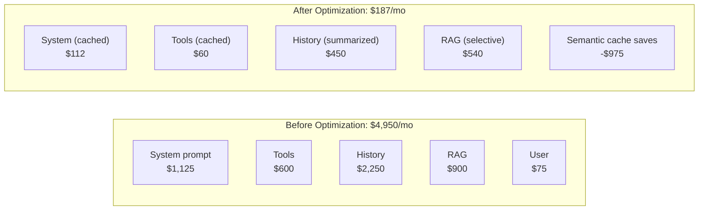

# Prompt Caching & Context Management

Context windows are the most expensive resource in LLM applications. Every token you send costs money, adds latency, and counts against a hard limit. A system prompt of 2,000 tokens sent 10,000 times per day costs more than the actual user interactions. A 128K context window does not mean you should fill it — it means you need a strategy for what goes in and what stays out.

This page covers the engineering of context: how to cache static prefixes so you do not pay for them repeatedly, how to compress conversation history, how to deduplicate semantically similar queries, and how to analyze the cost impact of each strategy.

## Context Window Fundamentals

Every LLM call has a context window — the maximum number of tokens the model can process in a single request. This window must contain everything: system prompt, conversation history, retrieved documents, tools, and the user's question.



### The Context Budget Problem

| Component | Typical Size | Frequency | Monthly Cost (GPT-4o, 10K req/day) |
|-----------|-------------|-----------|--------------------------------------|
| System prompt | 1,500 tokens | Every request | $1,125 |
| Tool definitions | 800 tokens | Every request | $600 |
| Chat history | 3,000 tokens avg | Every request | $2,250 |
| Retrieved context | 2,000 tokens | 60% of requests | $900 |
| User message | 100 tokens | Every request | $75 |
| **Total input** | **~7,400 tokens** | | **$4,950/month** |

Without caching, you pay for the system prompt and tool definitions on every single request. That is $1,725/month for content that never changes.

## Anthropic Prompt Caching

Anthropic offers explicit prompt caching: you mark sections of your prompt as cacheable, and subsequent requests that share the same prefix pay a reduced rate for the cached portion.

### How It Works



### Implementation

```python
from anthropic import Anthropic

client = Anthropic()

# Define a long system prompt with cache control
system_messages = [
    {
        "type": "text",
        "text": """You are an expert customer support agent for Acme Corp.

## Product Knowledge Base
[... 2000+ tokens of product documentation ...]

## Response Guidelines
1. Always cite the relevant documentation section
2. If unsure, escalate to a human agent
3. Never share internal pricing or roadmap information
4. Respond in the customer's language""",
        "cache_control": {"type": "ephemeral"},  # Mark as cacheable
    }
]

# First request — creates the cache (slightly more expensive)
response = client.messages.create(
    model="claude-sonnet-4-20250514",
    max_tokens=1024,
    system=system_messages,
    messages=[
        {"role": "user", "content": "How do I reset my password?"},
    ],
)

# Subsequent requests — cache hit (90% cheaper for cached prefix)
response = client.messages.create(
    model="claude-sonnet-4-20250514",
    max_tokens=1024,
    system=system_messages,  # Same system prompt — cache hit
    messages=[
        {"role": "user", "content": "What payment methods do you accept?"},
    ],
)

# Check cache usage
print(f"Cache write tokens: {response.usage.cache_creation_input_tokens}")
print(f"Cache read tokens: {response.usage.cache_read_input_tokens}")
print(f"Non-cached tokens: {response.usage.input_tokens}")
```

### Caching Conversation History

You can cache not just the system prompt but also conversation turns:

```python
def build_cached_messages(history: list[dict], new_message: str) -> list[dict]:
    """Build message list with cache breakpoints at conversation history."""
    messages = []

    for i, msg in enumerate(history):
        message = {"role": msg["role"], "content": msg["content"]}

        # Add cache breakpoint at the last history message
        if i == len(history) - 1:
            message["content"] = [
                {
                    "type": "text",
                    "text": msg["content"],
                    "cache_control": {"type": "ephemeral"},
                }
            ]

        messages.append(message)

    # New message (not cached)
    messages.append({"role": "user", "content": new_message})

    return messages
```

### Anthropic Caching Pricing

| Component | Claude Sonnet | Claude Haiku |
|-----------|--------------|--------------|
| Cache write | 1.25x base input price | 1.25x base input price |
| Cache read | 0.1x base input price | 0.1x base input price |
| Cache TTL | 5 minutes | 5 minutes |
| Minimum cacheable | 1,024 tokens (Sonnet), 2,048 tokens (Haiku) |

::: tip Cache breaks even after 2 requests
The cache write costs 1.25x, and each cache read costs 0.1x. After just 2 reads, you have saved more than the write cost. For any prompt component sent more than twice within 5 minutes, caching is strictly better.
:::

## OpenAI Prompt Caching

OpenAI implements automatic prompt caching for supported models. Unlike Anthropic's explicit approach, OpenAI detects shared prefixes automatically.

### How OpenAI Caching Works

- **Automatic** — No code changes needed. OpenAI detects when requests share a common prefix.
- **Prefix-based** — The cache matches from the start of the prompt. Any difference breaks the cache for everything after that point.
- **50% discount** — Cached tokens are charged at half the input token rate.
- **Minimum prefix** — The shared prefix must be at least 1,024 tokens.

```python
from openai import OpenAI

client = OpenAI()

# The key to OpenAI caching: keep the prefix identical across requests
SYSTEM_PROMPT = """You are an expert data analyst. You have access to the
following database schema:

[... 3000 tokens of schema documentation ...]

When writing SQL queries:
1. Always use CTEs for readability
2. Include comments explaining the logic
3. Handle NULL values explicitly
4. Use appropriate indexes (reference the schema)
"""

# Request 1 — creates cache
response = client.chat.completions.create(
    model="gpt-4o",
    messages=[
        {"role": "system", "content": SYSTEM_PROMPT},
        {"role": "user", "content": "Query total revenue by quarter"},
    ],
)

# Request 2 — cache hit (50% off for SYSTEM_PROMPT tokens)
response = client.chat.completions.create(
    model="gpt-4o",
    messages=[
        {"role": "system", "content": SYSTEM_PROMPT},
        {"role": "user", "content": "Query user retention by cohort"},
    ],
)

# Check cache usage
print(f"Cached tokens: {response.usage.prompt_tokens_details.cached_tokens}")
```

### Maximizing Cache Hits

```python
# BAD: Dynamic content at the start breaks caching
messages = [
    {"role": "system", "content": f"Current time: {datetime.now()}. You are..."},
    # ^ timestamp changes every request — zero cache hits
]

# GOOD: Static content first, dynamic content last
messages = [
    {"role": "system", "content": "You are an expert analyst. [long static prompt]"},
    # ^ this prefix is cached
    {"role": "user", "content": f"As of {datetime.now()}, what are the trends?"},
    # ^ dynamic content only in the user message
]

# GOOD: Use separate system messages for caching
messages = [
    {"role": "system", "content": LONG_STATIC_PROMPT},  # cached
    {"role": "system", "content": f"Context: time={datetime.now()}"},  # not cached
    {"role": "user", "content": query},
]
```

## Semantic Caching

Exact caching only helps when queries are identical. Semantic caching catches similar queries by embedding them and checking for vector similarity:

```python
import numpy as np
from openai import OpenAI
from redis import Redis

client = OpenAI()
redis = Redis()

class SemanticCache:
    def __init__(self, similarity_threshold: float = 0.95):
        self.threshold = similarity_threshold
        self.embeddings_model = "text-embedding-3-small"

    def get_embedding(self, text: str) -> list[float]:
        response = client.embeddings.create(
            model=self.embeddings_model,
            input=text,
        )
        return response.data[0].embedding

    def cosine_similarity(self, a: list[float], b: list[float]) -> float:
        a, b = np.array(a), np.array(b)
        return np.dot(a, b) / (np.linalg.norm(a) * np.linalg.norm(b))

    def get(self, query: str) -> str | None:
        """Check if a semantically similar query has been cached."""
        query_embedding = self.get_embedding(query)

        # Get all cached embeddings (use vector DB in production)
        cached_keys = redis.keys("sem_cache:*")
        for key in cached_keys:
            cached = json.loads(redis.get(key))
            similarity = self.cosine_similarity(
                query_embedding, cached["embedding"]
            )
            if similarity >= self.threshold:
                return cached["response"]

        return None

    def set(self, query: str, response: str, ttl: int = 3600):
        """Cache a query-response pair with its embedding."""
        embedding = self.get_embedding(query)
        key = f"sem_cache:{hashlib.sha256(query.encode()).hexdigest()}"
        redis.setex(key, ttl, json.dumps({
            "query": query,
            "response": response,
            "embedding": embedding,
        }))

# Usage
cache = SemanticCache(similarity_threshold=0.95)

def cached_generate(query: str) -> str:
    # Check semantic cache
    cached = cache.get(query)
    if cached:
        logger.info(f"Semantic cache hit for: {query[:50]}...")
        return cached

    # Generate new response
    response = generate_response(query)

    # Cache for future similar queries
    cache.set(query, response)

    return response
```



::: warning Semantic caching has edge cases
Two queries can be semantically similar but require different answers based on context (user role, time, previous conversation). Only use semantic caching for stateless, context-independent queries. Always include relevant context in the cache key.
:::

## Conversation Summarization

Long conversations exceed context windows. Summarization compresses old messages while preserving essential information.

### Sliding Window with Summary

```python
from dataclasses import dataclass

@dataclass
class ConversationManager:
    max_recent_messages: int = 10
    summary: str = ""
    messages: list = None

    def __post_init__(self):
        self.messages = self.messages or []

    def add_message(self, role: str, content: str):
        self.messages.append({"role": role, "content": content})

        # When history exceeds window, summarize old messages
        if len(self.messages) > self.max_recent_messages * 2:
            self._compress_history()

    def _compress_history(self):
        """Summarize old messages and keep only recent ones."""
        old_messages = self.messages[:-self.max_recent_messages]
        recent_messages = self.messages[-self.max_recent_messages:]

        # Generate summary of old messages
        summary_prompt = (
            f"Previous summary: {self.summary}\n\n"
            f"New messages to summarize:\n"
            + "\n".join(f"{m['role']}: {m['content']}" for m in old_messages)
            + "\n\nProvide a concise summary preserving key facts, "
            "decisions, and context needed for future conversation."
        )

        response = client.chat.completions.create(
            model="gpt-4o-mini",  # use cheap model for summarization
            messages=[{"role": "user", "content": summary_prompt}],
            max_tokens=500,
        )

        self.summary = response.choices[0].message.content
        self.messages = recent_messages

    def get_context(self) -> list[dict]:
        """Build the context for the next LLM call."""
        context = []

        if self.summary:
            context.append({
                "role": "system",
                "content": f"Conversation summary so far:\n{self.summary}",
            })

        context.extend(self.messages)
        return context
```

### Hierarchical Summarization

For very long conversations (hundreds of turns), use a hierarchical approach:

```python
class HierarchicalSummarizer:
    """Multi-level summarization for very long conversations."""

    def __init__(self):
        self.level_1_summaries = []  # summaries of ~10-turn chunks
        self.level_2_summary = ""     # summary of level-1 summaries
        self.recent_messages = []

    def compress(self, messages: list[dict]) -> str:
        """Compress messages into a hierarchical summary."""
        # Chunk into groups of 10
        chunks = [messages[i:i+10] for i in range(0, len(messages), 10)]

        # Level 1: Summarize each chunk
        for chunk in chunks:
            summary = summarize_chunk(chunk)
            self.level_1_summaries.append(summary)

        # Level 2: When we have 10+ level-1 summaries, summarize those
        if len(self.level_1_summaries) >= 10:
            old_summaries = self.level_1_summaries[:-5]
            self.level_2_summary = summarize_summaries(
                self.level_2_summary, old_summaries
            )
            self.level_1_summaries = self.level_1_summaries[-5:]

        return self.get_compressed_context()

    def get_compressed_context(self) -> str:
        parts = []
        if self.level_2_summary:
            parts.append(f"Earlier context: {self.level_2_summary}")
        if self.level_1_summaries:
            parts.append(f"Recent context: {' '.join(self.level_1_summaries)}")
        return "\n\n".join(parts)
```

## Context Compression Techniques

### LLMLingua — Prompt Compression

Compress prompts by removing low-information tokens while preserving meaning:

```python
from llmlingua import PromptCompressor

compressor = PromptCompressor(
    model_name="microsoft/llmlingua-2-bert-base-multilingual-cased-meetingbank",
    device_map="cpu",
)

# Compress a long context
compressed = compressor.compress_prompt(
    context=long_document_text,
    instruction="Answer the user's question based on the context.",
    question="What are the main findings?",
    target_token=500,  # compress to ~500 tokens
    rate=0.5,          # keep 50% of tokens
)

print(f"Original: {compressed['origin_tokens']} tokens")
print(f"Compressed: {compressed['compressed_tokens']} tokens")
print(f"Ratio: {compressed['rate']:.1%}")

# Use compressed prompt
response = client.chat.completions.create(
    model="gpt-4o",
    messages=[
        {"role": "system", "content": compressed["compressed_prompt"]},
        {"role": "user", "content": "What are the main findings?"},
    ],
)
```

### Selective Context Loading

Only load the most relevant parts of a large context:

```python
def selective_context(
    query: str,
    full_context: list[str],
    max_tokens: int = 4000,
) -> str:
    """Select the most relevant parts of context for the query."""
    # Embed query and all context chunks
    query_embedding = embed(query)
    chunk_embeddings = [embed(chunk) for chunk in full_context]

    # Score relevance
    scores = [
        cosine_similarity(query_embedding, chunk_emb)
        for chunk_emb in chunk_embeddings
    ]

    # Select top chunks within token budget
    ranked = sorted(
        zip(scores, full_context),
        key=lambda x: x[0],
        reverse=True,
    )

    selected = []
    total_tokens = 0
    for score, chunk in ranked:
        chunk_tokens = count_tokens(chunk)
        if total_tokens + chunk_tokens > max_tokens:
            break
        selected.append(chunk)
        total_tokens += chunk_tokens

    return "\n\n".join(selected)
```

### Strategy Comparison

| Strategy | Token Reduction | Quality Impact | Implementation Effort |
|----------|---------------|----------------|---------------------|
| **Provider caching** | 50-90% cost reduction | None | Low (config change) |
| **Semantic caching** | 20-40% fewer LLM calls | Minimal if threshold is high | Medium |
| **Sliding window** | Caps history to N messages | Loses old context | Low |
| **Summarization** | 80-90% on old history | Some detail lost | Medium |
| **LLMLingua compression** | 50-80% on documents | Minimal (<5% quality drop) | Low |
| **Selective loading** | 60-80% on RAG context | Better (only relevant chunks) | Medium |

## Cost Impact Analysis

### Before and After Optimization

Consider a customer support chatbot handling 10,000 conversations per day, averaging 8 turns each:

| Component | Before | After | Savings |
|-----------|--------|-------|---------|
| System prompt (1,500 tokens) | $1,125/mo | $112/mo (cached) | 90% |
| Tool definitions (800 tokens) | $600/mo | $60/mo (cached) | 90% |
| Chat history (avg 3K tokens) | $2,250/mo | $450/mo (summarized) | 80% |
| RAG context (2K tokens) | $900/mo | $540/mo (selective) | 40% |
| Semantic cache hits (30%) | N/A | -$975/mo | N/A |
| **Total input cost** | **$4,950/mo** | **$187/mo** | **96%** |



### ROI Calculator

```python
def calculate_caching_roi(
    requests_per_day: int,
    system_prompt_tokens: int,
    avg_history_tokens: int,
    avg_rag_tokens: int,
    model: str = "gpt-4o",
    cache_hit_rate: float = 0.30,
) -> dict:
    """Calculate monthly cost savings from caching strategies."""
    rates = {
        "gpt-4o": {"input": 2.50, "cached": 1.25},
        "gpt-4o-mini": {"input": 0.15, "cached": 0.075},
        "claude-sonnet": {"input": 3.00, "cached": 0.30},
    }
    r = rates[model]
    monthly_requests = requests_per_day * 30

    # Before: pay full price for everything
    before = {
        "system": (system_prompt_tokens * monthly_requests * r["input"]) / 1e6,
        "history": (avg_history_tokens * monthly_requests * r["input"]) / 1e6,
        "rag": (avg_rag_tokens * monthly_requests * r["input"]) / 1e6,
    }
    before["total"] = sum(before.values())

    # After: caching, summarization, semantic dedup
    after = {
        "system": (system_prompt_tokens * monthly_requests * r["cached"]) / 1e6,
        "history": (avg_history_tokens * 0.2 * monthly_requests * r["input"]) / 1e6,
        "rag": (avg_rag_tokens * 0.6 * monthly_requests * r["input"]) / 1e6,
    }
    # Subtract semantic cache savings
    cache_savings = before["total"] * cache_hit_rate
    after["total"] = sum(after.values()) - cache_savings

    return {
        "before_monthly": f"${before['total']:.0f}",
        "after_monthly": f"${after['total']:.0f}",
        "savings_monthly": f"${before['total'] - after['total']:.0f}",
        "savings_percent": f"{(1 - after['total'] / before['total']) * 100:.0f}%",
    }

# Example
print(calculate_caching_roi(
    requests_per_day=10000,
    system_prompt_tokens=1500,
    avg_history_tokens=3000,
    avg_rag_tokens=2000,
    model="gpt-4o",
))
```

::: tip Start with provider caching — it is free money
Anthropic prompt caching and OpenAI automatic caching require minimal code changes and immediately save 50-90% on static prompt components. Implement these before investing in semantic caching or compression.
:::

## Further Reading

- [LLM Integration Patterns](/ai-ml-engineering/llm-integration) — Foundation for all LLM cost management
- [RAG Architecture Deep Dive](/ai-ml-engineering/rag-architecture) — Context management for retrieval pipelines
- [AI in Production](/ai-ml-engineering/ai-in-production) — Broader cost optimization strategies
- [LangSmith & LLM Observability](/ai-ml-engineering/langsmith) — Measuring cache effectiveness
- [Embeddings & Semantic Search](/ai-ml-engineering/embeddings) — How semantic caching works
- [Anthropic Prompt Caching Docs](https://docs.anthropic.com/en/docs/build-with-claude/prompt-caching) — Official Anthropic caching guide
- [LLMLingua](https://github.com/microsoft/LLMLingua) — Prompt compression library
