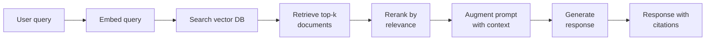
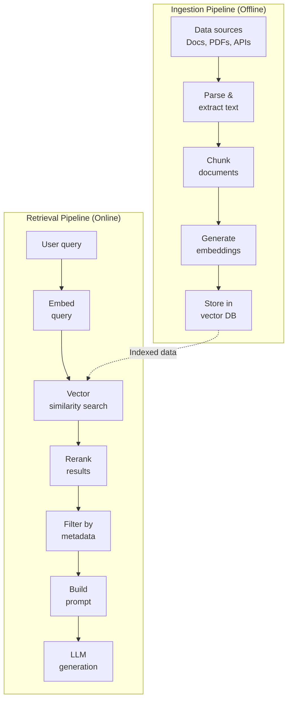
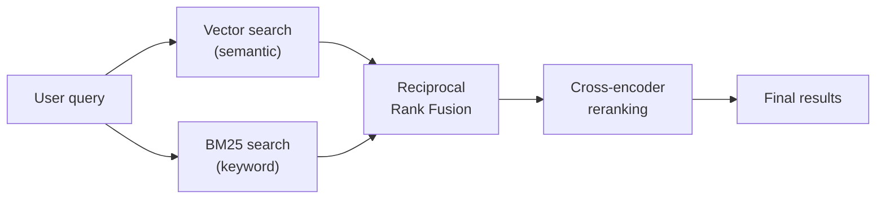
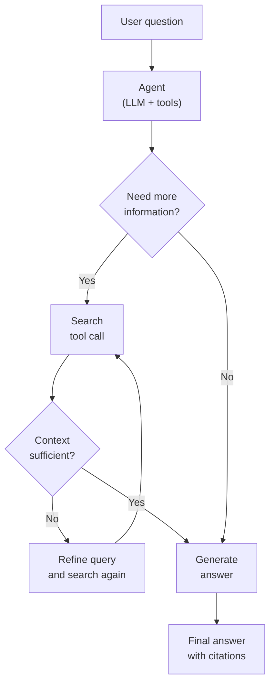

# RAG Architecture Deep Dive

Retrieval-Augmented Generation is the most important architectural pattern in applied AI. It solves the two fundamental limitations of large language models: they cannot access your private data, and they hallucinate when asked about facts they do not know. RAG bridges this gap by retrieving relevant documents before generating a response, grounding the model's output in actual evidence.

This page covers RAG from first principles through production deployment — the chunking strategies, retrieval pipelines, evaluation frameworks, and advanced patterns that separate a demo from a system your users trust.

## Why RAG Exists

LLMs have three fundamental limitations that RAG addresses:

1. **Knowledge cutoff.** Models are trained on data up to a fixed date. They cannot answer questions about events, products, or documentation that appeared after training.
2. **No access to private data.** Your company's internal docs, Confluence pages, code repositories, and customer data are not in the model's training set.
3. **Hallucination.** When a model does not know the answer, it generates plausible-sounding text that may be completely false. There is no inherent mechanism to say "I don't know."

RAG addresses all three by injecting relevant context into the prompt at query time:



### RAG vs. Fine-Tuning

| Dimension | RAG | Fine-Tuning |
|-----------|-----|-------------|
| **Knowledge updates** | Instant (update documents) | Requires retraining |
| **Cost** | Per-query retrieval cost | Upfront training cost |
| **Hallucination control** | High (grounded in documents) | Low (still generates freely) |
| **Best for** | Factual Q&A, search, support | Style/behavior changes, domain vocabulary |
| **Data privacy** | Data stays in your infrastructure | Data used in training (potentially exposed) |
| **Iteration speed** | Minutes (update index) | Hours to days (retrain) |

::: tip Start with RAG, not fine-tuning
In 90% of cases, RAG gives better results with less effort. Fine-tune only when you need to change the model's *behavior* (tone, formatting, domain-specific reasoning), not its *knowledge*.
:::

## The RAG Pipeline

A production RAG system has two distinct pipelines: the **ingestion pipeline** (offline) and the **retrieval pipeline** (online).



## Chunking Strategies

Chunking is where most RAG systems fail. The quality of your chunks determines the quality of your retrieval, which determines the quality of your answers. There is no universal chunking strategy — the right approach depends on your document structure and query patterns.

### Fixed-Size Chunking

The simplest approach. Split text into chunks of N characters (or tokens) with M characters of overlap.

```python
def fixed_size_chunk(text: str, chunk_size: int = 512, overlap: int = 64) -> list[str]:
    chunks = []
    start = 0
    while start < len(text):
        end = start + chunk_size
        chunk = text[start:end]
        chunks.append(chunk)
        start = end - overlap
    return chunks
```

**Pros:** Simple, predictable chunk sizes, easy to reason about token budgets.
**Cons:** Splits mid-sentence, breaks semantic units, ignores document structure.

### Recursive Character Splitting

Split by increasingly granular separators: first by heading, then by paragraph, then by sentence, then by character. This preserves semantic boundaries.

```python
from langchain.text_splitter import RecursiveCharacterTextSplitter

splitter = RecursiveCharacterTextSplitter(
    chunk_size=1000,
    chunk_overlap=200,
    separators=[
        "\n## ",     # H2 headings first
        "\n### ",    # H3 headings
        "\n\n",      # Paragraphs
        "\n",        # Lines
        ". ",        # Sentences
        " ",         # Words
    ],
    length_function=len,
)

chunks = splitter.split_text(document_text)
```

### Semantic Chunking

Use an embedding model to detect topic boundaries. Sentences with similar embeddings stay together; when similarity drops below a threshold, start a new chunk.

```python
import numpy as np
from sentence_transformers import SentenceTransformer

model = SentenceTransformer("all-MiniLM-L6-v2")

def semantic_chunk(sentences: list[str], threshold: float = 0.75) -> list[str]:
    embeddings = model.encode(sentences)
    chunks = []
    current_chunk = [sentences[0]]

    for i in range(1, len(sentences)):
        similarity = np.dot(embeddings[i], embeddings[i - 1]) / (
            np.linalg.norm(embeddings[i]) * np.linalg.norm(embeddings[i - 1])
        )
        if similarity >= threshold:
            current_chunk.append(sentences[i])
        else:
            chunks.append(" ".join(current_chunk))
            current_chunk = [sentences[i]]

    chunks.append(" ".join(current_chunk))
    return chunks
```

### Chunking Strategy Comparison

| Strategy | Best For | Chunk Quality | Complexity | Speed |
|----------|---------|--------------|------------|-------|
| Fixed-size | Uniform text (logs, code) | Low | Low | Fast |
| Recursive | Markdown, HTML, structured docs | Medium | Low | Fast |
| Semantic | Long-form prose, articles | High | Medium | Slow |
| Document-aware | PDFs, slides, tables | High | High | Medium |

::: warning The chunking paradox
Small chunks improve retrieval precision (you find exactly the right passage) but lose context. Large chunks preserve context but dilute the signal. The sweet spot for most use cases is 200-500 tokens with 10-20% overlap.
:::

### Metadata Enrichment

Always attach metadata to chunks. Metadata enables filtering, improves reranking, and provides citation context:

```python
chunk = {
    "text": "The retry policy uses exponential backoff with jitter...",
    "metadata": {
        "source": "docs/reliability/retry-patterns.md",
        "section": "Exponential Backoff",
        "heading_hierarchy": ["Reliability", "Retry Patterns", "Exponential Backoff"],
        "document_title": "Retry Pattern Implementation Guide",
        "chunk_index": 4,
        "total_chunks": 12,
        "last_updated": "2026-03-15",
        "content_type": "technical_documentation",
    }
}
```

## Embedding Models and Similarity Search

The embedding model converts text into vectors. The choice of embedding model directly impacts retrieval quality.

### Model Selection

| Model | Dimensions | Context Window | Performance (MTEB) | Cost |
|-------|-----------|---------------|-------------------|------|
| OpenAI `text-embedding-3-large` | 3072 | 8191 tokens | Very high | $0.13/M tokens |
| OpenAI `text-embedding-3-small` | 1536 | 8191 tokens | High | $0.02/M tokens |
| Cohere `embed-v4.0` | 1024 | 128k tokens | Very high | $0.10/M tokens |
| `all-MiniLM-L6-v2` | 384 | 256 tokens | Medium | Free (self-hosted) |
| `BAAI/bge-large-en-v1.5` | 1024 | 512 tokens | High | Free (self-hosted) |

### Distance Metrics

| Metric | Formula | When to Use |
|--------|---------|-------------|
| **Cosine similarity** | cos(A, B) = A . B / (||A|| * ||B||) | Default choice; normalized, ignores magnitude |
| **Euclidean (L2)** | sqrt(sum((a_i - b_i)^2)) | When magnitude matters |
| **Dot product** | sum(a_i * b_i) | Pre-normalized vectors; fastest |

For more on embeddings, see [Embeddings & Semantic Search](/ai-ml-engineering/embeddings).

## The Retrieval Pipeline

### Step 1: Query Embedding

Embed the user's query using the same model that embedded the documents:

```python
query = "How do I implement retry logic with exponential backoff?"
query_embedding = embedding_model.encode(query)
```

### Step 2: Vector Similarity Search

Search the vector database for the top-k most similar chunks:

```python
results = vector_db.query(
    vector=query_embedding,
    top_k=20,         # Retrieve more than you need
    filter={
        "content_type": "technical_documentation",
        "last_updated": {"$gte": "2025-01-01"},
    },
    include_metadata=True,
)
```

### Step 3: Reranking

The initial retrieval uses fast approximate search. Reranking applies a more accurate (but slower) cross-encoder model to reorder results:

```python
from sentence_transformers import CrossEncoder

reranker = CrossEncoder("cross-encoder/ms-marco-MiniLM-L-12-v2")

# Score each result against the original query
pairs = [(query, result.text) for result in results]
scores = reranker.predict(pairs)

# Rerank by cross-encoder score
reranked = sorted(
    zip(results, scores),
    key=lambda x: x[1],
    reverse=True,
)

# Take top-k after reranking
top_results = [r for r, s in reranked[:5]]
```

### Step 4: Prompt Construction

Build the final prompt with retrieved context:

```python
def build_rag_prompt(query: str, contexts: list[dict]) -> list[dict]:
    context_text = "\n\n---\n\n".join([
        f"Source: {ctx['metadata']['source']}\n{ctx['text']}"
        for ctx in contexts
    ])

    return [
        {
            "role": "system",
            "content": f"""Answer the user's question based ONLY on the provided context.
If the context does not contain enough information to answer, say "I don't have enough information to answer that."
Always cite your sources using [Source: filename] format.

Context:
{context_text}"""
        },
        {"role": "user", "content": query},
    ]
```

## Hybrid Search: Vector + Keyword

Pure vector search misses exact keyword matches. Pure keyword search misses semantic meaning. Hybrid search combines both using Reciprocal Rank Fusion (RRF):

```python
def reciprocal_rank_fusion(
    vector_results: list[str],
    keyword_results: list[str],
    k: int = 60,
) -> list[str]:
    """Combine rankings using RRF. Lower rank = better."""
    scores = {}

    for rank, doc_id in enumerate(vector_results):
        scores[doc_id] = scores.get(doc_id, 0) + 1 / (k + rank + 1)

    for rank, doc_id in enumerate(keyword_results):
        scores[doc_id] = scores.get(doc_id, 0) + 1 / (k + rank + 1)

    return sorted(scores.keys(), key=lambda x: scores[x], reverse=True)
```



::: tip When to use hybrid search
Use hybrid search when your queries mix natural language with specific terms — product names, error codes, API endpoints, technical jargon. These exact terms are often missed by pure vector search.
:::

## Evaluation Metrics

You cannot improve what you do not measure. RAG evaluation has three dimensions:

### The RAG Evaluation Triad

| Metric | What It Measures | How to Calculate |
|--------|-----------------|------------------|
| **Faithfulness** | Is the answer grounded in the retrieved context? | LLM-as-judge: "Does the answer contain claims not supported by the context?" |
| **Answer Relevance** | Does the answer address the question? | LLM-as-judge: "Does this answer fully address the original question?" |
| **Context Relevance** | Is the retrieved context relevant to the question? | Precision@k: what fraction of retrieved chunks are actually useful? |

### Automated Evaluation Pipeline

```python
async def evaluate_rag(
    question: str,
    answer: str,
    contexts: list[str],
    ground_truth: str | None = None,
) -> dict:
    # Faithfulness: Is the answer supported by context?
    faithfulness = await llm_judge(
        prompt=f"""Score the faithfulness of this answer on a scale of 1-5.
A faithful answer only makes claims that are directly supported by the provided context.

Question: {question}
Context: {chr(10).join(contexts)}
Answer: {answer}

Return only the numeric score."""
    )

    # Relevance: Does the answer address the question?
    relevance = await llm_judge(
        prompt=f"""Score the relevance of this answer on a scale of 1-5.
A relevant answer directly and completely addresses the question asked.

Question: {question}
Answer: {answer}

Return only the numeric score."""
    )

    # Context precision: Are the retrieved chunks relevant?
    context_scores = []
    for ctx in contexts:
        score = await llm_judge(
            prompt=f"""Is this context relevant to answering the question? Answer 1 (yes) or 0 (no).
Question: {question}
Context: {ctx}"""
        )
        context_scores.append(int(score))

    return {
        "faithfulness": float(faithfulness) / 5,
        "answer_relevance": float(relevance) / 5,
        "context_precision": sum(context_scores) / len(context_scores),
    }
```

### Building an Evaluation Dataset

The most impactful thing you can do for RAG quality is build a golden evaluation dataset:

```python
eval_dataset = [
    {
        "question": "What is the default retry count for failed API calls?",
        "expected_answer": "The default retry count is 3 with exponential backoff.",
        "expected_sources": ["docs/reliability/retry-config.md"],
        "category": "factual_lookup",
    },
    {
        "question": "How should I handle database connection timeouts?",
        "expected_answer": "Use connection pooling with health checks...",
        "expected_sources": ["docs/databases/connection-management.md"],
        "category": "how_to",
    },
    # ... 50-100 examples covering your query distribution
]
```

## Advanced RAG Patterns

### HyDE (Hypothetical Document Embeddings)

Instead of embedding the user's question directly, generate a hypothetical answer and embed *that*. The hypothesis is closer in embedding space to the actual document than the question is.

```python
async def hyde_retrieval(query: str, top_k: int = 5) -> list:
    # Step 1: Generate hypothetical answer
    hypothesis = await llm_call(
        system="Write a short, factual paragraph that would answer this question. Do not caveat or hedge.",
        user=query,
        model="gpt-4o-mini",
    )

    # Step 2: Embed the hypothesis (not the original query)
    hypothesis_embedding = embedding_model.encode(hypothesis)

    # Step 3: Search with the hypothesis embedding
    results = vector_db.query(vector=hypothesis_embedding, top_k=top_k)
    return results
```

### Multi-Query Retrieval

Generate multiple reformulations of the query and retrieve for each, then deduplicate:

```python
async def multi_query_retrieval(query: str) -> list:
    # Generate query variations
    variations = await llm_call(
        system="""Generate 3 different versions of this search query.
Each version should approach the topic from a different angle.
Return one query per line.""",
        user=query,
    )

    all_results = []
    for variation in variations.strip().split("\n"):
        embedding = embedding_model.encode(variation)
        results = vector_db.query(vector=embedding, top_k=5)
        all_results.extend(results)

    # Deduplicate by document ID, keep highest score
    seen = {}
    for result in all_results:
        if result.id not in seen or result.score > seen[result.id].score:
            seen[result.id] = result

    return sorted(seen.values(), key=lambda x: x.score, reverse=True)
```

### Agentic RAG

The agent decides *whether* to retrieve, *what* to retrieve, and *whether the retrieved context is sufficient* — using tool calling in a loop:



```python
tools = [
    {
        "type": "function",
        "function": {
            "name": "search_knowledge_base",
            "description": "Search the knowledge base for relevant information. Use this when you need facts or documentation to answer a question.",
            "parameters": {
                "type": "object",
                "properties": {
                    "query": {"type": "string", "description": "The search query"},
                    "filters": {
                        "type": "object",
                        "properties": {
                            "category": {"type": "string"},
                            "recency": {"type": "string", "enum": ["any", "last_week", "last_month"]},
                        }
                    }
                },
                "required": ["query"]
            }
        }
    }
]

# The agent loops: search -> evaluate -> maybe search again -> answer
```

### Parent-Child Chunking

Embed small chunks for precise retrieval, but return the parent (larger) chunk for context:

```python
# During ingestion
parent_chunk = "Full section of documentation..."  # ~2000 tokens
child_chunks = split_into_small_chunks(parent_chunk, size=200)

for child in child_chunks:
    vector_db.upsert({
        "id": child.id,
        "embedding": embed(child.text),
        "metadata": {
            "parent_id": parent_chunk.id,
            "text": child.text,
        }
    })

# During retrieval
child_results = vector_db.query(query_embedding, top_k=5)
parent_ids = set(r.metadata["parent_id"] for r in child_results)
parent_chunks = document_store.get_many(list(parent_ids))
# Use parent_chunks in the prompt for richer context
```

## Production RAG Checklist

Before shipping a RAG system to production, verify each of these:

| Category | Checkpoint | Status |
|----------|-----------|--------|
| **Data** | Chunking strategy tested on representative documents | |
| **Data** | Metadata attached to every chunk (source, date, section) | |
| **Retrieval** | Hybrid search (vector + keyword) implemented | |
| **Retrieval** | Reranking model in the pipeline | |
| **Evaluation** | Golden dataset with 50+ question-answer pairs | |
| **Evaluation** | Automated eval pipeline running on every change | |
| **Guardrails** | "I don't know" response when context is insufficient | |
| **Guardrails** | Citation/source attribution in every answer | |
| **Performance** | P95 retrieval latency under 200ms | |
| **Performance** | Semantic caching for repeated queries | |
| **Ops** | Monitoring: retrieval quality, LLM cost, latency | |
| **Ops** | Incremental index updates (not full rebuilds) | |

## Further Reading

- [Embeddings & Semantic Search](/ai-ml-engineering/embeddings) — Deep dive into embedding models and distance metrics
- [Vector Databases](/ai-ml-engineering/vector-databases) — Storage layer for RAG, including indexing and performance tuning
- [LLM Integration Patterns](/ai-ml-engineering/llm-integration) — The LLM calling patterns used in RAG generation
- [AI Agents Architecture](/ai-ml-engineering/ai-agents) — Agentic RAG and autonomous retrieval patterns
- [Data Engineering](/data-engineering/) — ETL patterns for building ingestion pipelines
