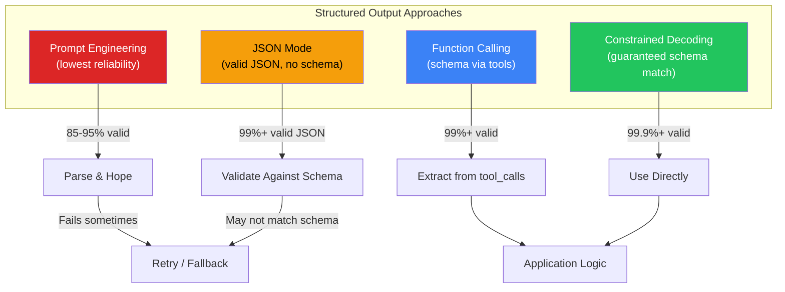
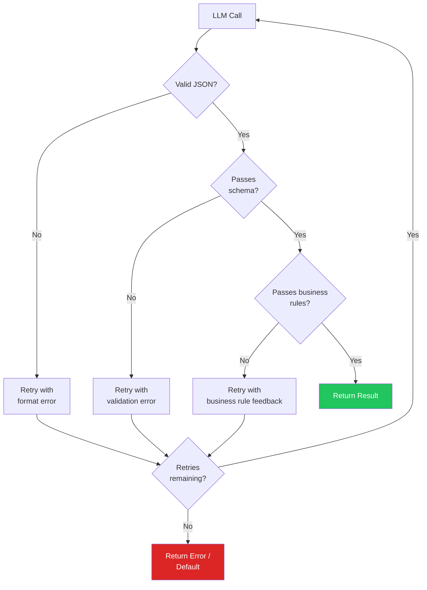
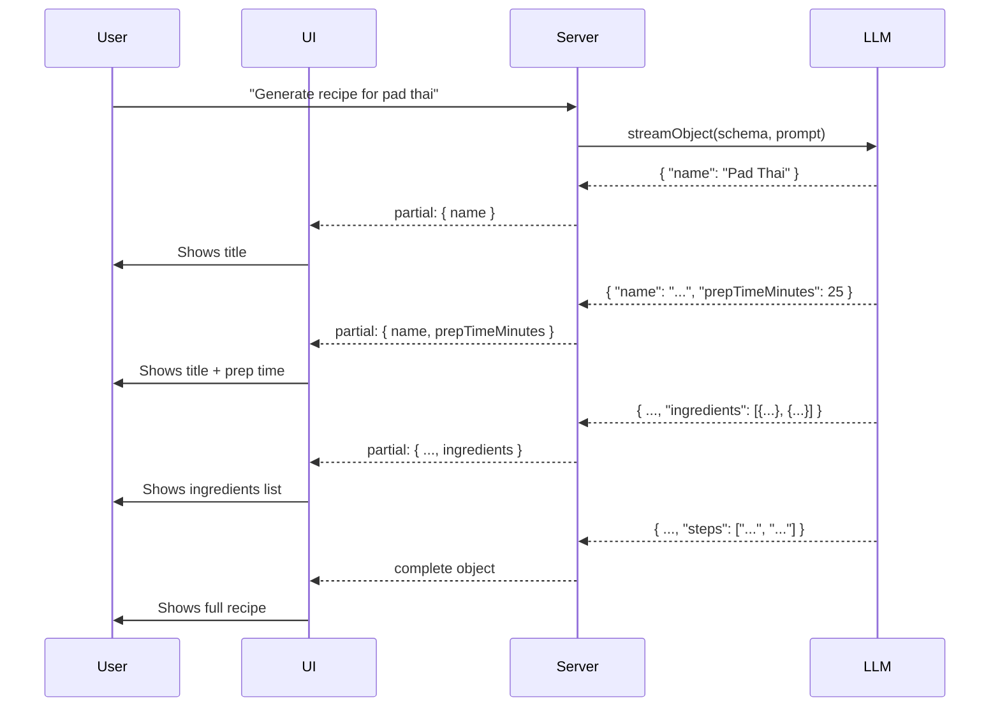
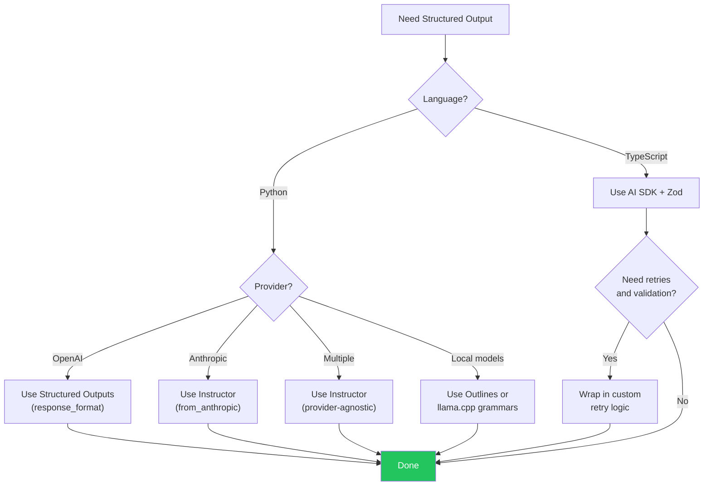

# Structured Output from LLMs

LLMs generate text. Your application needs data — JSON objects, typed records, enums, arrays with specific shapes. The gap between "a string that looks like JSON" and "a parsed, validated data structure your code can trust" is where most AI application bugs live. Structured output is the engineering discipline that closes this gap.

Without structured output enforcement, even a well-prompted GPT-4o will occasionally produce malformed JSON, hallucinate extra fields, omit required fields, or return a string where you expected a number. At 1,000 requests per hour, a 2% malformation rate means 20 failures per hour — enough to degrade any production system.

This page covers every major approach to getting structured data out of LLMs: native JSON mode, constrained decoding, function calling, the Instructor library (Python), Zod + AI SDK (TypeScript), validation and retry patterns, streaming structured output, and the common application patterns that tie them all together.

---

## Why Structured Output Matters

### The Problem

LLMs are trained to produce natural language, not machine-readable data. When you ask for JSON, several things can go wrong:

```
Prompt: "Return a JSON object with name and age"

# What you want
{"name": "Alice", "age": 30}

# What you sometimes get
Here is the JSON object:
```json
{"name": "Alice", "age": 30}
```
Note: I've set the age to 30 as an example.

# Or worse
{"name": "Alice", "age": "thirty"}

# Or even worse
{name: Alice, age: 30}  // Not valid JSON
```

### Why It Matters in Production

| Problem | Consequence | Frequency Without Enforcement |
|---------|-------------|-------------------------------|
| Invalid JSON syntax | `JSON.parse()` crashes | 1-5% of responses |
| Missing required fields | Downstream `KeyError` / `TypeError` | 3-8% of responses |
| Wrong field types | String where number expected | 5-15% of responses |
| Extra prose around JSON | Parser cannot extract the object | 10-30% of responses |
| Hallucinated fields | Schema mismatch, data corruption | 5-10% of responses |
| Inconsistent enums | "high" vs "High" vs "HIGH" | 15-25% of responses |

::: tip The 99.9% reliability threshold
Production systems need structured output to work on virtually every call. Native structured output (constrained decoding) achieves 99.9%+ schema compliance. Prompt-only approaches hover around 85-95%. The difference is the difference between a working product and a pager going off at 3 AM.
:::

### The Solution Landscape



---

## OpenAI JSON Mode and Structured Outputs

OpenAI provides two distinct mechanisms for getting JSON from GPT models.

### JSON Mode (Basic)

JSON Mode guarantees the output is valid JSON, but does **not** enforce any particular schema. You must still validate the structure yourself.

```python
# json_mode_basic.py — Valid JSON, no schema guarantee
from openai import OpenAI

client = OpenAI()

response = client.chat.completions.create(
    model="gpt-4o",
    messages=[
        {
            "role": "system",
            "content": "Extract the person's name and age from the text. "
                       "Return a JSON object with 'name' (string) and 'age' (integer).",
        },
        {
            "role": "user",
            "content": "Alice is a 30-year-old software engineer from Seattle.",
        },
    ],
    response_format={"type": "json_object"},
)

import json
data = json.loads(response.choices[0].message.content)
# {"name": "Alice", "age": 30}
# But the schema is NOT enforced — the model could return {"person": "Alice", "years": 30}
```

::: warning JSON Mode requires "JSON" in the prompt
If you use `response_format={"type": "json_object"}` but do not mention "JSON" somewhere in the system or user message, the API will return an error. This is an OpenAI requirement to prevent accidental misuse.
:::

### Structured Outputs (Constrained Decoding)

Structured Outputs use constrained decoding at the token generation level. The model is physically unable to produce tokens that would violate your schema. This is the gold standard.

```python
# structured_outputs.py — Schema-guaranteed output with Pydantic
from openai import OpenAI
from pydantic import BaseModel, Field

client = OpenAI()


class PersonExtraction(BaseModel):
    name: str = Field(description="The person's full name")
    age: int = Field(description="The person's age in years")
    occupation: str = Field(description="The person's job title or profession")
    location: str | None = Field(
        default=None,
        description="City or region where the person lives",
    )


response = client.beta.chat.completions.parse(
    model="gpt-4o",
    messages=[
        {
            "role": "system",
            "content": "Extract structured information about people from text.",
        },
        {
            "role": "user",
            "content": "Alice is a 30-year-old software engineer from Seattle.",
        },
    ],
    response_format=PersonExtraction,
)

person = response.choices[0].message.parsed
# PersonExtraction(name='Alice', age=30, occupation='software engineer', location='Seattle')
# Guaranteed to match the schema — age is always int, never string
```

### JSON Mode vs Structured Outputs

| Feature | JSON Mode | Structured Outputs |
|---------|-----------|-------------------|
| Valid JSON guaranteed | Yes | Yes |
| Schema enforced | No | Yes |
| Uses constrained decoding | No | Yes |
| Requires Pydantic model | No | Yes (or JSON Schema) |
| Supports `additionalProperties` | N/A | Must be `false` |
| Streaming support | Yes | Yes (partial JSON) |
| Model support | GPT-3.5-turbo+, GPT-4+ | GPT-4o, GPT-4o-mini |
| Reliability | ~99% valid JSON | ~99.9% schema-valid |

### Schema Limitations

OpenAI's Structured Outputs have specific constraints:

```python
# These schema features are NOT supported:
# - Optional fields without a default (use Union[str, None] with default=None)
# - Recursive schemas deeper than 5 levels
# - additionalProperties: true
# - Custom format validators (e.g., email format)
# - Schema with more than ~100 properties total

# Supported pattern for optional fields:
class Address(BaseModel):
    street: str
    city: str
    state: str | None = None   # Correct: Union with None + default
    zip_code: str | None = None
```

---

## Anthropic Tool Use for Structured Output

Anthropic does not offer a dedicated JSON mode or `response_format` parameter. Instead, structured output is achieved through **tool use** — you define a tool whose input schema matches your desired output, and the model "calls" that tool with structured data.

```python
# anthropic_structured.py — Structured output via tool use
import anthropic
import json

client = anthropic.Anthropic()

# Define the output schema as a "tool"
extraction_tool = {
    "name": "record_person",
    "description": "Record extracted person information",
    "input_schema": {
        "type": "object",
        "properties": {
            "name": {
                "type": "string",
                "description": "The person's full name",
            },
            "age": {
                "type": "integer",
                "description": "The person's age in years",
            },
            "occupation": {
                "type": "string",
                "description": "The person's job title",
            },
            "location": {
                "type": "string",
                "description": "Where the person lives",
            },
        },
        "required": ["name", "age", "occupation"],
    },
}

response = client.messages.create(
    model="claude-sonnet-4-20250514",
    max_tokens=1024,
    tools=[extraction_tool],
    tool_choice={"type": "tool", "name": "record_person"},  # Force this tool
    messages=[
        {
            "role": "user",
            "content": "Alice is a 30-year-old software engineer from Seattle.",
        },
    ],
)

# Extract the structured data from the tool call
tool_use_block = next(
    block for block in response.content if block.type == "tool_use"
)
person_data = tool_use_block.input
# {"name": "Alice", "age": 30, "occupation": "software engineer", "location": "Seattle"}
```

### Forcing Tool Use

The key parameter is `tool_choice`. Without it, Claude may respond with text instead of calling the tool.

```python
# Options for tool_choice:
tool_choice = {"type": "auto"}                    # Model decides (may not call tool)
tool_choice = {"type": "any"}                     # Must call some tool
tool_choice = {"type": "tool", "name": "record_person"}  # Must call THIS tool
```

::: tip Always use tool_choice with name for extraction
When using tool use purely for structured output (not actual tool execution), always set `tool_choice` to the specific tool name. Otherwise Claude may respond with a conversational message instead of structured data, especially if the input is ambiguous.
:::

### Multi-Schema Extraction

You can define multiple tools and let the model choose which one to call, enabling classification + extraction in a single call:

```python
# multi_schema.py — Classification via tool selection
tools = [
    {
        "name": "record_bug_report",
        "description": "Record a bug report from the user",
        "input_schema": {
            "type": "object",
            "properties": {
                "severity": {"type": "string", "enum": ["critical", "high", "medium", "low"]},
                "component": {"type": "string"},
                "description": {"type": "string"},
                "steps_to_reproduce": {"type": "array", "items": {"type": "string"}},
            },
            "required": ["severity", "component", "description"],
        },
    },
    {
        "name": "record_feature_request",
        "description": "Record a feature request from the user",
        "input_schema": {
            "type": "object",
            "properties": {
                "priority": {"type": "string", "enum": ["high", "medium", "low"]},
                "feature_area": {"type": "string"},
                "description": {"type": "string"},
                "use_case": {"type": "string"},
            },
            "required": ["priority", "feature_area", "description"],
        },
    },
]

response = client.messages.create(
    model="claude-sonnet-4-20250514",
    max_tokens=1024,
    tools=tools,
    tool_choice={"type": "any"},  # Must call one of the tools
    messages=[
        {
            "role": "user",
            "content": "The app crashes whenever I try to upload a file larger than 10MB. "
                       "This is blocking our entire team.",
        },
    ],
)

tool_block = next(b for b in response.content if b.type == "tool_use")
print(f"Classified as: {tool_block.name}")
# Classified as: record_bug_report
print(tool_block.input)
# {"severity": "critical", "component": "file upload", "description": "...", ...}
```

---

## Instructor Library (Python)

[Instructor](https://github.com/jxnl/instructor) is the most popular Python library for structured LLM output. It patches API clients to accept Pydantic models as the output schema and handles validation, retries, and streaming automatically.

### Basic Usage

```python
# instructor_basic.py — Pydantic models as output schemas
import instructor
from openai import OpenAI
from pydantic import BaseModel, Field

client = instructor.from_openai(OpenAI())


class UserProfile(BaseModel):
    """Extracted user profile information."""
    name: str = Field(description="Full name")
    age: int = Field(ge=0, le=150, description="Age in years")
    email: str | None = Field(default=None, description="Email address if mentioned")
    interests: list[str] = Field(
        default_factory=list,
        description="List of hobbies or interests mentioned",
    )


# The response is a validated Pydantic model — not a string, not raw JSON
profile = client.chat.completions.create(
    model="gpt-4o",
    response_model=UserProfile,
    messages=[
        {
            "role": "user",
            "content": "Alice Chen, 28, loves rock climbing and photography. "
                       "Reach her at alice@example.com.",
        },
    ],
)

print(profile.name)       # "Alice Chen"
print(profile.age)        # 28
print(profile.interests)  # ["rock climbing", "photography"]
print(type(profile))      # <class 'UserProfile'>
```

### Multi-Provider Support

Instructor works with every major LLM provider:

```python
import instructor
from openai import OpenAI
from anthropic import Anthropic
from google.generativeai import GenerativeModel

# OpenAI
openai_client = instructor.from_openai(OpenAI())

# Anthropic
anthropic_client = instructor.from_anthropic(Anthropic())

# Google Gemini
gemini_client = instructor.from_gemini(GenerativeModel("gemini-2.0-flash"))

# Ollama (via OpenAI-compatible API)
ollama_client = instructor.from_openai(
    OpenAI(base_url="http://localhost:11434/v1", api_key="ollama"),
    mode=instructor.Mode.JSON,
)

# All use the same interface:
profile = openai_client.chat.completions.create(
    model="gpt-4o",
    response_model=UserProfile,
    messages=[{"role": "user", "content": "..."}],
)
```

### Validation with Pydantic

Instructor leverages Pydantic's full validation system. If the model output fails validation, Instructor can automatically retry with the validation error as feedback:

```python
# instructor_validation.py — Complex validation rules
from pydantic import BaseModel, Field, field_validator, model_validator


class SentimentAnalysis(BaseModel):
    """Sentiment analysis result with confidence."""
    text: str = Field(description="The analyzed text")
    sentiment: str = Field(description="positive, negative, or neutral")
    confidence: float = Field(ge=0.0, le=1.0, description="Confidence score 0-1")
    reasoning: str = Field(description="Why this sentiment was assigned")

    @field_validator("sentiment")
    @classmethod
    def validate_sentiment(cls, v: str) -> str:
        allowed = {"positive", "negative", "neutral"}
        v_lower = v.lower().strip()
        if v_lower not in allowed:
            raise ValueError(f"Sentiment must be one of {allowed}, got '{v}'")
        return v_lower

    @model_validator(mode="after")
    def validate_confidence_consistency(self) -> "SentimentAnalysis":
        """Neutral sentiment should have lower confidence."""
        if self.sentiment == "neutral" and self.confidence > 0.95:
            raise ValueError(
                "Neutral sentiment with >0.95 confidence is suspicious. "
                "Re-evaluate whether the text truly has no sentiment."
            )
        return self


# Instructor will retry if validation fails, passing the error back to the model
result = client.chat.completions.create(
    model="gpt-4o",
    response_model=SentimentAnalysis,
    max_retries=3,  # Retry up to 3 times on validation failure
    messages=[
        {"role": "user", "content": "Analyze: 'The product is okay, nothing special.'"},
    ],
)
```

### Extraction Modes

Instructor supports different extraction strategies depending on the provider:

```python
import instructor

# Mode.TOOLS — uses function calling (most reliable for OpenAI)
client = instructor.from_openai(OpenAI(), mode=instructor.Mode.TOOLS)

# Mode.JSON — uses JSON mode (works with more models)
client = instructor.from_openai(OpenAI(), mode=instructor.Mode.JSON)

# Mode.MD_JSON — extracts JSON from markdown code blocks (universal fallback)
client = instructor.from_openai(OpenAI(), mode=instructor.Mode.MD_JSON)

# Mode.ANTHROPIC_TOOLS — Anthropic's native tool use
client = instructor.from_anthropic(Anthropic(), mode=instructor.Mode.ANTHROPIC_TOOLS)
```

| Mode | Mechanism | Best For |
|------|-----------|----------|
| `TOOLS` | OpenAI function calling | GPT-4o, GPT-4o-mini |
| `JSON` | OpenAI JSON mode | Models with native JSON mode |
| `MD_JSON` | Parse JSON from markdown blocks | Any model, universal fallback |
| `ANTHROPIC_TOOLS` | Claude tool use | Claude models |
| `GEMINI_TOOLS` | Gemini function calling | Gemini models |

---

## Zod + AI SDK (TypeScript)

In the TypeScript ecosystem, the Vercel AI SDK with Zod schemas is the equivalent of Instructor. It provides type-safe structured output with full TypeScript inference.

### Basic Usage with generateObject

```typescript
// structured_output.ts — Type-safe structured output in TypeScript
import { generateObject } from "ai";
import { openai } from "@ai-sdk/openai";
import { z } from "zod";

const PersonSchema = z.object({
  name: z.string().describe("The person's full name"),
  age: z.number().int().min(0).max(150).describe("Age in years"),
  occupation: z.string().describe("Job title or profession"),
  location: z.string().nullable().describe("City or region"),
  interests: z.array(z.string()).describe("List of hobbies or interests"),
});

// TypeScript infers the return type from the schema
const { object: person } = await generateObject({
  model: openai("gpt-4o"),
  schema: PersonSchema,
  prompt:
    "Alice Chen, 28, is a software engineer in Seattle who loves rock climbing.",
});

// person is fully typed: { name: string, age: number, ... }
console.log(person.name); // "Alice Chen"
console.log(person.age); // 28
```

### Enum Classification

Zod enums provide type-safe classification:

```typescript
// classification.ts — Type-safe routing with Zod enums
import { generateObject } from "ai";
import { openai } from "@ai-sdk/openai";
import { z } from "zod";

const TicketClassification = z.object({
  category: z
    .enum(["bug", "feature_request", "question", "billing", "security"])
    .describe("The primary category of the support ticket"),
  priority: z
    .enum(["critical", "high", "medium", "low"])
    .describe("Urgency level"),
  summary: z.string().max(200).describe("One-line summary"),
  suggested_team: z.string().describe("Team that should handle this"),
});

type TicketClassification = z.infer<typeof TicketClassification>;

const { object: ticket } = await generateObject({
  model: openai("gpt-4o-mini"),
  schema: TicketClassification,
  prompt: `Classify this support ticket:
    "Our payment processing has been down for 2 hours. 
     No customers can complete purchases."`,
});

// ticket.category is typed as "bug" | "feature_request" | "question" | "billing" | "security"
switch (ticket.category) {
  case "security":
  case "bug":
    if (ticket.priority === "critical") {
      await escalateToOnCall(ticket);
    }
    break;
  case "billing":
    await routeToBillingTeam(ticket);
    break;
}
```

### Streaming Structured Output

The AI SDK supports streaming partial objects as they are generated:

```typescript
// streaming_object.ts — Progressive structured output
import { streamObject } from "ai";
import { openai } from "@ai-sdk/openai";
import { z } from "zod";

const ArticleSummary = z.object({
  title: z.string(),
  keyPoints: z.array(z.string()),
  sentiment: z.enum(["positive", "negative", "neutral"]),
  readingTimeMinutes: z.number(),
});

const { partialObjectStream } = streamObject({
  model: openai("gpt-4o"),
  schema: ArticleSummary,
  prompt: "Summarize this article: ...",
});

// Receive partial objects as fields are generated
for await (const partial of partialObjectStream) {
  // partial might be: { title: "..." }
  // then: { title: "...", keyPoints: ["..."] }
  // then: { title: "...", keyPoints: ["...", "..."], sentiment: "positive" }
  // finally: the complete object

  if (partial.title) {
    updateUI({ title: partial.title });
  }
  if (partial.keyPoints) {
    updateUI({ points: partial.keyPoints });
  }
}
```

### Multi-Provider with Zod

```typescript
import { generateObject } from "ai";
import { openai } from "@ai-sdk/openai";
import { anthropic } from "@ai-sdk/anthropic";
import { google } from "@ai-sdk/google";
import { z } from "zod";

const schema = z.object({
  answer: z.string(),
  confidence: z.number().min(0).max(1),
});

// Same schema, different providers
const fromOpenAI = await generateObject({
  model: openai("gpt-4o"),
  schema,
  prompt: "What is the capital of France?",
});

const fromClaude = await generateObject({
  model: anthropic("claude-sonnet-4-20250514"),
  schema,
  prompt: "What is the capital of France?",
});

const fromGemini = await generateObject({
  model: google("gemini-2.0-flash"),
  schema,
  prompt: "What is the capital of France?",
});
```

---

## Function Calling Patterns

Function calling (tool use) is the most widely supported mechanism for structured output. Even when you do not intend to execute a function, you can define one whose parameters match your desired output schema.

### Entity Extraction

```python
# entity_extraction.py — Extract structured entities from unstructured text
from openai import OpenAI
from pydantic import BaseModel, Field

client = OpenAI()


class Company(BaseModel):
    name: str
    industry: str
    founded_year: int | None = None
    headquarters: str | None = None


class Person(BaseModel):
    name: str
    title: str | None = None
    company: str | None = None


class MoneyAmount(BaseModel):
    amount: float
    currency: str = "USD"


class BusinessEvent(BaseModel):
    """Structured extraction of a business news article."""
    headline: str = Field(description="One-line summary of the event")
    event_type: str = Field(
        description="Type of event: acquisition, funding, partnership, ipo, layoff, other"
    )
    companies: list[Company] = Field(description="All companies mentioned")
    people: list[Person] = Field(description="Key people mentioned")
    financial_amount: MoneyAmount | None = Field(
        default=None,
        description="Dollar amount involved, if any",
    )
    date: str | None = Field(default=None, description="Date of the event (ISO format)")


event = client.beta.chat.completions.parse(
    model="gpt-4o",
    messages=[
        {
            "role": "system",
            "content": "Extract structured business event data from news articles.",
        },
        {
            "role": "user",
            "content": "Acme Corp announced today that it has acquired Widget Inc "
                       "for $2.3 billion. The deal, led by Acme CEO Jane Smith, "
                       "is expected to close in Q3 2026.",
        },
    ],
    response_format=BusinessEvent,
).choices[0].message.parsed

print(event.event_type)           # "acquisition"
print(event.companies[0].name)    # "Acme Corp"
print(event.financial_amount)     # MoneyAmount(amount=2300000000.0, currency='USD')
```

### Classification and Routing

```python
# classification_routing.py — Classify input and route to the right handler
from enum import Enum
from pydantic import BaseModel, Field

class IntentCategory(str, Enum):
    BILLING = "billing"
    TECHNICAL = "technical"
    ACCOUNT = "account"
    SALES = "sales"
    GENERAL = "general"

class IntentClassification(BaseModel):
    primary_intent: IntentCategory
    confidence: float = Field(ge=0.0, le=1.0)
    sub_topic: str = Field(description="More specific topic within the category")
    requires_human: bool = Field(
        description="Whether this needs human escalation"
    )
    extracted_entities: dict[str, str] = Field(
        default_factory=dict,
        description="Key entities extracted (e.g., order_id, product_name)",
    )


classification = client.beta.chat.completions.parse(
    model="gpt-4o-mini",
    messages=[
        {
            "role": "system",
            "content": "Classify the customer message and extract relevant entities.",
        },
        {
            "role": "user",
            "content": "I was charged twice for order #12345. "
                       "Can someone look into this?",
        },
    ],
    response_format=IntentClassification,
).choices[0].message.parsed

# Route based on structured classification
match classification.primary_intent:
    case IntentCategory.BILLING:
        route_to_billing(classification)
    case IntentCategory.TECHNICAL:
        route_to_engineering(classification)
    case IntentCategory.SALES:
        route_to_sales(classification)
    case _:
        route_to_general(classification)
```

### Data Transformation

```python
# data_transform.py — Transform unstructured data into structured records
from pydantic import BaseModel, Field


class Address(BaseModel):
    street: str
    city: str
    state: str
    zip_code: str
    country: str = "US"


class NormalizedContact(BaseModel):
    first_name: str
    last_name: str
    email: str | None = None
    phone: str | None = Field(
        default=None,
        description="Phone in E.164 format (+1XXXXXXXXXX)",
    )
    address: Address | None = None


class ContactBatch(BaseModel):
    contacts: list[NormalizedContact]
    parsing_notes: list[str] = Field(
        default_factory=list,
        description="Any ambiguities or assumptions made during parsing",
    )


# Transform messy input into clean structured data
batch = client.beta.chat.completions.parse(
    model="gpt-4o",
    messages=[
        {
            "role": "system",
            "content": "Parse contact information into normalized records. "
                       "Standardize phone numbers to E.164 format. "
                       "If data is ambiguous, note it in parsing_notes.",
        },
        {
            "role": "user",
            "content": """
John Smith, john@acme.com, (555) 123-4567, 123 Main St, Springfield IL 62701
Jane Doe - jane.doe@widgets.co - 5559876543 - NYC
Bob (no last name given) - bob@test.com
""",
        },
    ],
    response_format=ContactBatch,
).choices[0].message.parsed

for contact in batch.contacts:
    print(f"{contact.first_name} {contact.last_name}: {contact.phone}")
# John Smith: +15551234567
# Jane Doe: +15559876543
# Bob : None
```

---

## Validation and Retry Strategies

Even with constrained decoding, validation failures happen — the model may produce valid JSON that fails business logic checks. A robust structured output pipeline needs retry strategies.

### The Retry Loop



### Implementation

```python
# retry_strategy.py — Validation with intelligent retries
import json
from pydantic import BaseModel, ValidationError
from openai import OpenAI
from tenacity import retry, stop_after_attempt, retry_if_exception_type

client = OpenAI()


class StructuredOutputError(Exception):
    """Raised when LLM output fails validation."""
    pass


def extract_with_retries(
    messages: list[dict],
    response_model: type[BaseModel],
    model: str = "gpt-4o",
    max_retries: int = 3,
) -> BaseModel:
    """Extract structured output with validation and retry logic."""

    last_error = None
    current_messages = list(messages)

    for attempt in range(max_retries + 1):
        response = client.chat.completions.create(
            model=model,
            messages=current_messages,
            response_format={"type": "json_object"},
        )

        raw_content = response.choices[0].message.content

        # Step 1: Parse JSON
        try:
            data = json.loads(raw_content)
        except json.JSONDecodeError as e:
            last_error = f"Invalid JSON: {e}"
            current_messages.append(
                {"role": "assistant", "content": raw_content}
            )
            current_messages.append(
                {
                    "role": "user",
                    "content": f"Your response was not valid JSON. Error: {e}. "
                               f"Please return valid JSON matching the schema.",
                }
            )
            continue

        # Step 2: Validate against schema
        try:
            result = response_model.model_validate(data)
            return result
        except ValidationError as e:
            last_error = str(e)
            current_messages.append(
                {"role": "assistant", "content": raw_content}
            )
            current_messages.append(
                {
                    "role": "user",
                    "content": f"Your JSON did not match the required schema. "
                               f"Validation errors:\n{e}\n\n"
                               f"Please fix these issues and try again.",
                }
            )
            continue

    raise StructuredOutputError(
        f"Failed after {max_retries + 1} attempts. Last error: {last_error}"
    )
```

### Fallback Chain

When a primary extraction method fails, fall back gracefully:

```python
# fallback_chain.py — Graceful degradation across extraction methods
async def extract_structured(
    text: str,
    schema: type[BaseModel],
) -> BaseModel | None:
    """Try multiple extraction strategies in order of reliability."""

    strategies = [
        ("structured_output", extract_with_structured_output),
        ("function_calling", extract_with_function_calling),
        ("json_mode", extract_with_json_mode),
        ("prompt_only", extract_with_prompt_engineering),
    ]

    for strategy_name, strategy_fn in strategies:
        try:
            result = await strategy_fn(text, schema)
            logger.info(f"Extraction succeeded with {strategy_name}")
            return result
        except Exception as e:
            logger.warning(f"{strategy_name} failed: {e}")
            continue

    logger.error("All extraction strategies failed")
    return None
```

::: danger Do not retry indefinitely
Set a hard cap on retries (3 is typical). Each retry costs tokens and adds latency. If the model cannot produce valid output after 3 attempts, the problem is likely in your schema definition or prompt, not random generation variance. Log the failures and fix the root cause.
:::

---

## Streaming Structured Output

Streaming structured output lets your UI show partial results as fields are generated, rather than waiting for the complete object.

### OpenAI Streaming with Partial JSON

```python
# streaming_structured.py — Stream partial structured output
from openai import OpenAI
import json

client = OpenAI()


def stream_structured_output(messages, response_model):
    """Stream structured output and yield partial objects."""
    with client.beta.chat.completions.stream(
        model="gpt-4o",
        messages=messages,
        response_format=response_model,
    ) as stream:
        for event in stream:
            if event.type == "content.delta":
                # Partial JSON fragment
                snapshot = stream.current_completion_snapshot
                if snapshot.choices[0].message.content:
                    try:
                        partial = json.loads(
                            snapshot.choices[0].message.content
                        )
                        yield partial
                    except json.JSONDecodeError:
                        # Incomplete JSON — skip until next valid parse
                        pass

        # Final complete object
        final = stream.get_final_completion()
        yield final.choices[0].message.parsed
```

### AI SDK Streaming (TypeScript)

```typescript
// streaming_structured_ts.ts — Progressive UI updates
import { streamObject } from "ai";
import { openai } from "@ai-sdk/openai";
import { z } from "zod";

const RecipeSchema = z.object({
  name: z.string(),
  prepTimeMinutes: z.number(),
  ingredients: z.array(
    z.object({
      item: z.string(),
      amount: z.string(),
    })
  ),
  steps: z.array(z.string()),
  tips: z.array(z.string()).optional(),
});

// In a Next.js API route:
export async function POST(req: Request) {
  const { prompt } = await req.json();

  const result = streamObject({
    model: openai("gpt-4o"),
    schema: RecipeSchema,
    prompt: `Generate a recipe for: ${prompt}`,
  });

  // Returns a streaming response the client can consume
  return result.toTextStreamResponse();
}
```



---

## Common Patterns

### Pattern 1: Chain of Structured Extractions

Process a document through multiple extraction stages, each building on the previous:

```python
# chain_extraction.py — Multi-stage structured processing
class DocumentMetadata(BaseModel):
    title: str
    language: str
    word_count: int
    document_type: str  # "article", "report", "email", "legal", etc.

class KeyEntities(BaseModel):
    people: list[str]
    organizations: list[str]
    locations: list[str]
    dates: list[str]
    monetary_values: list[str]

class DocumentSummary(BaseModel):
    executive_summary: str = Field(max_length=500)
    key_findings: list[str]
    action_items: list[str]
    risk_factors: list[str]

async def process_document(text: str) -> dict:
    """Three-stage structured extraction pipeline."""

    # Stage 1: Metadata (fast, cheap model)
    metadata = await extract(text, DocumentMetadata, model="gpt-4o-mini")

    # Stage 2: Entity extraction (depends on document type)
    entities = await extract(text, KeyEntities, model="gpt-4o-mini")

    # Stage 3: Deep analysis (expensive model, uses prior context)
    summary = await extract(
        f"Document type: {metadata.document_type}\n"
        f"Entities found: {entities.model_dump_json()}\n\n"
        f"Full text:\n{text}",
        DocumentSummary,
        model="gpt-4o",
    )

    return {
        "metadata": metadata.model_dump(),
        "entities": entities.model_dump(),
        "summary": summary.model_dump(),
    }
```

### Pattern 2: Structured Output for Routing

Use structured output to determine which downstream process to invoke:

```python
# routing.py — LLM-powered router with structured decisions
from enum import Enum
from pydantic import BaseModel, Field


class RouteDecision(str, Enum):
    RAG = "rag"
    DATABASE = "database"
    API_CALL = "api_call"
    CLARIFY = "clarify"
    REJECT = "reject"


class RouterOutput(BaseModel):
    route: RouteDecision
    confidence: float = Field(ge=0.0, le=1.0)
    reasoning: str
    extracted_params: dict[str, str] = Field(
        default_factory=dict,
        description="Parameters extracted for the chosen route",
    )


async def route_query(user_query: str) -> RouterOutput:
    return await extract(
        f"Determine how to handle this user query: '{user_query}'\n\n"
        f"Available routes:\n"
        f"- rag: Answer from knowledge base documents\n"
        f"- database: Query structured data (orders, users, products)\n"
        f"- api_call: Call an external API (weather, stock prices)\n"
        f"- clarify: Ask the user for more information\n"
        f"- reject: Query is out of scope or inappropriate",
        RouterOutput,
        model="gpt-4o-mini",
    )


# Usage
decision = await route_query("What were our Q3 sales figures?")
# RouteDecision.DATABASE, extracted_params={"metric": "sales", "period": "Q3"}
```

### Pattern 3: Structured Evaluation / Grading

Use structured output to evaluate other LLM outputs:

```python
# evaluation.py — Structured LLM-as-judge
class EvaluationResult(BaseModel):
    relevance: int = Field(ge=1, le=5, description="1-5 relevance score")
    accuracy: int = Field(ge=1, le=5, description="1-5 accuracy score")
    completeness: int = Field(ge=1, le=5, description="1-5 completeness score")
    overall: int = Field(ge=1, le=5, description="1-5 overall quality")
    strengths: list[str]
    weaknesses: list[str]
    improvement_suggestions: list[str]

    @property
    def average_score(self) -> float:
        return (self.relevance + self.accuracy + self.completeness + self.overall) / 4


evaluation = client.beta.chat.completions.parse(
    model="gpt-4o",
    messages=[
        {
            "role": "system",
            "content": "You are an expert evaluator. Score the AI response "
                       "on the given criteria. Be critical and specific.",
        },
        {
            "role": "user",
            "content": f"Question: {question}\n\n"
                       f"AI Response: {response}\n\n"
                       f"Reference Answer: {reference}\n\n"
                       f"Evaluate the AI response.",
        },
    ],
    response_format=EvaluationResult,
).choices[0].message.parsed
```

---

## Comparison Table of Approaches

| Approach | Language | Schema Guarantee | Streaming | Retry Built-In | Provider Support | Complexity |
|----------|----------|-----------------|-----------|---------------|-----------------|------------|
| **OpenAI Structured Outputs** | Python/TS | 99.9% (constrained decoding) | Yes | No | OpenAI only | Low |
| **OpenAI JSON Mode** | Python/TS | Valid JSON only (no schema) | Yes | No | OpenAI only | Low |
| **Anthropic Tool Use** | Python/TS | 99%+ (tool schema) | Yes | No | Anthropic only | Medium |
| **Instructor** | Python | 99%+ (provider-dependent) | Yes | Yes (built-in) | OpenAI, Anthropic, Google, Ollama | Low |
| **AI SDK + Zod** | TypeScript | 99%+ (provider-dependent) | Yes | No | OpenAI, Anthropic, Google, many more | Low |
| **Function Calling (raw)** | Any | 99%+ | Yes | No | Most providers | Medium |
| **Prompt Engineering only** | Any | 85-95% | Yes | No | Any model | High (fragile) |
| **Outlines / LMFE** | Python | 100% (local models) | Yes | N/A | Local models only | High |

### Decision Matrix



---

## Key Takeaways

::: tip Key Takeaways

1. **Use constrained decoding when available.** OpenAI Structured Outputs and equivalent provider features guarantee schema compliance at the token generation level. This is the most reliable approach and should be your default.

2. **Instructor (Python) and AI SDK + Zod (TypeScript) are the pragmatic choices.** They abstract provider differences, handle validation, and provide clean APIs. Use them instead of building your own extraction layer.

3. **Always validate, even with constrained decoding.** Schema-valid JSON can still fail business logic checks. Layer Pydantic validators or Zod refinements on top of schema validation.

4. **Design for retry from day one.** A 99% success rate means 10 failures per 1,000 calls. Build retry loops with validation feedback so the model can self-correct.

5. **Function calling is the universal fallback.** Every major provider supports tool/function calling. When a provider lacks native structured output, define a tool whose parameters match your desired schema.
:::

---

## Misconceptions

::: danger 5 Structured Output Misconceptions

**1. "JSON mode guarantees my schema."**
JSON mode only guarantees valid JSON syntax. It does not enforce field names, types, or required properties. The model can return `{"foo": "bar"}` when you asked for `{"name": "...", "age": 0}`. Always use Structured Outputs or validate the response against your schema.

**2. "I can just parse the LLM's text output as JSON."**
LLMs love wrapping JSON in prose: "Here is the JSON:" followed by a markdown code block. Without JSON mode or structured output, you need brittle regex extraction. Even when you instruct the model to return "only JSON," it will occasionally add commentary.

**3. "Structured output makes the model more accurate."**
Structured output makes the model's format reliable, not its content. If the model would hallucinate a person's age as 45 in free text, it will also return `"age": 45` in structured output. Validate content separately.

**4. "Pydantic/Zod validation replaces business logic."**
Schema validation checks types and constraints. It cannot verify that the extracted "company name" actually exists, or that the "date" is in the future as your business requires. Layer domain-specific checks on top.

**5. "Streaming structured output gives you usable partial objects."**
Partial objects during streaming may have incomplete arrays, missing fields, and truncated strings. Your UI must handle `undefined` fields and growing arrays gracefully. Do not call business logic on partial objects.
:::

---

## When NOT to Use Structured Output

| Scenario | Why Not | Better Alternative |
|----------|---------|-------------------|
| Free-form creative writing | Structure constrains creativity | Plain text generation |
| Open-ended conversation | Chat does not need a schema | Regular chat completions |
| When the schema is unknown at build time | Cannot define Pydantic/Zod models dynamically (easily) | JSON mode + runtime validation |
| Simple yes/no answers | Over-engineering | Parse the text directly |
| Extremely large outputs (>10K tokens) | Constrained decoding slows generation | Generate text, then extract |
| Models that do not support it | Prompt-only structured output is fragile | Fine-tune or use a capable model |

---

## In Production

::: warning Production Considerations

**Latency:** Structured outputs with constrained decoding add 5-15% latency compared to free-form generation. The decoding constraint requires additional computation at each token step. For latency-sensitive paths, benchmark the overhead.

**Cost:** Retry loops multiply token costs. A 3-retry pipeline on a 500-token extraction can cost 4x the base price in the worst case. Monitor your retry rate — if it exceeds 5%, your schema or prompt needs fixing, not more retries.

**Schema evolution:** Changing your Pydantic/Zod schema is a breaking change. Old responses cached or stored in databases will not match the new schema. Version your schemas and handle migration.

**Model upgrades:** When you upgrade models (e.g., GPT-4o to a newer version), re-run your structured output test suite. Newer models may interpret schemas differently, especially edge cases around optional fields and enums.

**Token limits:** Very complex schemas with many nested objects consume prompt tokens for the schema definition itself. OpenAI charges for the schema tokens in the system message. Keep schemas as lean as possible.

**Error monitoring:** Track structured output failures by category — JSON parse errors, schema validation errors, business logic errors, and timeout errors. Each category has a different fix.
:::

---

## Quiz

::: details Quiz — 5 Questions

**Q1: What is the difference between OpenAI JSON Mode and Structured Outputs?**
JSON Mode guarantees the output is valid JSON syntax but does not enforce any particular schema — the model can return any JSON shape. Structured Outputs use constrained decoding to guarantee the output matches a specific JSON Schema (defined via a Pydantic model or JSON Schema object). Structured Outputs are strictly more reliable.

**Q2: How does Anthropic achieve structured output without a dedicated JSON mode?**
Anthropic uses tool use (function calling). You define a tool whose `input_schema` matches your desired output structure, set `tool_choice` to force that specific tool, and extract the structured data from the `tool_use` content block in the response. The model "calls" the tool with your data as the arguments.

**Q3: Why does Instructor support multiple extraction modes (TOOLS, JSON, MD_JSON)?**
Different LLM providers support different mechanisms. `TOOLS` uses OpenAI-style function calling (most reliable for OpenAI models). `JSON` uses native JSON mode. `MD_JSON` extracts JSON from markdown code blocks in the model's text output, which works with any model that can produce JSON in its response — it is the universal fallback for models without native structured output support.

**Q4: What happens during a structured output retry when Pydantic validation fails?**
The validation error message is appended to the conversation as a user message, giving the model feedback about what went wrong (e.g., "age must be >= 0, got -5" or "sentiment must be one of positive/negative/neutral"). The model then generates a corrected response that accounts for the validation constraint. This is more effective than blind retries because the model learns from its mistake.

**Q5: Why is streaming structured output harder than streaming text?**
With text streaming, every token is immediately usable — you can display it as it arrives. With structured JSON streaming, partial tokens do not form valid JSON. You receive fragments like `{"name": "Ali` that cannot be parsed. Libraries must buffer tokens and attempt incremental JSON parsing, yielding partial objects only when enough of the JSON is complete to extract at least one full field. The client must also handle `undefined` fields and growing arrays gracefully.
:::

---

## Exercise

::: details Build a Multi-Format Document Extractor

**Scenario:** You receive documents in various formats — invoices, resumes, and meeting notes. Build a structured extraction pipeline that:

1. **Classifies** the document type
2. **Extracts** type-specific structured data
3. **Validates** the extraction with business rules
4. **Handles errors** with retries

**Starter code:**

```python
from pydantic import BaseModel, Field, field_validator
from enum import Enum

class DocumentType(str, Enum):
    INVOICE = "invoice"
    RESUME = "resume"
    MEETING_NOTES = "meeting_notes"

class DocumentClassification(BaseModel):
    doc_type: DocumentType
    confidence: float = Field(ge=0.0, le=1.0)
    language: str

class InvoiceData(BaseModel):
    vendor_name: str
    invoice_number: str
    date: str
    line_items: list[dict]  # Define a LineItem model
    subtotal: float
    tax: float
    total: float

    @field_validator("total")
    @classmethod
    def validate_total(cls, v, info):
        # Total should approximately equal subtotal + tax
        data = info.data
        if "subtotal" in data and "tax" in data:
            expected = data["subtotal"] + data["tax"]
            if abs(v - expected) > 0.01:
                raise ValueError(
                    f"Total {v} does not match subtotal + tax = {expected}"
                )
        return v

class ResumeData(BaseModel):
    name: str
    email: str | None = None
    experience_years: int = Field(ge=0)
    skills: list[str]
    most_recent_role: str

class MeetingNotesData(BaseModel):
    title: str
    date: str
    attendees: list[str]
    action_items: list[dict]  # Define an ActionItem model
    decisions: list[str]

# Your task:
# 1. Implement classify_document(text) -> DocumentClassification
# 2. Implement extract_invoice(text) -> InvoiceData
# 3. Implement extract_resume(text) -> ResumeData
# 4. Implement extract_meeting_notes(text) -> MeetingNotesData
# 5. Implement process_document(text) that classifies and routes to the right extractor
# 6. Add retry logic with validation feedback
# 7. Add a fallback for when classification confidence is below 0.7
```

**Evaluation criteria:**
- Classification accuracy on 10 sample documents
- Extraction completeness (all fields populated)
- Validation catches at least one business rule violation
- Retry loop handles at least one simulated failure
- Graceful fallback when confidence is low
:::

---

## One-Liner Summary

Structured output turns LLMs from text generators into typed data APIs — use constrained decoding or library-backed schemas (Instructor/Zod) with validation and retries to get production-reliable structured data from any model.

---

## Further Reading

- [OpenAI API](/ai-ml-engineering/openai-api) — Structured outputs and function calling with GPT models
- [Anthropic Claude API](/ai-ml-engineering/anthropic-claude-api) — Tool use patterns for Claude
- [Vercel AI SDK](/ai-ml-engineering/vercel-ai-sdk) — Streaming structured output with generateObject/streamObject
- [AI Guardrails](/ai-ml-engineering/ai-guardrails) — Output validation as a safety layer
- [LLM Integration Patterns](/ai-ml-engineering/llm-integration) — Foundation patterns for LLM applications
- [Instructor Documentation](https://python.useinstructor.com/) — Full Instructor library reference
- [Vercel AI SDK Docs — generateObject](https://sdk.vercel.ai/docs/ai-sdk-core/generating-structured-data) — Official AI SDK structured output docs
