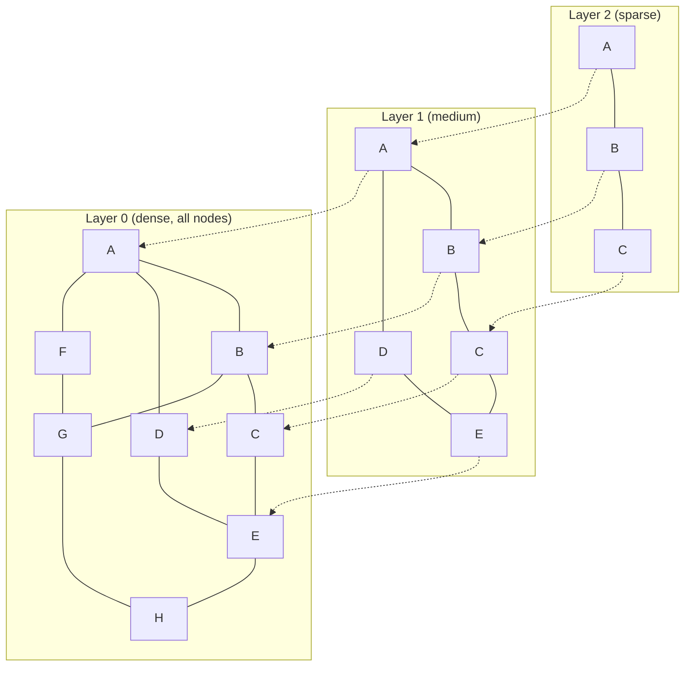
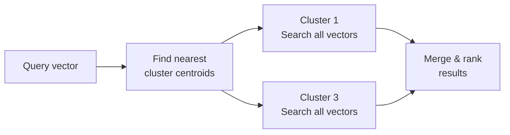
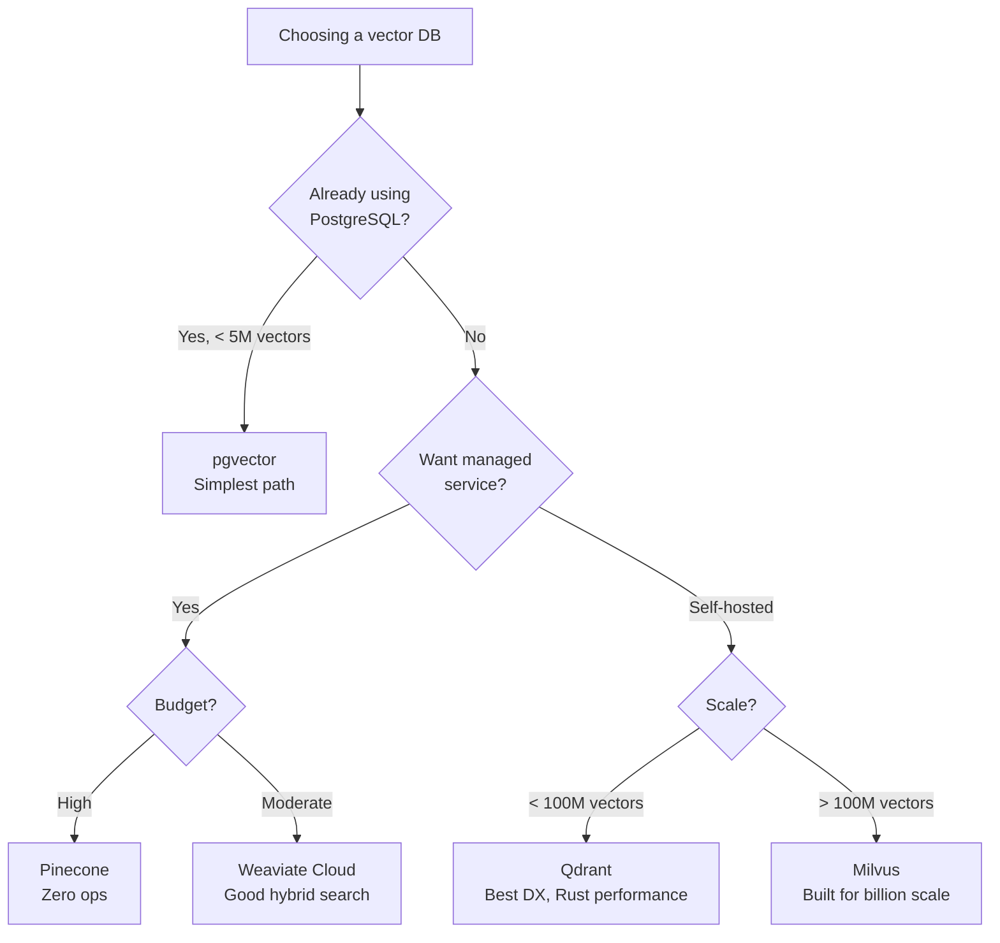
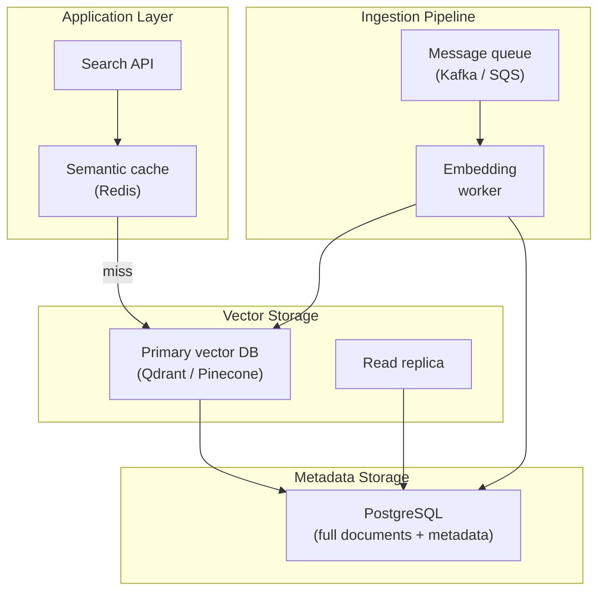

# Vector Databases

A vector database stores high-dimensional vectors and retrieves the most similar ones to a given query vector. That single capability underpins semantic search, recommendation engines, RAG pipelines, image similarity, anomaly detection, and deduplication. If you are building any AI-powered application, you will interact with a vector database.

This page covers how they work internally, the algorithms that make them fast, when to use a purpose-built vector database versus an extension like pgvector, and how to tune them for production workloads.

## What Are Vector Embeddings

An embedding is a numerical representation of data — text, images, audio — in a continuous vector space where semantic similarity corresponds to geometric proximity. Two sentences that mean similar things will have embeddings that are close together, even if they share no words.

```python
from openai import OpenAI

client = OpenAI()

response = client.embeddings.create(
    model="text-embedding-3-small",
    input=[
        "The server crashed due to memory exhaustion",
        "Out of memory error caused the application to terminate",
        "Today's weather is sunny with light clouds",
    ]
)

# Embeddings 0 and 1 will be close (similar meaning)
# Embedding 2 will be far from both (different topic)
vectors = [e.embedding for e in response.data]
```

Each embedding is a list of floating-point numbers (typically 384 to 3072 dimensions). The "meaning" lives in the relative positions — not in any individual dimension.

For a deeper treatment, see [Embeddings & Semantic Search](/ai-ml-engineering/embeddings).

## Why Not Just Use a Regular Database?

You could store vectors in PostgreSQL as arrays and compute cosine similarity with a query. It works for 10,000 vectors. At 10 million vectors, it becomes unusable because you are doing a full table scan — comparing the query against every single vector.

Vector databases solve this with **Approximate Nearest Neighbor (ANN)** algorithms that trade a small amount of accuracy for enormous speed gains:

| Approach | 1M vectors query time | Recall@10 |
|----------|----------------------|-----------|
| Brute force (exact) | ~500ms | 100% |
| HNSW (approximate) | ~1ms | 99%+ |
| IVF (approximate) | ~5ms | 95%+ |

The key insight: you almost never need the *exact* nearest neighbors. An approximate result that returns 95-99% of the true top-10 in 1ms is far more useful than an exact result in 500ms.

## Similarity Search Algorithms

### HNSW (Hierarchical Navigable Small World)

HNSW is the dominant algorithm for production vector search. It builds a multi-layer graph where each node is a vector and edges connect similar vectors. Search starts at the top layer (sparse, long-range connections) and drills down to the bottom layer (dense, precise connections).



**Key parameters:**

| Parameter | What It Controls | Tradeoff |
|-----------|-----------------|----------|
| `M` | Max connections per node | Higher = better recall, more memory |
| `ef_construction` | Search width during build | Higher = better graph quality, slower build |
| `ef_search` | Search width at query time | Higher = better recall, slower query |

```python
# Qdrant example: creating an HNSW-indexed collection
from qdrant_client import QdrantClient
from qdrant_client.models import Distance, VectorParams, HnswConfigDiff

client = QdrantClient(url="http://localhost:6333")

client.create_collection(
    collection_name="documents",
    vectors_config=VectorParams(
        size=1536,
        distance=Distance.COSINE,
    ),
    hnsw_config=HnswConfigDiff(
        m=16,                  # 16 connections per node (default)
        ef_construct=100,      # Construction-time search width
    ),
)
```

::: tip HNSW memory usage
HNSW stores the graph in memory. For 10M vectors of 1536 dimensions (float32), expect approximately: `10M * 1536 * 4 bytes = ~57 GB` for vectors alone, plus graph overhead. Plan your infrastructure accordingly.
:::

### IVF (Inverted File Index)

IVF partitions the vector space into clusters using k-means. At query time, it searches only the nearest clusters instead of the entire dataset.



**Key parameters:**

| Parameter | What It Controls |
|-----------|-----------------|
| `nlist` | Number of clusters (typically sqrt(N)) |
| `nprobe` | Number of clusters to search at query time |

IVF uses less memory than HNSW but has worse query latency. It is a good choice when memory is constrained.

### PQ (Product Quantization)

PQ compresses vectors by splitting each vector into sub-vectors and quantizing each sub-vector to a codebook entry. This reduces memory usage by 4-32x at the cost of some accuracy.

PQ is typically combined with IVF (IVF-PQ) for large-scale deployments where memory is the bottleneck:

| Configuration | Memory per 1M vectors (1536d) | Recall@10 |
|--------------|------------------------------|-----------|
| HNSW (float32) | ~5.7 GB | 99%+ |
| IVF-PQ (64 sub-vectors) | ~0.2 GB | 90-95% |
| IVF-PQ + rerank | ~0.2 GB + disk | 97%+ |

## Vector Database Comparison

### Feature Matrix

| Feature | Pinecone | Weaviate | Qdrant | Milvus | pgvector |
|---------|----------|----------|--------|--------|----------|
| **Deployment** | Managed only | Managed + self-hosted | Managed + self-hosted | Self-hosted + Zilliz Cloud | PostgreSQL extension |
| **Algorithms** | Proprietary | HNSW | HNSW | HNSW, IVF, DiskANN | HNSW, IVF |
| **Max vectors** | Billions | Billions | Billions | Billions | ~10M practical |
| **Metadata filtering** | Yes (pre-filter) | Yes (pre-filter) | Yes (pre/post-filter) | Yes (pre-filter) | Yes (SQL WHERE) |
| **Hybrid search** | Yes | Yes (BM25 + vector) | Yes (sparse + dense) | Yes | Yes (with tsvector) |
| **Multi-tenancy** | Namespaces | Tenants | Collections/payload | Partitions | Row-level security |
| **Disk-based** | No (memory) | Yes (HNSW+disk) | Yes (memmap) | Yes (DiskANN) | Yes |
| **Language** | - | Go | Rust | Go/C++ | C |

### When to Use What



### Detailed Breakdown

**Pinecone** — The managed-only option. Zero infrastructure management. Best for teams that want to focus purely on their application. Pricing is per-pod and can get expensive at scale. No self-hosted option means vendor lock-in.

**Weaviate** — Strong hybrid search (built-in BM25 + vector). Excellent module ecosystem for vectorization, reranking, and generative search. Good choice if you want hybrid search without building it yourself.

**Qdrant** — Written in Rust with exceptional performance characteristics. Best developer experience among self-hosted options. Supports payload (metadata) indexing with complex filter expressions. Memory-mapped storage allows datasets larger than RAM.

**Milvus** — Designed for billion-scale vector search. Supports multiple index types (HNSW, IVF, DiskANN). More complex to operate but handles the largest workloads. Zilliz Cloud offers a managed version.

**pgvector** — PostgreSQL extension. No new infrastructure required. Use it when you have fewer than 5-10 million vectors and already run PostgreSQL. ACID transactions, familiar SQL, and joins with relational data.

## Indexing Strategies and Performance Tuning

### pgvector Setup and Tuning

```sql
-- Install the extension
CREATE EXTENSION vector;

-- Create a table with a vector column
CREATE TABLE documents (
    id SERIAL PRIMARY KEY,
    content TEXT NOT NULL,
    embedding vector(1536),
    metadata JSONB,
    created_at TIMESTAMPTZ DEFAULT now()
);

-- Create an HNSW index (recommended for most cases)
CREATE INDEX ON documents
USING hnsw (embedding vector_cosine_ops)
WITH (m = 16, ef_construction = 200);

-- Set search-time parameters
SET hnsw.ef_search = 100;

-- Query with cosine distance
SELECT id, content, 1 - (embedding <=> $1::vector) AS similarity
FROM documents
WHERE metadata->>'category' = 'engineering'
ORDER BY embedding <=> $1::vector
LIMIT 10;
```

::: warning pgvector memory requirements
HNSW indexes in pgvector are loaded into memory. For 5M vectors at 1536 dimensions, the index alone requires approximately 30 GB of `shared_buffers`. Monitor `pg_stat_user_indexes` to ensure the index stays in cache.
:::

### Qdrant Tuning

```python
from qdrant_client.models import OptimizersConfigDiff, HnswConfigDiff

# Optimize for search speed (production)
client.update_collection(
    collection_name="documents",
    optimizer_config=OptimizersConfigDiff(
        indexing_threshold=20000,   # Build index after N vectors
        memmap_threshold=50000,     # Use disk after N vectors
    ),
    hnsw_config=HnswConfigDiff(
        ef_construct=200,           # Higher = better recall, slower build
        m=32,                       # More connections = better recall
        on_disk=True,               # Store HNSW graph on disk (save RAM)
    ),
)
```

### Performance Benchmarks (Approximate)

| Database | 1M vectors, 1536d | Query latency (P99) | Recall@10 | Memory |
|----------|-------------------|--------------------|-----------|---------|
| Qdrant (HNSW, RAM) | Indexed | ~2ms | 99% | 8 GB |
| Qdrant (HNSW, mmap) | Indexed | ~8ms | 99% | 2 GB |
| Weaviate (HNSW) | Indexed | ~3ms | 98% | 9 GB |
| pgvector (HNSW) | Indexed | ~5ms | 97% | 7 GB |
| Milvus (IVF-PQ) | Indexed | ~4ms | 95% | 1 GB |

## Metadata Filtering

Metadata filtering lets you constrain vector search to a subset of your data. This is essential for multi-tenant systems, access control, and scoped queries.

### Pre-Filtering vs. Post-Filtering

| Strategy | How It Works | Pros | Cons |
|----------|-------------|------|------|
| **Pre-filter** | Filter metadata first, then search vectors in the subset | Accurate count, no wasted computation | Can be slow if filter is unselective |
| **Post-filter** | Search all vectors, then filter results | Fast vector search | May return fewer results than requested |

Most production vector databases use pre-filtering or a hybrid approach:

```python
# Qdrant: pre-filtered search
from qdrant_client.models import Filter, FieldCondition, MatchValue, Range

results = client.query_points(
    collection_name="documents",
    query=query_embedding,
    query_filter=Filter(
        must=[
            FieldCondition(
                key="tenant_id",
                match=MatchValue(value="acme-corp"),
            ),
            FieldCondition(
                key="created_at",
                range=Range(gte="2026-01-01T00:00:00Z"),
            ),
        ],
        must_not=[
            FieldCondition(
                key="status",
                match=MatchValue(value="archived"),
            ),
        ]
    ),
    limit=10,
)
```

### Payload Indexing

Create indexes on frequently filtered metadata fields to speed up pre-filtering:

```python
# Qdrant: index frequently filtered fields
client.create_payload_index(
    collection_name="documents",
    field_name="tenant_id",
    field_schema="keyword",
)

client.create_payload_index(
    collection_name="documents",
    field_name="created_at",
    field_schema="datetime",
)
```

## When to Use Vector DB vs. Full-Text Search

Not every search problem needs vectors. Sometimes BM25 (full-text search) is the right tool.

| Scenario | Best Approach | Why |
|----------|--------------|-----|
| User types exact error messages | Full-text (BM25) | Exact keyword matching is more precise |
| User asks natural language questions | Vector search | Semantic understanding of intent |
| Search by product SKU or ID | Full-text or SQL | Exact match, no semantic component |
| "Find similar documents" | Vector search | Similarity in meaning, not keywords |
| Mixed: natural language + exact terms | Hybrid (vector + BM25) | Combines semantic + keyword matching |
| Typo-tolerant search | Full-text with fuzzy matching | Elasticsearch/BM25 handles typos natively |

::: tip The hybrid search sweet spot
For most production search systems, hybrid search (vector + BM25 with reciprocal rank fusion) outperforms either approach alone. See the hybrid search section in [RAG Architecture](/ai-ml-engineering/rag-architecture) for implementation details.
:::

## Production Architecture



### Key Architecture Decisions

1. **Store full documents in a relational database, not the vector DB.** The vector DB holds embeddings and minimal metadata. After retrieval, fetch the full document from PostgreSQL by ID.

2. **Use a message queue for ingestion.** Document embedding is CPU/GPU-intensive. Decouple it from the application with a queue to handle bursts and retries.

3. **Cache aggressively.** Semantic caching (embed the query, check for similar cached queries) can eliminate 30-80% of vector DB hits for repetitive query patterns.

4. **Plan for reindexing.** When you change your embedding model or chunking strategy, you need to re-embed everything. Design your pipeline to support full reindexing without downtime.

## Common Anti-Patterns

| Anti-Pattern | Why It Fails | Better Approach |
|---|---|---|
| Storing full documents as vector metadata | Bloated index, slow queries | Store doc ID in metadata, full text in PostgreSQL |
| Using brute force for > 100K vectors | Query latency degrades linearly | Use HNSW or IVF indexing |
| Same index for all tenants | No isolation, noisy neighbors | Separate collections/namespaces per tenant |
| Ignoring embedding model updates | New model = incompatible embeddings | Version your indexes, plan reindexing |
| No monitoring on recall quality | Silent degradation as data grows | Periodic recall benchmarks against ground truth |

## Further Reading

- [Embeddings & Semantic Search](/ai-ml-engineering/embeddings) — How embeddings work, which models to choose, distance metrics
- [RAG Architecture Deep Dive](/ai-ml-engineering/rag-architecture) — Building retrieval pipelines on top of vector databases
- [System Design: Databases](/system-design/databases/) — Relational database internals for the metadata layer
- [System Design: Caching](/system-design/caching/) — Caching strategies for the semantic cache layer
