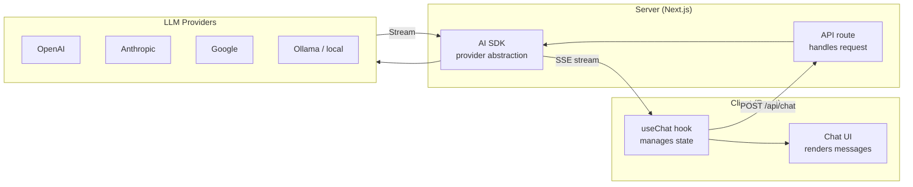
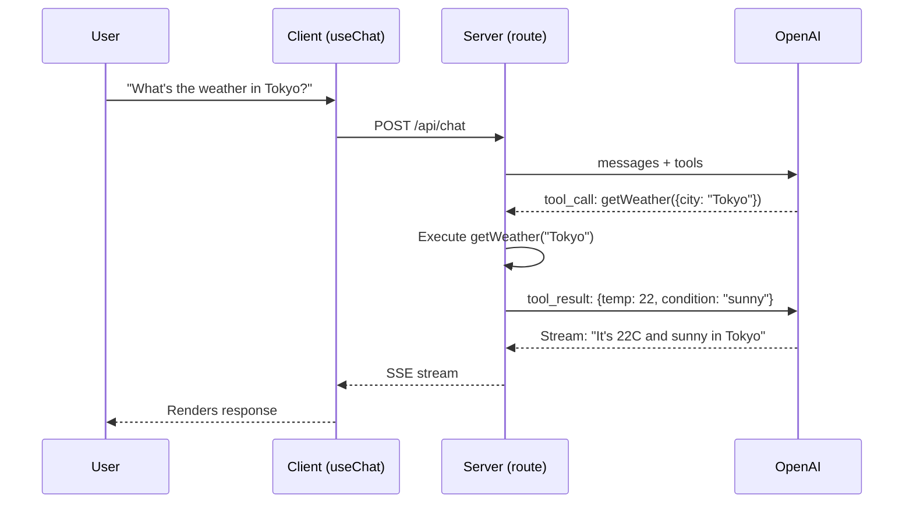

# Vercel AI SDK

The Vercel AI SDK is a TypeScript toolkit for building AI-powered applications with streaming user interfaces. While [LangChain](/ai-ml-engineering/langchain) and [LlamaIndex](/ai-ml-engineering/llamaindex) focus on backend orchestration and data retrieval, the AI SDK solves the frontend problem: how do you stream LLM responses to a React UI, handle tool calls in real time, and build generative interfaces that feel fast and responsive?

If you are building an AI chat application, a copilot feature, or any interface where an LLM generates content that users see in real time, the AI SDK is the most mature solution in the TypeScript/React ecosystem.

## Why the AI SDK Exists

Streaming LLM responses to a web UI is harder than it looks:

1. **Server-Sent Events or WebSockets** — You need a streaming transport, not request-response
2. **Incremental rendering** — Tokens must appear as they arrive, not all at once
3. **Tool call handling** — The model may call tools mid-stream, requiring client-server coordination
4. **Provider differences** — OpenAI, Anthropic, Google, and others all have different streaming formats
5. **State management** — Chat history, loading states, error handling, abort signals
6. **Edge compatibility** — Running on edge runtimes with streaming response support

The AI SDK handles all of this with a clean API:



## Architecture: Three Layers

The AI SDK has three distinct layers:

### 1. AI SDK Core (`ai`)

The provider-agnostic core for generating text, structured data, and tool calls:

```typescript
import { generateText, streamText, generateObject } from "ai";
import { openai } from "@ai-sdk/openai";

// Generate text (blocking)
const { text } = await generateText({
  model: openai("gpt-4o"),
  prompt: "Explain database sharding in one paragraph.",
});

// Stream text
const result = streamText({
  model: openai("gpt-4o"),
  prompt: "Explain database sharding in one paragraph.",
});

for await (const chunk of result.textStream) {
  process.stdout.write(chunk);
}
```

### 2. AI SDK UI (`ai/react`, `ai/svelte`, `ai/vue`)

Framework-specific hooks for building chat UIs:

```typescript
import { useChat } from "ai/react";

function ChatComponent() {
  const { messages, input, handleInputChange, handleSubmit, isLoading } =
    useChat();

  return (
    <div>
      {messages.map((m) => (
        <div key={m.id}>
          <strong>{m.role}:</strong> {m.content}
        </div>
      ))}
      <form onSubmit={handleSubmit}>
        <input value={input} onChange={handleInputChange} />
        <button type="submit" disabled={isLoading}>
          Send
        </button>
      </form>
    </div>
  );
}
```

### 3. AI SDK Providers (`@ai-sdk/*`)

Provider packages that implement the unified interface:

```typescript
import { openai } from "@ai-sdk/openai";
import { anthropic } from "@ai-sdk/anthropic";
import { google } from "@ai-sdk/google";
import { mistral } from "@ai-sdk/mistral";
import { createOllama } from "ollama-ai-provider";

// All use the same interface
const model = openai("gpt-4o");
const model = anthropic("claude-sonnet-4-20250514");
const model = google("gemini-1.5-pro");
const model = mistral("mistral-large-latest");
const model = createOllama({ model: "llama3" });
```

## useChat — The Core Hook

`useChat` is the primary hook for building conversational UIs. It manages message history, streaming state, error handling, and the HTTP connection to your API route.

### Server-Side Route

```typescript
// app/api/chat/route.ts (Next.js App Router)
import { streamText } from "ai";
import { openai } from "@ai-sdk/openai";

export async function POST(req: Request) {
  const { messages } = await req.json();

  const result = streamText({
    model: openai("gpt-4o"),
    system: "You are a helpful engineering assistant.",
    messages,
  });

  return result.toDataStreamResponse();
}
```

### Client-Side Hook

```typescript
"use client";
import { useChat } from "ai/react";

export default function Chat() {
  const {
    messages,       // Array of messages
    input,          // Current input value
    handleInputChange, // Input onChange handler
    handleSubmit,   // Form onSubmit handler
    isLoading,      // True while streaming
    stop,           // Abort current stream
    reload,         // Retry last message
    error,          // Error object if failed
    setMessages,    // Manually set messages
    append,         // Programmatically add a message
  } = useChat({
    api: "/api/chat",
    initialMessages: [],
    onFinish: (message) => {
      console.log("Completed:", message);
    },
    onError: (error) => {
      console.error("Stream error:", error);
    },
  });

  return (
    <div className="flex flex-col h-screen">
      <div className="flex-1 overflow-y-auto p-4">
        {messages.map((m) => (
          <div key={m.id} className={`mb-4 ${m.role === "user" ? "text-right" : ""}`}>
            <span className="font-bold">{m.role === "user" ? "You" : "AI"}:</span>
            <p className="whitespace-pre-wrap">{m.content}</p>
          </div>
        ))}
      </div>

      <form onSubmit={handleSubmit} className="border-t p-4 flex gap-2">
        <input
          value={input}
          onChange={handleInputChange}
          placeholder="Ask a question..."
          className="flex-1 border rounded px-3 py-2"
        />
        <button type="submit" disabled={isLoading}>
          {isLoading ? "Thinking..." : "Send"}
        </button>
        {isLoading && (
          <button type="button" onClick={stop}>Stop</button>
        )}
      </form>
    </div>
  );
}
```

### useCompletion — Single-Turn Generation

For non-conversational use cases (text completion, summarization, code generation):

```typescript
import { useCompletion } from "ai/react";

export default function Summarizer() {
  const { completion, input, handleInputChange, handleSubmit, isLoading } =
    useCompletion({
      api: "/api/summarize",
    });

  return (
    <div>
      <form onSubmit={handleSubmit}>
        <textarea value={input} onChange={handleInputChange} />
        <button type="submit">Summarize</button>
      </form>
      <div>{completion}</div>
    </div>
  );
}
```

## Structured Output

Generate typed, validated output from LLMs using Zod schemas:

```typescript
import { generateObject, streamObject } from "ai";
import { openai } from "@ai-sdk/openai";
import { z } from "zod";

const RecipeSchema = z.object({
  name: z.string().describe("Recipe name"),
  ingredients: z.array(
    z.object({
      item: z.string(),
      amount: z.string(),
    })
  ),
  steps: z.array(z.string()),
  prepTime: z.number().describe("Prep time in minutes"),
  difficulty: z.enum(["easy", "medium", "hard"]),
});

// Blocking generation
const { object } = await generateObject({
  model: openai("gpt-4o"),
  schema: RecipeSchema,
  prompt: "Create a recipe for chocolate chip cookies.",
});
// object is fully typed as z.infer<typeof RecipeSchema>

// Streaming generation (partial objects as they build up)
const result = streamObject({
  model: openai("gpt-4o"),
  schema: RecipeSchema,
  prompt: "Create a recipe for chocolate chip cookies.",
});

for await (const partialObject of result.partialObjectStream) {
  console.log(partialObject); // Partial recipe, growing with each chunk
}
```

::: tip Structured output vs output parsers
Unlike string-based output parsers that parse free text, `generateObject` uses the model's native structured output capability (tool calling or JSON mode). This is far more reliable — the output is guaranteed to match your schema or the call fails with a clear error.
:::

## Tool Calling

Define tools that the LLM can invoke during generation:

### Server-Side Tools

```typescript
import { streamText, tool } from "ai";
import { openai } from "@ai-sdk/openai";
import { z } from "zod";

export async function POST(req: Request) {
  const { messages } = await req.json();

  const result = streamText({
    model: openai("gpt-4o"),
    messages,
    tools: {
      getWeather: tool({
        description: "Get the current weather for a city",
        parameters: z.object({
          city: z.string().describe("City name"),
        }),
        execute: async ({ city }) => {
          const weather = await fetchWeather(city);
          return { temperature: weather.temp, condition: weather.condition };
        },
      }),
      searchDocs: tool({
        description: "Search internal documentation",
        parameters: z.object({
          query: z.string().describe("Search query"),
        }),
        execute: async ({ query }) => {
          const results = await vectorSearch(query);
          return results;
        },
      }),
    },
    maxSteps: 5, // Allow up to 5 tool call rounds
  });

  return result.toDataStreamResponse();
}
```

### Displaying Tool Results in the UI

```typescript
"use client";
import { useChat } from "ai/react";

export default function Chat() {
  const { messages, input, handleInputChange, handleSubmit } = useChat();

  return (
    <div>
      {messages.map((m) => (
        <div key={m.id}>
          {m.role === "user" && <p><strong>You:</strong> {m.content}</p>}
          {m.role === "assistant" && (
            <div>
              {m.content && <p>{m.content}</p>}
              {m.toolInvocations?.map((tool, i) => (
                <div key={i} className="bg-gray-100 rounded p-2 my-1">
                  <p className="text-sm text-gray-500">
                    Called: {tool.toolName}
                  </p>
                  {tool.state === "result" && (
                    <pre className="text-sm">
                      {JSON.stringify(tool.result, null, 2)}
                    </pre>
                  )}
                </div>
              ))}
            </div>
          )}
        </div>
      ))}
      <form onSubmit={handleSubmit}>
        <input value={input} onChange={handleInputChange} />
      </form>
    </div>
  );
}
```



## Generative UI with React Server Components

The most powerful feature of the AI SDK: streaming React components from the server instead of just text.

```typescript
// app/api/chat/route.ts
import { streamUI } from "ai/rsc";
import { openai } from "@ai-sdk/openai";
import { z } from "zod";

export async function sendMessage(message: string) {
  "use server";

  const result = await streamUI({
    model: openai("gpt-4o"),
    messages: [{ role: "user", content: message }],
    text: ({ content }) => <div className="prose">{content}</div>,
    tools: {
      showWeather: {
        description: "Show weather for a city",
        parameters: z.object({ city: z.string() }),
        generate: async function* ({ city }) {
          yield <div className="animate-pulse">Loading weather...</div>;
          const weather = await fetchWeather(city);
          return <WeatherCard city={city} data={weather} />;
        },
      },
      showStock: {
        description: "Show stock price chart",
        parameters: z.object({ symbol: z.string() }),
        generate: async function* ({ symbol }) {
          yield <div className="animate-pulse">Loading chart...</div>;
          const data = await fetchStockData(symbol);
          return <StockChart symbol={symbol} data={data} />;
        },
      },
    },
  });

  return result.value;
}
```

This is genuinely revolutionary: the LLM decides which React component to render based on the user's question, and those components stream to the client as they are built.

::: warning Generative UI requires RSC
The `streamUI` API requires React Server Components (Next.js App Router with Server Actions). It does not work with Pages Router, plain React, or other frameworks. For non-RSC setups, use `useChat` with `toolInvocations` to render tool results as components on the client.
:::

## Multi-Provider Support

One of the AI SDK's strongest features: write once, run on any provider.

```typescript
import { generateText } from "ai";
import { openai } from "@ai-sdk/openai";
import { anthropic } from "@ai-sdk/anthropic";
import { google } from "@ai-sdk/google";

// Model routing based on task
function getModel(task: "fast" | "smart" | "cheap") {
  switch (task) {
    case "fast":
      return openai("gpt-4o-mini");
    case "smart":
      return anthropic("claude-sonnet-4-20250514");
    case "cheap":
      return google("gemini-1.5-flash");
  }
}

// Same code, different models
const { text } = await generateText({
  model: getModel("smart"),
  prompt: "Explain ACID properties",
});
```

### Provider Fallback

```typescript
import { generateText } from "ai";
import { openai } from "@ai-sdk/openai";
import { anthropic } from "@ai-sdk/anthropic";

async function generateWithFallback(prompt: string): Promise<string> {
  const providers = [
    openai("gpt-4o"),
    anthropic("claude-sonnet-4-20250514"),
    openai("gpt-4o-mini"), // cheaper fallback
  ];

  for (const model of providers) {
    try {
      const { text } = await generateText({ model, prompt });
      return text;
    } catch (error) {
      console.warn(`Provider failed: ${error.message}`);
      continue;
    }
  }
  throw new Error("All providers failed");
}
```

## Edge Runtime Considerations

The AI SDK is designed to work on edge runtimes (Vercel Edge Functions, Cloudflare Workers). This matters for latency — edge functions run closer to the user.

```typescript
// app/api/chat/route.ts
export const runtime = "edge"; // Run on edge

export async function POST(req: Request) {
  const { messages } = await req.json();

  const result = streamText({
    model: openai("gpt-4o"),
    messages,
  });

  return result.toDataStreamResponse();
}
```

### Edge Runtime Limitations

| Consideration | Edge Runtime | Node.js Runtime |
|--------------|-------------|-----------------|
| **Cold start** | ~0ms | 250ms+ |
| **Max execution** | 30s (Vercel) | 5min+ |
| **File system** | Not available | Available |
| **Database** | HTTP-based only (Neon, PlanetScale) | Any driver |
| **npm packages** | Must be edge-compatible | All packages |
| **Streaming** | Native support | Native support |

::: tip Edge is great for streaming, bad for RAG
Use edge runtime for simple streaming chat (direct LLM calls). Use Node.js runtime when your API route needs to query a database, access the filesystem, or run heavy processing before calling the LLM.
:::

## Production Patterns

### Rate Limiting

```typescript
import { Ratelimit } from "@upstash/ratelimit";
import { Redis } from "@upstash/redis";

const ratelimit = new Ratelimit({
  redis: Redis.fromEnv(),
  limiter: Ratelimit.slidingWindow(10, "1 m"), // 10 requests per minute
});

export async function POST(req: Request) {
  const ip = req.headers.get("x-forwarded-for") ?? "unknown";
  const { success } = await ratelimit.limit(ip);

  if (!success) {
    return new Response("Rate limit exceeded", { status: 429 });
  }

  // ... handle request
}
```

### Streaming with Authentication

```typescript
import { auth } from "@/lib/auth";

export async function POST(req: Request) {
  const session = await auth();
  if (!session) {
    return new Response("Unauthorized", { status: 401 });
  }

  const { messages } = await req.json();

  // Limit message history to control costs
  const recentMessages = messages.slice(-20);

  const result = streamText({
    model: openai("gpt-4o"),
    messages: recentMessages,
    maxTokens: 1000, // cap output length
  });

  return result.toDataStreamResponse();
}
```

### Middleware Pattern

```typescript
import { streamText, wrapLanguageModel } from "ai";

// Add logging, caching, or guardrails via middleware
const wrappedModel = wrapLanguageModel({
  model: openai("gpt-4o"),
  middleware: {
    transformParams: async ({ params }) => {
      console.log("Input messages:", params.messages.length);
      return params;
    },
    wrapGenerate: async ({ doGenerate, params }) => {
      const start = Date.now();
      const result = await doGenerate();
      console.log(`Latency: ${Date.now() - start}ms`);
      return result;
    },
  },
});
```

## AI SDK vs Other Approaches

| Approach | Best For | Streaming | Type Safety | Framework |
|----------|---------|-----------|-------------|-----------|
| **Vercel AI SDK** | Full-stack React/Next.js apps | First-class | Full (Zod) | React, Svelte, Vue |
| **LangChain.js** | Backend orchestration | Supported | Partial | Any |
| **OpenAI SDK** | Direct OpenAI calls | Manual SSE | Types via SDK | Any |
| **Anthropic SDK** | Direct Anthropic calls | Manual SSE | Types via SDK | Any |
| **Custom fetch** | Full control | Manual | Manual | Any |

## Further Reading

- [LLM Integration Patterns](/ai-ml-engineering/llm-integration) — Foundation patterns for calling LLMs
- [AI in Production](/ai-ml-engineering/ai-in-production) — Latency, cost, and reliability patterns
- [Prompt Caching & Context Management](/ai-ml-engineering/prompt-caching) — Reducing costs in streaming applications
- [AI Safety & Guardrails](/ai-ml-engineering/ai-guardrails) — Filtering and validating LLM output
- [Vercel AI SDK Documentation](https://sdk.vercel.ai/docs) — Official docs
- [AI SDK GitHub](https://github.com/vercel/ai) — Source code and examples
