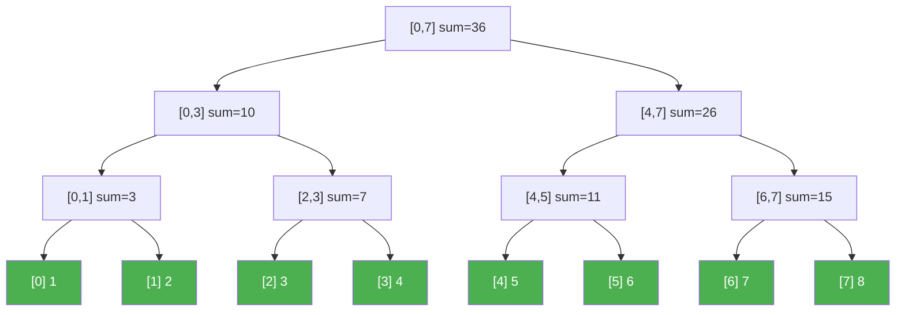
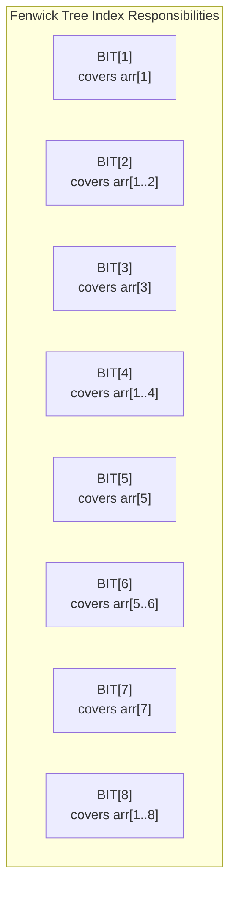
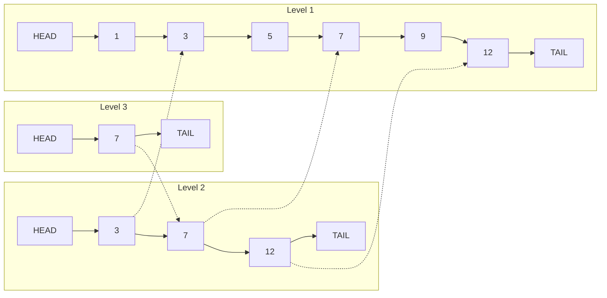
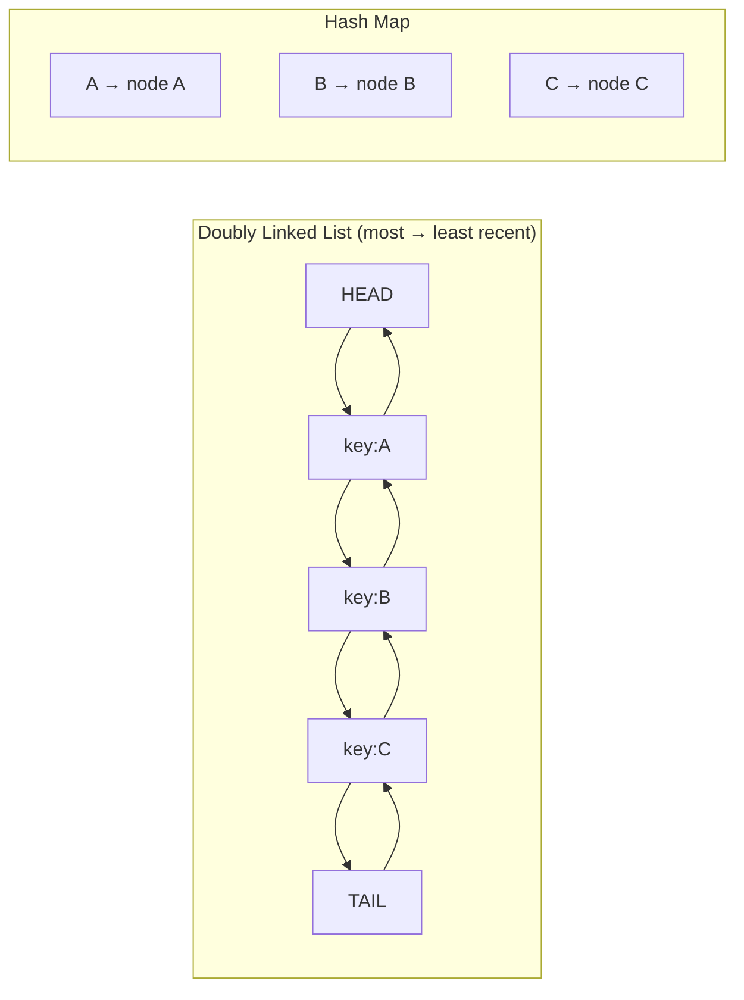
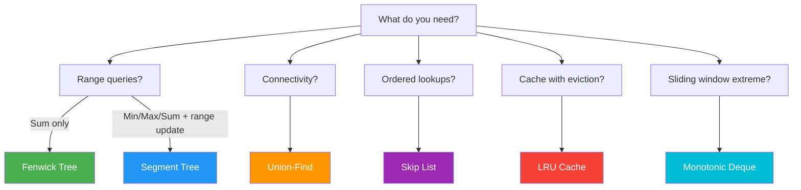

# Advanced Data Structures

Standard arrays, hash maps, and binary search trees handle most problems. But some problems demand more specialized structures — range queries in logarithmic time, dynamic connectivity checks, ordered probabilistic lookups, or sliding window maximums. These advanced data structures appear in competitive programming, system design interviews, and production systems alike. Mastering them gives you tools that most engineers simply do not have.

## Segment Trees

A segment tree is a binary tree that stores information about intervals (segments) of an array. It supports both range queries and point/range updates in $O(\log n)$.

### Structure

For an array of $n$ elements, the segment tree has $2n - 1$ nodes (or up to $4n$ for safe allocation). Each leaf corresponds to a single element, and each internal node stores the aggregate (sum, min, max, GCD, etc.) of its children's intervals.



*Segment tree for array `[1, 2, 3, 4, 5, 6, 7, 8]` storing range sums.*

### Implementation (Range Sum + Point Update)

**TypeScript:**

```typescript
class SegmentTree {
  private tree: number[];
  private n: number;

  constructor(arr: number[]) {
    this.n = arr.length;
    this.tree = new Array(4 * this.n).fill(0);
    this.build(arr, 1, 0, this.n - 1);
  }

  private build(arr: number[], node: number, start: number, end: number): void {
    if (start === end) {
      this.tree[node] = arr[start];
      return;
    }

    const mid = Math.floor((start + end) / 2);
    this.build(arr, 2 * node, start, mid);
    this.build(arr, 2 * node + 1, mid + 1, end);
    this.tree[node] = this.tree[2 * node] + this.tree[2 * node + 1];
  }

  update(idx: number, val: number, node = 1, start = 0, end = this.n - 1): void {
    if (start === end) {
      this.tree[node] = val;
      return;
    }

    const mid = Math.floor((start + end) / 2);
    if (idx <= mid) {
      this.update(idx, val, 2 * node, start, mid);
    } else {
      this.update(idx, val, 2 * node + 1, mid + 1, end);
    }
    this.tree[node] = this.tree[2 * node] + this.tree[2 * node + 1];
  }

  query(l: number, r: number, node = 1, start = 0, end = this.n - 1): number {
    if (r < start || end < l) return 0; // out of range
    if (l <= start && end <= r) return this.tree[node]; // fully within range

    const mid = Math.floor((start + end) / 2);
    return (
      this.query(l, r, 2 * node, start, mid) +
      this.query(l, r, 2 * node + 1, mid + 1, end)
    );
  }
}
```

**Python:**

```python
class SegmentTree:
    def __init__(self, arr: list[int]):
        self.n = len(arr)
        self.tree = [0] * (4 * self.n)
        self._build(arr, 1, 0, self.n - 1)

    def _build(self, arr: list[int], node: int, start: int, end: int) -> None:
        if start == end:
            self.tree[node] = arr[start]
            return

        mid = (start + end) // 2
        self._build(arr, 2 * node, start, mid)
        self._build(arr, 2 * node + 1, mid + 1, end)
        self.tree[node] = self.tree[2 * node] + self.tree[2 * node + 1]

    def update(self, idx: int, val: int, node: int = 1,
               start: int = 0, end: int = -1) -> None:
        if end == -1:
            end = self.n - 1
        if start == end:
            self.tree[node] = val
            return

        mid = (start + end) // 2
        if idx <= mid:
            self.update(idx, val, 2 * node, start, mid)
        else:
            self.update(idx, val, 2 * node + 1, mid + 1, end)
        self.tree[node] = self.tree[2 * node] + self.tree[2 * node + 1]

    def query(self, l: int, r: int, node: int = 1,
              start: int = 0, end: int = -1) -> int:
        if end == -1:
            end = self.n - 1
        if r < start or end < l:
            return 0
        if l <= start and end <= r:
            return self.tree[node]

        mid = (start + end) // 2
        return (self.query(l, r, 2 * node, start, mid) +
                self.query(l, r, 2 * node + 1, mid + 1, end))
```

### Lazy Propagation (Range Updates)

Without lazy propagation, updating a range of $k$ elements takes $O(k \log n)$. With it, range updates become $O(\log n)$ by deferring updates to child nodes until they are actually needed.

**TypeScript:**

```typescript
class LazySegmentTree {
  private tree: number[];
  private lazy: number[];
  private n: number;

  constructor(arr: number[]) {
    this.n = arr.length;
    this.tree = new Array(4 * this.n).fill(0);
    this.lazy = new Array(4 * this.n).fill(0);
    this.build(arr, 1, 0, this.n - 1);
  }

  private build(arr: number[], node: number, start: number, end: number): void {
    if (start === end) {
      this.tree[node] = arr[start];
      return;
    }
    const mid = Math.floor((start + end) / 2);
    this.build(arr, 2 * node, start, mid);
    this.build(arr, 2 * node + 1, mid + 1, end);
    this.tree[node] = this.tree[2 * node] + this.tree[2 * node + 1];
  }

  private pushDown(node: number, start: number, end: number): void {
    if (this.lazy[node] !== 0) {
      const mid = Math.floor((start + end) / 2);
      this.applyLazy(2 * node, start, mid, this.lazy[node]);
      this.applyLazy(2 * node + 1, mid + 1, end, this.lazy[node]);
      this.lazy[node] = 0;
    }
  }

  private applyLazy(node: number, start: number, end: number, val: number): void {
    this.tree[node] += val * (end - start + 1);
    this.lazy[node] += val;
  }

  rangeUpdate(l: number, r: number, val: number,
              node = 1, start = 0, end = this.n - 1): void {
    if (r < start || end < l) return;
    if (l <= start && end <= r) {
      this.applyLazy(node, start, end, val);
      return;
    }

    this.pushDown(node, start, end);
    const mid = Math.floor((start + end) / 2);
    this.rangeUpdate(l, r, val, 2 * node, start, mid);
    this.rangeUpdate(l, r, val, 2 * node + 1, mid + 1, end);
    this.tree[node] = this.tree[2 * node] + this.tree[2 * node + 1];
  }

  query(l: number, r: number, node = 1, start = 0, end = this.n - 1): number {
    if (r < start || end < l) return 0;
    if (l <= start && end <= r) return this.tree[node];

    this.pushDown(node, start, end);
    const mid = Math.floor((start + end) / 2);
    return (
      this.query(l, r, 2 * node, start, mid) +
      this.query(l, r, 2 * node + 1, mid + 1, end)
    );
  }
}
```

**Python:**

```python
class LazySegmentTree:
    def __init__(self, arr: list[int]):
        self.n = len(arr)
        self.tree = [0] * (4 * self.n)
        self.lazy = [0] * (4 * self.n)
        self._build(arr, 1, 0, self.n - 1)

    def _build(self, arr: list[int], node: int, start: int, end: int) -> None:
        if start == end:
            self.tree[node] = arr[start]
            return
        mid = (start + end) // 2
        self._build(arr, 2 * node, start, mid)
        self._build(arr, 2 * node + 1, mid + 1, end)
        self.tree[node] = self.tree[2 * node] + self.tree[2 * node + 1]

    def _push_down(self, node: int, start: int, end: int) -> None:
        if self.lazy[node] != 0:
            mid = (start + end) // 2
            self._apply(2 * node, start, mid, self.lazy[node])
            self._apply(2 * node + 1, mid + 1, end, self.lazy[node])
            self.lazy[node] = 0

    def _apply(self, node: int, start: int, end: int, val: int) -> None:
        self.tree[node] += val * (end - start + 1)
        self.lazy[node] += val

    def range_update(self, l: int, r: int, val: int,
                     node: int = 1, start: int = 0, end: int = -1) -> None:
        if end == -1:
            end = self.n - 1
        if r < start or end < l:
            return
        if l <= start and end <= r:
            self._apply(node, start, end, val)
            return

        self._push_down(node, start, end)
        mid = (start + end) // 2
        self.range_update(l, r, val, 2 * node, start, mid)
        self.range_update(l, r, val, 2 * node + 1, mid + 1, end)
        self.tree[node] = self.tree[2 * node] + self.tree[2 * node + 1]

    def query(self, l: int, r: int, node: int = 1,
              start: int = 0, end: int = -1) -> int:
        if end == -1:
            end = self.n - 1
        if r < start or end < l:
            return 0
        if l <= start and end <= r:
            return self.tree[node]

        self._push_down(node, start, end)
        mid = (start + end) // 2
        return (self.query(l, r, 2 * node, start, mid) +
                self.query(l, r, 2 * node + 1, mid + 1, end))
```

| Operation | Without Lazy | With Lazy |
|-----------|-------------|-----------|
| Point Update | $O(\log n)$ | $O(\log n)$ |
| Range Update | $O(k \log n)$ | $O(\log n)$ |
| Range Query | $O(\log n)$ | $O(\log n)$ |
| Build | $O(n)$ | $O(n)$ |
| Space | $O(n)$ | $O(n)$ |

## Fenwick Tree (Binary Indexed Tree)

A Fenwick tree (BIT) supports prefix sum queries and point updates in $O(\log n)$ with a fraction of the code and memory of a segment tree. It uses the binary representation of indices to determine which ranges each node covers.

### Key Insight

The operation `i & (-i)` extracts the lowest set bit of $i$. This determines the "responsibility" of each index in the tree.

$$
\text{lowbit}(i) = i \;\&\; (-i)
$$



**TypeScript:**

```typescript
class FenwickTree {
  private tree: number[];
  private n: number;

  constructor(n: number) {
    this.n = n;
    this.tree = new Array(n + 1).fill(0);
  }

  // Add val to index i (1-indexed)
  update(i: number, val: number): void {
    while (i <= this.n) {
      this.tree[i] += val;
      i += i & -i; // move to parent
    }
  }

  // Prefix sum [1, i]
  query(i: number): number {
    let sum = 0;
    while (i > 0) {
      sum += this.tree[i];
      i -= i & -i; // move to predecessor
    }
    return sum;
  }

  // Range sum [l, r]
  rangeQuery(l: number, r: number): number {
    return this.query(r) - this.query(l - 1);
  }
}
```

**Python:**

```python
class FenwickTree:
    def __init__(self, n: int):
        self.n = n
        self.tree = [0] * (n + 1)

    def update(self, i: int, val: int) -> None:
        """Add val to index i (1-indexed)."""
        while i <= self.n:
            self.tree[i] += val
            i += i & -i

    def query(self, i: int) -> int:
        """Prefix sum [1, i]."""
        total = 0
        while i > 0:
            total += self.tree[i]
            i -= i & -i
        return total

    def range_query(self, l: int, r: int) -> int:
        """Range sum [l, r]."""
        return self.query(r) - self.query(l - 1)
```

### Fenwick vs Segment Tree

| Aspect | Fenwick Tree | Segment Tree |
|--------|-------------|--------------|
| Code complexity | ~15 lines | ~60 lines |
| Space | $n + 1$ | $4n$ |
| Point update | $O(\log n)$ | $O(\log n)$ |
| Prefix query | $O(\log n)$ | $O(\log n)$ |
| Range update | Needs modification | Natural with lazy prop |
| Min/Max queries | Not supported | Supported |
| Constant factor | Very small | Larger |

::: tip
Use Fenwick trees when you only need prefix sums and point updates. Use segment trees when you need range updates, min/max queries, or more complex aggregations.
:::

## Disjoint Set Union (Union-Find)

Union-Find tracks a collection of disjoint sets and supports two operations: **find** (which set does an element belong to?) and **union** (merge two sets). With path compression and union by rank, both operations run in nearly $O(1)$ amortized — specifically $O(\alpha(n))$ where $\alpha$ is the inverse Ackermann function.

$$
\alpha(n) \leq 4 \text{ for any } n \leq 2^{2^{2^{2^{16}}}}
$$

This is effectively constant time for all practical purposes.

### Implementation

**TypeScript:**

```typescript
class UnionFind {
  parent: number[];
  rank: number[];
  count: number; // number of connected components

  constructor(n: number) {
    this.parent = Array.from({ length: n }, (_, i) => i);
    this.rank = new Array(n).fill(0);
    this.count = n;
  }

  find(x: number): number {
    if (this.parent[x] !== x) {
      this.parent[x] = this.find(this.parent[x]); // path compression
    }
    return this.parent[x];
  }

  union(x: number, y: number): boolean {
    const px = this.find(x);
    const py = this.find(y);
    if (px === py) return false;

    // Union by rank
    if (this.rank[px] < this.rank[py]) {
      this.parent[px] = py;
    } else if (this.rank[px] > this.rank[py]) {
      this.parent[py] = px;
    } else {
      this.parent[py] = px;
      this.rank[px]++;
    }

    this.count--;
    return true;
  }

  connected(x: number, y: number): boolean {
    return this.find(x) === this.find(y);
  }
}
```

**Python:**

```python
class UnionFind:
    def __init__(self, n: int):
        self.parent = list(range(n))
        self.rank = [0] * n
        self.count = n  # number of components

    def find(self, x: int) -> int:
        if self.parent[x] != x:
            self.parent[x] = self.find(self.parent[x])  # path compression
        return self.parent[x]

    def union(self, x: int, y: int) -> bool:
        px, py = self.find(x), self.find(y)
        if px == py:
            return False

        # Union by rank
        if self.rank[px] < self.rank[py]:
            px, py = py, px
        self.parent[py] = px
        if self.rank[px] == self.rank[py]:
            self.rank[px] += 1

        self.count -= 1
        return True

    def connected(self, x: int, y: int) -> bool:
        return self.find(x) == self.find(y)
```

### Applications

| Application | How Union-Find Helps |
|-------------|---------------------|
| Kruskal's MST | Detect if adding an edge creates a cycle |
| Connected components | Count and identify graph components |
| Network connectivity | Check if two nodes can communicate |
| Image segmentation | Group similar adjacent pixels |
| Percolation | Determine if a system percolates |

## Skip Lists

A skip list is a probabilistic data structure that provides $O(\log n)$ average-case search, insert, and delete — like a balanced BST, but simpler to implement and with better concurrency properties.

### Structure

A skip list is a hierarchy of linked lists. The bottom level contains all elements. Each higher level contains a random subset of elements from the level below (each element is promoted with probability $p = 0.5$).



**Python:**

```python
import random

class SkipNode:
    def __init__(self, key: int, level: int):
        self.key = key
        self.forward: list[SkipNode | None] = [None] * (level + 1)

class SkipList:
    MAX_LEVEL = 16
    P = 0.5

    def __init__(self):
        self.header = SkipNode(-1, self.MAX_LEVEL)
        self.level = 0

    def _random_level(self) -> int:
        lvl = 0
        while random.random() < self.P and lvl < self.MAX_LEVEL:
            lvl += 1
        return lvl

    def search(self, key: int) -> bool:
        current = self.header
        for i in range(self.level, -1, -1):
            while current.forward[i] and current.forward[i].key < key:
                current = current.forward[i]

        current = current.forward[0]
        return current is not None and current.key == key

    def insert(self, key: int) -> None:
        update = [self.header] * (self.MAX_LEVEL + 1)
        current = self.header

        for i in range(self.level, -1, -1):
            while current.forward[i] and current.forward[i].key < key:
                current = current.forward[i]
            update[i] = current

        new_level = self._random_level()
        if new_level > self.level:
            for i in range(self.level + 1, new_level + 1):
                update[i] = self.header
            self.level = new_level

        new_node = SkipNode(key, new_level)
        for i in range(new_level + 1):
            new_node.forward[i] = update[i].forward[i]
            update[i].forward[i] = new_node

    def delete(self, key: int) -> bool:
        update = [self.header] * (self.MAX_LEVEL + 1)
        current = self.header

        for i in range(self.level, -1, -1):
            while current.forward[i] and current.forward[i].key < key:
                current = current.forward[i]
            update[i] = current

        target = current.forward[0]
        if target is None or target.key != key:
            return False

        for i in range(self.level + 1):
            if update[i].forward[i] != target:
                break
            update[i].forward[i] = target.forward[i]

        while self.level > 0 and self.header.forward[self.level] is None:
            self.level -= 1

        return True
```

| Operation | Average | Worst Case |
|-----------|---------|------------|
| Search | $O(\log n)$ | $O(n)$ |
| Insert | $O(\log n)$ | $O(n)$ |
| Delete | $O(\log n)$ | $O(n)$ |
| Space | $O(n)$ | $O(n \log n)$ |

::: tip
Redis uses skip lists for sorted sets (`ZSET`). They chose skip lists over balanced BSTs because skip lists are simpler, support concurrent operations better, and have comparable performance. This is a great system design talking point.
:::

## LRU Cache

An LRU (Least Recently Used) cache evicts the least recently accessed item when the cache is full. It combines a hash map (for $O(1)$ lookup) with a doubly linked list (for $O(1)$ eviction and reordering).



**TypeScript:**

```typescript
class DLLNode {
  key: number;
  value: number;
  prev: DLLNode | null = null;
  next: DLLNode | null = null;

  constructor(key: number, value: number) {
    this.key = key;
    this.value = value;
  }
}

class LRUCache {
  private capacity: number;
  private map: Map<number, DLLNode> = new Map();
  private head: DLLNode;  // dummy head (most recent)
  private tail: DLLNode;  // dummy tail (least recent)

  constructor(capacity: number) {
    this.capacity = capacity;
    this.head = new DLLNode(0, 0);
    this.tail = new DLLNode(0, 0);
    this.head.next = this.tail;
    this.tail.prev = this.head;
  }

  get(key: number): number {
    const node = this.map.get(key);
    if (!node) return -1;

    this.moveToFront(node);
    return node.value;
  }

  put(key: number, value: number): void {
    const existing = this.map.get(key);

    if (existing) {
      existing.value = value;
      this.moveToFront(existing);
      return;
    }

    const node = new DLLNode(key, value);
    this.map.set(key, node);
    this.addToFront(node);

    if (this.map.size > this.capacity) {
      const evicted = this.removeLast();
      this.map.delete(evicted.key);
    }
  }

  private addToFront(node: DLLNode): void {
    node.next = this.head.next;
    node.prev = this.head;
    this.head.next!.prev = node;
    this.head.next = node;
  }

  private removeNode(node: DLLNode): void {
    node.prev!.next = node.next;
    node.next!.prev = node.prev;
  }

  private moveToFront(node: DLLNode): void {
    this.removeNode(node);
    this.addToFront(node);
  }

  private removeLast(): DLLNode {
    const node = this.tail.prev!;
    this.removeNode(node);
    return node;
  }
}
```

**Python:**

```python
from collections import OrderedDict

class LRUCache:
    """LRU Cache using Python's OrderedDict."""

    def __init__(self, capacity: int):
        self.capacity = capacity
        self.cache: OrderedDict[int, int] = OrderedDict()

    def get(self, key: int) -> int:
        if key not in self.cache:
            return -1
        self.cache.move_to_end(key)
        return self.cache[key]

    def put(self, key: int, value: int) -> None:
        if key in self.cache:
            self.cache.move_to_end(key)
        self.cache[key] = value
        if len(self.cache) > self.capacity:
            self.cache.popitem(last=False)  # remove least recent
```

| Operation | Complexity |
|-----------|-----------|
| `get` | $O(1)$ |
| `put` | $O(1)$ |
| Space | $O(\text{capacity})$ |

## Monotonic Stack / Monotonic Deque

A **monotonic stack** maintains elements in strictly increasing (or decreasing) order. When a new element arrives, pop all elements that violate the monotonic property before pushing.

### Next Greater Element

**Problem:** For each element, find the next element that is greater than it.

**TypeScript:**

```typescript
function nextGreaterElement(nums: number[]): number[] {
  const n = nums.length;
  const result = new Array(n).fill(-1);
  const stack: number[] = []; // indices, monotonically decreasing values

  for (let i = 0; i < n; i++) {
    while (stack.length > 0 && nums[stack[stack.length - 1]] < nums[i]) {
      const idx = stack.pop()!;
      result[idx] = nums[i];
    }
    stack.push(i);
  }

  return result;
}

// [2, 1, 2, 4, 3] → [4, 2, 4, -1, -1]
```

**Python:**

```python
def next_greater_element(nums: list[int]) -> list[int]:
    n = len(nums)
    result = [-1] * n
    stack: list[int] = []  # indices

    for i in range(n):
        while stack and nums[stack[-1]] < nums[i]:
            idx = stack.pop()
            result[idx] = nums[i]
        stack.append(i)

    return result
```

### Sliding Window Maximum (Monotonic Deque)

**Problem:** Find the maximum in every window of size $k$.

**TypeScript:**

```typescript
function maxSlidingWindow(nums: number[], k: number): number[] {
  const result: number[] = [];
  const deque: number[] = []; // indices, monotonically decreasing values

  for (let i = 0; i < nums.length; i++) {
    // Remove elements outside the window
    while (deque.length > 0 && deque[0] < i - k + 1) {
      deque.shift();
    }

    // Maintain decreasing order
    while (deque.length > 0 && nums[deque[deque.length - 1]] < nums[i]) {
      deque.pop();
    }

    deque.push(i);

    if (i >= k - 1) {
      result.push(nums[deque[0]]);
    }
  }

  return result;
}
```

**Python:**

```python
from collections import deque

def max_sliding_window(nums: list[int], k: int) -> list[int]:
    result = []
    dq: deque[int] = deque()  # indices

    for i, num in enumerate(nums):
        # Remove elements outside window
        while dq and dq[0] < i - k + 1:
            dq.popleft()

        # Maintain decreasing order
        while dq and nums[dq[-1]] < num:
            dq.pop()

        dq.append(i)

        if i >= k - 1:
            result.append(nums[dq[0]])

    return result
```

### Common Monotonic Stack Patterns

| Problem | Stack Type | Time |
|---------|-----------|------|
| Next Greater Element | Decreasing | $O(n)$ |
| Next Smaller Element | Increasing | $O(n)$ |
| Largest Rectangle in Histogram | Increasing | $O(n)$ |
| Trapping Rain Water | Decreasing | $O(n)$ |
| Stock Span | Decreasing | $O(n)$ |
| Sliding Window Maximum | Decreasing deque | $O(n)$ |

::: warning
Monotonic stacks process each element at most twice (push + pop), so they are $O(n)$ despite the inner while loop. Do not be fooled by the nested loop structure into thinking it is $O(n^2)$.
:::

## Data Structure Selection Guide



## Further Reading

- [Graphs](/algorithms/graphs) — Union-Find for connected components, MST
- [Greedy Algorithms](/algorithms/greedy) — Kruskal's MST uses Union-Find
- [Bit Manipulation](/algorithms/bit-manipulation) — `n & (-n)` powers Fenwick trees
- [Dynamic Programming](/algorithms/dynamic-programming) — segment trees accelerate certain DP transitions
- [Heaps & Priority Queues](/algorithms/heaps-priority-queues) — alternative for some range query patterns

## Try It Yourself

**Problem 1:** Given array `[1, 3, 5, 7, 9, 11]`, build a segment tree and compute the range sum query for indices 1 to 4.

::: details Solution
The segment tree stores range sums:
- Root: [0-5] sum=36
- Left: [0-2] sum=9, Right: [3-5] sum=27
- [0-1] sum=4, [2-2] sum=5, [3-4] sum=16, [5-5] sum=11
- [0-0]=1, [1-1]=3, [3-3]=7, [4-4]=9

Query sum(1, 4) = nums[1] + nums[2] + nums[3] + nums[4] = 3 + 5 + 7 + 9 = **24**.
The segment tree computes this in $O(\log n)$ by combining relevant nodes.
:::

**Problem 2:** Using a Fenwick tree (BIT), compute the prefix sum of `[3, 2, -1, 6, 5, 4, -3, 3, 7, 2, 3]` up to index 6 (0-indexed).

::: details Solution
Prefix sum up to index 6 = 3 + 2 + (-1) + 6 + 5 + 4 + (-3) = **16**.
In a Fenwick tree, this is computed by starting at index 7 (1-indexed) and repeatedly removing the lowest set bit:
- query(7): tree[7] + tree[6] + tree[4] (since 7=`111`, 6=`110`, 4=`100`)
Each step takes $O(1)$, total $O(\log n)$.
:::

**Problem 3:** Given 6 nodes and edges (0,1), (1,2), (3,4), (4,5), use Union-Find to determine the number of connected components.

::: details Solution
Initialize: 6 components, each node is its own parent.
- Union(0,1): merge → 5 components
- Union(1,2): find(1)=0, find(2)=2 → merge → 4 components
- Union(3,4): merge → 3 components
- Union(4,5): find(4)=3, find(5)=5 → merge → 2 components
Answer: **2 connected components**: {0, 1, 2} and {3, 4, 5}.
:::

**Problem 4:** Find the next greater element for each value in `[4, 5, 2, 10, 8]` using a monotonic stack.

::: details Solution
Process left to right, maintaining a stack of indices with decreasing values:
- i=0 (4): stack empty, push 0. stack=[0]
- i=1 (5): 5 > 4, pop 0 → result[0]=5. Push 1. stack=[1]
- i=2 (2): 2 < 5, push 2. stack=[1, 2]
- i=3 (10): 10 > 2, pop 2 → result[2]=10. 10 > 5, pop 1 → result[1]=10. Push 3. stack=[3]
- i=4 (8): 8 < 10, push 4. stack=[3, 4]
- End: remaining stack elements get -1. result[3]=-1, result[4]=-1.
Answer: **[5, 10, 10, -1, -1]**
:::

**Problem 5:** Design an LRU Cache with capacity 2 and process these operations: put(1,"A"), put(2,"B"), get(1), put(3,"C"), get(2).

::: details Solution
- put(1,"A"): cache = {1:"A"}. List: [1]
- put(2,"B"): cache = {1:"A", 2:"B"}. List: [2, 1]
- get(1): returns "A". Move 1 to front. List: [1, 2]
- put(3,"C"): cache full. Evict least recent (2). cache = {1:"A", 3:"C"}. List: [3, 1]
- get(2): returns **-1** (not found, was evicted)
:::

## Quick Quiz

**1. When should you use a Fenwick tree instead of a segment tree?**
- a) When you need range min/max queries
- b) When you only need prefix sums and point updates, and want simpler code with less memory
- c) When you need lazy propagation
- d) When the array has negative numbers

::: details Answer
**b) When you only need prefix sums and point updates, and want simpler code with less memory** — Fenwick trees use ~15 lines of code and $n+1$ space vs ~60 lines and $4n$ space for segment trees. However, they cannot handle min/max queries or range updates natively.
:::

**2. What is the amortized time complexity of Union-Find with path compression and union by rank?**
- a) $O(1)$
- b) $O(\log n)$
- c) $O(\alpha(n))$ (inverse Ackermann -- effectively constant)
- d) $O(\sqrt{n})$

::: details Answer
**c) $O(\alpha(n))$** — The inverse Ackermann function is so slow-growing that $\alpha(n) \leq 4$ for any practical value of $n$ (up to $2^{2^{2^{2^{16}}}}$), making each operation effectively constant time.
:::

**3. What advantage do skip lists have over balanced BSTs in concurrent systems?**
- a) Skip lists are deterministic
- b) Skip lists are simpler to implement and support lock-free concurrent operations more naturally
- c) Skip lists use less memory
- d) Skip lists have better worst-case guarantees

::: details Answer
**b) Skip lists are simpler to implement and support lock-free concurrent operations more naturally** — Skip lists can be made lock-free by only modifying forward pointers at each level, which is simpler than rebalancing a BST. Redis uses skip lists for this reason.
:::

**4. In a monotonic stack solving "next greater element," why is the overall time complexity $O(n)$ despite the inner while loop?**
- a) The while loop runs at most once per iteration
- b) Each element is pushed and popped at most once, so total operations across all iterations is $O(n)$
- c) The stack never grows larger than $O(\log n)$
- d) The while loop only runs for the last element

::: details Answer
**b) Each element is pushed and popped at most once, so total operations across all iterations is $O(n)$** — Although the inner while loop may pop multiple elements in one iteration, each of the $n$ elements can be pushed at most once and popped at most once across the entire algorithm, giving $O(n)$ total.
:::

**5. What two data structures does an LRU Cache combine, and why?**
- a) Array and stack, for fast iteration and LIFO access
- b) Hash map and doubly linked list, for $O(1)$ lookup and $O(1)$ eviction/reordering
- c) Binary search tree and queue, for sorted access and FIFO eviction
- d) Heap and hash set, for priority access and deduplication

::: details Answer
**b) Hash map and doubly linked list, for $O(1)$ lookup and $O(1)$ eviction/reordering** — The hash map provides $O(1)$ key lookup to find the node. The doubly linked list allows $O(1)$ removal from any position and insertion at the front, enabling efficient reordering on access and eviction of the least recently used item from the tail.
:::
