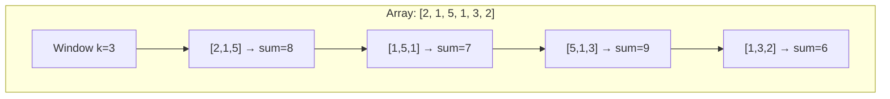

# Arrays & Strings

Arrays and strings account for roughly 30% of all interview questions. They are the simplest data structures — contiguous memory with indexed access — but the patterns built on top of them are subtle and powerful. If you master nothing else, master this.

## Array Fundamentals

An array stores elements in contiguous memory locations. This gives you:
- $O(1)$ access by index
- $O(n)$ insertion/deletion (elements must shift)
- $O(n)$ search (unsorted), $O(\log n)$ search (sorted)
- Excellent cache locality (elements are adjacent in memory)

::: tip Production Note
In most languages, the "array" you use daily is actually a **dynamic array** (JavaScript `Array`, Python `list`, Java `ArrayList`). These double in capacity when full, giving $O(1)$ amortized append but occasionally triggering $O(n)$ resizes. Know the difference — it comes up in system design discussions about memory allocation.
:::

## Pattern 1: Two Pointers

The two-pointer technique uses two indices that move through the array, typically from opposite ends or from the same starting point. It converts $O(n^2)$ brute-force solutions into $O(n)$ single-pass solutions.

### When to Use

- Sorted array problems (pair sum, triplet sum)
- Removing duplicates in-place
- Partitioning arrays
- Palindrome checking

### Classic Problem: Two Sum (Sorted Array)

Given a sorted array, find two numbers that add up to a target.

::: code-group

```typescript
function twoSumSorted(nums: number[], target: number): [number, number] {
  let left = 0;
  let right = nums.length - 1;

  while (left < right) {
    const sum = nums[left] + nums[right];
    if (sum === target) {
      return [left, right];
    } else if (sum < target) {
      left++;   // need a bigger sum → move left pointer right
    } else {
      right--;  // need a smaller sum → move right pointer left
    }
  }

  return [-1, -1]; // no solution found
}
```

```python
def two_sum_sorted(nums: list[int], target: int) -> tuple[int, int]:
    left, right = 0, len(nums) - 1

    while left < right:
        current_sum = nums[left] + nums[right]
        if current_sum == target:
            return (left, right)
        elif current_sum < target:
            left += 1  # need a bigger sum
        else:
            right -= 1  # need a smaller sum

    return (-1, -1)  # no solution found
```

:::

**Complexity:** $O(n)$ time, $O(1)$ space.

**Why it works:** Since the array is sorted, moving the left pointer increases the sum and moving the right pointer decreases it. We're guaranteed to find the pair if it exists because we never skip a valid combination.

### Classic Problem: Container With Most Water

Given heights, find two lines that form a container holding the most water.

::: code-group

```typescript
function maxArea(height: number[]): number {
  let left = 0;
  let right = height.length - 1;
  let maxWater = 0;

  while (left < right) {
    const width = right - left;
    const h = Math.min(height[left], height[right]);
    maxWater = Math.max(maxWater, width * h);

    // Move the pointer at the shorter line — moving the taller
    // line can never increase the area since width is shrinking
    if (height[left] < height[right]) {
      left++;
    } else {
      right--;
    }
  }

  return maxWater;
}
```

```python
def max_area(height: list[int]) -> int:
    left, right = 0, len(height) - 1
    max_water = 0

    while left < right:
        width = right - left
        h = min(height[left], height[right])
        max_water = max(max_water, width * h)

        if height[left] < height[right]:
            left += 1
        else:
            right -= 1

    return max_water
```

:::

**Complexity:** $O(n)$ time, $O(1)$ space.

### Three Sum Pattern

For problems requiring three elements (like 3Sum), fix one element and run two pointers on the rest:

::: code-group

```typescript
function threeSum(nums: number[]): number[][] {
  nums.sort((a, b) => a - b);
  const result: number[][] = [];

  for (let i = 0; i < nums.length - 2; i++) {
    if (i > 0 && nums[i] === nums[i - 1]) continue; // skip duplicates

    let left = i + 1;
    let right = nums.length - 1;

    while (left < right) {
      const sum = nums[i] + nums[left] + nums[right];
      if (sum === 0) {
        result.push([nums[i], nums[left], nums[right]]);
        while (left < right && nums[left] === nums[left + 1]) left++;
        while (left < right && nums[right] === nums[right - 1]) right--;
        left++;
        right--;
      } else if (sum < 0) {
        left++;
      } else {
        right--;
      }
    }
  }

  return result;
}
```

```python
def three_sum(nums: list[int]) -> list[list[int]]:
    nums.sort()
    result = []

    for i in range(len(nums) - 2):
        if i > 0 and nums[i] == nums[i - 1]:
            continue  # skip duplicates

        left, right = i + 1, len(nums) - 1

        while left < right:
            total = nums[i] + nums[left] + nums[right]
            if total == 0:
                result.append([nums[i], nums[left], nums[right]])
                while left < right and nums[left] == nums[left + 1]:
                    left += 1
                while left < right and nums[right] == nums[right - 1]:
                    right -= 1
                left += 1
                right -= 1
            elif total < 0:
                left += 1
            else:
                right -= 1

    return result
```

:::

**Complexity:** $O(n^2)$ time (sort + nested two-pointer), $O(1)$ extra space (ignoring output).

## Pattern 2: Sliding Window

The sliding window maintains a "window" of elements as it moves across the array. It is the go-to technique for subarray/substring problems.

### When to Use

- "Find the longest/shortest subarray with property X"
- "Find all subarrays/substrings matching a condition"
- Contiguous sequence problems with a constraint

### Fixed-Size Window



::: code-group

```typescript
function maxSumSubarray(nums: number[], k: number): number {
  let windowSum = 0;

  // Build the initial window
  for (let i = 0; i < k; i++) {
    windowSum += nums[i];
  }

  let maxSum = windowSum;

  // Slide the window: add the right element, remove the left
  for (let i = k; i < nums.length; i++) {
    windowSum += nums[i] - nums[i - k];
    maxSum = Math.max(maxSum, windowSum);
  }

  return maxSum;
}
```

```python
def max_sum_subarray(nums: list[int], k: int) -> int:
    window_sum = sum(nums[:k])
    max_sum = window_sum

    for i in range(k, len(nums)):
        window_sum += nums[i] - nums[i - k]
        max_sum = max(max_sum, window_sum)

    return max_sum
```

:::

**Complexity:** $O(n)$ time, $O(1)$ space.

### Variable-Size Window

For variable windows, expand the right boundary until a condition breaks, then shrink the left boundary until the condition is restored.

**Classic Problem: Longest Substring Without Repeating Characters**

::: code-group

```typescript
function lengthOfLongestSubstring(s: string): number {
  const charIndex = new Map<string, number>();
  let maxLen = 0;
  let left = 0;

  for (let right = 0; right < s.length; right++) {
    const char = s[right];

    // If character was seen and is within the current window, shrink
    if (charIndex.has(char) && charIndex.get(char)! >= left) {
      left = charIndex.get(char)! + 1;
    }

    charIndex.set(char, right);
    maxLen = Math.max(maxLen, right - left + 1);
  }

  return maxLen;
}
```

```python
def length_of_longest_substring(s: str) -> int:
    char_index: dict[str, int] = {}
    max_len = 0
    left = 0

    for right, char in enumerate(s):
        if char in char_index and char_index[char] >= left:
            left = char_index[char] + 1

        char_index[char] = right
        max_len = max(max_len, right - left + 1)

    return max_len
```

:::

**Complexity:** $O(n)$ time, $O(\min(n, |\Sigma|))$ space where $|\Sigma|$ is the alphabet size.

### Minimum Window Substring

This is the hardest sliding window pattern — find the minimum window in `s` that contains all characters in `t`.

::: code-group

```typescript
function minWindow(s: string, t: string): string {
  const need = new Map<string, number>();
  for (const c of t) need.set(c, (need.get(c) || 0) + 1);

  let have = 0;
  const required = need.size;
  const windowCounts = new Map<string, number>();
  let result = "";
  let resultLen = Infinity;
  let left = 0;

  for (let right = 0; right < s.length; right++) {
    const char = s[right];
    windowCounts.set(char, (windowCounts.get(char) || 0) + 1);

    if (need.has(char) && windowCounts.get(char) === need.get(char)) {
      have++;
    }

    while (have === required) {
      // Update result if this window is smaller
      if (right - left + 1 < resultLen) {
        resultLen = right - left + 1;
        result = s.slice(left, right + 1);
      }

      // Shrink window from the left
      const leftChar = s[left];
      windowCounts.set(leftChar, windowCounts.get(leftChar)! - 1);
      if (need.has(leftChar) && windowCounts.get(leftChar)! < need.get(leftChar)!) {
        have--;
      }
      left++;
    }
  }

  return result;
}
```

```python
from collections import Counter

def min_window(s: str, t: str) -> str:
    need = Counter(t)
    required = len(need)
    have = 0
    window_counts: dict[str, int] = {}
    result = ""
    result_len = float("inf")
    left = 0

    for right, char in enumerate(s):
        window_counts[char] = window_counts.get(char, 0) + 1

        if char in need and window_counts[char] == need[char]:
            have += 1

        while have == required:
            if right - left + 1 < result_len:
                result_len = right - left + 1
                result = s[left:right + 1]

            left_char = s[left]
            window_counts[left_char] -= 1
            if left_char in need and window_counts[left_char] < need[left_char]:
                have -= 1
            left += 1

    return result
```

:::

**Complexity:** $O(|s| + |t|)$ time, $O(|\Sigma|)$ space.

## Pattern 3: Prefix Sums

A prefix sum array stores cumulative sums, allowing you to compute the sum of any subarray in $O(1)$ time after $O(n)$ preprocessing.

$$
\text{prefix}[i] = \sum_{j=0}^{i-1} \text{nums}[j]
$$

$$
\text{sum}(l, r) = \text{prefix}[r+1] - \text{prefix}[l]
$$

::: code-group

```typescript
function buildPrefixSum(nums: number[]): number[] {
  const prefix = new Array(nums.length + 1).fill(0);
  for (let i = 0; i < nums.length; i++) {
    prefix[i + 1] = prefix[i] + nums[i];
  }
  return prefix;
}

function rangeSum(prefix: number[], left: number, right: number): number {
  return prefix[right + 1] - prefix[left];
}

// Subarray Sum Equals K — count subarrays summing to k
function subarraySum(nums: number[], k: number): number {
  const prefixCount = new Map<number, number>();
  prefixCount.set(0, 1);
  let sum = 0;
  let count = 0;

  for (const num of nums) {
    sum += num;
    if (prefixCount.has(sum - k)) {
      count += prefixCount.get(sum - k)!;
    }
    prefixCount.set(sum, (prefixCount.get(sum) || 0) + 1);
  }

  return count;
}
```

```python
def build_prefix_sum(nums: list[int]) -> list[int]:
    prefix = [0] * (len(nums) + 1)
    for i in range(len(nums)):
        prefix[i + 1] = prefix[i] + nums[i]
    return prefix

def range_sum(prefix: list[int], left: int, right: int) -> int:
    return prefix[right + 1] - prefix[left]

def subarray_sum(nums: list[int], k: int) -> int:
    """Count subarrays summing to k using prefix sum + hash map."""
    prefix_count = {0: 1}
    current_sum = 0
    count = 0

    for num in nums:
        current_sum += num
        if current_sum - k in prefix_count:
            count += prefix_count[current_sum - k]
        prefix_count[current_sum] = prefix_count.get(current_sum, 0) + 1

    return count
```

:::

**Complexity:** $O(n)$ preprocessing, $O(1)$ per range query. Subarray sum equals K: $O(n)$ time, $O(n)$ space.

::: warning
Prefix sums work for **sum** queries. For min/max range queries, you need a [Segment Tree or Sparse Table](/algorithms/trees#segment-trees).
:::

## String Manipulation Techniques

### String as Character Array

Most string problems reduce to array problems once you treat strings as arrays of characters. Key operations:

| Operation | TypeScript | Python |
|---|---|---|
| Iterate chars | `for (const c of s)` | `for c in s:` |
| Check if letter | `c >= 'a' && c <= 'z'` | `c.isalpha()` |
| Char → number | `s.charCodeAt(i) - 97` | `ord(c) - ord('a')` |
| Number → char | `String.fromCharCode(n + 97)` | `chr(n + ord('a'))` |
| Reverse | `s.split('').reverse().join('')` | `s[::-1]` |

### Palindrome Check

::: code-group

```typescript
function isPalindrome(s: string): boolean {
  let left = 0;
  let right = s.length - 1;

  while (left < right) {
    if (s[left] !== s[right]) return false;
    left++;
    right--;
  }

  return true;
}
```

```python
def is_palindrome(s: str) -> bool:
    left, right = 0, len(s) - 1
    while left < right:
        if s[left] != s[right]:
            return False
        left += 1
        right -= 1
    return True
```

:::

### Anagram Detection

Two strings are anagrams if they have the same character frequencies.

::: code-group

```typescript
function isAnagram(s: string, t: string): boolean {
  if (s.length !== t.length) return false;

  const count = new Array(26).fill(0);
  for (let i = 0; i < s.length; i++) {
    count[s.charCodeAt(i) - 97]++;
    count[t.charCodeAt(i) - 97]--;
  }

  return count.every(c => c === 0);
}
```

```python
from collections import Counter

def is_anagram(s: str, t: str) -> bool:
    return Counter(s) == Counter(t)
```

:::

### String Hashing (Rabin-Karp)

For substring matching, rolling hash gives $O(n)$ average time:

**Python:**

```python
def rabin_karp(text: str, pattern: str) -> int:
    """Find first occurrence of pattern in text using rolling hash."""
    if len(pattern) > len(text):
        return -1

    BASE = 31
    MOD = 10**9 + 7
    n, m = len(text), len(pattern)

    # Compute hash of pattern and first window
    pattern_hash = 0
    window_hash = 0
    power = 1

    for i in range(m):
        pattern_hash = (pattern_hash + ord(pattern[i]) * power) % MOD
        window_hash = (window_hash + ord(text[i]) * power) % MOD
        if i < m - 1:
            power = (power * BASE) % MOD

    if window_hash == pattern_hash and text[:m] == pattern:
        return 0

    for i in range(1, n - m + 1):
        # Remove leftmost char, add rightmost char
        window_hash = (window_hash - ord(text[i - 1])) % MOD
        window_hash = (window_hash * pow(BASE, MOD - 2, MOD)) % MOD
        window_hash = (window_hash + ord(text[i + m - 1]) * power) % MOD

        if window_hash == pattern_hash and text[i:i + m] == pattern:
            return i

    return -1
```

## Pattern Comparison Table

| Pattern | Best For | Time | Space | Key Insight |
|---|---|---|---|---|
| Two Pointers | Sorted arrays, pairs | $O(n)$ | $O(1)$ | Sorted order constrains movement |
| Sliding Window (fixed) | Fixed-size subarray stats | $O(n)$ | $O(1)$ | Add right, remove left |
| Sliding Window (variable) | Min/max subarray with constraint | $O(n)$ | $O(k)$ | Expand right, shrink left |
| Prefix Sum | Range sum queries | $O(n)$ build, $O(1)$ query | $O(n)$ | Precompute cumulative sums |
| Hash Map counting | Frequency, anagrams | $O(n)$ | $O(k)$ | Trade space for time |
| Sorting first | Grouping, deduplication | $O(n \log n)$ | $O(1)$ | Sorted order reveals structure |

## Common Edge Cases

::: danger Always Handle These
- **Empty array/string**: Return 0, empty string, or handle explicitly
- **Single element**: Often a valid answer by itself
- **All same elements**: Test deduplication logic
- **Negative numbers**: Two sum with negatives, prefix sums going negative
- **Integer overflow**: Sum of large numbers can overflow 32-bit integers
- **Unicode strings**: In production, "length" can be misleading with multi-byte characters
:::

## Practice Problems

| Problem | Pattern | Difficulty |
|---|---|---|
| Two Sum | Hash map | Easy |
| Best Time to Buy and Sell Stock | Single pass / Kadane's | Easy |
| Contains Duplicate | Hash set | Easy |
| Product of Array Except Self | Prefix/suffix product | Medium |
| Maximum Subarray (Kadane's) | Dynamic programming / sliding | Medium |
| 3Sum | Sort + two pointers | Medium |
| Longest Substring Without Repeating | Sliding window + hash | Medium |
| Minimum Window Substring | Sliding window + hash | Hard |
| Trapping Rain Water | Two pointers or stack | Hard |
| Longest Palindromic Substring | Expand from center / DP | Medium |

## Further Reading

- [Hash Tables](/algorithms/hash-tables) — the data structure powering most array/string patterns
- [Sorting & Searching](/algorithms/sorting-searching) — binary search on sorted arrays
- [Dynamic Programming](/algorithms/dynamic-programming) — when sliding window isn't enough
- [Trees: Tries](/algorithms/trees#tries) — for prefix-based string problems
