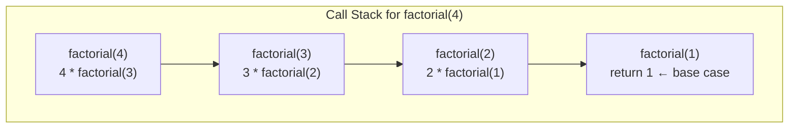
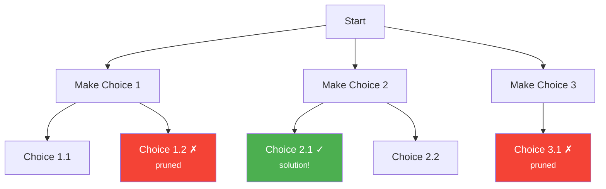
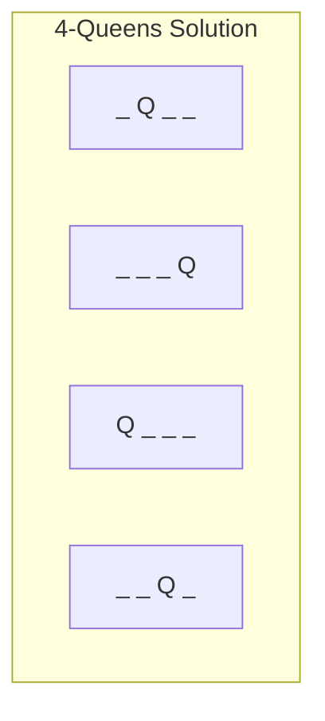

# Backtracking & Recursion

Recursion is a function calling itself with a smaller version of the same problem. Backtracking is recursion with a purpose: systematically explore all possible solutions by making a choice, recursing, then undoing the choice (backtracking) when it leads to a dead end. If dynamic programming is "recursion without redundancy," backtracking is "brute force with early termination." It is the right tool when you need to enumerate or find all valid configurations.

## Recursion Fundamentals

### The Call Stack

Every recursive call creates a new stack frame containing the function's local variables, parameters, and return address. The stack frames pile up until a base case is reached, then unwind as each call returns.



**TypeScript:**

```typescript
function factorial(n: number): number {
  if (n <= 1) return 1; // base case
  return n * factorial(n - 1); // recursive case
}
```

**Python:**

```python
def factorial(n: int) -> int:
    if n <= 1:
        return 1  # base case
    return n * factorial(n - 1)  # recursive case
```

### Anatomy of a Recursive Function

Every well-formed recursive function has:

1. **Base case(s)**: When to stop recursing. Without this, you get infinite recursion and a stack overflow.
2. **Recursive case(s)**: Break the problem into smaller subproblems and recurse.
3. **Progress toward base case**: Each recursive call must move closer to the base case.

::: danger
Stack overflow is the #1 risk of recursion. Python has a default recursion limit of 1000. TypeScript/JavaScript depends on the engine (typically ~10,000 frames). For deep recursion, convert to iteration or increase the limit.

```python
import sys
sys.setrecursionlimit(10000)  # use with caution
```
:::

### Recursion vs Iteration

Every recursive algorithm can be converted to an iterative one using an explicit stack. The choice between them is about clarity and constraints:

| Aspect | Recursion | Iteration |
|---|---|---|
| Readability | Often clearer for tree/graph problems | Clearer for simple loops |
| Memory | $O(d)$ stack frames where $d$ = depth | $O(1)$ or explicit stack |
| Stack overflow risk | Yes | No |
| Performance | Function call overhead | Slightly faster |
| Tail call optimization | Some languages (not JS/Python) | N/A |

## The Backtracking Template

Backtracking follows a consistent pattern. Memorize this template:

```
function backtrack(candidate, state):
    if is_solution(candidate):
        record(candidate)
        return

    for choice in get_choices(state):
        if is_valid(choice, state):
            make_choice(choice, state)        # choose
            backtrack(candidate, state)         # explore
            undo_choice(choice, state)          # unchoose (backtrack)
```



The key insight: backtracking explores a **decision tree**. Each node represents a partial solution. Pruning cuts off entire subtrees that cannot lead to valid solutions.

## Permutations

Generate all permutations of a set of distinct elements.

**TypeScript:**

```typescript
function permutations(nums: number[]): number[][] {
  const result: number[][] = [];

  function backtrack(path: number[], remaining: Set<number>): void {
    if (path.length === nums.length) {
      result.push([...path]);
      return;
    }

    for (const num of remaining) {
      path.push(num);
      remaining.delete(num);

      backtrack(path, remaining);

      path.pop();            // undo choice
      remaining.add(num);    // restore
    }
  }

  backtrack([], new Set(nums));
  return result;
}
```

**Python:**

```python
def permutations(nums: list[int]) -> list[list[int]]:
    result = []

    def backtrack(path: list[int], remaining: set[int]) -> None:
        if len(path) == len(nums):
            result.append(path[:])
            return

        for num in list(remaining):  # copy since we mutate
            path.append(num)
            remaining.remove(num)

            backtrack(path, remaining)

            path.pop()
            remaining.add(num)

    backtrack([], set(nums))
    return result
```

**Complexity:** $O(n! \cdot n)$ — there are $n!$ permutations and each takes $O(n)$ to copy.

### Permutations with Duplicates

Sort the input and skip duplicate choices at the same level of the decision tree.

**Python:**

```python
def permutations_unique(nums: list[int]) -> list[list[int]]:
    result = []
    nums.sort()
    used = [False] * len(nums)

    def backtrack(path: list[int]) -> None:
        if len(path) == len(nums):
            result.append(path[:])
            return

        for i in range(len(nums)):
            if used[i]:
                continue
            # Skip duplicates: only use the first unused occurrence
            if i > 0 and nums[i] == nums[i - 1] and not used[i - 1]:
                continue

            used[i] = True
            path.append(nums[i])

            backtrack(path)

            path.pop()
            used[i] = False

    backtrack([])
    return result
```

## Combinations

Choose $k$ elements from $n$ elements (order doesn't matter).

**TypeScript:**

```typescript
function combinations(n: number, k: number): number[][] {
  const result: number[][] = [];

  function backtrack(start: number, path: number[]): void {
    if (path.length === k) {
      result.push([...path]);
      return;
    }

    // Pruning: need (k - path.length) more elements,
    // so don't start too late
    for (let i = start; i <= n - (k - path.length) + 1; i++) {
      path.push(i);
      backtrack(i + 1, path); // i + 1 prevents reuse
      path.pop();
    }
  }

  backtrack(1, []);
  return result;
}
```

**Python:**

```python
def combinations(n: int, k: int) -> list[list[int]]:
    result = []

    def backtrack(start: int, path: list[int]) -> None:
        if len(path) == k:
            result.append(path[:])
            return

        # Pruning: need k - len(path) more elements
        for i in range(start, n - (k - len(path)) + 2):
            path.append(i)
            backtrack(i + 1, path)
            path.pop()

    backtrack(1, [])
    return result
```

**Complexity:** $O(\binom{n}{k} \cdot k)$ — there are $\binom{n}{k}$ combinations, each taking $O(k)$ to copy.

### Combination Sum

Find all combinations that sum to a target, with elements reusable.

**Python:**

```python
def combination_sum(candidates: list[int], target: int) -> list[list[int]]:
    result = []
    candidates.sort()

    def backtrack(start: int, path: list[int], remaining: int) -> None:
        if remaining == 0:
            result.append(path[:])
            return

        for i in range(start, len(candidates)):
            if candidates[i] > remaining:
                break  # pruning: sorted, so all subsequent are too large

            path.append(candidates[i])
            backtrack(i, path, remaining - candidates[i])  # i, not i+1 (reuse allowed)
            path.pop()

    backtrack(0, [], target)
    return result
```

### Subsets

Generate all subsets (power set). Each element is either included or excluded.

**TypeScript:**

```typescript
function subsets(nums: number[]): number[][] {
  const result: number[][] = [];

  function backtrack(index: number, path: number[]): void {
    result.push([...path]); // every path is a valid subset

    for (let i = index; i < nums.length; i++) {
      path.push(nums[i]);
      backtrack(i + 1, path);
      path.pop();
    }
  }

  backtrack(0, []);
  return result;
}
```

**Python:**

```python
def subsets(nums: list[int]) -> list[list[int]]:
    result = []

    def backtrack(index: int, path: list[int]) -> None:
        result.append(path[:])

        for i in range(index, len(nums)):
            path.append(nums[i])
            backtrack(i + 1, path)
            path.pop()

    backtrack(0, [])
    return result
```

**Complexity:** $O(2^n \cdot n)$ — there are $2^n$ subsets, each taking $O(n)$ to copy.

## N-Queens

Place $N$ queens on an $N \times N$ chessboard such that no two queens attack each other (same row, column, or diagonal).



**TypeScript:**

```typescript
function solveNQueens(n: number): string[][] {
  const results: string[][] = [];
  const cols = new Set<number>();
  const diag1 = new Set<number>(); // row - col
  const diag2 = new Set<number>(); // row + col
  const board: string[][] = Array.from({ length: n }, () =>
    new Array(n).fill('.')
  );

  function backtrack(row: number): void {
    if (row === n) {
      results.push(board.map(r => r.join('')));
      return;
    }

    for (let col = 0; col < n; col++) {
      if (cols.has(col) || diag1.has(row - col) || diag2.has(row + col)) {
        continue; // pruning: position is under attack
      }

      // Place queen
      board[row][col] = 'Q';
      cols.add(col);
      diag1.add(row - col);
      diag2.add(row + col);

      backtrack(row + 1);

      // Remove queen (backtrack)
      board[row][col] = '.';
      cols.delete(col);
      diag1.delete(row - col);
      diag2.delete(row + col);
    }
  }

  backtrack(0);
  return results;
}
```

**Python:**

```python
def solve_n_queens(n: int) -> list[list[str]]:
    results = []
    cols = set()
    diag1 = set()  # row - col
    diag2 = set()  # row + col
    board = [['.' ] * n for _ in range(n)]

    def backtrack(row: int) -> None:
        if row == n:
            results.append([''.join(r) for r in board])
            return

        for col in range(n):
            if col in cols or (row - col) in diag1 or (row + col) in diag2:
                continue

            board[row][col] = 'Q'
            cols.add(col)
            diag1.add(row - col)
            diag2.add(row + col)

            backtrack(row + 1)

            board[row][col] = '.'
            cols.remove(col)
            diag1.remove(row - col)
            diag2.remove(row + col)

    backtrack(0)
    return results
```

**Key insight:** The diagonal constraint is elegant — cells on the same diagonal share the same `row - col` value (one diagonal direction) or `row + col` value (the other direction). Using sets for columns and both diagonals gives $O(1)$ conflict checking.

## Sudoku Solver

Fill a 9x9 grid so each row, column, and 3x3 box contains digits 1-9 exactly once.

**Python:**

```python
def solve_sudoku(board: list[list[str]]) -> bool:
    rows = [set() for _ in range(9)]
    cols = [set() for _ in range(9)]
    boxes = [set() for _ in range(9)]

    # Initialize constraints from existing numbers
    for r in range(9):
        for c in range(9):
            if board[r][c] != '.':
                num = board[r][c]
                rows[r].add(num)
                cols[c].add(num)
                boxes[(r // 3) * 3 + c // 3].add(num)

    def backtrack(r: int, c: int) -> bool:
        if r == 9:
            return True  # all cells filled
        next_r, next_c = (r, c + 1) if c < 8 else (r + 1, 0)

        if board[r][c] != '.':
            return backtrack(next_r, next_c)

        box_idx = (r // 3) * 3 + c // 3
        for num in '123456789':
            if num in rows[r] or num in cols[c] or num in boxes[box_idx]:
                continue

            board[r][c] = num
            rows[r].add(num)
            cols[c].add(num)
            boxes[box_idx].add(num)

            if backtrack(next_r, next_c):
                return True

            board[r][c] = '.'
            rows[r].remove(num)
            cols[c].remove(num)
            boxes[box_idx].remove(num)

        return False  # no valid number for this cell

    backtrack(0, 0)
    return True
```

**TypeScript:**

```typescript
function solveSudoku(board: string[][]): void {
  const rows: Set<string>[] = Array.from({ length: 9 }, () => new Set());
  const cols: Set<string>[] = Array.from({ length: 9 }, () => new Set());
  const boxes: Set<string>[] = Array.from({ length: 9 }, () => new Set());

  for (let r = 0; r < 9; r++) {
    for (let c = 0; c < 9; c++) {
      if (board[r][c] !== '.') {
        const num = board[r][c];
        rows[r].add(num);
        cols[c].add(num);
        boxes[Math.floor(r / 3) * 3 + Math.floor(c / 3)].add(num);
      }
    }
  }

  function backtrack(r: number, c: number): boolean {
    if (r === 9) return true;
    const [nr, nc] = c < 8 ? [r, c + 1] : [r + 1, 0];

    if (board[r][c] !== '.') return backtrack(nr, nc);

    const boxIdx = Math.floor(r / 3) * 3 + Math.floor(c / 3);

    for (let num = 1; num <= 9; num++) {
      const s = String(num);
      if (rows[r].has(s) || cols[c].has(s) || boxes[boxIdx].has(s)) continue;

      board[r][c] = s;
      rows[r].add(s);
      cols[c].add(s);
      boxes[boxIdx].add(s);

      if (backtrack(nr, nc)) return true;

      board[r][c] = '.';
      rows[r].delete(s);
      cols[c].delete(s);
      boxes[boxIdx].delete(s);
    }

    return false;
  }

  backtrack(0, 0);
}
```

## Pruning Strategies

Pruning is what makes backtracking practical. Without pruning, backtracking degenerates into brute-force enumeration.

### Types of Pruning

| Strategy | Technique | Example |
|---|---|---|
| **Constraint propagation** | Check constraints before recursing | N-Queens: skip attacked positions |
| **Bound pruning** | Compare current best with theoretical best of branch | Branch and bound optimization |
| **Symmetry breaking** | Avoid exploring symmetric configurations | Fix first queen to top half in N-Queens |
| **Value ordering** | Try most constrained choices first | Sudoku: fill cell with fewest candidates first |
| **Feasibility check** | Verify partial solution can still lead to a complete one | Combination sum: stop if remaining < 0 |

### Pruning Example: Combination Sum with Sorting

```python
def combination_sum_pruned(candidates: list[int], target: int) -> list[list[int]]:
    result = []
    candidates.sort()  # sort to enable pruning

    def backtrack(start: int, path: list[int], remaining: int) -> None:
        if remaining == 0:
            result.append(path[:])
            return

        for i in range(start, len(candidates)):
            # PRUNING: since array is sorted, all remaining candidates
            # are >= candidates[i], so if this one exceeds the target,
            # we can skip all of them
            if candidates[i] > remaining:
                break

            path.append(candidates[i])
            backtrack(i, path, remaining - candidates[i])
            path.pop()

    backtrack(0, [], target)
    return result
```

### Most Constrained Variable (MCV)

For constraint satisfaction problems, choosing the most constrained variable first (the cell with fewest valid options in Sudoku, the most attacked row in N-Queens) dramatically reduces the search space.

## Word Search

A classic backtracking problem: find if a word exists in a 2D grid by moving horizontally or vertically to adjacent cells.

**Python:**

```python
def word_search(board: list[list[str]], word: str) -> bool:
    rows, cols = len(board), len(board[0])

    def backtrack(r: int, c: int, idx: int) -> bool:
        if idx == len(word):
            return True

        if (r < 0 or r >= rows or c < 0 or c >= cols or
                board[r][c] != word[idx]):
            return False

        # Mark as visited
        temp = board[r][c]
        board[r][c] = '#'

        found = (backtrack(r + 1, c, idx + 1) or
                 backtrack(r - 1, c, idx + 1) or
                 backtrack(r, c + 1, idx + 1) or
                 backtrack(r, c - 1, idx + 1))

        # Restore (backtrack)
        board[r][c] = temp
        return found

    for r in range(rows):
        for c in range(cols):
            if backtrack(r, c, 0):
                return True

    return False
```

## Backtracking vs Other Techniques

| Approach | When to Use | Time |
|---|---|---|
| **Backtracking** | Need ALL solutions or a specific valid configuration | Exponential (but pruning helps) |
| **Dynamic Programming** | Optimal value (not all solutions), overlapping subproblems | Polynomial (usually) |
| **Greedy** | Local optimal leads to global optimal | Polynomial |
| **BFS/DFS** | Graph traversal, shortest path | $O(V + E)$ |

::: tip
If a problem asks "find the minimum/maximum" or "how many ways" — think [DP](/algorithms/dynamic-programming) first. If it asks "generate all" or "find a valid assignment" — think backtracking.
:::

## Common Complexity Analysis

| Problem | Solutions | Time |
|---|---|---|
| Permutations of $n$ elements | $n!$ | $O(n! \cdot n)$ |
| Combinations $\binom{n}{k}$ | $\binom{n}{k}$ | $O(\binom{n}{k} \cdot k)$ |
| Subsets of $n$ elements | $2^n$ | $O(2^n \cdot n)$ |
| N-Queens | Variable (exponential) | $O(n!)$ upper bound |
| Sudoku (9x9) | 1 (unique) | $O(9^{81})$ worst, much less with pruning |

## Practice Problems

| Problem | Pattern | Difficulty |
|---|---|---|
| Subsets | Subset generation | Medium |
| Permutations | Permutation generation | Medium |
| Combinations | Combination generation | Medium |
| Combination Sum | Combination + pruning | Medium |
| Letter Combinations of Phone Number | Multi-way branching | Medium |
| Palindrome Partitioning | String partition + palindrome check | Medium |
| Generate Parentheses | Constraint: open >= close | Medium |
| Word Search | Grid backtracking | Medium |
| N-Queens | Constraint satisfaction | Hard |
| Sudoku Solver | Constraint satisfaction | Hard |
| Word Search II | Trie + backtracking | Hard |
| Expression Add Operators | String partition + evaluation | Hard |

## Further Reading

- [Dynamic Programming](/algorithms/dynamic-programming) — when backtracking has overlapping subproblems, add memoization
- [Trees](/algorithms/trees) — tree traversals are recursion in action
- [Graphs](/algorithms/graphs) — DFS is backtracking on graphs
- [Arrays & Strings](/algorithms/arrays-strings) — many string problems use backtracking for generation

## Try It Yourself

**Problem 1:** Generate all permutations of `[1, 2, 3]`.

::: details Solution
Using the backtracking template (choose, explore, unchoose):
- Start with path=[], remaining={1,2,3}
- Choose 1: path=[1], remaining={2,3}
  - Choose 2: path=[1,2], remaining={3} → [1,2,3]
  - Choose 3: path=[1,3], remaining={2} → [1,3,2]
- Choose 2: path=[2], remaining={1,3}
  - Choose 1: [2,1,3]
  - Choose 3: [2,3,1]
- Choose 3: path=[3], remaining={1,2}
  - Choose 1: [3,1,2]
  - Choose 2: [3,2,1]
Answer: **[[1,2,3], [1,3,2], [2,1,3], [2,3,1], [3,1,2], [3,2,1]]** (6 permutations = 3!)
:::

**Problem 2:** Generate all subsets of `[1, 2, 3]`.

::: details Solution
At each element, decide to include or exclude:
- [], [1], [2], [3], [1,2], [1,3], [2,3], [1,2,3]
Using the iterative backtracking approach:
- Start: index=0, path=[] → record []
- Add 1: path=[1] → record [1]. Add 2: [1,2] → record. Add 3: [1,2,3] → record. Pop 3. Pop 2.
- Add 3: [1,3] → record. Pop 3. Pop 1.
- Add 2: [2] → record. Add 3: [2,3] → record. Pop 3. Pop 2.
- Add 3: [3] → record. Pop 3.
Answer: **[[], [1], [1,2], [1,2,3], [1,3], [2], [2,3], [3]]** (8 subsets = $2^3$)
:::

**Problem 3:** Solve the 4-Queens problem: place 4 queens on a 4x4 board so no two attack each other.

::: details Solution
Place queens row by row, tracking occupied columns and diagonals:
- Row 0: try col 0 → blocked later. Try col 1 → works.
- Row 1: try col 3 → works (col 3 free, diags 1-3=-2 and 1+3=4 free).
- Row 2: try col 0 → works (col 0 free, diags 2-0=2 and 2+0=2 free).
- Row 3: try col 2 → works (col 2 free, diags 3-2=1 and 3+2=5 free).
Solution:
```
. Q . .
. . . Q
Q . . .
. . Q .
```
There are **2 solutions** for 4-Queens.
:::

**Problem 4:** Find all combinations of `[2, 3, 6, 7]` that sum to `7` (elements can be reused).

::: details Solution
Using backtracking with pruning (sort first: [2, 3, 6, 7]):
- Start with 2: remaining=5. Pick 2 again: remaining=3. Pick 2: remaining=1. Pick 2: remaining=-1 → prune. Pick 3: remaining=-2 → prune. Backtrack.
- Path [2,2]: remaining=3. Pick 3: remaining=0 → **[2,2,3]** found.
- Path [2]: remaining=5. Pick 3: remaining=2. Pick 3: remaining=-1 → prune. Backtrack.
- Path [3]: remaining=4. Pick 3: remaining=1. No valid picks → prune. Backtrack.
- Path [7]: remaining=0 → **[7]** found.
Answer: **[[2,2,3], [7]]**
:::

**Problem 5:** Use backtracking to check if the word `"ABCCED"` exists in the grid:
```
A B C E
S F C S
A D E E
```

::: details Solution
Start from each cell matching 'A':
- Cell (0,0)='A' → (0,1)='B' → (1,1)='F'? No. → (0,0) not adjacent to 'B' except (0,1). Try (0,1)='B' → (0,2)='C' → (1,2)='C' → (2,2)='E' → (2,1)='D' → found!
Path: (0,0)A → (0,1)B → (0,2)C → (1,2)C → (2,2)E → (2,1)D
Answer: **true** -- the word exists in the grid.
:::

## Quick Quiz

**1. What is the time complexity of generating all subsets of a set with $n$ elements?**
- a) $O(n!)$
- b) $O(n^2)$
- c) $O(2^n \cdot n)$
- d) $O(n \log n)$

::: details Answer
**c) $O(2^n \cdot n)$** — There are $2^n$ subsets, and each takes $O(n)$ to copy into the result list.
:::

**2. What is the key difference between backtracking and brute force?**
- a) Backtracking is always faster
- b) Backtracking prunes branches that cannot lead to valid solutions, avoiding unnecessary exploration
- c) Brute force cannot solve constraint satisfaction problems
- d) Backtracking uses more memory

::: details Answer
**b) Backtracking prunes branches that cannot lead to valid solutions, avoiding unnecessary exploration** — Backtracking is brute force with early termination. When a partial solution violates constraints, the entire subtree is skipped.
:::

**3. In the N-Queens problem, how do you check diagonal conflicts in $O(1)$?**
- a) Check all previously placed queens
- b) Use sets tracking `row - col` and `row + col` values
- c) Use a 2D boolean array for the board
- d) Compare absolute differences of coordinates

::: details Answer
**b) Use sets tracking `row - col` and `row + col` values** — All cells on the same diagonal share the same `row - col` value (for one diagonal direction) or `row + col` value (for the other). Storing these in sets gives $O(1)$ conflict checking.
:::

**4. When should you use backtracking instead of dynamic programming?**
- a) When you need the optimal value only
- b) When you need to generate all valid solutions or find a specific valid configuration
- c) When the problem has overlapping subproblems
- d) When the input size is very large

::: details Answer
**b) When you need to generate all valid solutions or find a specific valid configuration** — DP finds optimal values efficiently but does not enumerate all solutions. Backtracking systematically explores all possibilities and is the right tool when you need to list or count all valid configurations.
:::

**5. Why is sorting the input often the first step in backtracking problems?**
- a) It makes the recursion faster
- b) It enables pruning (skip remaining candidates when current exceeds target) and duplicate avoidance
- c) It reduces memory usage
- d) It is required by the backtracking template

::: details Answer
**b) It enables pruning (skip remaining candidates when current exceeds target) and duplicate avoidance** — With sorted input, once a candidate exceeds the remaining budget you can `break` (all subsequent candidates are larger). Sorting also groups duplicates together, making it easy to skip duplicate branches.
:::
