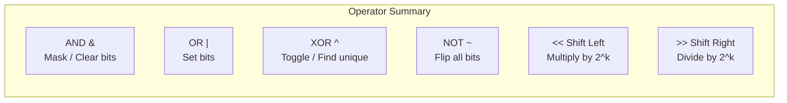
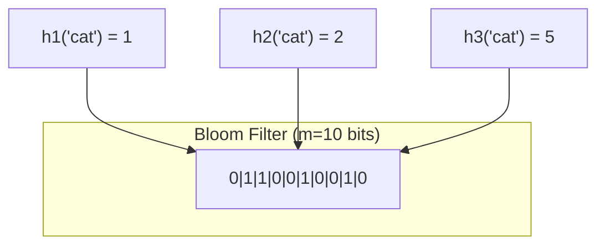

# Bit Manipulation

Bit manipulation is the art of operating directly on binary representations of numbers. These techniques unlock constant-time solutions to problems that would otherwise require extra space or multiple passes. In interviews, bit manipulation questions test your understanding of how numbers are stored at the machine level. In production, bitwise operations power bloom filters, feature flags, permission systems, and high-performance networking code.

## Binary Number Fundamentals

Every integer is stored as a sequence of bits. In a 32-bit system:

$$
42_{10} = 00000000\;00000000\;00000000\;00101010_2
$$

The rightmost bit is the **least significant bit (LSB)**, the leftmost is the **most significant bit (MSB)**.

| Decimal | Binary (8-bit) | Hex |
|---------|----------------|-----|
| 0 | `00000000` | `0x00` |
| 1 | `00000001` | `0x01` |
| 5 | `00000101` | `0x05` |
| 10 | `00001010` | `0x0A` |
| 255 | `11111111` | `0xFF` |

## Bitwise Operators

### AND (`&`)

Returns 1 only if both bits are 1. Used for masking and clearing bits.

$$
1010 \;\&\; 1100 = 1000
$$

### OR (`|`)

Returns 1 if either bit is 1. Used for setting bits.

$$
1010 \;|\; 1100 = 1110
$$

### XOR (`^`)

Returns 1 if the bits differ. Used for toggling and finding unique elements.

$$
1010 \;\hat{}\; 1100 = 0110
$$

Key XOR properties:
- $a \oplus a = 0$ (self-cancellation)
- $a \oplus 0 = a$ (identity)
- $a \oplus b = b \oplus a$ (commutative)
- $(a \oplus b) \oplus c = a \oplus (b \oplus c)$ (associative)

### NOT (`~`)

Flips all bits. In two's complement: $\sim n = -(n + 1)$.

$$
\sim\;00001010 = 11110101
$$

### Left Shift (`<<`)

Shifts bits left, filling with zeros. Equivalent to multiplying by $2^k$.

$$
n \ll k = n \times 2^k
$$

### Right Shift (`>>`)

Shifts bits right. Arithmetic right shift preserves the sign bit. Equivalent to integer division by $2^k$.

$$
n \gg k = \lfloor n / 2^k \rfloor
$$



## Common Tricks

### 1. Check if Power of 2

A power of 2 has exactly one set bit: $1000...0$. Subtracting 1 flips all bits below: $0111...1$. AND them together and you get zero.

$$
n \;\&\; (n - 1) = 0 \iff n \text{ is a power of 2 (and } n > 0\text{)}
$$

**TypeScript:**

```typescript
function isPowerOfTwo(n: number): boolean {
  return n > 0 && (n & (n - 1)) === 0;
}
```

**Python:**

```python
def is_power_of_two(n: int) -> bool:
    return n > 0 and (n & (n - 1)) == 0
```

### 2. Count Set Bits (Popcount)

**Brian Kernighan's algorithm:** $n \;\&\; (n-1)$ clears the lowest set bit. Count how many times you can do this before reaching zero.

**TypeScript:**

```typescript
function countSetBits(n: number): number {
  let count = 0;
  while (n > 0) {
    n &= n - 1; // clear lowest set bit
    count++;
  }
  return count;
}
```

**Python:**

```python
def count_set_bits(n: int) -> int:
    count = 0
    while n:
        n &= n - 1  # clear lowest set bit
        count += 1
    return count

# Python built-in alternative
bin(42).count('1')  # 3
```

::: tip
Python's `bin(n).count('1')` is concise but creates a string. For competitive programming, `n.bit_count()` (Python 3.10+) is both fast and clean.
:::

### 3. Swap Without Temporary Variable

XOR swap exploits the self-cancellation property:

**TypeScript:**

```typescript
function xorSwap(a: number, b: number): [number, number] {
  a ^= b; // a now holds a XOR b
  b ^= a; // b now holds original a
  a ^= b; // a now holds original b
  return [a, b];
}
```

**Python:**

```python
def xor_swap(a: int, b: int) -> tuple[int, int]:
    a ^= b
    b ^= a
    a ^= b
    return a, b

# Python makes this unnecessary: a, b = b, a
```

::: warning
XOR swap fails when `a` and `b` refer to the same memory location (both become 0). In practice, use standard swaps — XOR swap is an interview trick, not production code.
:::

### 4. Get / Set / Clear / Toggle a Specific Bit

**TypeScript:**

```typescript
// Get the i-th bit (0-indexed from right)
function getBit(n: number, i: number): number {
  return (n >> i) & 1;
}

// Set the i-th bit to 1
function setBit(n: number, i: number): number {
  return n | (1 << i);
}

// Clear the i-th bit to 0
function clearBit(n: number, i: number): number {
  return n & ~(1 << i);
}

// Toggle the i-th bit
function toggleBit(n: number, i: number): number {
  return n ^ (1 << i);
}
```

**Python:**

```python
def get_bit(n: int, i: int) -> int:
    return (n >> i) & 1

def set_bit(n: int, i: int) -> int:
    return n | (1 << i)

def clear_bit(n: int, i: int) -> int:
    return n & ~(1 << i)

def toggle_bit(n: int, i: int) -> int:
    return n ^ (1 << i)
```

### 5. Isolate the Lowest Set Bit

$$
\text{lowest} = n \;\&\; (-n)
$$

This works because $-n$ in two's complement is $\sim n + 1$, which flips all bits and adds 1.

### 6. Check if Even or Odd

$$
n \;\&\; 1 = \begin{cases} 0 & \text{if } n \text{ is even} \\ 1 & \text{if } n \text{ is odd} \end{cases}
$$

## Single Number (XOR Trick)

**Problem:** Given an array where every element appears twice except one, find that single element.

Since $a \oplus a = 0$ and $a \oplus 0 = a$, XORing all elements cancels out duplicates:

$$
a_1 \oplus a_1 \oplus a_2 \oplus a_2 \oplus \ldots \oplus a_k = a_k
$$

**TypeScript:**

```typescript
function singleNumber(nums: number[]): number {
  return nums.reduce((xor, num) => xor ^ num, 0);
}

// Example: [4, 1, 2, 1, 2] → 4^1^2^1^2 = 4
```

**Python:**

```python
from functools import reduce
from operator import xor

def single_number(nums: list[int]) -> int:
    return reduce(xor, nums)

# Or simply:
def single_number_loop(nums: list[int]) -> int:
    result = 0
    for num in nums:
        result ^= num
    return result
```

| Metric | Value |
|--------|-------|
| Time | $O(n)$ — single pass |
| Space | $O(1)$ — no extra storage |

### Two Single Numbers

**Problem:** Every element appears twice except two elements. Find both.

**Strategy:** XOR all elements to get $x \oplus y$. Find any set bit in the result (it distinguishes $x$ from $y$). Partition elements by that bit and XOR each group separately.

**TypeScript:**

```typescript
function twoSingleNumbers(nums: number[]): [number, number] {
  // XOR of all gives xorAll = x ^ y
  let xorAll = 0;
  for (const num of nums) xorAll ^= num;

  // Find rightmost set bit (where x and y differ)
  const diffBit = xorAll & -xorAll;

  let x = 0, y = 0;
  for (const num of nums) {
    if (num & diffBit) {
      x ^= num;
    } else {
      y ^= num;
    }
  }

  return [x, y];
}
```

**Python:**

```python
def two_single_numbers(nums: list[int]) -> tuple[int, int]:
    xor_all = 0
    for num in nums:
        xor_all ^= num

    diff_bit = xor_all & -xor_all

    x, y = 0, 0
    for num in nums:
        if num & diff_bit:
            x ^= num
        else:
            y ^= num

    return x, y
```

## Bitmask DP

Bitmasks represent subsets of a set using binary numbers. If you have $n$ elements, a bitmask of $n$ bits can represent any subset. Bit $i$ is 1 if element $i$ is in the subset.

$$
\text{Subset } \{0, 2, 3\} \text{ of } \{0,1,2,3\} \rightarrow 1101_2 = 13_{10}
$$

### Subset Iteration

**TypeScript:**

```typescript
function allSubsets(n: number): number[][] {
  const subsets: number[][] = [];

  for (let mask = 0; mask < (1 << n); mask++) {
    const subset: number[] = [];
    for (let i = 0; i < n; i++) {
      if (mask & (1 << i)) {
        subset.push(i);
      }
    }
    subsets.push(subset);
  }

  return subsets;
}
```

**Python:**

```python
def all_subsets(n: int) -> list[list[int]]:
    subsets = []
    for mask in range(1 << n):
        subset = [i for i in range(n) if mask & (1 << i)]
        subsets.append(subset)
    return subsets
```

### Traveling Salesman with Bitmask DP

The classic bitmask DP problem. Visit all $n$ cities exactly once with minimum cost. State: `(current_city, visited_set)`.

$$
\text{dp}[\text{mask}][i] = \min_{j \in \text{mask},\; j \neq i} \bigl(\text{dp}[\text{mask} \setminus \{i\}][j] + \text{dist}[j][i]\bigr)
$$

**TypeScript:**

```typescript
function tsp(dist: number[][]): number {
  const n = dist.length;
  const ALL = (1 << n) - 1;
  const INF = Infinity;

  // dp[mask][i] = min cost to visit cities in mask, ending at i
  const dp: number[][] = Array.from(
    { length: 1 << n },
    () => new Array(n).fill(INF)
  );

  dp[1][0] = 0; // start at city 0

  for (let mask = 1; mask <= ALL; mask++) {
    for (let u = 0; u < n; u++) {
      if (dp[mask][u] === INF) continue;
      if (!(mask & (1 << u))) continue;

      for (let v = 0; v < n; v++) {
        if (mask & (1 << v)) continue; // already visited
        const nextMask = mask | (1 << v);
        dp[nextMask][v] = Math.min(
          dp[nextMask][v],
          dp[mask][u] + dist[u][v]
        );
      }
    }
  }

  // Return to start
  let result = INF;
  for (let u = 1; u < n; u++) {
    result = Math.min(result, dp[ALL][u] + dist[u][0]);
  }

  return result;
}
```

**Python:**

```python
def tsp(dist: list[list[int]]) -> int:
    n = len(dist)
    ALL = (1 << n) - 1
    INF = float('inf')

    # dp[mask][i] = min cost visiting cities in mask, ending at i
    dp = [[INF] * n for _ in range(1 << n)]
    dp[1][0] = 0  # start at city 0

    for mask in range(1, ALL + 1):
        for u in range(n):
            if dp[mask][u] == INF:
                continue
            if not (mask & (1 << u)):
                continue

            for v in range(n):
                if mask & (1 << v):
                    continue
                next_mask = mask | (1 << v)
                dp[next_mask][v] = min(
                    dp[next_mask][v],
                    dp[mask][u] + dist[u][v]
                )

    return min(dp[ALL][u] + dist[u][0] for u in range(1, n))
```

**Complexity:** $O(2^n \cdot n^2)$ time, $O(2^n \cdot n)$ space. Feasible for $n \leq 20$.

::: warning
Bitmask DP is exponential by nature. It is only practical for small $n$ (typically $n \leq 20$). For larger problems, use approximation algorithms or heuristics.
:::

## Bit Manipulation in System Design

### Bloom Filters

A bloom filter uses $k$ hash functions that each set a bit in a bit array of size $m$. To check membership, verify all $k$ bits are set. False positives are possible; false negatives are not.



The false positive probability for $n$ inserted elements:

$$
P(\text{false positive}) \approx \left(1 - e^{-kn/m}\right)^k
$$

Optimal number of hash functions:

$$
k^* = \frac{m}{n} \ln 2
$$

**TypeScript:**

```typescript
class BloomFilter {
  private bits: Uint8Array;
  private size: number;
  private hashCount: number;

  constructor(size: number, hashCount: number) {
    this.size = size;
    this.hashCount = hashCount;
    this.bits = new Uint8Array(Math.ceil(size / 8));
  }

  private hash(value: string, seed: number): number {
    let h = seed;
    for (let i = 0; i < value.length; i++) {
      h = (h * 31 + value.charCodeAt(i)) & 0x7fffffff;
    }
    return h % this.size;
  }

  add(value: string): void {
    for (let i = 0; i < this.hashCount; i++) {
      const idx = this.hash(value, i + 1);
      this.bits[idx >> 3] |= 1 << (idx & 7);
    }
  }

  mightContain(value: string): boolean {
    for (let i = 0; i < this.hashCount; i++) {
      const idx = this.hash(value, i + 1);
      if (!(this.bits[idx >> 3] & (1 << (idx & 7)))) {
        return false; // definitely not present
      }
    }
    return true; // possibly present
  }
}
```

### Feature Flags with Bitmasks

Use individual bits to represent feature toggles. A single 32-bit integer can store 32 boolean flags.

**TypeScript:**

```typescript
enum Feature {
  DARK_MODE    = 1 << 0,  // 1
  BETA_UI      = 1 << 1,  // 2
  NEW_CHECKOUT = 1 << 2,  // 4
  AI_SEARCH    = 1 << 3,  // 8
}

class FeatureFlags {
  private flags: number;

  constructor(flags = 0) {
    this.flags = flags;
  }

  enable(feature: Feature): void {
    this.flags |= feature;
  }

  disable(feature: Feature): void {
    this.flags &= ~feature;
  }

  isEnabled(feature: Feature): boolean {
    return (this.flags & feature) !== 0;
  }

  toggle(feature: Feature): void {
    this.flags ^= feature;
  }
}
```

**Python:**

```python
from enum import IntFlag

class Feature(IntFlag):
    DARK_MODE    = 1 << 0
    BETA_UI      = 1 << 1
    NEW_CHECKOUT = 1 << 2
    AI_SEARCH    = 1 << 3

class FeatureFlags:
    def __init__(self, flags: int = 0):
        self.flags = flags

    def enable(self, feature: Feature) -> None:
        self.flags |= feature

    def disable(self, feature: Feature) -> None:
        self.flags &= ~feature

    def is_enabled(self, feature: Feature) -> bool:
        return bool(self.flags & feature)

    def toggle(self, feature: Feature) -> None:
        self.flags ^= feature
```

### Unix File Permissions

The classic real-world bit manipulation example: `rwxr-xr--` = `111 101 100` = `0754`.

$$
\text{permission} = (\text{read} \ll 2) \;|\; (\text{write} \ll 1) \;|\; \text{execute}
$$

## Cheat Sheet

| Trick | Expression | Purpose |
|-------|-----------|---------|
| Check if even | `n & 1 == 0` | Faster than `n % 2` |
| Check power of 2 | `n & (n-1) == 0` | Single set bit |
| Get lowest set bit | `n & (-n)` | Isolate rightmost 1 |
| Clear lowest set bit | `n & (n-1)` | Used in popcount |
| Set bit $i$ | `n | (1 << i)` | Turn on bit |
| Clear bit $i$ | `n & ~(1 << i)` | Turn off bit |
| Toggle bit $i$ | `n ^ (1 << i)` | Flip bit |
| Check bit $i$ | `(n >> i) & 1` | Read bit |
| All 1s (n bits) | `(1 << n) - 1` | Mask creation |
| Swap | `a ^= b; b ^= a; a ^= b` | No temp variable |

## Practice Problems

| Problem | Technique | Difficulty |
|---------|-----------|------------|
| Single Number | XOR all elements | Easy |
| Number of 1 Bits | Brian Kernighan's | Easy |
| Power of Two | `n & (n-1)` | Easy |
| Reverse Bits | Bit-by-bit extraction | Easy |
| Missing Number | XOR with indices | Easy |
| Single Number II (appears 3x) | Bit counting per position | Medium |
| Subsets | Bitmask enumeration | Medium |
| Counting Bits (0 to n) | DP with `i & (i-1)` | Medium |
| Maximum XOR of Two Numbers | Trie + greedy | Medium |
| Minimum Number of Flips | XOR + popcount | Medium |

## Further Reading

- [Dynamic Programming](/algorithms/dynamic-programming) — bitmask DP builds on DP fundamentals
- [Greedy Algorithms](/algorithms/greedy) — some bit tricks enable greedy approaches
- [Hash Tables](/algorithms/hash-tables) — hashing and bloom filters share bit-level mechanics
- [Advanced Data Structures](/algorithms/advanced-data-structures) — Fenwick trees use `n & (-n)` for index arithmetic
- [Math Patterns in System Design](/algorithms/system-design-math) — powers of 2, capacity estimation

## Try It Yourself

**Problem 1:** Determine if 64 is a power of 2 using bit manipulation.

::: details Solution
Use the formula: `n > 0 && (n & (n-1)) == 0`.
- 64 in binary: `01000000`
- 63 in binary: `00111111`
- 64 & 63 = `00000000` = 0
Since 64 > 0 and the result is 0, **64 is a power of 2**.
:::

**Problem 2:** Given the array `[4, 1, 2, 1, 2]`, find the element that appears only once using XOR.

::: details Solution
XOR all elements: 4 ^ 1 ^ 2 ^ 1 ^ 2.
- 1 ^ 1 = 0 (duplicates cancel)
- 2 ^ 2 = 0 (duplicates cancel)
- 4 ^ 0 ^ 0 = 4
Answer: **4**. Time: $O(n)$, Space: $O(1)$.
:::

**Problem 3:** Count the number of set bits (1s) in the binary representation of 29.

::: details Solution
29 in binary: `11101`. Use Brian Kernighan's algorithm:
- 29 & 28 = `11101` & `11100` = `11100` (28). count=1
- 28 & 27 = `11100` & `11011` = `11000` (24). count=2
- 24 & 23 = `11000` & `10111` = `10000` (16). count=3
- 16 & 15 = `10000` & `01111` = `00000` (0). count=4
Answer: **4** set bits.
:::

**Problem 4:** Using bitmask, represent the subset {0, 2, 4} of the set {0, 1, 2, 3, 4}. What is the bitmask value?

::: details Solution
Set bit 0, bit 2, and bit 4:
- Bit 0: 1 << 0 = `00001` = 1
- Bit 2: 1 << 2 = `00100` = 4
- Bit 4: 1 << 4 = `10000` = 16
- Bitmask = 1 | 4 | 16 = `10101` = **21**
To check if element 3 is in the subset: `21 & (1 << 3) = 21 & 8 = 0` → No.
:::

**Problem 5:** Swap the values `a = 5` and `b = 9` using only XOR operations, without a temporary variable.

::: details Solution
- a = 5 (`0101`), b = 9 (`1001`)
- Step 1: a = a ^ b = `0101` ^ `1001` = `1100` (12)
- Step 2: b = b ^ a = `1001` ^ `1100` = `0101` (5) → b is now original a
- Step 3: a = a ^ b = `1100` ^ `0101` = `1001` (9) → a is now original b
Result: a = **9**, b = **5**.
:::

## Quick Quiz

**1. What does the expression `n & (n - 1)` do?**
- a) Checks if $n$ is even
- b) Clears the lowest set bit of $n$
- c) Sets the lowest bit of $n$
- d) Counts the number of set bits

::: details Answer
**b) Clears the lowest set bit of $n$** — Subtracting 1 flips all bits from the lowest set bit downward. ANDing with the original clears that lowest set bit. This is the basis of Brian Kernighan's popcount algorithm.
:::

**2. What is the result of `n & (-n)`?**
- a) The highest set bit of $n$
- b) The lowest set bit of $n$ (isolated)
- c) The complement of $n$
- d) Zero

::: details Answer
**b) The lowest set bit of $n$ (isolated)** — In two's complement, $-n = \sim n + 1$. ANDing $n$ with $-n$ isolates the rightmost set bit. This is used in Fenwick trees for index arithmetic.
:::

**3. What key property of XOR makes the "single number" problem solvable in $O(1)$ space?**
- a) XOR is commutative
- b) $a \oplus a = 0$ (self-cancellation) and $a \oplus 0 = a$ (identity)
- c) XOR is faster than addition
- d) XOR distributes over AND

::: details Answer
**b) $a \oplus a = 0$ (self-cancellation) and $a \oplus 0 = a$ (identity)** — XORing all elements cancels out every duplicate pair, leaving only the unique element.
:::

**4. For bitmask DP problems like the Traveling Salesman Problem, what limits the practical input size?**
- a) The number of edges
- b) The number of states is $2^n \cdot n$, which grows exponentially with $n$
- c) The weight of the edges
- d) The memory bandwidth

::: details Answer
**b) The number of states is $2^n \cdot n$, which grows exponentially with $n$** — The bitmask has $2^n$ possible values and each is combined with $n$ possible current positions, giving $O(2^n \cdot n)$ states. This is only feasible for $n \leq 20$ or so.
:::

**5. How are Unix file permissions represented using bit manipulation?**
- a) As a string of characters
- b) Using 3 groups of 3 bits each (owner, group, other) where each group encodes read, write, execute
- c) As a hash map
- d) Using a linked list of permissions

::: details Answer
**b) Using 3 groups of 3 bits each (owner, group, other) where each group encodes read, write, execute** — For example, `rwxr-xr--` = `111 101 100` = octal `754`. Each permission is a single bit: read (4), write (2), execute (1).
:::
