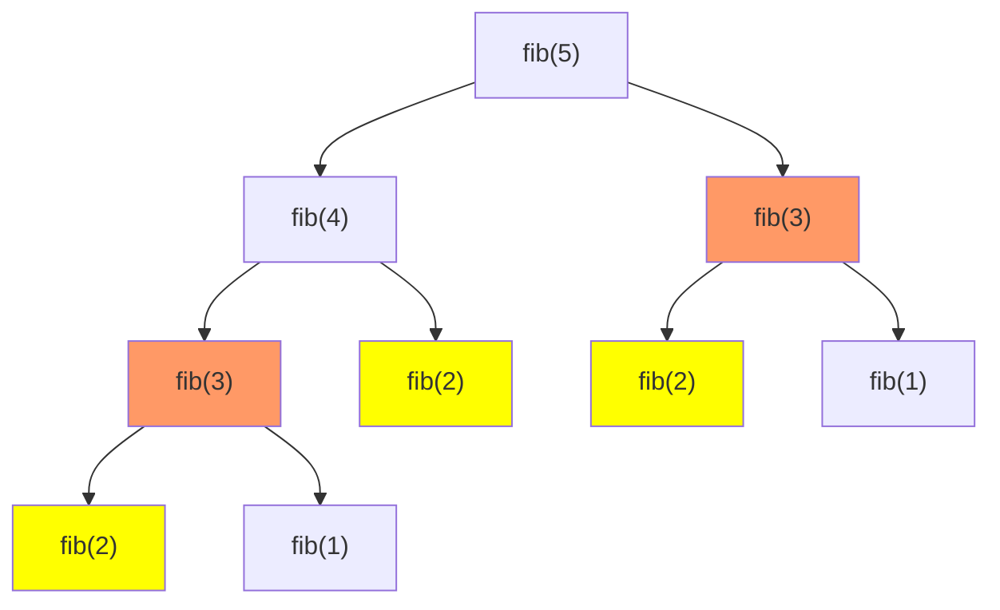
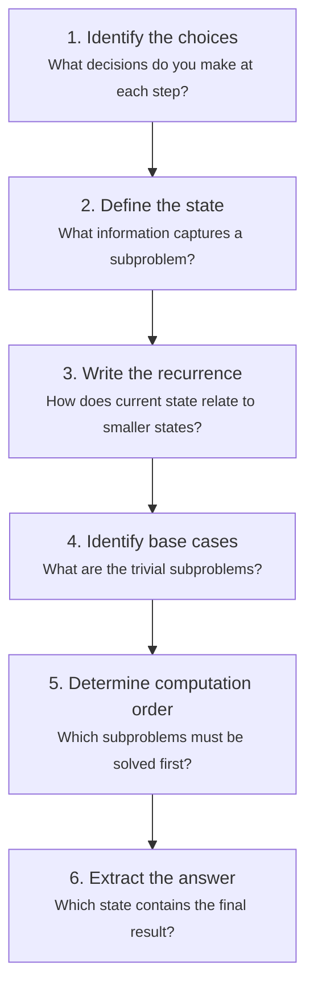

# Dynamic Programming

Dynamic programming (DP) is the algorithm design technique that strikes fear into interviewees. It shouldn't. DP is simply recursion without redundancy — you solve each subproblem once, store the result, and reuse it. The hard part is seeing that a problem has the right structure for DP. Once you can identify the state, the transition, and the base case, the code writes itself.

## When to Use DP

A problem is a DP candidate when it has two properties:

1. **Optimal substructure**: The optimal solution contains optimal solutions to subproblems
2. **Overlapping subproblems**: The same subproblems are solved multiple times



*Fibonacci without memoization: fib(3) is computed twice, fib(2) three times. This exponential redundancy is what DP eliminates.*

## Top-Down (Memoization) vs Bottom-Up (Tabulation)

### Top-Down: Memoization

Start from the main problem, recurse into subproblems, cache results.

**TypeScript:**

```typescript
function fibMemo(n: number, memo = new Map<number, number>()): number {
  if (n <= 1) return n;
  if (memo.has(n)) return memo.get(n)!;

  const result = fibMemo(n - 1, memo) + fibMemo(n - 2, memo);
  memo.set(n, result);
  return result;
}
```

**Python:**

```python
from functools import lru_cache

@lru_cache(maxsize=None)
def fib_memo(n: int) -> int:
    if n <= 1:
        return n
    return fib_memo(n - 1) + fib_memo(n - 2)
```

### Bottom-Up: Tabulation

Start from the smallest subproblems, build up to the answer iteratively.

**TypeScript:**

```typescript
function fibTab(n: number): number {
  if (n <= 1) return n;

  const dp = new Array(n + 1);
  dp[0] = 0;
  dp[1] = 1;

  for (let i = 2; i <= n; i++) {
    dp[i] = dp[i - 1] + dp[i - 2];
  }

  return dp[n];
}

// Space-optimized: O(1) instead of O(n)
function fibOptimized(n: number): number {
  if (n <= 1) return n;
  let prev2 = 0, prev1 = 1;

  for (let i = 2; i <= n; i++) {
    const current = prev1 + prev2;
    prev2 = prev1;
    prev1 = current;
  }

  return prev1;
}
```

**Python:**

```python
def fib_tab(n: int) -> int:
    if n <= 1:
        return n
    dp = [0] * (n + 1)
    dp[1] = 1
    for i in range(2, n + 1):
        dp[i] = dp[i - 1] + dp[i - 2]
    return dp[n]

def fib_optimized(n: int) -> int:
    if n <= 1:
        return n
    prev2, prev1 = 0, 1
    for _ in range(2, n + 1):
        prev2, prev1 = prev1, prev1 + prev2
    return prev1
```

### Comparison

| | Top-Down (Memoization) | Bottom-Up (Tabulation) |
|---|---|---|
| Approach | Recursive + cache | Iterative + table |
| Solves all subproblems? | Only what's needed | All subproblems |
| Stack overflow risk | Yes (deep recursion) | No |
| Space optimization | Harder | Easier (rolling array) |
| Thinking style | Natural (start from goal) | Requires ordering subproblems |

::: tip
Start with top-down memoization when solving a new problem — it maps directly to the recursive structure and is easier to reason about. Convert to bottom-up for production code where stack overflow is a concern or space optimization is needed.
:::

## The DP Framework

For any DP problem, answer these four questions:

1. **State**: What information defines a subproblem? → This becomes your DP array dimensions
2. **Transition**: How does a state relate to smaller states? → This is your recurrence relation
3. **Base case**: What are the trivial subproblems? → Initialization of your DP array
4. **Answer**: Which state contains the final answer?

## 1D Dynamic Programming

### Climbing Stairs

**Problem:** You can climb 1 or 2 steps at a time. How many ways to reach the top of $n$ stairs?

**State:** `dp[i]` = number of ways to reach step $i$

**Transition:** $dp[i] = dp[i-1] + dp[i-2]$ (come from one step or two steps below)

**TypeScript:**

```typescript
function climbStairs(n: number): number {
  if (n <= 2) return n;
  let prev2 = 1, prev1 = 2;

  for (let i = 3; i <= n; i++) {
    const current = prev1 + prev2;
    prev2 = prev1;
    prev1 = current;
  }

  return prev1;
}
```

**Python:**

```python
def climb_stairs(n: int) -> int:
    if n <= 2:
        return n
    prev2, prev1 = 1, 2
    for _ in range(3, n + 1):
        prev2, prev1 = prev1, prev1 + prev2
    return prev1
```

**Complexity:** $O(n)$ time, $O(1)$ space.

### Coin Change

**Problem:** Given coin denominations and a target amount, find the minimum number of coins needed.

**State:** `dp[amount]` = minimum coins to make `amount`

**Transition:** $dp[a] = \min_{c \in \text{coins}}(dp[a - c] + 1)$ for each coin $c \leq a$

**TypeScript:**

```typescript
function coinChange(coins: number[], amount: number): number {
  const dp = new Array(amount + 1).fill(Infinity);
  dp[0] = 0;

  for (let a = 1; a <= amount; a++) {
    for (const coin of coins) {
      if (coin <= a && dp[a - coin] + 1 < dp[a]) {
        dp[a] = dp[a - coin] + 1;
      }
    }
  }

  return dp[amount] === Infinity ? -1 : dp[amount];
}
```

**Python:**

```python
def coin_change(coins: list[int], amount: int) -> int:
    dp = [float('inf')] * (amount + 1)
    dp[0] = 0

    for a in range(1, amount + 1):
        for coin in coins:
            if coin <= a:
                dp[a] = min(dp[a], dp[a - coin] + 1)

    return dp[amount] if dp[amount] != float('inf') else -1
```

**Complexity:** $O(\text{amount} \times |\text{coins}|)$ time, $O(\text{amount})$ space.

### Longest Increasing Subsequence (LIS)

**Problem:** Find the length of the longest strictly increasing subsequence.

**$O(n^2)$ DP approach:**

**State:** `dp[i]` = length of LIS ending at index $i$

**Transition:** $dp[i] = \max_{j < i, \, \text{nums}[j] < \text{nums}[i]}(dp[j] + 1)$

**$O(n \log n)$ approach with patience sorting:**

**Python:**

```python
import bisect

def length_of_lis(nums: list[int]) -> int:
    # tails[i] = smallest tail element for increasing subsequence of length i+1
    tails: list[int] = []

    for num in nums:
        pos = bisect.bisect_left(tails, num)
        if pos == len(tails):
            tails.append(num)
        else:
            tails[pos] = num

    return len(tails)
```

**TypeScript:**

```typescript
function lengthOfLIS(nums: number[]): number {
  const tails: number[] = [];

  for (const num of nums) {
    let lo = 0, hi = tails.length;
    while (lo < hi) {
      const mid = (lo + hi) >> 1;
      if (tails[mid] < num) lo = mid + 1;
      else hi = mid;
    }
    tails[lo] = num;
    if (lo === tails.length) tails.push(num);
    else tails[lo] = num;
  }

  return tails.length;
}
```

**Complexity:** $O(n \log n)$ time, $O(n)$ space.

### House Robber

**Problem:** Rob houses along a street; cannot rob two adjacent houses. Maximize total loot.

**Python:**

```python
def rob(nums: list[int]) -> int:
    if not nums:
        return 0
    if len(nums) == 1:
        return nums[0]

    prev2, prev1 = 0, 0
    for num in nums:
        prev2, prev1 = prev1, max(prev1, prev2 + num)
    return prev1
```

## 2D Dynamic Programming

### Longest Common Subsequence (LCS)

**Problem:** Find the length of the longest common subsequence between two strings.

**State:** `dp[i][j]` = LCS of `text1[0..i-1]` and `text2[0..j-1]`

**Transition:**

$$
dp[i][j] = \begin{cases}
dp[i-1][j-1] + 1 & \text{if } \text{text1}[i-1] = \text{text2}[j-1] \\
\max(dp[i-1][j], \, dp[i][j-1]) & \text{otherwise}
\end{cases}
$$

**TypeScript:**

```typescript
function longestCommonSubsequence(text1: string, text2: string): number {
  const m = text1.length;
  const n = text2.length;
  const dp = Array.from({ length: m + 1 }, () => new Array(n + 1).fill(0));

  for (let i = 1; i <= m; i++) {
    for (let j = 1; j <= n; j++) {
      if (text1[i - 1] === text2[j - 1]) {
        dp[i][j] = dp[i - 1][j - 1] + 1;
      } else {
        dp[i][j] = Math.max(dp[i - 1][j], dp[i][j - 1]);
      }
    }
  }

  return dp[m][n];
}
```

**Python:**

```python
def longest_common_subsequence(text1: str, text2: str) -> int:
    m, n = len(text1), len(text2)
    dp = [[0] * (n + 1) for _ in range(m + 1)]

    for i in range(1, m + 1):
        for j in range(1, n + 1):
            if text1[i - 1] == text2[j - 1]:
                dp[i][j] = dp[i - 1][j - 1] + 1
            else:
                dp[i][j] = max(dp[i - 1][j], dp[i][j - 1])

    return dp[m][n]
```

**Complexity:** $O(mn)$ time, $O(mn)$ space (optimizable to $O(\min(m, n))$ with rolling array).

### Edit Distance (Levenshtein Distance)

**Problem:** Minimum operations (insert, delete, replace) to transform one string into another.

**State:** `dp[i][j]` = edit distance between `word1[0..i-1]` and `word2[0..j-1]`

**Transition:**

$$
dp[i][j] = \begin{cases}
dp[i-1][j-1] & \text{if } \text{word1}[i-1] = \text{word2}[j-1] \\
1 + \min(dp[i-1][j], \, dp[i][j-1], \, dp[i-1][j-1]) & \text{otherwise}
\end{cases}
$$

**TypeScript:**

```typescript
function minDistance(word1: string, word2: string): number {
  const m = word1.length;
  const n = word2.length;
  const dp = Array.from({ length: m + 1 }, () => new Array(n + 1).fill(0));

  // Base cases
  for (let i = 0; i <= m; i++) dp[i][0] = i;
  for (let j = 0; j <= n; j++) dp[0][j] = j;

  for (let i = 1; i <= m; i++) {
    for (let j = 1; j <= n; j++) {
      if (word1[i - 1] === word2[j - 1]) {
        dp[i][j] = dp[i - 1][j - 1];
      } else {
        dp[i][j] = 1 + Math.min(
          dp[i - 1][j],     // delete
          dp[i][j - 1],     // insert
          dp[i - 1][j - 1]  // replace
        );
      }
    }
  }

  return dp[m][n];
}
```

**Python:**

```python
def min_distance(word1: str, word2: str) -> int:
    m, n = len(word1), len(word2)
    dp = [[0] * (n + 1) for _ in range(m + 1)]

    for i in range(m + 1):
        dp[i][0] = i
    for j in range(n + 1):
        dp[0][j] = j

    for i in range(1, m + 1):
        for j in range(1, n + 1):
            if word1[i - 1] == word2[j - 1]:
                dp[i][j] = dp[i - 1][j - 1]
            else:
                dp[i][j] = 1 + min(dp[i - 1][j], dp[i][j - 1], dp[i - 1][j - 1])

    return dp[m][n]
```

**Complexity:** $O(mn)$ time, $O(mn)$ space.

::: tip Production Use Case
Edit distance is used in spell checkers, DNA sequence alignment, diff tools, and fuzzy search. It's not just an interview problem — it's a foundational algorithm in bioinformatics and text processing.
:::

### 0/1 Knapsack

**Problem:** Given items with weights and values and a capacity, maximize total value without exceeding the weight limit. Each item can be used at most once.

**State:** `dp[i][w]` = max value using first $i$ items with capacity $w$

**Transition:**

$$
dp[i][w] = \begin{cases}
dp[i-1][w] & \text{if } w_i > w \text{ (can't take item)} \\
\max(dp[i-1][w], \, dp[i-1][w - w_i] + v_i) & \text{otherwise}
\end{cases}
$$

**Python:**

```python
def knapsack(weights: list[int], values: list[int], capacity: int) -> int:
    n = len(weights)
    dp = [[0] * (capacity + 1) for _ in range(n + 1)]

    for i in range(1, n + 1):
        for w in range(capacity + 1):
            dp[i][w] = dp[i - 1][w]  # don't take item i
            if weights[i - 1] <= w:
                dp[i][w] = max(dp[i][w], dp[i - 1][w - weights[i - 1]] + values[i - 1])

    return dp[n][capacity]

# Space-optimized: single row, iterate capacity in reverse
def knapsack_optimized(weights: list[int], values: list[int], capacity: int) -> int:
    dp = [0] * (capacity + 1)
    for i in range(len(weights)):
        for w in range(capacity, weights[i] - 1, -1):  # reverse to avoid reuse
            dp[w] = max(dp[w], dp[w - weights[i]] + values[i])
    return dp[capacity]
```

**Complexity:** $O(nW)$ time and space ($O(W)$ space optimized), where $W$ is the capacity. This is pseudo-polynomial — polynomial in the value of $W$, not the number of bits needed to represent it.

## Interval DP

Problems where the state is defined over a contiguous range.

### Matrix Chain Multiplication

**Problem:** Find the most efficient way to multiply a chain of matrices.

**Python:**

```python
def matrix_chain_order(dims: list[int]) -> int:
    """dims[i-1] x dims[i] is the dimension of matrix i."""
    n = len(dims) - 1  # number of matrices
    dp = [[0] * n for _ in range(n)]

    # l is the chain length
    for length in range(2, n + 1):
        for i in range(n - length + 1):
            j = i + length - 1
            dp[i][j] = float('inf')
            for k in range(i, j):
                cost = dp[i][k] + dp[k + 1][j] + dims[i] * dims[k + 1] * dims[j + 1]
                dp[i][j] = min(dp[i][j], cost)

    return dp[0][n - 1]
```

**Complexity:** $O(n^3)$ time, $O(n^2)$ space.

## State Transition Thinking Framework

When you encounter a new DP problem, follow this systematic process:



### Example Walkthrough: Word Break

**Problem:** Given a string and a dictionary, determine if the string can be segmented into dictionary words.

1. **Choices:** At each position, try every possible word from the dictionary that starts there
2. **State:** `dp[i]` = can `s[0..i-1]` be segmented?
3. **Recurrence:** `dp[i] = any(dp[j] and s[j:i] in wordDict for j in range(i))`
4. **Base case:** `dp[0] = True` (empty string)
5. **Order:** Left to right
6. **Answer:** `dp[len(s)]`

**Python:**

```python
def word_break(s: str, word_dict: list[str]) -> bool:
    words = set(word_dict)
    dp = [False] * (len(s) + 1)
    dp[0] = True

    for i in range(1, len(s) + 1):
        for j in range(i):
            if dp[j] and s[j:i] in words:
                dp[i] = True
                break

    return dp[len(s)]
```

## Common DP Patterns

| Pattern | Examples | State Hint |
|---|---|---|
| Linear sequence | Climbing stairs, house robber, LIS | `dp[i]` indexed by position |
| Two sequences | LCS, edit distance | `dp[i][j]` two indices |
| Knapsack / subset | 0/1 knapsack, subset sum, coin change | `dp[i][capacity]` or `dp[capacity]` |
| Interval | Matrix chain, burst balloons, palindrome partition | `dp[i][j]` for range $[i, j]$ |
| Grid | Unique paths, min path sum | `dp[row][col]` |
| Bitmask | Traveling salesman, set cover | `dp[mask]` where mask is a bitmask |
| String partition | Word break, palindrome partitioning | `dp[i]` or `dp[i][j]` |

::: danger Common Mistakes
- **Not handling base cases correctly**: Off-by-one errors in DP indices are the #1 source of bugs
- **Wrong computation order**: In bottom-up, you must fill states that are dependencies first
- **Forgetting to consider all transitions**: Missing a case in the recurrence relation leads to wrong answers
- **Confusing 0/1 knapsack with unbounded**: In 0/1 knapsack, iterate capacity in reverse; in unbounded, iterate forward
:::

## Space Optimization

Many 2D DP problems only depend on the previous row, allowing $O(n)$ space instead of $O(mn)$:

**Before (LCS with $O(mn)$ space):**

```python
dp = [[0] * (n + 1) for _ in range(m + 1)]
```

**After (LCS with $O(n)$ space):**

```python
prev = [0] * (n + 1)
curr = [0] * (n + 1)
for i in range(1, m + 1):
    for j in range(1, n + 1):
        if text1[i-1] == text2[j-1]:
            curr[j] = prev[j-1] + 1
        else:
            curr[j] = max(prev[j], curr[j-1])
    prev, curr = curr, [0] * (n + 1)
```

## Practice Problems

| Problem | Pattern | Difficulty |
|---|---|---|
| Climbing Stairs | 1D linear | Easy |
| House Robber | 1D linear | Medium |
| Coin Change | 1D knapsack | Medium |
| Longest Increasing Subsequence | 1D + binary search | Medium |
| Word Break | 1D string partition | Medium |
| Longest Common Subsequence | 2D two-sequence | Medium |
| Edit Distance | 2D two-sequence | Medium |
| 0/1 Knapsack | 2D subset | Medium |
| Unique Paths | 2D grid | Medium |
| Longest Palindromic Substring | 2D interval | Medium |
| Burst Balloons | Interval DP | Hard |
| Regular Expression Matching | 2D two-sequence | Hard |

## Further Reading

- [Backtracking & Recursion](/algorithms/backtracking-recursion) — DP often starts as a brute-force recursion that you optimize
- [Graphs](/algorithms/graphs) — shortest path algorithms are DP in disguise
- [Arrays & Strings](/algorithms/arrays-strings) — many string DP problems build on array techniques
- [Sorting & Searching](/algorithms/sorting-searching) — binary search in LIS optimization

## Try It Yourself

**Problem 1:** How many distinct ways can you climb a staircase of 5 steps, taking 1 or 2 steps at a time?

::: details Solution
Use the climbing stairs recurrence: $dp[i] = dp[i-1] + dp[i-2]$.
- dp[1] = 1, dp[2] = 2
- dp[3] = dp[2] + dp[1] = 3
- dp[4] = dp[3] + dp[2] = 5
- dp[5] = dp[4] + dp[3] = **8**
:::

**Problem 2:** Given coins `[1, 3, 4]` and amount `6`, find the minimum number of coins needed.

::: details Solution
Build the DP table: $dp[a] = \min(dp[a-1]+1, dp[a-3]+1, dp[a-4]+1)$.
- dp[0]=0, dp[1]=1, dp[2]=2, dp[3]=1, dp[4]=1
- dp[5] = min(dp[4]+1, dp[2]+1, dp[1]+1) = min(2, 3, 2) = 2
- dp[6] = min(dp[5]+1, dp[3]+1, dp[2]+1) = min(3, 2, 3) = **2**
Answer: 2 coins (3 + 3)
:::

**Problem 3:** Find the Longest Common Subsequence of `"ABCDE"` and `"ACE"`.

::: details Solution
Build the 2D DP table where $dp[i][j]$ = LCS of first $i$ chars of s1 and first $j$ chars of s2:
- A matches A → dp[1][1] = 1
- C matches C → dp[3][2] = 2
- E matches E → dp[5][3] = 3
Answer: **3** (the LCS is "ACE")
:::

**Problem 4:** Given the array `[10, 9, 2, 5, 3, 7, 101, 18]`, find the length of the Longest Increasing Subsequence.

::: details Solution
Using the patience sorting / binary search approach, maintain `tails`:
- 10 → tails=[10]
- 9 → replace 10 → tails=[9]
- 2 → replace 9 → tails=[2]
- 5 → append → tails=[2,5]
- 3 → replace 5 → tails=[2,3]
- 7 → append → tails=[2,3,7]
- 101 → append → tails=[2,3,7,101]
- 18 → replace 101 → tails=[2,3,7,18]
Answer: **4** (e.g., [2, 3, 7, 101] or [2, 3, 7, 18])
:::

**Problem 5:** Compute the edit distance between `"kitten"` and `"sitting"`.

::: details Solution
Build the DP table:
- k→s (replace), i=i, t=t, t→t, e→i (replace), n→n, +g (insert)
Step by step: kitten → sitten (replace k with s) → sittin (replace e with i) → sitting (insert g)
Answer: **3** operations
:::

## Quick Quiz

**1. What two properties must a problem have to be solvable with dynamic programming?**
- a) Greedy choice property and optimal substructure
- b) Optimal substructure and overlapping subproblems
- c) Divide and conquer with no overlapping subproblems
- d) Polynomial time and constant space

::: details Answer
**b) Optimal substructure and overlapping subproblems** — Optimal substructure means the optimal solution contains optimal solutions to subproblems. Overlapping subproblems means the same subproblems are solved multiple times, making caching beneficial.
:::

**2. What is the key difference between top-down (memoization) and bottom-up (tabulation) DP?**
- a) Top-down is always faster
- b) Top-down uses recursion with caching; bottom-up fills a table iteratively
- c) Bottom-up cannot be space-optimized
- d) Top-down solves all subproblems; bottom-up only solves needed ones

::: details Answer
**b) Top-down uses recursion with caching; bottom-up fills a table iteratively** — Top-down starts from the main problem and recurses downward. Bottom-up builds from the smallest subproblems upward. Top-down may skip unneeded subproblems but risks stack overflow.
:::

**3. What is the time complexity of the 0/1 Knapsack problem with $n$ items and capacity $W$?**
- a) $O(n \log W)$
- b) $O(nW)$
- c) $O(2^n)$
- d) $O(n^2)$

::: details Answer
**b) $O(nW)$** — The DP table has $n \times W$ entries, each computed in $O(1)$. Note this is pseudo-polynomial: polynomial in the value of $W$, not in the number of bits to represent it.
:::

**4. In the space-optimized 0/1 Knapsack, why must you iterate the capacity in reverse?**
- a) To sort the items by weight
- b) To prevent using the same item more than once in the same row
- c) To improve cache performance
- d) To reduce the number of iterations

::: details Answer
**b) To prevent using the same item more than once in the same row** — Forward iteration would use the already-updated values from the current row, effectively allowing item reuse (which is the unbounded knapsack). Reverse iteration ensures you only reference values from the previous row.
:::

**5. Which DP pattern best describes the Edit Distance problem?**
- a) 1D linear sequence
- b) 2D two-sequence comparison
- c) Interval DP
- d) Bitmask DP

::: details Answer
**b) 2D two-sequence comparison** — Edit distance compares two strings character by character, with state `dp[i][j]` representing the edit distance between the first $i$ characters of one string and the first $j$ characters of the other.
:::
