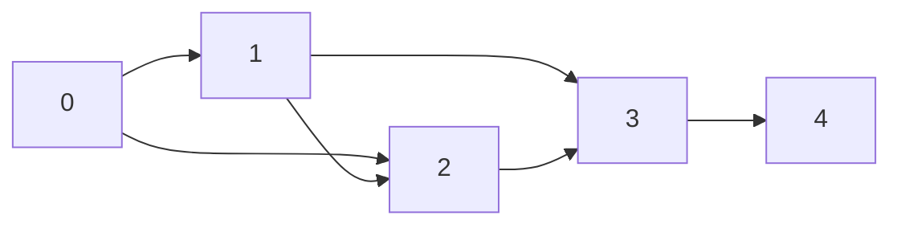
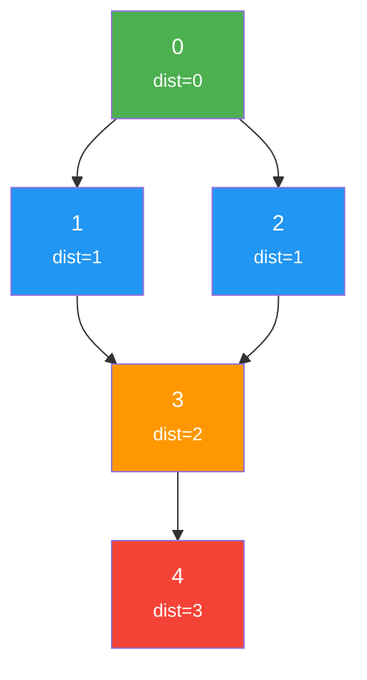
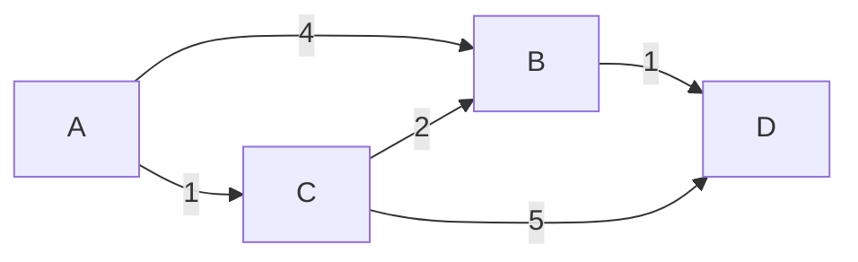
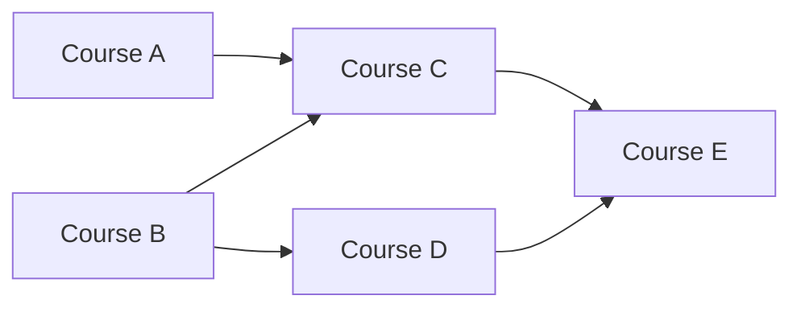

# Graphs

Graphs model relationships. Social networks, road maps, dependency chains, internet routing, circuit design — if there are entities with connections between them, there is a graph. Graph algorithms are among the most practically important in all of computer science, and they appear frequently in interviews at every level.

## Representations

### Adjacency List

Each vertex stores a list of its neighbors. Best for sparse graphs ($E \ll V^2$).



**TypeScript:**

```typescript
// Unweighted adjacency list
type AdjList = Map<number, number[]>;

function buildAdjList(edges: [number, number][], directed = false): AdjList {
  const graph: AdjList = new Map();

  for (const [u, v] of edges) {
    if (!graph.has(u)) graph.set(u, []);
    if (!graph.has(v)) graph.set(v, []);
    graph.get(u)!.push(v);
    if (!directed) graph.get(v)!.push(u);
  }

  return graph;
}

// Weighted adjacency list
type WeightedAdjList = Map<number, [number, number][]>; // [neighbor, weight]
```

**Python:**

```python
from collections import defaultdict

def build_adj_list(edges: list[tuple[int, int]], directed=False) -> dict[int, list[int]]:
    graph = defaultdict(list)
    for u, v in edges:
        graph[u].append(v)
        if not directed:
            graph[v].append(u)
    return graph

# Weighted: graph[u] = [(v, weight), ...]
```

### Adjacency Matrix

A $V \times V$ matrix where `matrix[i][j]` indicates an edge from $i$ to $j$. Best for dense graphs or when you need $O(1)$ edge lookup.

**Python:**

```python
def build_adj_matrix(n: int, edges: list[tuple[int, int]], directed=False) -> list[list[int]]:
    matrix = [[0] * n for _ in range(n)]
    for u, v in edges:
        matrix[u][v] = 1
        if not directed:
            matrix[v][u] = 1
    return matrix
```

### Comparison

| | Adjacency List | Adjacency Matrix |
|---|---|---|
| Space | $O(V + E)$ | $O(V^2)$ |
| Edge lookup | $O(\text{degree})$ | $O(1)$ |
| Iterate neighbors | $O(\text{degree})$ | $O(V)$ |
| Add edge | $O(1)$ | $O(1)$ |
| Best for | Sparse graphs | Dense graphs, quick edge queries |

## Breadth-First Search (BFS)

BFS explores all nodes at distance $d$ before exploring nodes at distance $d+1$. It finds shortest paths in unweighted graphs.



**TypeScript:**

```typescript
function bfs(graph: AdjList, start: number): Map<number, number> {
  const distances = new Map<number, number>();
  const queue: number[] = [start];
  distances.set(start, 0);

  while (queue.length > 0) {
    const node = queue.shift()!;
    const dist = distances.get(node)!;

    for (const neighbor of graph.get(node) || []) {
      if (!distances.has(neighbor)) {
        distances.set(neighbor, dist + 1);
        queue.push(neighbor);
      }
    }
  }

  return distances;
}
```

**Python:**

```python
from collections import deque

def bfs(graph: dict[int, list[int]], start: int) -> dict[int, int]:
    distances = {start: 0}
    queue = deque([start])

    while queue:
        node = queue.popleft()
        for neighbor in graph.get(node, []):
            if neighbor not in distances:
                distances[neighbor] = distances[node] + 1
                queue.append(neighbor)

    return distances
```

**Complexity:** $O(V + E)$ time, $O(V)$ space.

### BFS Applications

- **Shortest path** in unweighted graph
- **Level-order traversal** of trees
- **Connected components** (run BFS from each unvisited node)
- **Bipartite check** (two-color the graph)
- **Multi-source BFS** (e.g., "rotten oranges" — start from multiple sources simultaneously)

### Bipartite Check

**Python:**

```python
def is_bipartite(graph: dict[int, list[int]], n: int) -> bool:
    color = [-1] * n

    for start in range(n):
        if color[start] != -1:
            continue
        queue = deque([start])
        color[start] = 0

        while queue:
            node = queue.popleft()
            for neighbor in graph.get(node, []):
                if color[neighbor] == -1:
                    color[neighbor] = 1 - color[node]
                    queue.append(neighbor)
                elif color[neighbor] == color[node]:
                    return False

    return True
```

## Depth-First Search (DFS)

DFS explores as deep as possible before backtracking. It is the foundation of many graph algorithms.

**TypeScript:**

```typescript
function dfs(graph: AdjList, start: number): Set<number> {
  const visited = new Set<number>();

  function explore(node: number): void {
    visited.add(node);
    for (const neighbor of graph.get(node) || []) {
      if (!visited.has(neighbor)) {
        explore(neighbor);
      }
    }
  }

  explore(start);
  return visited;
}

// Iterative DFS
function dfsIterative(graph: AdjList, start: number): Set<number> {
  const visited = new Set<number>();
  const stack = [start];

  while (stack.length > 0) {
    const node = stack.pop()!;
    if (visited.has(node)) continue;
    visited.add(node);

    for (const neighbor of graph.get(node) || []) {
      if (!visited.has(neighbor)) {
        stack.push(neighbor);
      }
    }
  }

  return visited;
}
```

**Python:**

```python
def dfs(graph: dict[int, list[int]], start: int) -> set[int]:
    visited = set()

    def explore(node: int) -> None:
        visited.add(node)
        for neighbor in graph.get(node, []):
            if neighbor not in visited:
                explore(neighbor)

    explore(start)
    return visited

def dfs_iterative(graph: dict[int, list[int]], start: int) -> set[int]:
    visited = set()
    stack = [start]

    while stack:
        node = stack.pop()
        if node in visited:
            continue
        visited.add(node)

        for neighbor in graph.get(node, []):
            if neighbor not in visited:
                stack.append(neighbor)

    return visited
```

**Complexity:** $O(V + E)$ time, $O(V)$ space.

### DFS Applications

- **Cycle detection** (back edges in directed graphs)
- **Topological sort** (ordering dependencies)
- **Connected components / flood fill**
- **Path finding** (does a path exist?)
- **Strongly connected components** (Tarjan's, Kosaraju's)

### Cycle Detection in Directed Graph

**Python:**

```python
def has_cycle_directed(graph: dict[int, list[int]], n: int) -> bool:
    WHITE, GRAY, BLACK = 0, 1, 2
    color = [WHITE] * n

    def dfs(node: int) -> bool:
        color[node] = GRAY  # currently in the call stack
        for neighbor in graph.get(node, []):
            if color[neighbor] == GRAY:  # back edge → cycle
                return True
            if color[neighbor] == WHITE and dfs(neighbor):
                return True
        color[node] = BLACK  # fully processed
        return False

    return any(color[i] == WHITE and dfs(i) for i in range(n))
```

::: tip
The three-color technique (WHITE/GRAY/BLACK) distinguishes between unvisited nodes, nodes currently in the recursion stack, and fully processed nodes. A back edge (pointing to a GRAY node) indicates a cycle.
:::

## Shortest Path Algorithms

### Dijkstra's Algorithm

Finds shortest paths from a source to all vertices in a graph with **non-negative** edge weights.



**TypeScript:**

```typescript
function dijkstra(
  graph: Map<number, [number, number][]>,
  start: number
): Map<number, number> {
  const dist = new Map<number, number>();
  dist.set(start, 0);

  // MinHeap: [distance, node]
  // Using a simple sorted insertion for clarity
  // In production, use a proper priority queue
  const pq: [number, number][] = [[0, start]];

  while (pq.length > 0) {
    pq.sort((a, b) => a[0] - b[0]);
    const [d, u] = pq.shift()!;

    if (d > (dist.get(u) ?? Infinity)) continue;

    for (const [v, weight] of graph.get(u) || []) {
      const newDist = d + weight;
      if (newDist < (dist.get(v) ?? Infinity)) {
        dist.set(v, newDist);
        pq.push([newDist, v]);
      }
    }
  }

  return dist;
}
```

**Python:**

```python
import heapq

def dijkstra(graph: dict[int, list[tuple[int, int]]], start: int) -> dict[int, float]:
    dist: dict[int, float] = {start: 0}
    pq = [(0, start)]  # (distance, node)

    while pq:
        d, u = heapq.heappop(pq)
        if d > dist.get(u, float('inf')):
            continue

        for v, weight in graph.get(u, []):
            new_dist = d + weight
            if new_dist < dist.get(v, float('inf')):
                dist[v] = new_dist
                heapq.heappush(pq, (new_dist, v))

    return dist
```

**Complexity:** $O((V + E) \log V)$ with a binary heap. $O(V^2)$ with a simple array (better for dense graphs).

::: danger
Dijkstra fails with negative edge weights. A negative edge can create a shorter path through a node that was already finalized. Use Bellman-Ford instead.
:::

### Bellman-Ford Algorithm

Handles graphs with **negative edge weights**. Detects negative-weight cycles.

**Python:**

```python
def bellman_ford(n: int, edges: list[tuple[int, int, int]], start: int) -> dict[int, float]:
    """edges: [(u, v, weight), ...]"""
    dist: dict[int, float] = {i: float('inf') for i in range(n)}
    dist[start] = 0

    # Relax all edges V-1 times
    for _ in range(n - 1):
        for u, v, w in edges:
            if dist[u] + w < dist[v]:
                dist[v] = dist[u] + w

    # Check for negative-weight cycles
    for u, v, w in edges:
        if dist[u] + w < dist[v]:
            raise ValueError("Graph contains a negative-weight cycle")

    return dist
```

**Complexity:** $O(VE)$ time, $O(V)$ space.

### Floyd-Warshall Algorithm

Finds shortest paths between **all pairs** of vertices.

**Python:**

```python
def floyd_warshall(n: int, edges: list[tuple[int, int, int]]) -> list[list[float]]:
    INF = float('inf')
    dist = [[INF] * n for _ in range(n)]

    for i in range(n):
        dist[i][i] = 0

    for u, v, w in edges:
        dist[u][v] = w

    for k in range(n):
        for i in range(n):
            for j in range(n):
                if dist[i][k] + dist[k][j] < dist[i][j]:
                    dist[i][j] = dist[i][k] + dist[k][j]

    return dist
```

**Complexity:** $O(V^3)$ time, $O(V^2)$ space.

### Algorithm Comparison

| Algorithm | Weights | Negative? | All-pairs? | Complexity |
|---|---|---|---|---|
| BFS | Unweighted | N/A | No | $O(V + E)$ |
| Dijkstra | Non-negative | No | No | $O((V+E) \log V)$ |
| Bellman-Ford | Any | Yes (detects cycles) | No | $O(VE)$ |
| Floyd-Warshall | Any | Yes | Yes | $O(V^3)$ |

## Topological Sort

A linear ordering of vertices in a DAG (Directed Acyclic Graph) such that for every edge $(u, v)$, $u$ comes before $v$. Used for dependency resolution, build systems, course scheduling.



**Topological order:** A, B, C, D, E (or A, B, D, C, E — not unique).

### Kahn's Algorithm (BFS-based)

**TypeScript:**

```typescript
function topologicalSort(graph: AdjList, numNodes: number): number[] {
  const inDegree = new Array(numNodes).fill(0);

  // Calculate in-degrees
  for (const [_, neighbors] of graph) {
    for (const neighbor of neighbors) {
      inDegree[neighbor]++;
    }
  }

  // Start with all nodes that have no incoming edges
  const queue: number[] = [];
  for (let i = 0; i < numNodes; i++) {
    if (inDegree[i] === 0) queue.push(i);
  }

  const result: number[] = [];

  while (queue.length > 0) {
    const node = queue.shift()!;
    result.push(node);

    for (const neighbor of graph.get(node) || []) {
      inDegree[neighbor]--;
      if (inDegree[neighbor] === 0) {
        queue.push(neighbor);
      }
    }
  }

  if (result.length !== numNodes) {
    throw new Error("Graph has a cycle — topological sort impossible");
  }

  return result;
}
```

**Python:**

```python
from collections import deque

def topological_sort(graph: dict[int, list[int]], num_nodes: int) -> list[int]:
    in_degree = [0] * num_nodes
    for neighbors in graph.values():
        for neighbor in neighbors:
            in_degree[neighbor] += 1

    queue = deque(i for i in range(num_nodes) if in_degree[i] == 0)
    result = []

    while queue:
        node = queue.popleft()
        result.append(node)
        for neighbor in graph.get(node, []):
            in_degree[neighbor] -= 1
            if in_degree[neighbor] == 0:
                queue.append(neighbor)

    if len(result) != num_nodes:
        raise ValueError("Graph has a cycle")

    return result
```

**Complexity:** $O(V + E)$ time, $O(V)$ space.

### DFS-based Topological Sort

**Python:**

```python
def topological_sort_dfs(graph: dict[int, list[int]], num_nodes: int) -> list[int]:
    visited = set()
    result = []

    def dfs(node: int) -> None:
        visited.add(node)
        for neighbor in graph.get(node, []):
            if neighbor not in visited:
                dfs(neighbor)
        result.append(node)  # add after all descendants are processed

    for i in range(num_nodes):
        if i not in visited:
            dfs(i)

    return result[::-1]  # reverse the postorder
```

## Strongly Connected Components (SCCs)

In a directed graph, an SCC is a maximal set of vertices where every vertex is reachable from every other vertex.

### Kosaraju's Algorithm

1. Run DFS on original graph, push nodes to stack in finish order
2. Transpose the graph (reverse all edges)
3. Pop from stack, run DFS on transposed graph — each DFS gives one SCC

**Python:**

```python
def kosaraju(graph: dict[int, list[int]], n: int) -> list[list[int]]:
    # Step 1: DFS and push to stack in finish order
    visited = set()
    stack = []

    def dfs1(node: int) -> None:
        visited.add(node)
        for neighbor in graph.get(node, []):
            if neighbor not in visited:
                dfs1(neighbor)
        stack.append(node)

    for i in range(n):
        if i not in visited:
            dfs1(i)

    # Step 2: Build transposed graph
    transposed: dict[int, list[int]] = defaultdict(list)
    for u in graph:
        for v in graph[u]:
            transposed[v].append(u)

    # Step 3: DFS on transposed graph in reverse finish order
    visited.clear()
    sccs = []

    def dfs2(node: int, component: list[int]) -> None:
        visited.add(node)
        component.append(node)
        for neighbor in transposed.get(node, []):
            if neighbor not in visited:
                dfs2(neighbor, component)

    while stack:
        node = stack.pop()
        if node not in visited:
            component: list[int] = []
            dfs2(node, component)
            sccs.append(component)

    return sccs
```

**Complexity:** $O(V + E)$ time, $O(V)$ space.

## Union-Find (Disjoint Set Union)

Union-Find tracks a set of elements partitioned into disjoint subsets. It supports two operations efficiently: **find** (which set does an element belong to?) and **union** (merge two sets).

### With Path Compression + Union by Rank

**TypeScript:**

```typescript
class UnionFind {
  parent: number[];
  rank: number[];

  constructor(n: number) {
    this.parent = Array.from({ length: n }, (_, i) => i);
    this.rank = new Array(n).fill(0);
  }

  find(x: number): number {
    if (this.parent[x] !== x) {
      this.parent[x] = this.find(this.parent[x]); // path compression
    }
    return this.parent[x];
  }

  union(x: number, y: number): boolean {
    const rootX = this.find(x);
    const rootY = this.find(y);
    if (rootX === rootY) return false; // already connected

    // Union by rank
    if (this.rank[rootX] < this.rank[rootY]) {
      this.parent[rootX] = rootY;
    } else if (this.rank[rootX] > this.rank[rootY]) {
      this.parent[rootY] = rootX;
    } else {
      this.parent[rootY] = rootX;
      this.rank[rootX]++;
    }

    return true;
  }

  connected(x: number, y: number): boolean {
    return this.find(x) === this.find(y);
  }
}
```

**Python:**

```python
class UnionFind:
    def __init__(self, n: int):
        self.parent = list(range(n))
        self.rank = [0] * n

    def find(self, x: int) -> int:
        if self.parent[x] != x:
            self.parent[x] = self.find(self.parent[x])  # path compression
        return self.parent[x]

    def union(self, x: int, y: int) -> bool:
        root_x, root_y = self.find(x), self.find(y)
        if root_x == root_y:
            return False

        if self.rank[root_x] < self.rank[root_y]:
            self.parent[root_x] = root_y
        elif self.rank[root_x] > self.rank[root_y]:
            self.parent[root_y] = root_x
        else:
            self.parent[root_y] = root_x
            self.rank[root_x] += 1

        return True

    def connected(self, x: int, y: int) -> bool:
        return self.find(x) == self.find(y)
```

With both path compression and union by rank, operations are nearly $O(1)$ — formally $O(\alpha(n))$ where $\alpha$ is the inverse Ackermann function, which is effectively constant ($\leq 4$) for all practical input sizes.

### Union-Find Applications

- **Connected components**: Run union on all edges, count distinct roots
- **Cycle detection** in undirected graphs: If `find(u) == find(v)` before unioning edge $(u, v)$, there is a cycle
- **Kruskal's MST**: Sort edges by weight, union them greedily
- **[Consistent Hashing](/system-design/distributed-systems/consistent-hashing)**: Track which nodes own which partitions

## Minimum Spanning Tree (MST)

### Kruskal's Algorithm

Sort all edges by weight, then greedily add each edge if it doesn't create a cycle (using Union-Find).

**Python:**

```python
def kruskal(n: int, edges: list[tuple[int, int, int]]) -> list[tuple[int, int, int]]:
    """Returns MST edges. edges: [(u, v, weight), ...]"""
    edges.sort(key=lambda e: e[2])
    uf = UnionFind(n)
    mst = []

    for u, v, w in edges:
        if uf.union(u, v):
            mst.append((u, v, w))
            if len(mst) == n - 1:
                break

    return mst
```

**Complexity:** $O(E \log E)$ time (dominated by sorting), $O(V)$ space.

## Practice Problems

| Problem | Algorithm | Difficulty |
|---|---|---|
| Number of Islands | BFS/DFS flood fill | Medium |
| Clone Graph | BFS/DFS + hash map | Medium |
| Course Schedule | Topological sort (cycle detection) | Medium |
| Course Schedule II | Topological sort (ordering) | Medium |
| Network Delay Time | Dijkstra | Medium |
| Cheapest Flights Within K Stops | Modified Bellman-Ford | Medium |
| Redundant Connection | Union-Find | Medium |
| Word Ladder | BFS | Hard |
| Alien Dictionary | Topological sort | Hard |
| Critical Connections in a Network | Tarjan's bridges | Hard |

## Further Reading

- [Trees](/algorithms/trees) — trees are acyclic connected graphs
- [Dynamic Programming](/algorithms/dynamic-programming) — shortest path problems as DP
- [Consistent Hashing](/system-design/distributed-systems/consistent-hashing) — graph/ring-based distribution
- [Backtracking & Recursion](/algorithms/backtracking-recursion) — DFS-based exhaustive search

## Try It Yourself

**Problem 1:** Given a graph with edges `[(0,1), (0,2), (1,2), (2,3)]` and 4 nodes, find the shortest path from node 0 to node 3 (unweighted).

::: details Solution
Use BFS starting from node 0:
- Level 0: visit 0, enqueue neighbors 1, 2
- Level 1: visit 1 (neighbor 2 already visited), visit 2 (enqueue 3)
- Level 2: visit 3
Shortest path distance: **2** (path: 0 -> 2 -> 3)
:::

**Problem 2:** Determine if the directed graph with edges `[(0,1), (1,2), (2,0)]` and 3 nodes contains a cycle.

::: details Solution
Use DFS with three-color marking (WHITE, GRAY, BLACK):
- Start DFS at 0: color 0 GRAY
- Visit 1: color 1 GRAY
- Visit 2: color 2 GRAY
- From 2, neighbor 0 is GRAY (still in the call stack) → **back edge detected**
Answer: **Yes**, the graph contains a cycle (0 -> 1 -> 2 -> 0).
:::

**Problem 3:** Perform topological sort on a DAG with edges: A->C, B->C, B->D, C->E, D->E.

::: details Solution
Using Kahn's algorithm (BFS-based):
- In-degrees: A=0, B=0, C=2, D=1, E=2
- Start with queue: [A, B]
- Process A: reduce C's in-degree to 1. Process B: reduce C to 0, D to 0. Queue: [C, D]
- Process C: reduce E to 1. Process D: reduce E to 0. Queue: [E]
- Process E.
One valid topological order: **[A, B, C, D, E]** (or [B, A, C, D, E] or [A, B, D, C, E], etc.)
:::

**Problem 4:** Given a weighted graph with edges `(A,B,4), (A,C,1), (C,B,2), (B,D,1), (C,D,5)`, find the shortest path from A to D using Dijkstra.

::: details Solution
- Initialize: dist = {A:0, B:inf, C:inf, D:inf}, PQ = [(0,A)]
- Process A: update B=4, C=1. PQ = [(1,C), (4,B)]
- Process C: update B = min(4, 1+2) = 3, D = min(inf, 1+5) = 6. PQ = [(3,B), (4,B), (6,D)]
- Process B (dist=3): update D = min(6, 3+1) = 4. PQ = [(4,B), (4,D), (6,D)]
- Process D (dist=4): done.
Shortest path A to D: **4** (path: A -> C -> B -> D)
:::

**Problem 5:** Given 5 nodes and edges `[(0,1), (0,2), (1,3), (2,3), (3,4)]`, use Union-Find to count the number of connected components.

::: details Solution
Initialize: each node is its own component (5 components).
- Union(0,1): merge → 4 components
- Union(0,2): merge → 3 components
- Union(1,3): merge → 2 components
- Union(2,3): find(2)=0, find(3)=0 → already connected, skip
- Union(3,4): merge → 1 component
Answer: **1 connected component**
:::

## Quick Quiz

**1. What is the time complexity of BFS on a graph represented as an adjacency list?**
- a) $O(V)$
- b) $O(E)$
- c) $O(V + E)$
- d) $O(V \cdot E)$

::: details Answer
**c) $O(V + E)$** — BFS visits every vertex once ($O(V)$) and examines every edge once ($O(E)$) in an adjacency list representation.
:::

**2. Which shortest-path algorithm should you use if the graph has negative edge weights (but no negative cycles)?**
- a) BFS
- b) Dijkstra
- c) Bellman-Ford
- d) Floyd-Warshall (if single-source only is needed)

::: details Answer
**c) Bellman-Ford** — Dijkstra fails with negative weights because it assumes finalized distances cannot be improved. Bellman-Ford relaxes all edges $V-1$ times and handles negative weights correctly.
:::

**3. What does topological sort require about the graph?**
- a) The graph must be undirected
- b) The graph must be a DAG (Directed Acyclic Graph)
- c) The graph must be weighted
- d) The graph must be connected

::: details Answer
**b) The graph must be a DAG (Directed Acyclic Graph)** — Topological sort produces a linear ordering where for every edge $(u,v)$, $u$ comes before $v$. This is only possible when there are no cycles.
:::

**4. What is the amortized time complexity of Union-Find operations with both path compression and union by rank?**
- a) $O(1)$
- b) $O(\log n)$
- c) $O(\alpha(n))$ (inverse Ackermann, effectively constant)
- d) $O(n)$

::: details Answer
**c) $O(\alpha(n))$** — The inverse Ackermann function grows so slowly that $\alpha(n) \leq 4$ for all practical input sizes, making operations effectively constant time.
:::

**5. When is an adjacency matrix preferred over an adjacency list?**
- a) When the graph is sparse
- b) When the graph is dense and you need $O(1)$ edge lookup
- c) When you need to iterate over neighbors quickly
- d) When memory is limited

::: details Answer
**b) When the graph is dense and you need $O(1)$ edge lookup** — An adjacency matrix uses $O(V^2)$ space, which is efficient for dense graphs where $E \approx V^2$. It provides $O(1)$ edge existence checks, whereas an adjacency list requires scanning the neighbor list.
:::
