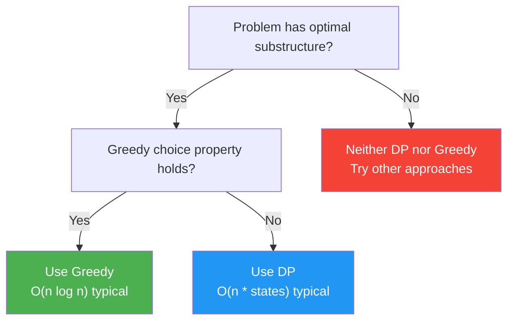
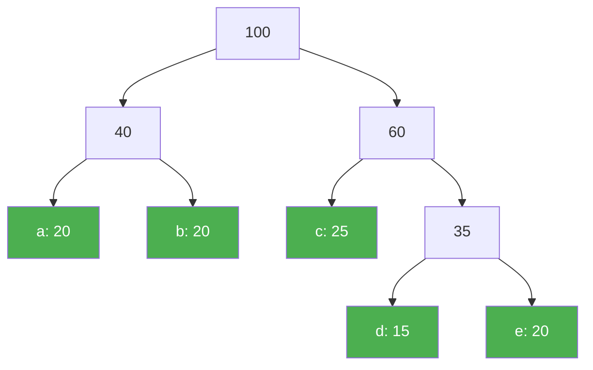
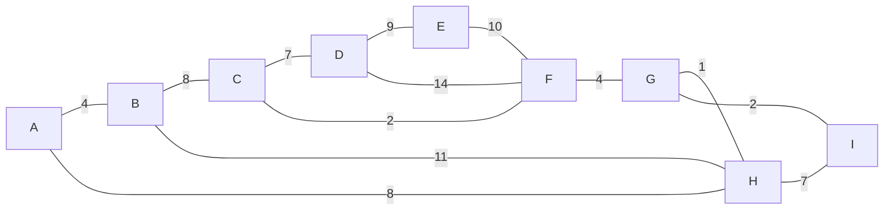
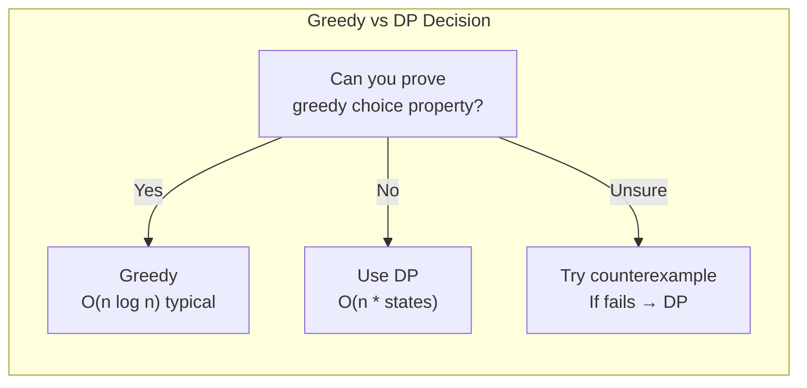

# Greedy Algorithms

A greedy algorithm makes the locally optimal choice at each step, hoping that these local choices lead to a globally optimal solution. Unlike dynamic programming, which considers all possible subproblems, a greedy algorithm commits to a choice and never looks back. When the problem has the right structure, this one-directional strategy produces optimal results in a fraction of the time DP would take.

The catch: greedy does not always work. Knowing *when* it works and *when* it fails is the real skill.

## The Two Properties

A problem is amenable to a greedy approach when it has both:

### 1. Greedy Choice Property

A globally optimal solution can be assembled by making locally optimal (greedy) choices. You can prove this by showing that any solution can be modified to include the greedy choice without worsening it (an "exchange argument").

### 2. Optimal Substructure

An optimal solution to the problem contains optimal solutions to its subproblems. This property is shared with dynamic programming — the difference is that greedy problems also satisfy the greedy choice property, so you only need to solve *one* subproblem at each step instead of all of them.



## The Greedy Template

Most greedy algorithms follow this pattern:

1. **Sort** or otherwise order the input by some criterion
2. **Iterate** through the sorted input
3. **Greedily select** each element if it is compatible with previous choices
4. **Return** the accumulated result

**TypeScript:**

```typescript
function greedyTemplate<T>(
  items: T[],
  comparator: (a: T, b: T) => number,
  isCompatible: (selected: T[], candidate: T) => boolean
): T[] {
  const sorted = [...items].sort(comparator);
  const result: T[] = [];

  for (const item of sorted) {
    if (isCompatible(result, item)) {
      result.push(item);
    }
  }

  return result;
}
```

**Python:**

```python
from typing import TypeVar, Callable

T = TypeVar('T')

def greedy_template(
    items: list[T],
    key: Callable[[T], any],
    is_compatible: Callable[[list[T], T], bool]
) -> list[T]:
    sorted_items = sorted(items, key=key)
    result: list[T] = []

    for item in sorted_items:
        if is_compatible(result, item):
            result.append(item)

    return result
```

## Activity Selection (Interval Scheduling)

**Problem:** Given $n$ activities with start and finish times, select the maximum number of non-overlapping activities.

**Greedy strategy:** Always pick the activity that finishes earliest. This leaves the most room for subsequent activities.

### Proof Sketch (Exchange Argument)

Let $A$ be an optimal solution and let $g$ be the activity with the earliest finish time. If $g \in A$, done. If $g \notin A$, let $a_1$ be the first activity in $A$ (by finish time). Since $g$ finishes no later than $a_1$, we can replace $a_1$ with $g$ without creating conflicts. The resulting set is still optimal and includes the greedy choice.

$$
\text{finish}(g) \leq \text{finish}(a_1) \implies A' = (A \setminus \{a_1\}) \cup \{g\} \text{ is optimal}
$$

**TypeScript:**

```typescript
interface Activity {
  start: number;
  finish: number;
  name: string;
}

function activitySelection(activities: Activity[]): Activity[] {
  // Sort by finish time
  const sorted = [...activities].sort((a, b) => a.finish - b.finish);
  const selected: Activity[] = [sorted[0]];

  let lastFinish = sorted[0].finish;

  for (let i = 1; i < sorted.length; i++) {
    if (sorted[i].start >= lastFinish) {
      selected.push(sorted[i]);
      lastFinish = sorted[i].finish;
    }
  }

  return selected;
}

// Example
const activities: Activity[] = [
  { start: 1, finish: 4, name: "A" },
  { start: 3, finish: 5, name: "B" },
  { start: 0, finish: 6, name: "C" },
  { start: 5, finish: 7, name: "D" },
  { start: 3, finish: 9, name: "E" },
  { start: 5, finish: 9, name: "F" },
  { start: 6, finish: 10, name: "G" },
  { start: 8, finish: 11, name: "H" },
];
// Result: A, D, H (3 activities)
```

**Python:**

```python
from dataclasses import dataclass

@dataclass
class Activity:
    start: int
    finish: int
    name: str

def activity_selection(activities: list[Activity]) -> list[Activity]:
    sorted_acts = sorted(activities, key=lambda a: a.finish)
    selected = [sorted_acts[0]]
    last_finish = sorted_acts[0].finish

    for act in sorted_acts[1:]:
        if act.start >= last_finish:
            selected.append(act)
            last_finish = act.finish

    return selected
```

| Metric | Value |
|--------|-------|
| Time Complexity | $O(n \log n)$ for sorting |
| Space Complexity | $O(n)$ for sorted copy |
| Greedy Criterion | Earliest finish time |

## Interval Scheduling Variants

### Interval Partitioning (Minimum Rooms)

**Problem:** Given $n$ intervals, find the minimum number of rooms/resources needed so no two overlapping intervals share a room.

**Greedy strategy:** Sort by start time. Use a min-heap to track the earliest ending room. If the earliest-ending room is free, reuse it. Otherwise, allocate a new room.

**TypeScript:**

```typescript
function minRooms(intervals: [number, number][]): number {
  if (intervals.length === 0) return 0;

  const sorted = [...intervals].sort((a, b) => a[0] - b[0]);

  // Min-heap of end times (simulated with sorted array)
  const endTimes: number[] = [sorted[0][1]];

  for (let i = 1; i < sorted.length; i++) {
    const [start, end] = sorted[i];

    // Find the earliest ending room
    endTimes.sort((a, b) => a - b);

    if (start >= endTimes[0]) {
      endTimes.shift(); // reuse this room
    }
    endTimes.push(end);
  }

  return endTimes.length;
}
```

**Python:**

```python
import heapq

def min_rooms(intervals: list[tuple[int, int]]) -> int:
    if not intervals:
        return 0

    sorted_intervals = sorted(intervals, key=lambda x: x[0])
    heap = [sorted_intervals[0][1]]  # end time of first interval

    for start, end in sorted_intervals[1:]:
        if start >= heap[0]:
            heapq.heapreplace(heap, end)  # reuse room
        else:
            heapq.heappush(heap, end)  # new room

    return len(heap)
```

::: tip
The minimum number of rooms equals the maximum number of overlapping intervals at any point. This is the "depth" of the interval set. The greedy approach with a heap computes this in $O(n \log n)$.
:::

### Weighted Interval Scheduling

When intervals have weights (profits), greedy no longer works — you need DP. This is a critical distinction for interviews.

$$
\text{OPT}(j) = \max\bigl(\text{OPT}(j-1),\; w_j + \text{OPT}(p(j))\bigr)
$$

where $p(j)$ is the latest interval that does not overlap with $j$.

## Huffman Coding

Huffman coding produces an optimal prefix-free binary code for a set of characters based on their frequencies. Characters that appear more frequently get shorter codes.



**Algorithm:**
1. Create a leaf node for each character with its frequency
2. Insert all nodes into a min-heap (priority queue)
3. While the heap has more than one node:
   - Extract the two nodes with minimum frequency
   - Create a new internal node with these two as children, frequency = sum
   - Insert the new node back into the heap
4. The remaining node is the root of the Huffman tree

**TypeScript:**

```typescript
interface HuffmanNode {
  char: string | null;
  freq: number;
  left: HuffmanNode | null;
  right: HuffmanNode | null;
}

function buildHuffmanTree(freqs: Map<string, number>): HuffmanNode {
  // Simple priority queue (use a proper heap in production)
  const nodes: HuffmanNode[] = [];

  for (const [char, freq] of freqs) {
    nodes.push({ char, freq, left: null, right: null });
  }

  while (nodes.length > 1) {
    nodes.sort((a, b) => a.freq - b.freq);

    const left = nodes.shift()!;
    const right = nodes.shift()!;

    const parent: HuffmanNode = {
      char: null,
      freq: left.freq + right.freq,
      left,
      right,
    };

    nodes.push(parent);
  }

  return nodes[0];
}

function generateCodes(
  node: HuffmanNode | null,
  prefix = "",
  codes = new Map<string, string>()
): Map<string, string> {
  if (!node) return codes;

  if (node.char !== null) {
    codes.set(node.char, prefix || "0");
    return codes;
  }

  generateCodes(node.left, prefix + "0", codes);
  generateCodes(node.right, prefix + "1", codes);

  return codes;
}
```

**Python:**

```python
import heapq
from dataclasses import dataclass, field

@dataclass(order=True)
class HuffmanNode:
    freq: int
    char: str | None = field(compare=False, default=None)
    left: 'HuffmanNode | None' = field(compare=False, default=None)
    right: 'HuffmanNode | None' = field(compare=False, default=None)

def build_huffman_tree(freqs: dict[str, int]) -> HuffmanNode:
    heap = [HuffmanNode(freq=f, char=c) for c, f in freqs.items()]
    heapq.heapify(heap)

    while len(heap) > 1:
        left = heapq.heappop(heap)
        right = heapq.heappop(heap)
        merged = HuffmanNode(
            freq=left.freq + right.freq,
            left=left,
            right=right
        )
        heapq.heappush(heap, merged)

    return heap[0]

def generate_codes(
    node: HuffmanNode | None,
    prefix: str = "",
    codes: dict[str, str] | None = None
) -> dict[str, str]:
    if codes is None:
        codes = {}
    if node is None:
        return codes
    if node.char is not None:
        codes[node.char] = prefix or "0"
        return codes

    generate_codes(node.left, prefix + "0", codes)
    generate_codes(node.right, prefix + "1", codes)
    return codes
```

### Huffman Optimality

Huffman coding produces the optimal prefix-free code. The expected code length is:

$$
L = \sum_{i=1}^{n} p_i \cdot l_i
$$

where $p_i$ is the probability of character $i$ and $l_i$ is its code length. The lower bound is the entropy:

$$
H = -\sum_{i=1}^{n} p_i \log_2 p_i
$$

Huffman coding satisfies $H \leq L < H + 1$.

## Fractional Knapsack

**Problem:** Given $n$ items with weights and values, and a knapsack capacity $W$, maximize value. You can take fractions of items.

**Greedy strategy:** Sort items by value-to-weight ratio. Take items in decreasing ratio order, taking fractions of the last item if needed.

::: warning
**Fractional knapsack** is solvable by greedy. **0/1 knapsack** (must take whole items or nothing) requires DP. This distinction comes up frequently in interviews.
:::

$$
\text{ratio}_i = \frac{v_i}{w_i}
$$

**TypeScript:**

```typescript
interface Item {
  weight: number;
  value: number;
}

function fractionalKnapsack(items: Item[], capacity: number): number {
  // Sort by value-to-weight ratio (descending)
  const sorted = [...items].sort(
    (a, b) => b.value / b.weight - a.value / a.weight
  );

  let totalValue = 0;
  let remaining = capacity;

  for (const item of sorted) {
    if (remaining <= 0) break;

    if (item.weight <= remaining) {
      // Take the whole item
      totalValue += item.value;
      remaining -= item.weight;
    } else {
      // Take a fraction
      const fraction = remaining / item.weight;
      totalValue += item.value * fraction;
      remaining = 0;
    }
  }

  return totalValue;
}
```

**Python:**

```python
def fractional_knapsack(items: list[tuple[int, int]], capacity: int) -> float:
    """Items are (weight, value) tuples."""
    # Sort by value/weight ratio descending
    sorted_items = sorted(items, key=lambda x: x[1] / x[0], reverse=True)

    total_value = 0.0
    remaining = capacity

    for weight, value in sorted_items:
        if remaining <= 0:
            break

        if weight <= remaining:
            total_value += value
            remaining -= weight
        else:
            fraction = remaining / weight
            total_value += value * fraction
            remaining = 0

    return total_value

# Example
items = [(10, 60), (20, 100), (30, 120)]  # (weight, value)
print(fractional_knapsack(items, 50))  # 240.0
```

## Minimum Spanning Trees

A **minimum spanning tree (MST)** of a connected, weighted, undirected graph is a subset of edges that connects all vertices with the minimum total edge weight. It has exactly $V - 1$ edges.

$$
\text{MST weight} = \min \sum_{(u,v) \in T} w(u,v) \quad \text{s.t. } T \text{ spans all vertices}
$$



### Cut Property

For any cut of the graph, the minimum weight edge crossing the cut belongs to some MST. This is the theoretical foundation for both Prim's and Kruskal's algorithms.

### Kruskal's Algorithm

**Strategy:** Sort all edges by weight. Add edges in order, skipping any edge that would create a cycle. Uses Union-Find to detect cycles efficiently.

**TypeScript:**

```typescript
class UnionFind {
  parent: number[];
  rank: number[];

  constructor(n: number) {
    this.parent = Array.from({ length: n }, (_, i) => i);
    this.rank = new Array(n).fill(0);
  }

  find(x: number): number {
    if (this.parent[x] !== x) {
      this.parent[x] = this.find(this.parent[x]); // path compression
    }
    return this.parent[x];
  }

  union(x: number, y: number): boolean {
    const px = this.find(x);
    const py = this.find(y);
    if (px === py) return false; // already connected

    // union by rank
    if (this.rank[px] < this.rank[py]) {
      this.parent[px] = py;
    } else if (this.rank[px] > this.rank[py]) {
      this.parent[py] = px;
    } else {
      this.parent[py] = px;
      this.rank[px]++;
    }
    return true;
  }
}

function kruskal(
  n: number,
  edges: [number, number, number][]
): [number, number, number][] {
  edges.sort((a, b) => a[2] - b[2]); // sort by weight
  const uf = new UnionFind(n);
  const mst: [number, number, number][] = [];

  for (const [u, v, w] of edges) {
    if (uf.union(u, v)) {
      mst.push([u, v, w]);
      if (mst.length === n - 1) break;
    }
  }

  return mst;
}
```

**Python:**

```python
class UnionFind:
    def __init__(self, n: int):
        self.parent = list(range(n))
        self.rank = [0] * n

    def find(self, x: int) -> int:
        if self.parent[x] != x:
            self.parent[x] = self.find(self.parent[x])
        return self.parent[x]

    def union(self, x: int, y: int) -> bool:
        px, py = self.find(x), self.find(y)
        if px == py:
            return False
        if self.rank[px] < self.rank[py]:
            px, py = py, px
        self.parent[py] = px
        if self.rank[px] == self.rank[py]:
            self.rank[px] += 1
        return True

def kruskal(n: int, edges: list[tuple[int, int, int]]) -> list[tuple[int, int, int]]:
    edges.sort(key=lambda e: e[2])
    uf = UnionFind(n)
    mst = []

    for u, v, w in edges:
        if uf.union(u, v):
            mst.append((u, v, w))
            if len(mst) == n - 1:
                break

    return mst
```

### Prim's Algorithm

**Strategy:** Start from any vertex. Repeatedly add the cheapest edge connecting a visited vertex to an unvisited vertex. Uses a min-heap for efficiency.

**TypeScript:**

```typescript
function prim(
  n: number,
  adj: Map<number, [number, number][]>
): [number, number, number][] {
  const visited = new Set<number>();
  const mst: [number, number, number][] = [];

  // Min-heap: [weight, from, to]
  let heap: [number, number, number][] = [];
  visited.add(0);

  for (const [neighbor, weight] of adj.get(0) ?? []) {
    heap.push([weight, 0, neighbor]);
  }
  heap.sort((a, b) => a[0] - b[0]);

  while (heap.length > 0 && mst.length < n - 1) {
    const [w, u, v] = heap.shift()!;

    if (visited.has(v)) continue;
    visited.add(v);
    mst.push([u, v, w]);

    for (const [neighbor, weight] of adj.get(v) ?? []) {
      if (!visited.has(neighbor)) {
        heap.push([weight, v, neighbor]);
        heap.sort((a, b) => a[0] - b[0]);
      }
    }
  }

  return mst;
}
```

**Python:**

```python
import heapq

def prim(n: int, adj: dict[int, list[tuple[int, int]]]) -> list[tuple[int, int, int]]:
    visited = set()
    mst: list[tuple[int, int, int]] = []

    # (weight, from, to)
    heap: list[tuple[int, int, int]] = [(w, 0, v) for v, w in adj.get(0, [])]
    heapq.heapify(heap)
    visited.add(0)

    while heap and len(mst) < n - 1:
        w, u, v = heapq.heappop(heap)
        if v in visited:
            continue
        visited.add(v)
        mst.append((u, v, w))

        for neighbor, weight in adj.get(v, []):
            if neighbor not in visited:
                heapq.heappush(heap, (weight, v, neighbor))

    return mst
```

### Kruskal's vs Prim's

| Aspect | Kruskal's | Prim's |
|--------|-----------|--------|
| Strategy | Edge-centric (sort all edges) | Vertex-centric (grow from a vertex) |
| Data Structure | Union-Find | Min-Heap |
| Time Complexity | $O(E \log E)$ | $O(E \log V)$ with binary heap |
| Best for | Sparse graphs ($E \approx V$) | Dense graphs ($E \approx V^2$) |
| Implementation | Simpler | Slightly more complex |

## When Greedy Fails

Greedy algorithms fail when the greedy choice property does not hold. Recognizing these cases is critical for interviews.

### Classic Failures

| Problem | Why Greedy Fails | Correct Approach |
|---------|-----------------|-----------------|
| 0/1 Knapsack | Taking highest ratio item may block a better combination | DP |
| Coin Change (arbitrary denominations) | Largest coin first can miss valid combinations | DP |
| Longest Path in general graph | Greedy shortest path logic does not reverse | DP or backtracking |
| Traveling Salesman | Nearest neighbor heuristic gives suboptimal tours | DP with bitmask |

### Coin Change Example

With denominations $\{1, 3, 4\}$ and target $6$:
- **Greedy:** $4 + 1 + 1 = 3$ coins
- **Optimal:** $3 + 3 = 2$ coins

Greedy fails because taking the largest coin first blocks a better combination.

::: tip Interview Signal
When asked "can we use greedy here?", the strongest answer is to either:
1. **Prove it works** with an exchange argument, or
2. **Give a counterexample** showing it fails

Don't just say "I think greedy works." Justify or refute it.
:::

## Common Greedy Problems for Interviews

| Problem | Greedy Criterion | Complexity |
|---------|-----------------|------------|
| Activity Selection | Earliest finish time | $O(n \log n)$ |
| Job Sequencing with Deadlines | Highest profit first | $O(n^2)$ or $O(n \log n)$ |
| Huffman Coding | Lowest frequency merge | $O(n \log n)$ |
| Fractional Knapsack | Highest value/weight ratio | $O(n \log n)$ |
| Minimum Platforms | Sort arrivals + departures | $O(n \log n)$ |
| Gas Station Circuit | Net fuel surplus | $O(n)$ |
| Jump Game | Maximum reachable index | $O(n)$ |
| Task Scheduler | Most frequent task first | $O(n)$ |

## Complexity Summary



## Practice Strategy

1. **Start with activity selection** — the canonical greedy problem
2. **Implement Kruskal's and Prim's** — MST is a top interview topic
3. **Solve Huffman coding** — tests heap + greedy together
4. **Practice recognizing when greedy fails** — coin change and 0/1 knapsack are the key counterexamples
5. **Always try to prove correctness** — exchange arguments become natural with practice

## Further Reading

- [Dynamic Programming](/algorithms/dynamic-programming) — when greedy fails, DP is usually the answer
- [Graphs](/algorithms/graphs) — MST algorithms in the context of graph theory
- [Heaps & Priority Queues](/algorithms/heaps-priority-queues) — the data structure powering Huffman and Prim's
- [Advanced Data Structures](/algorithms/advanced-data-structures) — Union-Find used in Kruskal's
- [Math Patterns in System Design](/algorithms/system-design-math) — estimation and optimization in practice

## Try It Yourself

**Problem 1:** Given activities with (start, finish) times: (1,4), (3,5), (0,6), (5,7), (3,9), (5,9), (6,10), (8,11), select the maximum number of non-overlapping activities.

::: details Solution
Sort by finish time: (1,4), (3,5), (0,6), (5,7), (3,9), (5,9), (6,10), (8,11).
Greedy: always pick the activity with the earliest finish time that does not overlap:
- Pick (1,4). lastFinish=4.
- Skip (3,5): start 3 < 4.
- Skip (0,6): start 0 < 4.
- Pick (5,7): start 5 >= 4. lastFinish=7.
- Skip (3,9), (5,9), (6,10): starts < 7.
- Pick (8,11): start 8 >= 7.
Answer: **3 activities**: (1,4), (5,7), (8,11).
:::

**Problem 2:** Given items with (weight, value): (10, 60), (20, 100), (30, 120) and knapsack capacity 50, solve the fractional knapsack.

::: details Solution
Calculate value/weight ratios: 60/10=6, 100/20=5, 120/30=4.
Sort by ratio descending: (10,60,ratio=6), (20,100,ratio=5), (30,120,ratio=4).
- Take item 1 entirely: weight=10, value=60. Remaining=40.
- Take item 2 entirely: weight=20, value=100. Remaining=20.
- Take 20/30 of item 3: value = 120 * (20/30) = 80.
Total value: 60 + 100 + 80 = **240.0**
:::

**Problem 3:** Given intervals [(0,30), (5,10), (15,20)], find the minimum number of meeting rooms required.

::: details Solution
Sort by start time: (0,30), (5,10), (15,20).
Use a min-heap of end times:
- (0,30): heap=[30], rooms=1
- (5,10): 5 < 30, need new room. heap=[10, 30], rooms=2
- (15,20): 15 >= 10, reuse room. heap=[20, 30], rooms=2
Answer: **2 rooms**
:::

**Problem 4:** Show that greedy fails for the coin change problem with denominations [1, 3, 4] and target 6.

::: details Solution
Greedy approach (largest coin first):
- Take 4 (remaining: 2)
- Take 1 (remaining: 1)
- Take 1 (remaining: 0)
- Total: **3 coins** (4 + 1 + 1)

Optimal approach:
- Take 3 + 3 = **2 coins**

Greedy fails because taking the largest coin first blocks a better combination. The greedy choice property does not hold for arbitrary coin denominations.
:::

**Problem 5:** Use Kruskal's algorithm to find the MST of a graph with edges: (A,B,4), (A,C,8), (B,C,11), (B,D,8), (C,D,7), (C,E,1), (D,E,2).

::: details Solution
Sort edges by weight: (C,E,1), (D,E,2), (A,B,4), (C,D,7), (A,C,8), (B,D,8), (B,C,11).
Process with Union-Find:
- (C,E,1): add. Components: {A},{B},{C,E},{D}
- (D,E,2): add. Components: {A},{B},{C,D,E}
- (A,B,4): add. Components: {A,B},{C,D,E}
- (C,D,7): C and D already connected. Skip.
- (A,C,8): add. All connected.
MST edges: **(C,E,1), (D,E,2), (A,B,4), (A,C,8)**. Total weight: **15**.
:::

## Quick Quiz

**1. What two properties must a problem have for a greedy algorithm to produce an optimal solution?**
- a) Overlapping subproblems and optimal substructure
- b) Greedy choice property and optimal substructure
- c) Divide and conquer structure and greedy choice property
- d) Polynomial time and greedy choice property

::: details Answer
**b) Greedy choice property and optimal substructure** — The greedy choice property means a locally optimal choice leads to a globally optimal solution. Optimal substructure means the optimal solution contains optimal solutions to subproblems.
:::

**2. Why does greedy work for the fractional knapsack but not for the 0/1 knapsack?**
- a) Fractional knapsack has fewer items
- b) In fractional knapsack you can take parts of items, so the highest-ratio item is always worth taking; in 0/1 you must take whole items, and a high-ratio item may waste capacity
- c) 0/1 knapsack is NP-hard
- d) Greedy works for both

::: details Answer
**b) In fractional knapsack you can take parts of items, so the highest-ratio item is always worth taking; in 0/1 you must take whole items, and a high-ratio item may waste capacity** — Taking fractions ensures you never "waste" capacity, making the greedy choice (best ratio) always optimal. With whole items, a high-ratio item may leave capacity that could have been better filled by a different combination.
:::

**3. In Kruskal's MST algorithm, how are cycles detected?**
- a) BFS
- b) DFS
- c) Union-Find (Disjoint Set Union)
- d) Adjacency matrix lookup

::: details Answer
**c) Union-Find (Disjoint Set Union)** — Before adding an edge $(u, v)$, check if $u$ and $v$ are already in the same set using `find()`. If they are, adding the edge would create a cycle.
:::

**4. What is the time complexity of Huffman coding for $n$ characters?**
- a) $O(n)$
- b) $O(n \log n)$
- c) $O(n^2)$
- d) $O(2^n)$

::: details Answer
**b) $O(n \log n)$** — Building the initial heap takes $O(n)$. Extracting and inserting into the heap happens $n-1$ times, each taking $O(\log n)$, giving $O(n \log n)$ overall.
:::

**5. How do you formally prove that a greedy algorithm is correct?**
- a) Run it on several test cases
- b) Use an exchange argument: show that any optimal solution can be modified to include the greedy choice without worsening it
- c) Compare it to the brute-force solution
- d) Prove it runs in polynomial time

::: details Answer
**b) Use an exchange argument: show that any optimal solution can be modified to include the greedy choice without worsening it** — The exchange argument takes an arbitrary optimal solution and shows you can swap out a non-greedy choice for the greedy choice without losing optimality, proving the greedy strategy is correct.
:::
