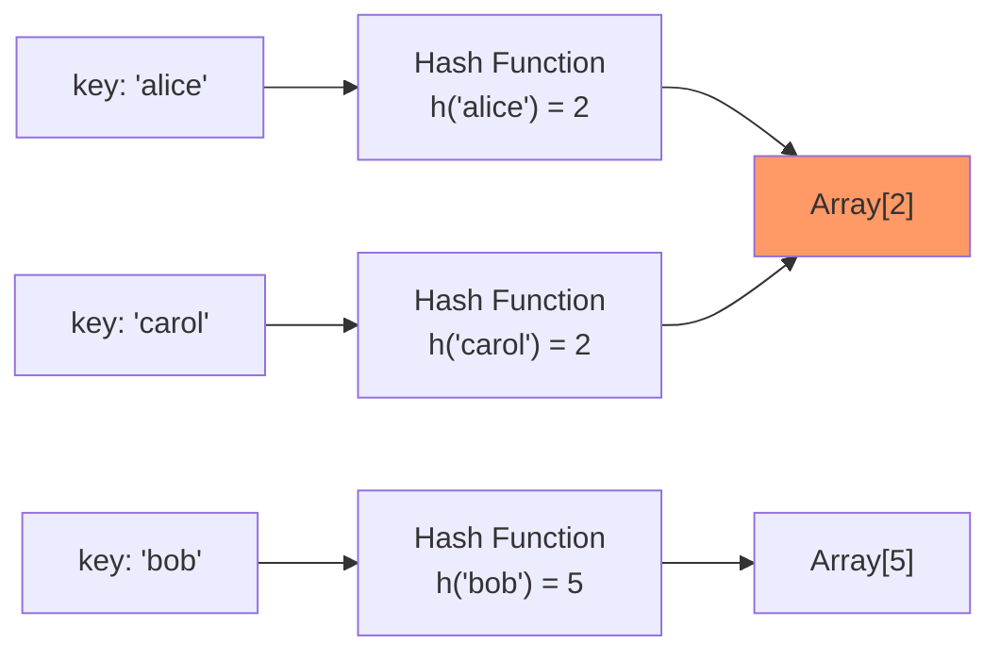
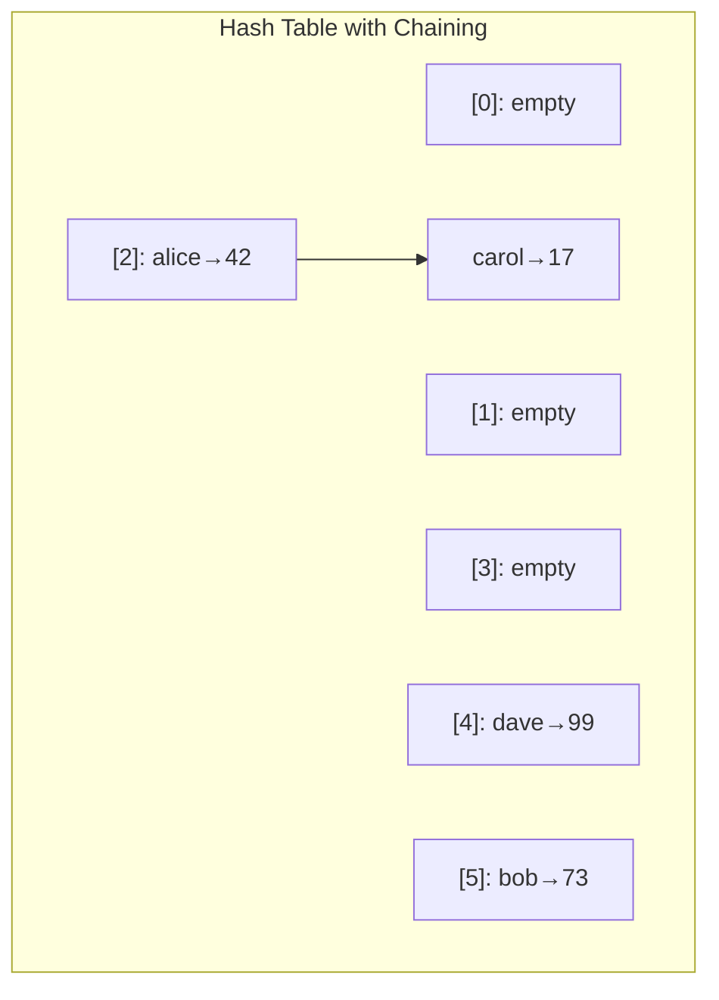

# Hash Tables

Hash tables are the single most important data structure in practical programming. They power dictionaries, sets, caches, database indexes, routers, and virtually every system that needs fast key-value access. The average $O(1)$ lookup time they provide is so ubiquitous that most programmers take it for granted — but understanding how they work under the hood is critical for knowing when that $O(1)$ guarantee breaks down.

## How Hash Tables Work

A hash table maps keys to values through three components:

1. **Hash function**: Converts a key into an integer (the hash code)
2. **Array**: Stores key-value pairs at positions determined by the hash
3. **Collision resolution**: Handles the inevitable case where two keys hash to the same position



*'alice' and 'carol' hash to the same index — a collision.*

## Hash Functions

A good hash function satisfies three properties:

1. **Deterministic**: Same input always produces same output
2. **Uniform distribution**: Outputs are spread evenly across the range
3. **Efficiency**: Fast to compute

### Hash Function Examples

**TypeScript:**

```typescript
// Simple string hash (djb2 algorithm)
function hash(key: string, tableSize: number): number {
  let h = 5381;
  for (let i = 0; i < key.length; i++) {
    h = ((h << 5) + h + key.charCodeAt(i)) & 0xffffffff;
  }
  return Math.abs(h) % tableSize;
}

// Integer hash (multiply-shift)
function hashInt(key: number, tableSize: number): number {
  // Knuth's multiplicative hash
  const A = 2654435769; // 2^32 * (sqrt(5) - 1) / 2
  return ((key * A) >>> 0) % tableSize;
}
```

**Python:**

```python
def hash_string(key: str, table_size: int) -> int:
    """djb2 hash function."""
    h = 5381
    for char in key:
        h = ((h << 5) + h + ord(char)) & 0xFFFFFFFF
    return h % table_size

# Python's built-in hash() is already excellent:
# hash("hello") → deterministic integer
# Use hash(key) % table_size for indexing
```

::: warning
Never use a hash function as a security mechanism. Cryptographic hash functions (SHA-256, bcrypt) are designed for security. Hash table hash functions are designed for speed and distribution — they are not collision-resistant against an adversary.
:::

### Hash Function Quality

A poor hash function causes clustering — many keys landing in the same bucket. This degrades $O(1)$ operations to $O(n)$. Example of a terrible hash function: `h(key) = len(key) % table_size` — all strings of the same length collide.

## Collision Resolution

### Method 1: Separate Chaining

Each bucket stores a linked list (or another collection) of entries that hash to that index.



**TypeScript:**

```typescript
class HashTableChaining<V> {
  private buckets: [string, V][][];
  private count: number = 0;
  private capacity: number;

  constructor(capacity = 16) {
    this.capacity = capacity;
    this.buckets = Array.from({ length: capacity }, () => []);
  }

  private hash(key: string): number {
    let h = 5381;
    for (let i = 0; i < key.length; i++) {
      h = ((h << 5) + h + key.charCodeAt(i)) & 0xffffffff;
    }
    return Math.abs(h) % this.capacity;
  }

  set(key: string, value: V): void {
    const idx = this.hash(key);
    const bucket = this.buckets[idx];

    for (const entry of bucket) {
      if (entry[0] === key) {
        entry[1] = value;
        return;
      }
    }

    bucket.push([key, value]);
    this.count++;

    if (this.count / this.capacity > 0.75) {
      this.resize();
    }
  }

  get(key: string): V | undefined {
    const idx = this.hash(key);
    for (const [k, v] of this.buckets[idx]) {
      if (k === key) return v;
    }
    return undefined;
  }

  delete(key: string): boolean {
    const idx = this.hash(key);
    const bucket = this.buckets[idx];

    for (let i = 0; i < bucket.length; i++) {
      if (bucket[i][0] === key) {
        bucket.splice(i, 1);
        this.count--;
        return true;
      }
    }
    return false;
  }

  private resize(): void {
    const oldBuckets = this.buckets;
    this.capacity *= 2;
    this.buckets = Array.from({ length: this.capacity }, () => []);
    this.count = 0;

    for (const bucket of oldBuckets) {
      for (const [key, value] of bucket) {
        this.set(key, value);
      }
    }
  }
}
```

**Python:**

```python
class HashTableChaining:
    def __init__(self, capacity=16):
        self.capacity = capacity
        self.buckets: list[list[tuple[str, any]]] = [[] for _ in range(capacity)]
        self.count = 0

    def _hash(self, key: str) -> int:
        return hash(key) % self.capacity

    def set(self, key: str, value) -> None:
        idx = self._hash(key)
        bucket = self.buckets[idx]

        for i, (k, v) in enumerate(bucket):
            if k == key:
                bucket[i] = (key, value)
                return

        bucket.append((key, value))
        self.count += 1

        if self.count / self.capacity > 0.75:
            self._resize()

    def get(self, key: str):
        idx = self._hash(key)
        for k, v in self.buckets[idx]:
            if k == key:
                return v
        return None

    def delete(self, key: str) -> bool:
        idx = self._hash(key)
        bucket = self.buckets[idx]
        for i, (k, v) in enumerate(bucket):
            if k == key:
                bucket.pop(i)
                self.count -= 1
                return True
        return False

    def _resize(self) -> None:
        old_buckets = self.buckets
        self.capacity *= 2
        self.buckets = [[] for _ in range(self.capacity)]
        self.count = 0
        for bucket in old_buckets:
            for key, value in bucket:
                self.set(key, value)
```

### Method 2: Open Addressing

All entries are stored in the array itself. When a collision occurs, probe for the next available slot.

**Linear Probing**: Check index $h$, $h+1$, $h+2$, ... (wrapping around). Simple but suffers from primary clustering.

**Quadratic Probing**: Check $h$, $h+1^2$, $h+2^2$, $h+3^2$, ... Reduces primary clustering but can miss slots.

**Double Hashing**: Use a second hash function for the probe step: $h_1(k) + i \cdot h_2(k)$. Best distribution.

**TypeScript (Linear Probing):**

```typescript
class HashTableLinearProbe<V> {
  private keys: (string | null)[];
  private values: (V | null)[];
  private capacity: number;
  private count: number = 0;
  private readonly DELETED = "__DELETED__";

  constructor(capacity = 16) {
    this.capacity = capacity;
    this.keys = new Array(capacity).fill(null);
    this.values = new Array(capacity).fill(null);
  }

  private hash(key: string): number {
    let h = 5381;
    for (let i = 0; i < key.length; i++) {
      h = ((h << 5) + h + key.charCodeAt(i)) & 0xffffffff;
    }
    return Math.abs(h) % this.capacity;
  }

  set(key: string, value: V): void {
    if (this.count / this.capacity > 0.5) this.resize();

    let idx = this.hash(key);
    while (this.keys[idx] !== null && this.keys[idx] !== this.DELETED) {
      if (this.keys[idx] === key) {
        this.values[idx] = value;
        return;
      }
      idx = (idx + 1) % this.capacity;
    }

    this.keys[idx] = key;
    this.values[idx] = value;
    this.count++;
  }

  get(key: string): V | undefined {
    let idx = this.hash(key);
    while (this.keys[idx] !== null) {
      if (this.keys[idx] === key) return this.values[idx]!;
      idx = (idx + 1) % this.capacity;
    }
    return undefined;
  }

  delete(key: string): boolean {
    let idx = this.hash(key);
    while (this.keys[idx] !== null) {
      if (this.keys[idx] === key) {
        this.keys[idx] = this.DELETED as any;
        this.values[idx] = null;
        this.count--;
        return true;
      }
      idx = (idx + 1) % this.capacity;
    }
    return false;
  }

  private resize(): void {
    const oldKeys = this.keys;
    const oldValues = this.values;
    this.capacity *= 2;
    this.keys = new Array(this.capacity).fill(null);
    this.values = new Array(this.capacity).fill(null);
    this.count = 0;

    for (let i = 0; i < oldKeys.length; i++) {
      if (oldKeys[i] !== null && oldKeys[i] !== this.DELETED) {
        this.set(oldKeys[i]!, oldValues[i]!);
      }
    }
  }
}
```

### Chaining vs Open Addressing

| Criterion | Chaining | Open Addressing |
|---|---|---|
| Load factor tolerance | Works well even above 1.0 | Degrades badly above 0.7 |
| Cache performance | Poor (pointer chasing) | Excellent (contiguous memory) |
| Deletion | Simple (remove from list) | Requires tombstones |
| Memory overhead | Extra pointers per node | None (but needs lower load factor) |
| Implementation | Simpler | More complex |
| Used by | Java `HashMap`, Go `map` | Python `dict`, Rust `HashMap` |

## Load Factor and Resizing

The **load factor** is $\alpha = \frac{n}{m}$ where $n$ is the number of entries and $m$ is the table size.

- For chaining: expected chain length is $\alpha$. Performance degrades linearly.
- For open addressing: expected probes per lookup is $\frac{1}{1 - \alpha}$. At $\alpha = 0.5$: 2 probes. At $\alpha = 0.9$: 10 probes. At $\alpha = 0.99$: 100 probes.

::: danger
Open addressing with a load factor above 0.7 is a performance disaster. Most implementations resize at 0.5-0.75. Python's `dict` resizes when the table is 2/3 full.
:::

### Resizing Strategy

When the load factor exceeds the threshold:
1. Allocate a new table with 2x capacity
2. Rehash all existing entries (hash values change because the modulus changes)
3. This is $O(n)$ per resize, but happens infrequently enough that amortized insertion is still $O(1)$

## Consistent Hashing

Standard hash tables break catastrophically when the table size changes — all entries must be rehashed. In distributed systems, this means adding or removing a server requires moving most data. **Consistent hashing** solves this by minimizing data movement.

See the full deep dive at [Consistent Hashing](/system-design/distributed-systems/consistent-hashing).

Key insight: Map both keys and servers onto a ring (hash space). Each key is handled by the nearest server clockwise on the ring. Adding/removing a server only affects the keys in its arc.

## Common Interview Patterns

### Pattern 1: Frequency Counting

Count occurrences of elements. The most basic hash map pattern.

**Python:**

```python
from collections import Counter

def top_k_frequent(nums: list[int], k: int) -> list[int]:
    count = Counter(nums)
    return [num for num, _ in count.most_common(k)]

def group_anagrams(strs: list[str]) -> list[list[str]]:
    groups: dict[str, list[str]] = {}
    for s in strs:
        key = "".join(sorted(s))
        groups.setdefault(key, []).append(s)
    return list(groups.values())
```

### Pattern 2: Two Sum (Hash Map Complement Lookup)

For each element, check if its complement exists in the map.

**TypeScript:**

```typescript
function twoSum(nums: number[], target: number): [number, number] {
  const seen = new Map<number, number>(); // value → index

  for (let i = 0; i < nums.length; i++) {
    const complement = target - nums[i];
    if (seen.has(complement)) {
      return [seen.get(complement)!, i];
    }
    seen.set(nums[i], i);
  }

  return [-1, -1];
}
```

**Python:**

```python
def two_sum(nums: list[int], target: int) -> tuple[int, int]:
    seen: dict[int, int] = {}  # value → index
    for i, num in enumerate(nums):
        complement = target - num
        if complement in seen:
            return (seen[complement], i)
        seen[num] = i
    return (-1, -1)
```

**Complexity:** $O(n)$ time, $O(n)$ space.

### Pattern 3: Subarray with Given Sum (Prefix Sum + Hash Map)

Use a hash map to store prefix sums. See [Arrays & Strings: Prefix Sums](/algorithms/arrays-strings#pattern-3-prefix-sums).

**Python:**

```python
def subarray_sum(nums: list[int], k: int) -> int:
    prefix_count = {0: 1}
    current_sum = 0
    count = 0

    for num in nums:
        current_sum += num
        count += prefix_count.get(current_sum - k, 0)
        prefix_count[current_sum] = prefix_count.get(current_sum, 0) + 1

    return count
```

### Pattern 4: Sliding Window + Hash Map

Track character frequencies in a window. See [Arrays & Strings: Sliding Window](/algorithms/arrays-strings#pattern-2-sliding-window).

### Pattern 5: Hash Set for O(1) Existence Check

**Python:**

```python
def longest_consecutive(nums: list[int]) -> int:
    """Find the longest consecutive sequence."""
    num_set = set(nums)
    max_length = 0

    for num in num_set:
        # Only start counting from the beginning of a sequence
        if num - 1 not in num_set:
            length = 1
            while num + length in num_set:
                length += 1
            max_length = max(max_length, length)

    return max_length
```

**Complexity:** $O(n)$ time despite the nested while loop — each number is visited at most twice (once in the for loop, once in the while loop).

### Pattern 6: Design Hash Map / Hash Set

A common interview question — implement a hash map from scratch. The implementations in the "Collision Resolution" section above cover this fully.

## Hash Tables in Production

### Language Implementations

| Language | Hash Map | Hash Set | Collision Strategy |
|---|---|---|---|
| Python | `dict` | `set` | Open addressing (probing) |
| JavaScript | `Map` / `Object` | `Set` | Hash table (V8 uses transition trees for objects) |
| Java | `HashMap` | `HashSet` | Chaining (linked list → red-black tree at 8) |
| Go | `map` | N/A (use `map[K]bool`) | Chaining with buckets of 8 |
| C++ | `unordered_map` | `unordered_set` | Chaining |
| Rust | `HashMap` | `HashSet` | Robin Hood open addressing (SwissTable) |

::: tip Java 8+ Optimization
Java's `HashMap` converts chains to red-black trees when a bucket exceeds 8 entries. This bounds worst-case lookup to $O(\log n)$ instead of $O(n)$, preventing hash-flooding DoS attacks.
:::

### Hash-Based DoS Attacks

An attacker who knows your hash function can craft inputs that all collide, turning $O(1)$ operations into $O(n)$. Mitigations:
- **Randomized hash seeds**: Python randomizes `hash()` per process (since 3.3)
- **SipHash**: A cryptographically strong hash function used by Rust, Python, and Ruby for strings
- **Tree-ification**: Java's fallback to red-black trees at bucket size 8

## Complexity Summary

| Operation | Average | Worst Case |
|---|---|---|
| Insert | $O(1)$ | $O(n)$ (all keys collide) |
| Lookup | $O(1)$ | $O(n)$ |
| Delete | $O(1)$ | $O(n)$ |
| Space | $O(n)$ | $O(n)$ |
| Resize | $O(n)$ | $O(n)$ (amortized $O(1)$ per op) |

## Practice Problems

| Problem | Pattern | Difficulty |
|---|---|---|
| Two Sum | Complement lookup | Easy |
| Valid Anagram | Frequency counting | Easy |
| Contains Duplicate | Hash set existence | Easy |
| Group Anagrams | Sorted key → bucket | Medium |
| Longest Consecutive Sequence | Hash set + smart start | Medium |
| Subarray Sum Equals K | Prefix sum + hash map | Medium |
| Top K Frequent Elements | Frequency + heap/bucket sort | Medium |
| LRU Cache | Hash map + doubly linked list | Medium |
| Encode and Decode TinyURL | Hash map (design) | Medium |
| Design HashMap | From scratch | Easy |

## Further Reading

- [Consistent Hashing](/system-design/distributed-systems/consistent-hashing) — hash tables in distributed systems
- [Arrays & Strings](/algorithms/arrays-strings) — prefix sum + hash map pattern
- [Linked Lists](/algorithms/linked-lists) — LRU cache combines hash map with linked list
- [Database Indexing](/system-design/databases/indexing-deep-dive) — hash indexes vs B-tree indexes
- [Bloom Filters](/system-design/distributed-systems/bloom-filters) — probabilistic hash-based data structure

## Try It Yourself

**Problem 1:** Given `nums = [2, 7, 11, 15]` and `target = 9`, find two numbers that add up to the target using a hash map. Return their indices.

::: details Solution
Iterate through the array, storing each number's index in a hash map:
- i=0, num=2: complement = 9-2 = 7. Not in map. map={2:0}
- i=1, num=7: complement = 9-7 = 2. Found 2 at index 0.
Answer: **[0, 1]** (nums[0] + nums[1] = 2 + 7 = 9). Time: $O(n)$, Space: $O(n)$.
:::

**Problem 2:** Group the anagrams in `["eat", "tea", "tan", "ate", "nat", "bat"]`.

::: details Solution
Use a sorted string as the hash key:
- "eat" → sorted key "aet" → group: ["eat"]
- "tea" → sorted key "aet" → group: ["eat", "tea"]
- "tan" → sorted key "ant" → group: ["tan"]
- "ate" → sorted key "aet" → group: ["eat", "tea", "ate"]
- "nat" → sorted key "ant" → group: ["tan", "nat"]
- "bat" → sorted key "abt" → group: ["bat"]
Answer: **[["eat","tea","ate"], ["tan","nat"], ["bat"]]**
:::

**Problem 3:** Find the longest consecutive sequence in `[100, 4, 200, 1, 3, 2]`.

::: details Solution
Put all numbers in a hash set. For each number, only start counting if `num-1` is NOT in the set (this is the start of a sequence):
- 100: 99 not in set → sequence: 100 → length 1
- 4: 3 is in set → skip (not a start)
- 200: 199 not in set → sequence: 200 → length 1
- 1: 0 not in set → sequence: 1, 2, 3, 4 → length 4
Answer: **4** (sequence [1, 2, 3, 4]). Time: $O(n)$.
:::

**Problem 4:** Design a hash table with separate chaining that handles the insertion of keys "alice", "bob", "carol" into a table of size 4, where h("alice")=2, h("bob")=1, h("carol")=2.

::: details Solution
- Insert "alice": bucket[2] = [("alice", val)]
- Insert "bob": bucket[1] = [("bob", val)]
- Insert "carol": collision at bucket[2]! Append to chain: bucket[2] = [("alice", val), ("carol", val)]
Final table: bucket[0]=[], bucket[1]=[("bob", val)], bucket[2]=[("alice", val), ("carol", val)], bucket[3]=[]
:::

**Problem 5:** If a hash table has 12 entries and a capacity of 16, what is its load factor? Should it resize?

::: details Solution
Load factor $\alpha = n / m = 12 / 16 = 0.75$.
- For separate chaining: 0.75 is at the common resize threshold. Most implementations (Java HashMap) resize at 0.75.
- For open addressing: 0.75 is too high; performance degrades significantly above 0.7. It should resize.
Answer: Load factor is **0.75**. Whether to resize depends on the collision strategy, but it is at or past the threshold for most implementations.
:::

## Quick Quiz

**1. What is the average time complexity of hash table lookup?**
- a) $O(\log n)$
- b) $O(n)$
- c) $O(1)$
- d) $O(n \log n)$

::: details Answer
**c) $O(1)$** — With a good hash function and appropriate load factor, hash table operations (insert, lookup, delete) are $O(1)$ on average. The worst case is $O(n)$ when all keys collide.
:::

**2. What happens to hash table performance when the load factor approaches 1.0 with open addressing?**
- a) Performance improves
- b) Performance is unchanged
- c) The expected number of probes per lookup grows dramatically
- d) The hash function becomes faster

::: details Answer
**c) The expected number of probes per lookup grows dramatically** — With open addressing, the expected probes is $1/(1-\alpha)$. At $\alpha=0.9$, this is 10 probes; at $\alpha=0.99$, it is 100 probes.
:::

**3. Why does Java's HashMap convert chains to red-black trees when a bucket exceeds 8 entries?**
- a) To save memory
- b) To prevent worst-case $O(n)$ lookup from hash-flooding DoS attacks
- c) To make insertion faster
- d) To maintain insertion order

::: details Answer
**b) To prevent worst-case $O(n)$ lookup from hash-flooding DoS attacks** — An attacker can craft inputs that all hash to the same bucket. Converting long chains to red-black trees bounds worst-case lookup to $O(\log n)$.
:::

**4. What is the primary advantage of open addressing over separate chaining?**
- a) Simpler deletion
- b) Better cache performance due to contiguous memory
- c) Higher load factor tolerance
- d) No need for a hash function

::: details Answer
**b) Better cache performance due to contiguous memory** — Open addressing stores all entries in the array itself, benefiting from CPU cache locality. Chaining uses linked lists that scatter entries across the heap, causing cache misses.
:::

**5. In the "Subarray Sum Equals K" pattern, what is stored in the hash map?**
- a) Element values and their indices
- b) Prefix sum values and their occurrence counts
- c) Subarray start and end indices
- d) Element frequencies

::: details Answer
**b) Prefix sum values and their occurrence counts** — The hash map stores how many times each prefix sum has occurred. When `current_sum - k` exists in the map, each occurrence represents a subarray that sums to $k$.
:::
