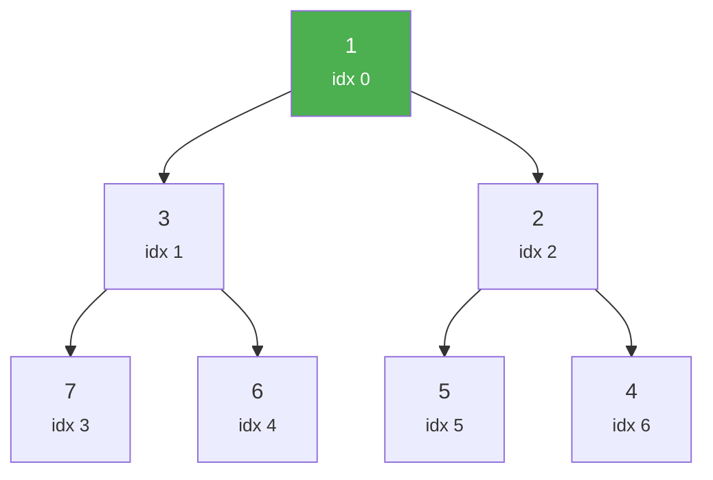
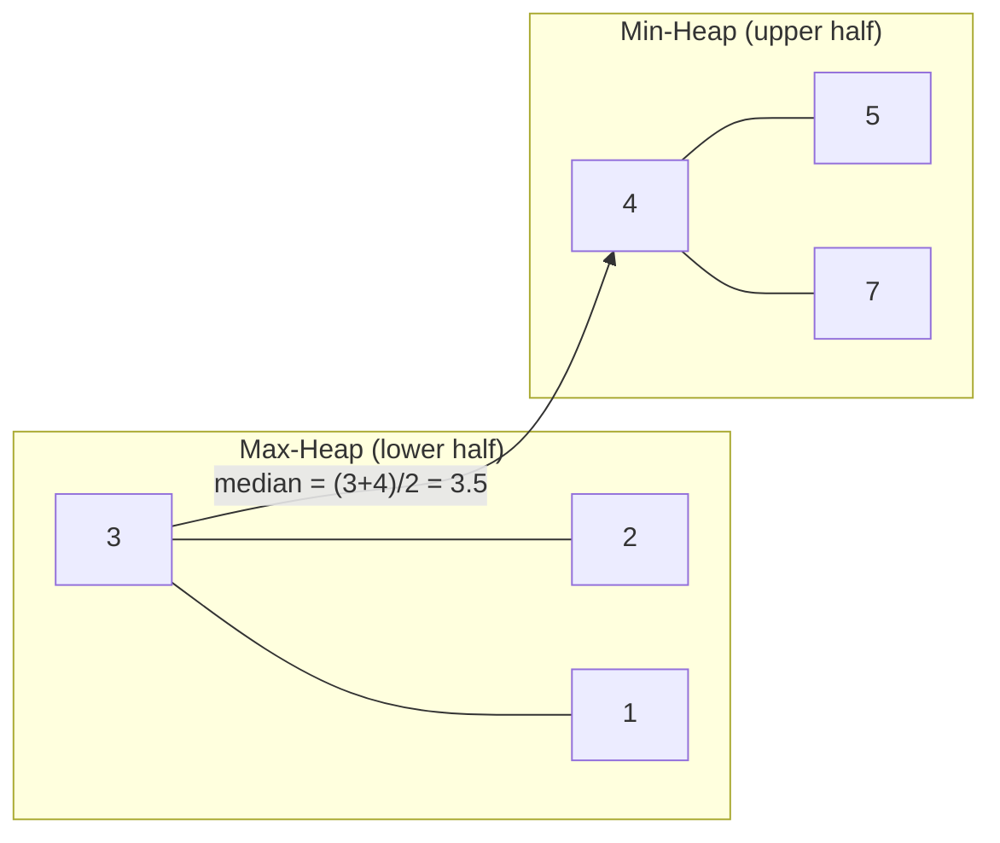

# Heaps & Priority Queues

A heap is a complete binary tree that satisfies the heap property: every parent is smaller (min-heap) or larger (max-heap) than its children. A priority queue is the abstract data type; a heap is the most common implementation. Together, they solve a class of problems — Top-K, scheduling, median maintenance, merge K sorted streams — with elegant efficiency.

## Heap Fundamentals

### Structure

A heap is a **complete binary tree** stored as an array. For a node at index $i$ (0-indexed):

- **Left child**: $2i + 1$
- **Right child**: $2i + 2$
- **Parent**: $\lfloor(i - 1) / 2\rfloor$



**Array representation:** `[1, 3, 2, 7, 6, 5, 4]`

### Min-Heap vs Max-Heap

| Property | Min-Heap | Max-Heap |
|---|---|---|
| Root | Smallest element | Largest element |
| Parent vs children | Parent $\leq$ children | Parent $\geq$ children |
| Extract operation | Returns minimum | Returns maximum |
| Use case | Priority queues, Dijkstra | Max priority, heap sort |

### Operations Complexity

| Operation | Time |
|---|---|
| Insert (push) | $O(\log n)$ |
| Extract min/max (pop) | $O(\log n)$ |
| Peek (get min/max) | $O(1)$ |
| Build heap from array | $O(n)$ |
| Search for arbitrary element | $O(n)$ |
| Delete arbitrary element | $O(n)$ (find) + $O(\log n)$ (remove) |

## Min-Heap Implementation

**TypeScript:**

```typescript
class MinHeap {
  private heap: number[] = [];

  get size(): number {
    return this.heap.length;
  }

  peek(): number | undefined {
    return this.heap[0];
  }

  push(val: number): void {
    this.heap.push(val);
    this.bubbleUp(this.heap.length - 1);
  }

  pop(): number | undefined {
    if (this.heap.length === 0) return undefined;

    const min = this.heap[0];
    const last = this.heap.pop()!;

    if (this.heap.length > 0) {
      this.heap[0] = last;
      this.bubbleDown(0);
    }

    return min;
  }

  private bubbleUp(idx: number): void {
    while (idx > 0) {
      const parent = Math.floor((idx - 1) / 2);
      if (this.heap[parent] <= this.heap[idx]) break;
      [this.heap[parent], this.heap[idx]] = [this.heap[idx], this.heap[parent]];
      idx = parent;
    }
  }

  private bubbleDown(idx: number): void {
    const n = this.heap.length;

    while (true) {
      let smallest = idx;
      const left = 2 * idx + 1;
      const right = 2 * idx + 2;

      if (left < n && this.heap[left] < this.heap[smallest]) smallest = left;
      if (right < n && this.heap[right] < this.heap[smallest]) smallest = right;

      if (smallest === idx) break;

      [this.heap[idx], this.heap[smallest]] = [this.heap[smallest], this.heap[idx]];
      idx = smallest;
    }
  }
}
```

**Python:**

```python
class MinHeap:
    def __init__(self):
        self.heap: list[int] = []

    def __len__(self) -> int:
        return len(self.heap)

    def peek(self) -> int:
        return self.heap[0]

    def push(self, val: int) -> None:
        self.heap.append(val)
        self._bubble_up(len(self.heap) - 1)

    def pop(self) -> int:
        if len(self.heap) == 1:
            return self.heap.pop()

        min_val = self.heap[0]
        self.heap[0] = self.heap.pop()
        self._bubble_down(0)
        return min_val

    def _bubble_up(self, idx: int) -> None:
        while idx > 0:
            parent = (idx - 1) // 2
            if self.heap[parent] <= self.heap[idx]:
                break
            self.heap[parent], self.heap[idx] = self.heap[idx], self.heap[parent]
            idx = parent

    def _bubble_down(self, idx: int) -> None:
        n = len(self.heap)
        while True:
            smallest = idx
            left = 2 * idx + 1
            right = 2 * idx + 2

            if left < n and self.heap[left] < self.heap[smallest]:
                smallest = left
            if right < n and self.heap[right] < self.heap[smallest]:
                smallest = right

            if smallest == idx:
                break

            self.heap[idx], self.heap[smallest] = self.heap[smallest], self.heap[idx]
            idx = smallest
```

::: tip Python's heapq
In practice, use Python's built-in `heapq` module — it's a min-heap implemented in C, much faster than a pure Python implementation.

```python
import heapq

heap = []
heapq.heappush(heap, 5)
heapq.heappush(heap, 2)
heapq.heappush(heap, 8)
smallest = heapq.heappop(heap)  # 2

# For a max-heap, negate values:
heapq.heappush(heap, -10)  # pushes 10 as max
largest = -heapq.heappop(heap)  # 10
```
:::

### Build Heap — Why $O(n)$?

Building a heap by inserting elements one by one is $O(n \log n)$. But building bottom-up (heapifying from the last non-leaf to the root) is $O(n)$.

**Intuition:** Most nodes are near the bottom of the tree and only need to bubble down a few levels. The sum of work across all levels is:

$$
\sum_{h=0}^{\lfloor \log n \rfloor} \frac{n}{2^{h+1}} \cdot O(h) = O(n) \sum_{h=0}^{\infty} \frac{h}{2^{h+1}} = O(n)
$$

**Python:**

```python
def build_heap(arr: list[int]) -> None:
    """In-place heapify. O(n) time."""
    n = len(arr)
    # Start from last non-leaf node
    for i in range(n // 2 - 1, -1, -1):
        heapify_down(arr, n, i)

def heapify_down(arr: list[int], size: int, idx: int) -> None:
    smallest = idx
    left = 2 * idx + 1
    right = 2 * idx + 2

    if left < size and arr[left] < arr[smallest]:
        smallest = left
    if right < size and arr[right] < arr[smallest]:
        smallest = right

    if smallest != idx:
        arr[idx], arr[smallest] = arr[smallest], arr[idx]
        heapify_down(arr, size, smallest)
```

## Top-K Problems

### Kth Largest Element

Use a **min-heap of size K**. After processing all elements, the root is the Kth largest.

**TypeScript:**

```typescript
function findKthLargest(nums: number[], k: number): number {
  const heap = new MinHeap();

  for (const num of nums) {
    heap.push(num);
    if (heap.size > k) {
      heap.pop(); // remove smallest — keeps K largest
    }
  }

  return heap.peek()!;
}
```

**Python:**

```python
import heapq

def find_kth_largest(nums: list[int], k: int) -> int:
    # nlargest is optimized for this exact use case
    return heapq.nlargest(k, nums)[-1]

    # Or manually with a min-heap of size k:
    # heap = []
    # for num in nums:
    #     heapq.heappush(heap, num)
    #     if len(heap) > k:
    #         heapq.heappop(heap)
    # return heap[0]
```

**Complexity:** $O(n \log k)$ time, $O(k)$ space. When $k \ll n$, this is much better than sorting ($O(n \log n)$).

### Top-K Frequent Elements

**Python:**

```python
from collections import Counter
import heapq

def top_k_frequent(nums: list[int], k: int) -> list[int]:
    count = Counter(nums)
    # Use a min-heap of size k based on frequency
    return heapq.nlargest(k, count.keys(), key=count.get)
```

**TypeScript:**

```typescript
function topKFrequent(nums: number[], k: number): number[] {
  const freq = new Map<number, number>();
  for (const num of nums) {
    freq.set(num, (freq.get(num) || 0) + 1);
  }

  // Bucket sort approach — O(n)
  const buckets: number[][] = Array.from({ length: nums.length + 1 }, () => []);
  for (const [num, count] of freq) {
    buckets[count].push(num);
  }

  const result: number[] = [];
  for (let i = buckets.length - 1; i >= 0 && result.length < k; i--) {
    result.push(...buckets[i]);
  }

  return result.slice(0, k);
}
```

## Median Finding (Two Heaps)

Maintain a max-heap for the lower half and a min-heap for the upper half. The median is always at the top of one or both heaps.



**TypeScript:**

```typescript
class MedianFinder {
  private maxHeap: number[] = []; // lower half (negate for max behavior)
  private minHeap: number[] = []; // upper half

  addNum(num: number): void {
    // Always add to maxHeap first (store as negated)
    this.heapPush(this.maxHeap, -num);

    // Balance: max of lower half should be <= min of upper half
    this.heapPush(this.minHeap, -this.heapPop(this.maxHeap)!);

    // Keep sizes balanced (maxHeap can be 1 larger)
    if (this.minHeap.length > this.maxHeap.length) {
      this.heapPush(this.maxHeap, -this.heapPop(this.minHeap)!);
    }
  }

  findMedian(): number {
    if (this.maxHeap.length > this.minHeap.length) {
      return -this.maxHeap[0];
    }
    return (-this.maxHeap[0] + this.minHeap[0]) / 2;
  }

  private heapPush(heap: number[], val: number): void {
    heap.push(val);
    let i = heap.length - 1;
    while (i > 0) {
      const parent = Math.floor((i - 1) / 2);
      if (heap[parent] <= heap[i]) break;
      [heap[parent], heap[i]] = [heap[i], heap[parent]];
      i = parent;
    }
  }

  private heapPop(heap: number[]): number | undefined {
    if (heap.length === 0) return undefined;
    const top = heap[0];
    const last = heap.pop()!;
    if (heap.length > 0) {
      heap[0] = last;
      let i = 0;
      while (true) {
        let smallest = i;
        const l = 2 * i + 1, r = 2 * i + 2;
        if (l < heap.length && heap[l] < heap[smallest]) smallest = l;
        if (r < heap.length && heap[r] < heap[smallest]) smallest = r;
        if (smallest === i) break;
        [heap[i], heap[smallest]] = [heap[smallest], heap[i]];
        i = smallest;
      }
    }
    return top;
  }
}
```

**Python:**

```python
import heapq

class MedianFinder:
    def __init__(self):
        self.max_heap: list[int] = []  # lower half (negated)
        self.min_heap: list[int] = []  # upper half

    def add_num(self, num: int) -> None:
        heapq.heappush(self.max_heap, -num)
        heapq.heappush(self.min_heap, -heapq.heappop(self.max_heap))

        if len(self.min_heap) > len(self.max_heap):
            heapq.heappush(self.max_heap, -heapq.heappop(self.min_heap))

    def find_median(self) -> float:
        if len(self.max_heap) > len(self.min_heap):
            return -self.max_heap[0]
        return (-self.max_heap[0] + self.min_heap[0]) / 2
```

**Complexity:** $O(\log n)$ per insertion, $O(1)$ for median query.

## Priority Queue Applications

### Task Scheduling

Process tasks by priority, not arrival order.

**Python:**

```python
import heapq
from dataclasses import dataclass, field

@dataclass(order=True)
class Task:
    priority: int
    name: str = field(compare=False)

class TaskScheduler:
    def __init__(self):
        self.queue: list[Task] = []

    def add_task(self, name: str, priority: int) -> None:
        heapq.heappush(self.queue, Task(priority, name))

    def get_next(self) -> str | None:
        if self.queue:
            return heapq.heappop(self.queue).name
        return None
```

### Merge K Sorted Streams

Merge K sorted iterators into a single sorted stream — used in database merge operations, log aggregation, and external sorting.

**Python:**

```python
import heapq
from typing import Iterator

def merge_k_sorted(streams: list[Iterator[int]]) -> Iterator[int]:
    heap = []
    for i, stream in enumerate(streams):
        try:
            val = next(stream)
            heapq.heappush(heap, (val, i))
        except StopIteration:
            pass

    while heap:
        val, i = heapq.heappop(heap)
        yield val
        try:
            next_val = next(streams[i])
            heapq.heappush(heap, (next_val, i))
        except StopIteration:
            pass
```

::: tip Production Use Case
This pattern is how [Kafka](/system-design/message-queues/kafka-internals) consumers merge partitions, how databases merge sorted runs during compaction, and how log aggregation systems combine logs from multiple sources. The $O(N \log K)$ complexity makes it efficient even with hundreds of streams.
:::

### Dijkstra's Algorithm

The priority queue is the heart of Dijkstra. See [Graphs: Dijkstra](/algorithms/graphs#dijkstras-algorithm) for the full implementation.

## Heap vs Other Data Structures

| Need | Use | Why |
|---|---|---|
| Get min/max quickly | Heap | $O(1)$ peek |
| Get min/max AND search | Balanced BST | $O(\log n)$ for all operations |
| Get min/max AND rank queries | Balanced BST or Segment Tree | Heap doesn't support rank |
| Sort partially (Top-K) | Heap of size K | $O(n \log k)$ vs $O(n \log n)$ |
| FIFO with priority | Priority queue (heap) | Natural fit |
| Median maintenance | Two heaps | $O(\log n)$ insert, $O(1)$ query |

::: warning Common Mistake
A heap does **not** store elements in sorted order. The heap property only guarantees the root is the min/max. The internal order is not fully sorted — iterating over the heap array does not give sorted output. To extract all elements in sorted order, you must pop $n$ times: $O(n \log n)$.
:::

## Advanced: Indexed Priority Queue

An indexed priority queue allows updating the priority of an existing element in $O(\log n)$. This is essential for Dijkstra's algorithm with decrease-key operations and for scheduling systems where priorities change.

**Python (simplified):**

```python
class IndexedMinPQ:
    def __init__(self, max_size: int):
        self.max_size = max_size
        self.n = 0
        self.keys: list[float | None] = [None] * max_size
        self.pq = [0] * (max_size + 1)    # binary heap
        self.qp = [-1] * max_size          # inverse: qp[i] = position of i in pq

    def contains(self, i: int) -> bool:
        return self.qp[i] != -1

    def insert(self, i: int, key: float) -> None:
        self.n += 1
        self.qp[i] = self.n
        self.pq[self.n] = i
        self.keys[i] = key
        self._swim(self.n)

    def decrease_key(self, i: int, key: float) -> None:
        self.keys[i] = key
        self._swim(self.qp[i])

    def pop_min(self) -> int:
        min_idx = self.pq[1]
        self._swap(1, self.n)
        self.n -= 1
        self._sink(1)
        self.qp[min_idx] = -1
        self.keys[min_idx] = None
        return min_idx

    def _swim(self, k: int) -> None:
        while k > 1 and self.keys[self.pq[k // 2]] > self.keys[self.pq[k]]:
            self._swap(k, k // 2)
            k //= 2

    def _sink(self, k: int) -> None:
        while 2 * k <= self.n:
            j = 2 * k
            if j < self.n and self.keys[self.pq[j + 1]] < self.keys[self.pq[j]]:
                j += 1
            if self.keys[self.pq[k]] <= self.keys[self.pq[j]]:
                break
            self._swap(k, j)
            k = j

    def _swap(self, i: int, j: int) -> None:
        self.pq[i], self.pq[j] = self.pq[j], self.pq[i]
        self.qp[self.pq[i]] = i
        self.qp[self.pq[j]] = j
```

## Practice Problems

| Problem | Pattern | Difficulty |
|---|---|---|
| Kth Largest Element in a Stream | Min-heap of size K | Easy |
| Last Stone Weight | Max-heap simulation | Easy |
| Kth Largest Element in an Array | Min-heap of size K or Quick Select | Medium |
| Top K Frequent Elements | Heap + frequency map | Medium |
| Find Median from Data Stream | Two heaps | Hard |
| Merge K Sorted Lists | Min-heap + linked list | Hard |
| Sliding Window Median | Two heaps + lazy deletion | Hard |
| Reorganize String | Max-heap + greedy | Medium |
| Task Scheduler | Max-heap + cooldown | Medium |
| Smallest Range Covering Elements from K Lists | Min-heap | Hard |

## Further Reading

- [Sorting & Searching](/algorithms/sorting-searching) — heap sort algorithm
- [Graphs](/algorithms/graphs) — Dijkstra uses a priority queue
- [Linked Lists](/algorithms/linked-lists) — merge K sorted lists
- [Trees](/algorithms/trees) — heaps are complete binary trees
