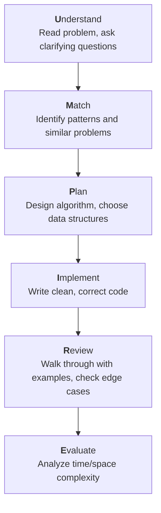
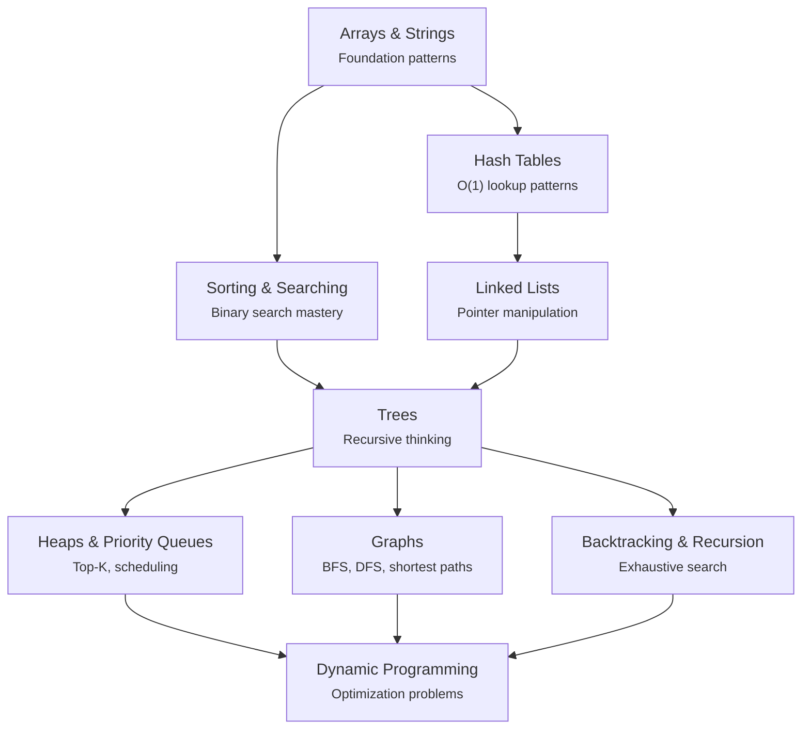

# Algorithms & Data Structures

Algorithms and data structures are the bedrock of computer science. Not in the abstract, academic sense — in the very real sense that every database query you run, every network packet you route, every UI element you render is executing algorithms on data structures. When someone tells you "you don't need to know algorithms for real work," they are telling you they don't understand the tools they use every day.

This section is built for two audiences: engineers preparing for technical interviews, and engineers who want to write better production code. These audiences overlap far more than most people realize. The engineer who understands why a hash map gives $O(1)$ average lookup is the same engineer who knows when a hash map will degrade to $O(n)$ in production and reaches for a different structure.

## Why DSA Matters

### For Interviews

The technical interview is an imperfect filter, but it is the filter that exists. FAANG companies, top startups, and increasingly mid-size companies all test algorithmic thinking. The reason is not sadism — it is that algorithm problems are a compressed proxy for the skills that matter: breaking down ambiguous problems, reasoning about edge cases, managing complexity, and communicating your thought process clearly.

### For Production Code

Every performance bug is an algorithm problem. When your API endpoint takes 12 seconds instead of 200 milliseconds, the root cause is almost always one of:

- Wrong data structure (linear search where a hash lookup would do)
- Wrong algorithm (nested loops where a single pass would suffice)
- Wrong complexity class (an $O(n^2)$ approach that should be $O(n \log n)$)

Understanding algorithms gives you the vocabulary to diagnose these problems instantly instead of guessing.

## Big-O Notation Primer

Big-O describes how an algorithm's resource usage scales with input size. It captures the growth rate, not the exact count.

### Time Complexity

| Notation | Name | Example | Feel |
|---|---|---|---|
| $O(1)$ | Constant | Hash table lookup | Instant, regardless of size |
| $O(\log n)$ | Logarithmic | Binary search | Doubling input adds one step |
| $O(n)$ | Linear | Array scan | Proportional to input |
| $O(n \log n)$ | Linearithmic | Merge sort | Slightly worse than linear |
| $O(n^2)$ | Quadratic | Nested loops | 10x input = 100x time |
| $O(2^n)$ | Exponential | Brute-force subsets | Unusable beyond ~25 elements |
| $O(n!)$ | Factorial | Brute-force permutations | Unusable beyond ~12 elements |

### Visualizing Growth

```
Operations
    |
    |                                          O(n!)
    |                                     O(2^n)
    |                                O(n²)
    |                          O(n log n)
    |                    O(n)
    |              O(log n)
    |         O(1)
    |_____________________________________________
                    Input Size (n)
```

### Space Complexity

Space complexity measures the additional memory an algorithm requires beyond the input itself. An in-place sorting algorithm uses $O(1)$ extra space. Merge sort uses $O(n)$ extra space for the temporary arrays. Recursive algorithms use $O(d)$ space for the call stack, where $d$ is the recursion depth.

::: tip Production Insight
In interviews, time complexity usually matters more than space. In production, space complexity can be the bottleneck — a 100GB dataset that requires $O(n)$ extra space means you need 200GB of RAM. Understanding space trade-offs is what separates textbook knowledge from production wisdom.
:::

### Amortized Analysis

Some operations are expensive occasionally but cheap on average. A dynamic array (like JavaScript's `Array` or Python's `list`) has $O(1)$ amortized append time, even though individual appends occasionally trigger an $O(n)$ resize. Amortized analysis accounts for this by spreading the cost of expensive operations across all operations.

$$
\text{Amortized cost} = \frac{\text{Total cost of } n \text{ operations}}{n}
$$

### Common Traps

::: warning
- **Drop constants**: $O(2n)$ is $O(n)$, but in practice a 2x constant can be the difference between hitting and missing an SLA
- **Drop lower-order terms**: $O(n^2 + n)$ is $O(n^2)$, but for small $n$ the linear term might dominate
- **Best vs Average vs Worst**: Quicksort is $O(n \log n)$ average but $O(n^2)$ worst case — know which you're analyzing
- **Big-O vs Big-Theta**: Big-O is an upper bound ($\leq$), Big-Theta is a tight bound ($=$). When we say "merge sort is $O(n \log n)$" we really mean $\Theta(n \log n)$
:::

## How to Approach Algorithm Problems

### The UMPIRE Framework

A structured approach that prevents you from diving into code before understanding the problem.



### Step 1: Understand

Before writing a single line, make sure you understand:
- What are the inputs? What are the outputs?
- What are the constraints? (size of input, range of values, sorted or unsorted?)
- What are the edge cases? (empty input, single element, all duplicates, negative numbers?)

### Step 2: Match

Map the problem to known patterns:

| If you see... | Think about... |
|---|---|
| "Find a pair/subarray" | Two pointers, sliding window |
| "Sorted array" | Binary search |
| "All permutations/combinations" | Backtracking |
| "Shortest path" | BFS (unweighted), Dijkstra (weighted) |
| "Optimal substructure + overlapping subproblems" | Dynamic programming |
| "Hierarchy or nested structure" | Trees, recursion |
| "Connected components" | Union-Find, DFS |
| "Top K" or "Kth largest" | Heap / priority queue |
| "Frequency count" or "seen before" | Hash map |
| "Prefix-based search" | Trie |

### Step 3: Plan

Write pseudocode or explain your approach in plain English before coding. This is where you:
- Choose your data structures
- Define your algorithm step by step
- Estimate time and space complexity
- Decide if there's a better approach before committing

### Step 4: Implement

Write clean, readable code. Use descriptive variable names. Handle edge cases explicitly at the top of the function. Don't try to be clever — be correct.

### Step 5: Review

Manually trace through your code with:
- The examples given in the problem
- An edge case (empty input, single element)
- A case that tests your boundary conditions

### Step 6: Evaluate

State the time and space complexity clearly. If the interviewer asks for optimization, you have a baseline to improve from.

## Learning Path

Follow this sequence. Each topic builds on the ones before it.



Start with [Arrays & Strings](/algorithms/arrays-strings) — they are the most common interview topic and build the muscle memory for index manipulation, pointer movement, and window management. Then move to [Hash Tables](/algorithms/hash-tables) for the single most important data structure in all of programming. [Sorting & Searching](/algorithms/sorting-searching) follows because binary search is a universal technique. [Linked Lists](/algorithms/linked-lists) teach pointer manipulation. [Trees](/algorithms/trees) introduce recursion in a structured way. [Heaps](/algorithms/heaps-priority-queues) and [Graphs](/algorithms/graphs) extend tree thinking to more complex structures. [Backtracking](/algorithms/backtracking-recursion) teaches exhaustive search. [Dynamic Programming](/algorithms/dynamic-programming) is the capstone — it combines all the thinking patterns into the hardest problem class.

## Section Map

| Page | What You'll Learn | Difficulty |
|---|---|---|
| [Arrays & Strings](/algorithms/arrays-strings) | Two pointers, sliding window, prefix sums, string manipulation | Intermediate |
| [Linked Lists](/algorithms/linked-lists) | Pointer techniques, cycle detection, reversal, merge patterns | Intermediate |
| [Trees](/algorithms/trees) | Traversals, BST operations, tries, segment trees | Intermediate |
| [Graphs](/algorithms/graphs) | BFS, DFS, shortest paths, topological sort, Union-Find | Advanced |
| [Dynamic Programming](/algorithms/dynamic-programming) | Memoization, tabulation, knapsack, LCS, state transitions | Advanced |
| [Sorting & Searching](/algorithms/sorting-searching) | Quicksort, mergesort, binary search variations | Intermediate |
| [Heaps & Priority Queues](/algorithms/heaps-priority-queues) | Min/max heaps, Top-K, median finding | Intermediate |
| [Hash Tables](/algorithms/hash-tables) | Hash functions, collision resolution, consistent hashing | Intermediate |
| [Backtracking & Recursion](/algorithms/backtracking-recursion) | N-Queens, permutations, pruning strategies | Advanced |
| [Greedy Algorithms](/algorithms/greedy) | Activity selection, Huffman coding, MST (Prim's, Kruskal's) | Intermediate |
| [Bit Manipulation](/algorithms/bit-manipulation) | Bitwise tricks, XOR patterns, bitmask DP, bloom filters | Intermediate |
| [String Algorithms](/algorithms/string-algorithms) | KMP, Rabin-Karp, tries, Manacher's, edit distance | Advanced |
| [Advanced Data Structures](/algorithms/advanced-data-structures) | Segment trees, Fenwick trees, Union-Find, skip lists, LRU cache | Advanced |
| [Math Patterns in System Design](/algorithms/system-design-math) | Back-of-envelope estimation, QPS, storage, consistent hashing | Intermediate |

## Interview Preparation Strategy

### The 80/20 of DSA Topics

Based on frequency analysis of thousands of interviews at top companies:

1. **Arrays & Strings** — ~30% of all problems
2. **Trees & Graphs** — ~20% of all problems
3. **Dynamic Programming** — ~15% of all problems
4. **Hash Tables** — ~10% (often combined with other topics)
5. **Sorting & Searching** — ~10%
6. **Linked Lists, Stacks, Queues** — ~8%
7. **Heaps, Backtracking, Others** — ~7%

### Practice Template

For each problem you solve, record:

```
Problem: [Name and link]
Pattern: [Which pattern does it use?]
Approach: [2-3 sentence summary]
Complexity: Time O(?), Space O(?)
Mistakes: [What did you get wrong the first time?]
Review Date: [When to revisit]
```

Spaced repetition beats grinding. Solving 100 problems you understand deeply is worth more than speed-running 500 problems you forget in a week.

::: danger Common Mistake
Do not memorize solutions. If you cannot derive the solution from first principles, you do not understand it. Interviews test your problem-solving process, not your ability to recall code from memory. When you study a problem, make sure you understand *why* each step exists, not just *what* the steps are.
:::

## Connecting DSA to System Design

Algorithms and data structures don't exist in a vacuum. They are the building blocks of every system you design:

- **[Consistent Hashing](/system-design/distributed-systems/consistent-hashing)** uses ring-based hash functions to distribute data across nodes
- **[Database Indexing](/system-design/databases/indexing-deep-dive)** is built on B-trees and hash indexes
- **[Load Balancing](/system-design/load-balancing/algorithms)** algorithms determine which server handles each request
- **[Bloom Filters](/system-design/distributed-systems/bloom-filters)** use hashing for probabilistic set membership
- **[Message Queue ordering](/system-design/message-queues/)** relies on priority queues and sorted structures

Understanding the algorithmic foundations makes system design conversations dramatically richer.

## Further Reading

- *Introduction to Algorithms* (CLRS) — the canonical reference, dense but comprehensive
- *Algorithm Design Manual* (Skiena) — more practical, with real-world "war stories"
- *Grokking Algorithms* — visual, beginner-friendly introduction
- [NeetCode.io](https://neetcode.io) — structured problem sets organized by pattern
- [LeetCode Patterns](https://seanprashad.com/leetcode-patterns/) — problems grouped by technique
