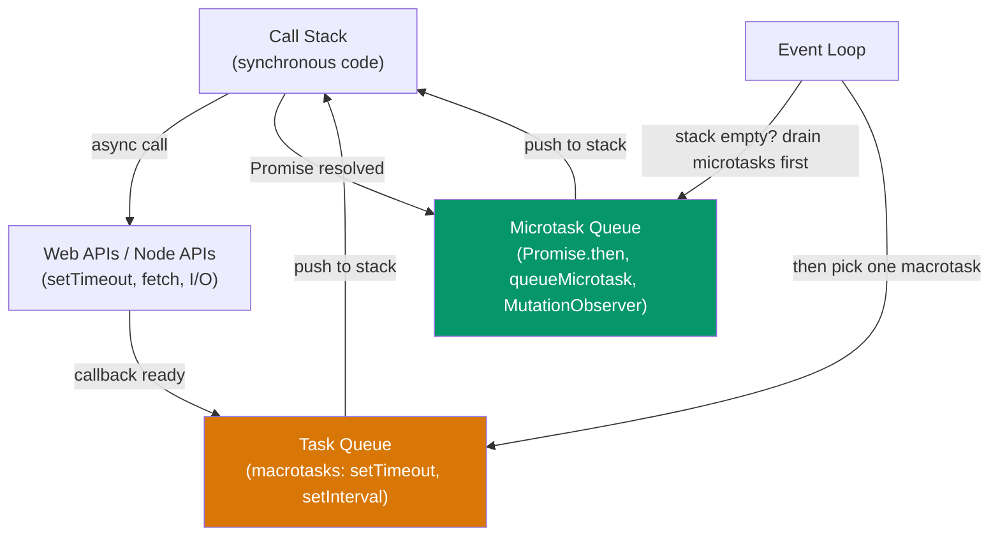
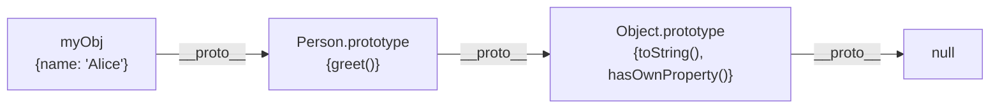
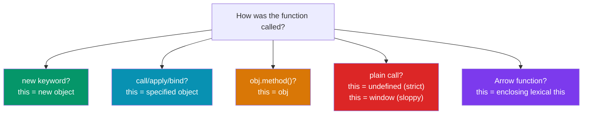
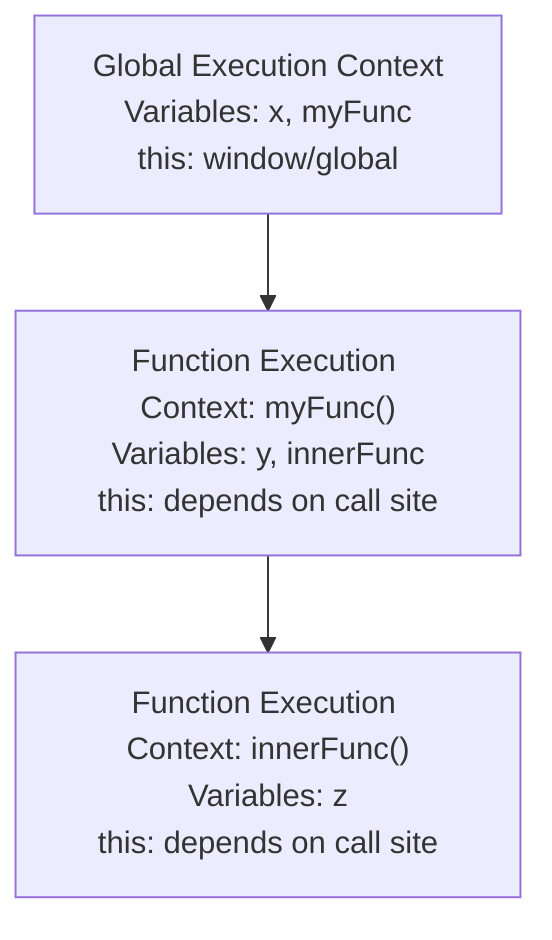

# JavaScript Interview Questions

This page is a concentrated reference for JavaScript interviews. It covers the language features that interviewers consistently test — not because they are obscure, but because understanding them reveals whether a candidate truly knows how JavaScript works under the hood. Each question includes a clear explanation, code examples, and common follow-ups.

## Closures

### Q: What is a closure? Give a practical example.

A closure is a function that retains access to its lexical scope even when the function is executed outside that scope. Every function in JavaScript forms a closure, but we typically use the term when an inner function references variables from an outer function after the outer function has returned.

```javascript
function createCounter(initialValue = 0) {
  let count = initialValue; // closed over by the returned object

  return {
    increment() { return ++count; },
    decrement() { return --count; },
    getCount()  { return count; },
  };
}

const counter = createCounter(10);
console.log(counter.increment()); // 11
console.log(counter.increment()); // 12
console.log(counter.getCount());  // 12
// `count` is not accessible directly — it's private via closure
```

### Q: What will this loop print, and how do you fix it?

```javascript
// Classic closure bug
for (var i = 0; i < 3; i++) {
  setTimeout(() => console.log(i), 100);
}
// Prints: 3, 3, 3 — because `var` is function-scoped
```

**Fix 1 — use `let`** (block-scoped, creates new binding per iteration):

```javascript
for (let i = 0; i < 3; i++) {
  setTimeout(() => console.log(i), 100);
}
// Prints: 0, 1, 2
```

**Fix 2 — IIFE** (creates a new scope per iteration):

```javascript
for (var i = 0; i < 3; i++) {
  (function (j) {
    setTimeout(() => console.log(j), 100);
  })(i);
}
```

### Q: Real-world closure — rate limiter

```javascript
function createRateLimiter(maxCalls, windowMs) {
  const timestamps = [];

  return function (...args) {
    const now = Date.now();
    // Remove timestamps outside the window
    while (timestamps.length && timestamps[0] <= now - windowMs) {
      timestamps.shift();
    }
    if (timestamps.length >= maxCalls) {
      throw new Error('Rate limit exceeded');
    }
    timestamps.push(now);
    return true;
  };
}

const limiter = createRateLimiter(5, 1000); // 5 calls per second
```

---

## Event Loop

### Q: Explain the JavaScript event loop.

JavaScript is single-threaded. The event loop is the mechanism that allows non-blocking I/O by offloading operations to the system kernel or thread pool and processing callbacks when the call stack is empty.



### Q: What is the output order?

```javascript
console.log('1');

setTimeout(() => console.log('2'), 0);

Promise.resolve().then(() => console.log('3'));

queueMicrotask(() => console.log('4'));

console.log('5');
```

**Answer**: `1, 5, 3, 4, 2`

- `1` and `5` are synchronous — they execute immediately.
- `3` and `4` are microtasks — they run after the current synchronous code finishes but before any macrotask.
- `2` is a macrotask (`setTimeout`) — it runs last.

::: tip Microtasks Always Beat Macrotasks
After each macrotask completes, the engine drains the entire microtask queue before picking the next macrotask. This is why `Promise.then` callbacks execute before `setTimeout(..., 0)`.
:::

### Q: Node.js Event Loop Phases

In Node.js, the event loop has six phases:

| Phase | What Runs |
|-------|-----------|
| **Timers** | `setTimeout`, `setInterval` callbacks |
| **Pending callbacks** | I/O callbacks deferred from previous cycle |
| **Idle, prepare** | Internal use only |
| **Poll** | Retrieve new I/O events; execute I/O callbacks |
| **Check** | `setImmediate` callbacks |
| **Close callbacks** | `socket.on('close', ...)` etc. |

```javascript
// Node.js specific — order depends on context
setTimeout(() => console.log('timeout'), 0);
setImmediate(() => console.log('immediate'));
// Order is non-deterministic in the main module
// But inside an I/O callback, setImmediate always fires first

const fs = require('fs');
fs.readFile(__filename, () => {
  setTimeout(() => console.log('timeout'), 0);
  setImmediate(() => console.log('immediate'));
  // Always prints: immediate, timeout
});
```

---

## Prototypal Inheritance

### Q: How does prototypal inheritance work?

Every JavaScript object has an internal `[[Prototype]]` link to another object. When you access a property that does not exist on the object, the engine walks up the prototype chain until it finds the property or reaches `null`.



### Q: Object.create vs class syntax

```javascript
// Object.create — direct prototype linkage
const animal = {
  speak() { return `${this.name} makes a sound`; }
};

const dog = Object.create(animal);
dog.name = 'Rex';
dog.bark = function () { return `${this.name} barks`; };

console.log(dog.speak()); // "Rex makes a sound" — found via prototype chain
console.log(dog.bark());  // "Rex barks"

// ES6 class — syntactic sugar over prototypal inheritance
class Animal {
  constructor(name) { this.name = name; }
  speak() { return `${this.name} makes a sound`; }
}

class Dog extends Animal {
  bark() { return `${this.name} barks`; }
}

const rex = new Dog('Rex');
// Under the hood: rex.__proto__ === Dog.prototype
// Dog.prototype.__proto__ === Animal.prototype
```

::: warning Classes Are Not Classical Inheritance
ES6 `class` is syntactic sugar. There are no "classes" in the Java/C++ sense. `extends` sets up a prototype chain. Understanding this avoids confusion with `super`, `static`, and method resolution.
:::

### Q: What does `instanceof` do?

`instanceof` checks whether an object has a given constructor's `prototype` anywhere in its prototype chain:

```javascript
rex instanceof Dog;    // true — Dog.prototype is in rex's chain
rex instanceof Animal; // true — Animal.prototype is also in the chain
rex instanceof Object; // true — Object.prototype is at the top
```

---

## `this` Binding

### Q: Explain the four rules of `this` binding.



```javascript
// 1. Default binding
function showThis() { console.log(this); }
showThis(); // window (browser, sloppy) or undefined (strict)

// 2. Implicit binding
const obj = { name: 'Alice', greet() { return this.name; } };
obj.greet(); // 'Alice' — this = obj

// 3. Explicit binding
function greet() { return this.name; }
greet.call({ name: 'Bob' });    // 'Bob'
greet.apply({ name: 'Carol' }); // 'Carol'
const bound = greet.bind({ name: 'Dave' });
bound(); // 'Dave'

// 4. new binding
function Person(name) { this.name = name; }
const p = new Person('Eve'); // this = newly created object

// 5. Arrow functions — lexical this
const team = {
  name: 'Engineering',
  members: ['Alice', 'Bob'],
  list() {
    // Arrow inherits `this` from list()'s scope
    return this.members.map(m => `${m} is in ${this.name}`);
  },
};
```

### Q: Classic `this` trap

```javascript
const user = {
  name: 'Alice',
  greet() { return `Hi, I'm ${this.name}`; },
};

const greetFn = user.greet; // method extraction — loses implicit binding
greetFn(); // "Hi, I'm undefined" — default binding

// Fix: bind it
const boundGreet = user.greet.bind(user);
boundGreet(); // "Hi, I'm Alice"
```

---

## Promises and Async/Await

### Q: Implement a basic Promise from scratch

```javascript
class SimplePromise {
  #state = 'pending';
  #value = undefined;
  #callbacks = [];

  constructor(executor) {
    const resolve = (value) => {
      if (this.#state !== 'pending') return;
      this.#state = 'fulfilled';
      this.#value = value;
      this.#callbacks.forEach(cb => cb.onFulfilled(value));
    };

    const reject = (reason) => {
      if (this.#state !== 'pending') return;
      this.#state = 'rejected';
      this.#value = reason;
      this.#callbacks.forEach(cb => cb.onRejected(reason));
    };

    try { executor(resolve, reject); }
    catch (err) { reject(err); }
  }

  then(onFulfilled, onRejected) {
    return new SimplePromise((resolve, reject) => {
      const handle = () => {
        try {
          if (this.#state === 'fulfilled') {
            const result = onFulfilled ? onFulfilled(this.#value) : this.#value;
            resolve(result);
          } else if (this.#state === 'rejected') {
            if (onRejected) resolve(onRejected(this.#value));
            else reject(this.#value);
          }
        } catch (err) { reject(err); }
      };

      if (this.#state === 'pending') {
        this.#callbacks.push({ onFulfilled: () => handle(), onRejected: () => handle() });
      } else {
        queueMicrotask(handle);
      }
    });
  }
}
```

### Q: Promise.all vs Promise.race vs Promise.allSettled

| Method | Resolves when | Rejects when | Use case |
|--------|---------------|--------------|----------|
| `Promise.all` | All promises resolve | Any one rejects | Fetch all data before rendering |
| `Promise.race` | First promise settles | First promise rejects | Timeout pattern |
| `Promise.allSettled` | All promises settle | Never rejects | Run independent tasks, inspect each result |
| `Promise.any` | First promise resolves | All reject (AggregateError) | First successful response from mirrors |

```javascript
// Timeout pattern with Promise.race
function fetchWithTimeout(url, ms) {
  const timeout = new Promise((_, reject) =>
    setTimeout(() => reject(new Error('Timeout')), ms)
  );
  return Promise.race([fetch(url), timeout]);
}

// allSettled — independent operations
const results = await Promise.allSettled([
  updateDatabase(record),
  sendNotification(user),
  updateCache(key),
]);
const failures = results.filter(r => r.status === 'rejected');
if (failures.length) console.error('Partial failures:', failures);
```

### Q: Common async/await gotchas

```javascript
// GOTCHA 1: Sequential when you meant parallel
// BAD — each await blocks the next
const user = await fetchUser(id);
const posts = await fetchPosts(id);
const comments = await fetchComments(id);

// GOOD — run in parallel
const [user, posts, comments] = await Promise.all([
  fetchUser(id),
  fetchPosts(id),
  fetchComments(id),
]);

// GOTCHA 2: Forgetting error handling
// BAD — unhandled rejection
async function process() {
  const data = await riskyOperation(); // no try/catch
}

// GOOD
async function process() {
  try {
    const data = await riskyOperation();
  } catch (err) {
    logger.error('Operation failed', { error: err.message });
    throw err; // re-throw if caller should handle it
  }
}

// GOTCHA 3: forEach does not await
const ids = [1, 2, 3];

// BAD — fires all at once, does not wait
ids.forEach(async (id) => {
  await processItem(id);
});

// GOOD — sequential
for (const id of ids) {
  await processItem(id);
}

// GOOD — parallel
await Promise.all(ids.map(id => processItem(id)));
```

::: danger Unhandled Promise Rejections Crash Node.js
Since Node.js 15, unhandled promise rejections terminate the process by default. Always handle rejections or use a global handler: `process.on('unhandledRejection', handler)`.
:::

---

## Hoisting and Temporal Dead Zone

### Q: What is hoisting?

Hoisting is JavaScript's behavior of moving declarations to the top of their scope during the compilation phase. Only the declaration is hoisted, not the initialization.

```javascript
// What you write:
console.log(x); // undefined (not ReferenceError)
var x = 5;

// What the engine sees:
var x;           // declaration hoisted
console.log(x);  // undefined
x = 5;           // assignment stays in place
```

### Q: var vs let vs const

| Feature | `var` | `let` | `const` |
|---------|-------|-------|---------|
| Scope | Function | Block | Block |
| Hoisted | Yes (initialized to `undefined`) | Yes (not initialized — TDZ) | Yes (not initialized — TDZ) |
| Re-declaration | Allowed | Error | Error |
| Re-assignment | Allowed | Allowed | Error |
| Global property | `var x` creates `window.x` | No | No |

### Q: What is the Temporal Dead Zone?

The TDZ is the region between entering a block and the `let`/`const` declaration being reached. Accessing the variable in the TDZ throws a `ReferenceError`.

```javascript
{
  // TDZ starts here for `name`
  console.log(name); // ReferenceError: Cannot access 'name' before initialization
  let name = 'Alice'; // TDZ ends here
  console.log(name);  // 'Alice'
}
```

::: tip Interview Signal
If a candidate says "let and const are not hoisted," they are wrong. They are hoisted, but they are not initialized. The TDZ prevents access before the declaration. This distinction matters.
:::

---

## Utility Function Implementations

### Q: Implement debounce

Debounce delays execution until a pause in calls. Used for search input, window resize.

```javascript
function debounce(fn, delay) {
  let timerId;

  return function (...args) {
    clearTimeout(timerId);
    timerId = setTimeout(() => {
      fn.apply(this, args);
    }, delay);
  };
}

// Usage
const searchInput = document.getElementById('search');
searchInput.addEventListener('input', debounce((e) => {
  fetchResults(e.target.value);
}, 300));
```

### Q: Implement throttle

Throttle ensures a function runs at most once per interval. Used for scroll handlers, rate limiting.

```javascript
function throttle(fn, limit) {
  let inThrottle = false;

  return function (...args) {
    if (!inThrottle) {
      fn.apply(this, args);
      inThrottle = true;
      setTimeout(() => { inThrottle = false; }, limit);
    }
  };
}

// Trailing edge variant (fires on last call too)
function throttleWithTrailing(fn, limit) {
  let lastArgs = null;
  let timerId = null;

  return function (...args) {
    if (!timerId) {
      fn.apply(this, args);
      timerId = setTimeout(() => {
        timerId = null;
        if (lastArgs) {
          fn.apply(this, lastArgs);
          lastArgs = null;
        }
      }, limit);
    } else {
      lastArgs = args;
    }
  };
}
```

### Q: Implement memoize

```javascript
function memoize(fn) {
  const cache = new Map();

  return function (...args) {
    const key = JSON.stringify(args);
    if (cache.has(key)) return cache.get(key);

    const result = fn.apply(this, args);
    cache.set(key, result);
    return result;
  };
}

// With max size (LRU-like)
function memoizeWithLimit(fn, maxSize = 100) {
  const cache = new Map();

  return function (...args) {
    const key = JSON.stringify(args);
    if (cache.has(key)) {
      const value = cache.get(key);
      cache.delete(key);
      cache.set(key, value); // Move to end (most recent)
      return value;
    }

    const result = fn.apply(this, args);
    cache.set(key, result);

    if (cache.size > maxSize) {
      const oldestKey = cache.keys().next().value;
      cache.delete(oldestKey);
    }

    return result;
  };
}
```

### Q: Implement deep clone

```javascript
function deepClone(obj, seen = new WeakMap()) {
  // Primitives and null
  if (obj === null || typeof obj !== 'object') return obj;

  // Handle circular references
  if (seen.has(obj)) return seen.get(obj);

  // Handle Date
  if (obj instanceof Date) return new Date(obj.getTime());

  // Handle RegExp
  if (obj instanceof RegExp) return new RegExp(obj.source, obj.flags);

  // Handle Map
  if (obj instanceof Map) {
    const map = new Map();
    seen.set(obj, map);
    obj.forEach((value, key) => map.set(deepClone(key, seen), deepClone(value, seen)));
    return map;
  }

  // Handle Set
  if (obj instanceof Set) {
    const set = new Set();
    seen.set(obj, set);
    obj.forEach(value => set.add(deepClone(value, seen)));
    return set;
  }

  // Handle Array and Object
  const clone = Array.isArray(obj) ? [] : {};
  seen.set(obj, clone);

  for (const key of Reflect.ownKeys(obj)) {
    clone[key] = deepClone(obj[key], seen);
  }

  return clone;
}
```

### Q: Implement array flat

```javascript
// Recursive
function flat(arr, depth = 1) {
  if (depth <= 0) return arr.slice();

  return arr.reduce((acc, val) => {
    if (Array.isArray(val)) {
      acc.push(...flat(val, depth - 1));
    } else {
      acc.push(val);
    }
    return acc;
  }, []);
}

// Iterative (infinite depth)
function flatIterative(arr) {
  const stack = [...arr];
  const result = [];

  while (stack.length) {
    const next = stack.pop();
    if (Array.isArray(next)) {
      stack.push(...next);
    } else {
      result.push(next);
    }
  }

  return result.reverse();
}

console.log(flat([1, [2, [3, [4]]]], Infinity)); // [1, 2, 3, 4]
```

### Q: Implement curry

```javascript
function curry(fn) {
  return function curried(...args) {
    if (args.length >= fn.length) {
      return fn.apply(this, args);
    }
    return function (...moreArgs) {
      return curried.apply(this, [...args, ...moreArgs]);
    };
  };
}

// Usage
const add = (a, b, c) => a + b + c;
const curriedAdd = curry(add);

curriedAdd(1)(2)(3);    // 6
curriedAdd(1, 2)(3);    // 6
curriedAdd(1)(2, 3);    // 6
curriedAdd(1, 2, 3);    // 6
```

---

## Type Coercion and Equality

### Q: `==` vs `===`

`==` performs type coercion before comparison. `===` checks both type and value without coercion.

```javascript
// Surprising coercion results
0 == ''        // true — both coerce to 0
0 == '0'       // true
'' == '0'      // false — string comparison
false == '0'   // true — false → 0, '0' → 0
null == undefined // true — special rule
NaN == NaN     // false — NaN is not equal to anything

// Always use ===
0 === ''       // false
0 === '0'      // false
null === undefined // false
```

::: danger Avoid == in Production Code
The only acceptable use of `==` is `value == null` which checks for both `null` and `undefined`. For everything else, use `===`. ESLint's `eqeqeq` rule enforces this.
:::

---

## Scope and Execution Context

### Q: What is an execution context?

Every time a function is invoked, JavaScript creates an execution context containing:

1. **Variable Environment** — `var` declarations, function declarations
2. **Lexical Environment** — `let`/`const` declarations, block scoping
3. **`this` binding** — determined by how the function was called
4. **Outer reference** — link to the parent scope (closure mechanism)



---

## WeakMap, WeakSet, and Memory

### Q: When would you use WeakMap?

`WeakMap` holds weak references to its keys. If no other reference to the key exists, the entry is garbage collected. This is ideal for associating metadata with objects without preventing their cleanup.

```javascript
// Private data pattern
const privateData = new WeakMap();

class User {
  constructor(name, password) {
    this.name = name;
    privateData.set(this, { password }); // private, GC-friendly
  }

  checkPassword(attempt) {
    return privateData.get(this).password === attempt;
  }
}

// DOM metadata without memory leaks
const elementTimers = new WeakMap();

function trackHover(element) {
  element.addEventListener('mouseenter', () => {
    elementTimers.set(element, Date.now());
  });
  element.addEventListener('mouseleave', () => {
    const entered = elementTimers.get(element);
    console.log(`Hovered for ${Date.now() - entered}ms`);
  });
  // When element is removed from DOM and dereferenced,
  // the WeakMap entry is automatically garbage collected
}
```

---

## Generators and Iterators

### Q: What are generators and when are they useful?

Generators are functions that can be paused and resumed. They produce an iterator that yields values on demand — useful for lazy evaluation, infinite sequences, and custom iteration.

```javascript
function* fibonacci() {
  let a = 0, b = 1;
  while (true) {
    yield a;
    [a, b] = [b, a + b];
  }
}

// Take first 10 Fibonacci numbers
function take(iterator, n) {
  const result = [];
  for (const value of iterator) {
    result.push(value);
    if (result.length >= n) break;
  }
  return result;
}

console.log(take(fibonacci(), 10));
// [0, 1, 1, 2, 3, 5, 8, 13, 21, 34]

// Pagination generator
async function* fetchPages(baseUrl) {
  let page = 1;
  while (true) {
    const response = await fetch(`${baseUrl}?page=${page}`);
    const data = await response.json();
    if (data.items.length === 0) return;
    yield data.items;
    page++;
  }
}

for await (const items of fetchPages('/api/users')) {
  renderItems(items);
}
```

---

## Proxy and Reflect

### Q: How does Proxy work?

`Proxy` wraps an object and intercepts fundamental operations (get, set, delete, etc.). Combined with `Reflect`, it enables metaprogramming patterns like validation, logging, and reactive systems.

```javascript
// Validation proxy
function createValidated(target, validators) {
  return new Proxy(target, {
    set(obj, prop, value) {
      if (validators[prop] && !validators[prop](value)) {
        throw new TypeError(`Invalid value for ${prop}: ${value}`);
      }
      return Reflect.set(obj, prop, value);
    },
  });
}

const user = createValidated({}, {
  age: (v) => typeof v === 'number' && v >= 0 && v <= 150,
  email: (v) => typeof v === 'string' && v.includes('@'),
});

user.age = 25;     // OK
user.email = 'a@b.com'; // OK
user.age = -5;     // TypeError: Invalid value for age: -5
```

---

## Quick-Fire Questions

| Question | Answer |
|----------|--------|
| What is `NaN`? | A number value meaning "not a number." `typeof NaN === 'number'`. Use `Number.isNaN()` to check. |
| `typeof null`? | `'object'` — a historical bug in JS that can never be fixed. |
| `0.1 + 0.2 === 0.3`? | `false` — IEEE 754 floating-point precision. Use `Math.abs(a - b) < Number.EPSILON`. |
| What are symbols? | Unique, immutable primitive values used as object property keys to avoid collisions. |
| What is `globalThis`? | The universal reference to the global object (`window` in browsers, `global` in Node.js). |
| `arguments` vs rest params? | `arguments` is array-like, not a real array, not available in arrow functions. Rest (`...args`) gives a real array. |
| What is optional chaining? | `obj?.prop?.method?.()` — short-circuits to `undefined` if any link is nullish. |
| What is nullish coalescing? | `a ?? b` — returns `b` only if `a` is `null` or `undefined` (not `0`, `''`, `false`). |

---

## Related Pages

- [Dynamic Programming](/algorithms/dynamic-programming) — Classic DP problems for coding interviews
- [Arrays & Strings](/algorithms/arrays-strings) — Data structure fundamentals
- [Trees](/algorithms/trees) — Binary tree traversal and manipulation
- [React Interview Questions](/algorithms/react-interview) — Framework-specific questions
- [Node.js Interview Questions](/algorithms/nodejs-interview) — Server-side JavaScript questions
