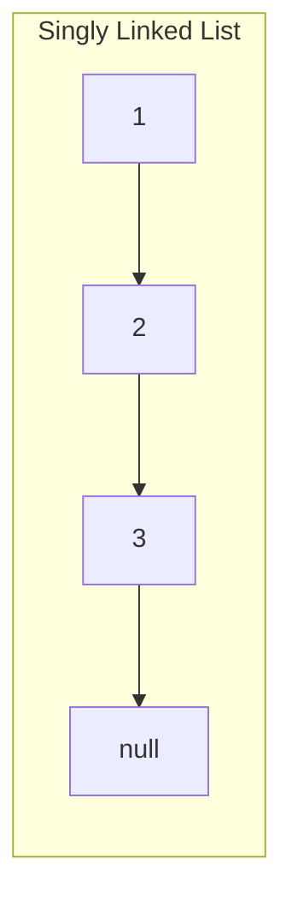
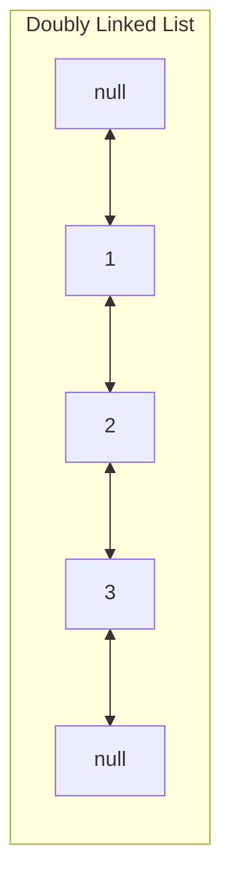
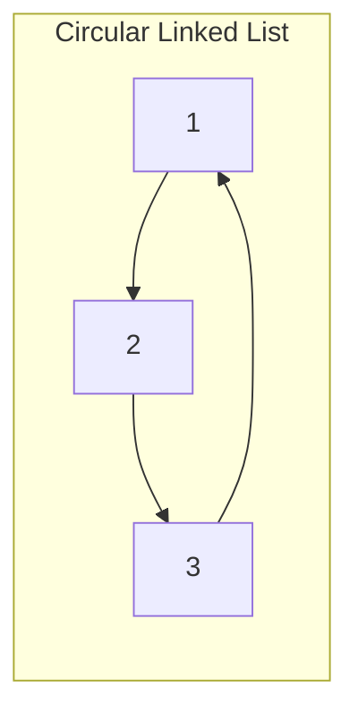
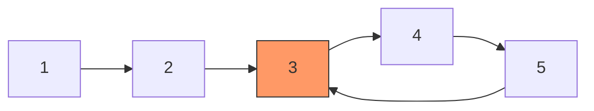
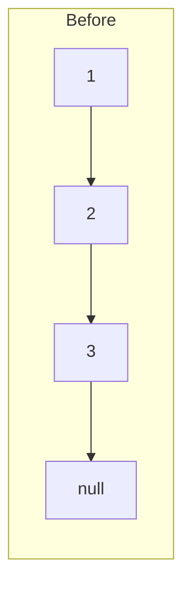
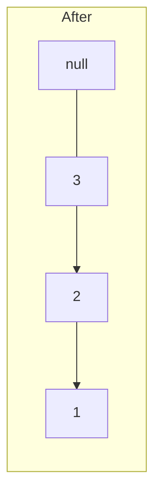

# Linked Lists

Linked lists are the data structure that teaches you to think in pointers. Unlike arrays, linked lists store elements scattered across memory, connected by references. This makes insertion and deletion $O(1)$ at a known position but sacrifices $O(1)$ random access. In interviews, linked list problems test your ability to manipulate pointers without losing track of nodes — a skill that maps directly to pointer-heavy systems code.

## Types of Linked Lists







### Singly Linked List

Each node has a value and a `next` pointer. Traversal is one-way.

**TypeScript:**

```typescript
class ListNode<T> {
  val: T;
  next: ListNode<T> | null;

  constructor(val: T, next: ListNode<T> | null = null) {
    this.val = val;
    this.next = next;
  }
}

class SinglyLinkedList<T> {
  head: ListNode<T> | null = null;

  prepend(val: T): void {
    this.head = new ListNode(val, this.head);
  }

  append(val: T): void {
    const node = new ListNode(val);
    if (!this.head) {
      this.head = node;
      return;
    }
    let current = this.head;
    while (current.next) current = current.next;
    current.next = node;
  }

  delete(val: T): boolean {
    if (!this.head) return false;
    if (this.head.val === val) {
      this.head = this.head.next;
      return true;
    }
    let current = this.head;
    while (current.next) {
      if (current.next.val === val) {
        current.next = current.next.next;
        return true;
      }
      current = current.next;
    }
    return false;
  }
}
```

**Python:**

```python
class ListNode:
    def __init__(self, val=0, next=None):
        self.val = val
        self.next = next

class SinglyLinkedList:
    def __init__(self):
        self.head = None

    def prepend(self, val):
        self.head = ListNode(val, self.head)

    def append(self, val):
        node = ListNode(val)
        if not self.head:
            self.head = node
            return
        current = self.head
        while current.next:
            current = current.next
        current.next = node

    def delete(self, val) -> bool:
        if not self.head:
            return False
        if self.head.val == val:
            self.head = self.head.next
            return True
        current = self.head
        while current.next:
            if current.next.val == val:
                current.next = current.next.next
                return True
            current = current.next
        return False
```

### Complexity Summary

| Operation | Singly | Doubly |
|---|---|---|
| Access by index | $O(n)$ | $O(n)$ |
| Prepend | $O(1)$ | $O(1)$ |
| Append (with tail pointer) | $O(1)$ | $O(1)$ |
| Insert after known node | $O(1)$ | $O(1)$ |
| Delete known node | $O(n)$* | $O(1)$ |
| Search | $O(n)$ | $O(n)$ |

*Singly linked list deletion requires finding the previous node, which takes $O(n)$.

::: tip The Dummy Head Trick
Many linked list problems become cleaner when you create a dummy node that points to the head. This eliminates special-case handling for operations that might modify the head.

```typescript
const dummy = new ListNode(0);
dummy.next = head;
// ... work with dummy.next ...
return dummy.next; // the new head
```
:::

## Pattern 1: Fast & Slow Pointers (Floyd's Algorithm)

Two pointers move at different speeds. The slow pointer moves one step at a time, the fast pointer moves two steps. This technique solves multiple problems elegantly.

### Cycle Detection



**TypeScript:**

```typescript
function hasCycle(head: ListNode<number> | null): boolean {
  let slow = head;
  let fast = head;

  while (fast !== null && fast.next !== null) {
    slow = slow!.next;
    fast = fast.next.next;

    if (slow === fast) return true;
  }

  return false;
}
```

**Python:**

```python
def has_cycle(head: ListNode | None) -> bool:
    slow = fast = head

    while fast and fast.next:
        slow = slow.next
        fast = fast.next.next

        if slow is fast:
            return True

    return False
```

**Why it works:** If there is a cycle, the fast pointer will eventually "lap" the slow pointer inside the cycle. If there is no cycle, the fast pointer reaches `null`.

**Complexity:** $O(n)$ time, $O(1)$ space.

### Finding the Cycle Start

Once the fast and slow pointers meet inside the cycle, reset one pointer to the head and move both at the same speed. They will meet at the cycle start.

**Mathematical proof:** Let $F$ be the distance from head to cycle start, $C$ be the cycle length, and $a$ be the distance from cycle start to meeting point.

When they meet:
- Slow traveled: $F + a$
- Fast traveled: $F + a + kC$ for some integer $k$
- Fast travels twice as far: $2(F + a) = F + a + kC$
- Therefore: $F + a = kC$, which means $F = kC - a$

So starting one pointer at head and one at the meeting point, both moving one step, they will meet at the cycle start after $F$ steps.

**TypeScript:**

```typescript
function detectCycleStart(head: ListNode<number> | null): ListNode<number> | null {
  let slow = head;
  let fast = head;

  // Phase 1: Find meeting point
  while (fast !== null && fast.next !== null) {
    slow = slow!.next;
    fast = fast.next.next;
    if (slow === fast) break;
  }

  if (fast === null || fast.next === null) return null;

  // Phase 2: Find cycle start
  slow = head;
  while (slow !== fast) {
    slow = slow!.next;
    fast = fast!.next;
  }

  return slow;
}
```

**Python:**

```python
def detect_cycle_start(head: ListNode | None) -> ListNode | None:
    slow = fast = head

    # Phase 1: Find meeting point
    while fast and fast.next:
        slow = slow.next
        fast = fast.next.next
        if slow is fast:
            break
    else:
        return None

    # Phase 2: Find cycle start
    slow = head
    while slow is not fast:
        slow = slow.next
        fast = fast.next

    return slow
```

### Finding the Middle Node

The slow pointer will be at the middle when the fast pointer reaches the end.

**TypeScript:**

```typescript
function findMiddle(head: ListNode<number> | null): ListNode<number> | null {
  let slow = head;
  let fast = head;

  while (fast !== null && fast.next !== null) {
    slow = slow!.next;
    fast = fast.next.next;
  }

  return slow; // middle node (right-middle for even-length lists)
}
```

**Python:**

```python
def find_middle(head: ListNode | None) -> ListNode | None:
    slow = fast = head
    while fast and fast.next:
        slow = slow.next
        fast = fast.next.next
    return slow
```

## Pattern 2: Linked List Reversal

Reversal is the single most important linked list operation. It appears as a sub-problem in many harder questions.

### Iterative Reversal





**TypeScript:**

```typescript
function reverseList(head: ListNode<number> | null): ListNode<number> | null {
  let prev: ListNode<number> | null = null;
  let current = head;

  while (current !== null) {
    const next = current.next; // save next
    current.next = prev;       // reverse pointer
    prev = current;            // advance prev
    current = next;            // advance current
  }

  return prev;
}
```

**Python:**

```python
def reverse_list(head: ListNode | None) -> ListNode | None:
    prev = None
    current = head

    while current:
        next_node = current.next  # save next
        current.next = prev       # reverse pointer
        prev = current            # advance prev
        current = next_node       # advance current

    return prev
```

**Complexity:** $O(n)$ time, $O(1)$ space.

### Recursive Reversal

```typescript
function reverseListRecursive(head: ListNode<number> | null): ListNode<number> | null {
  if (head === null || head.next === null) return head;

  const newHead = reverseListRecursive(head.next);
  head.next.next = head; // reverse the pointer
  head.next = null;       // prevent cycle

  return newHead;
}
```

```python
def reverse_list_recursive(head: ListNode | None) -> ListNode | None:
    if not head or not head.next:
        return head

    new_head = reverse_list_recursive(head.next)
    head.next.next = head  # reverse the pointer
    head.next = None       # prevent cycle

    return new_head
```

**Complexity:** $O(n)$ time, $O(n)$ space (call stack).

### Reverse Between Positions

Reverse only the sublist from position `left` to position `right`:

**TypeScript:**

```typescript
function reverseBetween(
  head: ListNode<number> | null,
  left: number,
  right: number
): ListNode<number> | null {
  const dummy = new ListNode(0);
  dummy.next = head;

  // Find the node before the reversal starts
  let prev: ListNode<number> = dummy;
  for (let i = 1; i < left; i++) {
    prev = prev.next!;
  }

  // Reverse the sublist
  let current = prev.next!;
  for (let i = 0; i < right - left; i++) {
    const next = current.next!;
    current.next = next.next;
    next.next = prev.next;
    prev.next = next;
  }

  return dummy.next;
}
```

**Python:**

```python
def reverse_between(head: ListNode | None, left: int, right: int) -> ListNode | None:
    dummy = ListNode(0)
    dummy.next = head

    prev = dummy
    for _ in range(left - 1):
        prev = prev.next

    current = prev.next
    for _ in range(right - left):
        next_node = current.next
        current.next = next_node.next
        next_node.next = prev.next
        prev.next = next_node

    return dummy.next
```

## Pattern 3: Merge Lists

### Merge Two Sorted Lists

**TypeScript:**

```typescript
function mergeTwoLists(
  l1: ListNode<number> | null,
  l2: ListNode<number> | null
): ListNode<number> | null {
  const dummy = new ListNode(0);
  let tail = dummy;

  while (l1 !== null && l2 !== null) {
    if (l1.val <= l2.val) {
      tail.next = l1;
      l1 = l1.next;
    } else {
      tail.next = l2;
      l2 = l2.next;
    }
    tail = tail.next;
  }

  tail.next = l1 ?? l2;
  return dummy.next;
}
```

**Python:**

```python
def merge_two_lists(l1: ListNode | None, l2: ListNode | None) -> ListNode | None:
    dummy = ListNode(0)
    tail = dummy

    while l1 and l2:
        if l1.val <= l2.val:
            tail.next = l1
            l1 = l1.next
        else:
            tail.next = l2
            l2 = l2.next
        tail = tail.next

    tail.next = l1 or l2
    return dummy.next
```

### Merge K Sorted Lists

Use a min-heap to efficiently merge K sorted lists:

**Python:**

```python
import heapq

def merge_k_lists(lists: list[ListNode | None]) -> ListNode | None:
    dummy = ListNode(0)
    tail = dummy
    heap = []

    # Initialize heap with the head of each list
    for i, node in enumerate(lists):
        if node:
            heapq.heappush(heap, (node.val, i, node))

    while heap:
        val, i, node = heapq.heappop(heap)
        tail.next = node
        tail = tail.next
        if node.next:
            heapq.heappush(heap, (node.next.val, i, node.next))

    return dummy.next
```

**Complexity:** $O(N \log K)$ time where $N$ is total nodes and $K$ is number of lists. $O(K)$ space for the heap.

::: tip
See [Heaps & Priority Queues](/algorithms/heaps-priority-queues) for more heap-based techniques.
:::

## Pattern 4: Partition

Partition a list around a value — all nodes less than the value come before nodes greater than or equal to it.

**TypeScript:**

```typescript
function partition(
  head: ListNode<number> | null,
  x: number
): ListNode<number> | null {
  const lessHead = new ListNode(0);
  const greaterHead = new ListNode(0);
  let less = lessHead;
  let greater = greaterHead;
  let current = head;

  while (current !== null) {
    if (current.val < x) {
      less.next = current;
      less = less.next;
    } else {
      greater.next = current;
      greater = greater.next;
    }
    current = current.next;
  }

  greater.next = null;          // terminate the greater list
  less.next = greaterHead.next; // connect less → greater

  return lessHead.next;
}
```

**Python:**

```python
def partition(head: ListNode | None, x: int) -> ListNode | None:
    less_head = ListNode(0)
    greater_head = ListNode(0)
    less = less_head
    greater = greater_head
    current = head

    while current:
        if current.val < x:
            less.next = current
            less = less.next
        else:
            greater.next = current
            greater = greater.next
        current = current.next

    greater.next = None
    less.next = greater_head.next

    return less_head.next
```

## Advanced: LRU Cache

An LRU (Least Recently Used) cache combines a doubly linked list with a hash map. This is one of the most frequently asked interview questions at top companies.

**Python:**

```python
class DLLNode:
    def __init__(self, key=0, val=0):
        self.key = key
        self.val = val
        self.prev = None
        self.next = None

class LRUCache:
    def __init__(self, capacity: int):
        self.capacity = capacity
        self.cache: dict[int, DLLNode] = {}
        # Sentinel nodes avoid null checks
        self.head = DLLNode()  # most recently used
        self.tail = DLLNode()  # least recently used
        self.head.next = self.tail
        self.tail.prev = self.head

    def _remove(self, node: DLLNode) -> None:
        node.prev.next = node.next
        node.next.prev = node.prev

    def _add_to_front(self, node: DLLNode) -> None:
        node.next = self.head.next
        node.prev = self.head
        self.head.next.prev = node
        self.head.next = node

    def get(self, key: int) -> int:
        if key not in self.cache:
            return -1
        node = self.cache[key]
        self._remove(node)
        self._add_to_front(node)
        return node.val

    def put(self, key: int, value: int) -> None:
        if key in self.cache:
            self._remove(self.cache[key])
        node = DLLNode(key, value)
        self.cache[key] = node
        self._add_to_front(node)

        if len(self.cache) > self.capacity:
            lru = self.tail.prev
            self._remove(lru)
            del self.cache[lru.key]
```

**Complexity:** $O(1)$ for both `get` and `put`.

## Common Edge Cases

::: danger Always Handle These
- **Null head**: The list is empty
- **Single node**: Head is also the tail
- **Two nodes**: Tests pointer manipulation boundaries
- **Cycle**: Operations that traverse to the end will infinite-loop
- **Modifying the head**: Use a dummy node to avoid special cases
:::

## Linked List vs Array

| Criterion | Linked List | Array |
|---|---|---|
| Random access | $O(n)$ | $O(1)$ |
| Insert/delete at known position | $O(1)$ | $O(n)$ |
| Cache performance | Poor (scattered memory) | Excellent (contiguous) |
| Memory overhead | Extra pointer per node | None |
| Size flexibility | Dynamic | Fixed (or amortized resizing) |

::: warning Production Reality
In production, arrays almost always beat linked lists due to cache locality. Modern CPUs are optimized for sequential memory access. Linked lists scatter nodes across the heap, causing cache misses on every pointer dereference. Use linked lists when you need frequent insertions/deletions at arbitrary positions (e.g., LRU cache) or when you're implementing other data structures (e.g., hash table chaining, adjacency lists).
:::

## Practice Problems

| Problem | Pattern | Difficulty |
|---|---|---|
| Reverse Linked List | Reversal | Easy |
| Linked List Cycle | Fast/slow pointer | Easy |
| Merge Two Sorted Lists | Merge | Easy |
| Remove Nth Node From End | Two pointers (gap) | Medium |
| Reorder List | Find middle + reverse + merge | Medium |
| Add Two Numbers | Carry propagation | Medium |
| Copy List with Random Pointer | Hash map clone | Medium |
| LRU Cache | Doubly linked list + hash map | Medium |
| Reverse Nodes in k-Group | Sub-list reversal | Hard |
| Merge K Sorted Lists | Heap + merge | Hard |

## Further Reading

- [Arrays & Strings](/algorithms/arrays-strings) — the contiguous counterpart
- [Heaps & Priority Queues](/algorithms/heaps-priority-queues) — for merge K lists
- [Hash Tables](/algorithms/hash-tables) — combined with linked lists for chaining and LRU caches
