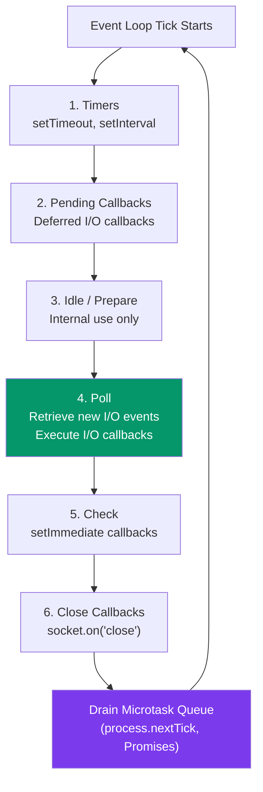
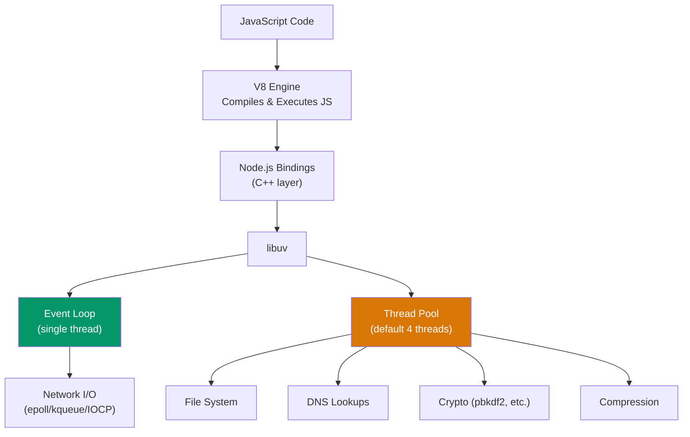
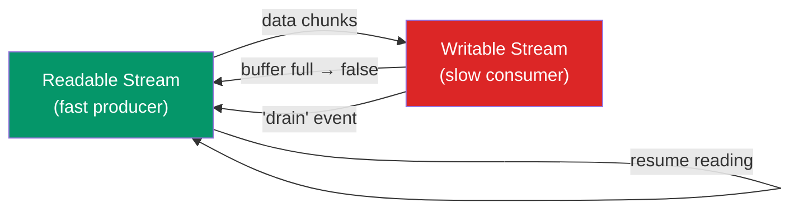
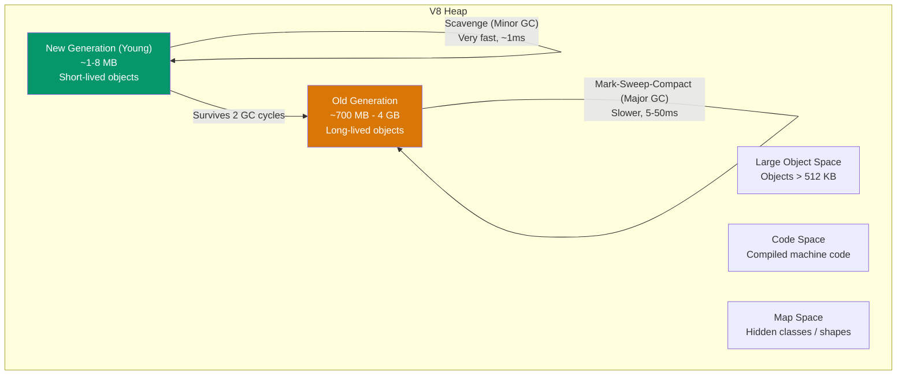

# Node.js Interview Questions

Node.js interviews go beyond JavaScript. They test whether you understand how the runtime works — the event loop, the thread pool, memory management, and the streaming model that makes Node capable of handling thousands of concurrent connections on a single thread. This page covers the questions that matter.

## Event Loop Deep Dive

### Q: Explain the Node.js event loop phases in detail.

The event loop is a semi-infinite loop that processes callbacks in a specific order. Each iteration is called a "tick." There are six phases, and each phase has a FIFO queue of callbacks to execute.



| Phase | Callbacks Processed | Key Detail |
|-------|-------------------|------------|
| **Timers** | `setTimeout`, `setInterval` | Executes callbacks whose timer has elapsed. Not guaranteed to fire at exact time — just "no sooner than." |
| **Pending Callbacks** | Deferred I/O callbacks | System-level callbacks (e.g., TCP errors like `ECONNREFUSED`). |
| **Idle / Prepare** | Internal only | Used by Node internals. Not accessible to user code. |
| **Poll** | I/O callbacks | The phase where Node spends most time. Retrieves new I/O events from the kernel and runs their callbacks. If no timers are scheduled, it will block here waiting for I/O. |
| **Check** | `setImmediate` | Runs immediately after the poll phase completes. |
| **Close** | Close handlers | `socket.on('close', ...)`, `process.on('exit', ...)`. |

**Between every phase**, Node drains the microtask queue:

1. `process.nextTick` callbacks (highest priority)
2. Promise `.then`/`.catch`/`.finally` callbacks

### Q: process.nextTick vs setImmediate

```javascript
// process.nextTick — fires BEFORE the event loop continues
// setImmediate — fires in the CHECK phase (after poll)

setImmediate(() => console.log('setImmediate'));
process.nextTick(() => console.log('nextTick'));
// Output: nextTick, setImmediate

// Recursive nextTick can STARVE the event loop
function danger() {
  process.nextTick(danger); // Never lets the loop advance to I/O
}
// This blocks all I/O, timers, and setImmediate callbacks
```

::: danger process.nextTick Can Starve I/O
Recursive `process.nextTick` prevents the event loop from reaching the poll phase. Use `setImmediate` for recursive/deferred work that should not block I/O.
:::

### Q: What is the output?

```javascript
const fs = require('fs');

// Main module context
setTimeout(() => console.log('T1'), 0);
setImmediate(() => console.log('I1'));
// Order is NON-DETERMINISTIC — depends on whether 1ms timer
// has elapsed by the time event loop reaches the timers phase

// Inside an I/O callback — order IS deterministic
fs.readFile(__filename, () => {
  setTimeout(() => console.log('T2'), 0);
  setImmediate(() => console.log('I2'));
});
// Always prints: I2, T2
// Because: after I/O callback runs (poll phase),
// check phase (setImmediate) comes BEFORE timers phase
```

### Q: What is libuv and why does Node need it?

libuv is the C library that provides Node.js with its event loop and thread pool. The operating system can handle some async operations natively (network I/O on Linux via epoll, macOS via kqueue), but filesystem operations, DNS lookups, and some crypto operations are blocking at the OS level. libuv runs these on a thread pool (default: 4 threads).



```bash
# Increase thread pool size (default is 4)
UV_THREADPOOL_SIZE=16 node server.js
```

---

## Streams

### Q: Explain the four types of streams.

| Stream Type | Description | Example |
|------------|-------------|---------|
| **Readable** | Source of data you consume | `fs.createReadStream`, `http.IncomingMessage` |
| **Writable** | Destination you write data to | `fs.createWriteStream`, `http.ServerResponse` |
| **Duplex** | Both readable and writable | `net.Socket`, `zlib.createGzip` |
| **Transform** | Duplex that modifies data passing through | `zlib.createGzip`, `crypto.createCipheriv` |

```javascript
const fs = require('fs');
const zlib = require('zlib');
const { pipeline } = require('stream/promises');

// Stream a file through gzip compression to another file
await pipeline(
  fs.createReadStream('input.log'),
  zlib.createGzip(),
  fs.createWriteStream('input.log.gz')
);
// Memory efficient: processes chunks, never loads entire file

// Transform stream — uppercase text
const { Transform } = require('stream');

const upperCase = new Transform({
  transform(chunk, encoding, callback) {
    this.push(chunk.toString().toUpperCase());
    callback();
  }
});

process.stdin.pipe(upperCase).pipe(process.stdout);
```

### Q: What is backpressure and how do you handle it?

Backpressure occurs when a writable stream cannot process data as fast as the readable stream produces it. Without handling backpressure, data accumulates in memory and causes OOM crashes.



```javascript
// BAD — ignoring backpressure
const readable = fs.createReadStream('huge-file.csv');
const writable = fs.createWriteStream('output.csv');

readable.on('data', (chunk) => {
  writable.write(chunk); // Ignores return value!
  // If writable buffer is full, data accumulates in memory
});

// GOOD — respecting backpressure manually
readable.on('data', (chunk) => {
  const canContinue = writable.write(chunk);
  if (!canContinue) {
    readable.pause(); // Stop reading until writable drains
  }
});

writable.on('drain', () => {
  readable.resume(); // Buffer drained, resume reading
});

// BEST — use pipeline (handles backpressure automatically)
const { pipeline } = require('stream/promises');

await pipeline(readable, transformStream, writable);
// Also handles error propagation and cleanup
```

### Q: Implement a custom readable stream

```javascript
const { Readable } = require('stream');

class DatabaseCursor extends Readable {
  constructor(query, options = {}) {
    super({ ...options, objectMode: true });
    this.query = query;
    this.offset = 0;
    this.batchSize = 100;
  }

  async _read() {
    try {
      const rows = await db.query(this.query, {
        offset: this.offset,
        limit: this.batchSize,
      });

      if (rows.length === 0) {
        this.push(null); // Signal end of stream
        return;
      }

      for (const row of rows) {
        this.push(row);
      }

      this.offset += rows.length;
    } catch (err) {
      this.destroy(err);
    }
  }
}

// Usage — process millions of rows without loading all into memory
const cursor = new DatabaseCursor('SELECT * FROM events');

for await (const row of cursor) {
  await processEvent(row);
}
```

---

## Cluster Module and Worker Threads

### Q: When do you use cluster vs worker_threads?

| Feature | `cluster` | `worker_threads` |
|---------|-----------|-------------------|
| Use case | Scale HTTP servers across CPU cores | CPU-intensive computation |
| Process model | Separate processes (fork) | Threads within one process |
| Memory | Separate memory per process | Shared memory possible (SharedArrayBuffer) |
| Communication | IPC (serialized messages) | MessagePort (faster, structured clone or SharedArrayBuffer) |
| Port sharing | Built-in (multiple processes share one port) | Not built-in |
| Crash isolation | Worker crash does not affect master | Thread crash can crash entire process |

```javascript
// CLUSTER — scale HTTP server to all CPU cores
const cluster = require('cluster');
const http = require('http');
const os = require('os');

if (cluster.isPrimary) {
  const numCPUs = os.cpus().length;
  console.log(`Primary ${process.pid} forking ${numCPUs} workers`);

  for (let i = 0; i < numCPUs; i++) {
    cluster.fork();
  }

  cluster.on('exit', (worker, code) => {
    console.log(`Worker ${worker.process.pid} died (${code}). Restarting...`);
    cluster.fork(); // Auto-restart dead workers
  });
} else {
  http.createServer((req, res) => {
    res.writeHead(200);
    res.end(`Handled by worker ${process.pid}\n`);
  }).listen(3000);
}
```

```javascript
// WORKER THREADS — offload CPU-intensive work
const { Worker, isMainThread, parentPort, workerData } = require('worker_threads');

if (isMainThread) {
  // Main thread — offload heavy computation
  async function computeHash(data) {
    return new Promise((resolve, reject) => {
      const worker = new Worker(__filename, { workerData: data });
      worker.on('message', resolve);
      worker.on('error', reject);
    });
  }

  const result = await computeHash({ input: 'large-dataset' });
  console.log('Result:', result);
} else {
  // Worker thread — CPU-intensive work
  const crypto = require('crypto');
  const hash = crypto
    .createHash('sha256')
    .update(JSON.stringify(workerData))
    .digest('hex');

  parentPort.postMessage({ hash });
}
```

::: tip Production Recommendation
For HTTP servers, use a process manager like PM2 or the built-in cluster module. For CPU-intensive tasks in a server context, use a worker thread pool (e.g., `piscina` or `workerpool`) to avoid the overhead of spawning a new thread per request.
:::

---

## Memory Management and V8

### Q: How does V8 manage memory?

V8 uses a generational garbage collector. Memory is divided into regions:



| GC Type | Targets | Algorithm | Speed | Pause |
|---------|---------|-----------|-------|-------|
| **Scavenge** (Minor GC) | New generation | Semi-space copy (Cheney's algorithm) | Very fast | ~1ms |
| **Mark-Sweep** (Major GC) | Old generation | Tri-color marking + sweep | Slower | 5-50ms |
| **Mark-Compact** | Old generation | Mark + compact (defragment) | Slowest | Longer |
| **Incremental Marking** | Old generation | Interleaved with JS execution | Reduced pauses | Spread out |

```bash
# Check heap usage
node -e "console.log(process.memoryUsage())"
# {
#   rss: 30000000,      # Resident Set Size (total OS memory)
#   heapTotal: 7000000, # V8 heap allocated
#   heapUsed: 5000000,  # V8 heap in use
#   external: 1000000,  # C++ objects bound to JS
#   arrayBuffers: 500000 # ArrayBuffer / SharedArrayBuffer
# }

# Increase old-generation heap limit (default ~1.5 GB on 64-bit)
node --max-old-space-size=4096 server.js  # 4 GB
```

### Q: Common memory leak patterns and detection

**Pattern 1 — Global accumulation:**

```javascript
// LEAK: array grows forever
const cache = [];

app.get('/api/data', (req, res) => {
  const result = processRequest(req);
  cache.push(result); // Never cleared
  res.json(result);
});

// FIX: use an LRU cache with a max size
const LRU = require('lru-cache');
const cache = new LRU({ max: 1000 });
```

**Pattern 2 — Closures holding references:**

```javascript
// LEAK: closure retains reference to large object
function processData() {
  const hugeData = loadGigabyteFile(); // 1 GB

  return function getMetadata() {
    return { size: hugeData.length }; // Only needs .length
    // But the closure retains the entire hugeData object
  };
}

// FIX: extract what you need before closing over it
function processData() {
  const hugeData = loadGigabyteFile();
  const size = hugeData.length; // Extract needed value

  return function getMetadata() {
    return { size }; // Only closes over the number
  };
}
```

**Pattern 3 — Event listener accumulation:**

```javascript
// LEAK: adding listeners without removing them
class Connector {
  connect(eventBus) {
    // New listener on each connect() call
    eventBus.on('data', this.handleData.bind(this));
    // bind() creates a NEW function each time — cannot remove
  }
}

// FIX: store reference, remove on disconnect
class Connector {
  #handler = null;

  connect(eventBus) {
    this.#handler = (data) => this.handleData(data);
    eventBus.on('data', this.#handler);
  }

  disconnect(eventBus) {
    eventBus.off('data', this.#handler);
  }
}
```

**Detection tools:**

```bash
# Heap snapshot
node --inspect server.js
# Then open Chrome DevTools → Memory → Take Heap Snapshot

# Track heap growth over time
node --inspect server.js
# Memory → Allocation Timeline → Look for non-GC'd allocations

# CLI — heap dump on demand
kill -USR2 <pid>  # If using heapdump module

# Programmatic monitoring
setInterval(() => {
  const { heapUsed, heapTotal } = process.memoryUsage();
  const usedMB = (heapUsed / 1024 / 1024).toFixed(1);
  const totalMB = (heapTotal / 1024 / 1024).toFixed(1);
  console.log(`Heap: ${usedMB}MB / ${totalMB}MB`);
}, 10000);
```

::: warning Signs of a Memory Leak
- `heapUsed` grows steadily over time without returning to a baseline
- Response times gradually increase
- Process OOM-killed periodically
- Node.js emits `MaxListenersExceededWarning`
:::

---

## Buffer

### Q: What is a Buffer and when do you use it?

A `Buffer` is a fixed-size chunk of memory allocated outside the V8 heap. It is used for binary data — file I/O, network protocols, cryptography — where JavaScript strings (UTF-16) are too slow or inappropriate.

```javascript
// Creating buffers
const buf1 = Buffer.alloc(16);           // 16 bytes, zero-filled
const buf2 = Buffer.from('hello');        // From string (UTF-8)
const buf3 = Buffer.from([0x48, 0x65]);   // From byte array
const buf4 = Buffer.allocUnsafe(16);      // Uninitialized (faster, may contain old data)

// Reading and writing
buf1.writeUInt32BE(0xDEADBEEF, 0); // Write 4 bytes at offset 0
buf1.readUInt32BE(0);               // 0xDEADBEEF

// Conversion
buf2.toString('utf8');     // 'hello'
buf2.toString('hex');      // '68656c6c6f'
buf2.toString('base64');   // 'aGVsbG8='

// Comparison
Buffer.compare(buf2, Buffer.from('hello')); // 0 (equal)

// Concatenation
const combined = Buffer.concat([buf2, Buffer.from(' world')]);
combined.toString(); // 'hello world'
```

::: tip Buffer.allocUnsafe Is Faster But Risky
`Buffer.allocUnsafe()` does not zero-fill the memory, so it may contain sensitive data from previous allocations. Use it only when you will immediately overwrite all bytes.
:::

---

## Error Handling Patterns

### Q: How should you handle errors in Node.js?

```javascript
// 1. Synchronous — try/catch
try {
  JSON.parse(invalidJSON);
} catch (err) {
  console.error('Parse failed:', err.message);
}

// 2. Callbacks — error-first pattern
fs.readFile('/path', (err, data) => {
  if (err) {
    console.error('Read failed:', err.message);
    return;
  }
  processData(data);
});

// 3. Promises — .catch or try/catch with await
try {
  const data = await fs.promises.readFile('/path');
  processData(data);
} catch (err) {
  console.error('Read failed:', err.message);
}

// 4. Event emitters — 'error' event
const server = http.createServer();
server.on('error', (err) => {
  if (err.code === 'EADDRINUSE') {
    console.error('Port already in use');
    process.exit(1);
  }
});

// 5. Global handlers — last resort
process.on('uncaughtException', (err) => {
  console.error('Uncaught exception:', err);
  process.exit(1); // Must exit — state may be corrupted
});

process.on('unhandledRejection', (reason) => {
  console.error('Unhandled rejection:', reason);
  process.exit(1); // Node 15+ does this by default
});
```

::: danger Never Swallow uncaughtException
After an uncaught exception, the process is in an undefined state. Log the error, flush logs, and exit. A process manager (PM2, systemd) should restart it.
:::

---

## Security

### Q: Common Node.js security issues

| Vulnerability | Example | Prevention |
|--------------|---------|------------|
| **Prototype pollution** | `JSON.parse` of untrusted input setting `__proto__` | Validate input, use `Object.create(null)`, freeze prototypes |
| **Path traversal** | `fs.readFile(req.query.file)` | Validate and resolve paths, use `path.resolve` + check prefix |
| **ReDoS** | Regex with catastrophic backtracking | Use `re2` library, test regex with rxxr2, set timeouts |
| **Command injection** | `exec('ls ' + userInput)` | Use `execFile` with argument arrays, never string interpolation |
| **Denial of service** | No request size limit | Set `maxBodySize`, use rate limiting, timeouts |

```javascript
// PATH TRAVERSAL — BAD
app.get('/files/:name', (req, res) => {
  res.sendFile(req.params.name); // ../../etc/passwd
});

// PATH TRAVERSAL — GOOD
const path = require('path');
const SAFE_DIR = '/var/app/uploads';

app.get('/files/:name', (req, res) => {
  const filePath = path.resolve(SAFE_DIR, req.params.name);
  if (!filePath.startsWith(SAFE_DIR)) {
    return res.status(403).send('Forbidden');
  }
  res.sendFile(filePath);
});

// COMMAND INJECTION — BAD
const { exec } = require('child_process');
exec(`convert ${userInput} output.png`); // Shell injection!

// COMMAND INJECTION — GOOD
const { execFile } = require('child_process');
execFile('convert', [userInput, 'output.png']); // Arguments array
```

---

## Quick-Fire Questions

| Question | Answer |
|----------|--------|
| `require` vs `import`? | `require` is CommonJS (synchronous, dynamic). `import` is ESM (asynchronous, static analysis, tree-shakeable). |
| What is `package.json` `"type": "module"`? | Tells Node to treat `.js` files as ESM instead of CommonJS. |
| What does `--experimental-permission` do? | Node 20+ permission model — restricts file system, child process, and worker access. |
| How to read env vars? | `process.env.MY_VAR`. Use dotenv or Node 20.6+ `--env-file` flag. |
| What is `AbortController`? | Cancellation mechanism for async operations. Pass `signal` to `fetch`, `setTimeout`, `fs.readFile`, etc. |
| Express vs Fastify? | Fastify is ~3x faster (schema-based serialization, no regex routing). Express has larger ecosystem. |
| What is `node:` prefix? | `require('node:fs')` — explicitly import built-in modules. Prevents name collision with npm packages. |

---

## Related Pages

- [JavaScript Interview Questions](/algorithms/javascript-interview) — Language fundamentals
- [React Interview Questions](/algorithms/react-interview) — Frontend framework questions
- [Linux Cheat Sheet](/cheat-sheets/linux) — System-level commands
- [Docker Cheat Sheet](/cheat-sheets/docker) — Container operations
