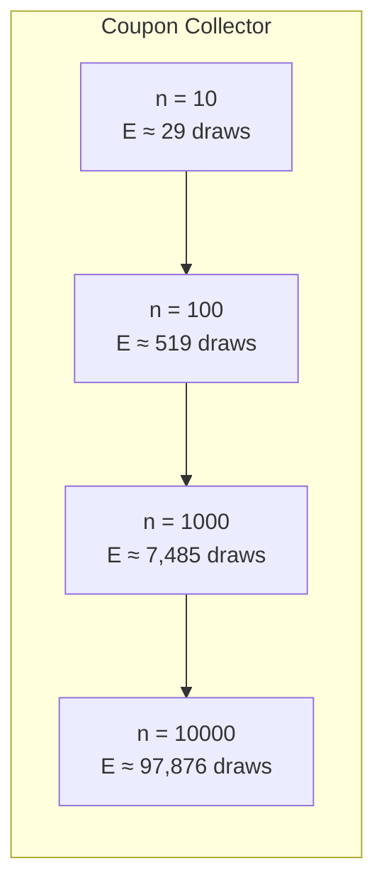
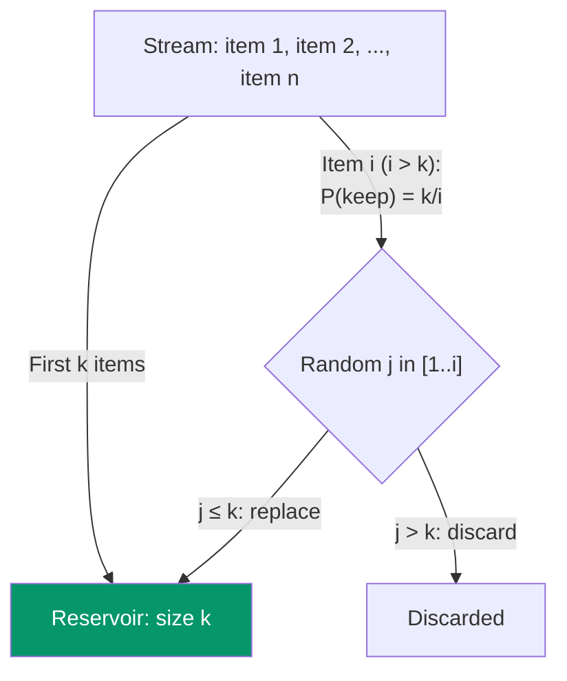
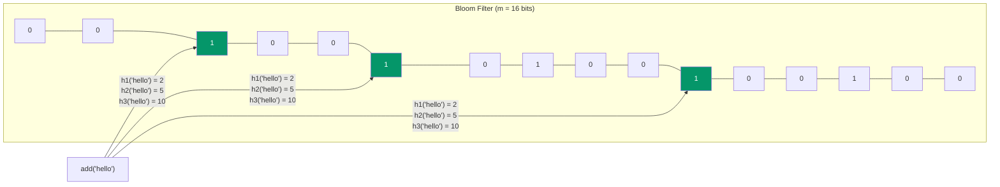
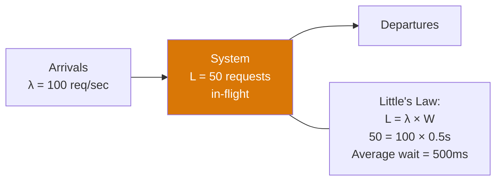

# Probability for System Design

You do not need a math degree to design reliable systems, but you do need enough probability to answer questions like: "How likely is a UUID collision in our database?" or "How many samples do we need before our cache is warm?" or "What is the false positive rate of our Bloom filter?" This page covers the probability concepts that show up repeatedly in system design interviews and real engineering decisions.

## Birthday Paradox

### The Concept

The birthday paradox states that in a group of just 23 people, there is a greater than 50% chance that two people share a birthday. This is counterintuitive because there are 365 possible birthdays, but collisions happen far sooner than you expect.

The general formula for collision probability with `n` items and `d` possible values:

```
P(collision) ≈ 1 - e^(-n² / 2d)
```

For a 50% collision probability:

```
n ≈ 1.177 × √d
```

### Application: Hash Collisions

If you are using a hash function with `b` bits, the number of items before a 50% collision probability is approximately `2^(b/2)`.

| Hash Size | Possible Values | 50% Collision At | Use Case |
|-----------|----------------|-----------------|----------|
| 32-bit | 4.3 × 10^9 | ~77,000 items | Small internal lookup |
| 64-bit | 1.8 × 10^19 | ~5 billion items | Session IDs (borderline) |
| 128-bit (UUID v4) | 3.4 × 10^38 | ~18 quintillion | Database primary keys |
| 256-bit (SHA-256) | 1.2 × 10^77 | ~4 × 10^38 | Cryptographic use |

```python
import math

def birthday_collision_prob(n: int, d: int) -> float:
    """Probability of at least one collision among n items with d possible values."""
    return 1 - math.exp(-n * (n - 1) / (2 * d))

# UUID v4 has 122 random bits
uuid_space = 2**122
n_uuids = 1_000_000_000  # 1 billion UUIDs

prob = birthday_collision_prob(n_uuids, uuid_space)
print(f"P(collision with {n_uuids:,} UUIDs): {prob:.2e}")
# P(collision with 1,000,000,000 UUIDs): 9.4e-20
# Essentially zero — UUIDs are safe at scale
```

::: tip System Design Interview Pattern
When an interviewer asks "Will we have collisions with this ID scheme?", use the birthday paradox formula. If the hash space is `2^b` bits, you need roughly `2^(b/2)` items before collisions become likely. For 128-bit UUIDs, that is `2^61` — about 2 quintillion — so you are safe.
:::

### Application: Sharding and Load Balancing

The birthday paradox also explains hot spots. If you randomly assign `n` requests to `k` servers:

```python
def expected_max_load(n: int, k: int) -> float:
    """Approximate max load on any server when n items are distributed to k buckets."""
    import math
    # For large n, max load ≈ n/k + sqrt(2 * n/k * ln(k))
    avg = n / k
    return avg + math.sqrt(2 * avg * math.log(k))

# 1M requests, 100 servers
print(f"Expected max load: {expected_max_load(1_000_000, 100):.0f}")
# ~10,960 — the hottest server gets ~10% more than average
```

---

## Coupon Collector Problem

### The Concept

If there are `n` distinct coupons and you collect them randomly (with replacement), on average you need `n × H(n)` draws to collect all of them, where `H(n)` is the harmonic number ≈ `ln(n) + 0.577`.

```
E[draws] = n × (1/1 + 1/2 + 1/3 + ... + 1/n) ≈ n × ln(n) + 0.577n
```



### Application: Cache Warming

If your cache has `n` distinct keys accessed uniformly at random, the coupon collector tells you how many requests you need before the cache is fully warm (all keys loaded).

```python
import math

def cache_warming_requests(n_keys: int, coverage: float = 0.99) -> int:
    """Estimate requests needed to cover `coverage` fraction of `n_keys` distinct cache keys."""
    # For partial coverage: E[requests for k out of n] ≈ n * ln(n / (n-k))
    k = int(n_keys * coverage)
    return int(n_keys * math.log(n_keys / (n_keys - k)))

print(f"100 keys, 99% coverage: {cache_warming_requests(100):,} requests")
# ~461 requests
print(f"10,000 keys, 99% coverage: {cache_warming_requests(10000):,} requests")
# ~46,052 requests
print(f"10,000 keys, 95% coverage: {cache_warming_requests(10000):,} requests")
# Different value — 95% is much cheaper
```

::: tip System Design Application
When discussing cache warming strategies, reference the coupon collector: "With 10,000 cache keys, we need roughly 50,000 random requests to reach 99% coverage. For faster warming, we should pre-populate the cache using a scan of the database rather than relying on random traffic."
:::

### Application: Sampling Coverage

If you are sampling events from a stream to discover distinct event types, the coupon collector gives you the expected number of samples before you see all types.

---

## Reservoir Sampling

### The Concept

Reservoir sampling selects `k` items uniformly at random from a stream of unknown length `n`, using only `O(k)` memory.

**Algorithm R** (Vitter, 1985):

1. Fill the reservoir with the first `k` items.
2. For each subsequent item at position `i` (starting from `k+1`):
   - Generate a random integer `j` from `1` to `i`.
   - If `j <= k`, replace reservoir[j] with the current item.

```python
import random

def reservoir_sample(stream, k: int) -> list:
    """Select k items uniformly at random from a stream of unknown length."""
    reservoir = []

    for i, item in enumerate(stream):
        if i < k:
            reservoir.append(item)
        else:
            j = random.randint(0, i)
            if j < k:
                reservoir[j] = item

    return reservoir

# Sample 100 items from a billion-row file — O(100) memory
with open('huge_log.txt') as f:
    sample = reservoir_sample(f, 100)
```



### Why It Works

For any item at position `i`, the probability it ends up in the reservoir is exactly `k/n`:

- **First k items**: Initially included with probability 1. Must survive all subsequent replacement attempts. The probability of surviving is `k/(k+1) × (k+1)/(k+2) × ... × (n-1)/n = k/n`.
- **Item at position i > k**: Probability of being selected is `k/i`. Must survive replacements from items `i+1` through `n`. Combined probability is `k/n`.

### Application: Streaming Analytics

```javascript
// Real-time: keep a random sample of recent errors
class ErrorSampler {
  #reservoir = [];
  #count = 0;
  #maxSamples;

  constructor(maxSamples = 100) {
    this.#maxSamples = maxSamples;
  }

  add(error) {
    this.#count++;

    if (this.#reservoir.length < this.#maxSamples) {
      this.#reservoir.push(error);
    } else {
      const j = Math.floor(Math.random() * this.#count);
      if (j < this.#maxSamples) {
        this.#reservoir[j] = error;
      }
    }
  }

  getSample() { return [...this.#reservoir]; }
}
```

---

## Bloom Filter False Positive Probability

### The Concept

A Bloom filter is a space-efficient probabilistic data set membership test. It can tell you "definitely not in the set" or "probably in the set." It uses `m` bits and `k` hash functions.



### The Math

After inserting `n` items with `k` hash functions into `m` bits:

**Probability a specific bit is still 0:**

```
P(bit = 0) = (1 - 1/m)^(kn) ≈ e^(-kn/m)
```

**False positive probability** (all k bits are 1 for a non-member):

```
P(false positive) = (1 - e^(-kn/m))^k
```

**Optimal number of hash functions:**

```
k_optimal = (m/n) × ln(2) ≈ 0.693 × (m/n)
```

**Bits per element for target false positive rate `p`:**

```
m/n = -1.44 × log₂(p)
```

| Target FP Rate | Bits Per Element | Hash Functions |
|---------------|-----------------|----------------|
| 10% | 4.8 bits | 3 |
| 1% | 9.6 bits | 7 |
| 0.1% | 14.4 bits | 10 |
| 0.01% | 19.2 bits | 13 |

```python
import math

def bloom_filter_params(n: int, fp_rate: float) -> dict:
    """Calculate optimal Bloom filter parameters."""
    m = int(-n * math.log(fp_rate) / (math.log(2) ** 2))
    k = int((m / n) * math.log(2))
    actual_fp = (1 - math.exp(-k * n / m)) ** k

    return {
        "bits": m,
        "bytes": m // 8,
        "megabytes": m / (8 * 1024 * 1024),
        "hash_functions": k,
        "actual_fp_rate": actual_fp,
    }

# 100 million items, 1% false positive rate
params = bloom_filter_params(100_000_000, 0.01)
print(params)
# {'bits': 958505838, 'bytes': 119813229, 'megabytes': 114.3,
#  'hash_functions': 6, 'actual_fp_rate': 0.0098}
# ~114 MB to test membership in 100M items with 1% FP rate
```

::: tip System Design: When to Use Bloom Filters
- **Database queries**: Check if a key exists before hitting disk (used by Cassandra, LevelDB, RocksDB)
- **Web crawling**: Track visited URLs without storing all of them
- **Spam filtering**: Quick check if an email address is in a block list
- **CDN**: Check if content is in cache before forwarding to origin
:::

---

## Expected Value for Capacity Planning

### The Concept

Expected value `E[X]` is the long-run average outcome. For capacity planning, you need both the expected value and the variance — a system that handles the average but not the peaks will fail.

### Application: Request Rate Planning

```python
# Poisson process — models random arrivals (web requests)
import math

def poisson_probability(lam: float, k: int) -> float:
    """P(X = k) where X ~ Poisson(lambda)."""
    return (lam ** k * math.exp(-lam)) / math.factorial(k)

def poisson_capacity(avg_rps: float, target_percentile: float = 0.999) -> int:
    """Find the request rate we should provision for."""
    cumulative = 0
    for k in range(int(avg_rps * 3)):
        cumulative += poisson_probability(avg_rps, k)
        if cumulative >= target_percentile:
            return k
    return int(avg_rps * 3)

avg_rps = 1000
p99_9 = poisson_capacity(avg_rps, 0.999)
print(f"Average: {avg_rps} RPS → Provision for: {p99_9} RPS (p99.9)")
# Average: 1000 RPS → Provision for: ~1098 RPS (p99.9)
```

### Application: Queue Wait Times (Little's Law)

Little's Law relates the average number of items in a system to the arrival rate and average time in the system:

```
L = λ × W

Where:
  L = average number of items in the system
  λ = average arrival rate
  W = average time an item spends in the system
```



::: tip Interview Application
If an interviewer says "We have 100 requests per second and each takes 500ms to process," apply Little's Law: you have 50 concurrent requests on average. You need enough worker threads/processes/pods to handle 50 concurrent requests — plus headroom for variance.
:::

---

## Monte Carlo Estimation

### The Concept

Monte Carlo methods use random sampling to estimate quantities that are difficult to compute analytically. The accuracy improves with more samples at a rate of `1/√n`.

### Application: Estimating Pi

```python
import random

def estimate_pi(n_samples: int) -> float:
    """Estimate pi using Monte Carlo: ratio of points in a quarter circle to a square."""
    inside = 0
    for _ in range(n_samples):
        x, y = random.random(), random.random()
        if x * x + y * y <= 1:
            inside += 1
    return 4 * inside / n_samples

# Accuracy improves with sqrt(n)
for n in [1000, 10000, 100000, 1000000]:
    pi_est = estimate_pi(n)
    error = abs(pi_est - 3.14159265) / 3.14159265 * 100
    print(f"n={n:>10,}: π ≈ {pi_est:.6f}  error: {error:.3f}%")
```

### Application: System Capacity Estimation

When exact analysis is intractable (complex queueing systems, failure cascades), Monte Carlo simulation gives you answers.

```python
import random

def simulate_availability(
    component_availability: list[float],
    architecture: str,  # 'series' or 'parallel'
    n_simulations: int = 100_000
) -> float:
    """Monte Carlo estimation of system availability."""
    up_count = 0

    for _ in range(n_simulations):
        components_up = [
            random.random() < avail
            for avail in component_availability
        ]

        if architecture == 'series':
            system_up = all(components_up)  # All must be up
        else:  # parallel
            system_up = any(components_up)  # At least one must be up

        if system_up:
            up_count += 1

    return up_count / n_simulations

# 3 services in series (all must be up), each 99.9% available
series_avail = simulate_availability([0.999, 0.999, 0.999], 'series')
print(f"Series availability: {series_avail:.4%}")
# ~99.70% — each additional service multiplies failure probability

# 3 replicas in parallel (at least one must be up), each 99.9% available
parallel_avail = simulate_availability([0.999, 0.999, 0.999], 'parallel')
print(f"Parallel availability: {parallel_avail:.8%}")
# ~99.9999999% — redundancy dramatically improves availability
```

### Confidence in Monte Carlo Results

The standard error of a Monte Carlo estimate with `n` samples:

```
SE = σ / √n
```

| Samples | Relative Error (for proportion ~0.5) |
|---------|--------------------------------------|
| 1,000 | ~1.6% |
| 10,000 | ~0.5% |
| 100,000 | ~0.16% |
| 1,000,000 | ~0.05% |

::: warning Diminishing Returns
Going from 1,000 to 10,000 samples (10x more work) only reduces error by ~3x. Going from 100,000 to 1,000,000 (10x more work) reduces error by ~3x again. Budget your simulation time accordingly.
:::

---

## Cheat Sheet: Quick Formulas

| Concept | Formula | Engineering Use |
|---------|---------|-----------------|
| Birthday paradox (50% collision) | `n ≈ 1.18 × √d` | Hash collision estimation |
| Coupon collector (full coverage) | `E ≈ n × ln(n)` | Cache warming, sampling |
| Reservoir sampling | Keep with P = k/i for item i | Stream sampling |
| Bloom filter FP rate | `(1 - e^(-kn/m))^k` | Set membership testing |
| Little's Law | `L = λ × W` | Queue/capacity sizing |
| Poisson P(X=k) | `λ^k × e^(-λ) / k!` | Request rate modeling |
| Monte Carlo error | `SE = σ / √n` | Simulation accuracy |

---

## Related Pages

- [Statistics for A/B Testing](/algorithms/statistics-ab-testing) — Hypothesis testing and experimentation
- [Hash Tables](/algorithms/hash-tables) — Hash function collision handling
- [Sorting & Searching](/algorithms/sorting-searching) — Algorithmic complexity
- [System Design Interviews](/system-design-interviews/) — Where these concepts get applied
