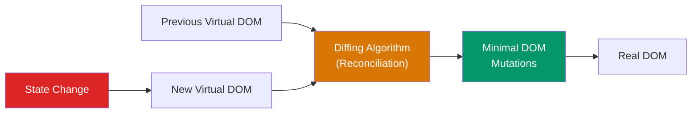
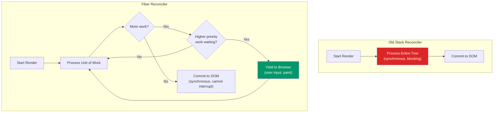
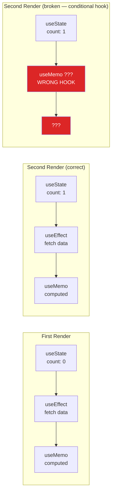
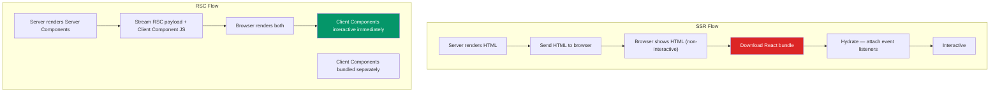
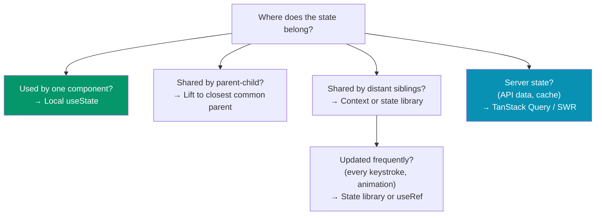

# React Interview Questions

React interviews test three things: whether you understand the rendering model, whether you can build real features with hooks, and whether you know when React is the wrong tool for a problem. This page covers the questions that separate candidates who have used React from candidates who understand React.

## Virtual DOM and Reconciliation

### Q: What is the Virtual DOM and why does React use it?

The Virtual DOM is a lightweight JavaScript representation of the actual DOM. React maintains a virtual tree, and when state changes, it creates a new virtual tree, diffs it against the previous one, and applies only the minimal set of DOM mutations needed.



**Why not just update the real DOM directly?**

- DOM operations are expensive — they trigger layout recalculation, painting, and compositing.
- Batching multiple updates into one DOM operation is far more efficient.
- The diffing algorithm is O(n) — React compares nodes level by level, assuming:
  1. Elements of different types produce different trees.
  2. The `key` prop identifies which children remain stable across renders.

### Q: Explain the reconciliation algorithm

React's reconciliation compares two virtual DOM trees. The key rules:

| Scenario | React's Behavior |
|----------|-----------------|
| Different element types (`<div>` → `<span>`) | Destroy old tree, build new tree from scratch |
| Same element type | Keep the DOM node, update only changed attributes |
| Component type changes | Unmount old component, mount new component |
| Lists without keys | Re-render all items (worst case) |
| Lists with stable keys | Match items by key, minimize moves |

::: danger Keys Must Be Stable and Unique
Using array index as a key causes bugs when items are reordered, inserted, or deleted. The key must identify the data, not the position.

```jsx
// BAD — index as key
{items.map((item, index) => <Item key={index} {...item} />)}

// GOOD — stable unique ID
{items.map(item => <Item key={item.id} {...item} />)}
```
:::

### Q: What is React Fiber?

Fiber is the reimplementation of React's core algorithm (introduced in React 16). The key insight: rendering work can be split into chunks and spread across multiple frames, allowing the browser to handle high-priority work (user input, animations) between chunks.



**Each fiber node stores**:

- Type of component/element
- Pending props and state
- Pointer to parent, child, and sibling fiber nodes
- Effect tags (placement, update, deletion)
- Priority lane

::: tip Two-Phase Rendering
Fiber splits rendering into two phases:
1. **Render phase** (interruptible) — determines what changes are needed
2. **Commit phase** (synchronous) — applies changes to the DOM

Side effects (DOM mutations, refs, lifecycle methods) only happen in the commit phase.
:::

---

## Hooks

### Q: Why are hooks called in a specific order?

React stores hooks for each component as a linked list. On each render, React walks the list in order. If a hook is called conditionally, the list length or order changes, and React maps the wrong state to the wrong hook.



```jsx
// BAD — conditional hook
function Profile({ showAge }) {
  const [name, setName] = useState('');

  if (showAge) {
    const [age, setAge] = useState(0); // Breaks hook order
  }

  useEffect(() => { /* ... */ }); // Gets wrong position
}

// GOOD — hook always called, condition inside
function Profile({ showAge }) {
  const [name, setName] = useState('');
  const [age, setAge] = useState(0); // Always called

  useEffect(() => {
    if (showAge) {
      // Conditional logic inside the hook
    }
  }, [showAge]);
}
```

### Q: useEffect cleanup and dependency array

```jsx
function ChatRoom({ roomId }) {
  const [messages, setMessages] = useState([]);

  useEffect(() => {
    // Setup: subscribe to the room
    const connection = createConnection(roomId);
    connection.on('message', (msg) => {
      setMessages(prev => [...prev, msg]);
    });
    connection.connect();

    // Cleanup: runs before re-running effect or on unmount
    return () => {
      connection.disconnect();
    };
  }, [roomId]); // Only re-run when roomId changes

  return <MessageList messages={messages} />;
}
```

**Dependency array rules:**

| Dependency Array | Effect Runs |
|-----------------|-------------|
| Not provided | After every render |
| `[]` | Once on mount, cleanup on unmount |
| `[a, b]` | When `a` or `b` changes (Object.is comparison) |

::: warning Common Pitfall: Stale Closures
```jsx
function Counter() {
  const [count, setCount] = useState(0);

  useEffect(() => {
    const id = setInterval(() => {
      // BUG: `count` is captured as 0, never updates
      setCount(count + 1);
    }, 1000);
    return () => clearInterval(id);
  }, []); // Empty deps — closure captures initial count

  // FIX: use functional updater
  useEffect(() => {
    const id = setInterval(() => {
      setCount(prev => prev + 1); // Always uses latest state
    }, 1000);
    return () => clearInterval(id);
  }, []);
}
```
:::

### Q: useMemo vs useCallback — when do they actually help?

Both are optimization hooks. `useMemo` caches a computed value. `useCallback` caches a function reference.

```jsx
// useMemo — expensive computation
function Dashboard({ transactions }) {
  // Without useMemo: recalculates on every render
  const stats = useMemo(() => {
    return {
      total: transactions.reduce((sum, t) => sum + t.amount, 0),
      average: transactions.reduce((sum, t) => sum + t.amount, 0) / transactions.length,
      max: Math.max(...transactions.map(t => t.amount)),
    };
  }, [transactions]);

  return <StatsPanel stats={stats} />;
}

// useCallback — stable function reference for memoized children
function Parent() {
  const [count, setCount] = useState(0);

  // Without useCallback: new function reference every render,
  // causing ExpensiveChild to re-render
  const handleClick = useCallback((id) => {
    console.log('Clicked:', id);
  }, []); // No dependencies — function never changes

  return (
    <>
      <button onClick={() => setCount(c => c + 1)}>Count: {count}</button>
      <ExpensiveChild onClick={handleClick} />
    </>
  );
}

const ExpensiveChild = React.memo(({ onClick }) => {
  // Expensive render...
  return <div onClick={() => onClick(42)}>Click me</div>;
});
```

::: tip When Memoization Hurts
`useMemo` and `useCallback` have overhead — they store previous values and compare dependencies. Do not memoize everything. Memoize when:
- The computation is genuinely expensive (>1ms)
- The value is passed to a `React.memo` wrapped child
- The value is a dependency of another hook

Do not memoize primitive values, simple object literals used in the same component, or cheap computations.
:::

---

## React Server Components vs SSR

### Q: What is the difference between RSC and SSR?

| Aspect | SSR (Server-Side Rendering) | React Server Components |
|--------|---------------------------|------------------------|
| What runs on server | Full component tree, once, to produce HTML | Server Components only — they never ship to client |
| JavaScript shipped | Full React app (hydration) | Only Client Component code |
| Interactivity | After hydration (full React bundle) | Client Components are interactive immediately |
| Data fetching | `getServerSideProps` or fetch during render | `async` components with direct DB/API access |
| Re-renders | Client-side after hydration | Server Components re-render on server, stream updated UI |
| Bundle size | Everything in the bundle | Server-only code never reaches the client |



```jsx
// Server Component (default in Next.js App Router)
// Runs on server only — never shipped to client
async function ProductPage({ id }) {
  const product = await db.query('SELECT * FROM products WHERE id = $1', [id]);
  // Can use server-only APIs, secrets, databases

  return (
    <div>
      <h1>{product.name}</h1>
      <p>{product.description}</p>
      <AddToCartButton productId={id} /> {/* Client Component */}
    </div>
  );
}

// Client Component — must opt in with 'use client'
'use client';

function AddToCartButton({ productId }) {
  const [added, setAdded] = useState(false);

  return (
    <button onClick={() => {
      addToCart(productId);
      setAdded(true);
    }}>
      {added ? 'Added' : 'Add to Cart'}
    </button>
  );
}
```

---

## State Management

### Q: When to lift state, when to use context, when to use a library?



| Scenario | Solution | Why |
|----------|----------|-----|
| Form input state | `useState` in the form component | Local, no sharing needed |
| Theme/locale | React Context | Changes rarely, many consumers |
| Shopping cart | Zustand or Jotai | Updated from many components, needs persistence |
| API data | TanStack Query | Handles caching, revalidation, loading states |
| Complex forms | React Hook Form | Performance — avoids re-rendering on every keystroke |
| High-frequency updates | `useRef` + external store | Context re-renders all consumers on every change |

### Q: Why does Context cause performance issues?

When a Context value changes, every component consuming that context re-renders — even if it only uses a part of the value that did not change.

```jsx
// BAD — one big context, everything re-renders
const AppContext = React.createContext();

function AppProvider({ children }) {
  const [user, setUser] = useState(null);
  const [theme, setTheme] = useState('light');
  const [notifications, setNotifications] = useState([]);

  return (
    <AppContext.Provider value={{
      user, setUser, theme, setTheme,
      notifications, setNotifications
    }}>
      {children}
    </AppContext.Provider>
  );
}
// Changing `theme` re-renders components that only use `user`

// GOOD — split into separate contexts
const UserContext = React.createContext();
const ThemeContext = React.createContext();
const NotificationContext = React.createContext();
```

---

## Performance Optimization

### Q: React.memo — when and how

`React.memo` is a higher-order component that skips re-rendering when props have not changed (shallow comparison).

```jsx
// Only re-renders when `items` or `onSelect` references change
const ItemList = React.memo(function ItemList({ items, onSelect }) {
  console.log('ItemList rendered');
  return (
    <ul>
      {items.map(item => (
        <li key={item.id} onClick={() => onSelect(item.id)}>
          {item.name}
        </li>
      ))}
    </ul>
  );
});

// Custom comparison function
const ChartWidget = React.memo(
  function ChartWidget({ data, config }) {
    return <canvas ref={drawChart(data, config)} />;
  },
  (prevProps, nextProps) => {
    // Return true to SKIP re-render
    return (
      prevProps.data.length === nextProps.data.length &&
      prevProps.config.type === nextProps.config.type
    );
  }
);
```

### Q: Code splitting with lazy and Suspense

```jsx
import { lazy, Suspense } from 'react';

// Lazy-load heavy components
const AdminDashboard = lazy(() => import('./AdminDashboard'));
const AnalyticsChart = lazy(() => import('./AnalyticsChart'));

function App() {
  return (
    <Suspense fallback={<Spinner />}>
      <Routes>
        <Route path="/admin" element={<AdminDashboard />} />
        <Route path="/analytics" element={<AnalyticsChart />} />
      </Routes>
    </Suspense>
  );
}
```

### Q: Explain React's batching behavior

React 18 introduced automatic batching for all updates, not just event handlers.

```jsx
// React 17 — only batched inside event handlers
function handleClick() {
  setCount(c => c + 1);
  setFlag(f => !f);
  // One re-render (batched)
}

setTimeout(() => {
  setCount(c => c + 1);
  setFlag(f => !f);
  // TWO re-renders in React 17 (not batched)
  // ONE re-render in React 18 (automatic batching)
}, 1000);

// To opt out of batching (rare):
import { flushSync } from 'react-dom';

flushSync(() => { setCount(c => c + 1); });
// DOM updated here
flushSync(() => { setFlag(f => !f); });
// DOM updated here
```

---

## Custom Hooks

### Q: Write a custom hook for API data fetching

```jsx
function useApi(url, options = {}) {
  const [state, setState] = useState({
    data: null,
    error: null,
    loading: true,
  });

  const optionsRef = useRef(options);
  optionsRef.current = options;

  useEffect(() => {
    const abortController = new AbortController();

    async function fetchData() {
      setState(prev => ({ ...prev, loading: true, error: null }));

      try {
        const response = await fetch(url, {
          ...optionsRef.current,
          signal: abortController.signal,
        });

        if (!response.ok) {
          throw new Error(`HTTP ${response.status}: ${response.statusText}`);
        }

        const data = await response.json();
        setState({ data, error: null, loading: false });
      } catch (err) {
        if (err.name !== 'AbortError') {
          setState({ data: null, error: err, loading: false });
        }
      }
    }

    fetchData();

    return () => abortController.abort();
  }, [url]);

  return state;
}

// Usage
function UserProfile({ userId }) {
  const { data: user, error, loading } = useApi(`/api/users/${userId}`);

  if (loading) return <Skeleton />;
  if (error) return <ErrorBanner error={error} />;
  return <ProfileCard user={user} />;
}
```

### Q: Write a useDebounce hook

```jsx
function useDebounce(value, delay) {
  const [debouncedValue, setDebouncedValue] = useState(value);

  useEffect(() => {
    const timer = setTimeout(() => setDebouncedValue(value), delay);
    return () => clearTimeout(timer);
  }, [value, delay]);

  return debouncedValue;
}

// Usage
function Search() {
  const [query, setQuery] = useState('');
  const debouncedQuery = useDebounce(query, 300);

  useEffect(() => {
    if (debouncedQuery) {
      searchApi(debouncedQuery).then(setResults);
    }
  }, [debouncedQuery]);

  return <input value={query} onChange={e => setQuery(e.target.value)} />;
}
```

---

## Quick-Fire Questions

| Question | Answer |
|----------|--------|
| What is `StrictMode`? | Development-only wrapper that double-invokes render and effects to surface bugs. No production impact. |
| Controlled vs uncontrolled components? | Controlled: React state drives the input (`value` + `onChange`). Uncontrolled: DOM holds the state (`ref`). |
| What is a portal? | `ReactDOM.createPortal(child, domNode)` — renders children into a DOM node outside the parent hierarchy. Used for modals, tooltips. |
| What is `useId`? | Generates stable unique IDs for accessibility attributes. Works with SSR (avoids hydration mismatches). |
| `useLayoutEffect` vs `useEffect`? | `useLayoutEffect` fires synchronously after DOM mutations, before paint. Use for DOM measurements. `useEffect` fires asynchronously after paint. |
| What is `useTransition`? | Marks state updates as non-urgent. React keeps the old UI visible while rendering the new one, preventing janky loading states. |
| `useDeferredValue`? | Returns a deferred version of a value. React renders with the old value first, then re-renders with the new value at lower priority. |
| What is `forwardRef`? | Passes a `ref` through a component to a child DOM element. Required because function components do not have instances. |

---

## Related Pages

- [JavaScript Interview Questions](/algorithms/javascript-interview) — Language fundamentals
- [Node.js Interview Questions](/algorithms/nodejs-interview) — Server-side JavaScript
- [Dynamic Programming](/algorithms/dynamic-programming) — Algorithmic problem solving
- [Trees](/algorithms/trees) — Data structure traversals
