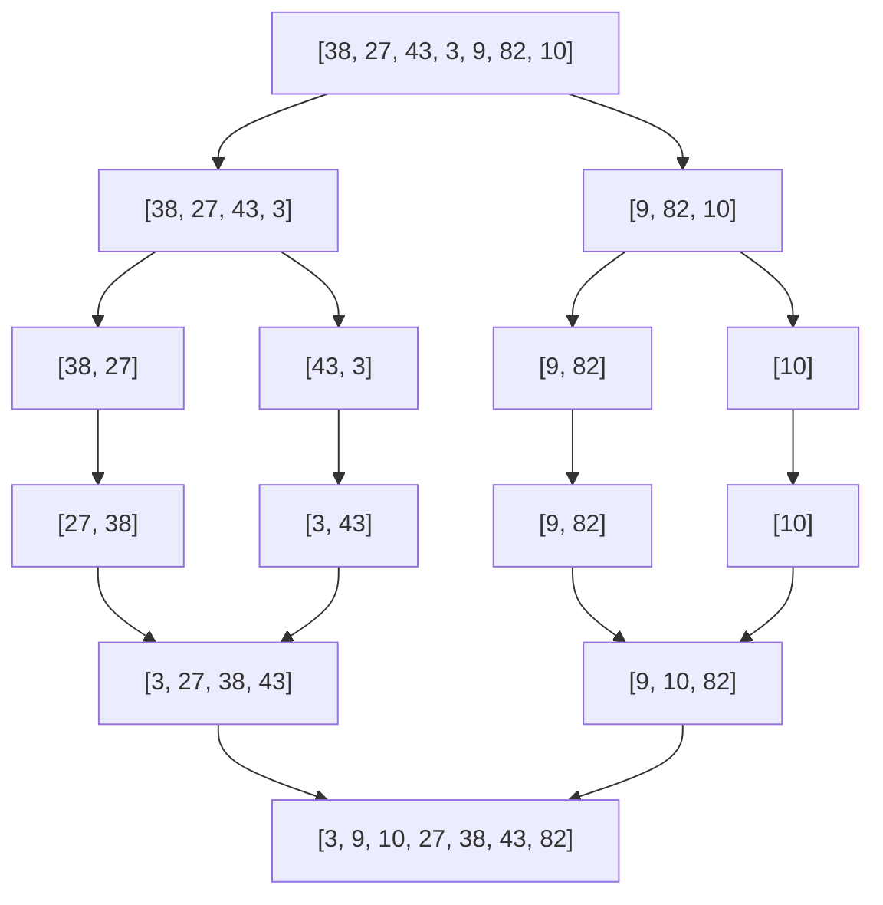

# Sorting & Searching

Sorting and searching are the workhorses of computer science. Every database query involves sorting or searching. Every recommendation engine ranks (sorts) results. Every time you call `Array.prototype.sort()` or `list.sort()`, you are running a carefully engineered sorting algorithm. Understanding these algorithms is not about reimplementing them — it is about knowing their trade-offs so you can choose the right tool, and about mastering binary search, which is arguably the most versatile technique in all of algorithms.

## Sorting Algorithms Overview

| Algorithm | Best | Average | Worst | Space | Stable? | In-Place? |
|---|---|---|---|---|---|---|
| Bubble Sort | $O(n)$ | $O(n^2)$ | $O(n^2)$ | $O(1)$ | Yes | Yes |
| Selection Sort | $O(n^2)$ | $O(n^2)$ | $O(n^2)$ | $O(1)$ | No | Yes |
| Insertion Sort | $O(n)$ | $O(n^2)$ | $O(n^2)$ | $O(1)$ | Yes | Yes |
| Merge Sort | $O(n \log n)$ | $O(n \log n)$ | $O(n \log n)$ | $O(n)$ | Yes | No |
| Quick Sort | $O(n \log n)$ | $O(n \log n)$ | $O(n^2)$ | $O(\log n)$ | No | Yes |
| Heap Sort | $O(n \log n)$ | $O(n \log n)$ | $O(n \log n)$ | $O(1)$ | No | Yes |
| Counting Sort | $O(n + k)$ | $O(n + k)$ | $O(n + k)$ | $O(k)$ | Yes | No |
| Radix Sort | $O(d(n + k))$ | $O(d(n + k))$ | $O(d(n + k))$ | $O(n + k)$ | Yes | No |

*$k$ = range of values, $d$ = number of digits.*

::: tip When to Use Which
- **Nearly sorted data**: Insertion sort ($O(n)$ best case)
- **General purpose**: Merge sort (guaranteed $O(n \log n)$, stable)
- **In-place, general purpose**: Quicksort (fastest in practice for random data)
- **Integer data with known range**: Counting sort or radix sort ($O(n)$)
- **External sorting (data doesn't fit in memory)**: Merge sort (sequential access pattern)
- **Priority queue operations**: Heap sort or partial sorting with a heap
:::

## Merge Sort

Divide the array in half, recursively sort each half, then merge the sorted halves. The merge step is the key insight — merging two sorted arrays takes $O(n)$ time.



**TypeScript:**

```typescript
function mergeSort(arr: number[]): number[] {
  if (arr.length <= 1) return arr;

  const mid = Math.floor(arr.length / 2);
  const left = mergeSort(arr.slice(0, mid));
  const right = mergeSort(arr.slice(mid));

  return merge(left, right);
}

function merge(left: number[], right: number[]): number[] {
  const result: number[] = [];
  let i = 0, j = 0;

  while (i < left.length && j < right.length) {
    if (left[i] <= right[j]) {
      result.push(left[i++]);
    } else {
      result.push(right[j++]);
    }
  }

  return result.concat(left.slice(i), right.slice(j));
}
```

**Python:**

```python
def merge_sort(arr: list[int]) -> list[int]:
    if len(arr) <= 1:
        return arr

    mid = len(arr) // 2
    left = merge_sort(arr[:mid])
    right = merge_sort(arr[mid:])

    return merge(left, right)

def merge(left: list[int], right: list[int]) -> list[int]:
    result = []
    i = j = 0

    while i < len(left) and j < len(right):
        if left[i] <= right[j]:
            result.append(left[i])
            i += 1
        else:
            result.append(right[j])
            j += 1

    result.extend(left[i:])
    result.extend(right[j:])
    return result
```

**Complexity:** $O(n \log n)$ time always. $O(n)$ space for the temporary arrays. Stable.

**Why merge sort matters in production:** It is the basis of external sorting (sorting data that doesn't fit in RAM). The merge step only needs sequential access, making it efficient for disk I/O. TimSort (Python's `list.sort()`, Java's `Arrays.sort()` for objects) is a hybrid of merge sort and insertion sort.

## Quick Sort

Choose a pivot, partition the array so everything less than the pivot is on the left and everything greater is on the right, then recursively sort each side.

**TypeScript:**

```typescript
function quickSort(arr: number[], lo = 0, hi = arr.length - 1): void {
  if (lo >= hi) return;

  const pivot = partition(arr, lo, hi);
  quickSort(arr, lo, pivot - 1);
  quickSort(arr, pivot + 1, hi);
}

function partition(arr: number[], lo: number, hi: number): number {
  const pivot = arr[hi]; // last element as pivot
  let i = lo - 1;

  for (let j = lo; j < hi; j++) {
    if (arr[j] <= pivot) {
      i++;
      [arr[i], arr[j]] = [arr[j], arr[i]];
    }
  }

  [arr[i + 1], arr[hi]] = [arr[hi], arr[i + 1]];
  return i + 1;
}
```

**Python:**

```python
import random

def quick_sort(arr: list[int], lo: int = 0, hi: int | None = None) -> None:
    if hi is None:
        hi = len(arr) - 1
    if lo >= hi:
        return

    pivot_idx = partition(arr, lo, hi)
    quick_sort(arr, lo, pivot_idx - 1)
    quick_sort(arr, pivot_idx + 1, hi)

def partition(arr: list[int], lo: int, hi: int) -> int:
    # Randomized pivot to avoid worst-case on sorted input
    rand_idx = random.randint(lo, hi)
    arr[rand_idx], arr[hi] = arr[hi], arr[rand_idx]

    pivot = arr[hi]
    i = lo - 1

    for j in range(lo, hi):
        if arr[j] <= pivot:
            i += 1
            arr[i], arr[j] = arr[j], arr[i]

    arr[i + 1], arr[hi] = arr[hi], arr[i + 1]
    return i + 1
```

**Complexity:** $O(n \log n)$ average, $O(n^2)$ worst case (when pivot is always min/max). $O(\log n)$ stack space. Not stable.

::: warning
Quicksort's worst case occurs on already-sorted data when the pivot is the first or last element. Always use randomized pivot selection or median-of-three to avoid this in production.
:::

### Quick Select (Kth Smallest Element)

A modified quicksort that only recurses into the partition containing the target index. Expected $O(n)$ time.

**Python:**

```python
def quick_select(arr: list[int], k: int) -> int:
    """Find the kth smallest element (0-indexed)."""
    lo, hi = 0, len(arr) - 1

    while lo <= hi:
        pivot_idx = partition(arr, lo, hi)
        if pivot_idx == k:
            return arr[k]
        elif pivot_idx < k:
            lo = pivot_idx + 1
        else:
            hi = pivot_idx - 1

    return arr[lo]
```

**Complexity:** $O(n)$ expected, $O(n^2)$ worst case. Use median-of-medians for guaranteed $O(n)$.

## Heap Sort

Build a max-heap from the array, then repeatedly extract the maximum element.

**TypeScript:**

```typescript
function heapSort(arr: number[]): void {
  const n = arr.length;

  // Build max-heap
  for (let i = Math.floor(n / 2) - 1; i >= 0; i--) {
    heapify(arr, n, i);
  }

  // Extract elements from heap one by one
  for (let i = n - 1; i > 0; i--) {
    [arr[0], arr[i]] = [arr[i], arr[0]]; // move max to end
    heapify(arr, i, 0);
  }
}

function heapify(arr: number[], heapSize: number, rootIdx: number): void {
  let largest = rootIdx;
  const left = 2 * rootIdx + 1;
  const right = 2 * rootIdx + 2;

  if (left < heapSize && arr[left] > arr[largest]) largest = left;
  if (right < heapSize && arr[right] > arr[largest]) largest = right;

  if (largest !== rootIdx) {
    [arr[rootIdx], arr[largest]] = [arr[largest], arr[rootIdx]];
    heapify(arr, heapSize, largest);
  }
}
```

**Python:**

```python
def heap_sort(arr: list[int]) -> None:
    n = len(arr)

    for i in range(n // 2 - 1, -1, -1):
        heapify(arr, n, i)

    for i in range(n - 1, 0, -1):
        arr[0], arr[i] = arr[i], arr[0]
        heapify(arr, i, 0)

def heapify(arr: list[int], heap_size: int, root: int) -> None:
    largest = root
    left = 2 * root + 1
    right = 2 * root + 2

    if left < heap_size and arr[left] > arr[largest]:
        largest = left
    if right < heap_size and arr[right] > arr[largest]:
        largest = right

    if largest != root:
        arr[root], arr[largest] = arr[largest], arr[root]
        heapify(arr, heap_size, largest)
```

**Complexity:** $O(n \log n)$ always. $O(1)$ space. Not stable. See [Heaps & Priority Queues](/algorithms/heaps-priority-queues) for more.

## Non-Comparison Sorts

These break the $\Omega(n \log n)$ lower bound for comparison-based sorting by exploiting properties of the data.

### Counting Sort

For integers in a known range $[0, k]$. Count occurrences, then reconstruct.

**Python:**

```python
def counting_sort(arr: list[int]) -> list[int]:
    if not arr:
        return []

    max_val = max(arr)
    count = [0] * (max_val + 1)

    for num in arr:
        count[num] += 1

    result = []
    for val, cnt in enumerate(count):
        result.extend([val] * cnt)

    return result
```

**Complexity:** $O(n + k)$ time and space. Efficient when $k = O(n)$.

### Radix Sort

Sort by each digit position, from least significant to most significant, using a stable sort (like counting sort) at each level.

**Python:**

```python
def radix_sort(arr: list[int]) -> list[int]:
    if not arr:
        return []

    max_val = max(arr)
    exp = 1

    while max_val // exp > 0:
        arr = counting_sort_by_digit(arr, exp)
        exp *= 10

    return arr

def counting_sort_by_digit(arr: list[int], exp: int) -> list[int]:
    n = len(arr)
    output = [0] * n
    count = [0] * 10

    for num in arr:
        digit = (num // exp) % 10
        count[digit] += 1

    for i in range(1, 10):
        count[i] += count[i - 1]

    for i in range(n - 1, -1, -1):
        digit = (arr[i] // exp) % 10
        output[count[digit] - 1] = arr[i]
        count[digit] -= 1

    return output
```

**Complexity:** $O(d(n + k))$ where $d$ is the number of digits and $k$ is the base (10). For 32-bit integers: $O(n)$.

## Binary Search

Binary search is the most important searching technique. It works on sorted data and eliminates half the search space on each step.

### Standard Binary Search

**TypeScript:**

```typescript
function binarySearch(nums: number[], target: number): number {
  let lo = 0;
  let hi = nums.length - 1;

  while (lo <= hi) {
    const mid = lo + Math.floor((hi - lo) / 2); // avoid overflow
    if (nums[mid] === target) return mid;
    if (nums[mid] < target) lo = mid + 1;
    else hi = mid - 1;
  }

  return -1; // not found
}
```

**Python:**

```python
def binary_search(nums: list[int], target: int) -> int:
    lo, hi = 0, len(nums) - 1

    while lo <= hi:
        mid = lo + (hi - lo) // 2
        if nums[mid] == target:
            return mid
        elif nums[mid] < target:
            lo = mid + 1
        else:
            hi = mid - 1

    return -1
```

**Complexity:** $O(\log n)$ time, $O(1)$ space.

::: danger
Use `lo + (hi - lo) // 2` instead of `(lo + hi) // 2` to prevent integer overflow in languages with fixed-size integers (C, C++, Java). In Python and TypeScript this isn't strictly necessary, but it's a good habit.
:::

### Binary Search Variations

These variations are where binary search becomes powerful. The key insight: binary search doesn't just find a target — it finds a **boundary**.

#### Find Leftmost (First Occurrence)

**TypeScript:**

```typescript
function findFirst(nums: number[], target: number): number {
  let lo = 0, hi = nums.length - 1;
  let result = -1;

  while (lo <= hi) {
    const mid = lo + Math.floor((hi - lo) / 2);
    if (nums[mid] === target) {
      result = mid;
      hi = mid - 1; // keep searching left
    } else if (nums[mid] < target) {
      lo = mid + 1;
    } else {
      hi = mid - 1;
    }
  }

  return result;
}
```

#### Find Rightmost (Last Occurrence)

**TypeScript:**

```typescript
function findLast(nums: number[], target: number): number {
  let lo = 0, hi = nums.length - 1;
  let result = -1;

  while (lo <= hi) {
    const mid = lo + Math.floor((hi - lo) / 2);
    if (nums[mid] === target) {
      result = mid;
      lo = mid + 1; // keep searching right
    } else if (nums[mid] < target) {
      lo = mid + 1;
    } else {
      hi = mid - 1;
    }
  }

  return result;
}
```

#### Search in Rotated Sorted Array

**Python:**

```python
def search_rotated(nums: list[int], target: int) -> int:
    lo, hi = 0, len(nums) - 1

    while lo <= hi:
        mid = lo + (hi - lo) // 2
        if nums[mid] == target:
            return mid

        # Determine which half is sorted
        if nums[lo] <= nums[mid]:  # left half is sorted
            if nums[lo] <= target < nums[mid]:
                hi = mid - 1
            else:
                lo = mid + 1
        else:  # right half is sorted
            if nums[mid] < target <= nums[hi]:
                lo = mid + 1
            else:
                hi = mid - 1

    return -1
```

#### Binary Search on Answer

When you can frame a problem as "what is the minimum/maximum value such that a condition is true?" — binary search on that value.

**Example: Minimum Capacity to Ship Packages Within D Days**

**Python:**

```python
def ship_within_days(weights: list[int], days: int) -> int:
    def can_ship(capacity: int) -> bool:
        current_load = 0
        needed_days = 1
        for w in weights:
            if current_load + w > capacity:
                needed_days += 1
                current_load = 0
            current_load += w
        return needed_days <= days

    lo = max(weights)       # min possible capacity
    hi = sum(weights)       # max possible capacity

    while lo < hi:
        mid = lo + (hi - lo) // 2
        if can_ship(mid):
            hi = mid
        else:
            lo = mid + 1

    return lo
```

::: tip Binary Search on Answer
This pattern appears constantly in interviews and competitive programming. The framework:
1. Define a predicate function `condition(x) -> bool`
2. Find the boundary where the predicate flips from False to True (or vice versa)
3. Set `lo` and `hi` to the valid range
4. Binary search for the boundary

If `condition(mid)` is True and you want the **minimum** valid value: `hi = mid`
If `condition(mid)` is False and you want the **minimum** valid value: `lo = mid + 1`
:::

## Sorting in Practice

### Language Built-in Sorts

| Language | Algorithm | Stable? |
|---|---|---|
| Python `list.sort()` | TimSort (merge + insertion) | Yes |
| JavaScript `Array.sort()` | TimSort (V8), varies by engine | Depends on engine |
| Java `Arrays.sort()` (primitives) | Dual-pivot quicksort | No |
| Java `Arrays.sort()` (objects) | TimSort | Yes |
| C++ `std::sort()` | Introsort (quick + heap + insertion) | No |
| C++ `std::stable_sort()` | Merge sort | Yes |

### Custom Comparators

**TypeScript:**

```typescript
// Sort objects by multiple keys
const users = [
  { name: "Alice", age: 30 },
  { name: "Bob", age: 25 },
  { name: "Charlie", age: 30 },
];

users.sort((a, b) => {
  if (a.age !== b.age) return a.age - b.age; // ascending age
  return a.name.localeCompare(b.name);         // then alphabetical
});
```

**Python:**

```python
from functools import cmp_to_key

# Sort by multiple criteria
users = [("Alice", 30), ("Bob", 25), ("Charlie", 30)]
users.sort(key=lambda u: (u[1], u[0]))  # (age, name) tuple comparison

# Custom comparator for complex ordering
def compare_versions(v1: str, v2: str) -> int:
    parts1 = list(map(int, v1.split(".")))
    parts2 = list(map(int, v2.split(".")))
    for p1, p2 in zip(parts1, parts2):
        if p1 != p2:
            return p1 - p2
    return len(parts1) - len(parts2)

versions = ["1.2.3", "1.0.1", "1.2.1"]
versions.sort(key=cmp_to_key(compare_versions))
```

## The Lower Bound

Any comparison-based sorting algorithm must make at least $\Omega(n \log n)$ comparisons in the worst case. The proof uses a decision tree argument: there are $n!$ possible orderings, and each comparison can only halve the remaining possibilities.

$$
\text{Height of decision tree} \geq \log_2(n!) = \Theta(n \log n)
$$

This is why counting sort and radix sort are faster — they bypass comparisons by using the structure of the data itself.

## Practice Problems

| Problem | Technique | Difficulty |
|---|---|---|
| Merge Sorted Array | Merge from back | Easy |
| Sort Colors (Dutch National Flag) | Three-way partition | Medium |
| Kth Largest Element | Quick select / heap | Medium |
| Search in Rotated Sorted Array | Modified binary search | Medium |
| Find Peak Element | Binary search | Medium |
| Search a 2D Matrix | Binary search | Medium |
| Median of Two Sorted Arrays | Binary search | Hard |
| Count of Smaller Numbers After Self | Merge sort + count | Hard |
| Find Minimum in Rotated Sorted Array | Binary search | Medium |
| Capacity To Ship Packages | Binary search on answer | Medium |

## Further Reading

- [Heaps & Priority Queues](/algorithms/heaps-priority-queues) — heap sort and partial sorting
- [Arrays & Strings](/algorithms/arrays-strings) — two pointers on sorted arrays
- [Dynamic Programming](/algorithms/dynamic-programming) — LIS uses binary search optimization
- [Database Query Planning](/system-design/databases/query-planning-optimization) — how databases choose sort algorithms
