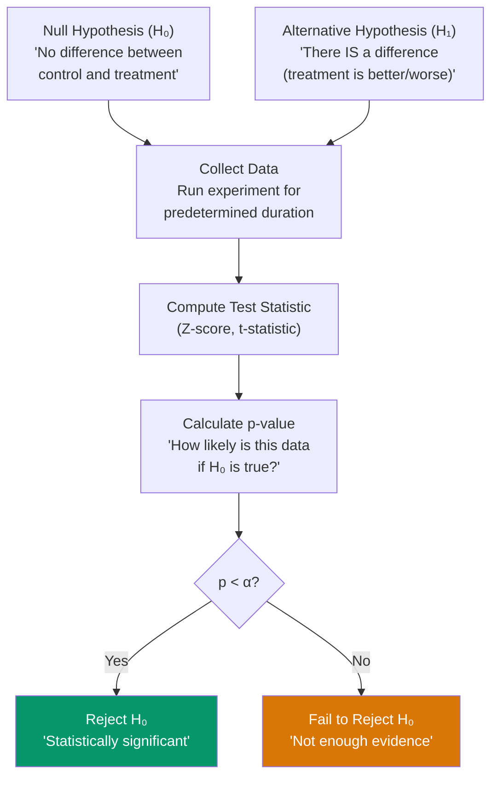
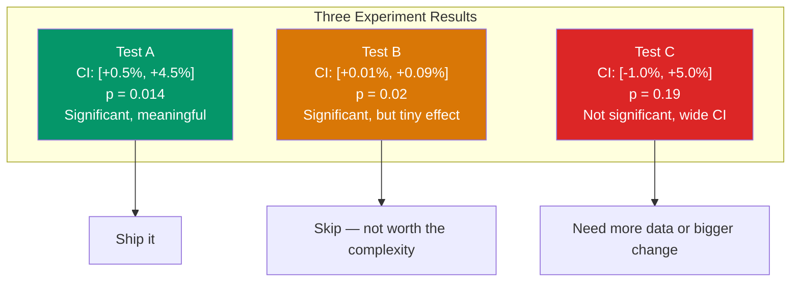
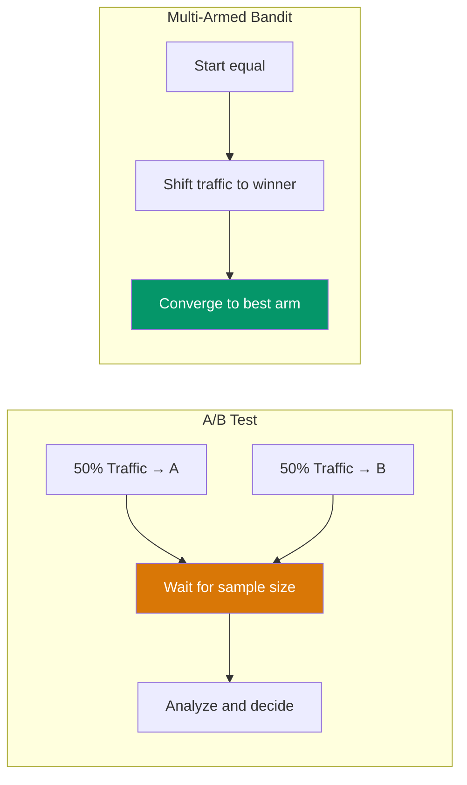
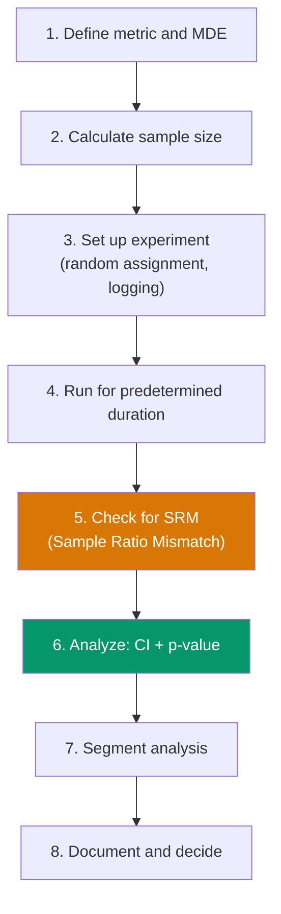

# Statistics for A/B Testing

A/B testing is the scientific method applied to product development. You have a hypothesis ("changing the button color increases clicks"), you run a controlled experiment, and you use statistics to determine whether the observed difference is real or just noise. Getting this wrong means either shipping changes that do not work (false positive) or killing changes that actually help (false negative). This page covers the statistics you need to run experiments correctly.

## Hypothesis Testing

### The Framework

Every A/B test is a hypothesis test with four components:



| Term | Definition | Typical Value |
|------|-----------|---------------|
| **Significance level (alpha)** | P(reject H0 when H0 is true) — false positive rate | 0.05 (5%) |
| **Power (1 - beta)** | P(reject H0 when H0 is false) — true positive rate | 0.80 (80%) |
| **p-value** | Probability of observing data this extreme if H0 is true | Computed from data |
| **Effect size** | Magnitude of the difference you want to detect | Domain-specific |
| **MDE** | Minimum Detectable Effect — smallest meaningful difference | e.g., 2% lift |

### Computing a p-value: Two-Proportion Z-Test

The most common A/B test compares conversion rates between two groups.

```python
import math
from scipy import stats

def two_proportion_z_test(
    conversions_a: int, visitors_a: int,
    conversions_b: int, visitors_b: int
) -> dict:
    """
    Two-proportion Z-test for A/B test significance.
    Returns z-statistic, p-value, and confidence interval for the difference.
    """
    p_a = conversions_a / visitors_a
    p_b = conversions_b / visitors_b
    p_pooled = (conversions_a + conversions_b) / (visitors_a + visitors_b)

    se = math.sqrt(p_pooled * (1 - p_pooled) * (1/visitors_a + 1/visitors_b))
    z = (p_b - p_a) / se
    p_value = 2 * (1 - stats.norm.cdf(abs(z)))  # Two-tailed

    # 95% confidence interval for the difference
    se_diff = math.sqrt(p_a * (1 - p_a) / visitors_a + p_b * (1 - p_b) / visitors_b)
    ci_lower = (p_b - p_a) - 1.96 * se_diff
    ci_upper = (p_b - p_a) + 1.96 * se_diff

    return {
        "control_rate": p_a,
        "treatment_rate": p_b,
        "relative_lift": (p_b - p_a) / p_a * 100,
        "z_statistic": z,
        "p_value": p_value,
        "significant": p_value < 0.05,
        "ci_95": (ci_lower, ci_upper),
    }

# Example: checkout page A/B test
result = two_proportion_z_test(
    conversions_a=500, visitors_a=10000,  # 5.0% conversion
    conversions_b=550, visitors_b=10000,  # 5.5% conversion
)
print(f"Lift: {result['relative_lift']:.1f}%")
print(f"p-value: {result['p_value']:.4f}")
print(f"Significant: {result['significant']}")
print(f"95% CI: [{result['ci_95'][0]:.4f}, {result['ci_95'][1]:.4f}]")
```

::: warning What a p-value Is NOT
- It is NOT the probability that H0 is true
- It is NOT the probability the result is due to chance
- It IS the probability of seeing data this extreme (or more extreme) IF H0 were true
- A p-value of 0.03 means: "If there were truly no difference, we would see data this extreme only 3% of the time"
:::

---

## Sample Size Calculation

### Why You Calculate Sample Size Before Running the Test

Running a test without a predetermined sample size leads to two problems:

1. **Underpowered tests**: Not enough data to detect real effects, so you miss real improvements.
2. **Peeking**: Checking results early inflates false positive rates.

### The Formula

For a two-proportion test with significance level alpha and power (1 - beta):

```
n = (Z_{α/2} + Z_β)² × (p₁(1-p₁) + p₂(1-p₂)) / (p₂ - p₁)²

Where:
  Z_{α/2} = 1.96 for α = 0.05
  Z_β     = 0.84 for power = 0.80
  p₁      = baseline conversion rate
  p₂      = expected new conversion rate (p₁ + MDE)
```

```python
import math
from scipy.stats import norm

def sample_size(
    baseline_rate: float,
    mde_relative: float,
    alpha: float = 0.05,
    power: float = 0.80,
) -> int:
    """
    Calculate required sample size per group for a two-proportion Z-test.

    Args:
        baseline_rate: Current conversion rate (e.g., 0.05 for 5%)
        mde_relative: Minimum detectable relative lift (e.g., 0.10 for 10% lift)
        alpha: Significance level
        power: Statistical power
    """
    p1 = baseline_rate
    p2 = baseline_rate * (1 + mde_relative)

    z_alpha = norm.ppf(1 - alpha / 2)
    z_beta = norm.ppf(power)

    n = ((z_alpha + z_beta) ** 2 * (p1 * (1 - p1) + p2 * (1 - p2))) / (p2 - p1) ** 2

    return math.ceil(n)

# How many users per group to detect a 10% relative lift on 5% conversion?
n = sample_size(baseline_rate=0.05, mde_relative=0.10)
print(f"Sample size per group: {n:,}")
# ~31,234 per group → ~62,468 total
# At 10,000 visitors/day → ~6.2 days
```

### Sample Size Quick Reference

| Baseline Rate | MDE (Relative) | Sample Per Group | Total Sample |
|--------------|----------------|-----------------|--------------|
| 5% | 5% | ~125,000 | ~250,000 |
| 5% | 10% | ~31,000 | ~62,000 |
| 5% | 20% | ~8,000 | ~16,000 |
| 10% | 5% | ~57,000 | ~114,000 |
| 10% | 10% | ~14,500 | ~29,000 |
| 10% | 20% | ~3,700 | ~7,400 |
| 20% | 5% | ~25,000 | ~50,000 |
| 20% | 10% | ~6,500 | ~13,000 |

::: tip The Smaller the Effect, the More Data You Need
Detecting a 1% relative lift requires roughly 100x more data than detecting a 10% lift. If your traffic is limited, focus on changes that produce large effects — not micro-optimizations.
:::

---

## Confidence Intervals

### Why Confidence Intervals Matter More Than p-values

A p-value tells you IF there is a difference. A confidence interval tells you HOW BIG the difference is. Product decisions need both.



### Interpreting Confidence Intervals

| CI Range | Interpretation | Decision |
|----------|---------------|----------|
| `[+2%, +8%]` | Entire range is positive | Ship — effect is reliably positive |
| `[+0.1%, +6%]` | Positive but lower bound near zero | Ship with caution — might be small |
| `[-1%, +5%]` | Range includes zero | Not significant — need more data |
| `[-3%, -0.5%]` | Entire range is negative | Treatment is worse — do not ship |

```python
def interpret_ci(ci_lower: float, ci_upper: float) -> str:
    """Interpret a confidence interval for product decisions."""
    if ci_lower > 0 and ci_upper > 0:
        if ci_lower > 0.005:  # Lower bound > 0.5%
            return "SHIP: Significant positive effect"
        return "SHIP WITH CAUTION: Positive but potentially small"
    elif ci_lower < 0 and ci_upper > 0:
        return "INCONCLUSIVE: CI includes zero, need more data"
    elif ci_lower < 0 and ci_upper < 0:
        return "DO NOT SHIP: Treatment is worse"
    return "EDGE CASE: Review manually"
```

---

## Bayesian vs Frequentist

### Frequentist Approach (What We Covered Above)

- **Ask**: "How likely is this data if the null hypothesis is true?"
- **Output**: p-value, confidence interval
- **Decision**: Reject or fail to reject H0 at a fixed alpha
- **Limitation**: Cannot say "probability treatment is better is 95%"

### Bayesian Approach

- **Ask**: "Given this data, what is the probability that treatment is better?"
- **Output**: Posterior probability distribution over the effect size
- **Decision**: "P(treatment > control) = 96.3%"
- **Advantage**: More intuitive interpretation, works with smaller samples

```python
import numpy as np
from scipy import stats

def bayesian_ab_test(
    conversions_a: int, visitors_a: int,
    conversions_b: int, visitors_b: int,
    n_simulations: int = 100_000,
) -> dict:
    """
    Bayesian A/B test using Beta-Binomial model.
    Prior: Beta(1, 1) — uniform prior (non-informative).
    """
    # Posterior distributions (conjugate prior: Beta + Binomial → Beta)
    alpha_a = 1 + conversions_a       # Prior alpha + successes
    beta_a  = 1 + visitors_a - conversions_a  # Prior beta + failures
    alpha_b = 1 + conversions_b
    beta_b  = 1 + visitors_b - conversions_b

    # Sample from posteriors
    samples_a = np.random.beta(alpha_a, beta_a, n_simulations)
    samples_b = np.random.beta(alpha_b, beta_b, n_simulations)

    # P(B > A)
    prob_b_better = (samples_b > samples_a).mean()

    # Expected lift distribution
    lift = (samples_b - samples_a) / samples_a
    lift_mean = lift.mean()
    lift_ci = np.percentile(lift, [2.5, 97.5])

    return {
        "prob_b_better": prob_b_better,
        "expected_lift": lift_mean,
        "lift_95_ci": (lift_ci[0], lift_ci[1]),
    }

result = bayesian_ab_test(
    conversions_a=500, visitors_a=10000,
    conversions_b=550, visitors_b=10000,
)
print(f"P(B > A): {result['prob_b_better']:.1%}")
print(f"Expected lift: {result['expected_lift']:.1%}")
print(f"95% credible interval: [{result['lift_95_ci'][0]:.1%}, {result['lift_95_ci'][1]:.1%}]")
```

### Comparison

| Aspect | Frequentist | Bayesian |
|--------|------------|---------|
| Interpretation | "How extreme is this data?" | "How likely is the treatment better?" |
| Sample size | Must pre-determine | Can update as data arrives |
| Peeking problem | Inflates false positives | Naturally handles sequential analysis |
| Decision threshold | p < 0.05 | P(B > A) > 0.95 (or loss threshold) |
| Computation | Simple formulas | Simulation or MCMC |
| Prior influence | No prior | Requires choosing a prior |
| Industry adoption | Google, LinkedIn | VWO, Dynamic Yield |

::: tip When to Use Which
**Frequentist**: When you have high traffic, can pre-determine sample size, and need results that are easy to explain to stakeholders ("p < 0.05").

**Bayesian**: When you have low traffic, need to peek at results, or want to answer "what is the probability B is better?" directly.
:::

---

## Multi-Armed Bandits

Multi-armed bandits (MABs) balance exploration (trying different variants) and exploitation (showing the best-known variant). Unlike A/B tests that split traffic 50/50, bandits dynamically allocate traffic to better-performing variants.

### Epsilon-Greedy

The simplest bandit: with probability epsilon, pick a random arm (explore); otherwise pick the best-known arm (exploit).

```python
import random

class EpsilonGreedy:
    def __init__(self, n_arms: int, epsilon: float = 0.1):
        self.epsilon = epsilon
        self.counts = [0] * n_arms        # Times each arm was pulled
        self.rewards = [0.0] * n_arms     # Total reward per arm

    def select_arm(self) -> int:
        if random.random() < self.epsilon:
            return random.randint(0, len(self.counts) - 1)  # Explore
        # Exploit — pick arm with highest average reward
        averages = [
            self.rewards[i] / self.counts[i] if self.counts[i] > 0 else float('inf')
            for i in range(len(self.counts))
        ]
        return averages.index(max(averages))

    def update(self, arm: int, reward: float):
        self.counts[arm] += 1
        self.rewards[arm] += reward
```

### Thompson Sampling

More sophisticated: maintain a probability distribution for each arm's reward rate and sample from it. Arms with more uncertainty get explored more.

```python
import numpy as np

class ThompsonSampling:
    def __init__(self, n_arms: int):
        self.alpha = np.ones(n_arms)  # Successes + 1 (Beta prior)
        self.beta = np.ones(n_arms)   # Failures + 1

    def select_arm(self) -> int:
        # Sample from each arm's posterior Beta distribution
        samples = [
            np.random.beta(self.alpha[i], self.beta[i])
            for i in range(len(self.alpha))
        ]
        return int(np.argmax(samples))

    def update(self, arm: int, reward: float):
        if reward > 0:
            self.alpha[arm] += 1
        else:
            self.beta[arm] += 1
```

### Upper Confidence Bound (UCB1)

Pick the arm with the highest upper confidence bound — balances estimated reward with exploration bonus.

```python
import math

class UCB1:
    def __init__(self, n_arms: int):
        self.counts = [0] * n_arms
        self.rewards = [0.0] * n_arms
        self.total = 0

    def select_arm(self) -> int:
        # Play each arm once first
        for i in range(len(self.counts)):
            if self.counts[i] == 0:
                return i

        ucb_values = [
            (self.rewards[i] / self.counts[i]) +
            math.sqrt(2 * math.log(self.total) / self.counts[i])
            for i in range(len(self.counts))
        ]
        return ucb_values.index(max(ucb_values))

    def update(self, arm: int, reward: float):
        self.counts[arm] += 1
        self.rewards[arm] += reward
        self.total += 1
```



::: warning Bandits vs A/B Tests
Bandits minimize regret (lost conversions during the experiment) but make it harder to measure the true effect size. Use bandits when you care more about optimization than measurement — for example, choosing which promotional banner to show. Use A/B tests when you need rigorous causal measurement.
:::

---

## Common Mistakes

### 1. Peeking (Early Stopping)

Checking your test results daily and stopping when significant inflates the false positive rate dramatically.

| Days Checked | Nominal Alpha | Actual False Positive Rate |
|-------------|---------------|--------------------------|
| 1 (at end) | 5% | 5% |
| 5 (daily) | 5% | ~14% |
| 10 (daily) | 5% | ~19% |
| 20 (daily) | 5% | ~25% |

**Fix**: Pre-determine sample size. If you must peek, use sequential testing (e.g., O'Brien-Fleming boundaries or always-valid p-values).

### 2. Multiple Comparisons

Testing 20 variants simultaneously means one will be "significant" by chance (5% × 20 = 1 expected false positive).

**Fix**: Apply Bonferroni correction (alpha/n) or use False Discovery Rate (FDR) control.

```python
# Bonferroni correction
n_comparisons = 10
adjusted_alpha = 0.05 / n_comparisons  # 0.005
# Much stricter threshold — reduces false positives

# Benjamini-Hochberg FDR (less conservative)
from scipy.stats import false_discovery_control
p_values = [0.001, 0.008, 0.039, 0.041, 0.15, 0.28, 0.55, 0.67, 0.78, 0.92]
adjusted = false_discovery_control(p_values, method='bh')
```

### 3. Novelty and Primacy Effects

- **Novelty effect**: Users click new things because they are new. Effect fades after 1-2 weeks.
- **Primacy effect**: Returning users prefer what they are used to. Engagement dips initially then recovers.

**Fix**: Run tests for at least 2 full weeks. Segment analysis by new vs returning users.

### 4. Simpson's Paradox

A treatment can appear better overall but be worse in every segment — because the segments have different sizes and different baseline rates.

```
Overall: Treatment wins (55% vs 52%)

But segment by device:
  Mobile:  Treatment 50% vs Control 55% — Control wins
  Desktop: Treatment 60% vs Control 65% — Control wins

How? Treatment got more mobile traffic (lower baseline), which dragged down control's overall average.
```

**Fix**: Always segment your analysis. Check key segments (device, country, new vs returning) for consistency.

### 5. Not Accounting for Network Effects

Standard A/B tests assume independence between users. Social features (sharing, messaging, marketplace) violate this assumption.

**Fix**: Use cluster randomization (randomize by city, company, or social graph cluster).

---

## Testing Checklist



| Step | What to Check |
|------|--------------|
| **Sample Ratio Mismatch** | Are the groups actually 50/50? If not, something is wrong with randomization. |
| **Guardrail metrics** | Did we hurt revenue, latency, error rate, or engagement? |
| **Novelty effect** | Is the lift consistent across the experiment duration? |
| **Segment consistency** | Does the treatment help across platforms, geos, and user types? |
| **Practical significance** | Even if statistically significant, is the effect worth shipping? |

---

## Related Pages

- [Probability for System Design](/algorithms/probability-for-engineers) — Birthday paradox, Bloom filters, Monte Carlo
- [System Design Interviews](/system-design-interviews/) — Where experimentation comes up
- [Observability](/infrastructure/observability/) — Metrics and monitoring that feed into experiments
