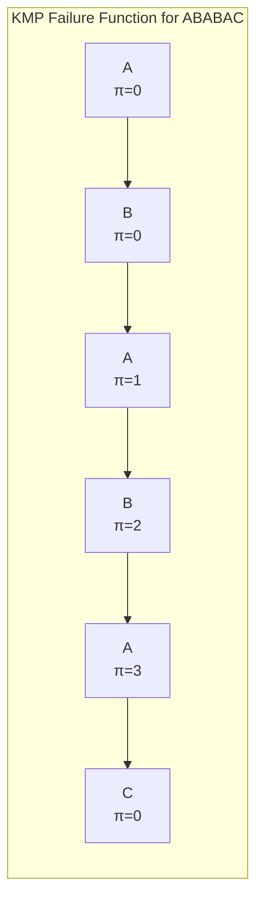
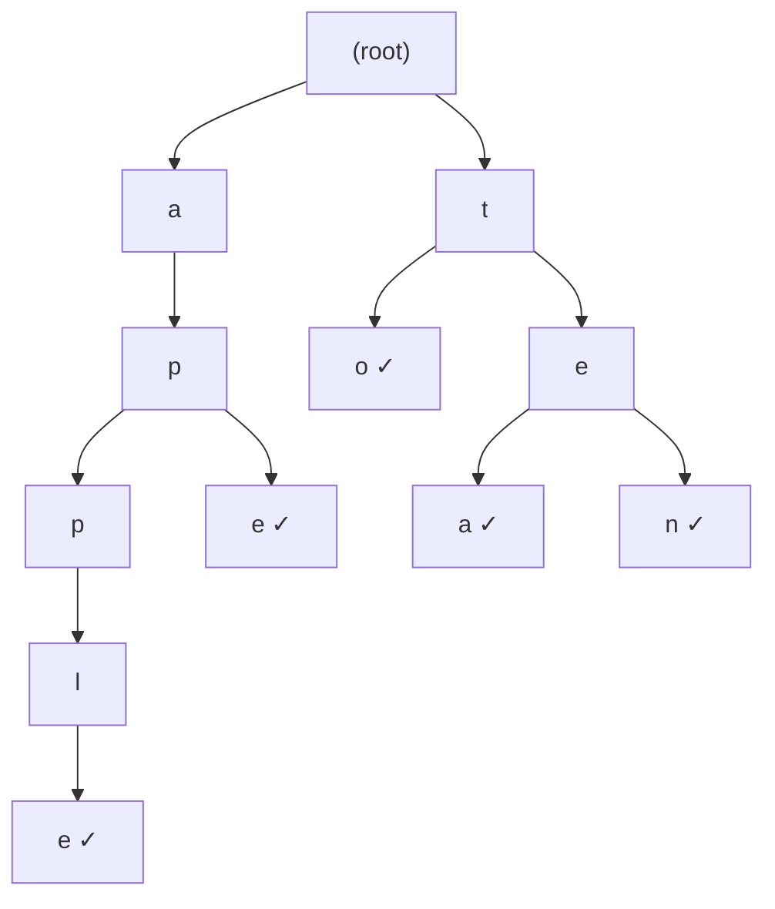
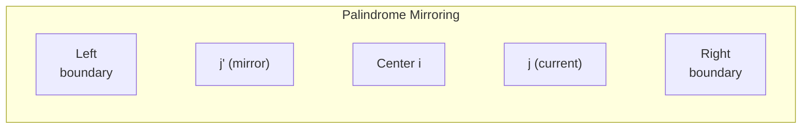

# String Algorithms

String processing is everywhere — search engines, compilers, bioinformatics, text editors, log parsers, URL routers. Yet string algorithms are often neglected in interview prep because they feel "niche." They are not. Pattern matching, edit distance, and trie-based search appear regularly in interviews at top companies, and understanding them deeply separates strong candidates from average ones.

## Why Naive Matching Fails

The brute-force approach to finding pattern $P$ of length $m$ in text $T$ of length $n$ checks every position:

$$
O((n - m + 1) \cdot m) = O(nm)
$$

For large inputs, this is unacceptable. Consider searching a 1GB log file for a 100-character pattern — naive matching could take billions of comparisons. The algorithms in this section reduce this to $O(n + m)$ or $O(n)$.

## KMP (Knuth-Morris-Pratt)

KMP achieves $O(n + m)$ pattern matching by precomputing a **failure function** (also called the prefix function or partial match table). When a mismatch occurs, instead of restarting from the next position, KMP uses the failure function to skip characters that are guaranteed to match.

### The Failure Function

The failure function $\pi[i]$ gives the length of the longest proper prefix of $P[0..i]$ that is also a suffix.

**Example:** Pattern = `"ABABAC"`

| $i$ | $P[0..i]$ | Longest proper prefix = suffix | $\pi[i]$ |
|-----|-----------|-------------------------------|-----------|
| 0 | `A` | (none) | 0 |
| 1 | `AB` | (none) | 0 |
| 2 | `ABA` | `A` | 1 |
| 3 | `ABAB` | `AB` | 2 |
| 4 | `ABABA` | `ABA` | 3 |
| 5 | `ABABAC` | (none) | 0 |



### Building the Failure Function

**TypeScript:**

```typescript
function buildFailure(pattern: string): number[] {
  const m = pattern.length;
  const pi = new Array(m).fill(0);
  let len = 0; // length of previous longest prefix suffix
  let i = 1;

  while (i < m) {
    if (pattern[i] === pattern[len]) {
      len++;
      pi[i] = len;
      i++;
    } else if (len > 0) {
      len = pi[len - 1]; // fall back — do NOT increment i
    } else {
      pi[i] = 0;
      i++;
    }
  }

  return pi;
}
```

**Python:**

```python
def build_failure(pattern: str) -> list[int]:
    m = len(pattern)
    pi = [0] * m
    length = 0  # length of previous longest prefix suffix
    i = 1

    while i < m:
        if pattern[i] == pattern[length]:
            length += 1
            pi[i] = length
            i += 1
        elif length > 0:
            length = pi[length - 1]  # fall back
        else:
            pi[i] = 0
            i += 1

    return pi
```

### KMP Search

**TypeScript:**

```typescript
function kmpSearch(text: string, pattern: string): number[] {
  const n = text.length;
  const m = pattern.length;
  const pi = buildFailure(pattern);
  const matches: number[] = [];

  let j = 0; // index in pattern

  for (let i = 0; i < n; i++) {
    while (j > 0 && text[i] !== pattern[j]) {
      j = pi[j - 1]; // fall back using failure function
    }

    if (text[i] === pattern[j]) {
      j++;
    }

    if (j === m) {
      matches.push(i - m + 1); // match found at index i - m + 1
      j = pi[j - 1]; // continue searching
    }
  }

  return matches;
}

// Example
console.log(kmpSearch("ABABDABACDABABCABAB", "ABABCABAB"));
// Output: [9]
```

**Python:**

```python
def kmp_search(text: str, pattern: str) -> list[int]:
    n, m = len(text), len(pattern)
    pi = build_failure(pattern)
    matches = []
    j = 0

    for i in range(n):
        while j > 0 and text[i] != pattern[j]:
            j = pi[j - 1]

        if text[i] == pattern[j]:
            j += 1

        if j == m:
            matches.append(i - m + 1)
            j = pi[j - 1]

    return matches
```

| Metric | Value |
|--------|-------|
| Preprocessing | $O(m)$ |
| Searching | $O(n)$ |
| Total | $O(n + m)$ |
| Space | $O(m)$ for failure function |

::: tip
KMP is the go-to algorithm when you need guaranteed $O(n + m)$ matching. It never backtracks on the text — each character is examined at most twice. This makes it ideal for streaming data where you cannot re-read input.
:::

## Rabin-Karp (Rolling Hash)

Rabin-Karp uses hashing to find pattern matches. Compute a hash of the pattern and a rolling hash of each window in the text. Only perform character-by-character comparison when hashes match.

### Rolling Hash

A polynomial rolling hash for a string $s[0..m-1]$ with base $b$ and modulus $q$:

$$
h(s) = \left(\sum_{i=0}^{m-1} s[i] \cdot b^{m-1-i}\right) \bmod q
$$

When sliding the window right by one character, update in $O(1)$:

$$
h_{\text{new}} = \left(b \cdot (h_{\text{old}} - s[\text{old}] \cdot b^{m-1}) + s[\text{new}]\right) \bmod q
$$

**TypeScript:**

```typescript
function rabinKarp(text: string, pattern: string): number[] {
  const n = text.length;
  const m = pattern.length;
  if (m > n) return [];

  const BASE = 256;
  const MOD = 1_000_000_007;
  const matches: number[] = [];

  // Compute BASE^(m-1) mod MOD
  let basePow = 1;
  for (let i = 0; i < m - 1; i++) {
    basePow = (basePow * BASE) % MOD;
  }

  // Compute initial hashes
  let patternHash = 0;
  let windowHash = 0;

  for (let i = 0; i < m; i++) {
    patternHash = (patternHash * BASE + pattern.charCodeAt(i)) % MOD;
    windowHash = (windowHash * BASE + text.charCodeAt(i)) % MOD;
  }

  for (let i = 0; i <= n - m; i++) {
    if (windowHash === patternHash) {
      // Verify character by character (avoid hash collision false positive)
      if (text.substring(i, i + m) === pattern) {
        matches.push(i);
      }
    }

    // Roll the hash forward
    if (i < n - m) {
      windowHash = (
        (windowHash - text.charCodeAt(i) * basePow % MOD + MOD) * BASE
        + text.charCodeAt(i + m)
      ) % MOD;
    }
  }

  return matches;
}
```

**Python:**

```python
def rabin_karp(text: str, pattern: str) -> list[int]:
    n, m = len(text), len(pattern)
    if m > n:
        return []

    BASE = 256
    MOD = 10**9 + 7
    matches = []

    base_pow = pow(BASE, m - 1, MOD)

    pattern_hash = 0
    window_hash = 0

    for i in range(m):
        pattern_hash = (pattern_hash * BASE + ord(pattern[i])) % MOD
        window_hash = (window_hash * BASE + ord(text[i])) % MOD

    for i in range(n - m + 1):
        if window_hash == pattern_hash:
            if text[i:i + m] == pattern:
                matches.append(i)

        if i < n - m:
            window_hash = (
                (window_hash - ord(text[i]) * base_pow % MOD + MOD) * BASE
                + ord(text[i + m])
            ) % MOD

    return matches
```

| Metric | Value |
|--------|-------|
| Average case | $O(n + m)$ |
| Worst case | $O(nm)$ (many hash collisions) |
| Space | $O(1)$ extra |

::: warning
Rabin-Karp's worst case is $O(nm)$ due to hash collisions. Use a good modulus (large prime) and verify matches. For guaranteed $O(n + m)$, use KMP. Rabin-Karp's advantage is its simplicity and its ability to search for **multiple patterns** simultaneously.
:::

## Trie (Prefix Tree)

A trie stores strings by sharing common prefixes. Each node represents a character, and paths from root to marked nodes spell out stored strings.



*Trie storing: "apple", "ape", "to", "tea", "ten"*

### Implementation

**TypeScript:**

```typescript
class TrieNode {
  children: Map<string, TrieNode> = new Map();
  isEnd = false;
  word = ""; // store the complete word at leaf nodes
}

class Trie {
  root = new TrieNode();

  insert(word: string): void {
    let node = this.root;
    for (const ch of word) {
      if (!node.children.has(ch)) {
        node.children.set(ch, new TrieNode());
      }
      node = node.children.get(ch)!;
    }
    node.isEnd = true;
    node.word = word;
  }

  search(word: string): boolean {
    const node = this._findNode(word);
    return node !== null && node.isEnd;
  }

  startsWith(prefix: string): boolean {
    return this._findNode(prefix) !== null;
  }

  autocomplete(prefix: string, limit = 10): string[] {
    const node = this._findNode(prefix);
    if (!node) return [];

    const results: string[] = [];
    this._dfs(node, results, limit);
    return results;
  }

  private _findNode(s: string): TrieNode | null {
    let node = this.root;
    for (const ch of s) {
      if (!node.children.has(ch)) return null;
      node = node.children.get(ch)!;
    }
    return node;
  }

  private _dfs(node: TrieNode, results: string[], limit: number): void {
    if (results.length >= limit) return;
    if (node.isEnd) results.push(node.word);

    for (const [, child] of node.children) {
      this._dfs(child, results, limit);
    }
  }
}
```

**Python:**

```python
class TrieNode:
    def __init__(self):
        self.children: dict[str, 'TrieNode'] = {}
        self.is_end = False
        self.word = ""

class Trie:
    def __init__(self):
        self.root = TrieNode()

    def insert(self, word: str) -> None:
        node = self.root
        for ch in word:
            if ch not in node.children:
                node.children[ch] = TrieNode()
            node = node.children[ch]
        node.is_end = True
        node.word = word

    def search(self, word: str) -> bool:
        node = self._find_node(word)
        return node is not None and node.is_end

    def starts_with(self, prefix: str) -> bool:
        return self._find_node(prefix) is not None

    def autocomplete(self, prefix: str, limit: int = 10) -> list[str]:
        node = self._find_node(prefix)
        if not node:
            return []
        results: list[str] = []
        self._dfs(node, results, limit)
        return results

    def _find_node(self, s: str) -> TrieNode | None:
        node = self.root
        for ch in s:
            if ch not in node.children:
                return None
            node = node.children[ch]
        return node

    def _dfs(self, node: TrieNode, results: list[str], limit: int) -> None:
        if len(results) >= limit:
            return
        if node.is_end:
            results.append(node.word)
        for child in node.children.values():
            self._dfs(child, results, limit)
```

| Operation | Time Complexity |
|-----------|----------------|
| Insert | $O(L)$ where $L$ = word length |
| Search | $O(L)$ |
| Prefix search | $O(L)$ |
| Autocomplete | $O(L + K)$ where $K$ = results |
| Space | $O(N \cdot L \cdot |\Sigma|)$ where $|\Sigma|$ = alphabet size |

## Suffix Arrays

A suffix array is a sorted array of all suffixes of a string. It is a space-efficient alternative to suffix trees and powers many advanced string operations.

For string `"banana"`:

| Index | Suffix | Sorted Position |
|-------|--------|----------------|
| 0 | `banana` | 5 |
| 1 | `anana` | 3 |
| 2 | `nana` | 1 |
| 3 | `ana` | 0 |
| 4 | `na` | 4 |
| 5 | `a` | 2 |

**Sorted suffix array:** `[5, 3, 1, 0, 4, 2]` corresponding to `a, ana, anana, banana, na, nana`.

**Python (simple construction):**

```python
def build_suffix_array(s: str) -> list[int]:
    """O(n log^2 n) construction with sorting."""
    n = len(s)
    suffixes = [(s[i:], i) for i in range(n)]
    suffixes.sort()
    return [idx for _, idx in suffixes]
```

::: tip
The naive suffix array construction is $O(n^2 \log n)$. The DC3/SA-IS algorithm builds it in $O(n)$. For interviews, the naive approach is usually sufficient — know that $O(n)$ construction exists.
:::

## Manacher's Algorithm (Longest Palindromic Substring)

Manacher's algorithm finds the longest palindromic substring in $O(n)$. It exploits the symmetry of palindromes to avoid redundant comparisons.

### Key Insight

If we know the palindrome centered at position $i$ extends to radius $r$ and we are computing the palindrome at position $j > i$, then $j$'s mirror position $j' = 2i - j$ may already be computed. We can reuse that information.



**TypeScript:**

```typescript
function longestPalindrome(s: string): string {
  // Transform: "abc" → "^#a#b#c#$"
  const t = `^#${s.split("").join("#")}#$`;
  const n = t.length;
  const p = new Array(n).fill(0);

  let center = 0, right = 0;

  for (let i = 1; i < n - 1; i++) {
    const mirror = 2 * center - i;

    if (i < right) {
      p[i] = Math.min(right - i, p[mirror]);
    }

    // Expand around center
    while (t[i + p[i] + 1] === t[i - p[i] - 1]) {
      p[i]++;
    }

    // Update center and right boundary
    if (i + p[i] > right) {
      center = i;
      right = i + p[i];
    }
  }

  // Find max
  let maxLen = 0, maxCenter = 0;
  for (let i = 1; i < n - 1; i++) {
    if (p[i] > maxLen) {
      maxLen = p[i];
      maxCenter = i;
    }
  }

  const start = (maxCenter - maxLen) / 2;
  return s.substring(start, start + maxLen);
}
```

**Python:**

```python
def longest_palindrome(s: str) -> str:
    # Transform: "abc" → "^#a#b#c#$"
    t = f"^#{'#'.join(s)}#$"
    n = len(t)
    p = [0] * n
    center = right = 0

    for i in range(1, n - 1):
        mirror = 2 * center - i

        if i < right:
            p[i] = min(right - i, p[mirror])

        while t[i + p[i] + 1] == t[i - p[i] - 1]:
            p[i] += 1

        if i + p[i] > right:
            center = i
            right = i + p[i]

    max_len = max(p)
    max_center = p.index(max_len)
    start = (max_center - max_len) // 2
    return s[start:start + max_len]
```

| Metric | Value |
|--------|-------|
| Time | $O(n)$ |
| Space | $O(n)$ |

## Edit Distance (Levenshtein)

The edit distance between two strings is the minimum number of single-character operations (insert, delete, replace) to transform one into the other.

$$
\text{dp}[i][j] = \begin{cases}
i & \text{if } j = 0 \\
j & \text{if } i = 0 \\
\text{dp}[i-1][j-1] & \text{if } s_1[i] = s_2[j] \\
1 + \min\bigl(\text{dp}[i-1][j],\; \text{dp}[i][j-1],\; \text{dp}[i-1][j-1]\bigr) & \text{otherwise}
\end{cases}
$$

The three operations:
- $\text{dp}[i-1][j] + 1$: delete from $s_1$
- $\text{dp}[i][j-1] + 1$: insert into $s_1$
- $\text{dp}[i-1][j-1] + 1$: replace in $s_1$

**TypeScript:**

```typescript
function editDistance(s1: string, s2: string): number {
  const m = s1.length;
  const n = s2.length;
  const dp: number[][] = Array.from(
    { length: m + 1 },
    (_, i) => {
      const row = new Array(n + 1).fill(0);
      row[0] = i;
      return row;
    }
  );

  for (let j = 0; j <= n; j++) dp[0][j] = j;

  for (let i = 1; i <= m; i++) {
    for (let j = 1; j <= n; j++) {
      if (s1[i - 1] === s2[j - 1]) {
        dp[i][j] = dp[i - 1][j - 1];
      } else {
        dp[i][j] = 1 + Math.min(
          dp[i - 1][j],     // delete
          dp[i][j - 1],     // insert
          dp[i - 1][j - 1]  // replace
        );
      }
    }
  }

  return dp[m][n];
}
```

**Python:**

```python
def edit_distance(s1: str, s2: str) -> int:
    m, n = len(s1), len(s2)
    dp = [[0] * (n + 1) for _ in range(m + 1)]

    for i in range(m + 1):
        dp[i][0] = i
    for j in range(n + 1):
        dp[0][j] = j

    for i in range(1, m + 1):
        for j in range(1, n + 1):
            if s1[i - 1] == s2[j - 1]:
                dp[i][j] = dp[i - 1][j - 1]
            else:
                dp[i][j] = 1 + min(
                    dp[i - 1][j],      # delete
                    dp[i][j - 1],      # insert
                    dp[i - 1][j - 1]   # replace
                )

    return dp[m][n]
```

**Complexity:** $O(mn)$ time, $O(mn)$ space (reducible to $O(\min(m,n))$ with space optimization).

::: tip
Edit distance is used everywhere: spell checkers, DNA sequence alignment, fuzzy search, diff utilities. In interviews, it's the canonical 2D DP problem. Make sure you can derive the recurrence from scratch.
:::

## Algorithm Comparison

| Algorithm | Problem | Time | Space | Key Idea |
|-----------|---------|------|-------|----------|
| KMP | Exact matching | $O(n + m)$ | $O(m)$ | Failure function |
| Rabin-Karp | Exact matching | $O(n + m)$ avg | $O(1)$ | Rolling hash |
| Trie | Prefix search | $O(L)$ | $O(N \cdot L)$ | Shared prefixes |
| Suffix Array | Many string ops | $O(n \log n)$ build | $O(n)$ | Sorted suffixes |
| Manacher's | Longest palindrome | $O(n)$ | $O(n)$ | Mirror symmetry |
| Edit Distance | String similarity | $O(mn)$ | $O(mn)$ | 2D DP |

## Further Reading

- [Arrays & Strings](/algorithms/arrays-strings) — foundational string manipulation patterns
- [Dynamic Programming](/algorithms/dynamic-programming) — edit distance and LCS are core DP problems
- [Hash Tables](/algorithms/hash-tables) — hashing fundamentals used in Rabin-Karp
- [Advanced Data Structures](/algorithms/advanced-data-structures) — segment trees for range queries on strings
- [Bit Manipulation](/algorithms/bit-manipulation) — bitwise tricks in rolling hashes

## Try It Yourself

**Problem 1:** Use the KMP algorithm to find all occurrences of pattern `"ABA"` in text `"ABABABA"`. First, build the failure function.

::: details Solution
Failure function for "ABA":
- pi[0] = 0 (A: no proper prefix = suffix)
- pi[1] = 0 (AB: no match)
- pi[2] = 1 (ABA: "A" is both prefix and suffix)

KMP search on "ABABABA":
- i=0: A matches A, j=1
- i=1: B matches B, j=2
- i=2: A matches A, j=3 → match at index **0**. j = pi[2] = 1
- i=3: B matches B, j=2
- i=4: A matches A, j=3 → match at index **2**. j = pi[2] = 1
- i=5: B matches B, j=2
- i=6: A matches A, j=3 → match at index **4**. j = pi[2] = 1

Answer: Matches at indices **[0, 2, 4]**.
:::

**Problem 2:** Insert the words "app", "apple", "ape", "apply" into a Trie. How many nodes does the Trie have (excluding root)?

::: details Solution
Build the trie character by character:
- "app": root → a → p → p (3 nodes)
- "apple": root → a → p → p → l → e (2 new nodes: l, e)
- "ape": root → a → p → e (1 new node: e after the first p)
- "apply": root → a → p → p → l → y (1 new node: y)

Total nodes excluding root: **7** (a, p, p, l, e, e, y)
:::

**Problem 3:** Find the longest palindromic substring in `"babad"`.

::: details Solution
Expand from each center (including between-character centers):
- Center at index 0 (b): "b" (length 1)
- Center at index 1 (a): "a" (1), expand: "bab" (3)
- Center at index 2 (b): "b" (1), expand: "aba" (3)
- Center at index 3 (a): "a" (1)
- Center at index 4 (d): "d" (1)
- Between-character centers: no even-length palindromes longer than 0.

Answer: **"bab"** or **"aba"** (both length 3).
:::

**Problem 4:** Compute the edit distance between `"horse"` and `"ros"`.

::: details Solution
Build the DP table:
```
    ""  r  o  s
""   0  1  2  3
h    1  1  2  3
o    2  2  1  2
r    3  2  2  2
s    4  3  3  2
e    5  4  4  3
```
- horse → rorse (replace h with r)
- rorse → rose (remove r at position 2)
- rose → ros (remove e)
Answer: **3** operations.
:::

**Problem 5:** Given the suffix array concept, list all suffixes of `"abac"` in sorted order.

::: details Solution
All suffixes:
- Index 0: "abac"
- Index 1: "bac"
- Index 2: "ac"
- Index 3: "c"

Sorted alphabetically: "abac", "ac", "bac", "c"
Suffix array: **[0, 2, 1, 3]**
:::

## Quick Quiz

**1. What is the time complexity of the KMP pattern matching algorithm?**
- a) $O(nm)$
- b) $O(n + m)$
- c) $O(n \log m)$
- d) $O(n^2)$

::: details Answer
**b) $O(n + m)$** — KMP preprocesses the pattern in $O(m)$ to build the failure function, then scans the text in $O(n)$. It never backtracks on the text.
:::

**2. What is the key advantage of Rabin-Karp over KMP?**
- a) Guaranteed $O(n + m)$ worst case
- b) Lower memory usage
- c) Ability to search for multiple patterns simultaneously
- d) Better cache performance

::: details Answer
**c) Ability to search for multiple patterns simultaneously** — Rabin-Karp can compute rolling hashes for multiple patterns at once, checking all of them against each window hash. KMP requires a separate failure function per pattern.
:::

**3. What is the space complexity of a Trie storing $N$ words of average length $L$ over an alphabet of size $|\Sigma|$?**
- a) $O(N)$
- b) $O(N \cdot L)$
- c) $O(N \cdot L \cdot |\Sigma|)$
- d) $O(|\Sigma|^L)$

::: details Answer
**c) $O(N \cdot L \cdot |\Sigma|)$** — In the worst case (no shared prefixes), there are $N \cdot L$ nodes, each potentially storing $|\Sigma|$ child pointers. With shared prefixes, the actual space is typically much less.
:::

**4. What technique does Manacher's algorithm use to achieve $O(n)$ for finding the longest palindromic substring?**
- a) Dynamic programming
- b) Rolling hash
- c) Exploiting mirror symmetry of palindromes within a known palindrome boundary
- d) Divide and conquer

::: details Answer
**c) Exploiting mirror symmetry of palindromes within a known palindrome boundary** — When expanding palindromes, Manacher's algorithm reuses information from the mirror position of the current center within the rightmost known palindrome, avoiding redundant character comparisons.
:::

**5. Edit distance is an example of which DP pattern?**
- a) 1D linear sequence
- b) 2D two-sequence comparison
- c) Interval DP
- d) Bitmask DP

::: details Answer
**b) 2D two-sequence comparison** — Edit distance compares two strings character by character, with `dp[i][j]` representing the minimum operations to transform the first $i$ characters of one string into the first $j$ characters of the other.
:::
