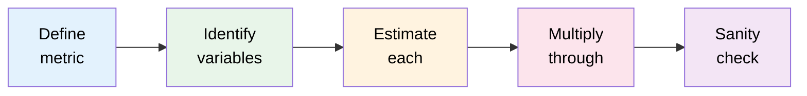
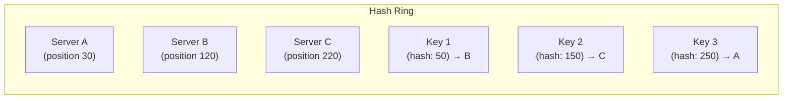
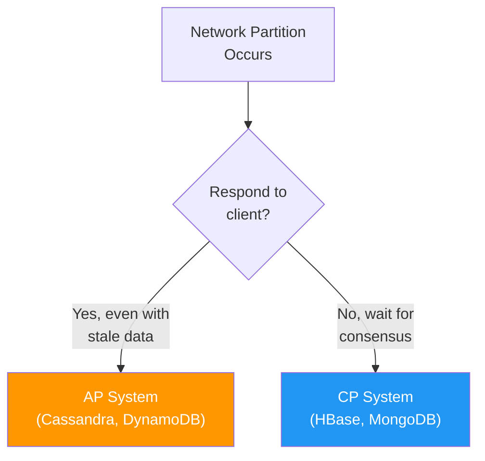

# Math Patterns in System Design

System design interviews are not about memorizing architectures. They are about reasoning under uncertainty — and that reasoning is fundamentally mathematical. "How much storage do we need?" "What's our QPS?" "How many servers?" These questions demand quick, principled back-of-envelope calculations. Getting these numbers right (or at least right order-of-magnitude) is what separates a hand-wavy answer from a credible design.

## Back-of-Envelope Estimation Framework

Every estimation follows the same structure:

1. **Define what you are estimating** (storage, bandwidth, QPS, latency, cost)
2. **Identify the key variables** (users, requests per user, data per request)
3. **Estimate each variable** (use round numbers, powers of 10)
4. **Multiply through** (chain the estimates)
5. **Sanity check** (does the result make sense? Compare to known systems)



::: tip
Interviewers care about your process, not exact numbers. An estimate that is off by 2x but follows sound reasoning is far better than a "correct" number pulled from nowhere. Always show your work.
:::

## Powers of 2 Table

Memorize this table. It is the foundation of every system design calculation.

| Power | Exact Value | Approx | Name |
|-------|-------------|--------|------|
| $2^{10}$ | 1,024 | 1 Thousand | 1 KB |
| $2^{20}$ | 1,048,576 | 1 Million | 1 MB |
| $2^{30}$ | 1,073,741,824 | 1 Billion | 1 GB |
| $2^{40}$ | 1,099,511,627,776 | 1 Trillion | 1 TB |
| $2^{50}$ | ~1.13 Quadrillion | 1 Quadrillion | 1 PB |

### Useful Approximations

$$
2^{10} \approx 10^3, \quad 2^{20} \approx 10^6, \quad 2^{30} \approx 10^9, \quad 2^{40} \approx 10^{12}
$$

This means:
- 1 KB $\approx$ 1,000 bytes
- 1 MB $\approx$ 1,000 KB $\approx 10^6$ bytes
- 1 GB $\approx$ 1,000 MB $\approx 10^9$ bytes
- 1 TB $\approx$ 1,000 GB $\approx 10^{12}$ bytes

### Data Size Reference

| Data Type | Typical Size |
|-----------|-------------|
| char / ASCII | 1 byte |
| Unicode character (UTF-8) | 1-4 bytes |
| 32-bit integer | 4 bytes |
| 64-bit integer / double | 8 bytes |
| UUID | 16 bytes |
| Timestamp (epoch) | 8 bytes |
| MD5 hash | 16 bytes |
| SHA-256 hash | 32 bytes |
| IPv4 address | 4 bytes |
| IPv6 address | 16 bytes |
| Average tweet | ~300 bytes |
| Average email | ~50 KB |
| Average web page | ~2 MB |
| Average photo (compressed) | ~200 KB |
| Average 1-min video (720p) | ~5 MB |

## Time Constants

| Duration | Seconds | Useful For |
|----------|---------|-----------|
| 1 minute | 60 | Request rates |
| 1 hour | 3,600 | Batch processing |
| 1 day | 86,400 $\approx 10^5$ | Daily aggregates |
| 1 month | 2,592,000 $\approx 2.5 \times 10^6$ | Monthly storage |
| 1 year | 31,536,000 $\approx 3 \times 10^7$ | Capacity planning |

::: tip
**The 86,400 trick:** A day has 86,400 seconds. Round to $10^5$ for quick math. This means:
- 1 QPS = ~100K requests/day
- 1K QPS = ~100M requests/day
- 10K QPS = ~1B requests/day
:::

## QPS (Queries Per Second) Calculations

### From Daily Active Users

$$
\text{QPS} = \frac{\text{DAU} \times \text{requests per user per day}}{86{,}400}
$$

**Example: Twitter-like service**

$$
\text{DAU} = 300\text{M}, \quad \text{tweets viewed per user} = 100
$$

$$
\text{Read QPS} = \frac{300 \times 10^6 \times 100}{86{,}400} \approx \frac{3 \times 10^{10}}{10^5} = 300{,}000 \text{ QPS}
$$

### Peak vs Average

Production systems must handle peak load, not just average. Common rule of thumb:

$$
\text{Peak QPS} = 2\text{--}5 \times \text{Average QPS}
$$

### From Concurrent Users

$$
\text{QPS} = \frac{\text{Concurrent Users}}{\text{Average Request Duration (seconds)}}
$$

**TypeScript (estimation helper):**

```typescript
interface EstimationParams {
  dau: number;
  requestsPerUserPerDay: number;
  peakMultiplier?: number;
}

function estimateQPS(params: EstimationParams): {
  averageQPS: number;
  peakQPS: number;
  dailyRequests: number;
} {
  const { dau, requestsPerUserPerDay, peakMultiplier = 3 } = params;
  const dailyRequests = dau * requestsPerUserPerDay;
  const averageQPS = dailyRequests / 86_400;
  const peakQPS = averageQPS * peakMultiplier;

  return {
    averageQPS: Math.round(averageQPS),
    peakQPS: Math.round(peakQPS),
    dailyRequests,
  };
}

// Example: Social media
const result = estimateQPS({
  dau: 300_000_000,
  requestsPerUserPerDay: 100,
  peakMultiplier: 3,
});
// { averageQPS: 347222, peakQPS: 1041667, dailyRequests: 30000000000 }
```

**Python:**

```python
from dataclasses import dataclass

@dataclass
class QPSEstimate:
    average_qps: int
    peak_qps: int
    daily_requests: int

def estimate_qps(
    dau: int,
    requests_per_user_per_day: int,
    peak_multiplier: float = 3.0
) -> QPSEstimate:
    daily_requests = dau * requests_per_user_per_day
    average_qps = daily_requests / 86_400
    peak_qps = average_qps * peak_multiplier

    return QPSEstimate(
        average_qps=round(average_qps),
        peak_qps=round(peak_qps),
        daily_requests=daily_requests
    )

# Example
result = estimate_qps(dau=300_000_000, requests_per_user_per_day=100)
print(f"Average: {result.average_qps:,} QPS")
print(f"Peak: {result.peak_qps:,} QPS")
```

## Storage Calculations

### General Formula

$$
\text{Total Storage} = \text{Daily New Data} \times \text{Retention Period (days)} \times \text{Replication Factor}
$$

### Worked Example: URL Shortener

**Assumptions:**
- 100M new URLs per day
- Each URL record: 500 bytes (short URL + long URL + metadata)
- Retention: 5 years
- Replication factor: 3

$$
\text{Daily data} = 100 \times 10^6 \times 500 = 50 \times 10^9 = 50 \text{ GB/day}
$$

$$
\text{5-year storage} = 50 \text{ GB} \times 365 \times 5 = 91{,}250 \text{ GB} \approx 91 \text{ TB}
$$

$$
\text{With replication} = 91 \text{ TB} \times 3 = 273 \text{ TB}
$$

### Worked Example: Chat Application

| Parameter | Value |
|-----------|-------|
| DAU | 50M |
| Messages per user per day | 40 |
| Average message size | 200 bytes |
| Media messages (10% with 200KB avg) | 200 KB |
| Retention | Forever |

$$
\text{Text per day} = 50 \times 10^6 \times 40 \times 200 = 400 \text{ GB}
$$

$$
\text{Media per day} = 50 \times 10^6 \times 40 \times 0.1 \times 200{,}000 = 40 \text{ TB}
$$

$$
\text{Total per year} \approx (0.4 + 40) \times 365 \approx 14{,}746 \text{ TB} \approx 14.7 \text{ PB}
$$

## Bandwidth Calculations

$$
\text{Bandwidth} = \text{QPS} \times \text{Average Response Size}
$$

**Example:** If your service handles 10K QPS and each response averages 10 KB:

$$
\text{Bandwidth} = 10{,}000 \times 10 \text{ KB} = 100{,}000 \text{ KB/s} = 100 \text{ MB/s} \approx 800 \text{ Mbps}
$$

### Bandwidth Conversion

| Unit | Equivalent |
|------|-----------|
| 1 Byte | 8 bits |
| 1 MB/s | 8 Mbps |
| 1 Gbps | 125 MB/s |
| 10 Gbps | 1.25 GB/s |

## Consistent Hashing Math

Consistent hashing maps both keys and servers onto a ring of size $2^m$ (typically $m = 128$ or $m = 160$ for MD5/SHA-1). Each key is assigned to the next server clockwise on the ring.



### Virtual Nodes

With $N$ physical servers, each server gets $V$ virtual nodes on the ring. This improves load distribution.

$$
\text{Standard deviation of load} \propto \frac{1}{\sqrt{V}}
$$

With $V = 150$ virtual nodes per server, the standard deviation of load drops to about 5-10% of the mean — acceptable for most systems.

### Rebalancing on Server Addition/Removal

When a server is added, only $\frac{K}{N}$ keys need to be remapped (where $K$ is total keys, $N$ is total servers). Compare this to modular hashing where nearly all keys must move:

| Event | Consistent Hashing | Modular Hashing |
|-------|-------------------|-----------------|
| Add 1 server ($N$ to $N+1$) | $\frac{K}{N+1}$ keys move | $\frac{N}{N+1} \cdot K$ keys move |
| Remove 1 server | $\frac{K}{N}$ keys move | $\frac{N-1}{N} \cdot K$ keys move |

**TypeScript:**

```typescript
import { createHash } from "crypto";

class ConsistentHash {
  private ring: Map<number, string> = new Map();
  private sortedKeys: number[] = [];
  private virtualNodes: number;

  constructor(virtualNodes = 150) {
    this.virtualNodes = virtualNodes;
  }

  private hash(key: string): number {
    const h = createHash("md5").update(key).digest();
    return h.readUInt32BE(0);
  }

  addServer(server: string): void {
    for (let i = 0; i < this.virtualNodes; i++) {
      const virtualKey = this.hash(`${server}:${i}`);
      this.ring.set(virtualKey, server);
      this.sortedKeys.push(virtualKey);
    }
    this.sortedKeys.sort((a, b) => a - b);
  }

  removeServer(server: string): void {
    for (let i = 0; i < this.virtualNodes; i++) {
      const virtualKey = this.hash(`${server}:${i}`);
      this.ring.delete(virtualKey);
    }
    this.sortedKeys = this.sortedKeys.filter((k) => this.ring.has(k));
  }

  getServer(key: string): string | undefined {
    if (this.sortedKeys.length === 0) return undefined;

    const h = this.hash(key);
    // Binary search for next server clockwise
    let lo = 0, hi = this.sortedKeys.length;
    while (lo < hi) {
      const mid = (lo + hi) >> 1;
      if (this.sortedKeys[mid] < h) lo = mid + 1;
      else hi = mid;
    }

    const idx = lo % this.sortedKeys.length;
    return this.ring.get(this.sortedKeys[idx]);
  }
}
```

**Python:**

```python
import hashlib
from bisect import bisect_right

class ConsistentHash:
    def __init__(self, virtual_nodes: int = 150):
        self.virtual_nodes = virtual_nodes
        self.ring: dict[int, str] = {}
        self.sorted_keys: list[int] = []

    def _hash(self, key: str) -> int:
        h = hashlib.md5(key.encode()).digest()
        return int.from_bytes(h[:4], "big")

    def add_server(self, server: str) -> None:
        for i in range(self.virtual_nodes):
            virtual_key = self._hash(f"{server}:{i}")
            self.ring[virtual_key] = server
        self.sorted_keys = sorted(self.ring.keys())

    def remove_server(self, server: str) -> None:
        for i in range(self.virtual_nodes):
            virtual_key = self._hash(f"{server}:{i}")
            self.ring.pop(virtual_key, None)
        self.sorted_keys = sorted(self.ring.keys())

    def get_server(self, key: str) -> str | None:
        if not self.sorted_keys:
            return None

        h = self._hash(key)
        idx = bisect_right(self.sorted_keys, h)
        if idx == len(self.sorted_keys):
            idx = 0
        return self.ring[self.sorted_keys[idx]]
```

## Replication Factor Calculations

### Write Amplification

With a replication factor of $R$:

$$
\text{Write throughput per node} = \frac{\text{Total write QPS}}{1} \quad (\text{leader-based})
$$

$$
\text{Total write I/O} = \text{Write QPS} \times R
$$

### Quorum Reads and Writes

For a system with $N$ replicas, a write quorum $W$, and a read quorum $R$:

$$
W + R > N \implies \text{strong consistency guaranteed}
$$

Common configurations:

| Config | $N$ | $W$ | $R$ | Trade-off |
|--------|-----|-----|-----|-----------|
| Strong consistency | 3 | 2 | 2 | Balanced |
| Write-optimized | 3 | 1 | 3 | Fast writes, slow reads |
| Read-optimized | 3 | 3 | 1 | Slow writes, fast reads |
| Eventual consistency | 3 | 1 | 1 | Fast but stale reads possible |

### Availability Calculation

For $N$ independent replicas, each with availability $a$:

$$
\text{System availability} = 1 - (1 - a)^N
$$

| Single node availability | 2 replicas | 3 replicas | 5 replicas |
|--------------------------|-----------|-----------|-----------|
| 99% (3.65 days downtime) | 99.99% | 99.9999% | 99.99999999% |
| 99.9% (8.77 hrs downtime) | 99.9999% | ~100% | ~100% |
| 99.99% (52.6 min downtime) | ~100% | ~100% | ~100% |

::: warning
These calculations assume **independent failures**. In practice, correlated failures (data center outages, shared dependencies) make real availability lower. This is why multi-region deployment matters.
:::

## CAP Theorem: Formal Intuition

The CAP theorem states that a distributed system can provide at most two of three guarantees simultaneously:

- **Consistency (C)**: Every read receives the most recent write
- **Availability (A)**: Every request receives a response (not an error)
- **Partition tolerance (P)**: The system continues to operate despite network partitions

### Why You Must Choose

During a network partition, a message from node A cannot reach node B. You have two options:

1. **Choose Consistency (CP)**: Refuse to respond until the partition heals. You lose availability.
2. **Choose Availability (AP)**: Respond with potentially stale data. You lose consistency.

Since network partitions are inevitable in distributed systems, the real choice is between **CP** and **AP** during partition events.



### PACELC Extension

PACELC extends CAP: if there is a **P**artition, choose **A** or **C**; **E**lse (normal operation), choose **L**atency or **C**onsistency.

| System | During Partition | Normal Operation |
|--------|-----------------|-----------------|
| DynamoDB | AP | EL (low latency) |
| MongoDB | CP | EC (consistent) |
| Cassandra | AP | EL (tunable) |
| PostgreSQL | CP | EC (ACID) |

## Estimation Cheat Sheet

### Common Service Numbers

| Service | DAU | Peak QPS | Storage/day |
|---------|-----|----------|-------------|
| Twitter-scale | 300M | ~300K | ~15 TB |
| Instagram-scale | 500M | ~500K | ~100 TB (images) |
| WhatsApp-scale | 2B | ~1M | ~50 TB |
| YouTube-scale | 2B | ~200K | ~500 TB (video) |
| URL shortener | 100M | ~10K | ~50 GB |

### Server Capacity Rules of Thumb

| Resource | Single Server | Notes |
|----------|--------------|-------|
| QPS (web server) | 1,000-10,000 | Depends on response time |
| QPS (database) | 1,000-5,000 | With indexing |
| QPS (cache - Redis) | 100,000+ | In-memory |
| RAM | 64-256 GB | Commodity |
| Disk | 1-10 TB SSD | Fast I/O |
| Network | 1-10 Gbps | Standard NIC |

### Quick Estimation Formulas

$$
\text{Servers needed} = \frac{\text{Peak QPS}}{\text{QPS per server}}
$$

$$
\text{Cache size} = \text{Working set} \approx 20\% \times \text{Total data}
$$

$$
\text{Read/Write ratio} \text{ (social media)} \approx 100:1
$$

$$
\text{CDN hit rate} \approx 90\text{--}95\%
$$

## Practice Estimation Problems

| Problem | Key Variables | Expected Answer |
|---------|--------------|-----------------|
| "Estimate YouTube storage per day" | 500 hrs video/min, 5 MB/sec, resolutions | ~2.5 PB/day |
| "How many servers for 1M QPS?" | 5K QPS/server | ~200 servers |
| "Twitter fan-out storage" | 300M users, 500 avg followers, 200 tweets/day | ~3 TB write amplification/day |
| "Cache size for 100M users" | 20% active, 1 KB per session | ~20 GB |

::: tip
When in doubt during an interview, round aggressively and state your assumptions clearly. "$10^5$ seconds in a day" is close enough and much easier to multiply than 86,400. Interviewers value clarity of reasoning over arithmetic precision.
:::

## Further Reading

- [Consistent Hashing](/system-design/distributed-systems/consistent-hashing) — full deep-dive on ring-based hashing
- [Databases](/system-design/databases/) — storage engine internals
- [Greedy Algorithms](/algorithms/greedy) — optimization under constraints
- [Bit Manipulation](/algorithms/bit-manipulation) — bloom filter math
- [Advanced Data Structures](/algorithms/advanced-data-structures) — data structure trade-offs
