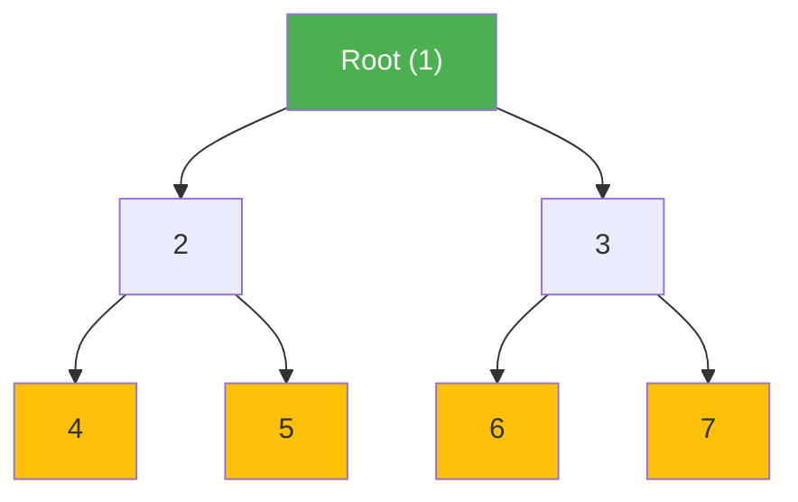
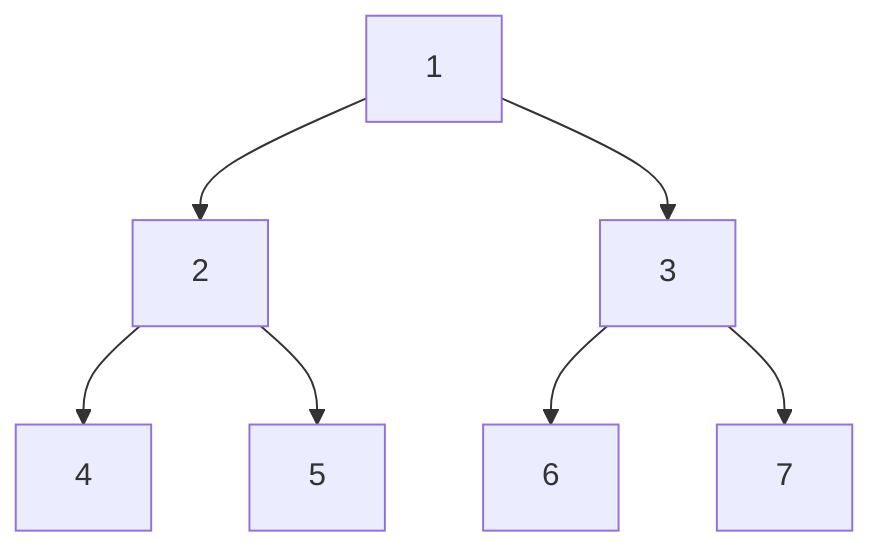
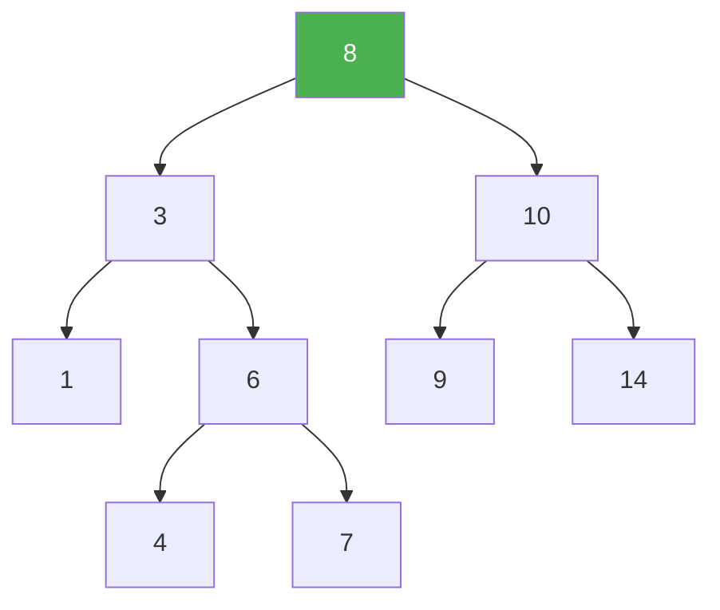
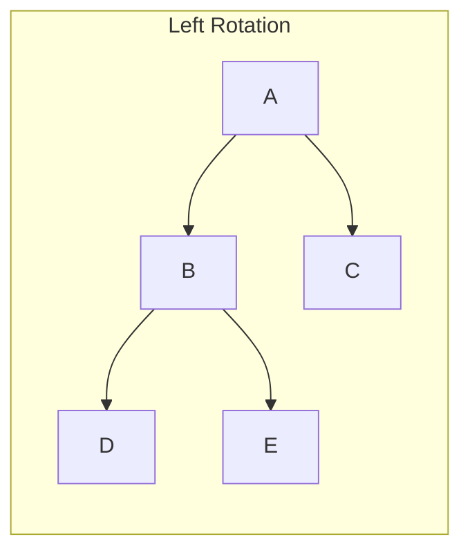
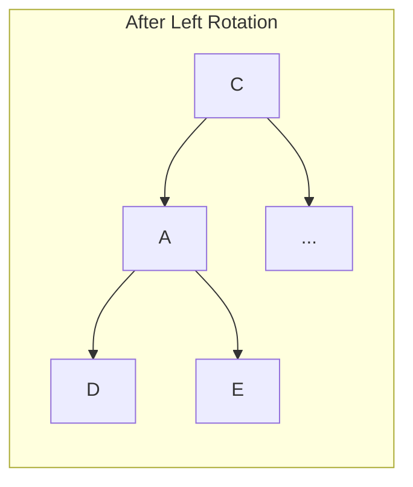
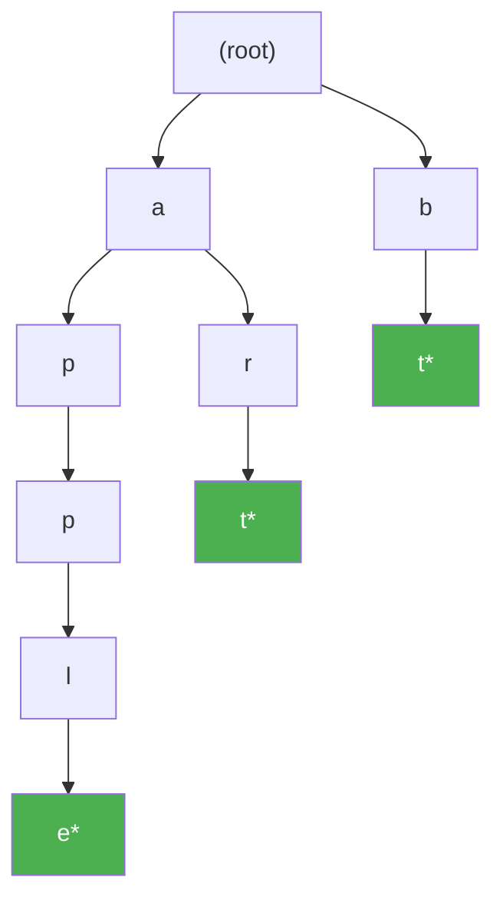
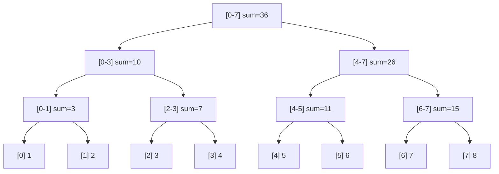

# Trees

Trees are hierarchical data structures that model real-world relationships: file systems, DOM trees, organizational charts, parse trees, decision trees. In interviews, tree problems test your comfort with recursion. In production, trees power databases (B-trees), autocomplete (tries), compilers (ASTs), and range queries (segment trees).

## Core Concepts

A tree is a connected, acyclic graph with $n$ nodes and $n-1$ edges. Every tree has exactly one root, and every node has exactly one parent (except the root).



**Terminology:**
- **Root**: The topmost node (no parent)
- **Leaf**: A node with no children
- **Height**: Longest path from root to a leaf
- **Depth**: Distance from the root to a node
- **Subtree**: A node and all its descendants

## Binary Tree

Each node has at most two children: left and right.

**TypeScript:**

```typescript
class TreeNode<T> {
  val: T;
  left: TreeNode<T> | null;
  right: TreeNode<T> | null;

  constructor(val: T, left: TreeNode<T> | null = null, right: TreeNode<T> | null = null) {
    this.val = val;
    this.left = left;
    this.right = right;
  }
}
```

**Python:**

```python
class TreeNode:
    def __init__(self, val=0, left=None, right=None):
        self.val = val
        self.left = left
        self.right = right
```

## Traversals

The four fundamental traversals differ in when they process the current node relative to its children.



| Traversal | Order | Result | Use Case |
|---|---|---|---|
| **Inorder** | Left → Root → Right | 4, 2, 5, 1, 6, 3, 7 | BST gives sorted order |
| **Preorder** | Root → Left → Right | 1, 2, 4, 5, 3, 6, 7 | Serialize/copy a tree |
| **Postorder** | Left → Right → Root | 4, 5, 2, 6, 7, 3, 1 | Delete tree, evaluate expressions |
| **Level-order** | Level by level | 1, 2, 3, 4, 5, 6, 7 | BFS, shortest path in tree |

### Recursive Traversals

**TypeScript:**

```typescript
function inorder(root: TreeNode<number> | null, result: number[] = []): number[] {
  if (root === null) return result;
  inorder(root.left, result);
  result.push(root.val);
  inorder(root.right, result);
  return result;
}

function preorder(root: TreeNode<number> | null, result: number[] = []): number[] {
  if (root === null) return result;
  result.push(root.val);
  preorder(root.left, result);
  preorder(root.right, result);
  return result;
}

function postorder(root: TreeNode<number> | null, result: number[] = []): number[] {
  if (root === null) return result;
  postorder(root.left, result);
  postorder(root.right, result);
  result.push(root.val);
  return result;
}
```

**Python:**

```python
def inorder(root: TreeNode | None) -> list[int]:
    if not root:
        return []
    return inorder(root.left) + [root.val] + inorder(root.right)

def preorder(root: TreeNode | None) -> list[int]:
    if not root:
        return []
    return [root.val] + preorder(root.left) + preorder(root.right)

def postorder(root: TreeNode | None) -> list[int]:
    if not root:
        return []
    return postorder(root.left) + postorder(root.right) + [root.val]
```

### Iterative Inorder (using stack)

**TypeScript:**

```typescript
function inorderIterative(root: TreeNode<number> | null): number[] {
  const result: number[] = [];
  const stack: TreeNode<number>[] = [];
  let current = root;

  while (current !== null || stack.length > 0) {
    // Go as far left as possible
    while (current !== null) {
      stack.push(current);
      current = current.left;
    }
    current = stack.pop()!;
    result.push(current.val);
    current = current.right;
  }

  return result;
}
```

**Python:**

```python
def inorder_iterative(root: TreeNode | None) -> list[int]:
    result = []
    stack = []
    current = root

    while current or stack:
        while current:
            stack.append(current)
            current = current.left
        current = stack.pop()
        result.append(current.val)
        current = current.right

    return result
```

### Level-Order Traversal (BFS)

**TypeScript:**

```typescript
function levelOrder(root: TreeNode<number> | null): number[][] {
  if (root === null) return [];

  const result: number[][] = [];
  const queue: TreeNode<number>[] = [root];

  while (queue.length > 0) {
    const levelSize = queue.length;
    const level: number[] = [];

    for (let i = 0; i < levelSize; i++) {
      const node = queue.shift()!;
      level.push(node.val);
      if (node.left) queue.push(node.left);
      if (node.right) queue.push(node.right);
    }

    result.push(level);
  }

  return result;
}
```

**Python:**

```python
from collections import deque

def level_order(root: TreeNode | None) -> list[list[int]]:
    if not root:
        return []

    result = []
    queue = deque([root])

    while queue:
        level_size = len(queue)
        level = []

        for _ in range(level_size):
            node = queue.popleft()
            level.append(node.val)
            if node.left:
                queue.append(node.left)
            if node.right:
                queue.append(node.right)

        result.append(level)

    return result
```

**Complexity:** All traversals are $O(n)$ time. Recursive uses $O(h)$ stack space where $h$ is height. Level-order uses $O(w)$ space where $w$ is the maximum width.

## Binary Search Tree (BST)

A BST maintains a sorted invariant: for every node, all values in the left subtree are less than the node's value, and all values in the right subtree are greater.



### BST Operations

**TypeScript:**

```typescript
function bstSearch(root: TreeNode<number> | null, target: number): TreeNode<number> | null {
  if (root === null || root.val === target) return root;
  return target < root.val
    ? bstSearch(root.left, target)
    : bstSearch(root.right, target);
}

function bstInsert(root: TreeNode<number> | null, val: number): TreeNode<number> {
  if (root === null) return new TreeNode(val);
  if (val < root.val) {
    root.left = bstInsert(root.left, val);
  } else {
    root.right = bstInsert(root.right, val);
  }
  return root;
}

function bstDelete(root: TreeNode<number> | null, key: number): TreeNode<number> | null {
  if (root === null) return null;

  if (key < root.val) {
    root.left = bstDelete(root.left, key);
  } else if (key > root.val) {
    root.right = bstDelete(root.right, key);
  } else {
    // Node found — three cases
    if (!root.left) return root.right;
    if (!root.right) return root.left;

    // Two children: replace with inorder successor
    let successor = root.right;
    while (successor.left) successor = successor.left;
    root.val = successor.val;
    root.right = bstDelete(root.right, successor.val);
  }

  return root;
}
```

**Python:**

```python
def bst_search(root: TreeNode | None, target: int) -> TreeNode | None:
    if not root or root.val == target:
        return root
    return bst_search(root.left, target) if target < root.val else bst_search(root.right, target)

def bst_insert(root: TreeNode | None, val: int) -> TreeNode:
    if not root:
        return TreeNode(val)
    if val < root.val:
        root.left = bst_insert(root.left, val)
    else:
        root.right = bst_insert(root.right, val)
    return root

def bst_delete(root: TreeNode | None, key: int) -> TreeNode | None:
    if not root:
        return None

    if key < root.val:
        root.left = bst_delete(root.left, key)
    elif key > root.val:
        root.right = bst_delete(root.right, key)
    else:
        if not root.left:
            return root.right
        if not root.right:
            return root.left

        # Find inorder successor
        successor = root.right
        while successor.left:
            successor = successor.left
        root.val = successor.val
        root.right = bst_delete(root.right, successor.val)

    return root
```

| Operation | Average | Worst (skewed) |
|---|---|---|
| Search | $O(\log n)$ | $O(n)$ |
| Insert | $O(\log n)$ | $O(n)$ |
| Delete | $O(\log n)$ | $O(n)$ |

### BST Validation

A common interview question: verify that a tree is a valid BST.

**TypeScript:**

```typescript
function isValidBST(
  root: TreeNode<number> | null,
  min = -Infinity,
  max = Infinity
): boolean {
  if (root === null) return true;
  if (root.val <= min || root.val >= max) return false;
  return isValidBST(root.left, min, root.val) && isValidBST(root.right, root.val, max);
}
```

**Python:**

```python
def is_valid_bst(root: TreeNode | None, min_val=float('-inf'), max_val=float('inf')) -> bool:
    if not root:
        return True
    if root.val <= min_val or root.val >= max_val:
        return False
    return (is_valid_bst(root.left, min_val, root.val) and
            is_valid_bst(root.right, root.val, max_val))
```

::: warning
A common mistake is checking only immediate children (left.val < root.val < right.val). This fails for cases where a deeper node violates the BST property. You must pass down the valid range.
:::

## Self-Balancing BSTs

### AVL Trees

AVL trees maintain a balance factor (height difference between left and right subtrees) of at most 1 for every node. This guarantees $O(\log n)$ height.

**Rotations:**



After left rotation on A (when right-heavy):



Four rotation cases: LL (right rotate), RR (left rotate), LR (left-right rotate), RL (right-left rotate).

### Red-Black Trees

Red-Black trees use node coloring (red/black) to maintain approximate balance. They guarantee the longest path is at most twice the shortest path, giving $O(\log n)$ operations.

**Properties:**
1. Every node is red or black
2. Root is black
3. Every null leaf is black
4. Red nodes have only black children
5. All paths from a node to its null descendants have the same number of black nodes

::: tip Production Note
You will almost never implement AVL or Red-Black trees from scratch. They are used internally by:
- Java `TreeMap` / `TreeSet` (Red-Black)
- C++ `std::map` / `std::set` (Red-Black)
- [Database indexes](/system-design/databases/indexing-deep-dive) (B-trees, a generalization)

Know the concepts and trade-offs, but focus interview prep on BST operations and traversals.
:::

## Tries

A trie (prefix tree) stores strings character by character, sharing common prefixes. Essential for autocomplete, spell check, and prefix-matching problems.



*Nodes marked with \* indicate end of a word. This trie stores: "apple", "art", "bt".*

**TypeScript:**

```typescript
class TrieNode {
  children: Map<string, TrieNode> = new Map();
  isEnd: boolean = false;
}

class Trie {
  private root = new TrieNode();

  insert(word: string): void {
    let node = this.root;
    for (const char of word) {
      if (!node.children.has(char)) {
        node.children.set(char, new TrieNode());
      }
      node = node.children.get(char)!;
    }
    node.isEnd = true;
  }

  search(word: string): boolean {
    const node = this._findNode(word);
    return node !== null && node.isEnd;
  }

  startsWith(prefix: string): boolean {
    return this._findNode(prefix) !== null;
  }

  private _findNode(prefix: string): TrieNode | null {
    let node = this.root;
    for (const char of prefix) {
      if (!node.children.has(char)) return null;
      node = node.children.get(char)!;
    }
    return node;
  }
}
```

**Python:**

```python
class TrieNode:
    def __init__(self):
        self.children: dict[str, 'TrieNode'] = {}
        self.is_end: bool = False

class Trie:
    def __init__(self):
        self.root = TrieNode()

    def insert(self, word: str) -> None:
        node = self.root
        for char in word:
            if char not in node.children:
                node.children[char] = TrieNode()
            node = node.children[char]
        node.is_end = True

    def search(self, word: str) -> bool:
        node = self._find_node(word)
        return node is not None and node.is_end

    def starts_with(self, prefix: str) -> bool:
        return self._find_node(prefix) is not None

    def _find_node(self, prefix: str) -> TrieNode | None:
        node = self.root
        for char in prefix:
            if char not in node.children:
                return None
            node = node.children[char]
        return node
```

| Operation | Complexity |
|---|---|
| Insert | $O(m)$ where $m$ = word length |
| Search | $O(m)$ |
| Prefix search | $O(m)$ |
| Space | $O(N \cdot |\Sigma|)$ where $N$ = total chars, $|\Sigma|$ = alphabet size |

## Segment Trees

Segment trees answer range queries (sum, min, max) and support point/range updates in $O(\log n)$ time. They are essential for competitive programming and used internally by databases for range operations.



**Python:**

```python
class SegmentTree:
    def __init__(self, nums: list[int]):
        self.n = len(nums)
        self.tree = [0] * (4 * self.n)
        self._build(nums, 1, 0, self.n - 1)

    def _build(self, nums: list[int], node: int, start: int, end: int) -> None:
        if start == end:
            self.tree[node] = nums[start]
            return
        mid = (start + end) // 2
        self._build(nums, 2 * node, start, mid)
        self._build(nums, 2 * node + 1, mid + 1, end)
        self.tree[node] = self.tree[2 * node] + self.tree[2 * node + 1]

    def update(self, index: int, val: int) -> None:
        self._update(1, 0, self.n - 1, index, val)

    def _update(self, node: int, start: int, end: int, index: int, val: int) -> None:
        if start == end:
            self.tree[node] = val
            return
        mid = (start + end) // 2
        if index <= mid:
            self._update(2 * node, start, mid, index, val)
        else:
            self._update(2 * node + 1, mid + 1, end, index, val)
        self.tree[node] = self.tree[2 * node] + self.tree[2 * node + 1]

    def query(self, left: int, right: int) -> int:
        return self._query(1, 0, self.n - 1, left, right)

    def _query(self, node: int, start: int, end: int, left: int, right: int) -> int:
        if right < start or end < left:
            return 0  # out of range
        if left <= start and end <= right:
            return self.tree[node]  # fully within range
        mid = (start + end) // 2
        return (self._query(2 * node, start, mid, left, right) +
                self._query(2 * node + 1, mid + 1, end, left, right))
```

| Operation | Complexity |
|---|---|
| Build | $O(n)$ |
| Point update | $O(\log n)$ |
| Range query | $O(\log n)$ |
| Space | $O(n)$ |

### Fenwick Tree (Binary Indexed Tree)

A simpler alternative for prefix sum queries and point updates. Uses less memory and has smaller constants.

**Python:**

```python
class FenwickTree:
    def __init__(self, n: int):
        self.n = n
        self.tree = [0] * (n + 1)

    def update(self, index: int, delta: int) -> None:
        index += 1  # 1-indexed
        while index <= self.n:
            self.tree[index] += delta
            index += index & (-index)  # add lowest set bit

    def prefix_sum(self, index: int) -> int:
        index += 1  # 1-indexed
        total = 0
        while index > 0:
            total += self.tree[index]
            index -= index & (-index)  # remove lowest set bit
        return total

    def range_sum(self, left: int, right: int) -> int:
        return self.prefix_sum(right) - (self.prefix_sum(left - 1) if left > 0 else 0)
```

## Common Tree Patterns

### Maximum Depth

**Python:**

```python
def max_depth(root: TreeNode | None) -> int:
    if not root:
        return 0
    return 1 + max(max_depth(root.left), max_depth(root.right))
```

### Lowest Common Ancestor (BST)

**Python:**

```python
def lca_bst(root: TreeNode | None, p: TreeNode, q: TreeNode) -> TreeNode | None:
    while root:
        if p.val < root.val and q.val < root.val:
            root = root.left
        elif p.val > root.val and q.val > root.val:
            root = root.right
        else:
            return root
    return None
```

### Lowest Common Ancestor (General Binary Tree)

**Python:**

```python
def lca(root: TreeNode | None, p: TreeNode, q: TreeNode) -> TreeNode | None:
    if not root or root == p or root == q:
        return root
    left = lca(root.left, p, q)
    right = lca(root.right, p, q)
    if left and right:
        return root  # p and q are in different subtrees
    return left or right
```

### Diameter of Binary Tree

**Python:**

```python
def diameter(root: TreeNode | None) -> int:
    result = 0

    def height(node: TreeNode | None) -> int:
        nonlocal result
        if not node:
            return 0
        left_h = height(node.left)
        right_h = height(node.right)
        result = max(result, left_h + right_h)
        return 1 + max(left_h, right_h)

    height(root)
    return result
```

## Practice Problems

| Problem | Pattern | Difficulty |
|---|---|---|
| Maximum Depth of Binary Tree | Recursion | Easy |
| Invert Binary Tree | Recursion | Easy |
| Same Tree | Recursion | Easy |
| Validate BST | Range propagation | Medium |
| Binary Tree Level Order Traversal | BFS | Medium |
| Lowest Common Ancestor | Recursion | Medium |
| Serialize and Deserialize Binary Tree | Preorder + queue | Hard |
| Binary Tree Maximum Path Sum | DFS + global state | Hard |
| Implement Trie | Trie construction | Medium |
| Word Search II | Trie + backtracking | Hard |

## Further Reading

- [Graphs](/algorithms/graphs) — trees are a special case of graphs
- [Backtracking & Recursion](/algorithms/backtracking-recursion) — recursive tree patterns
- [Database Indexing](/system-design/databases/indexing-deep-dive) — B-trees in production
- [Heaps & Priority Queues](/algorithms/heaps-priority-queues) — complete binary tree structure
