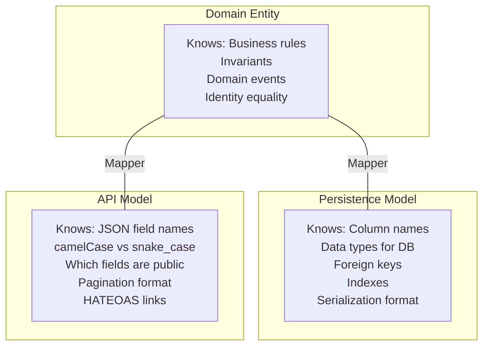
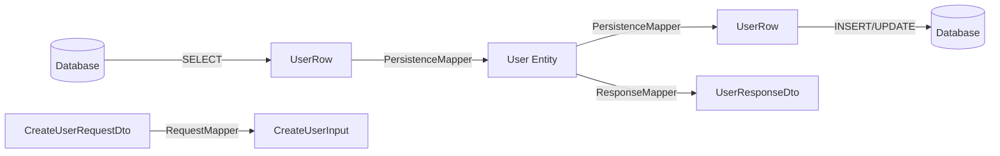
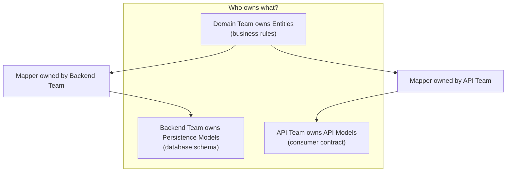

# Entities vs Models

## Why the Distinction Matters

One of the most common and costly mistakes in Clean Architecture is treating domain entities, database models, and API response shapes as the same thing. Teams start by sharing a single `User` class across all layers — it maps to a database table, it serializes to JSON, and it contains business logic. For the first six months this feels productive. Then:

- A database column rename requires updating the API contract
- An API versioning change leaks into domain logic
- A performance optimization (denormalized read model) forces restructuring of business rules
- A security audit reveals that the hashed password field is being serialized to the API response

The root cause is **coupling three independent concerns into one data structure**. Clean Architecture demands three distinct representations:

| Representation | Layer | Purpose | Changes When |
|---------------|-------|---------|-------------|
| **Domain Entity** | Ring 1 (Entities) | Encapsulates business rules, enforces invariants | Business rules change |
| **Persistence Model** | Ring 3 (Adapters) | Maps to database schema, handles serialization to/from storage | Database schema changes |
| **API Model (DTO)** | Ring 3 (Adapters) | Shapes data for external consumers (REST, GraphQL, gRPC) | API contract changes |

## First Principles

### The Single Responsibility of Data Structures

Each data representation has exactly one reason to change:

$$
\text{Change Rate}_{\text{entity}} \neq \text{Change Rate}_{\text{persistence}} \neq \text{Change Rate}_{\text{api}}
$$

In a typical system over 12 months:

| Model Type | Typical Changes/Year | Primary Driver |
|-----------|---------------------|---------------|
| Domain Entity | 5-15 | New business rules, regulatory changes |
| Persistence Model | 10-30 | Schema migrations, performance tuning, index changes |
| API Model | 15-50 | New fields, versioning, client requirements, deprecations |

Because they change at different rates and for different reasons, they must be separate types.

### Information Asymmetry

Each model knows different things:



## Core Mechanics — The Three Models

### Domain Entity (Ring 1)

The entity is the richest model. It has behaviour, enforces invariants, and carries identity.

```typescript
// domain/entities/user.ts
import { UserId } from '../value-objects/user-id';
import { Email } from '../value-objects/email';
import { HashedPassword } from '../value-objects/hashed-password';
import { UserRole } from '../value-objects/user-role';
import { UserSuspendedError, InvalidRoleTransitionError } from '../errors';

export class User {
  private _events: DomainEvent[] = [];

  private constructor(
    public readonly id: UserId,
    private _email: Email,
    private _password: HashedPassword,
    private _displayName: string,
    private _role: UserRole,
    private _suspended: boolean,
    private _lastLoginAt: Date | null,
    public readonly createdAt: Date,
    private _updatedAt: Date,
  ) {}

  static create(
    id: UserId,
    email: Email,
    password: HashedPassword,
    displayName: string,
    role: UserRole = UserRole.Member,
  ): User {
    const now = new Date();
    const user = new User(id, email, password, displayName, role, false, null, now, now);
    user.record({ type: 'UserCreated', userId: id.value, email: email.value });
    return user;
  }

  static reconstitute(props: {
    id: UserId;
    email: Email;
    password: HashedPassword;
    displayName: string;
    role: UserRole;
    suspended: boolean;
    lastLoginAt: Date | null;
    createdAt: Date;
    updatedAt: Date;
  }): User {
    return new User(
      props.id, props.email, props.password, props.displayName,
      props.role, props.suspended, props.lastLoginAt, props.createdAt, props.updatedAt,
    );
  }

  get email(): Email { return this._email; }
  get displayName(): string { return this._displayName; }
  get role(): UserRole { return this._role; }
  get suspended(): boolean { return this._suspended; }
  get lastLoginAt(): Date | null { return this._lastLoginAt; }
  get updatedAt(): Date { return this._updatedAt; }
  get events(): ReadonlyArray<DomainEvent> { return this._events; }

  clearEvents(): void { this._events = []; }

  changeEmail(newEmail: Email): void {
    if (this._suspended) throw new UserSuspendedError(this.id);
    const oldEmail = this._email;
    this._email = newEmail;
    this._updatedAt = new Date();
    this.record({ type: 'UserEmailChanged', userId: this.id.value, oldEmail: oldEmail.value, newEmail: newEmail.value });
  }

  changePassword(newPassword: HashedPassword): void {
    if (this._suspended) throw new UserSuspendedError(this.id);
    this._password = newPassword;
    this._updatedAt = new Date();
  }

  promote(newRole: UserRole): void {
    const allowed: Record<string, UserRole[]> = {
      [UserRole.Member]: [UserRole.Moderator],
      [UserRole.Moderator]: [UserRole.Admin],
      [UserRole.Admin]: [],
    };
    if (!allowed[this._role]?.includes(newRole)) {
      throw new InvalidRoleTransitionError(this._role, newRole);
    }
    this._role = newRole;
    this._updatedAt = new Date();
    this.record({ type: 'UserPromoted', userId: this.id.value, newRole });
  }

  suspend(): void {
    this._suspended = true;
    this._updatedAt = new Date();
    this.record({ type: 'UserSuspended', userId: this.id.value });
  }

  recordLogin(): void {
    this._lastLoginAt = new Date();
    this._updatedAt = new Date();
  }

  verifyPassword(candidate: HashedPassword): boolean {
    return this._password.equals(candidate);
  }

  private record(event: DomainEvent): void {
    this._events.push(event);
  }
}
```

Key properties:
- All fields are private with controlled access
- Business rules (role transitions, suspension checks) are enforced by methods
- No database annotations, no JSON decorators
- Has a `reconstitute` factory for rehydration from persistence (no events emitted)

### Persistence Model (Ring 3)

The persistence model is a plain data structure that mirrors the database schema:

```typescript
// adapters/persistence/models/user.model.ts

/** Mirrors the `users` table exactly */
export interface UserRow {
  id: string;                // UUID primary key
  email: string;             // UNIQUE, NOT NULL
  password_hash: string;     // bcrypt hash
  display_name: string;      // VARCHAR(255)
  role: string;              // ENUM('member','moderator','admin')
  is_suspended: boolean;     // DEFAULT false
  last_login_at: Date | null;// TIMESTAMP, nullable
  created_at: Date;          // TIMESTAMP, DEFAULT NOW()
  updated_at: Date;          // TIMESTAMP, DEFAULT NOW()
}

/**
 * For joined queries — when we need user + team membership in one query.
 * This avoids N+1 but is NOT a domain entity.
 */
export interface UserWithTeamsRow extends UserRow {
  team_ids: string[];        // From array_agg
  team_names: string[];      // From array_agg
}
```

Key properties:
- Uses snake_case (matches SQL convention)
- Has `password_hash` (database column name, not the domain concept)
- Has `is_suspended` (database boolean column naming)
- No methods, no invariant enforcement
- May include denormalized/joined shapes for query optimization

### API Model / DTO (Ring 3)

The API model shapes data for external consumers:

```typescript
// adapters/http/dtos/user.dto.ts

/** Response DTO — what external consumers see */
export interface UserResponseDto {
  id: string;
  email: string;
  displayName: string;
  role: 'member' | 'moderator' | 'admin';
  suspended: boolean;
  lastLoginAt: string | null;  // ISO 8601 string
  createdAt: string;           // ISO 8601 string
  _links: {
    self: string;
    promote?: string;          // Only present for eligible roles
    suspend?: string;          // Only present if not already suspended
  };
}

/** Request DTO — what external consumers send */
export interface CreateUserRequestDto {
  email: string;
  password: string;            // Plain text — will be hashed
  displayName: string;
}

/** Request DTO for update */
export interface UpdateUserRequestDto {
  email?: string;
  displayName?: string;
}

/** Paginated list response */
export interface UserListResponseDto {
  data: UserResponseDto[];
  pagination: {
    page: number;
    pageSize: number;
    totalItems: number;
    totalPages: number;
  };
}
```

Key properties:
- Uses camelCase (JSON convention)
- **Never exposes `password_hash`** — security by design
- Includes HATEOAS `_links` for API discoverability
- Dates are ISO 8601 strings (not Date objects)
- Conditional fields based on business rules (`promote` link only for eligible roles)

## Mapping Between Models

### The Mapper Pattern

Each boundary crossing has a dedicated mapper:



### Persistence Mapper

```typescript
// adapters/persistence/mappers/user.mapper.ts
import { User } from '../../../domain/entities/user';
import { UserId } from '../../../domain/value-objects/user-id';
import { Email } from '../../../domain/value-objects/email';
import { HashedPassword } from '../../../domain/value-objects/hashed-password';
import { UserRole } from '../../../domain/value-objects/user-role';
import type { UserRow } from '../models/user.model';

export class UserPersistenceMapper {
  static toDomain(row: UserRow): User {
    return User.reconstitute({
      id: UserId.of(row.id),
      email: Email.of(row.email),
      password: HashedPassword.fromHash(row.password_hash),
      displayName: row.display_name,
      role: row.role as UserRole,
      suspended: row.is_suspended,
      lastLoginAt: row.last_login_at,
      createdAt: row.created_at,
      updatedAt: row.updated_at,
    });
  }

  static toPersistence(entity: User): UserRow {
    return {
      id: entity.id.value,
      email: entity.email.value,
      password_hash: entity.password.hash, // Access the raw hash for storage
      display_name: entity.displayName,
      role: entity.role,
      is_suspended: entity.suspended,
      last_login_at: entity.lastLoginAt,
      created_at: entity.createdAt,
      updated_at: entity.updatedAt,
    };
  }
}
```

### Response Mapper

```typescript
// adapters/http/mappers/user-response.mapper.ts
import type { User } from '../../../domain/entities/user';
import type { UserResponseDto } from '../dtos/user.dto';
import { UserRole } from '../../../domain/value-objects/user-role';

export class UserResponseMapper {
  static toDto(entity: User, baseUrl: string): UserResponseDto {
    const links: UserResponseDto['_links'] = {
      self: `${baseUrl}/users/${entity.id.value}`,
    };

    // Conditional links based on business rules
    if (entity.role === UserRole.Member) {
      links.promote = `${baseUrl}/users/${entity.id.value}/promote`;
    } else if (entity.role === UserRole.Moderator) {
      links.promote = `${baseUrl}/users/${entity.id.value}/promote`;
    }

    if (!entity.suspended) {
      links.suspend = `${baseUrl}/users/${entity.id.value}/suspend`;
    }

    return {
      id: entity.id.value,
      email: entity.email.value,
      displayName: entity.displayName,
      role: entity.role as 'member' | 'moderator' | 'admin',
      suspended: entity.suspended,
      lastLoginAt: entity.lastLoginAt?.toISOString() ?? null,
      createdAt: entity.createdAt.toISOString(),
      _links: links,
    };
  }

  static toDtoList(
    entities: User[],
    baseUrl: string,
    pagination: { page: number; pageSize: number; totalItems: number },
  ): UserListResponseDto {
    return {
      data: entities.map((e) => this.toDto(e, baseUrl)),
      pagination: {
        ...pagination,
        totalPages: Math.ceil(pagination.totalItems / pagination.pageSize),
      },
    };
  }
}
```

## Edge Cases & Failure Modes

### 1. Shared Models (The Universal Anti-Pattern)

::: danger Anti-Pattern: One Model to Rule Them All
```typescript
// WRONG — shared across all layers
export class User {
  @PrimaryGeneratedColumn('uuid')
  id!: string;

  @Column()
  email!: string;

  @Column()
  @Exclude()  // class-transformer decorator for API
  passwordHash!: string;

  @Column()
  displayName!: string;

  // Business logic mixed with ORM annotations
  promote(newRole: string): void { /* ... */ }
}
```
This class is simultaneously a TypeORM entity, a class-transformer DTO, and a domain entity. It has three reasons to change and violates SRP at the type level.
:::

### 2. The "Mapping Is Boilerplate" Objection

Teams often resist separate models because mapping feels like boilerplate. The counter-arguments:

| Objection | Response |
|-----------|----------|
| "It's just extra code" | It's **boundary code** — the most important code for long-term maintainability |
| "We can use automapper" | Automappers hide the mapping, making bugs harder to find. Explicit mapping is documentation. |
| "Our models are the same" | They are the same **today**. They diverge the moment you optimize a query, add an API field, or change an invariant. |
| "It slows development" | It takes 5 minutes to write a mapper. It takes 5 days to untangle a shared model. |

### 3. Password Exposure

Without separate models, it is trivially easy to accidentally serialize a password hash to the API:

```typescript
// With shared model, you must REMEMBER to exclude
const user = await userRepo.findById(id);
res.json(user); // Oops — includes passwordHash

// With separate models, it's impossible
const dto = UserResponseMapper.toDto(user, baseUrl);
res.json(dto); // passwordHash was never in the DTO type
```

### 4. Stale Read Models

In CQRS systems, the read model (API model) may lag behind the write model (entity). This is expected — see [Eventual Consistency](/architecture-patterns/event-driven/eventual-consistency).

### 5. Deep Object Graphs

When entities have nested aggregates, mapping becomes recursive:

```typescript
// Mapping an Order with OrderLines
static toPersistence(order: Order): OrderRow & { lines: OrderLineRow[] } {
  return {
    id: order.id.value,
    customer_id: order.customerId.value,
    status: order.status,
    created_at: order.createdAt,
    lines: order.lines.map((line) => ({
      order_id: order.id.value,
      product_id: line.productId.value,
      quantity: line.quantity,
      unit_price: line.unitPrice.amount,
      currency: line.unitPrice.currency,
    })),
  };
}
```

For deeply nested structures (3+ levels), consider using the **Visitor pattern** to walk the object graph.

## Performance Characteristics

### Mapping Cost

For a single `User` entity:

| Mapping | Time | Allocations |
|---------|------|------------|
| Row → Entity (reconstitute) | ~15 µs | 1 entity + 5 value objects = 6 objects |
| Entity → Row | ~8 µs | 1 plain object |
| Entity → DTO | ~10 µs | 1 plain object + 1 links object |
| **Total round-trip** | **~33 µs** | **8 objects** |

For a list of 100 users:

$$
T_{\text{mapping}} = 100 \times 33\,\mu s = 3.3\,\text{ms}
$$

This is negligible compared to the database query time (~5-50 ms).

### Memory Overhead

Each model instance for a User takes approximately:

| Model | Size (bytes) | Notes |
|-------|-------------|-------|
| UserRow | ~200 | Plain object with string/date fields |
| User entity | ~350 | Object + value object wrappers + methods |
| UserResponseDto | ~250 | Plain object with formatted strings |
| **Total in memory** | **~800** | **Briefly during mapping** |

For 1,000 concurrent requests each handling a 100-user list:

$$
\text{Peak memory} = 1000 \times 100 \times 800\,\text{B} = 80\,\text{MB}
$$

Easily within Node.js heap limits. The GC handles short-lived objects efficiently.

### Optimization: Skip Entity for Read-Only Queries

For read-only queries (no business logic needed), you can map directly from the persistence model to the API model, bypassing entity construction:

```typescript
// adapters/persistence/queries/user-list.query.ts
export class UserListQuery {
  constructor(private readonly pool: Pool) {}

  async execute(page: number, pageSize: number): Promise<UserListResponseDto> {
    const offset = (page - 1) * pageSize;

    const [dataResult, countResult] = await Promise.all([
      this.pool.query<UserRow>(
        'SELECT * FROM users ORDER BY created_at DESC LIMIT $1 OFFSET $2',
        [pageSize, offset],
      ),
      this.pool.query<{ count: string }>('SELECT COUNT(*) FROM users'),
    ]);

    const totalItems = parseInt(countResult.rows[0].count, 10);

    // Direct Row → DTO mapping (no entity construction)
    return {
      data: dataResult.rows.map((row) => ({
        id: row.id,
        email: row.email,
        displayName: row.display_name,
        role: row.role as 'member' | 'moderator' | 'admin',
        suspended: row.is_suspended,
        lastLoginAt: row.last_login_at?.toISOString() ?? null,
        createdAt: row.created_at.toISOString(),
        _links: { self: `/api/users/${row.id}` },
      })),
      pagination: {
        page,
        pageSize,
        totalItems,
        totalPages: Math.ceil(totalItems / pageSize),
      },
    };
  }
}
```

This is the **CQRS read path** — queries bypass the domain entirely. See [CQRS Deep Dive](/architecture-patterns/cqrs-event-sourcing/cqrs-deep-dive).

## Mathematical Foundations — Model Divergence

### Rate of Model Drift

Let $D(t)$ be the **divergence** between two models at time $t$, measured as the number of fields that differ:

$$
D(t) = D_0 + \lambda \cdot t
$$

Where:
- $D_0 = 0$ (models start identical)
- $\lambda$ = average rate of divergent changes per month

Empirical values of $\lambda$:

| Pair | $\lambda$ (changes/month) | Time until 50% divergence (20-field model) |
|------|--------------------------|-------------------------------------------|
| Entity ↔ Persistence | ~0.8 | ~12 months |
| Entity ↔ API | ~1.5 | ~7 months |
| Persistence ↔ API | ~2.0 | ~5 months |

By month 12, a typical 20-field model has:
- Entity vs. Persistence: ~10 differing fields
- Entity vs. API: ~18 differing fields

Shared models become a liability faster than teams expect.

### Cost of Untangling

The cost $C$ of separating shared models grows superlinearly with the number of dependents $n$:

$$
C(n) = c_0 \cdot n \cdot \log(n)
$$

Where $c_0$ is the cost per dependent. In practice, $c_0 \approx 2\text{-}4$ developer-hours per file that uses the shared model.

For a system with 200 files using a shared `User` model:

$$
C(200) = 3 \times 200 \times \log_2(200) \approx 3 \times 200 \times 7.6 = 4,580 \text{ developer-hours}
$$

That is roughly 2.3 developer-years. Starting with separate models from day one costs approximately 40 hours.

::: info War Story
**The User Model That Took Down Production**

An e-commerce platform shared a single `Product` model across their catalog service, inventory service, and pricing service. The model had 47 fields — some for the database, some for the API, some for search indexing.

During a Black Friday sale, the team needed to add a `flashSalePrice` field to the API. Because the model was shared, adding the field triggered:

1. A database migration (new column in the 200M-row products table)
2. A search index rewrite (Elasticsearch mapping change)
3. A cache invalidation (all cached products had the wrong shape)

The migration took 4 hours during peak traffic. The search reindex took 6 hours. Total revenue impact was estimated at $800K.

If the API model had been separate, the change would have been: add a field to the DTO, compute it from existing data in the mapper. Zero database changes, zero search changes, zero cache invalidation. Deployment in 15 minutes.
:::

## Decision Framework

### When to Share Models (Rarely)

| Situation | Share? | Why |
|-----------|--------|-----|
| Internal tooling with 1 developer, < 6 month lifespan | Maybe | ROI of separation is low |
| Prototype being thrown away | Yes | Speed over structure |
| Production system, any size | No | Cost of separation grows over time; pay it early |
| Microservice with strict bounded context | Separate | Services evolve independently |
| Monolith with shared database | Separate (critical) | Highest risk of coupling |

### Model Ownership Rules



In smaller teams where one person wears all hats, the ownership is still logically separate — you are wearing different hats when you change each model.

### Choosing a Mapping Strategy

| Strategy | Pros | Cons | Best For |
|----------|------|------|----------|
| **Manual mappers** | Explicit, debuggable, type-safe | Verbose | Systems with complex mapping rules |
| **Automapper (class-transformer)** | Less code | Magic, hard to debug, implicit coupling | Simple CRUD apps |
| **Code generation** | Type-safe, no runtime overhead | Build step complexity | Large codebases with many models |
| **Spread operator** | Minimal code | No transformation, easy to leak fields | Same-shape mappings |

The recommendation for Clean Architecture is **manual mappers** — they serve as documentation of the boundary contract and are trivially testable.

## Advanced Topics

### Event Sourced Entities

When entities are event-sourced, the "persistence model" is the event stream itself:

```typescript
// Domain entity (Ring 1) — rebuilt from events
export class User {
  static fromEvents(events: DomainEvent[]): User {
    const user = new User(/* initial state */);
    for (const event of events) {
      user.apply(event);
    }
    return user;
  }
}

// Persistence model (Ring 3) — the event record
export interface StoredEvent {
  event_id: string;
  aggregate_id: string;
  aggregate_type: string;
  event_type: string;
  payload: string;      // JSON-serialized event data
  metadata: string;     // JSON-serialized metadata
  version: number;
  created_at: Date;
}
```

See [Event Sourcing Deep Dive](/architecture-patterns/cqrs-event-sourcing/event-sourcing-deep-dive) for the full pattern.

### GraphQL and Model Selection

GraphQL complicates the API model story because clients select which fields they want. The response mapper must handle partial projection:

```typescript
// adapters/graphql/resolvers/user.resolver.ts
export const userResolver = {
  Query: {
    user: async (_: any, args: { id: string }, ctx: GraphQLContext) => {
      const output = await ctx.getUserById.execute({ userId: args.id });
      return output; // GraphQL handles field selection from the full DTO
    },
  },
  User: {
    // Lazy-loaded field — only resolved if requested
    recentOrders: async (parent: UserDto, _: any, ctx: GraphQLContext) => {
      const orders = await ctx.getUserOrders.execute({
        userId: parent.id,
        limit: 10,
      });
      return orders.items;
    },
  },
};
```

### Versioned API Models

When supporting multiple API versions, each version gets its own DTO:

```typescript
// adapters/http/dtos/v1/user.dto.ts
export interface UserV1ResponseDto {
  id: string;
  email: string;
  name: string;  // V1 used "name"
}

// adapters/http/dtos/v2/user.dto.ts
export interface UserV2ResponseDto {
  id: string;
  email: string;
  displayName: string;  // V2 renamed to "displayName"
  role: string;         // V2 added role
}
```

The domain entity is unchanged. Only the mapper differs per version.

### Projection Models for Read Optimization

In high-read systems, create purpose-built read models that are flattened, denormalized, and optimized for specific queries:

```typescript
// adapters/persistence/read-models/user-dashboard.model.ts
export interface UserDashboardView {
  user_id: string;
  display_name: string;
  email: string;
  role: string;
  total_orders: number;
  total_spent: number;
  last_order_date: Date | null;
  loyalty_tier: string;
  unread_notifications: number;
}
```

This model is populated by a [projection](/architecture-patterns/cqrs-event-sourcing/projections) that listens to domain events and maintains the denormalized view. It is not derived from entities at query time.

## Testing Mappers

Mappers are simple but critical — test them explicitly:

```typescript
describe('UserPersistenceMapper', () => {
  const sampleRow: UserRow = {
    id: '550e8400-e29b-41d4-a716-446655440000',
    email: 'alice@example.com',
    password_hash: '$2b$10$abcdef...',
    display_name: 'Alice Johnson',
    role: 'moderator',
    is_suspended: false,
    last_login_at: new Date('2026-03-17T10:00:00Z'),
    created_at: new Date('2026-01-01T00:00:00Z'),
    updated_at: new Date('2026-03-17T10:00:00Z'),
  };

  it('should map row to domain entity', () => {
    const entity = UserPersistenceMapper.toDomain(sampleRow);
    expect(entity.id.value).toBe(sampleRow.id);
    expect(entity.email.value).toBe(sampleRow.email);
    expect(entity.displayName).toBe('Alice Johnson');
    expect(entity.role).toBe(UserRole.Moderator);
    expect(entity.suspended).toBe(false);
  });

  it('should map entity back to row (round-trip)', () => {
    const entity = UserPersistenceMapper.toDomain(sampleRow);
    const row = UserPersistenceMapper.toPersistence(entity);
    expect(row).toEqual(sampleRow);
  });

  it('should never expose password in response DTO', () => {
    const entity = UserPersistenceMapper.toDomain(sampleRow);
    const dto = UserResponseMapper.toDto(entity, 'https://api.example.com');
    expect(dto).not.toHaveProperty('password');
    expect(dto).not.toHaveProperty('passwordHash');
    expect(dto).not.toHaveProperty('password_hash');
    expect(JSON.stringify(dto)).not.toContain('$2b$');
  });
});
```

## Further Reading

- [Layers & Boundaries](./layers-and-boundaries) — the four rings and boundary enforcement
- [Use Cases](./use-cases) — input/output DTOs for use case boundaries
- [TypeScript Implementation](./typescript-implementation) — complete working project with all mappers
- [DDD: Tactical Design](/architecture-patterns/domain-driven-design/tactical-design) — entity and value object design
- [CQRS Projections](/architecture-patterns/cqrs-event-sourcing/projections) — read model design
