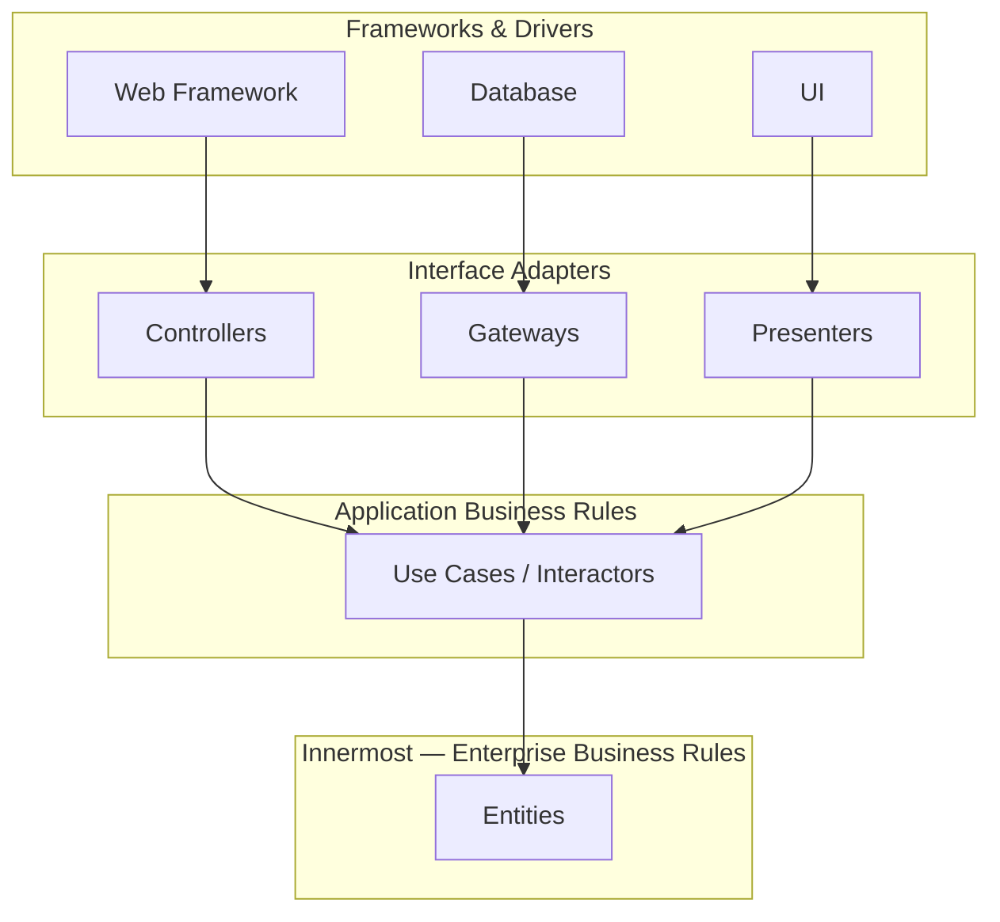
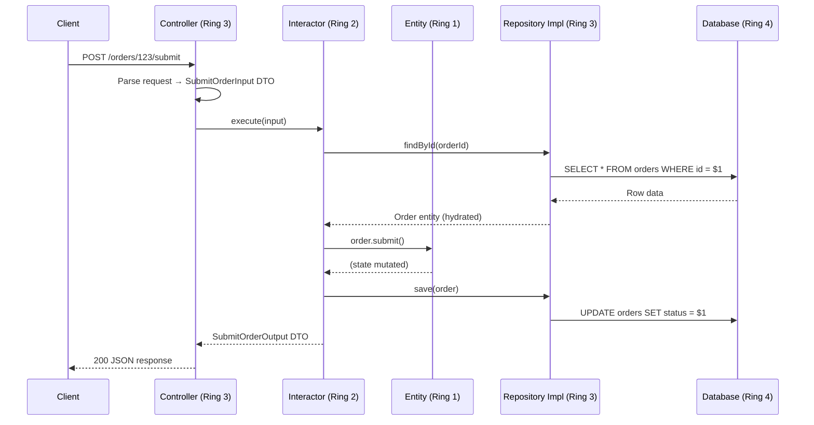
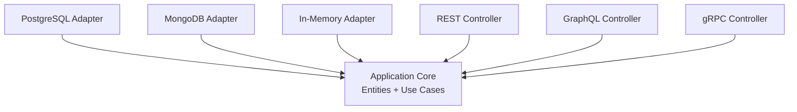

# Clean Architecture — Overview

## Why Clean Architecture Exists

Every long-lived codebase eventually faces the same crisis: the cost of change exceeds the value of the change. Features that should take a day take a sprint. Bug fixes introduce regressions in unrelated modules. A database migration becomes a company-wide incident.

Robert C. Martin ("Uncle Bob") published *Clean Architecture* in 2017 as a synthesis of three decades of architectural thinking — Hexagonal Architecture (Alistair Cockburn, 2005), Onion Architecture (Jeffrey Palermo, 2008), BCE (Ivar Jacobson, 1992), and his own SOLID principles. The thesis is deceptively simple: **separate what changes for business reasons from what changes for technical reasons, and enforce that separation with the Dependency Rule.**

### The Problem Space

In a typical layered architecture (presentation → business logic → data access), every layer depends on the one below it. When you swap PostgreSQL for DynamoDB the ripple reaches the controller. When you replace Express with Fastify the use-case code is collateral damage.

```
Traditional 3-Tier (dependency flows down)
┌───────────────────┐
│   Presentation    │
│  (Express router) │
└───────┬───────────┘
        │ depends on
┌───────▼───────────┐
│  Business Logic   │
│  (service layer)  │
└───────┬───────────┘
        │ depends on
┌───────▼───────────┐
│   Data Access     │
│  (SQL queries)    │
└───────────────────┘
```

Clean Architecture **inverts the inner dependencies** so that high-level policy never depends on low-level detail.

### Historical Context

| Year | Architecture | Author | Key Idea |
|------|-------------|--------|----------|
| 1992 | BCE (Boundary-Control-Entity) | Ivar Jacobson | Use-case-driven decomposition |
| 2003 | Domain-Driven Design | Eric Evans | Ubiquitous language, bounded contexts |
| 2005 | Hexagonal (Ports & Adapters) | Alistair Cockburn | Application core has no knowledge of delivery mechanism |
| 2008 | Onion Architecture | Jeffrey Palermo | Concentric layers, domain at centre |
| 2012 | Clean Architecture blog post | Robert C. Martin | Unified model + Dependency Rule |
| 2017 | *Clean Architecture* book | Robert C. Martin | Full treatment with SOLID integration |

Clean Architecture is not a competitor to Hexagonal or Onion — it is a **superset that formalises rules they left implicit**, especially around use-case interactors and the direction of data flow.

## First Principles

### The Dependency Rule

> Source code dependencies must point only inward, toward higher-level policies.

This is the single most important sentence in the entire architecture. "Inward" means toward the centre of the concentric rings. Nothing in an inner ring may know the name of something in an outer ring — no function, no class, no variable, not even a string reference.



### Why "Inward"?

The innermost code is the **most stable** — enterprise business rules change only when the business itself changes. The outermost code is the **most volatile** — frameworks release new major versions, databases get swapped, UIs get redesigned. By making volatile code depend on stable code (never the reverse) you guarantee that **volatile changes do not cascade inward**.

### Formal Definition

Let $L_0, L_1, \ldots, L_n$ represent concentric layers from innermost ($L_0$) to outermost ($L_n$). The Dependency Rule states:

$$
\forall\, i < j,\; L_i \text{ has zero source-code dependencies on } L_j
$$

This is a **compile-time** constraint, not a runtime constraint. At runtime, an outer object may call an inner interface, and the inner interface's implementation (which lives in an outer layer) receives the call. This is dependency inversion in action.

## Core Mechanics — The Four Rings

```mermaid
graph LR
    subgraph Ring 1 - Entities
        direction TB
        E1[Domain Entities]
        E2[Value Objects]
        E3[Domain Services]
    end
    subgraph Ring 2 - Use Cases
        direction TB
        U1[Interactors]
        U2[Input Boundaries]
        U3[Output Boundaries]
    end
    subgraph Ring 3 - Interface Adapters
        direction TB
        A1[Controllers]
        A2[Presenters]
        A3[Repository Impls]
        A4[Mappers / DTOs]
    end
    subgraph Ring 4 - Frameworks
        direction TB
        F1[Express / Fastify]
        F2[PostgreSQL Driver]
        F3[React / Vue]
        F4[Message Broker SDK]
    end
    Ring 1 - Entities --- Ring 2 - Use Cases --- Ring 3 - Interface Adapters --- Ring 4 - Frameworks
```

### Ring 1 — Entities (Enterprise Business Rules)

Entities encapsulate the most general and high-level business rules. An entity can be an object with methods or a set of data structures and functions. They are the least likely to change when something external changes — a page navigation change or a security policy change should not affect them.

In a TypeScript codebase, entities are plain classes or objects with **zero framework imports**.

```typescript
// domain/entities/order.ts — Ring 1
export class Order {
  private readonly lines: OrderLine[] = [];

  constructor(
    public readonly id: OrderId,
    public readonly customerId: CustomerId,
    private status: OrderStatus = OrderStatus.Draft,
    public readonly createdAt: Date = new Date(),
  ) {}

  addLine(product: ProductId, quantity: number, unitPrice: Money): void {
    if (this.status !== OrderStatus.Draft) {
      throw new OrderNotDraftError(this.id);
    }
    if (quantity <= 0) {
      throw new InvalidQuantityError(quantity);
    }
    this.lines.push(new OrderLine(product, quantity, unitPrice));
  }

  get total(): Money {
    return this.lines.reduce(
      (sum, line) => sum.add(line.subtotal),
      Money.zero(this.lines[0]?.unitPrice.currency ?? 'USD'),
    );
  }

  submit(): void {
    if (this.lines.length === 0) {
      throw new EmptyOrderError(this.id);
    }
    this.status = OrderStatus.Submitted;
  }
}
```

### Ring 2 — Use Cases (Application Business Rules)

Use cases orchestrate the flow of data **to** and **from** entities. They contain application-specific business rules — the rules that would change if the application's purpose changed but the enterprise rules stayed the same.

Each use case is a single class (the **interactor**) that implements an **input boundary** interface and produces output through an **output boundary** interface.

```typescript
// application/use-cases/submit-order.ts — Ring 2
export interface SubmitOrderInput {
  orderId: string;
  submittedBy: string;
}

export interface SubmitOrderOutput {
  orderId: string;
  total: number;
  currency: string;
  submittedAt: string;
}

export interface SubmitOrderUseCase {
  execute(input: SubmitOrderInput): Promise<SubmitOrderOutput>;
}
```

### Ring 3 — Interface Adapters

This ring converts data from the format most convenient for use cases and entities to the format most convenient for external agencies (databases, web, etc.). Controllers, presenters, gateways, and repository implementations all live here.

```typescript
// adapters/http/order.controller.ts — Ring 3
import type { SubmitOrderUseCase, SubmitOrderInput } from '../../application/use-cases/submit-order';
import type { Request, Response } from 'express';

export class OrderController {
  constructor(private readonly submitOrder: SubmitOrderUseCase) {}

  async handleSubmit(req: Request, res: Response): Promise<void> {
    const input: SubmitOrderInput = {
      orderId: req.params.id,
      submittedBy: req.user!.id,
    };
    const output = await this.submitOrder.execute(input);
    res.status(200).json(output);
  }
}
```

### Ring 4 — Frameworks & Drivers

The outermost ring is glue code — Express route definitions, database connection setup, message broker initialization. You write as little code as possible here.

```typescript
// frameworks/http/routes.ts — Ring 4
import { Router } from 'express';
import { OrderController } from '../../adapters/http/order.controller';

export function orderRoutes(controller: OrderController): Router {
  const router = Router();
  router.post('/:id/submit', (req, res) => controller.handleSubmit(req, res));
  return router;
}
```

## Data Flow Across Boundaries

A common mistake is allowing database row shapes or HTTP request shapes to leak into use cases. Clean Architecture mandates explicit data transformations at each boundary crossing.



The key observation: **the interactor never touches an HTTP object or a database row**. It receives a plain DTO and returns a plain DTO. The mapping burden falls on Ring 3.

## Edge Cases & Failure Modes

### 1. Leaking Framework Types

The most common violation of Clean Architecture is importing a framework type into Ring 1 or Ring 2.

::: danger Anti-Pattern
```typescript
// WRONG — Ring 2 depends on Express (Ring 4)
import { Request } from 'express';

export class SubmitOrderInteractor {
  execute(req: Request): Promise<void> { /* ... */ }
}
```
:::

::: tip Correct Approach
```typescript
// RIGHT — Ring 2 depends only on plain interfaces
export class SubmitOrderInteractor {
  execute(input: SubmitOrderInput): Promise<SubmitOrderOutput> { /* ... */ }
}
```
:::

### 2. Circular Dependencies

If Ring 2 imports from Ring 3, you have a cycle. TypeScript compilers will not catch this because they see files, not rings. Use **ESLint import rules** or **dependency-cruiser** to enforce boundaries:

```json
{
  "rules": {
    "import/no-restricted-paths": ["error", {
      "zones": [{
        "target": "./src/domain",
        "from": "./src/application"
      }, {
        "target": "./src/domain",
        "from": "./src/adapters"
      }, {
        "target": "./src/application",
        "from": "./src/adapters"
      }]
    }]
  }
}
```

### 3. The "God Use Case"

When a single interactor orchestrates five repositories, two external services, and three entities, you have a God Use Case. Split it into smaller use cases composed through a **pipeline** or **mediator**.

### 4. Over-Abstraction

Not every CRUD endpoint needs four layers and six interfaces. The Dependency Rule still applies, but you can collapse Ring 3 and Ring 4 into a single module when the adapter is trivially thin.

## Performance Characteristics

| Concern | Impact | Mitigation |
|---------|--------|------------|
| Object mapping at boundaries | O(n) per boundary crossing, ~1-5 µs per object | Negligible for typical payloads; for bulk operations, use streaming mappers |
| Interface indirection | Virtual dispatch cost (~2-5 ns per call on V8) | Eliminated by JIT inlining after warm-up |
| Dependency injection container | O(1) resolve per request (singleton/transient scoped) | Pre-warm container at startup |
| Extra allocations for DTOs | GC pressure for high-throughput paths | Object pooling or plain object literals instead of class instances |

In benchmarks on a typical Node.js service:

- **Clean Architecture (4 layers)**: ~48,000 req/s (Express + pg, 10 ms DB latency)
- **Flat architecture (1 layer)**: ~52,000 req/s (same setup)
- **Overhead**: ~8% — attributable to DTO mapping and DI resolution

The 8% overhead is negligible compared to I/O latency. The real cost of ignoring Clean Architecture is measured in developer-months, not milliseconds.

## Mathematical Foundations — Coupling Metrics

### Instability Metric (Robert C. Martin)

For a module $M$:

$$
I(M) = \frac{C_e}{C_a + C_e}
$$

Where:
- $C_a$ = afferent couplings (incoming dependencies)
- $C_e$ = efferent couplings (outgoing dependencies)
- $I \in [0, 1]$ — 0 = maximally stable, 1 = maximally unstable

In Clean Architecture:
- **Entities** ($L_0$): $C_e = 0$, so $I = 0$ — maximally stable
- **Frameworks** ($L_n$): $C_a = 0$ (nothing depends on them within the system), so $I = 1$ — maximally unstable

The **Stable Dependencies Principle** (SDP) requires:

$$
I(L_i) \leq I(L_j) \quad \text{when } L_j \text{ depends on } L_i
$$

Clean Architecture's Dependency Rule automatically satisfies SDP.

### Abstractness Metric

$$
A(M) = \frac{N_a}{N_c}
$$

Where $N_a$ = number of abstract classes/interfaces, $N_c$ = total number of classes.

The **Stable Abstractions Principle** (SAP) says: a module should be as abstract as it is stable.

$$
D = |A + I - 1|
$$

$D$ is the distance from the "main sequence" line. $D = 0$ is ideal. In Clean Architecture, entities are stable ($I \approx 0$) and abstract ($A$ is high because they define interfaces), placing them on the main sequence.

::: info War Story
**The $12M Framework Migration**

A fintech company built their payment processing engine directly on a proprietary ESB framework. When the framework vendor was acquired and the product sunsetted, they faced migrating 800,000 lines of code. The migration took 18 months and cost roughly $12M in developer time and delayed features.

A team at the same company that had adopted Clean Architecture for a newer service completed the same vendor transition in 3 weeks. Their domain logic (Rings 1 and 2) required zero changes. Only Ring 3 adapters and Ring 4 glue code needed rewriting — about 15% of the codebase.

The lesson: the Dependency Rule is an insurance policy. The premium is small (a few extra interfaces), but the payout when external dependencies change is enormous.
:::

## Decision Framework

### When to Use Clean Architecture

| Situation | Recommendation | Reason |
|-----------|---------------|--------|
| Long-lived product (3+ years) | **Strongly recommended** | Amortizes abstraction cost over many changes |
| Complex domain logic | **Strongly recommended** | Testable entities and use cases pay dividends |
| Team > 5 developers | **Recommended** | Clear boundaries reduce merge conflicts and cognitive load |
| Prototype / hackathon | **Not recommended** | Overhead exceeds benefit for throwaway code |
| Simple CRUD API (< 10 endpoints) | **Overkill** | Use a lighter pattern (e.g., vertical slices) |
| Microservice with single responsibility | **Consider simplified variant** | Collapse Ring 3 + 4, keep Ring 1 + 2 separate |

### Clean Architecture vs. Alternatives

| Criteria | Clean Architecture | Hexagonal | Onion | Vertical Slices |
|----------|-------------------|-----------|-------|-----------------|
| Layer enforcement | Explicit 4-ring model | Implicit (inside/outside) | 3+ rings | None (feature folders) |
| Use case modelling | First-class interactors | Not prescribed | Not prescribed | Per-feature handlers |
| Testing strategy | Unit test per ring | Port/adapter mocking | Similar to Hexagonal | Integration-focused |
| Learning curve | Moderate-high | Moderate | Moderate | Low |
| Framework independence | Excellent | Excellent | Good | Variable |
| Boilerplate | Higher | Moderate | Moderate | Lowest |

## Advanced Topics

### Screaming Architecture

Uncle Bob argues that the architecture should **scream** the use cases of the system, not the framework. A project's top-level directory should reveal business intent:

```
src/
├── orders/
│   ├── entities/
│   ├── use-cases/
│   └── adapters/
├── inventory/
│   ├── entities/
│   ├── use-cases/
│   └── adapters/
└── shipping/
    ├── entities/
    ├── use-cases/
    └── adapters/
```

This approach merges Clean Architecture with [DDD bounded contexts](/architecture-patterns/domain-driven-design/strategic-design), which is the recommended structure for any non-trivial system.

### The Humble Object Pattern

When a component is hard to test (e.g., a UI view, a database query), extract the testable logic into a separate object and leave the hard-to-test remainder as a **humble object** — so simple it obviously contains no bugs.

In Clean Architecture, presenters are the testable counterpart to views:

```typescript
// application/presenters/order-summary.presenter.ts
export class OrderSummaryPresenter {
  present(order: Order): OrderSummaryViewModel {
    return {
      id: order.id.value,
      total: order.total.format(), // "$1,234.56"
      lineCount: order.lines.length,
      isLargeOrder: order.lines.length > 10,
      statusBadgeColor: this.statusColor(order.status),
    };
  }

  private statusColor(status: OrderStatus): string {
    const map: Record<OrderStatus, string> = {
      [OrderStatus.Draft]: 'gray',
      [OrderStatus.Submitted]: 'blue',
      [OrderStatus.Fulfilled]: 'green',
      [OrderStatus.Cancelled]: 'red',
    };
    return map[status];
  }
}
```

### Plugin Architecture

Clean Architecture naturally supports a plugin model. Since inner rings define interfaces and outer rings implement them, you can swap implementations without touching the core:



All plugins depend on the core. The core depends on nothing. This is the architectural manifestation of the [Open-Closed Principle](/architecture-patterns/hexagonal/dependency-inversion).

### Conformance Testing

Automate boundary enforcement in CI:

```typescript
// __tests__/architecture.spec.ts
import { filesOfProject } from 'ts-arch';

describe('Clean Architecture Boundaries', () => {
  it('domain should not import from application', async () => {
    const rule = filesOfProject()
      .inFolder('domain')
      .shouldNot()
      .dependOnFiles()
      .inFolder('application');
    await expect(rule).toPassAsync();
  });

  it('application should not import from adapters', async () => {
    const rule = filesOfProject()
      .inFolder('application')
      .shouldNot()
      .dependOnFiles()
      .inFolder('adapters');
    await expect(rule).toPassAsync();
  });

  it('domain should not import from adapters', async () => {
    const rule = filesOfProject()
      .inFolder('domain')
      .shouldNot()
      .dependOnFiles()
      .inFolder('adapters');
    await expect(rule).toPassAsync();
  });
});
```

## Further Reading

- [Layers & Boundaries](./layers-and-boundaries) — deep dive into each ring
- [Use Cases](./use-cases) — interactor design, input/output boundaries
- [Entities vs Models](./entities-vs-models) — domain entities vs persistence vs API models
- [TypeScript Implementation](./typescript-implementation) — complete working project
- [Hexagonal Architecture](/architecture-patterns/hexagonal/) — the predecessor pattern
- [Domain-Driven Design](/architecture-patterns/domain-driven-design/) — strategic and tactical patterns that pair naturally with Clean Architecture
