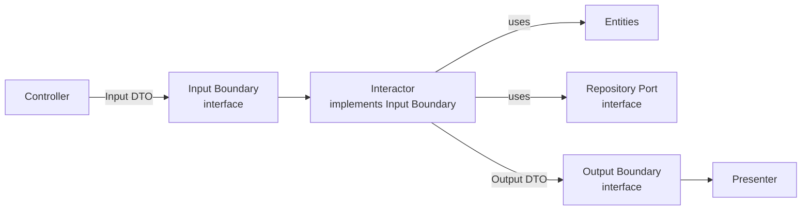
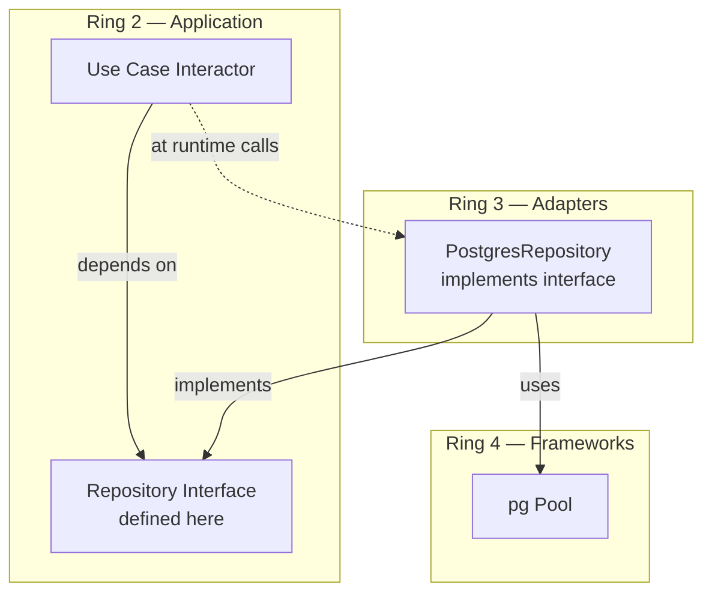
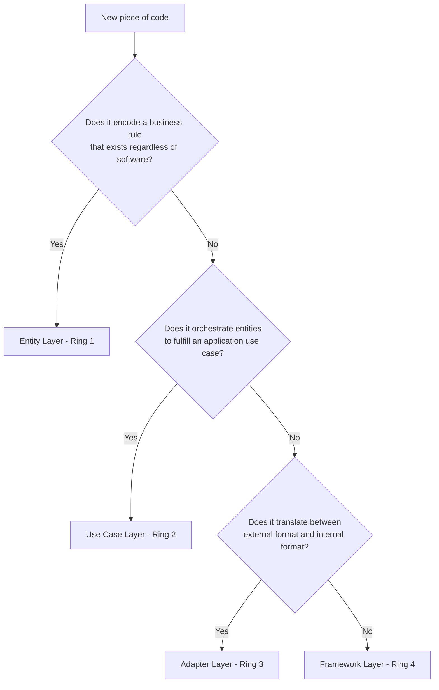

# Layers & Boundaries

## Why Layers Matter

A layer is not a folder convention — it is a **trust boundary**. Code inside a layer shares a common rate of change and a common reason to change. Code in different layers changes at different rates and for different reasons. When you co-locate code that changes at different rates, every change in the fast-moving code risks breaking the slow-moving code.

Clean Architecture defines exactly four layers (rings) and one inviolable rule governing their relationships: the Dependency Rule. This page dissects each layer, the boundary-crossing mechanisms, and the data structures that flow across them.

## First Principles — Separation of Concerns

The fundamental theorem of software architecture:

> Every software system can be decomposed into policy and mechanism. Policy encodes business rules. Mechanism encodes delivery details.

Clean Architecture extends this into a four-level hierarchy of policy:

$$
\text{Entity Policy} \supset \text{Use Case Policy} \supset \text{Adapter Policy} \supset \text{Framework Mechanism}
$$

Each level is a layer. Higher-level policy is more abstract, more stable, and closer to the business. Lower-level mechanism is more concrete, more volatile, and closer to I/O.

### The Stability Gradient


## Layer 1 — Entities (Enterprise Business Rules)

### What Lives Here

- **Domain entities**: Aggregate roots, child entities, value objects
- **Domain services**: Stateless operations that span multiple entities
- **Domain errors**: Custom error types for invariant violations
- **Domain events**: Events that record something that happened in the domain (types only — no bus)

### What Does NOT Live Here

- Repository interfaces (these live in the use-case layer or as ports)
- Serialization logic
- Validation of external input (that is an adapter concern)
- Any import from `node_modules` that isn't a pure utility (e.g., `uuid`)

### Entity Design Rules

1. **Entities protect their own invariants.** An `Order` that allows a negative quantity is a bug in the entity, not in the caller.
2. **Entities are always valid.** There is no concept of an "invalid entity" — the constructor or factory enforces validity.
3. **Entities have identity.** Two entities with the same attributes but different IDs are different entities.
4. **Value Objects have structural equality.** Two `Money` objects with the same amount and currency are the same.

```typescript
// domain/value-objects/money.ts
export class Money {
  private constructor(
    public readonly amount: number,
    public readonly currency: string,
  ) {
    if (!Number.isFinite(amount)) {
      throw new Error(`Invalid amount: ${amount}`);
    }
    if (amount < 0) {
      throw new Error(`Negative amount: ${amount}`);
    }
  }

  static of(amount: number, currency: string): Money {
    return new Money(Math.round(amount * 100) / 100, currency.toUpperCase());
  }

  static zero(currency: string): Money {
    return new Money(0, currency.toUpperCase());
  }

  add(other: Money): Money {
    this.assertSameCurrency(other);
    return new Money(this.amount + other.amount, this.currency);
  }

  subtract(other: Money): Money {
    this.assertSameCurrency(other);
    const result = this.amount - other.amount;
    if (result < 0) {
      throw new InsufficientFundsError(this, other);
    }
    return new Money(result, this.currency);
  }

  multiply(factor: number): Money {
    return new Money(
      Math.round(this.amount * factor * 100) / 100,
      this.currency,
    );
  }

  equals(other: Money): boolean {
    return this.amount === other.amount && this.currency === other.currency;
  }

  format(): string {
    return new Intl.NumberFormat('en-US', {
      style: 'currency',
      currency: this.currency,
    }).format(this.amount);
  }

  private assertSameCurrency(other: Money): void {
    if (this.currency !== other.currency) {
      throw new CurrencyMismatchError(this.currency, other.currency);
    }
  }
}
```

```typescript
// domain/entities/order.ts
import { Money } from '../value-objects/money';
import { OrderLine } from './order-line';
import type { OrderId } from '../value-objects/order-id';
import type { CustomerId } from '../value-objects/customer-id';
import type { ProductId } from '../value-objects/product-id';

export enum OrderStatus {
  Draft = 'DRAFT',
  Submitted = 'SUBMITTED',
  Confirmed = 'CONFIRMED',
  Shipped = 'SHIPPED',
  Delivered = 'DELIVERED',
  Cancelled = 'CANCELLED',
}

export class Order {
  private _lines: OrderLine[] = [];
  private _status: OrderStatus;
  private _events: DomainEvent[] = [];

  private constructor(
    public readonly id: OrderId,
    public readonly customerId: CustomerId,
    status: OrderStatus,
    lines: OrderLine[],
    public readonly createdAt: Date,
  ) {
    this._status = status;
    this._lines = [...lines];
  }

  static create(id: OrderId, customerId: CustomerId): Order {
    const order = new Order(id, customerId, OrderStatus.Draft, [], new Date());
    order.recordEvent({ type: 'OrderCreated', orderId: id.value, customerId: customerId.value });
    return order;
  }

  static reconstitute(
    id: OrderId,
    customerId: CustomerId,
    status: OrderStatus,
    lines: OrderLine[],
    createdAt: Date,
  ): Order {
    // No events recorded — this is rehydration from persistence
    return new Order(id, customerId, status, lines, createdAt);
  }

  get status(): OrderStatus {
    return this._status;
  }

  get lines(): ReadonlyArray<OrderLine> {
    return this._lines;
  }

  get total(): Money {
    if (this._lines.length === 0) return Money.zero('USD');
    return this._lines.reduce(
      (sum, line) => sum.add(line.subtotal),
      Money.zero(this._lines[0].unitPrice.currency),
    );
  }

  get events(): ReadonlyArray<DomainEvent> {
    return this._events;
  }

  clearEvents(): void {
    this._events = [];
  }

  addLine(productId: ProductId, quantity: number, unitPrice: Money): void {
    this.assertStatus(OrderStatus.Draft, 'add lines to');
    if (quantity <= 0) {
      throw new InvalidQuantityError(quantity);
    }
    const line = OrderLine.create(productId, quantity, unitPrice);
    this._lines.push(line);
  }

  removeLine(productId: ProductId): void {
    this.assertStatus(OrderStatus.Draft, 'remove lines from');
    const index = this._lines.findIndex((l) => l.productId.equals(productId));
    if (index === -1) {
      throw new LineNotFoundError(this.id, productId);
    }
    this._lines.splice(index, 1);
  }

  submit(): void {
    this.assertStatus(OrderStatus.Draft, 'submit');
    if (this._lines.length === 0) {
      throw new EmptyOrderError(this.id);
    }
    this._status = OrderStatus.Submitted;
    this.recordEvent({
      type: 'OrderSubmitted',
      orderId: this.id.value,
      total: this.total.amount,
      currency: this.total.currency,
    });
  }

  confirm(): void {
    this.assertStatus(OrderStatus.Submitted, 'confirm');
    this._status = OrderStatus.Confirmed;
  }

  cancel(): void {
    if (this._status === OrderStatus.Shipped || this._status === OrderStatus.Delivered) {
      throw new OrderAlreadyShippedError(this.id);
    }
    this._status = OrderStatus.Cancelled;
    this.recordEvent({ type: 'OrderCancelled', orderId: this.id.value });
  }

  private assertStatus(expected: OrderStatus, action: string): void {
    if (this._status !== expected) {
      throw new InvalidOrderStateError(this.id, action, expected, this._status);
    }
  }

  private recordEvent(event: DomainEvent): void {
    this._events.push(event);
  }
}
```

### Entity Testing

Entities are the easiest code to test — no mocks, no dependencies, no I/O:

```typescript
describe('Order', () => {
  it('should not allow submitting an empty order', () => {
    const order = Order.create(OrderId.generate(), CustomerId.of('cust-1'));
    expect(() => order.submit()).toThrow(EmptyOrderError);
  });

  it('should calculate total across lines', () => {
    const order = Order.create(OrderId.generate(), CustomerId.of('cust-1'));
    order.addLine(ProductId.of('p1'), 2, Money.of(10, 'USD'));
    order.addLine(ProductId.of('p2'), 1, Money.of(25, 'USD'));
    expect(order.total.equals(Money.of(45, 'USD'))).toBe(true);
  });

  it('should record OrderSubmitted event', () => {
    const order = Order.create(OrderId.generate(), CustomerId.of('cust-1'));
    order.addLine(ProductId.of('p1'), 1, Money.of(10, 'USD'));
    order.submit();
    expect(order.events).toHaveLength(2); // Created + Submitted
    expect(order.events[1].type).toBe('OrderSubmitted');
  });
});
```

## Layer 2 — Use Cases (Application Business Rules)

### What Lives Here

- **Interactors**: One class per use case, implementing an input boundary
- **Input/Output Boundaries**: Interfaces that define data contracts
- **Input/Output DTOs**: Simple data structures (no behaviour) for boundary crossing
- **Repository port interfaces**: Contracts for persistence operations
- **External service port interfaces**: Contracts for external APIs, messaging, etc.

### The Interactor Pattern

An interactor receives data through a request model, manipulates entities, and returns data through a response model:



```typescript
// application/ports/order.repository.ts
import type { Order } from '../../domain/entities/order';
import type { OrderId } from '../../domain/value-objects/order-id';

export interface OrderRepository {
  findById(id: OrderId): Promise<Order | null>;
  save(order: Order): Promise<void>;
  nextId(): OrderId;
}
```

```typescript
// application/use-cases/submit-order/submit-order.interactor.ts
import type { OrderRepository } from '../../ports/order.repository';
import type { EventBus } from '../../ports/event-bus';
import type { SubmitOrderInput, SubmitOrderOutput, SubmitOrderUseCase } from './submit-order.types';
import { OrderId } from '../../../domain/value-objects/order-id';
import { OrderNotFoundError } from '../../errors';

export class SubmitOrderInteractor implements SubmitOrderUseCase {
  constructor(
    private readonly orderRepo: OrderRepository,
    private readonly eventBus: EventBus,
  ) {}

  async execute(input: SubmitOrderInput): Promise<SubmitOrderOutput> {
    const orderId = OrderId.of(input.orderId);
    const order = await this.orderRepo.findById(orderId);

    if (!order) {
      throw new OrderNotFoundError(orderId);
    }

    // Domain logic — the entity enforces invariants
    order.submit();

    // Persist
    await this.orderRepo.save(order);

    // Publish domain events
    for (const event of order.events) {
      await this.eventBus.publish(event);
    }
    order.clearEvents();

    return {
      orderId: order.id.value,
      total: order.total.amount,
      currency: order.total.currency,
      submittedAt: new Date().toISOString(),
    };
  }
}
```

### Use Case Composition

For complex workflows, compose use cases rather than creating God interactors:

```typescript
// application/use-cases/checkout/checkout.interactor.ts
export class CheckoutInteractor implements CheckoutUseCase {
  constructor(
    private readonly validateInventory: ValidateInventoryUseCase,
    private readonly processPayment: ProcessPaymentUseCase,
    private readonly submitOrder: SubmitOrderUseCase,
    private readonly sendConfirmation: SendConfirmationUseCase,
  ) {}

  async execute(input: CheckoutInput): Promise<CheckoutOutput> {
    // Step 1: Validate inventory
    const inventoryResult = await this.validateInventory.execute({
      orderId: input.orderId,
    });

    if (!inventoryResult.available) {
      return { success: false, reason: 'INSUFFICIENT_INVENTORY' };
    }

    // Step 2: Process payment
    const paymentResult = await this.processPayment.execute({
      orderId: input.orderId,
      paymentMethodId: input.paymentMethodId,
    });

    if (!paymentResult.success) {
      return { success: false, reason: 'PAYMENT_FAILED' };
    }

    // Step 3: Submit order
    const orderResult = await this.submitOrder.execute({
      orderId: input.orderId,
      submittedBy: input.userId,
    });

    // Step 4: Send confirmation (fire-and-forget)
    await this.sendConfirmation.execute({
      orderId: orderResult.orderId,
      email: input.email,
    });

    return {
      success: true,
      orderId: orderResult.orderId,
      paymentId: paymentResult.paymentId,
    };
  }
}
```

## Layer 3 — Interface Adapters

### What Lives Here

- **Controllers**: Translate HTTP/gRPC/CLI input into use-case DTOs
- **Presenters**: Translate use-case output into view models
- **Repository implementations**: Translate between entities and database rows/documents
- **External service clients**: Implement port interfaces using HTTP clients, SDKs
- **Mappers**: Dedicated classes for entity ↔ persistence model conversion
- **DTOs for external formats**: JSON schemas, Protobuf messages, GraphQL types

### The Controller

A controller's only job is to **disassemble** an external request into a use-case DTO and **reassemble** the use-case output into an external response:

```typescript
// adapters/http/controllers/order.controller.ts
import type { Request, Response, NextFunction } from 'express';
import type { SubmitOrderUseCase } from '../../../application/use-cases/submit-order/submit-order.types';
import type { CreateOrderUseCase } from '../../../application/use-cases/create-order/create-order.types';

export class OrderController {
  constructor(
    private readonly createOrder: CreateOrderUseCase,
    private readonly submitOrder: SubmitOrderUseCase,
  ) {}

  async handleCreate(req: Request, res: Response, next: NextFunction): Promise<void> {
    try {
      // Parse & validate external input
      const input = {
        customerId: req.body.customerId,
        lines: (req.body.lines ?? []).map((l: any) => ({
          productId: l.productId,
          quantity: l.quantity,
          unitPrice: l.unitPrice,
          currency: l.currency ?? 'USD',
        })),
      };

      const output = await this.createOrder.execute(input);

      res.status(201).json({
        data: {
          id: output.orderId,
          total: output.total,
          currency: output.currency,
          status: output.status,
        },
      });
    } catch (error) {
      next(error);
    }
  }

  async handleSubmit(req: Request, res: Response, next: NextFunction): Promise<void> {
    try {
      const output = await this.submitOrder.execute({
        orderId: req.params.id,
        submittedBy: req.user!.id,
      });

      res.status(200).json({
        data: {
          id: output.orderId,
          total: output.total,
          currency: output.currency,
          submittedAt: output.submittedAt,
        },
      });
    } catch (error) {
      next(error);
    }
  }
}
```

### The Repository Implementation

The repository adapter translates between domain entities and persistence models. This is where you encode all knowledge of database schemas, ORM quirks, and SQL:

```typescript
// adapters/persistence/postgres/order.repository.ts
import type { Pool } from 'pg';
import type { OrderRepository } from '../../../application/ports/order.repository';
import { Order, OrderStatus } from '../../../domain/entities/order';
import { OrderId } from '../../../domain/value-objects/order-id';
import { CustomerId } from '../../../domain/value-objects/customer-id';
import { ProductId } from '../../../domain/value-objects/product-id';
import { OrderLine } from '../../../domain/entities/order-line';
import { Money } from '../../../domain/value-objects/money';
import { v4 as uuid } from 'uuid';

interface OrderRow {
  id: string;
  customer_id: string;
  status: string;
  created_at: Date;
}

interface OrderLineRow {
  order_id: string;
  product_id: string;
  quantity: number;
  unit_price: number;
  currency: string;
}

export class PostgresOrderRepository implements OrderRepository {
  constructor(private readonly pool: Pool) {}

  async findById(id: OrderId): Promise<Order | null> {
    const client = await this.pool.connect();
    try {
      const orderResult = await client.query<OrderRow>(
        'SELECT id, customer_id, status, created_at FROM orders WHERE id = $1',
        [id.value],
      );

      if (orderResult.rows.length === 0) return null;

      const row = orderResult.rows[0];

      const lineResult = await client.query<OrderLineRow>(
        'SELECT product_id, quantity, unit_price, currency FROM order_lines WHERE order_id = $1',
        [id.value],
      );

      const lines = lineResult.rows.map((lr) =>
        OrderLine.reconstitute(
          ProductId.of(lr.product_id),
          lr.quantity,
          Money.of(lr.unit_price, lr.currency),
        ),
      );

      return Order.reconstitute(
        OrderId.of(row.id),
        CustomerId.of(row.customer_id),
        row.status as OrderStatus,
        lines,
        row.created_at,
      );
    } finally {
      client.release();
    }
  }

  async save(order: Order): Promise<void> {
    const client = await this.pool.connect();
    try {
      await client.query('BEGIN');

      await client.query(
        `INSERT INTO orders (id, customer_id, status, created_at)
         VALUES ($1, $2, $3, $4)
         ON CONFLICT (id) DO UPDATE SET status = $3`,
        [order.id.value, order.customerId.value, order.status, order.createdAt],
      );

      // Delete existing lines and re-insert (simpler than diffing)
      await client.query('DELETE FROM order_lines WHERE order_id = $1', [order.id.value]);

      for (const line of order.lines) {
        await client.query(
          `INSERT INTO order_lines (order_id, product_id, quantity, unit_price, currency)
           VALUES ($1, $2, $3, $4, $5)`,
          [order.id.value, line.productId.value, line.quantity, line.unitPrice.amount, line.unitPrice.currency],
        );
      }

      await client.query('COMMIT');
    } catch (error) {
      await client.query('ROLLBACK');
      throw error;
    } finally {
      client.release();
    }
  }

  nextId(): OrderId {
    return OrderId.of(uuid());
  }
}
```

### The Presenter Pattern

In web APIs the presenter is often implicit (the controller formats JSON directly), but for rich UIs or multiple output formats, an explicit presenter is valuable:

```typescript
// adapters/presenters/order-summary.presenter.ts
import type { SubmitOrderOutput } from '../../application/use-cases/submit-order/submit-order.types';

export interface OrderSummaryViewModel {
  orderId: string;
  formattedTotal: string;
  submittedAt: string;
  confirmationMessage: string;
}

export class OrderSummaryPresenter {
  present(output: SubmitOrderOutput): OrderSummaryViewModel {
    const formatter = new Intl.NumberFormat('en-US', {
      style: 'currency',
      currency: output.currency,
    });

    return {
      orderId: output.orderId,
      formattedTotal: formatter.format(output.total),
      submittedAt: new Date(output.submittedAt).toLocaleDateString('en-US', {
        weekday: 'long',
        year: 'numeric',
        month: 'long',
        day: 'numeric',
      }),
      confirmationMessage: `Order ${output.orderId} submitted for ${formatter.format(output.total)}.`,
    };
  }
}
```

## Layer 4 — Frameworks & Drivers

### What Lives Here

- **Framework configuration**: Express app setup, middleware registration, route mounting
- **Database connection setup**: Pool configuration, migration runners
- **DI container configuration**: Wiring all layers together
- **Infrastructure concerns**: Logging configuration, metrics setup, health checks

### The Composition Root

This is where all layers are wired together — the only place in the codebase that knows about every concrete class:

```typescript
// infrastructure/composition-root.ts
import { Pool } from 'pg';
import express from 'express';
import { PostgresOrderRepository } from '../adapters/persistence/postgres/order.repository';
import { SubmitOrderInteractor } from '../application/use-cases/submit-order/submit-order.interactor';
import { CreateOrderInteractor } from '../application/use-cases/create-order/create-order.interactor';
import { OrderController } from '../adapters/http/controllers/order.controller';
import { KafkaEventBus } from '../adapters/messaging/kafka/event-bus';
import { orderRoutes } from './routes/order.routes';

export function createApp(config: AppConfig): express.Application {
  // Infrastructure
  const pool = new Pool({
    host: config.db.host,
    port: config.db.port,
    database: config.db.name,
    user: config.db.user,
    password: config.db.password,
    max: config.db.poolSize,
  });

  const eventBus = new KafkaEventBus(config.kafka.brokers);

  // Repositories (Ring 3 implementations of Ring 2 interfaces)
  const orderRepo = new PostgresOrderRepository(pool);

  // Use cases (Ring 2)
  const submitOrder = new SubmitOrderInteractor(orderRepo, eventBus);
  const createOrder = new CreateOrderInteractor(orderRepo);

  // Controllers (Ring 3)
  const orderController = new OrderController(createOrder, submitOrder);

  // Framework (Ring 4)
  const app = express();
  app.use(express.json());
  app.use('/api/orders', orderRoutes(orderController));

  return app;
}
```

## Boundary-Crossing Mechanics

### The Boundary Interface Pattern

When an inner layer needs to invoke an outer layer (e.g., a use case needs to save to a database), we use **dependency inversion**: the inner layer defines an interface (port), the outer layer implements it.



At compile time, the interactor depends only on the interface. At runtime, the DI container injects the concrete implementation.

### Data Crossing Boundaries

Data structures that cross boundaries must be **plain data** — no entity references, no framework types. Each boundary defines its own request/response model:

```
HTTP Request (Ring 4)
    ↓ parsed by Controller (Ring 3)
Input DTO (Ring 2 boundary)
    ↓ consumed by Interactor (Ring 2)
Entity manipulation (Ring 1)
    ↓ result mapped by Interactor (Ring 2)
Output DTO (Ring 2 boundary)
    ↓ formatted by Presenter/Controller (Ring 3)
HTTP Response (Ring 4)
```

Each DTO is specific to its boundary:

```typescript
// Ring 2: Application boundary types
export interface CreateOrderInput {
  customerId: string;
  lines: Array<{
    productId: string;
    quantity: number;
    unitPrice: number;
    currency: string;
  }>;
}

export interface CreateOrderOutput {
  orderId: string;
  total: number;
  currency: string;
  status: string;
}
```

```typescript
// Ring 3: HTTP-specific types (never leaked into Ring 2)
export interface CreateOrderRequestBody {
  customer_id: string;  // snake_case from API
  lines: Array<{
    product_id: string;
    qty: number;
    price: number;
    ccy?: string;
  }>;
}

export interface CreateOrderResponseBody {
  data: {
    id: string;
    total: string;        // formatted string
    currency: string;
    status: string;
    _links: {
      self: string;
      submit: string;
    };
  };
}
```

## Edge Cases & Failure Modes

### 1. Anemic Entities

When entities are just data bags and all logic lives in interactors, you have an anemic domain model. This defeats the purpose of Ring 1.

::: danger Anti-Pattern: Anemic Entity
```typescript
export class Order {
  id: string;
  status: string;
  lines: OrderLine[];
  // No methods — just public fields
}

// All logic in the interactor
export class SubmitOrderInteractor {
  async execute(input: SubmitOrderInput) {
    const order = await this.repo.findById(input.orderId);
    if (order.lines.length === 0) throw new Error('Empty');
    if (order.status !== 'DRAFT') throw new Error('Wrong status');
    order.status = 'SUBMITTED'; // Direct mutation
    await this.repo.save(order);
  }
}
```
:::

::: tip Correct: Rich Entity
```typescript
export class Order {
  // Private fields, enforced invariants
  submit(): void {
    if (this._lines.length === 0) throw new EmptyOrderError(this.id);
    this.assertStatus(OrderStatus.Draft, 'submit');
    this._status = OrderStatus.Submitted;
  }
}

export class SubmitOrderInteractor {
  async execute(input: SubmitOrderInput) {
    const order = await this.repo.findById(OrderId.of(input.orderId));
    order.submit(); // Entity enforces its own rules
    await this.repo.save(order);
  }
}
```
:::

### 2. Repository Returns Raw Rows

If the repository returns database rows instead of entities, every use case is coupled to the database schema.

### 3. Cross-Layer DTOs

Using the same DTO type across multiple boundaries creates hidden coupling. When the API response format changes, it should not require changing the use-case output type.

### 4. Boundary Leaks via Exceptions

If a database-specific exception (e.g., `UniqueViolationError` from pg) propagates to the use case, you have a boundary leak. Repositories should catch infrastructure exceptions and translate them to domain exceptions.

```typescript
async save(order: Order): Promise<void> {
  try {
    await this.pool.query(/* ... */);
  } catch (error: any) {
    if (error.code === '23505') { // Postgres unique violation
      throw new DuplicateOrderError(order.id);
    }
    throw new PersistenceError('Failed to save order', { cause: error });
  }
}
```

## Performance Characteristics

### Mapping Overhead

For a typical REST API request:

| Step | Time | Notes |
|------|------|-------|
| HTTP parsing → Controller DTO | ~5 µs | JSON.parse + field extraction |
| Controller DTO → Use Case Input | ~1 µs | Object spread / constructor |
| Entity hydration from DB row | ~10 µs | Constructor + value object creation |
| Entity dehydration to DB row | ~8 µs | Field extraction |
| Use Case Output → HTTP Response | ~3 µs | Object construction + format |
| **Total mapping overhead** | **~27 µs** | **< 0.1% of a 30 ms request** |

### Memory Overhead

Each boundary crossing creates a new object. For a request that processes one order with 10 lines:

$$
\text{Extra allocations} = \underbrace{1}_{\text{input DTO}} + \underbrace{1}_{\text{entity}} + \underbrace{10}_{\text{lines}} + \underbrace{10}_{\text{value objects}} + \underbrace{1}_{\text{output DTO}} = 23 \text{ objects}
$$

At ~100 bytes per object, that is 2.3 KB — trivial for V8's generational garbage collector.

::: info War Story
**The Monolith That Couldn't Change**

A logistics company had a 400K-line Node.js monolith where database row types were used directly in API controllers. When they needed to switch from a MySQL `DATETIME` to a Unix timestamp (to support a new mobile client), the change touched 347 files across 42 modules.

After adopting Clean Architecture layer boundaries, a similar schema change the following year touched exactly 4 files: the migration, the repository mapper, and two unit tests. The boundary between Ring 2 (use cases) and Ring 3 (adapters) absorbed the change completely.

The team estimated the layered approach saved 3 weeks of development and prevented a high-severity production incident (the MySQL change had caused timezone bugs that took 2 days to debug).
:::

## Mathematical Foundations — Information Hiding

David Parnas formalized the concept of information hiding in 1972. Each layer in Clean Architecture is a **module** in Parnas's sense — it hides a design decision behind an interface.

The information hidden by each layer:

| Layer | Hidden Design Decision |
|-------|----------------------|
| Entities | How business rules are computed |
| Use Cases | How application workflows are orchestrated |
| Adapters | How external systems are accessed |
| Frameworks | Which specific libraries/tools are used |

The **entropy** of a layer is proportional to the number of external dependencies it conceals:

$$
H(L_i) = -\sum_{d \in D_i} p(d) \log_2 p(d)
$$

Where $D_i$ is the set of design decisions hidden by layer $i$ and $p(d)$ is the probability that decision $d$ changes in a given time period.

Outer layers have higher entropy (more likely to change). By isolating high-entropy components behind interfaces, Clean Architecture minimizes the propagation of change.

## Enforcement Strategies

### Compile-Time: TypeScript Project References

```json
// tsconfig.domain.json
{
  "compilerOptions": {
    "composite": true,
    "outDir": "./dist/domain",
    "rootDir": "./src/domain"
  },
  "include": ["src/domain/**/*"],
  "references": []  // Domain depends on NOTHING
}

// tsconfig.application.json
{
  "compilerOptions": {
    "composite": true,
    "outDir": "./dist/application",
    "rootDir": "./src/application"
  },
  "include": ["src/application/**/*"],
  "references": [
    { "path": "./tsconfig.domain.json" }  // Only domain
  ]
}

// tsconfig.adapters.json
{
  "compilerOptions": {
    "composite": true,
    "outDir": "./dist/adapters",
    "rootDir": "./src/adapters"
  },
  "include": ["src/adapters/**/*"],
  "references": [
    { "path": "./tsconfig.domain.json" },
    { "path": "./tsconfig.application.json" }
  ]
}
```

### CI-Time: dependency-cruiser

```javascript
// .dependency-cruiser.cjs
module.exports = {
  forbidden: [
    {
      name: 'domain-not-depend-on-application',
      severity: 'error',
      from: { path: '^src/domain' },
      to: { path: '^src/application' },
    },
    {
      name: 'domain-not-depend-on-adapters',
      severity: 'error',
      from: { path: '^src/domain' },
      to: { path: '^src/adapters' },
    },
    {
      name: 'application-not-depend-on-adapters',
      severity: 'error',
      from: { path: '^src/application' },
      to: { path: '^src/adapters' },
    },
    {
      name: 'no-framework-in-domain',
      severity: 'error',
      from: { path: '^src/domain' },
      to: { path: 'node_modules/(express|pg|kafkajs)' },
    },
  ],
};
```

## Decision Framework — Layer Allocation

When you are unsure where a piece of code belongs, use this flowchart:



## Further Reading

- [Use Cases](./use-cases) — input/output boundary design, interactor testing
- [Entities vs Models](./entities-vs-models) — domain entities vs persistence vs API models
- [TypeScript Implementation](./typescript-implementation) — full project walkthrough
- [Hexagonal: Ports & Adapters](/architecture-patterns/hexagonal/ports-and-adapters) — the pattern that inspired adapter design
- [DDD: Tactical Design](/architecture-patterns/domain-driven-design/tactical-design) — entity and value object patterns in depth
